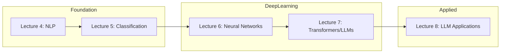

# Lectures 5-8: ML/AI Series Plan

This plan outlines four lectures that build progressively from classification fundamentals through neural networks to modern LLM applications. Content draws from `lectures_24/05-08` and `lectures_25/2025/` Notion exports, adapted for the current year's format.

## Execution Approach

**Carry over content rather than reformulating**:

- Preserve existing lecture prose, visuals, and humor (XKCD comics, diagrams)
- Supplement with reference cards and short code snippets where missing (or existing are excessively long)
- Add brief prose introductions at the start of each topic where helpful

**Notion-flavored markdown format**:

- `# Section` (single #) for major sections
- `## Subsection` (double ##) for individual topics/methods
- No page title line (title is implicit from filename)
- Multiple H1s allowed per document

**What to preserve**:

- All XKCD comics and visuals between sections
- Story/parable content (e.g., "tank or not-a-tank")
- Existing code examples and reference cards
- Diagrams and architecture visualizations

## Content Progression



**Key principle**: Lecture 4 already covered tokenization, bag-of-words, n-grams, TF-IDF, and intro-level NLP—these need not be repeated. Classification naturally follows as the next step (applying models to the text representations learned in lecture 4).

---

## Lecture 5: Classification

**Title**: "Putting a Label on Things"

**Primary Sources**:

- [lectures_24/05/lecture_05.md](lectures_24/05/lecture_05.md) (1223 lines, comprehensive)
- [lectures_25/2025/Putting a label on things](lectures_25/2025/Putting%20a%20label%20on%20things%209a7cd21131f24330a84d27123932d201.md)
- [lectures_25/2025/Classification, continued](lectures_25/2025/Classification,%20continued%20feecfbe6099741bab6cddb7f1b6b5813.md)

**Core Topics**:

- Regression vs classification distinction
- Model evaluation metrics: precision, recall, F1, accuracy, ROC/AUC, confusion matrix
- Train/test splits (`train_test_split`) and cross-validation (`KFold`, `cross_val_score`)
- Core classifiers: LogisticRegression, RandomForestClassifier, XGBClassifier
- Handling imbalanced data with SMOTE
- Model interpretation with SHAP and eli5
- How models fail: overfitting, underfitting, dataset shift, Simpson's paradox

**Demos** (adapt from `lectures_24/05/demo/`):

1. Binary classification with synthetic diabetes data
2. Feature engineering from sensor data + model comparison
3. Imbalanced classification with categorical encoding

**Assignment** (adapt from `refs/exercises/4-classification/`):

- EMNIST digit/letter classification showdown
- Full k-fold cross-validation workflow

**Repurpose**:

- Reference cards for `confusion_matrix`, `roc_curve`, `roc_auc_score`, `train_test_split`
- SHAP/eli5 visualization examples
- All model code snippets from lectures_24/05

---

## Lecture 6: Neural Networks

**Title**: "If I Only Had a Brain"

**Primary Sources**:

- [lectures_24/06/lecture_06.md](lectures_24/06/lecture_06.md) (1204 lines)
- [lectures_25/2025/Neural Networks If I only had a brain](lectures_25/2025/Neural%20Networks%20If%20I%20only%20had%20a%20brain%20efe26c6a7fb84b28b2ae63b1a743d5bd.md) (763 lines)

**Core Topics**:

- Biological inspiration and artificial neurons
- Activation functions: ReLU, sigmoid, tanh (comparison table)
- Input preparation: normalization, standardization, feature encoding
- Training: backpropagation, gradient descent, cost functions
- Network architecture: shallow vs deep, dense vs sparse, skip connections
- CNN fundamentals: convolutional layers, pooling, hierarchical features
- RNN/LSTM for sequential data
- Model saving and checkpoints
- TensorBoard monitoring

**Demos** (adapt from `lectures_24/06/demo/` and `refs/exercises/6-neural_nets/`):

1. Animal identifier (CNN classification)
2. Custom MLP from scratch (EMNIST)
3. LSTM for time series or clinical notes

**Assignment**:

- Build and train a simple neural network on health data
- Compare performance to classical classifiers from lecture 5

**Repurpose**:

- "Tank or not-a-tank" story (data bias parable)
- Universal Approximation Theorem visualization
- Keras and PyTorch code snippets side-by-side
- CNN vs RNN comparison table
- LSTM architecture diagrams

---

## Lecture 7: Transformers & LLMs

**Title**: "More Than Meets the Eye" (or "Attention is All You Need")

**Primary Sources**:

- [lectures_24/07/lecture_07.md](lectures_24/07/lecture_07.md) (609 lines)
- [lectures_25/2025/Neural Networks](lectures_25/2025/Neural%20Networks%20If%20I%20only%20had%20a%20brain%20efe26c6a7fb84b28b2ae63b1a743d5bd.md) (transformers section, lines 378-460)
- [lectures_25/2025/Whirlwind Tour of LLMs](lectures_25/2025/%F0%9F%8C%AA%EF%B8%8F%20Whirlwind%20Tour%20of%20LLMs%2020e691a125bb41c99abe95581cb140bf.md) (history and concepts sections)

**Core Topics**:

- Transformer architecture: parallel processing, self-attention, multi-head attention
- Attention mechanism visualization
- Latent space and embeddings (word2vec concepts, semantic similarity)
- Pre-trained models and fine-tuning workflow
- LLM API integration: OpenAI, Anthropic, HuggingFace Inference
- Prompt engineering: zero-shot, few-shot learning
- Structured outputs and function calling for schema compliance

**Demos** (adapt from `lectures_24/07/` and `refs/exercises/7-LLMs/`):

1. K-fold model selection workflow
2. nanoGPT exploration (DIY GPT walkthrough)
3. LLM API chat application (basic client + CLI)

**Assignment**:

- Use LLM API for clinical text extraction
- Implement structured output with validation

**Repurpose**:

- Transformer architecture diagrams (basic, moderate, detailed)
- Attention visualization GIFs
- Fine-tuning code example (GPT-2 with HuggingFace Trainer)
- LLMClient class and CLI implementation

---

## Lecture 8: LLM Applications & Workflows

**Title**: "Whirlwind Tour of LLM Tooling"

**Primary Sources**:

- [lectures_25/2025/Whirlwind Tour of LLMs](lectures_25/2025/%F0%9F%8C%AA%EF%B8%8F%20Whirlwind%20Tour%20of%20LLMs%2020e691a125bb41c99abe95581cb140bf.md) (practical sections)
- [lectures_24/08/lecture_08.md](lectures_24/08/lecture_08.md) (Computer Vision - may repurpose or defer)
- `refs/exercises/8-embeddings/`

**Core Topics**:

- When to use LLMs (decision framework)
- Common failure modes: hallucinations, prompt injection, inconsistency
- RAG (Retrieval-Augmented Generation): chunking, vector DBs, retrieval
- Agentic LLMs: tool use, multi-turn iteration, state management
- Workflow orchestration patterns:
    - Prompt chaining
    - Parallelization
    - Orchestrator-workers
    - Evaluator-optimizer loops
    - Guardrails (PII/PHI detection, hallucination detection)
- MCP (Model Context Protocol) for data source integration
- Practical patterns: routing, deterministic steps, human-in-the-loop

**Demos** (new, based on Whirlwind Tour patterns):

1. Embedding similarity search for documents
2. Simple RAG pipeline with health documents
3. Agentic workflow with tool calling

**Assignment**:

- Build a simple RAG application or structured extraction pipeline
- Apply guardrails for PHI detection

**Note on Computer Vision**: The original lecture_08 in lectures_24 covered Computer Vision (CNNs for medical imaging, transfer learning, U-Net segmentation). Consider:

- Moving CV to a later lecture or optional module
- Or integrating select CV concepts into lecture 6 (CNNs) as a brief section

---

## Shared Resources to Reuse

| Resource                | Location                            | Use In                                |
| ----------------------- | ----------------------------------- | ------------------------------------- |
| XKCD comics             | lectures_24/*/media/                | All lectures (humor between sections) |
| Evaluation diagrams     | lectures_24/05/media/evaluation.png | Lecture 5                             |
| Neural network diagrams | lectures_24/06/media/               | Lecture 6                             |
| Transformer diagrams    | lectures_24/07/media/               | Lecture 7                             |
| SHAP/eli5 plots         | lectures_24/05/media/               | Lecture 5                             |

## Exercise Materials to Adapt

| Exercise Folder                    | Adapt For                    |
| ---------------------------------- | ---------------------------- |
| `refs/exercises/4-classification/` | Lecture 5 assignment         |
| `refs/exercises/6-neural_nets/`    | Lecture 6 demos + assignment |
| `refs/exercises/7-LLMs/`           | Lecture 7 demos              |
| `refs/exercises/8-embeddings/`     | Lecture 8 demos              |

## Key Differences from Last Year

1. **NLP already covered**: Lecture 4 handles tokenization/TF-IDF, so lecture 5 jumps directly into classification
2. **LLM content expanded**: Two lectures (7-8) now cover LLMs vs one combined lecture
3. **Computer Vision deferred**: May move to optional content or a later lecture
4. **Agentic/workflow patterns**: New content from Whirlwind Tour not in lectures_24

## File Structure for Each Lecture

```
lectures/0X/
├── lecture_0X.md          # Main lecture content
├── media/                 # Images, diagrams, XKCD comics
├── demo/
│   ├── 01a_*.md          # Demo 1 walkthrough
│   ├── 02a_*.md          # Demo 2 walkthrough
│   └── 03a_*.md          # Demo 3 walkthrough
└── assignment/
    ├── README.md         # Assignment instructions
    ├── *.py or *.ipynb   # Starter code
    └── .github/
        ├── tests/        # pytest autograder
        └── workflows/    # GitHub Actions
```
