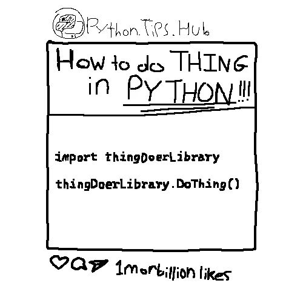
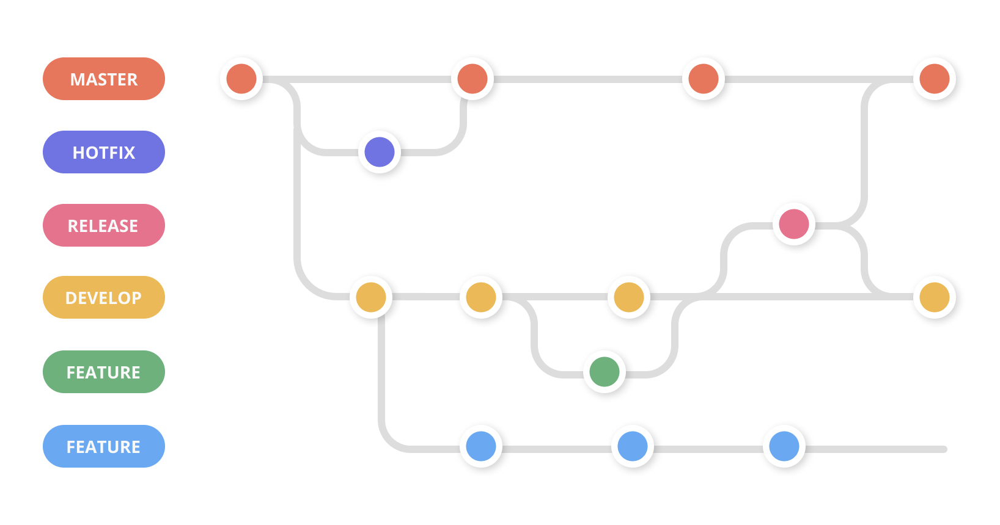
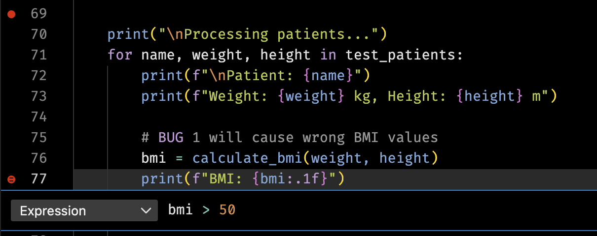
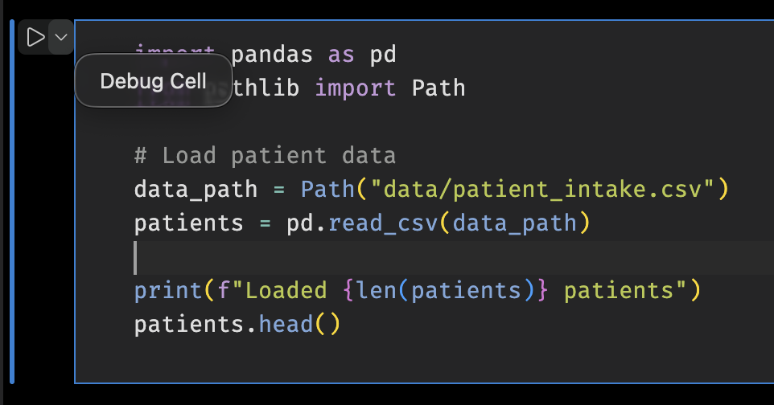

01: Defensive Programming and Debugging 🐛

- hw01 - <https://classroom.github.com/a/UIovekSt>

# Links & Self-Guided Review

- [GitHub Education](https://education.github.com/pack)
- [DS-217 Lecture 01](https://www.notion.so/01-Python-the-Command-Line-and-VS-Code-271d9fdd1a1a805784e1fe68dc985696?pvs=21)
- [Markdown Tutorial](https://www.markdownguide.org/basic-syntax/)
- [Shell Basics](https://swcarpentry.github.io/shell-novice/)
- [Exercism Python Basics](https://exercism.org/tracks/python)
- [GitHub Hello World](https://docs.github.com/en/get-started/start-your-journey/hello-world)

# But First, A Blast from the Past

## Carryovers from DataSci-217


- You already know Python, git/Markdown, and VS Code basics—this lecture focuses on reliability and debugging.
- Pick a workflow (local venv or Codespaces) and stick with it to reduce surprises.

### Reference: DS-217 carryovers

| Topic         | What to reuse                       |
| ------------- | ----------------------------------- |
| Python basics | Functions, imports, venv activation |
| Git hygiene   | Small commits, meaningful messages  |
| Markdown      | Headings, fenced code blocks, links |

### Code Snippet: Warmup commands

```bash
python -m venv .venv && source .venv/bin/activate
git status && git commit -am "chore: warm up"
```

## Command line quick hits

- Same commands everywhere: use the CLI for speed and reproducibility.
- Shell in Jupyter works too (`!ls`, `!pwd`), but keep paths relative.

### Reference: Workflow commands

| Command          | Purpose                   |
| ---------------- | ------------------------- |
| `pwd`            | Show current directory    |
| `ls -la`         | List files (long, hidden) |
| `cd <path>`      | Change directory          |
| `cp <src> <dst>` | Copy files                |
| `mv <src> <dst>` | Move/rename               |
| `rm <file>`      | Remove file (careful)     |

### Code Snippet: Shell basics

```bash
pwd
ls -la
cd lectures/01
```

## Workflow: local venv or Codespaces



- Try the different ways of doing things and pick one workflow (local venv or Codespaces) and stick to it for fewer surprises.
- Local venv for performance/PHI; Codespaces for consistency and easy onboarding.
- Windows: WSL2 + `.venv/Scripts/activate` mirrors Linux/Codespaces.
- VS Code: Python + Jupyter extensions, format-on-save, debugger panel.

> [!WARNING]
> Beware of Symantec Firewall and WSL, they do **NOT** like each other.

### Reference: Workflow setup

| Command                           | Purpose                     |
| --------------------------------- | --------------------------- |
| `python -m venv .venv`            | Create isolated environment |
| `source .venv/bin/activate`       | Activate venv (Linux/macOS) |
| `.venv\\Scripts\\activate`        | Activate venv (Windows)     |
| `pip install -r requirements.txt` | Install course dependencies |

### Code Snippet: venv + install

```bash
python -m venv .venv
source .venv/bin/activate  # Windows: .venv\\Scripts\\activate
pip install -r requirements.txt
```

## Notebook hygiene and reproducibility


- Run-all ready, deterministic, and no stray outputs or secrets.
- Clear outputs before commits unless the output is the point.
- Keep configs/paths in YAML or `.env`

### Reference: Notebook hygiene

| Practice             | Why it matters                    |
| -------------------- | --------------------------------- |
| Clear outputs        | Prevent stale screenshots/results |
| Defined requirements | Reproducible environments         |
| Relative paths       | Portability across machines       |

### Code Snippet: Clear outputs

```bash
jupyter nbconvert --ClearOutputPreprocessor.enabled=True --inplace lecture.ipynb
```


## YAML essentials for config files 🧾

- YAML = “Yet Another Markup Language,” but think “plain-English JSON” with indentation-based structure.
- Use **spaces, not tabs**, and keep indentation consistent (two spaces is plenty).
- Strings don’t need quotes unless they contain special characters; `#` starts a comment.
- Great for centralizing run-time knobs like file paths, thresholds, or feature flags.

### Reference Card: YAML building blocks

| Concept          | YAML syntax example                      | Tip for beginners                        |
| ---------------- | ---------------------------------------- | ---------------------------------------- |
| Key/value        | `project: intake_audit`                  | Keys end with `:` followed by a value    |
| Nested structure | `data:\n  input_file: data/patients.csv` | Indentation defines hierarchy            |
| Lists            | `emails:\n  - alice@example.com`         | Dashes introduce list items              |
| Inline objects   | `height_cm: { min: 120, max: 230 }`      | Use cautiously; easier to read multiline |

### Code Snippet: Sample `config.yaml`

```yaml
data:
    input_file: "data/patient_intake.csv"

bounds:
    weight_kg:
        min: 30
        max: 250
    height_cm:
        min: 120
        max: 230

bmi_thresholds:
    underweight: 18.5
    normal: 25
    overweight: 30 # obese is anything above this
```

### Code Snippet: Load YAML safely

```python
from pathlib import Path
import yaml

CONFIG_PATH = Path("config.yaml")

with CONFIG_PATH.open() as f:
    config = yaml.safe_load(f)  # safe_load avoids executing arbitrary code

print("BMI thresholds:", config["bmi_thresholds"])
```

## Config Alternative: `.env`

`dot-env` is a simple way to manage environment variables in Python. It allows you to store sensitive information like API keys and database credentials in a `.env` file, which is not committed to version control.

### Reference: `.env`

- [Python-dotenv](https://github.com/theskumar/python-dotenv)
- [os](https://docs.python.org/3/library/os.html)

### Code Snippet: `.env`

```bash
# This would be the .env file
API_KEY=your_api_key_here
DB_PASSWORD=your_db_password_here
```

```python
import os
import dotenv

# Load environment variables from .env file
dotenv.load_dotenv()
dotenv.load_dotenv("filename.env") # Can also specify a different filename

API_KEY = os.getenv("API_KEY")
DB_PASSWORD = os.getenv("DB_PASSWORD")

```

## Jupyter magics & shell in notebooks

- Magics speed up debugging and profiling; shell commands help inspect files without leaving the notebook.

### Reference: Jupyter magics

| Magic            | Purpose                     |
| ---------------- | --------------------------- |
| `%pwd`, `%ls`    | Where am I / list files     |
| `%run script.py` | Run another script/notebook |
| `%timeit expr`   | Quick timing                |
| `%%bash`         | Run a bash cell             |
| `!ls data`       | Shell command from a cell   |

### Code Snippet: Magics

```python
%pwd
%timeit [x**2 for x in range(1000)]
!ls data
```

## Git/GitHub/Markdown in 5 minutes



- Minimal loop: status → add → commit → push.
- Markdown: one `# Title`, structured headings, fenced code blocks.
- GUI (VS Code Source Control) is fine if it keeps you moving.

### Reference: Git/Markdown cheatsheet

| Command                         | Purpose                     |
| ------------------------------- | --------------------------- |
| `git status`                    | See staged/unstaged changes |
| `git add <path>`                | Stage files                 |
| `git commit -m "feat: message"` | Save a snapshot             |
| `git push`                      | Sync to GitHub              |
| `git config user.email`         | Set author email            |

| Markdown      | Purpose                   |
| ------------- | ------------------------- |
| `# Heading`   | Section titles            |
| `- bullet`    | Lists                     |
| ` ` `lang`    | Code fences with language |
| `[text](url)` | Links                     |
| `` | Images                    |
| `**bold**`   | Bold text                 |
| `_italic_` | Italic text               |
| `> quote`     | Blockquotes               |

### Code Snippet: Git loop

```bash
git status
git add README.md
git commit -m "chore: refresh setup notes"
git push
```


# LIVE DEMO

# Defensive programming for data science

## Common failure modes in data projects


- Missing columns, unexpected units, unseeded randomness.
- Environment drift: different Python versions or stale venvs.
- PHI leaks via logs or screenshots.

### Reference: Failure modes

| Risk            | Quick defense                         |
| --------------- | ------------------------------------- |
| Missing columns | Assert expected columns               |
| Unit drift      | Normalize units + validate ranges     |
| Stale env       | Recreate venv from `requirements.txt` |

### Code Snippet: Assert schema

```python
def assert_expected_columns(df, expected):
    missing = [c for c in expected if c not in df]
    if missing:
        raise ValueError(f"Missing columns: {missing}")
```

## DRY + KISS (and pure functions)

These are important principles in software development, but they are not hard rules. They are guidelines that help you write better code. They are often stored together in a shared `lib/` library directory.

- DRY: when you copy/paste the same logic, a bug fix becomes N bug fixes.
- KISS: fewer moving parts means fewer places for bugs to hide.
- Pure functions (same input → same output) are easier to test and debug.

### Reference Card: DRY/KISS and pure functions

| Idea          | Meaning                                               | Why it matters                            |
| ------------- | ----------------------------------------------------- | ----------------------------------------- |
| DRY           | Don’t repeat yourself                                 | Fix bugs once; change code safely         |
| KISS          | Keep it simple (small functions, clear names)         | Easier to read, debug, and refactor       |
| Pure function | No hidden changes; returns a value instead of “doing” | Simple unit tests; fewer surprise effects |

### Code Snippet: A tiny “pure helper” function

```python
# Define a function once and use it everywhere!
def normalize_column_name(name: str) -> str:
    return name.strip().lower().replace(" ", "_")
```

## Linters (catch issues early)


- Linters flag common mistakes before you run anything.
- They catch typos, unused imports, and inconsistent style.
- In VS Code, they show up as warnings while you type.

### Reference Card: Linters in practice

| Tool   | What it catches early               | Where you see it                  |
| ------ | ----------------------------------- | --------------------------------- |
| Linter | Unused imports, typos, style issues | VS Code “Problems”, squiggles, CI |

## Config files (stop hardcoding)

- Config files keep settings out of your code.
- Typical config values: file paths, URLs, API keys (never commit real secrets).
- Should be human readable and easy to edit.
    - `.env` - Compatible with shell scripts and environment variables
    - `.yaml` - Very human-friendly
    - `.json` - Most common with Javascript and web applications

### Reference Card: What belongs in config vs code

| Put it in… | Examples                                         |
| ---------- | ------------------------------------------------ |
| Config     | data paths, environment names, API endpoints     |
| Code       | data cleaning logic, feature engineering, models |

### Code Snippet: Config helper

```bash
# config.yaml
data:
  path: data.csv
data_path: another_way.parquet
```

```python
import yaml
from pathlib import Path

def load_settings(config_path: Path) -> dict:
    return yaml.safe_load(config_path.read_text())

settings = load_settings(Path("config.yaml"))
data = pd.read_csv(settings["data"]["path"])
data = pd.read_parquet(settings["data"]["path"])
```

## Code quality tools

- Formatters and linters (`ruff`) keep code clean; tests catch regressions.
- Run before committing or wire into a pre-commit hook.

### Reference: Quality tools

| Tool     | Purpose                |
| -------- | ---------------------- |
| `ruff`   | Lint/format fast       |
| `black`  | Consistent formatting  |

### Code Snippet: Lint/format/test

```bash
$ uv run ruff check # or just `ruff check` if installed globally
src/numbers/calculate.py:3:8: F401 [*] `os` imported but unused
Found 1 error.
[*] 1 fixable with the `--fix` option.
```

```python
# Input
def _make_ssl_transport(
    rawsock, protocol, sslcontext, waiter=None,
    *, server_side=False, server_hostname=None,
    extra=None, server=None,
    ssl_handshake_timeout=None,
    call_connection_made=True):
    '''Make an SSL transport.'''
    if waiter is None:
      waiter = Future(loop=loop)

    if extra is None:
      extra = {}

    ...

$ ruff format example.py
# Ruff
def _make_ssl_transport(
    rawsock,
    protocol,
    sslcontext,
    waiter=None,
    *,
    server_side=False,
    server_hostname=None,
    extra=None,
    server=None,
    ssl_handshake_timeout=None,
    call_connection_made=True,
):
    """Make an SSL transport."""
    if waiter is None:
        waiter = Future(loop=loop)

    if extra is None:
        extra = {}
```

## Automated Testing: `pytest`

This is what we use to automate grading. The tests are run automatically on every commit, but they are not magical. They are only as good as the person who writes them.

- Tests should be deterministic and cover edge cases.
- Use fixtures (known input/output pairs) for setup/teardown.
- Tests pass or fail deterministically.
- `pytest` will run all files of the form `test_*.py` or `*_test.py`

### Reference: `pytest` outcomes

| Behavior | Result | Example |
| --- | --- | --- |
| `assert <condition>` (True) | ✓ PASS | `assert 1 + 1 == 2` |
| `assert <condition>` (False) | ✗ FAIL | `assert 1 + 1 == 3` |
| `raise Exception(...)` | ✗ FAIL | `raise ValueError("invalid")` |
| `raise expected_exception` (caught) | ✓ PASS | `with pytest.raises(ValueError):` |
| Return normally (no assert/raise) | ✓ PASS | Empty test body passes |
| Timeout or infinite loop | ✗ FAIL | Exceeds max duration |
| Import error or syntax error | ✗ ERROR | `import bad_module` |

### Code Snippet: `pytest`

```python
import pytest

def test_example():
  # randomly fail (not a good test)
  if random.random() < 0.5:
    raise ValueError("Random failure")
  assert True
```


## Raising exceptions

_Exceptions_ represent errors or unusual conditions during program execution. When Python encounters a problem (missing file, bad type, invalid value), it raises an exception; if not caught, the program stops with an error message.

- Raise exceptions; avoid bare `except`.
- Let exceptions bubble up unless you can recover.
- Catch only what you can handle; re-raise if unsure.

### Reference: Exception types

| Exception | When to raise | Avoid |
| --- | --- | --- |
| `ValueError` | Invalid argument value | `except Exception:` |
| `FileNotFoundError` | Missing file | Bare `except:` |
| `KeyError` | Missing dict key | Generic `Exception()` |
| `TypeError` | Wrong type | Swallowing errors silently |

### Code Snippet: Specific exceptions

```python
from pathlib import Path

def load_data(path: str) -> list[dict]:
    csv_path = Path(path)
    if not csv_path.exists():
        raise FileNotFoundError(f"Missing input: {csv_path}")
    if not csv_path.suffix == ".csv":
        raise ValueError(f"Expected .csv, got {csv_path.suffix}")
    return csv_path.read_text().splitlines()
```

## Catching and handling exceptions

Sometimes you can recover from an error (e.g., missing file → use default). In those cases, catch the exception and handle it gracefully.

- Use `try`/`except` to catch exceptions you can recover from.
- Be specific: catch the exact exception type, not `Exception` or bare `except`.
- Use `finally` for cleanup (file closes, locks release) regardless of success or failure.

### Reference: try/except/finally patterns

| Pattern | Use when | Example |
| --- | --- | --- |
| `try`/`except` | You can handle the error | File not found → create default |
| `try`/`finally` | You need cleanup | Always close file handles |
| `try`/`except`/`finally` | Both: recover AND clean up | Read file, handle error, close handle |
| Re-raise with `raise` | You caught it but can't fix it | Log error, then re-raise |

### Code Snippet: try/except/finally

```python
from pathlib import Path

def read_patient_data(path: str) -> list[dict]:
    csv_path = Path(path)
    file_handle = None
    try:
        if not csv_path.exists():
            raise FileNotFoundError(f"Missing {csv_path}")
        file_handle = open(csv_path)
        return [line.strip() for line in file_handle]
    except FileNotFoundError as e:
        logging.warning("File not found; using empty default: %s", e)
        return []  # Recover gracefully
    except ValueError as e:
        logging.error("Bad data: %s", e)
        raise  # Can't recover; let caller handle it
    finally:
        if file_handle:
            file_handle.close()  # Always runs
```

## Logging

There is more to effective logging than just sprinkling `print()` statements everywhere. Use the built-in `logging` module to log at different levels (DEBUG, INFO, WARNING, ERROR).

- Log at the right level; no PHI in logs.
- Use structured messages with context.
- Configure logging format and level at the start of your program.
- Remember: logs are the first place to look when something breaks.

### Reference: Logging levels

| Level   | Use for                    | Example |
| --- | --- | --- |
| DEBUG   | Detailed diagnostic info   | `logging.debug("var=%s", var)` |
| INFO    | High-level progress        | `logging.info("Starting ETL")` |
| WARNING | Non-blocking issues        | `logging.warning("Missing value at row %d", i)` |
| ERROR   | Failures needing attention | `logging.error("Failed to parse")` |

### Code Snippet: Logging with checks

```python
import logging
import os

# Configure logging at the start of your program
log_level = os.getenv("LOG_LEVEL", "INFO").upper()
logging.basicConfig(level=getattr(logging, log_level), format="%(levelname)s:%(message)s")

# Can also log to a file. In this case, append to 'app.log' insted of overwriting.
logging.basicConfig(filename='app.log', filemode='a', level=logging.INFO)

def load_clean_data(path: str) -> list[dict]:
    csv_path = Path(path)
    if not csv_path.exists():
        raise FileNotFoundError(f"Missing input: {csv_path}")
    logging.info("Reading %s", csv_path)
    return csv_path.read_text().splitlines()
```

## Fail fast with actionable messages

- Detect problems early in the pipeline.
- Include context in error messages (values, paths, hints).
- Stop gracefully instead of silently producing wrong results.

### Reference: Actionable messages

| Bad | Better | Why |
| --- | --- | --- |
| `raise ValueError("error")` | `raise ValueError(f"Expected columns {expected}, got {df.columns}")` | Includes what was expected vs actual |
| `assert len(df) > 0` | `if len(df) == 0: raise ValueError("Empty input file")` | Name the failure, don't just assert |
| Silent `pass` | Raise or log the issue | Prevents hours of debugging downstream |

### Code Snippet: Guard clauses

```python
def process_patients(df):
    if df.empty:
        raise ValueError("Empty DataFrame: no patient records to process")
    if "patient_id" not in df.columns:
        raise ValueError(f"Missing 'patient_id'; got columns: {list(df.columns)}")
    if (df["age"] < 0).any():
        raise ValueError(f"Negative ages found: {df[df['age'] < 0].index.tolist()}")
    logging.info("Processing %d patients", len(df))
    return df  # Safe to continue
```

# LIVE DEMO

# Debugging in VS Code + Jupyter


## Debugging toolkit overview

- Start simple with prints/logging; move to pdb/VS Code for deeper inspection.
- Breakpoints + Variables/Watch/Debug Console = see state without littering prints.

### Reference: Debugging toolkit

| Tool               | Use case                   |
| ------------------ | -------------------------- |
| `print(f"{var=}")` | Quick value checks         |
| `breakpoint()`     | Drop into pdb              |
| VS Code debugger   | Visual stepping/inspection |

### Code Snippet: Print + calc

```python
def calculate_bmi(weight_kg, height_m):
    print(f"{weight_kg=}, {height_m=}")
    bmi = weight_kg / (height_m ** 2)
    print(f"{bmi=}")
    return bmi
```

## Print debugging: start here


- Use f-strings with `{var=}` to see names + values.
- Remove prints before commit or migrate to logging.

### Reference: Print patterns

| Pattern                 | Purpose            |
| ----------------------- | ------------------ |
| `print(f"{df.shape=}")` | Check dimensions   |
| `print(f"{row=}")`      | Inspect loop state |
| `print(f"{result=}")`   | Verify outputs     |

### Code Snippet: Print debugging

```python
def calculate_bmi(weight_kg, height_m):
    print(f"{weight_kg=}, {height_m=}")
    return weight_kg / (height_m ** 2)
```

## VS Code debugger

- `pdb` or `ipdb` for terminal; VS Code for visuals and conditional breakpoints.
- Break on exception with `breakpoint()` inside `except`.

### Reference: Breakpoints & commands

| Tool/command   | Purpose                      |
| -------------- | ---------------------------- |
| `n / s / c`    | Next, step into, continue    |
| `p var`        | Print variable               |
| Conditional BP | Pause when expression true   |
| Logpoint       | Print a message without stop |
| `breakpoint()` | Drop into pdb on exception   |
| VS Code gutter | Opens debugger, may be conditional |

]

### Code Snippet: Conditional + logpoint

```python
try:
    risky_fn()
except Exception:
    breakpoint()  # pdb session

# VS Code logpoint: right-click breakpoint -> "Add Logpoint"
# Message example: "value={value}"
```

## Runtime variable inspection in VS Code

- Variables panel shows locals/globals; expand DataFrames.
- Watch expressions track custom values.
- Debug Console evaluates code while paused.


### Reference: VS Code panels

| Panel         | Purpose                         |
| ------------- | ------------------------------- |
| Variables     | Inspect state at breakpoint     |
| Watch         | Track expressions (`df.shape`)  |
| Debug Console | Run ad-hoc checks (`df.head()`) |

### Code Snippet: Inspect while paused

```python
# Pause at breakpoint, then:
# - Check Variables panel
# - Add Watch: df.shape
# - Debug Console: df.dtypes
```

## VS Code debugger basics (scripts)


- Click the gutter to set breakpoints (red dot), then use Run and Debug (F5) or the play button to start the Python debugger.
- In Run and Debug, pick the Python config or accept the default; make sure the correct interpreter/venv is selected.
- Inspect call stack, Variables, and Watch panels while stepping; launch.json is optional because the Python extension supplies defaults.
- Debugger will use the default selected Python interpreter in VS Code. Can override in launch.json.

### Reference: launch.json fields

| Field     | Meaning              |
| --------- | -------------------- |
| `program` | Entry script         |
| `request` | `launch` vs `attach` |
| `type`    | `python`             |

### Code Snippet: launch config

Example override to debug a specific script with args, env vars, and specific venv. These would equivalent:

```bash
source .venv/bin/activate
python lectures/01/demo/03a_buggy_bmi.py
```

```json
{
    "version": "0.2.0",
    "configurations": [
        {
            "name": "Debug Buggy BMI Script",
            "type": "python",
            "request": "launch",
            "program": "${workspaceFolder}/lectures/01/demo/03a_buggy_bmi.py",
            "python": "${workspaceFolder}/.venv/bin/python",
            "args": [
                "runserver",
                "--noreload",
                "0.0.0.0:8001",
            ],
            "env": {
                "LOG_LEVEL": "DEBUG"
            },
            "console": "integratedTerminal"
        }
    ]
}
```

## Debugging Notebooks in VS Code


- Click the debug icon on the cell; set breakpoints inside.
- **Restart kernel** before Run All after debugging.



### Reference: Notebook debugging steps

| Step                | Purpose                        |
| ------------------- | ------------------------------ |
| Debug cell button   | Start a notebook debug session |
| Breakpoints in cell | Pause where needed             |
| Restart kernel      | Clear state after debugging    |

## Debugging checklist for messy data


- Reproduce with the smallest failing fixture.
- Check assumptions (types, units, nulls) before changing code.
- Add assertions/logging near the failure and rerun.
- Write a test to prevent regression.

### Reference: Debugging checklist

| Step      | Goal                            |
| --------- | ------------------------------- |
| Reproduce | Confirm the failure             |
| Minimize  | Small fixture for fast loops    |
| Guard     | Assertions/logging close to bug |
| Test      | Lock in the fix with pytest     |

## Tests to lock in fixes

- Save failing fixtures and add tiny tests so bugs stay fixed.
- Prefer small, deterministic inputs; avoid brittle expectations.

### Code Snippet: Column validation helper

```python
def has_required_columns(df: pd.DataFrame, required: list[str]) -> bool:
    """Check if DataFrame contains all required columns."""
    # Reminder: all() returns True only if all elements are True
    return all(col in df.columns for col in required)

# Use the helper to check before processing
required = ["patient_id", "height_cm", "weight_kg", "age", "sex"]

# Raise an error if columns are missing
if not has_required_columns(df, required):
    # Find which columns are missing for the error message
    missing = [col for col in required if col not in df.columns]
    raise ValueError(f"Missing required columns: {missing}")
```

### Code Snippet: Test column validation

```python
import pytest

def test_detects_missing_height_column():
    """Ensure column check catches missing height_cm in fixture."""
    from your_module import has_required_columns
    
    fixture = Path("lectures/01/demo/data/patient_intake_missing_height.csv")
    df = pd.read_csv(fixture)
    required = ["patient_id", "height_cm", "weight_kg", "age", "sex"]
    
    # Should return False because height_cm is missing
    assert has_required_columns(df, required) is False
```

## Rubber ducking

Rubber ducking is still undefeated for finding your own bugs.


# LIVE DEMO
