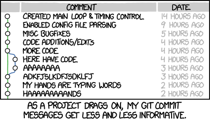
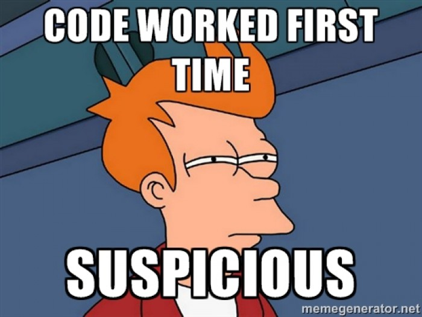
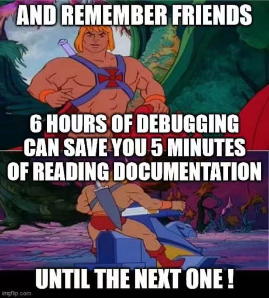
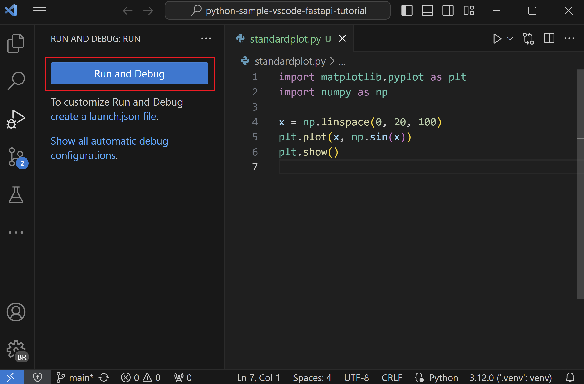
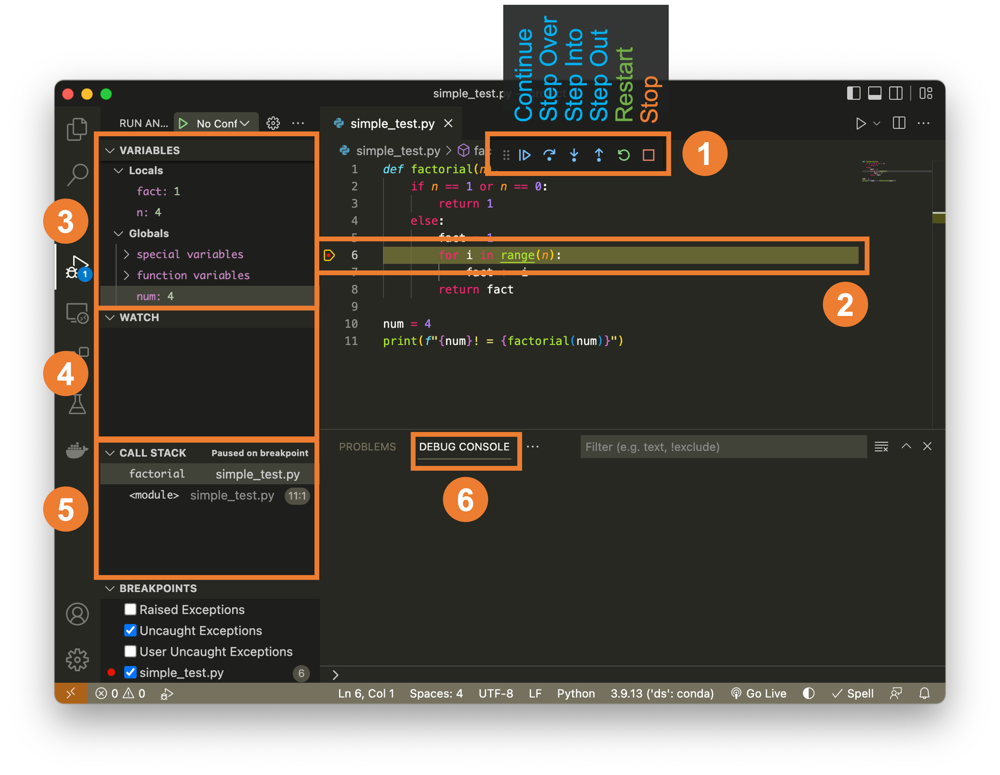
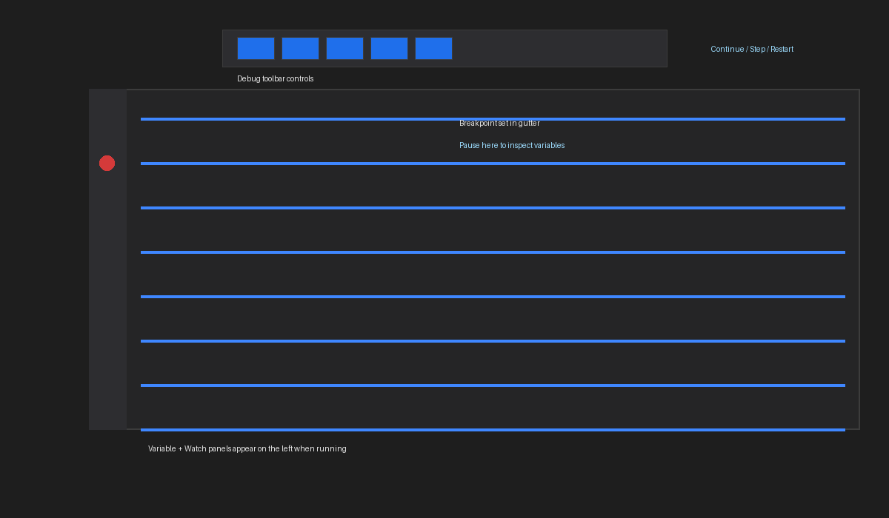
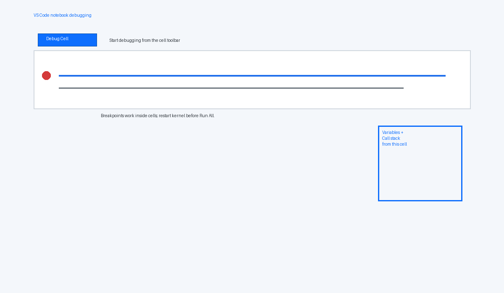
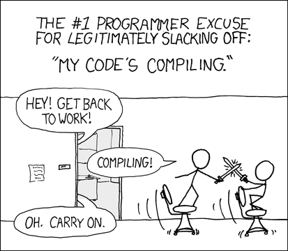
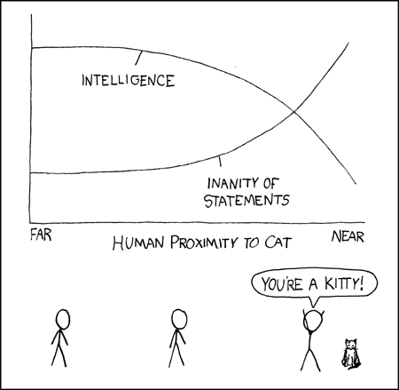

# Lecture 1: Reliable Notebooks and Debugging First 🚦🐛
<!---
Set the tone: fast refresher, then reliability/debugging focus; reassure returning students.
--->

Welcome back! You already met Python, git/GitHub, Markdown, and VS Code in the prereq course—today we sprint through the essentials, add notebook hygiene, then spend most of the time on defensive programming and debugging so your analyses survive first contact with messy data.

## Table of Contents
<!---
Outline the 90-minute flow so students know when demos land.
--->

- Quick hits: setup, Markdown/git refresher, notebook hygiene (first 30 minutes)
- Defensive programming for data science (30→60)
- Debugging in VS Code + Jupyter (60→90, closing demo)
- Assignment and resources

## Quick hits: setup + hygiene (first ~30 minutes)
<!---
Sprint through carryover skills and notebook hygiene; aim for 30 minutes with a demo break.
--->

**Demo (~30 min): Accept the course repo via GitHub Classroom + enable GitHub Education perks.**  
Links: [GitHub Education](https://education.github.com/pack) · `#FIXME` Classroom invite · [DS-217 Lecture 01 deep-dive on tooling](https://www.notion.so/1-Python-the-Command-Line-and-VS-Code-271d9fdd1a1a805784e1fe68dc985696?pvs=21).

### What carries over from the prereq
<!---
Reassure students they already know the basics; emphasize this session is about reliability. Mention we'll move faster than last year and lean on links for depth.
--->
Summary: Quick reminder that Python, git, Markdown, and VS Code basics already exist so we can focus on reliability and debugging.
Visual: 
Signature: `python -m venv .venv && source .venv/bin/activate`
Example:
```bash
git status && git commit -am "chore: warm up"
```
- Assume familiarity with Python syntax, basic git, Markdown, and VS Code navigation.
- Skip long installs: choose one path for local (venv + VS Code) or cloud (Codespaces).
- Detailed setup lives in DS-217 Lecture 01 (link above) and prior notes in `lectures_25/01`.

### Fast local/cloud workflow
<!---
Explain that choosing a single environment reduces friction. Encourage Codespaces for consistency, local venv for performance/PHI. Mention WSL briefly for Windows.
--->
Summary: Pick one workflow (local venv or Codespaces) and stick to it for predictable grading and fewer surprises.
Visual: 
Signature: `codespace.create(repo, machine="small")`
Example:
```bash
python -m venv .venv
source .venv/bin/activate
pip install -r requirements.txt
```
- Local: `python -m venv .venv && source .venv/bin/activate` then `pip install -r requirements.txt`.
- Cloud: GitHub Codespaces → select the repo → pick a small machine → reuse devcontainer if provided.
- VS Code essentials: Python + Jupyter extensions; Command Palette for everything; auto-format on save.

### Notebook hygiene and reproducibility
<!---
Highlight “run-all ready” notebooks, cleared outputs on commit, deterministic runs, and config separation. Mention why this matters for grading and team science.
--->
Summary: Notebooks must be run-all ready, deterministic, and free of stray outputs or secret paths.
Visual: 
Signature: `def run_all(notebook_path: Path) -> None`
Example:
```python
# Clear outputs before commit
jupyter nbconvert --ClearOutputPreprocessor.enabled=True --inplace lecture.ipynb
```
- Notebooks should run top-to-bottom without manual tweaks; add clear `# TODO` if not.
- Clear outputs before committing unless the output is the point; keep plots lightweight.
- Capture environment: pin deps in `requirements.txt`, store configs in `.env` or YAML, never hardcode secrets/paths.
- Use relative paths and small sample data for demos; document larger data sources.

### Git/GitHub/Markdown in 5 minutes
<!---
Offer the minimal command set and when to use GUI. Encourage short commits and descriptive messages. Note Markdown basics for README and notebooks.
--->
Summary: Minimal git/Markdown toolkit for fast, clean commits and readable docs.
Visual: 
Signature: `git commit -m "feat: summary"`
Example:
```markdown
# Title
## Section
- bullet
`code`
```
- Git flow: `git status` → `git add` → `git commit -m "feat: short message"` → `git push`.
- Use GitHub Desktop or VS Code Source Control if the CLI slows you down.
- Markdown recap: one `#` title per doc, headings for structure, fenced code blocks with language tags, link with `[text](url)`.

### Demo (~30 min): Accept and open the starter repo
<!---
Walkthrough: open the classroom link, create repo, clone or open in Codespaces, run `pip install -r requirements.txt`, verify notebooks open. Note this sets up grading later.
--->
Summary: Accept Classroom, clone/open, install deps, and prove Run All works before coding.
Visual: #FIXME Add screenshot of Classroom acceptance flow (clone or Codespaces).
Signature: `gh classroom accept <invite-url>`
Example:
```bash
gh repo clone <classroom-repo>
cd <classroom-repo>
python -m venv .venv && source .venv/bin/activate
pip install -r requirements.txt && jupyter nbconvert --execute starter.ipynb
```
- Accept the GitHub Classroom invite (`#FIXME` link) and enable the GitHub Education pack if not already.
- Open the repo locally or in Codespaces; verify `.venv` or devcontainer activation.
- Run `pip install -r requirements.txt`; open the starter notebook and confirm it runs `Run All` without edits.

## Defensive programming for data science (30→60)
<!---
Shift from hygiene to guardrails: assertions, logging, configs, and controlled failure modes.
--->

**Demo (~60 min): Hardening a tiny data-cleaning notebook before it breaks.**  
Links: [`defensive_programming_notebook.ipynb`](./demo/defensive_programming_notebook.ipynb) · [`logging` docs](https://docs.python.org/3/library/logging.html).

### Common failure modes in health data projects
<!---
Frame debugging as risk management: data drift, messy inputs, environment drift, bad assumptions. Use light humor (ghost of missing values).
--->
Summary: How health datasets fail—missing columns, unit drift, stale environments, and silent PHI leaks.
Visual: 
Signature: `def assert_expected_columns(df: pd.DataFrame, expected: list[str]) -> None`
Example:
```python
def assert_expected_columns(df, expected):
    missing = [c for c in expected if c not in df]
    if missing:
        raise ValueError(f"Missing columns: {missing}")
```
- Data surprises: missing columns, unexpected units, schema drift between hospitals.
- Environment drift: different Python versions, missing packages, stale virtualenvs.
- Hidden assumptions: hardcoded file paths, magic numbers, unseeded randomness.
- Security/ethics: avoid PHI in logs, public clouds, or screenshots.

### Guardrails: DRY/KISS and configs over hardcoding
<!---
Show how small helpers/configs reduce bugs. Emphasize clarity and minimal abstractions. Mention `.env` + `pydantic` or `dotenv` as optional.
--->
Summary: Centralize settings and keep helpers tiny so you can reuse them and spot side effects.
Visual: 
Signature: `def load_settings(config_path: Path) -> dict`
Example:
```python
import yaml
from pathlib import Path

def load_settings(config_path: Path) -> dict:
    return yaml.safe_load(config_path.read_text())

SETTINGS = load_settings(Path("config.yaml"))
```
- Centralize settings (e.g., `config.yaml` or `.env`) and load them once.
- Keep helper functions small and named for intent; avoid clever one-liners that hide side effects.
- Validate inputs early: assert expected columns, value ranges, and units.
- Prefer pure functions where possible so tests are easy.

### Exceptions, logging, and safe exits
<!---
Students often overuse bare except. Show structured exceptions, logging levels, and graceful fallbacks. Mention PHI-safe logging.
--->
Summary: Raise specific exceptions, log clearly, and fail fast without leaking PHI.
Visual: 
Signature: `def load_clean_data(path: str) -> list[dict]`
Example:
```python
import logging
from pathlib import Path

logging.basicConfig(level=logging.INFO, format="%(levelname)s:%(message)s")

def load_clean_data(path: str) -> list[dict]:
    csv_path = Path(path)
    if not csv_path.exists():
        raise FileNotFoundError(f"Missing input: {csv_path}")
    logging.info("Reading %s", csv_path)
    # TODO: add schema validation
    return csv_path.read_text().splitlines()

try:
    rows = load_clean_data("data/intake.csv")
except FileNotFoundError as err:
    logging.error("Check your path or fetch the sample data: %s", err)
```

### Demo (~60 min): Make the notebook harder to break
<!---
Practice adding assertions, config loading, and logging to an existing notebook. Show before/after of a failing cell now giving actionable errors. Encourage students to try with bad input.
--->
Summary: Run the cleaning notebook with broken inputs, add schema/bounds checks and logging, rerun to see actionable errors.
Visual: 
Signature: `def validate_values(df: pd.DataFrame) -> pd.DataFrame`
Example:
```python
import pandas as pd

def validate_values(df: pd.DataFrame) -> pd.DataFrame:
    bounds = {"weight_kg": (30, 250), "height_cm": (120, 230)}
    for col, (lower, upper) in bounds.items():
        bad = ~df[col].between(lower, upper)
        if bad.any():
            raise ValueError(f"{col} out of bounds: {df.loc[bad, ['patient_id', col]]}")
    return df

df = pd.read_csv("demo/data/patient_intake_bad_values.csv")
validate_values(df)
```
- Start with a brittle cleaning notebook ([demo notebook](./demo/defensive_programming_notebook.ipynb)); run it with a missing column to see the failure.
- Add config-driven file paths, schema checks, and logging statements.
- Re-run with both good and bad inputs; confirm errors are now descriptive and logged.

## Debugging in VS Code + Jupyter (60→90)
<!---
Hands-on walkthrough of debugger flows for scripts and notebooks using the BMI example.
--->

**Demo (~90 min): Step-through debugging in VS Code for scripts and notebooks.**  
Links: [VS Code Python debugging](https://code.visualstudio.com/docs/python/debugging) · [`vscode_debug_sample.py`](./demo/vscode_debug_sample.py) · [`vscode_debug_walkthrough.md`](./demo/vscode_debug_walkthrough.md) · screenshots below.

### Quick debugging toolkit
<!---
Outline when to use print/logging vs. debugger. Mention pdb for terminal-only cases and VS Code for visual learners. Keep tone light (detective reference).
--->
Summary: Start with prints/logs, move to pdb or VS Code debugger when you need state and call stacks.
Visual: 
Signature: `import pdb; pdb.set_trace()`
Example:
```python
try:
    risky_fn()
except Exception:
    import pdb; pdb.set_trace()
```
- Start simple: `print`/`logging` for fast signals, especially inside notebooks.
- Use `pdb`/`ipdb` when you need state inspection without a GUI.
- Switch to the VS Code debugger for call stacks, watches, and conditional breakpoints.

### VS Code debugger basics (scripts)
<!---
Describe setting breakpoints, inspecting variables, and stepping controls. Note launch.json is optional with the Python extension. Add placeholder for a screenshot.
--->
Summary: Set breakpoints, run under the debugger, and use call stack/watches to trace BMI bugs.
Visual:  <!-- #FIXME replace with real capture -->
Signature: `"request": "launch"` entry in `.vscode/launch.json`
Example:
```json
{
  "version": "0.2.0",
  "configurations": [{
    "name": "Debug BMI",
    "type": "python",
    "request": "launch",
    "program": "${workspaceFolder}/demo/vscode_debug_sample.py"
  }]
}
```
- Open the script, click in the gutter to set breakpoints, run with the debug play button.
- Watch/Variables panels reveal state; Call Stack shows frames; use Step Into/Over/Out.
- Conditional breakpoints: right-click breakpoint → add expression (e.g., `row["bmi"] is None`).

### Debugging notebooks in VS Code
<!---
Students may not know notebook debugging exists. Show the debug cell button and how it maps to standard debugger controls. Warn about state carried between cells.
--->
Summary: Use the debug button per cell, set breakpoints inside cells, and restart kernels before Run All.
Visual:  <!-- #FIXME replace with real capture -->
Signature: `#%%` cell debug blocks in Python files map to notebook-style debugging.
Example:
```python
#%% Debug this cell
from demo.vscode_debug_sample import calculate_bmi
calculate_bmi(80, 1.75)
```
- In VS Code, use the debug icon beside a cell to enter a debug session for that cell.
- Breakpoints work inside notebook cells; continue/step behaves like scripts.
- Restart kernel + Run All after debugging to confirm clean state.

### Debugging checklist for messy data
<!---
Provide a reusable flow: reproduce, minimize, inspect assumptions, add guards, re-run. Emphasize saving small failing fixtures for tests.
--->
Summary: Reproduce with tiny fixtures, check assumptions, add assertions/logging, and rerun until stable.
Visual: 
Signature: `def reproduce_bug(input_path: Path) -> None`
Example:
```python
fixture = Path("demo/data/patient_intake_missing_height.csv")
try:
    load_intake_data(fixture)
except Exception as err:
    print("Reproduced:", err)
```
- Reproduce the bug with the smallest possible input; save that fixture for future tests.
- Confirm assumptions (data types, units, ranges) before blaming the code.
- Add assertions and logging near the failure; rerun with breakpoints to inspect.
- Once fixed, add a minimal test or notebook cell that proves the fix stays fixed.

### Demo (~90 min): Walk through a VS Code debug session
<!---
Guide students through setting a breakpoint, stepping through a loop, and fixing a logic bug. Use a BMI calculator or similar from lecture_02. End by rerunning tests/notebook.
--->
Summary: Step through the BMI script, fix the formula/typo/indexing bugs, and rerun to verify clean output.
Visual: 
Signature: `breakpoint()` builtin for quick stops
Example:
```python
from demo.vscode_debug_sample import calculate_bmi

breakpoint()
print(calculate_bmi(70, 1.75))
```
- Open the [`vscode_debug_sample.py`](./demo/vscode_debug_sample.py) (adapted from `lectures_25/02` BMI example).
- Set a breakpoint inside a loop, run the debugger, inspect variables, and adjust a faulty condition.
- Re-run the cell/notebook with Run All to confirm the fix and clean state.

## Assignment (auto-graded)
<!---
Clarify scaffold + grading so students know what to submit after the debugging focus.
--->
Summary: Auto-graded Classroom repo mirroring datasci_217 scaffold; prove logging/assertions and one VS Code debug walkthrough.
Visual: 
Signature: `.github/tests/test_*` executed by GitHub Actions
Example:
```bash
pytest .github/tests -q
```

 - Lightweight, auto-gradable via GitHub Actions (mirrors the datasci_217 layout with `.github/tests`, `assignment.ipynb` + `assignment.md`, `requirements.txt`, `data/`, and `output/` folders).
- Focus: add logging + assertions to a small notebook, plus one VS Code debug walkthrough.
- Submission: accept the Classroom repo, push changes, verify Actions pass; rubric is fully automated.

## Resources
<!---
Point to deeper references and remind about tone; mention humor break to keep energy up.
--->
Summary: Where to dig deeper on tooling/debugging plus a comic to keep morale up.
Visual: 
Signature: `open("refs/instructions.md").read()`
Example:
```bash
sed -n '1,40p' refs/instructions.md
```

- Deep dives: DS-217 Lecture 01 (tooling) and `lectures_25/02` (debugging demos) plus the local `./demo` assets above.
- References: Python `logging`, VS Code debugging guide, and MkDocs notes in `refs/`.
- Remember, debugging is like being a detective in a crime movie where you’re also the culprit.
