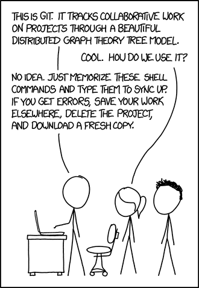
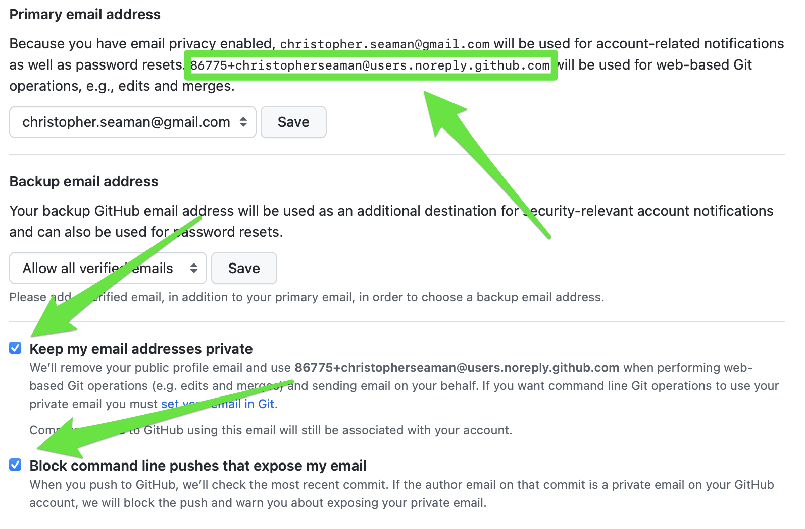
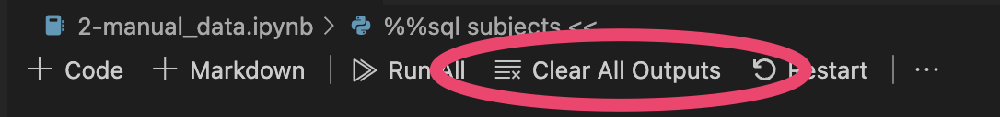

# Lecture 1: `git init` - Getting Started with Git, Python, and Markdown [\[pdf\]](lecture_01.pdf)

Welcome to the first lecture of Applied Data Science with Python! Today we'll be covering the essential tools and concepts that will form the foundation of your data science journey.

## Table of Contents

- Tools: `python` and `git`
    - Getting set up locally
    - Cloud options (GitHub Codespaces, Colab, Binder, Paperspace)
- Command Line Basics
    - Terminal access on different platforms
    - Basic navigation and file operations
    - Chaining commands with pipes and redirection
- Markdown
    - Syntax summaries
    - Readme.md - make one for every repo
- git and GitHub
    - Starting or cloning a repository
    - Git push/pull/sync
    - Branches & Conflicts
- Python
    - Syntax basics
    - Running python and jupyter
    - Variables and control flow
- Runtime Environments
    - Virtual environments
    - Jupyter Notebooks
    - Cloud options: Google Colab & GitHub Codespaces (no PHI in this course)
- Data Security and Ethics
    - Working securely with health data
    - When NOT to use cloud tools

## Why Python?

> **Check**: What tools have you used before? What would you like to cover in this course?


## Installing tools

For most roles data science happens in `python` and `R`, in this course we will be talking about `python`.

It doesn't matter which tools you use; python and R (and other specialized tools) are quite capable. Since python and R are the most commonly used tools, knowing one or both of them will make it easier to play well with others. Don't try to be an expert in everything! Figure out which you prefer and learn to be "fluent" (able to code a solution from start to finish) in one, then you can get by being "conversational" (able to read and edit others' code) in the other. 

Additionally, collaboration usually happens in git and documentation will use markdown. Luckily, those are "easy" to pick up.

### Quickstart

_Note: this is also included in the week's assignment_

These are the standard options that I'll be using to demonstrate going forward. They will also give us a common base to work from, so we can focus on the work rather than tweaking/fixing our development environment.

- Sign up for an account on [GitHub](https://github.com)
  - Apply for [GitHub Education](https://education.github.com/pack) to get extra free hours on Codespaces and other benefits
- Install Python 3 ([instructions](https://docs.python-guide.org))
- Get [VisualStudio Code](https://code.visualstudio.com)
    
    - Most commands are accessed using the "Command Palette"
        - **Shift + Command + P** (Mac)
        - **Ctrl + Shift + P** (Windows/Linux)
        - **F1** (All)
    
    - Extensions
        - Python + Jupyter (use notebooks within VS Code)
        - GitHub Repositories + Remote Repositories (manage git in VS Code instead of the terminal)

**Note:** If you don't want to install software locally, you can use GitHub Codespaces (recommended) or [Google Colab](https://colab.research.google.com) but _never_ use PHI data with public-facing tools.

### GitHub Codespaces

Cloud-based development environment with VS Code in your browser:

- **Benefits**: No setup, consistent environment, works on any device
- **Student perks**: Extra free hours with GitHub Education
- **Getting started**: Repository → Code button → Codespaces tab → Create
- **Persistence**: Codespaces last weeks but not forever; commit/push often
- **Fun fact**: I write these lectures on my iPad using Codespaces and VS Code tunnels

### GitHub Classroom

How we'll manage assignments in this course:

- **Benefits**: Automated distribution, testing, and grading; private repos
- **Process**: Get link → Accept assignment → Clone repo → Make changes → Push to submit
- **Grading**: Automated tests run on submission; feedback via issues/comments

## Command Line Basics

### Recommended Resources:

- [LinuxCommand.org](https://linuxcommand.org/lc3_learning_the_shell.php) - Learning the shell
- [The Missing Semester](https://missing.csail.mit.edu/) - MIT course on developer tools
- [regex101.com](https://regex101.com/) - Regular expression testing tool

### Essential commands for navigating and working with files:

- **Navigation**: `pwd` (where am I?), `ls` (what's here?), `cd` (change directory)
- **Special directories**: `~` (home), `.` (current), `..` (parent)
- **File operations**: `mkdir`, `touch`, `cp`, `mv`, `rm` (careful - no undo!)
- **Viewing content**: `cat`, `head`, `tail`
- **Text tools**: `grep` (search), `nano` (edit)
- **Chaining**: `|` (pipe output), `>` (redirect to file), `>>` (append to file)

Access via Terminal (Mac), WSL (Windows, recommended), or Terminal (Linux)

### Health Data Science Applications

- Organizing patient data files: `mkdir patient_cohorts/{control,treatment}`
- Searching clinical notes: `grep "diabetes" patient_notes.txt`
- Extracting first 10 rows of data: `head -n 10 lab_results.csv`
- Counting records by type: `grep "diagnosis" records.csv | wc -l`
- Combining data processing steps: `cat vitals.csv | grep "elevated" | sort > high_risk_patients.csv`

## LIVE DEMO!

## Windows Subsystem for Linux (WSL)

For Windows users, WSL provides a Linux environment directly in Windows:

- **Why use it**: Consistent Unix environment, better compatibility with data science tools
- **Quick install**: In PowerShell (as Admin): `wsl --install`, then restart
- **VS Code integration**: Install the WSL extension in VS Code to work from Unix
- **File access**: Windows files at `/mnt/c/...`, WSL files at `\\wsl$\Ubuntu\...`
- **Best terminal**: Windows Terminal or VS Code's integrated terminal

## Local setup

MacOS:

- [Meet HomeBrew (brew.sh)](https://brew.sh)
- [Data Science Setup on MacOS](https://engineeringfordatascience.com/posts/setting_up_a_macbook_for_data_science/)\

Windows:

- [Windows Subsystem for Linux](https://learn.microsoft.com/en-us/windows/wsl/install)
- [A usable and good-looking automation environment on Windows](https://www.trueneutral.eu/2021/win-proper-env.html)

iOS:

_if you're a weirdo and want to turn your iPad into a fully-fledged development environment_

- git: [Working Copy](https://workingcopyapp.com)
- Terminal: [blink.sh](https://blink.sh)
- VS Code: [vscode.dev](https://vscode.dev)
- Jupyter: [Juno](https://juno.sh) (and Juno Connect to use cloud processing and GPUs)

### Tools you'll need:

- git
    - `brew install git`
    - WSL has git installed by default
    - [GitHub Desktop](https://desktop.github.com) has a GUI (excellent for beginners, but plenty of devs use it, too!)
    - VS Code 👇 can also manage git repositories!
- Python 3 - [Data Science with Python Tutorial](https://www.geeksforgeeks.org/data-science-tutorial/)
    - We'll install and explore throughout the course 👇

### Cloud options

You can run Python in lots of places, many for free:

- GitHub Codespaces (free extra hours for students with GitHub Education, can work with private repos)
- Google Colab (free for public notebooks, paid for private or higher-powered machines)
- Paperspace (free for public notebooks, paid for private or higher-powered machines)
- Binder (free, always public)

## Markdown

Lightweight markup language for documentation, used in GitHub, Notion, and more:

**Recommended Resources:**
- [Markdown Guide](https://www.markdownguide.org/basic-syntax/) - Comprehensive reference
- [Interactive Tutorial](https://www.markdowntutorial.com) - Hands-on learning
- [CommonMark tutorial](https://commonmark.org/help/tutorial) - Standard Markdown tutorial

> **Markdown Tip**: In Markdown, only use one H1 (`#`) heading per document. This helps maintain a clear document structure and improves readability. The first H1 heading typically serves as the document's title or main heading.

### Key Syntax

- **Paragraphs**: Separate with blank lines
- **Headers**: `# H1`, `## H2`, `### H3`
- **Formatting**: `**bold**`, `_italic_`, `` `code` ``
- **Lists**: 
  - Unordered: `* item` or `- item`
  - Ordered: `1. item` (numbers don't matter)
  - Checklists: `- [ ]` and `- [x]`
- **Code blocks**: Triple backticks ` ``` `
- **Links**: `[text](url)`
- **Blockquotes**: `> quoted text`

Every repo should have a README.md to explain what it is and how to use it.

## `git` and GitHub

Version control system for tracking changes and collaborating on code:



**Recommended Resources:**
- [GitHub Foundations](https://learn.microsoft.com/en-us/training/paths/github-foundations/) - THE tutorial for GitHub
- [Atlassian Git Tutorial](https://www.atlassian.com/git/tutorials/what-is-version-control) (focus on _Getting Started_ and _Collaborating_)
- [Markdown Guide](https://www.markdownguide.org/basic-syntax/) - Markdown syntax reference

### Essential Git Commands

- **Setup**: `git config --global user.name "Your Name"` and `git config --global user.email "email@example.com"`
- **Starting**: `git init` (new repo) or `git clone URL` (copy existing repo)
- **Basic workflow**:
  1. `git status` (check what's changed)
  2. `git add filename` (stage changes)
  3. `git commit -m "Message"` (save snapshot)
  4. `git push` (upload to remote) / `git pull` (download from remote)

### `git config --global user.email "NOT YOUR ACTUAL EMAIL"`

GitHub (thankfully) will do its best to keep you from posting your email on the internet. They provide an anonymous remailing service with an email alias. Add that to your `git config`



### Collaboration Features

- **Branches**: Create separate workspaces with `git branch` and `git checkout`
- **Pull Requests**: Request code review before merging changes
- **Forks**: Make your own copy of someone else's repository

### Important Notes

- **Never commit sensitive info**: No passwords, PHI, or PII
- **Handling conflicts**: Use `git restore`, `git rebase`, or `git stash` when things get messy
- **GitHub alternatives**: GitLab, Bitbucket, or UCSF's internal GitHub (for PHI)


## LIVE DEMO!

## Python

The most popular language for data science and machine learning:

**Recommended Resources:**
- [A Whirlwind Tour of Python](https://jakevdp.github.io/WhirlwindTourOfPython/) (free online)
- [Think Python](https://greenteapress.com/wp/think-python/) - Free book by Allen Downey
- [Python for Data Analysis](https://wesmckinney.com/book/) - For data science applications
- [Python Data Science Handbook](https://jakevdp.github.io/PythonDataScienceHandbook/) - Comprehensive guide

### Quick Setup

- **Mac**: `brew install python`
- **Windows**: In WSL: `sudo apt install python3 python3-pip python3-venv`

### Key Packages

- **Data analysis**: Pandas, NumPy
- **Visualization**: Matplotlib, Seaborn
- **Machine learning**: scikit-learn, PyTorch, TensorFlow/Keras
- **Health-specific**: BioPython, Nilearn, MedPy, PyDicom

### Python in Health Data Science

```python
# Example: Working with patient data
patient_name = "Jane Doe"  # String (text) - always anonymized for teaching
patient_age = 65           # Integer (whole number)
blood_glucose = 140.5      # Float (decimal number)
has_diabetes = True        # Boolean (True/False)

# Simple analysis
if blood_glucose > 126.0:
    print(f"Patient {patient_name} has elevated blood glucose")
    
# List of blood pressure readings
bp_readings = [120, 122, 118, 125]
average_bp = sum(bp_readings) / len(bp_readings)
print(f"Average systolic BP: {average_bp}")
```

### Virtual Environments

**Recommended Resources:**
- [Python Virtual Environments Primer](https://realpython.com/python-virtual-environments-a-primer/) - Detailed guide
- [Python venv documentation](https://docs.python.org/3/library/venv.html) - Official documentation

Isolated Python environments for different projects:

- **Why**: Avoid dependency conflicts between projects, essential for reproducible health research
- **How**:
  1. Create: `python3 -m venv env_folder`
  2. Activate: `source env_folder/bin/activate` (Mac/Linux) or `env_folder\Scripts\activate` (Windows)
  3. Install: `pip install -r requirements.txt`
  4. Deactivate: `deactivate`

### Jupyter Notebooks

Interactive Python environment combining code, output, and documentation:

- **Best practice**: Clear outputs before committing to git
- **Why**: Prevents large file sizes and merge conflicts
- **Health applications**: Ideal for exploratory analysis of health data, creating shareable research, and documenting clinical data pipelines



## LIVE DEMO!

## Data Security and Ethics in Health Data Science

**Recommended Resources:**
- [UCSF Information Commons Tools](https://informationcommons.ucsf.edu/tools) - For working with EHR data

### Key Principles

- **PHI (Protected Health Information)**: Any identifiable health information
- **De-identification**: Removing identifiers from health data
- **HIPAA compliance**: Legal requirements for handling health data
- **Informed consent**: Ensuring proper permissions for data use

### Tool Considerations

- **Local vs. Cloud**: When to keep data on local, secured systems
- **Public tools**: Never use Google Colab, GitHub, etc. with PHI
- **Secure alternatives**: UCSF's secure computing environments, private instances
- **Data minimization**: Only use the data you need for your specific purpose

### Best Practices

- Always encrypt sensitive data and minimize "data surface"
- Use secure authentication (MFA where possible)
- Document your data handling procedures
- Consult with privacy experts when in doubt
- Consider ethical implications beyond legal requirements

## Assignment

### GitHub Classroom Overview

- **What**: Platform for distributing, submitting, and grading assignments
- **How**: Accept assignment link → Get private repo → Make changes → Push to submit
- **Benefits**: Automated testing, private repos, direct feedback

### Assignment Tasks

1. **Create README.md** with:
   - Brief introduction (first name only)
   - What you hope to get from the course
   - Music recommendation with link

2. **Write Python script** that:
   - Takes email address as command line argument
   - Hashes it using specified algorithm
   - Outputs to 'hash.email' file

3. **Submit** via git push (auto-graded)

> **Check**: How's my driving? What's still confusing?

## It came from the Internet

Thanks this week to [Data Science Weekly Newsletter](https://datascienceweekly.substack.com/?utm_source=subsoft&utm_medium=email)

### Data teams

> [!info] Should You Measure the Value of a Data Team?  
> Data teams are sometimes asked to prove their ROI to senior leadership to justify a budget for new hires, tools, projects, or process changes.  
> [https://medium.com/the-prefect-blog/should-you-measure-the-value-of-a-data-team-95c447f28d4a](https://medium.com/the-prefect-blog/should-you-measure-the-value-of-a-data-team-95c447f28d4a)  

> [!info] Data scientists work alone and that's bad | Ethan Rosenthal  
> In Need of a Good Editor Growing up, I had always considered myself a decent writer based on my decent grades in English class.  
> [https://www.ethanrosenthal.com/2023/01/10/data-scientists-alone/](https://www.ethanrosenthal.com/2023/01/10/data-scientists-alone/)  

### Tooling updates

> [!info] Beyond Pandas - working with big(ger) data more efficiently using Polars and Parquet  
> As data scientists/engineers, we often deal with large datasets that can be challenging to work with.  
> [https://medium.com/data-analytics-at-nesta/beyond-pandas-working-with-big-ger-data-more-efficiently-using-polars-and-parquet-fd980353cc2](https://medium.com/data-analytics-at-nesta/beyond-pandas-working-with-big-ger-data-more-efficiently-using-polars-and-parquet-fd980353cc2)  

> [!info] SQL should be your default choice for data engineering pipelines  
> Originally posted: 2023-01-30.  
> [https://www.robinlinacre.com/recommend_sql/](https://www.robinlinacre.com/recommend_sql/)  

### Data science in practice

> [!info] I Used Computer Vision To Destroy My Childhood High Score in a DS Game  
> I train an object detection model to control my computer to play a minigame running in a DS emulator endlessly.  
> [https://betterprogramming.pub/using-computer-vision-to-destroy-my-childhood-high-score-in-a-ds-game-38ebd53a1d64](https://betterprogramming.pub/using-computer-vision-to-destroy-my-childhood-high-score-in-a-ds-game-38ebd53a1d64)  

> [!info] Data Cleaning Plan  #FIXME:MOVE TO NEXT WEEK
> Data cleaning or data wrangling is the process of organizing and transforming raw data into a dataset that can be easily accessed and analyzed.  
> [https://cghlewis.github.io/mpsi-data-training/training_4.html](https://cghlewis.github.io/mpsi-data-training/training_4.html)
