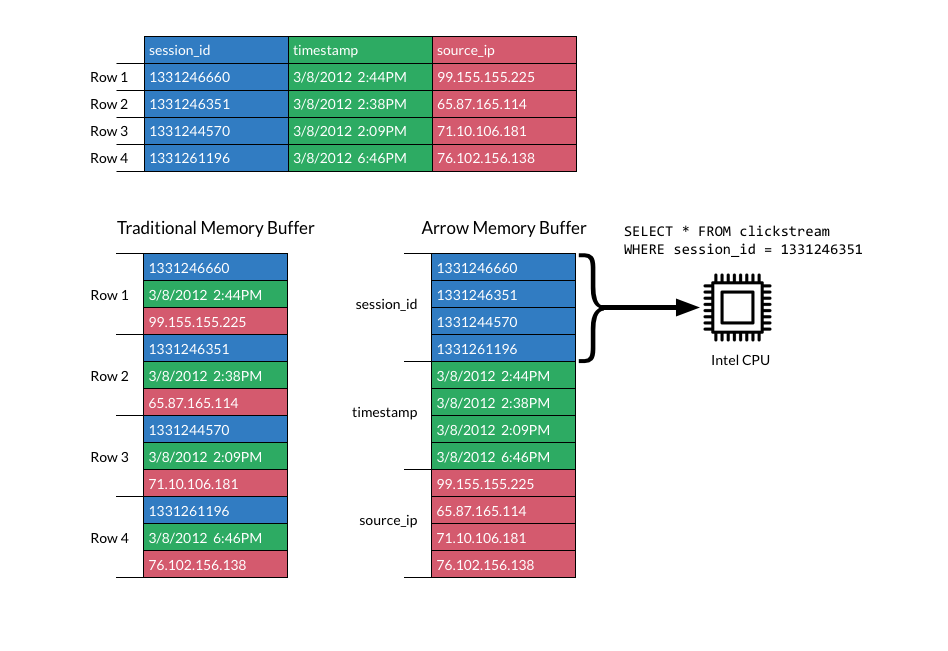
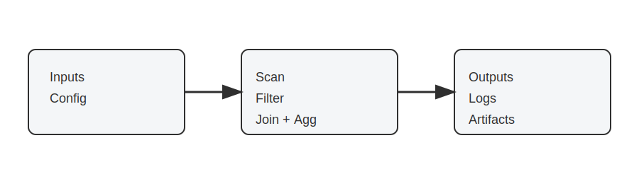
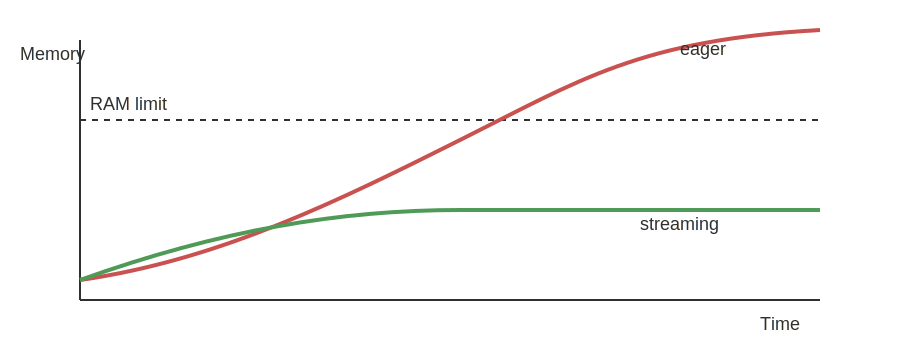

02: Scaling Tabular Workflows with Polars ⚡

- hw02 - #FIXME add GitHub Classroom link once ready

# Links & Self-Guided Review

- [Polars User Guide](https://docs.pola.rs/user-guide/) – official docs with eager + lazy API examples
- [Apache Arrow Columnar Format](https://arrow.apache.org/overview/) – why columnar memory layouts matter
- [Parquet Fundamentals](https://parquet.apache.org/docs/file-format/) – format internals and predicate pushdown
- [Real Python: Working With Large CSVs](https://realpython.com/csv-python/#working-with-large-csv-files-using-pandas) – diagnosing `MemoryError`
- [VS Code: Python performance tips](https://code.visualstudio.com/docs/python/python-tutorial) – environment setup + profiling
- `scripts/fetch_xkcd_2x.py` – grab XKCD comics (see `all_xkcd.csv` index) for lecture visuals

# Why Memory Limits Sneak Up On Us


*Chart shows estimated in-memory size; raw on-disk sizes are in the table below.*

Health datasets outgrow laptop RAM quickly: a handful of CSVs with vitals, labs, and encounters can exceed 16 GB once loaded. Attempting to "just read the file" leads to system thrash, swap usage, and eventually Python `MemoryError`s that interrupt the workflow.

### Laptop specs vs dataset footprints

| Dataset | Typical raw size | In-memory pandas size | Fits on 16 GB laptop? |
| ------- | ---------------- | --------------------- | --------------------- |
| Intake forms (CSV) | 250 MB | ~1.2 GB (due to dtype inflation) | ✅ |
| Longitudinal vitals (CSV) | 6 GB | ~14 GB | ⚠️ borderline |
| EHR encounter log (CSV) | 18 GB | ~42 GB | ❌ |
| Imaging metadata (Parquet) | 9 GB | ~9 GB | ⚠️ if other apps closed |
| Claims archive (partitioned Parquet) | 120 GB | streamed | ✅ (with streaming) |

### Warning signs you are hitting RAM limits

- `top` or `Activity Monitor` shows Python ballooning toward total RAM
- Fans spin, everything slows, disk swap spikes
- OS kills kernel/terminal; `MemoryError` or `Killed: 9` messages
- Notebook kernel restarts when running seemingly "simple" cells


*If the rows are literally on fire, start fixing quality before scaling anything else.*

Grab a quick sense of scale (`du -sh data/`, `wc -l big_file.csv`) before committing to a full load—if numbers dwarf your RAM, pivot immediately.

### Quick pivot when pandas crashes

1. **Stop the read** once memory spikes—killing the kernel only hides the problem.
2. **Profile the file size** (`du -sh`, `wc -l`) so you know what you are up against.
3. **Convert the source** to Parquet or Arrow once using a machine with headroom.
4. **Rebuild the transform** with Polars lazy scans (`pl.scan_*`) and streaming collects.
5. **Cache intermediate outputs** so future runs never touch the raw CSV again.

### Code Snippet: Pushing pandas too far

```python
import pandas as pd
from pathlib import Path

PATH = Path("data/hospital_records_2020_2023.csv")

try:
    df = pd.read_csv(PATH)
except MemoryError:
    raise SystemExit(
        "Dataset too large: consider chunked loading or Polars streaming"
    )
```

This is the moment to stop fighting pandas and switch strategies (column pruning, chunked readers, or a Polars lazy pipeline) *before* debugging phantom crashes.

# Polars Essentials

## Columnar storage (row vs column)

Columnar formats keep same-typed values together, which makes scans faster and cheaper than row-wise text formats.


Why this matters for Polars + Parquet:

- **Projection pushdown:** read only the columns you select.
- **Predicate pushdown:** skip row groups whose stats fail the filter.
- **Compression:** contiguous same-typed values compress more effectively.

*Prompt:* If you only need `patient_id` + `heart_rate`, what does a columnar engine read vs a CSV reader?



SIMD works best when values are contiguous in memory, which columnar layouts enable.


*Example benchmark on a 12M-row vitals dataset on a single laptop; exact timings vary by hardware and data layout.*

pandas is ubiquitous and a great default; Polars is often adopted case-by-case when you hit real constraints (runtime, memory, I/O).

Polars is pandas without the hidden index and with a Rust engine under the hood. Two mindshifts:

- **Everything is explicit columns**—no surprise index alignment.
- **Expressions replace per-row Python**—filters, casts, joins compile to vectorized Rust kernels.

### Reference Card: pandas → Polars translation

| You know this in pandas | Do this in Polars |
| ----------------------- | ----------------- |
| `pd.read_csv("file.csv")` | `pl.read_csv("file.csv")` *(eager preview)* |
| *(no equivalent)* lazy scan | `pl.scan_csv("file.csv")` *(build plan, nothing runs yet)* |
| `df[df.age > 65]` | `.filter(pl.col("age") > 65)` |
| `df.assign(bmi=...)` | `.with_columns(pl.col("weight") / pl.col("height")**2)` |
| `df.groupby("cohort").agg(...)` | `.group_by("cohort").agg([...])` |
| `df.merge(dim, on="id")` | `.join(dim, on="id")` |
| *(n/a)* | `.collect(engine="streaming")` |

## `scan_csv` and `scan_parquet`

Lazy scans build a query plan without loading the full dataset. Use them for large files, globs, and any pipeline you want to keep in streaming mode.

### Reference Card: `scan_csv` / `scan_parquet`

- **Function:** `pl.scan_csv(...)`, `pl.scan_parquet(...)`
- **Purpose:** Create a `LazyFrame` for pushdown + optimization
- **Key Parameters:**
    - `try_parse_dates` (CSV): parse date-like strings during scan
    - `columns` (both): read only specific columns
    - `dtypes` / `schema` (CSV): set column types and avoid inference
- **Returns:** `LazyFrame`

### Code Snippet: Lazy scan + schema preview

```python
import polars as pl

sensor = pl.scan_parquet("data/sensor_hrv/*.parquet")
vitals = pl.scan_csv("data/vitals/*.csv", try_parse_dates=True)

print(sensor.collect_schema())
print(vitals.collect_schema())
```

## `pl.DataFrame()`

Use `pl.DataFrame()` to build small in-memory tables for benchmarks, checks, or plotting.

### Reference Card: `pl.DataFrame`

- **Function:** `pl.DataFrame(...)`
- **Purpose:** Create a Polars `DataFrame` from Python data
- **Key Parameters:**
    - `data`: dict of columns or list of rows
    - `schema`: optional column names/types
- **Returns:** `DataFrame`

### Code Snippet: Small benchmark table

```python
import polars as pl

bench = pl.DataFrame(
    {
        "engine": ["polars (streaming)", "pandas (pyarrow + in-mem groupby)"],
        "seconds": [19.7, 318.0],
        "memory_mb": [0.82, 52051.3],
    }
)
```

## `select()` and `filter()`

`select()` chooses columns (or expressions); `filter()` keeps rows that match a boolean expression. Use both early for pushdown.

### Reference Card: `select` / `filter`

- **Select:** `.select([col1, col2, expr.alias("new")])`
- **Filter:** `.filter(pl.col("...") >= 0)`
- **Notes:** chained filters are fine; projections + filters often push down to the scan

### Code Snippet: Projection + predicate pushdown

```python
import polars as pl

vitals = (
    pl.scan_parquet("data/vitals/*.parquet")
    .filter(pl.col("facility").is_in(["UCSF", "ZSFG"]))
    .filter(pl.col("timestamp") >= pl.datetime(2024, 1, 1))
    .select([
        "patient_id",
        "timestamp",
        "heart_rate",
        pl.col("bmi").cast(pl.Float32).alias("bmi"),
    ])
)
```

## `with_columns()` and expression helpers

Expressions let you define column logic once and push it down into the engine.

### Reference Card: Expression toolbox

- **Core:** `pl.col(...)`, `pl.lit(...)`, `.with_columns([...])`
- **String + list:** `.str.split(...)`, `.list.get(...)`, `pl.concat_str([...])`
- **Datetime:** `.str.strptime(...)`, `.dt.date()`, `.dt.hour()`, `.dt.year()`, `.dt.month()`
- **Filtering:** `.is_in(...)`, `.is_between(...)`
- **Types + bounds:** `.cast(...)`, `.clip(lower_bound=..., upper_bound=...)`

### Code Snippet: Derive keys + time parts

```python
import polars as pl

sensor = (
    pl.scan_parquet("data/sensor_hrv/*.parquet")
    .with_columns([
        pl.concat_str([pl.lit("USER-"), pl.col("device_id").str.split("-").list.get(1)]).alias("user_id"),
        pl.col("ts_start").dt.date().alias("date"),
        pl.col("ts_start").dt.hour().alias("hour"),
    ])
    .filter(pl.col("hour").is_between(22, 23) | pl.col("hour").is_between(0, 6))
)

vitals = (
    pl.scan_csv("data/vitals/*.csv", try_parse_dates=True)
    .with_columns([
        pl.col("timestamp").str.strptime(pl.Datetime, strict=False).alias("timestamp"),
        pl.col("bmi").cast(pl.Float32).clip(lower_bound=12, upper_bound=70).alias("bmi"),
    ])
)
```

### Data model for health-data workflows

Many health-data pipelines involve multiple sources, repeated measurements, and joins that can accidentally multiply rows. *Grain* = the unit of observation in a table.

| Table | Grain | Join key(s) | Typical use |
| ----- | ----- | ----------- | ----------- |
| `user_profile` | 1 row per `user_id` | `user_id` | Demographics / grouping |
| `sleep_diary` | 1 row per `user_id` per day | `user_id`, `date` | Nightly outcomes |
| `sensor_hrv` | many rows per device in 5-min windows | derive `user_id` from `device_id`; also `date` from `ts_start` | High-volume physiology |
| `encounters` | many rows per `patient_id` | `patient_id` | Events/visits to count/stratify |
| `vitals` | many rows per `patient_id` | `patient_id` (+ time filter) | Measurements to summarize |

Two practical rules:

- Know the *grain* before you join (one-to-many joins are normal; many-to-many joins often explode row counts).
- Decide early whether you want “per-patient”, “per-encounter”, or “per-month” outputs, and aggregate to that grain before expensive joins.

## `group_by` + `agg` + `join`

Aggregations and joins are the core of most tabular pipelines. Keep joins at the right grain, then summarize.

### Reference Card: `group_by`, `agg`, `join`, `sort`

- **Group + aggregate:** `.group_by([...]).agg([...])`
- **Common aggregations:** `pl.len()`, `pl.mean(...)`, `pl.median(...)`, `pl.sum(...)`, `pl.corr(...)`
- **Join:** `.join(other, on=..., how=...)` (know the join grain)
- **Order:** `.sort([...])` (global sort can break streaming)

### Code Snippet: Monthly facility summary

```python
encounters = pl.scan_csv("data/encounters/*.csv", try_parse_dates=True)
vitals = pl.scan_csv("data/vitals/*.csv", try_parse_dates=True)

summary = (
    vitals.join(
        encounters.filter(pl.col("facility").is_in(["UCSF", "ZSFG"])),
        on="patient_id",
        how="inner",
    )
    .group_by([
        "facility",
        pl.col("timestamp").dt.year().alias("year"),
        pl.col("timestamp").dt.month().alias("month"),
    ])
    .agg([
        pl.len().alias("num_vitals"),
        pl.mean("heart_rate").alias("avg_hr"),
        pl.mean("bmi").alias("avg_bmi"),
    ])
    .sort(["facility", "year", "month"])
)
```

## `LazyFrame` methods

Most of this lecture uses a `LazyFrame` pipeline (`pl.scan_* → ... → collect/sink`). If you learn these methods, you can read almost every Polars example we write this quarter.

| Goal | Method | Notes |
| ---- | ------ | ----- |
| Inspect columns + dtypes | `.collect_schema()` | Preferred for `LazyFrame`; avoids the “resolving schema is expensive” warning |
| See the query plan | `.explain()` | Helps you spot joins/sorts and confirm pushdown |
| Keep only columns you need | `.select([...])` | Enables projection pushdown |
| Filter rows early | `.filter(...)` | Enables predicate pushdown |
| Create/transform columns | `.with_columns(...)` | Use expressions (`pl.col(...)`, `pl.when(...)`) instead of Python loops |
| Aggregate to a target grain | `.group_by(...).agg([...])` | Often do this *before* joining large tables |
| Combine tables | `.join(other, on=..., how=...)` | Know the grain to avoid many-to-many explosions |
| Collect results | `.collect(engine="streaming")` | Streaming helps when the plan supports it |
| Write without loading into Python | `.sink_parquet("...")` | Writes directly to disk from the lazy pipeline |

### Code Snippet: pandas vs Polars

```python
import pandas as pd
import polars as pl

# pandas: full load, then work
pandas_result = (
    pd.read_csv("data/vitals.csv")
      .query("timestamp >= '2024-01-01'")
      .groupby("patient_id")
      .heart_rate.mean()
)

# polars: lazy scan, stream collect
polars_result = (
    pl.scan_csv("data/vitals.csv")
      .filter(pl.col("timestamp") >= pl.datetime(2024, 1, 1))
      .group_by("patient_id")
      .agg(pl.mean("heart_rate").alias("avg_hr"))
      .collect(engine="streaming")
)
```

### Does pandas support larger-than-memory data now?

Core pandas is still fundamentally in-memory for operations like groupby, joins, sorts, etc.

- What has improved a lot is I/O and dtypes via `pyarrow` (projection/predicate pushdown at read time; Arrow-backed strings/types).
- For larger-than-RAM pipelines, common tools include DuckDB, Polars, Dask/Modin, Vaex, or PyArrow dataset/compute (depending on the task).
- pandas is catching up on Parquet I/O via `pyarrow` (projection/predicate pushdown), but most pandas transforms (groupby/join/sort) still run in-memory.

### Columnar hand-off

Convert each raw CSV to Parquet once, then keep everything columnar:

```python
import os
import polars as pl

source = "data/patient_vitals.csv"
pl.read_csv(source).write_parquet("data/patient_vitals.parquet", compression="zstd")

csv_mb = os.path.getsize(source) / 1024**2
parquet_mb = os.path.getsize("data/patient_vitals.parquet") / 1024**2
print(f"{csv_mb:.1f} MB → {parquet_mb:.1f} MB ({csv_mb / parquet_mb:.2f}x smaller)")
```

Use `LazyFrame.collect_schema()` (not `lazyframe.schema`) to confirm dtypes, and partition long histories by `year` or `facility` so streaming scans stay sub-gigabyte.

### Advanced aside: Parquet layout (why it affects speed)

- Parquet stores data in **row groups**; each row group contains per-column chunks plus min/max stats that enable predicate pushdown.
- If you frequently filter on `facility` or `year`, consider **partitioning** your dataset by those columns (fewer bytes scanned).
- Avoid thousands of tiny Parquet files (metadata overhead); prefer fewer, reasonably sized files with consistent schema.


# LIVE DEMO

See [`demo/01a_streaming_filter.md`](./demo/01a_streaming_filter.md) for the Polars basics walkthrough.

# Lazy Execution & Streaming Patterns


## `LazyFrame.explain()` and `.collect(engine="streaming")`

`explain()` prints the optimized plan so you can spot scans, filters, joins, and aggregations.

```text
== Optimized Plan ==
SCAN PARQUET [data/labs/*.parquet]
  SELECTION: [(col("test_name") == "HbA1c")]
  PROJECT: [patient_id, test_name, result_value]
JOIN INNER [patient_id]
  LEFT: SCAN PARQUET [data/patients/*.parquet]
  RIGHT: (selection/project above)
AGGREGATE [age_group, gender]
  [mean(result_value)]
```

*Format varies by Polars version; look for scan -> filter -> join -> aggregate.*


Lazy plans shine once you chain multiple operations: the engine reorders filters, drops unused columns, and chooses whether to stream.

### Diagnose and trust the plan

- `query.explain()` outlines scan → filter → join → aggregate so you can spot expensive steps.
- `query.collect(engine="streaming")` opts into streaming; Polars swaps to an in-memory engine only when necessary (e.g., global sorts).
- `.sink_parquet("outputs/summary.parquet")` writes directly to disk without loading the DataFrame into Python.

## `collect()` and `sink_parquet()`

`collect()` loads a LazyFrame into a DataFrame in memory. `sink_parquet()` writes straight to disk without loading into Python.

### Reference Card: Collecting and sinking

- **`collect()`**: execute and return a DataFrame (in memory)
- **`collect(engine="streaming")` / `collect(streaming=True)`**: stream when possible
- **`sink_parquet(path)`**: write without loading into Python
- **`pl.read_parquet(path)`**: eager read for spot checks
- **`write_csv(path)`**: DataFrame -> CSV after collect

### Code Snippet: Stream, then write

```python
result = query.collect(engine="streaming")
result.write_parquet("outputs/summary.parquet")
result.write_csv("outputs/summary.csv")

query.sink_parquet("outputs/summary_sink.parquet")

check = pl.read_parquet("outputs/summary.parquet")
check.describe()
```

## `to_pandas()`

Sometimes the fastest path to compatibility is converting to pandas for plotting or library support.

> "~~AK-47~~ pandas. ~~The very best there is.~~ When you absolutely, positively got to ~~kill every motherfucker in the room~~ be compatible with everything, accept no substitutes." - *Jackie Brown*

### Reference Card: `to_pandas`

- **Method:** `.to_pandas()`
- **Purpose:** Convert a Polars `DataFrame` to pandas for compatibility
- **Note:** Use after filtering/aggregating to keep the pandas DataFrame small

### Code Snippet: Convert for plotting

```python
import altair as alt

df = query.collect(engine="streaming")
plot_df = df.to_pandas()

alt.Chart(plot_df).mark_line().encode(
    x="timestamp:T",
    y="avg_hr:Q",
).properties(width=600, height=250)
```

## SQL with `SQLContext`

Polars can run SQL over lazy frames. This is a thin layer over the same optimizer, so you still get pushdown and streaming when the plan supports it.

**NOTE:** Polars SQL is not a full-featured SQL engine; it covers common patterns (SELECT, WHERE, GROUP BY, JOIN) but lacks advanced features (CTEs, window functions, etc.). We will cover SQL in more detail next week.

### Reference Card: `SQLContext`

- **Create:** `ctx = pl.SQLContext()`
- **Register:** `ctx.register("table_name", lazy_frame)`
- **Execute:** `query = ctx.execute("SELECT ...")` (returns a `LazyFrame`)

### Code Snippet: SQL-style query, lazy execution

```python
import polars as pl

ctx = pl.SQLContext()
ctx.register("vitals", pl.scan_parquet("data/vitals/*.parquet"))

query = ctx.execute(
    \"\"\"
    SELECT patient_id, AVG(heart_rate) AS avg_hr
    FROM vitals
    WHERE timestamp >= '2024-01-01'
    GROUP BY patient_id
    \"\"\"
)

print(query.explain())
result = query.collect(engine="streaming")
result.describe()
```

## `sort()` and `sample()` (watch streaming)

Sorting can force a full in-memory load. Sampling is cheap after collection and helps with quick visuals.

### Reference Card: Ordering + quick checks

- **`sort([...])`**: global order, can break streaming
- **`sample(n=..., shuffle=True)`**: take a subset after collect
- **`estimated_size("mb")`**: quick size check on a DataFrame

### Code Snippet: Small sanity sample

```python
df = query.collect(engine="streaming")
sample = df.sample(n=2000, shuffle=True).sort("timestamp")
print(sample.estimated_size("mb"))
```

### Streaming limits (when streaming won’t help)

Streaming is powerful, but not magic. Some operations force large shuffles or require global state.

Common “streaming-hostile” patterns:

- Global sorts and “top-k” style operations that need to see all rows.
- Many-to-many joins (or joins after a key exploded) that produce huge intermediate tables.
- Some window functions / rolling calculations that need overlapping history.
- Wide reshapes like pivots that increase the number of columns dramatically.

When this happens:

- Reduce columns early (projection), filter early (predicate), and aggregate to the target grain before joins.
- Write intermediate outputs (Parquet) at stable checkpoints so you don’t recompute expensive steps.

### Reference Card: Lazy vs eager

| Situation | Use eager when… | Use lazy when… |
| --------- | --------------- | -------------- |
| Notebook poke | You just need `.head()` | You’re scripting a repeatable job |
| File size | File < 1 GB fits in RAM | Files are globbed or already too large |
| Complex UDF (Python per-row function) | Logic needs Python per row | You can rewrite as expressions |
| Joins/aggregations | Dimension table is tiny | Fact table exceeds RAM |

### Code Snippet: Multi-source lazy join

```python
import polars as pl

patients = pl.scan_parquet("data/patients/*.parquet").select(
    ["patient_id", "age_group", "gender"]
)

labs = pl.scan_parquet("data/labs/*.parquet").filter(
    pl.col("test_name") == "HbA1c"
)

query = (
    labs.join(patients, on="patient_id", how="inner")
        .group_by(["age_group", "gender"])
        .agg(pl.mean("result_value").alias("avg_hba1c"))
)

result = query.collect(engine="streaming")
```

# LIVE DEMO

See [`demo/02a_lazy_join.md`](./demo/02a_lazy_join.md) for the lazy-plan deep dive.

# Building a Polars Pipeline

Good pipelines make the flow obvious: inputs -> transforms -> outputs. The visuals below map to that flow.

## Pipeline anatomy: inputs -> transforms -> outputs



- Inputs + config define what to scan and how to filter.
- Transforms are lazy expressions that stay pushdown-friendly.
- Outputs + logs make results reproducible.

## Memory profile: streaming vs eager



*Streaming stays bounded; eager loads can spike past RAM.*

## Monitor early runs


*Optional: a real monitor helps confirm the memory curve above and catch runaway steps.*


Pipelines are as much about reproducibility and debugging as raw speed.

Put the pieces together: start lazy, keep everything parameterized, and stream the final collect.

### Checklist: from pandas crash to Polars pipeline

- **Define inputs & outputs** in a config (`config/pipeline.yaml`) instead of hardcoding paths.
- **Scan sources lazily** (`pl.scan_parquet`) and push filters (`pl.col("timestamp") >= ...`).
- **Join dimensions** only after pruning columns so keys stay small.
- **Collect with streaming** or `.sink_parquet()` to avoid loading giant tables into memory.
- **Emit artifacts + logs** (row counts, durations) for reproducibility.

### Methodology: config-driven pipeline

- **Config-driven**: all file globs, filters, and output paths live in YAML.
- **Three phases**: load (scan + cast) → transform (joins + groupby) → write artifacts.
- **Artifacts**: always write both Parquet (for downstream pipelines) and CSV (for quick inspection).
- **Sanity checks**: row counts, schema, and “does the output look plausible?” before you ship results.


The same flow scales up; the orchestration just gets bigger.

### Reference Card: Pipeline ergonomics

| Task | Command | Why |
| ---- | ------- | --- |
| Run script with config | `uv run python pipeline.py --config config/pipeline.yaml` | Keeps datasets swappable |
| Monitor usage | `htop`, `psrecord pipeline.py` | Catch runaway memory early |
| Benchmark modes | `hyperfine 'uv run pipeline.py --engine streaming' ...` | Compare eager vs streaming |
| Validate outputs | `pl.read_parquet(...).describe()` | Confirm schema + row counts |
| Archive artifacts | `checksums.txt`, `manifest.json` | Detect drift later |

### Code Snippet: CLI batch skeleton

```python
import argparse
import logging
import polars as pl
from pathlib import Path

logging.basicConfig(level=logging.INFO, format="%(levelname)s %(message)s")

parser = argparse.ArgumentParser(description="Generate vitals summary")
parser.add_argument("--input", default="data/vitals_*.parquet")
parser.add_argument("--output", default="outputs/vitals_summary.parquet")
parser.add_argument("--engine", choices=["streaming", "auto"], default="streaming")
args = parser.parse_args()

query = (
    pl.scan_parquet(args.input)
    .filter(pl.col("timestamp") >= pl.datetime(2023, 1, 1))
    .group_by("patient_id")
    .agg([
        pl.len().alias("num_measurements"),
        pl.median("heart_rate").alias("median_hr"),
    ])
)

result = query.collect(engine=args.engine)
Path(args.output).parent.mkdir(parents=True, exist_ok=True)
result.write_parquet(args.output)
logging.info("Wrote %s rows to %s", result.height, args.output)
```

# LIVE DEMO

See [`demo/03a_batch_report.md`](./demo/03a_batch_report.md) for a config-driven batch run with validation checkpoints.
