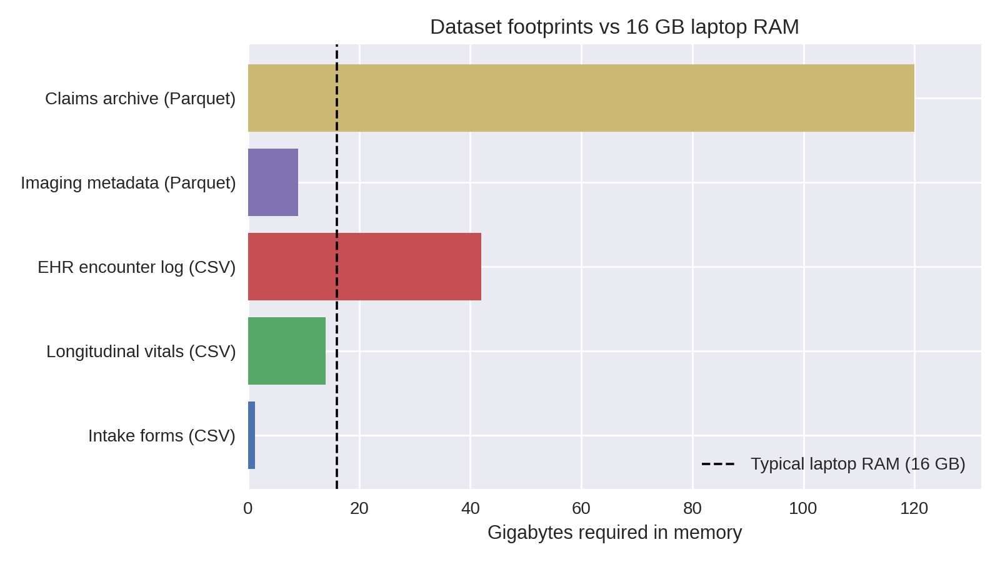
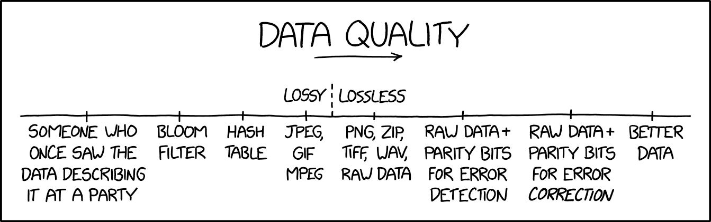
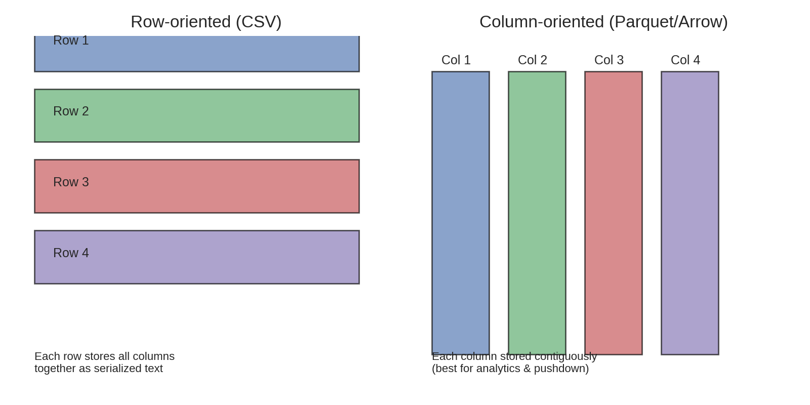
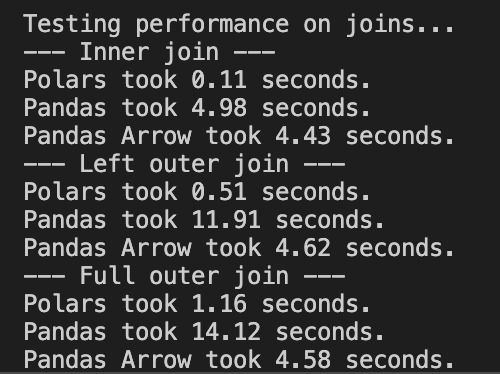
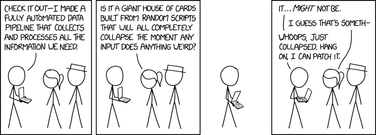
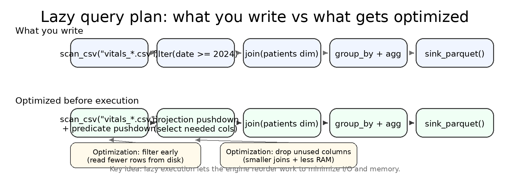
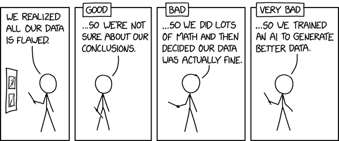
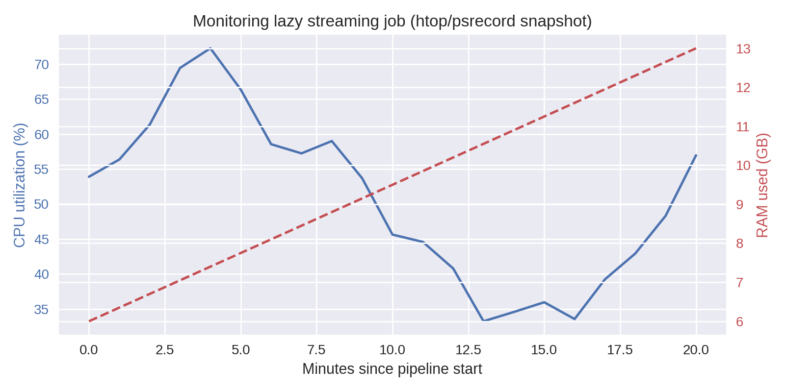
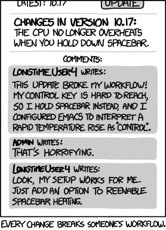
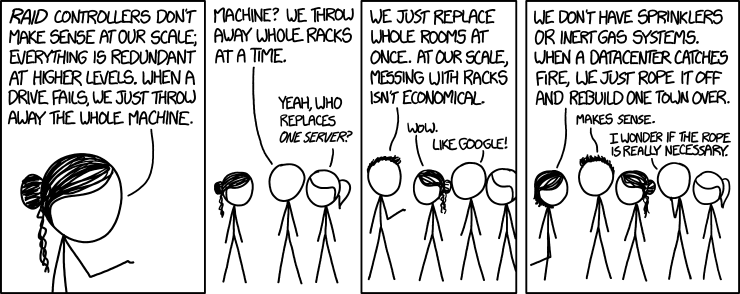

02: Scaling Tabular Workflows with Polars ⚡

- hw02 - #FIXME add GitHub Classroom link once ready

# Links & Self-Guided Review

- [Polars User Guide](https://docs.pola.rs/user-guide/) – official docs with eager + lazy API examples
- [Apache Arrow Columnar Format](https://arrow.apache.org/overview/) – why columnar memory layouts matter
- [Parquet Fundamentals](https://parquet.apache.org/docs/file-format/) – format internals and predicate pushdown
- [Real Python: Working With Large CSVs](https://realpython.com/csv-python/#working-with-large-csv-files-using-pandas) – diagnosing `MemoryError`
- [VS Code: Python performance tips](https://code.visualstudio.com/docs/python/python-tutorial) – environment setup + profiling
- `scripts/fetch_xkcd_2x.py` – grab XKCD comics (see `all_xkcd.csv` index) for lecture visuals

# Why Memory Limits Sneak Up On Us



# FIXME Ensure this graphic matches the text/table: clarify whether bars show on-disk size vs in-memory size (or split into two visuals/series)

Health datasets outgrow laptop RAM quickly: a handful of CSVs with vitals, labs, and encounters can exceed 16 GB once loaded. Attempting to "just read the file" leads to system thrash, swap usage, and eventually Python `MemoryError`s that interrupt the workflow.

### Laptop specs vs dataset footprints

| Dataset | Typical raw size | In-memory pandas size | Fits on 16 GB laptop? |
| ------- | ---------------- | --------------------- | --------------------- |
| Intake forms (CSV) | 250 MB | ~1.2 GB (due to dtype inflation) | ✅ |
| Longitudinal vitals (CSV) | 6 GB | ~14 GB | ⚠️ borderline |
| EHR encounter log (CSV) | 18 GB | ~42 GB | ❌ |
| Imaging metadata (Parquet) | 9 GB | ~9 GB | ⚠️ if other apps closed |
| Claims archive (partitioned Parquet) | 120 GB | streamed | ✅ (with streaming) |

### Warning signs you are hitting RAM limits

- `top` or `Activity Monitor` shows Python ballooning toward total RAM
- Fans spin, everything slows, disk swap spikes
- OS kills kernel/terminal; `MemoryError` or `Killed: 9` messages
- Notebook kernel restarts when running seemingly "simple" cells



*If the rows are literally on fire, start fixing quality before scaling anything else.*

Grab a quick sense of scale (`du -sh data/`, `wc -l big_file.csv`) before committing to a full load—if numbers dwarf your RAM, pivot immediately.

### Quick pivot when pandas crashes

1. **Stop the read** once memory spikes—killing the kernel only hides the problem.
2. **Profile the file size** (`du -sh`, `wc -l`) so you know what you are up against.
3. **Convert the source** to Parquet or Arrow once using a machine with headroom.
4. **Rebuild the transform** with Polars lazy scans (`pl.scan_*`) and streaming collects.
5. **Cache intermediate outputs** so future runs never touch the raw CSV again.

### Code Snippet: Pushing pandas too far

```python
import pandas as pd
from pathlib import Path

PATH = Path("data/hospital_records_2020_2023.csv")

try:
    df = pd.read_csv(PATH)
except MemoryError:
    raise SystemExit(
        "Dataset too large: consider chunked loading or Polars streaming"
    )
```

This is the moment to stop fighting pandas and switch strategies (column pruning, chunked readers, or a Polars lazy pipeline) *before* debugging phantom crashes.

# Polars Essentials

# FIXME Pedagogical visual: reinforce *why* columnar formats matter

# FIXME Add `02/media/row_vs_column.png` here and explicitly tie it to

# FIXME - projection pushdown (read only needed columns)

# FIXME - predicate pushdown (skip whole row groups / chunks)

# FIXME - compression benefits from same-typed contiguous values

# FIXME Prompt: "If you only need `patient_id` + `heart_rate`, what does a columnar engine read vs a CSV reader?"





# FIXME Add benchmark context (machine/dataset) or replace with a table; avoid implying the exact ratios generalize

pandas is ubiquitous and a great default; Polars is often adopted case-by-case when you hit real constraints (runtime, memory, I/O).



Polars is pandas without the hidden index and with a Rust engine under the hood. Two mindshifts:

- **Everything is explicit columns**—no surprise index alignment.
- **Expressions replace per-row Python**—filters, casts, joins compile to vectorized Rust kernels.

### Reference Card: pandas → Polars translation

| You know this in pandas | Do this in Polars |
| ----------------------- | ----------------- |
| `pd.read_csv("file.csv")` | `pl.read_csv("file.csv")` *(eager preview)* |
| *(no equivalent)* lazy scan | `pl.scan_csv("file.csv")` *(build plan, nothing runs yet)* |
| `df[df.age > 65]` | `.filter(pl.col("age") > 65)` |
| `df.assign(bmi=...)` | `.with_columns(pl.col("weight") / pl.col("height")**2)` |
| `df.groupby("cohort").agg(...)` | `.group_by("cohort").agg([...])` |
| `df.merge(dim, on="id")` | `.join(dim, on="id")` |
| *(n/a)* | `.collect(engine="streaming")` |

### Common methods (used in demos + HW02)

Most of this lecture uses a `LazyFrame` pipeline (`pl.scan_* → ... → collect/sink`). If you learn these methods, you can read almost every Polars example we write this quarter.

| Goal | Method | Notes |
| ---- | ------ | ----- |
| Inspect columns + dtypes | `.collect_schema()` | Preferred for `LazyFrame`; avoids the “resolving schema is expensive” warning |
| See the query plan | `.explain()` | Helps you spot joins/sorts and confirm pushdown |
| Keep only columns you need | `.select([...])` | Enables projection pushdown |
| Filter rows early | `.filter(...)` | Enables predicate pushdown |
| Create/transform columns | `.with_columns(...)` | Use expressions (`pl.col(...)`, `pl.when(...)`) instead of Python loops |
| Aggregate to a target grain | `.group_by(...).agg([...])` | Often do this *before* joining large tables |
| Combine tables | `.join(other, on=..., how=...)` | Know the grain to avoid many-to-many explosions |
| Materialize results | `.collect(engine="streaming")` | Streaming helps when the pipeline is streamable |
| Write without materializing | `.sink_parquet("...")` | Writes directly to disk from the lazy pipeline |

### Code Snippet: pandas vs Polars

```python
import pandas as pd
import polars as pl

# pandas: full load, then work
pandas_result = (
    pd.read_csv("data/vitals.csv")
      .query("timestamp >= '2024-01-01'")
      .groupby("patient_id")
      .heart_rate.mean()
)

# polars: lazy scan, stream collect
polars_result = (
    pl.scan_csv("data/vitals.csv")
      .filter(pl.col("timestamp") >= pl.datetime(2024, 1, 1))
      .group_by("patient_id")
      .agg(pl.mean("heart_rate").alias("avg_hr"))
      .collect(engine="streaming")
)
```

### Does pandas support larger-than-memory data now?

Core pandas is still fundamentally in-memory for operations like groupby, joins, sorts, etc.

- What has improved a lot is I/O and dtypes via `pyarrow` (projection/predicate pushdown at read time; Arrow-backed strings/types).
- For larger-than-RAM pipelines, common tools include DuckDB, Polars, Dask/Modin, Vaex, or PyArrow dataset/compute (depending on the task).
- pandas is catching up on Parquet I/O via `pyarrow` (projection/predicate pushdown), but most pandas transforms (groupby/join/sort) still run in-memory.

### Columnar hand-off

Convert each raw CSV to Parquet once, then keep everything columnar:

```python
import os
import polars as pl

source = "data/patient_vitals.csv"
pl.read_csv(source).write_parquet("data/patient_vitals.parquet", compression="zstd")

csv_mb = os.path.getsize(source) / 1024**2
parquet_mb = os.path.getsize("data/patient_vitals.parquet") / 1024**2
print(f"{csv_mb:.1f} MB → {parquet_mb:.1f} MB ({csv_mb / parquet_mb:.2f}x smaller)")
```

Use `LazyFrame.collect_schema()` (not `lazyframe.schema`) to confirm dtypes, and partition long histories by `year` or `facility` so streaming scans stay sub-gigabyte.

### Data model for today’s work

The demos and assignment use “health-data-shaped” tables: multiple sources, repeated measurements, and joins that can accidentally multiply rows.

| Table | Grain | Join key(s) | Typical use |
| ----- | ----- | ----------- | ----------- |
| `user_profile` (demo) | 1 row per `user_id` | `user_id` | Demographics / grouping |
| `sleep_diary` (demo) | 1 row per `user_id` per day | `user_id`, `date` | Nightly outcomes |
| `sensor_hrv` (demo) | many rows per device in 5-min windows | derive `user_id` from `device_id`; also `date` from `ts_start` | High-volume physiology |
| `encounters` (assignment) | many rows per `patient_id` | `patient_id` | Events/visits to count/stratify |
| `vitals` (assignment) | many rows per `patient_id` | `patient_id` (+ time filter) | Measurements to summarize |

Two practical rules:

- Know the *grain* before you join (one-to-many joins are normal; many-to-many joins often explode row counts).
- Decide early whether you want “per-patient”, “per-encounter”, or “per-month” outputs, and aggregate to that grain before expensive joins.

### Advanced aside: Parquet layout (why it affects speed)

- Parquet stores data in **row groups**; each row group contains per-column chunks plus min/max stats that enable predicate pushdown.
- If you frequently filter on `facility` or `year`, consider **partitioning** your dataset by those columns (fewer bytes scanned).
- Avoid thousands of tiny Parquet files (metadata overhead); prefer fewer, reasonably sized files with consistent schema.


# LIVE DEMO

See [`demo/01a_streaming_filter.md`](./demo/01a_streaming_filter.md) for the Polars basics walkthrough.

# Lazy Execution & Streaming Patterns



# FIXME Add a concrete `query.explain()` output screenshot/snippet so students recognize the real plan format



Lazy plans shine once you chain multiple operations: the engine reorders filters, drops unused columns, and chooses whether to stream.

### Diagnose and trust the plan

- `query.explain()` outlines scan → filter → join → aggregate so you can spot expensive steps.
- `query.collect(engine="streaming")` opts into streaming; Polars swaps to an in-memory engine only when necessary (e.g., global sorts).
- `.sink_parquet("outputs/summary.parquet")` writes directly to disk without materializing the DataFrame in Python.

### Streaming limits (when streaming won’t help)

Streaming is powerful, but not magic. Some operations force large shuffles or require global state.

Common “streaming-hostile” patterns:

- Global sorts and “top-k” style operations that need to see all rows.
- Many-to-many joins (or joins after a key exploded) that produce huge intermediate tables.
- Some window functions / rolling calculations that need overlapping history.
- Wide reshapes like pivots that increase the number of columns dramatically.

When this happens:

- Reduce columns early (projection), filter early (predicate), and aggregate to the target grain before joins.
- Write intermediate outputs (Parquet) at stable checkpoints so you don’t recompute expensive steps.

### Reference Card: Lazy vs eager

| Situation | Use eager when… | Use lazy when… |
| --------- | --------------- | -------------- |
| Notebook poke | You just need `.head()` | You’re scripting a repeatable job |
| File size | File < 1 GB fits in RAM | Files are globbed or already too large |
| Complex UDF | Logic needs Python per row | You can rewrite as expressions |
| Joins/aggregations | Dimension table is tiny | Fact table exceeds RAM |

### Code Snippet: Multi-source lazy join

```python
import polars as pl

patients = pl.scan_parquet("data/patients/*.parquet").select(
    ["patient_id", "age_group", "gender"]
)

labs = pl.scan_parquet("data/labs/*.parquet").filter(
    pl.col("test_name") == "HbA1c"
)

query = (
    labs.join(patients, on="patient_id", how="inner")
        .group_by(["age_group", "gender"])
        .agg(pl.mean("result_value").alias("avg_hba1c"))
)

result = query.collect(engine="streaming")
```

# LIVE DEMO

See [`demo/02a_lazy_join.md`](./demo/02a_lazy_join.md) for the lazy-plan deep dive.

# Building a Polars Pipeline

# FIXME Decide if `02/media/resource_monitor.png` is pedagogically helpful; consider replacing with a simple "memory stays bounded" plot (plateau + 16GB line) or a short table of peak RSS

# FIXME Pedagogical visual: pipeline anatomy (inputs/config → transforms → outputs/logs/artifacts), maybe as a small diagram







Put the pieces together: start lazy, keep everything parameterized, and stream the final collect.

### Checklist: from pandas crash to Polars pipeline

- **Define inputs & outputs** in a config (`config/pipeline.yaml`) instead of hardcoding paths.
- **Scan sources lazily** (`pl.scan_parquet`) and push filters (`pl.col("timestamp") >= ...`).
- **Join dimensions** only after pruning columns so keys stay small.
- **Collect with streaming** or `.sink_parquet()` to avoid materializing giant tables.
- **Emit artifacts + logs** (row counts, durations) for reproducibility.

### Methodology (what we’ll do in Demo 03 + HW02)

- **Config-driven**: all file globs, filters, and output paths live in YAML.
- **Three phases**: load (scan + cast) → transform (joins + groupby) → materialize (write artifacts).
- **Artifacts**: always write both Parquet (for downstream pipelines) and CSV (for quick inspection).
- **Sanity checks**: row counts, schema, and “does the output look plausible?” before you ship results.

### Reference Card: Pipeline ergonomics

| Task | Command | Why |
| ---- | ------- | --- |
| Run script with config | `uv run python pipeline.py --config config/pipeline.yaml` | Keeps datasets swappable |
| Monitor usage | `htop`, `psrecord pipeline.py` | Catch runaway memory early |
| Benchmark modes | `hyperfine 'uv run pipeline.py --engine streaming' ...` | Compare eager vs streaming |
| Validate outputs | `pl.read_parquet(...).describe()` | Confirm schema + row counts |
| Archive artifacts | `checksums.txt`, `manifest.json` | Detect drift later |

### Code Snippet: CLI batch skeleton

```python
import argparse
import logging
import polars as pl
from pathlib import Path

logging.basicConfig(level=logging.INFO, format="%(levelname)s %(message)s")

parser = argparse.ArgumentParser(description="Generate vitals summary")
parser.add_argument("--input", default="data/vitals_*.parquet")
parser.add_argument("--output", default="outputs/vitals_summary.parquet")
parser.add_argument("--engine", choices=["streaming", "auto"], default="streaming")
args = parser.parse_args()

query = (
    pl.scan_parquet(args.input)
    .filter(pl.col("timestamp") >= pl.datetime(2023, 1, 1))
    .group_by("patient_id")
    .agg([
        pl.len().alias("num_measurements"),
        pl.median("heart_rate").alias("median_hr"),
    ])
)

result = query.collect(engine=args.engine)
Path(args.output).parent.mkdir(parents=True, exist_ok=True)
result.write_parquet(args.output)
logging.info("Wrote %s rows to %s", result.height, args.output)
```

# LIVE DEMO

See [`demo/03a_batch_report.md`](./demo/03a_batch_report.md) for a config-driven batch run with validation checkpoints.
