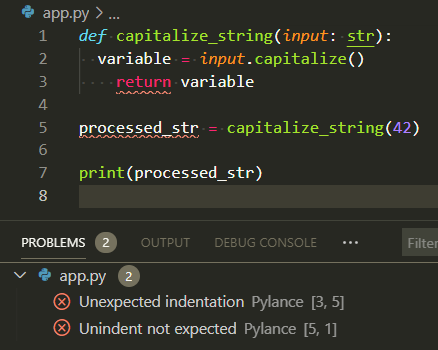
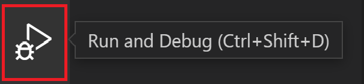
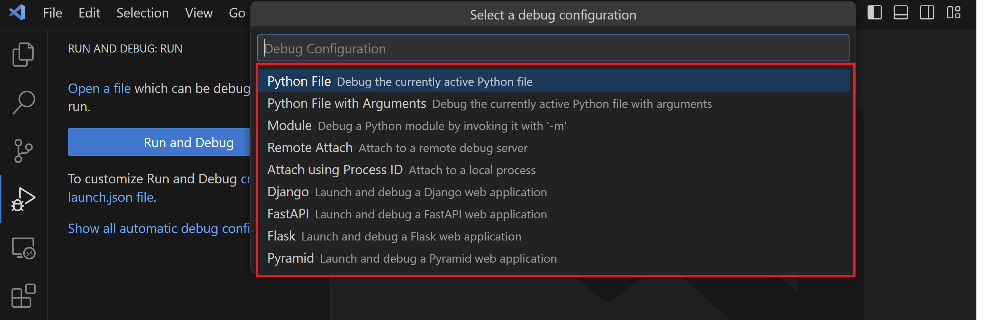
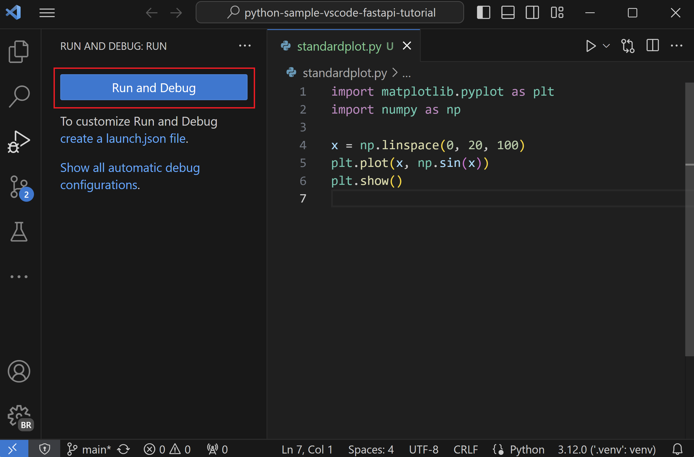
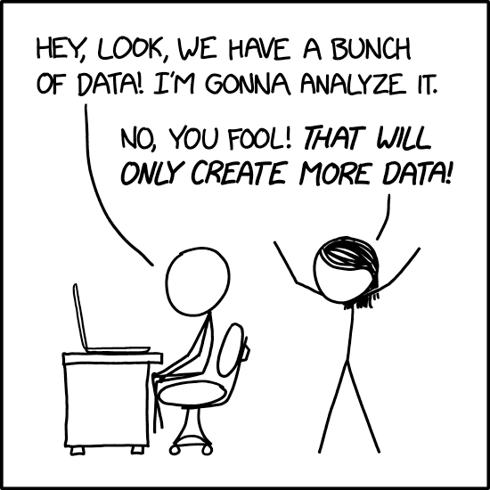
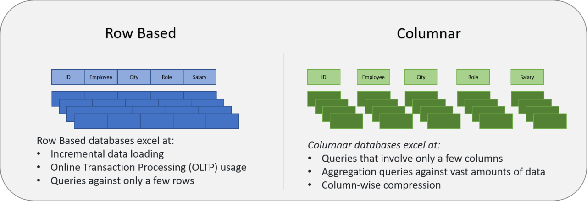

<!--
# Instructor Preparation Notes

This lecture covers three main topics for health data science students who are beginners in programming:
1. `Jupyter` notebooks as an interactive environment for health data exploration
2. Debugging techniques from basic to advanced for health-related Python code
3. Working with large health datasets using `polars`

## Time Allocation
- `Jupyter` notebooks: 20 minutes + 10 minute demo
- Debugging: 30 minutes + 20 minute demo (split between print, pdb and `VS Code`)
- Big Data: 20 minutes + 10 minute demo
- Total: 110 minutes (including demos)

## Demo Preparation
- Ensure all demo scripts are working on your machine
- For demo1: Have a simple script with common bugs ready (patient data processing)
- For demo2: Prepare a script with logical errors for pdb debugging (medication dosage calculation)
- For demo3: Have VS Code ready with the demo3-bmi-calculator.py loaded (BMI calculation)
- For demo4: Test demo4-generate_large_health_data.py and demo4-analyze_large_health_data.py (large patient dataset)

## Common Student Questions
- "Why use `Jupyter` instead of regular Python scripts?"
- "When should I use print vs. debugger?"
- "How do I know which debugging technique to use?"
- "What's the difference between `pandas` and `polars`?"
- "How large is 'too large' for `pandas`?"
- "How do I know if my code has a bug or if my data is wrong?"
- "Can I use these debugging techniques in other programming languages?"

## Key Learning Outcomes
- Students should be able to use `Jupyter` for interactive health data exploration
- Students should be able to identify and fix common bugs using appropriate techniques
- Students should understand when and how to use `polars` for large health datasets
- Students should be able to apply debugging skills to their own health data projects
-->

# Debugging and Big Data in Health Data Science 🐛💾🏥

## Outline

1. **`Jupyter` Notebooks for Health Data Exploration**
    - What are `Jupyter` notebooks and why use them?
    - Magic commands and shell integration
    - Best practices for reproducible analysis
    - **Demo Break**: Interactive exploration of health data

2. **Debugging Python Code in Health Applications**
    - Print debugging: The first line of defense
    - Interactive debugging with `pdb`
    - Visual debugging with `VS Code`
    - Common bugs in health data processing
    - **Demo Break**: Finding and fixing bugs in health data scripts

3. **Working with Large Health Datasets**
    - Why traditional `pandas` might not be enough
    - Introduction to `polars` for efficient processing
    - Handling electronic health records larger than memory
    - Best practices for big health data
    - **Demo Break**: Analyzing a large patient dataset

> ### **Debugging:** Being the detective in a crime movie where you are also the murderer

## References and Resources 📚

### Python and Jupyter Resources

- [Jupyter Documentation](https://jupyter.org/documentation) - Official documentation for Jupyter notebooks
- [Dataquest Jupyter Tutorial](https://www.dataquest.io/blog/jupyter-notebook-tutorial/) - Beginner-friendly tutorial
- [Python for Healthcare Modelling and Data Science](https://www.routledge.com/Python-for-Healthcare-Modelling-and-Data-Science/Dauletbakov-Moussa/p/book/9781032124001) - Python applications in healthcare
- [Official Python Documentation](https://docs.python.org/3/) - Python language reference

### Debugging Resources

- [Python Debugger (pdb) Documentation](https://docs.python.org/3/library/pdb.html) - Official pdb documentation
- [`VS Code` Debugging Guide](https://code.visualstudio.com/docs/python/debugging) - Visual debugging tutorial
- [Real Python Debugging Guide](https://realpython.com/python-debugging-pdb/) - Practical debugging techniques
- [Python Testing with `pytest`](https://pragprog.com/titles/bopytest/python-testing-with-pytest/) - Testing as a debugging strategy
- [Full Stack Python Debugging Guide](https://www.fullstackpython.com/debugging.html) - Comprehensive debugging techniques
- [VS Code Debugging Overview](https://code.visualstudio.com/docs/debugtest/debugging) - General debugging concepts

### Big Data Processing Resources

- [`pandas` Documentation](https://pandas.pydata.org/) - Standard data analysis library
- [`polars` Documentation](https://pola.rs/) - Fast DataFrame library for large datasets
- [Python for Data Analysis](https://wesmckinney.com/book/) - By `pandas` creator Wes McKinney
- [`Parquet` Format Explained](https://parquet.apache.org/docs/) - Efficient columnar storage format
- [Healthcare Data Analytics Using Python](https://link.springer.com/book/10.1007/978-1-4842-7986-7) - Specific to health data
- [Polars vs. pandas: What's the Difference?](https://blog.jetbrains.com/pycharm/2024/07/polars-vs-pandas/) - Detailed comparison of performance and features
- [Polars Lazy Evaluation Guide](https://docs.pola.rs/user-guide/lazy/using/) - How to use lazy evaluation for large datasets

### Code Quality Tools

- [Ruff Documentation](https://docs.astral.sh/ruff/) - Modern, fast Python linter written in Rust
- [Pylint Documentation](https://pylint.org/) - Traditional Python linter with extensive rules
- [Python Debugger Comparison](https://docs.python.org/3/library/pdb.html) - Overview of Python's built-in debugger

## 1. Jupyter Notebooks for Health Data Exploration 🎮🏥

### 1.1 What Are Jupyter Notebooks?


Jupyter notebooks are interactive documents that let you **write and run code, see results immediately, and mix in text, images, and equations**.

```python
# Example of a code cell in Jupyter
import pandas as pd
patient_data = pd.read_csv("patient_records.csv")
patient_data.head()  # Displays first 5 rows
```

#### Why Jupyter is Perfect for Health Data Science

- **Interactive exploration**: Test hypotheses on patient data instantly
- **Visual analysis**: Create charts of health metrics on the fly
- **Documentation**: Explain your analysis alongside code
- **Reproducibility**: Share complete analyses with colleagues
- **Teaching tool**: Perfect for learning data science concepts

### 1.2 Magic Commands ✨

Jupyter has special commands starting with `%` (line magics) or `%%` (cell magics) that extend functionality.

#### Essential Magic Commands

| Magic Command | What It Does | Health Data Example |
|:--------------|:-------------|:-------------------|
| `%pip install` | Install packages | `%pip install pydicom` for medical imaging |
| `%matplotlib inline` | Display plots in notebook | Visualize patient vitals over time |
| `%timeit` | Measure code performance | Optimize patient matching algorithms |
| `%debug` | Debug after an error | Fix issues in data cleaning pipeline |
| `%run` | Run external scripts | Execute preprocessing scripts |

```python
# Example: Timing a patient matching function
%timeit find_matching_patients(patients_df, "diabetes")
```

### 1.3 Shell Commands in Jupyter 🖥️

You can run system commands by prefixing with `!`, perfect for managing health data files.

```python
# List all CSV files in the patient_data directory
!ls ./patient_data/*.csv

# Count lines in a large health dataset
!wc -l hospital_admissions.csv

# Check disk space for large imaging datasets
!du -h ./medical_images/
```

#### Common Shell Commands

- `!head -n 5 patient_data.csv` - Preview first 5 lines of a dataset
- `!grep "diabetes" patient_records.txt` - Find records containing "diabetes"
- `!mkdir -p ./processed_data/2023` - Create directories for organized data
- `!wget https://data.gov/health/dataset.csv` - Download public health datasets

### 1.4 Best Practices for Reproducible Research 📊

#### Key Practices

1. **Organize your notebook:**
    - Use markdown headings to structure analysis
    - Include study objectives and methods
    - Document data sources and limitations

2. **Ensure reproducibility:**
    - Set random seeds for consistent results
    - Use relative file paths
    - Include package versions with `!pip freeze`
    - Restart and run all cells before sharing

3. **Data documentation:**
    - Include data dictionaries for health variables
    - Document preprocessing steps
    - Note missing data handling
    - Include ethical considerations

4. **Export for sharing:**
    - HTML/PDF for reports to clinicians
    - `.py` scripts for production pipelines
    - GitHub for version control
    - Binder for interactive sharing

```python
# Example: Setting random seed for reproducible patient sampling
import numpy as np
np.random.seed(42)  # Always use the same random sample
patient_sample = patient_data.sample(n=100)
```

### DEMO BREAK: Interactive Exploration of Health Data

See: [`demo0-jupyter-notebooks`](./demo/demo0-jupyter-notebooks.md)

## 2. Debugging Python Code 🐛🏥

### 2.1 Print Debugging: Your First Line of Defense

```python
def calculate_bmi(weight, height):
    print(f"Weight: {weight} kg")    # Debug print
    print(f"Height: {height} m")     # Debug print
    bmi = weight / (height ** 2)
    print(f"BMI: {bmi}")             # Debug print
    return bmi

# Output:
# Weight: 70 kg
# Height: 1.75 m
# BMI: 22.86
```

The **simplest** debugging technique is adding strategic print statements to track values and program flow.

```python
def calculate_bmi(weight_kg, height_m):
    print(f"Input: weight={weight_kg}kg, height={height_m}m")  # Debug print
    
    bmi = weight_kg / (height_m ** 2)
    print(f"Calculated BMI: {bmi}")  # Debug print
    
    if bmi < 18.5:
        category = "Underweight"
    elif bmi < 25:
        category = "Normal weight"
    elif bmi < 30:
        category = "Overweight"
    else:
        category = "Obese"
    
    print(f"BMI Category: {category}")  # Debug print
    return bmi, category
```

#### When to Use Print Debugging

- **Quick checks** during development
- **Understanding data flow** in health record processing
- **Identifying where** a function fails with patient data
- **Tracking values** of clinical variables through calculations

#### Print Debugging Patterns

```python
# 1. Checkpoint prints
print("Starting patient data import...")

# 2. Variable inspection
print(f"Patient ID: {patient_id}, Type: {type(patient_id)}")

# 3. Data shape checks
print(f"Patient dataframe shape: {df.shape}")

# 4. Conditional debugging
if blood_pressure > 180:
    print(f"WARNING: Very high BP value: {blood_pressure}")
```

### 2.2 Jupyter Debugger: A Simple Front-End to pdb

Jupyter notebooks provide a simple debugging interface through the `%debug` magic command. This is essentially a front-end to Python's built-in debugger (`pdb`), which we'll explore in more detail later.

```python
# Example of using %debug in a Jupyter notebook
def process_patient_data(patient_id, age, weight):
    # This will cause an error if height is not defined
    bmi = weight / (height ** 2)
    return bmi

# Run the function (will raise an error)
try:
    process_patient_data("P12345", 45, 70)
except NameError:
    # After catching the error, run %debug to enter the debugger
    %debug
```

When you run the above code, the `%debug` command will automatically enter the debugger after the NameError occurs. The debugger will stop at the line where the error occurred, allowing you to inspect variables and step through code.

While convenient for quick debugging within notebooks, the Jupyter debugger interface is somewhat clunky compared to dedicated debugging tools. For more complex debugging tasks, we'll explore more powerful options like `pdb` and VS Code's visual debugger.

### 2.3 Code Quality Tools: Preventing Bugs Before They Happen

While print debugging helps you find bugs after they occur, code quality tools like linters help prevent bugs before they happen.

Code linters are automated tools that analyze your code to detect potential problems, bugs, stylistic errors, and suspicious constructs without running the program. They help maintain code quality and catch common mistakes early in development.



Linters are like the spell checker in your word processor - they highlight potential issues with _squiggly underlines_ as you type, allowing you to fix problems before they cause issues. Just as a spell checker catches misspelled words, linters catch coding errors, style violations, and potential bugs.

Common Python linters include:

- **Pylint**: A traditional, comprehensive linter with extensive rules for code style, error detection, and complexity checking
- **Ruff**: A modern, extremely fast linter written in Rust that can replace multiple Python linters while maintaining high accuracy

```python
# Example of code that Ruff would catch:
def process_patient_data(patient_id, age, weight):  # Missing type hints
    if age < 0:  # Potential logical error
        return None
    bmi = weight / (height ** 2)  # Undefined variable 'height'
    return bmi
```

## Live demo!

[`demo1-print-debugging`](./demo/demo1-print-debugging.md)

### 2.4 Interactive Debugging with Python Debugger (pdb) 🐞

```
> /path/to/script.py(10)calculate_bmi()
-> bmi = weight / (height ** 2)
(Pdb) p weight
70
(Pdb) p height
1.75
(Pdb) n
> /path/to/script.py(11)calculate_bmi()
-> print(f"BMI: {bmi}")
(Pdb) p bmi
22.86
(Pdb) c
```

Python's built-in debugger (`pdb`) allows you to **pause execution** and interactively explore program state.

#### Choosing Your First Python Debugger

When starting with Python debugging, you have several options:

1. **Print Statements**: Simplest approach, good for quick checks
2. **pdb**: Built-in, works everywhere, but command-line based
3. **ipdb**: Enhanced pdb with syntax highlighting and better navigation
4. **VS Code Debugger**: Visual interface, easier for beginners
5. **PyCharm Debugger**: Full-featured IDE with powerful debugging tools

For beginners, we recommend starting with print statements and VS Code's visual debugger, then moving to pdb as you gain confidence.

#### How to Use pdb

1. **Insert a breakpoint** in your code:

    ```python
    def process_lab_results(patient_labs):
        # Stop execution when this line is reached
        breakpoint()  # Python 3.7+ syntax
        # Or use: import pdb; pdb.set_trace()  # older Python versions
        
        abnormal_results = []
        for test, value in patient_labs.items():
            if is_abnormal(test, value):
                abnormal_results.append((test, value))
        return abnormal_results
    ```

2. **Run your script** normally - it will pause at the breakpoint

3. **Use pdb commands** to inspect and control execution:

_For more pdb commands and examples, see the [official Python pdb documentation](https://docs.python.org/3/library/pdb.html)._

pdb is a powerful tool, but for beginners, **print statements and VS Code's visual debugger** are usually easier to start with.

## Live demo!

[`demo2-pdb-debugging`](./demo/demo2-pdb-debugging.md)

### 2.4 Visual Debugging with VS Code 🖥️


VS Code provides a **graphical debugger** that makes debugging more intuitive and powerful.

> **Note:** You can customize keyboard shortcuts in VS Code:
> 1. Open Command Palette (⌘+Shift+P on Mac, Ctrl+Shift+P on Windows/Linux)
> 2. Type "Preferences: Open Keyboard Shortcuts"
> 3. Search for "debug" to find and customize debugging shortcuts

#### Key VS Code Debugging Features

1. **Visual breakpoints**: Click in the gutter to set breakpoints
2. **Variable explorer**: See all variables and their values
3. **Watch expressions**: Monitor specific expressions
4. **Call stack view**: See the execution path
5. **Step controls**: Buttons for step over, into, out
6. **Conditional breakpoints**: Break only when a condition is true

#### Setting Up VS Code for Debugging

1. Install the Python extension
2. Open your health data script
3. Set breakpoints by clicking left of line numbers
4. Press F5 or click the "Run and Debug" button




5. Select "Python File" configuration

#### Debugging a Patient Data Processing Script



```python
def calculate_medication_dosage(patient_weight, medication):
    """Calculate medication dosage based on patient weight."""
    # Set a breakpoint on this line
    if medication == "acetaminophen":
        return patient_weight * 15  # 15mg per kg
    elif medication == "ibuprofen":
        return patient_weight * 10  # 10mg per kg
    else:
        return 0  # Unknown medication
```

#### Advanced VS Code Debugging Features

- **Conditional breakpoints**: Break only when `patient_id == "P12345"`
- **Logpoints**: Log values without modifying code
- **Debug Console**: Execute Python code while paused at a breakpoint to inspect variables, test expressions, or run custom code in the context of your program
- **Remote debugging**: Debug code running on hospital servers

### DEMO BREAK: Finding and Fixing Bugs in Health Data Scripts

[`demo3-vscode-debugging`](./demo/demo3-vscode-debugging.md)


### 2.4 Using Test Cases to Reproduce Bugs

- Create **small, repeatable examples** that trigger the bug
- Automate with `assert` statements or test frameworks
- Ensures bug is fixed and **doesn't come back**

#### Simple Test Cases

```python
def test_bmi():
    assert calculate_bmi(70, 1.75) > 0
```

#### Using pytest for Automated Testing

[`pytest`](https://docs.pytest.org/) is a popular testing framework that makes it easy to write and run tests.

1. **Installation**:

    ```bash
    pip install pytest
    ```

2. **Creating Test Files**:
    - Name files with `test_` prefix (e.g., `test_bmi_calculator.py`)
    - Write functions with `test_` prefix

3. **Writing Tests**:

    ```python
    # test_bmi_calculator.py
    def test_bmi_calculation():
        from bmi_calculator import calculate_bmi
        assert calculate_bmi(70, 1.75) == 22.86
        
    def test_bmi_categories():
        from bmi_calculator import get_bmi_category
        assert get_bmi_category(18.4) == "Underweight"
        assert get_bmi_category(22.0) == "Normal weight"
        assert get_bmi_category(27.5) == "Overweight"
        assert get_bmi_category(31.0) == "Obese"
    ```

5. **Benefits for Debugging**:
    - Verify fixes work correctly
    - Prevent regression (bugs coming back)
    - Document expected behavior
    - Automate testing with GitHub Actions

## 3. Working with Large Datasets 💾🏥



### 3.1 Why Traditional `pandas` Might Not Be Enough 🐼

Health data science often involves **massive datasets** that won't fit in memory:

📊 **Dataset Size Comparison**:

| Data Type | Typical Size | Fits in Memory? |
|:----------|:------------|:----------------|
| **Electronic Health Records (EHRs)** | 10GB-1TB+ | ❌ Often too large |
| **Medical Imaging** | 100MB-10GB per scan | ❌ Collections too large |
| **Genomic Data** | 1TB+ per patient | ❌ Far too large |
| **Claims Data** | 100GB+ | ❌ Too large |
| **Longitudinal Studies** | Growing over time | ❌ Eventually too large |
| **Small Research Dataset** | <1GB | ✅ Usually fits |

⚠️ **Memory Warning Signs**:

- Computer slows down dramatically
- Applications crash unexpectedly
- "MemoryError" in Python
- System becomes unresponsive

#### The `pandas` Memory Challenge

```python
# This approach works for small datasets but fails with large ones
import pandas as pd

try:
    # 🚨 Will crash with large health datasets
    patient_records = pd.read_csv("hospital_records_2020_2023.csv")
    diabetes_patients = patient_records[patient_records["diagnosis"] == "diabetes"]
except MemoryError:
    print("Dataset too large for memory!")
```

### 3.2 Introduction to polars for Efficient Data Processing ⚡


**polars** is a modern DataFrame library designed for speed and efficiency:

🚀 **Key Features**:

| Feature | Description | Benefit |
|:--------|:------------|:--------|
| **Lazy Evaluation** | Plans operations before execution | Optimizes query plan |
| **Streaming** | Processes data in chunks | Handles data larger than memory |
| **Arrow Backend** | Efficient columnar memory layout | Faster data processing |
| **Parallel Processing** | Uses all CPU cores | Better performance |
| **Similar Syntax** | Familiar API for pandas users | Easy transition |

📈 **Performance Comparison**:

- **10-20x** faster than pandas for many operations
- Uses **50-80%** less memory for the same datasets
- Scales to datasets **100x larger** than pandas can handle
- Written in Rust for high performance and memory safety

```python
import polars as pl

# Efficient processing of large health records
diabetes_stats = (
    pl.scan_csv("hospital_records_2020_2023.csv")  # Lazy loading
    .filter(pl.col("diagnosis") == "diabetes")     # Filter first
    .groupby(["age_group", "gender"])              # Group by demographics
    .agg([
        pl.count().alias("patient_count"),
        pl.mean("hba1c").alias("avg_hba1c"),
        pl.mean("bmi").alias("avg_bmi")
    ])
    .collect(streaming=True)  # Process in chunks
)
```

### 3.3 Parquet: An Efficient Data Storage Format for Out-of-Memory Scenarios 🗄️


**Parquet** is a columnar storage format that's essential for working with datasets larger than memory:

📁 **Storage Efficiency**:

| Format | Size | Query Speed | Schema | Best For |
|:-------|:-----|:------------|:-------|:---------|
| **CSV** | 🔴 Large | 🔴 Slow | ❌ No | Simple data exchange |
| **JSON** | 🔴 Very large | 🔴 Very slow | ✅ Yes | API responses |
| **Parquet** | 🟢 Small (2-4x smaller) | 🟢 Fast | ✅ Yes | Analytics, big data |
| **HDF5** | 🟢 Small | 🟢 Fast | ✅ Yes | Scientific computing |

🔍 **Key Advantages**:

- **Column-based**: Perfect for analytical queries on specific variables
- **Compression**: 2-4x smaller than CSV files
- **Schema Enforcement**: Ensures data consistency
- **Predicate Pushdown**: Filter data before loading
- **Partitioning**: Organize by year, facility, or department



#### Comparing `pandas` vs `polars` with `Parquet`

```python
import polars as pl
import pandas as pd
import time
import os

# Convert CSV to Parquet for more efficient storage
print("Converting CSV to Parquet...")
pl.read_csv("patient_vitals.csv").write_parquet("patient_vitals.parquet")

# Compare file sizes
csv_size = os.path.getsize("patient_vitals.csv") / (1024 * 1024)  # MB
parquet_size = os.path.getsize("patient_vitals.parquet") / (1024 * 1024)  # MB
print(f"CSV size: {csv_size:.2f} MB, Parquet size: {parquet_size:.2f} MB")
print(f"Compression ratio: {csv_size/parquet_size:.2f}x")

# Try with pandas - CSV (may fail with large files)
print("\nTrying pandas with CSV...")
try:
    start = time.time()
    df_pandas_csv = pd.read_csv("patient_vitals.csv")
    df_pandas_csv = df_pandas_csv[df_pandas_csv["timestamp"] > "2023-01-01"]
    print(f"Pandas CSV success: {len(df_pandas_csv)} rows in {time.time() - start:.2f}s")
except Exception as e:
    print(f"Pandas CSV failed: {str(e)}")

# Try with pandas - Parquet (usually works better)
print("\nTrying pandas with Parquet...")
try:
    start = time.time()
    df_pandas_parquet = pd.read_parquet("patient_vitals.parquet")
    df_pandas_parquet = df_pandas_parquet[df_pandas_parquet["timestamp"] > "2023-01-01"]
    print(f"Pandas Parquet success: {len(df_pandas_parquet)} rows in {time.time() - start:.2f}s")
except Exception as e:
    print(f"Pandas Parquet failed: {str(e)}")

# Try with polars - both work efficiently
print("\nTrying polars with CSV and Parquet...")
start = time.time()
df_polars_csv = pl.scan_csv("patient_vitals.csv").filter(pl.col("timestamp") > "2023-01-01").collect()
print(f"Polars CSV: {df_polars_csv.shape[0]} rows in {time.time() - start:.2f}s")

start = time.time()
df_polars_parquet = pl.scan_parquet("patient_vitals.parquet").filter(pl.col("timestamp") > "2023-01-01").collect()
print(f"Polars Parquet: {df_polars_parquet.shape[0]} rows in {time.time() - start:.2f}s")
```

#### Example Output

```
Converting CSV to Parquet...
CSV size: 1024.50 MB, Parquet size: 256.30 MB
Compression ratio: 4.00x

Trying pandas with CSV...
Pandas CSV failed: MemoryError

Trying pandas with Parquet...
Pandas Parquet success: 1250000 rows in 8.45s

Trying polars with CSV and Parquet...
Polars CSV: 1250000 rows in 3.21s
Polars Parquet: 1250000 rows in 0.87s
```

### 3.4 Handling Datasets Larger Than Memory 📊

#### Common Challenges with Large Datasets

1. **Memory Limitations**: Standard laptops have 8-16GB RAM
2. **Processing Time**: Full dataset scans can take hours
3. **Data Quality**: Missing values, inconsistent formats
4. **Joining Tables**: Patient data spread across multiple files
5. **Temporal Analysis**: Tracking changes over time

#### Strategies for Working with Large Data

1. **Filter Early**: Apply filters before loading data

    ```python
    # Good: Filter during loading
    patients = pl.scan_csv("patients.csv").filter(pl.col("age") > 65).collect()
    
    # Bad: Load everything then filter
    patients = pl.read_csv("patients.csv")
    elderly = patients.filter(pl.col("age") > 65)
    ```

2. **Select Only Needed Columns**:

    ```python
    # Only load columns you need
    vitals = pl.scan_csv("vitals.csv").select(["patient_id", "heart_rate", "blood_pressure"])
    ```

3. **Use Lazy Evaluation**:

    ```python
    # Build up operations without executing
    query = (
        pl.scan_csv("lab_results.csv")
        .filter(pl.col("test_name") == "HbA1c")
        .join(pl.scan_csv("patients.csv"), on="patient_id")
        .group_by("age_group")
        .agg(pl.mean("result_value"))
    )
    
    # Execute only when needed with streaming engine
    result = query.collect(engine='streaming')
    ```

### 3.5 Best Practices for Big Data

1. **Document Your Data Pipeline**:
    - Source of each dataset
    - Preprocessing steps
    - Filtering criteria
    - Expected output

2. **Validate Results on Subsets**:
    - Test on small samples first
    - Compare with known statistics
    - Check for outliers and anomalies

3. **Optimize Storage Format**:
    - Convert CSV to Parquet
    - Partition by logical divisions (year, facility)
    - Use compression appropriate for your data

4. **Monitor Resource Usage**:
    - Track memory consumption
    - Measure processing time
    - Identify bottlenecks

5. **Consider Privacy and Security**:
    - De-identify data when possible
    - Limit access to sensitive fields
    - Document compliance with regulations (HIPAA, GDPR)

### 3.6 Practical Applications

These techniques can be used to analyze:

- **Clinical Outcomes**: Mortality rates, readmissions, complications
- **Population Health**: Disease prevalence, geographic patterns
- **Healthcare Utilization**: ER visits, hospital stays, procedures
- **Quality Metrics**: Care compliance, preventive screening rates
- **Cost Analysis**: Resource utilization, intervention effectiveness

#### Real-world Example: Analyzing Hospitalization Data

```python
import polars as pl

# Process nationwide COVID-19 hospitalization data (hypothetical)
covid_stats = (
    pl.scan_parquet("covid_hospitalizations/*.parquet")
    .filter(
        (pl.col("admission_date") >= "2020-03-01") &
        (pl.col("admission_date") <= "2022-12-31")
    )
    .with_column(
        pl.col("admission_date").dt.month().alias("month"),
        pl.col("admission_date").dt.year().alias("year")
    )
    .groupby(["year", "month", "state", "age_group"])
    .agg([
        pl.count().alias("hospitalizations"),
        pl.mean("length_of_stay").alias("avg_stay_days"),
        pl.sum("icu_days").alias("total_icu_days"),
        pl.mean("o2_saturation").alias("avg_o2")
    ])
    .sort(["year", "month", "state"])
    .collect(streaming=True)
)

# Save results to a much smaller analysis file
covid_stats.write_parquet("covid_monthly_by_state_age.parquet")
```

### DEMO BREAK: Analyzing a Large Patient Dataset

See: [`demo4-bigdata.md`](./demo/demo4-bigdata.md)
