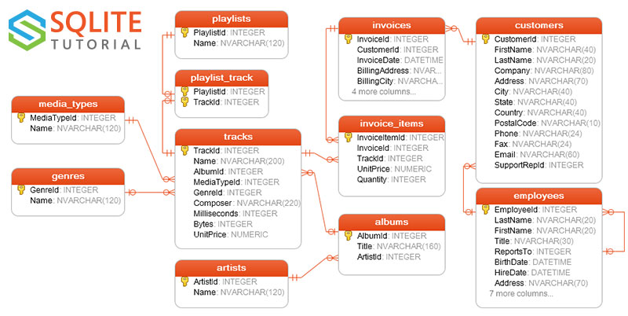

# Demo 1: Setup and import Chinook into DuckDB

This demo sets up DuckDB in a notebook, imports the Chinook SQLite database, and creates local DuckDB tables for later demos. Run the notebook from `lectures/03/demo` so `chinook.sqlite` is in the working directory.

## Schema overview



Optional: open the full PDF diagram for zooming: `media/chinook-database-diagram.pdf`.

## Step 1: Install and connect

Install packages from `lectures/03/demo/requirements.txt` in your terminal, then run:

```python
%load_ext sql
%sql duckdb:///demo_chinook.duckdb?access_mode=read_only
```

## Step 2: Attach the Chinook SQLite database

```python
%%sql
INSTALL sqlite_scanner;
LOAD sqlite_scanner;
ATTACH 'chinook.sqlite' AS chinook (TYPE SQLITE);
```

```python
%%sql
SHOW TABLES;
-- This should work but doesn't :(
```

```python
%%sql
-- We can always use the duckdb information schema
SELECT table_name FROM information_schema.tables 
WHERE table_catalog = 'chinook';
```

Checkpoint: you should see tables like `Albums`, `Artists`, `Tracks`, `Customers`, `Invoices`, and `Invoice_Items`.

Example output (table names will match, counts not shown yet):

| name |
| --- |
| Albums |
| Artists |
| Customers |
| Invoices |
| Invoice_Items |
| Tracks |

## Step 3: Import core tables into DuckDB

```python
%%sql
-- Drop existing tables if they exist to avoid errors on re-running
DROP TABLE IF EXISTS artists;
DROP TABLE IF EXISTS albums;
DROP TABLE IF EXISTS tracks;
DROP TABLE IF EXISTS customers;
DROP TABLE IF EXISTS invoices;
DROP TABLE IF EXISTS invoice_items;

CREATE TABLE artists AS SELECT * FROM chinook.Artists;
CREATE TABLE albums AS SELECT * FROM chinook.Albums;
CREATE TABLE tracks AS SELECT * FROM chinook.Tracks;
CREATE TABLE customers AS SELECT * FROM chinook.Customers;
CREATE TABLE invoices AS SELECT * FROM chinook.Invoices;
CREATE TABLE invoice_items AS SELECT * FROM chinook.Invoice_Items;
```

```python
%%sql
SELECT 'artists' AS table_name, COUNT(*) AS rows FROM artists
UNION ALL
SELECT 'albums', COUNT(*) FROM albums
UNION ALL
SELECT 'tracks', COUNT(*) FROM tracks
UNION ALL
SELECT 'customers', COUNT(*) FROM customers
UNION ALL
SELECT 'invoices', COUNT(*) FROM invoices
UNION ALL
SELECT 'invoice_items', COUNT(*) FROM invoice_items
ORDER BY table_name;
```

Checkpoint: each table should have a non-zero row count.

Example output (row counts will differ by dataset version):

| table_name | rows |
| --- | --- |
| albums | 347 |
| artists | 275 |
| customers | 59 |
| invoice_items | 2240 |
| invoices | 412 |
| tracks | 3503 |

## Step 4: Mini CSV and Parquet round-trip (DuckDB-specific)

```python
%%sql
COPY (SELECT * FROM tracks LIMIT 50)
TO 'tracks_sample.csv' (HEADER, DELIMITER ',');

COPY (SELECT * FROM tracks LIMIT 50)
TO 'tracks_sample.parquet' (FORMAT PARQUET);
```

```python
%%sql
SELECT * FROM read_csv_auto('tracks_sample.csv') LIMIT 5;
SELECT * FROM read_parquet('tracks_sample.parquet') LIMIT 5;
```

Checkpoint: both queries should return a small sample of tracks, and `tracks_sample.csv` / `tracks_sample.parquet` should be created in `lectures/03/demo`.
