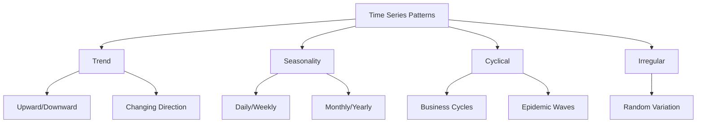
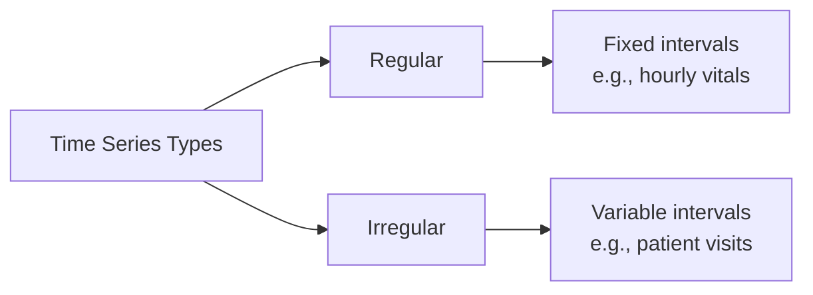
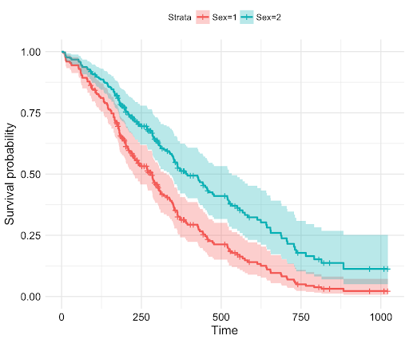
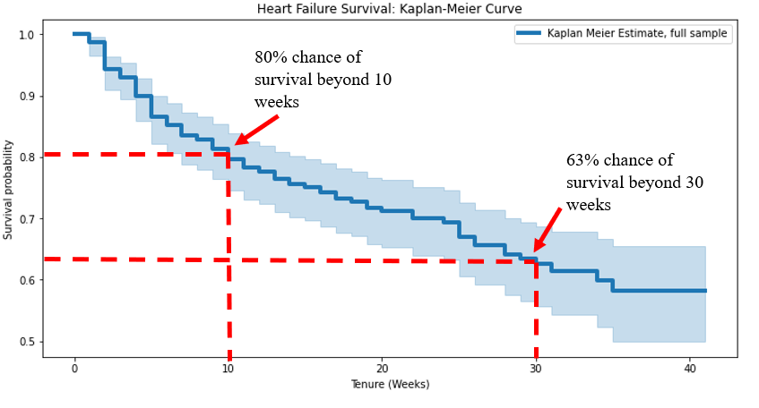

# Time Series & Regression: Predicting the Future 📈⌛

<!---
This lecture covers time series analysis with a focus on healthcare applications. Key points to emphasize:
- Time series data is everywhere in healthcare (vital signs, lab results, disease progression)
- Understanding patterns over time is crucial for patient care and resource planning
- We'll build from basic concepts to advanced methods and dense data analysis
- Focus on practical applications and common pitfalls
--->

> "The best thing about the future is that it comes one data point at a time." 
> — Abraham Lincoln (if he was a data scientist)


*Source: [XKCD 605](https://xkcd.com/605/) - A cautionary tale about extrapolation*

<!---
This comic perfectly illustrates the dangers of naive extrapolation. Just because you can fit a line to data doesn't mean you should extend it indefinitely. In healthcare, this might mean:
- Not assuming a patient's improvement will continue linearly
- Being cautious about extending seasonal patterns too far
- Considering biological and physical limits
--->

## Lecture Overview

This lecture is divided into four main parts:

1. **Conceptual Overview** (10 minutes)
   - Introduction to time series in healthcare
   - Key applications and importance
   - Visual introduction to patterns in time series

2. **Time Series Basics** (30 minutes)
   - Types of healthcare time series
   - Components and visualization
   - Common challenges
   - Basic analysis techniques
   - **Demo**: Exploring heart rate patterns during meditation

3. **ARIMA Models** (25 minutes)
   - Introduction to forecasting
   - Understanding ARIMA components
   - Model selection and evaluation
   - Healthcare applications
   - **Demo**: Sleep quality prediction

4. **Sensor Data Analysis** (25 minutes)
   - Characteristics of dense physiological data
   - Signal processing techniques
   - Feature extraction
   - Pattern recognition in health monitoring
   - **Demo**: Advanced sensor data analysis

Let's begin with a conceptual overview of time series analysis!

## 1. Conceptual Overview: Why Time Series Matter in Healthcare 🏥

<!---
Time series data in healthcare is like a Netflix series - it's all about the patterns and plot twists:
- Each vital sign tells a story (heart rate is the action sequence, temperature is the dramatic tension)
- Missing data is like missing episodes - you need to figure out what happened
- Seasonality is the show's recurring themes
- Anomalies are the plot twists you need to catch
--->

### The Three Laws of Time Series 🤖

1. **A time series may not harm a patient, or through inaction, allow a patient to come to harm**
    - Monitoring systems must be reliable
    - Alerts should minimize false alarms
    - Models must be interpretable

2. **A time series must be clean, except where such cleanliness conflicts with the First Law**
    - Data quality is crucial
    - But don't discard "messy" data that might be clinically relevant
    - Document all preprocessing steps

3. **A time series must protect its integrity as long as such protection does not conflict with the First or Second Law**
    - No data leakage from the future
    - Respect temporal ordering
    - Handle missing values appropriately

> **Check**: What's your favorite example of "garbage in, garbage out" with time series data?

### What is a Time Series?

A time series is a sequence of observations recorded at regular time intervals. In healthcare, time series data is ubiquitous:

- **Patient monitoring**: Vital signs, continuous glucose readings, ECG
- **Treatment tracking**: Medication effects, therapy outcomes
- **Disease progression**: Biomarker changes, symptom severity
- **Healthcare operations**: Hospital admissions, resource utilization

### Patterns in Time Series

Time series can exhibit various patterns that provide valuable insights:



Let's look at some examples of different patterns in healthcare time series:

- **Trend only**: Disease progression (e.g., gradual decline in lung function)
- **Seasonality only**: Seasonal allergies or influenza cases
- **Trend and seasonality**: Hospital admissions over multiple years
- **Cyclical patterns**: Epidemic waves that don't follow fixed calendar patterns

## 2. Time Series Basics

### Types of Healthcare Time Series

<!---
Healthcare time series come in many forms, each with unique characteristics and challenges. Understanding these different types helps us apply the right analysis techniques and avoid common pitfalls.
--->

#### 1. Regular vs. Irregular Time Series



##### Regular Time Series
- Fixed time intervals between observations
- Examples: Hourly vital signs, daily lab values, continuous monitoring
- Data from: [Heart Rate During Meditation](https://physionet.org/static/published-projects/meditation/heart-rate-oscillations-during-meditation-1.0.0.zip)

##### Irregular Time Series
- Variable time intervals between observations
- Examples: Patient visits, symptom reports, medication changes
- Data from: [MMASH Dataset](https://physionet.org/content/mmash/1.0.0/MMASH.zip)

#### 2. Univariate vs. Multivariate Time Series

##### Univariate Time Series
- Single variable measured over time
- Example: Blood glucose readings

**Conceptual**: Univariate time series represent a single variable tracked over time. They're the simplest form of time series and allow us to focus on patterns in a single measurement.

**Reference**: 
- `pandas.Series`: Core data structure for univariate time series
  - `index`: DatetimeIndex that holds the timestamps
  - Common methods: `plot()`, `rolling()`, `resample()`

```python
# Example of univariate time series
import pandas as pd
dates = pd.date_range(start='2024-01-01', periods=10, freq='D')
glucose = pd.Series([95, 100, 92, 98, 105, 110, 102, 95, 99, 97], index=dates)
```

##### Multivariate Time Series
- Multiple variables measured over time
- Example: Vital signs (heart rate, blood pressure, temperature)

**Conceptual**: Multivariate time series track multiple variables simultaneously. They allow us to analyze relationships between different measurements and how they evolve together over time.

**Reference**:
- `pandas.DataFrame`: Core data structure for multivariate time series
  - Each column represents a different variable
  - Shared DatetimeIndex across all variables

```python
# Example of multivariate time series
vitals = pd.DataFrame({
    'heart_rate': [72, 75, 71, 74, 77, 80, 76, 73, 75, 74],
    'systolic_bp': [120, 122, 119, 121, 125, 128, 124, 120, 122, 121],
    'temperature': [98.6, 98.7, 98.5, 98.6, 98.8, 99.0, 98.7, 98.6, 98.7, 98.6]
}, index=dates)
```

#### 3. Dense vs. Sparse Time Series

##### Dense Time Series
- High-frequency data collection
- Examples: ECG (250+ Hz), accelerometer data, continuous glucose monitoring
- Challenges: Storage, processing, feature extraction

##### Sparse Time Series
- Infrequent or irregular observations
- Examples: Annual check-ups, episodic symptoms
- Challenges: Interpolation, handling missing data

### Time Series Components 📊

<!---
Understanding the components of a time series is like understanding the ingredients in a recipe - you need to know what each part contributes to make sense of the whole. These components help us decompose complex patterns into interpretable pieces.
--->

#### 1. Trend

- Long-term progression in the data
- Can be upward, downward, or changing direction
- Examples in healthcare: Disease progression, recovery trajectory

#### 2. Seasonality

- Regular, predictable patterns that repeat
- Can be daily, weekly, monthly, yearly
- Examples in healthcare: Circadian rhythms, seasonal illnesses

#### 3. Cyclical Patterns

- Irregular fluctuations without fixed frequency
- Usually longer than seasonal patterns
- Examples in healthcare: Epidemic cycles, treatment response cycles

#### 4. Noise/Residuals

- Random variation that can't be explained by other components
- Can be due to measurement error or natural variability
- Examples in healthcare: Biological variability, measurement artifacts

#### Visualizing Components

**Conceptual**: Time series decomposition breaks a time series into its constituent parts: trend, seasonality, and residuals. This helps us understand the underlying patterns and can improve forecasting.

**Reference**:
- `statsmodels.tsa.seasonal.seasonal_decompose`: Decomposes time series into components
  - `model`: 'additive' (components add) or 'multiplicative' (components multiply)
  - `period`: Length of the seasonal cycle (e.g., 7 for weekly, 12 for monthly)

```python
# Example of time series decomposition
from statsmodels.tsa.seasonal import seasonal_decompose
result = seasonal_decompose(ts, model='additive', period=30)
```

### Common Challenges in Healthcare Time Series 🚧

<!---
Healthcare time series data comes with unique challenges that can trip up even experienced analysts. Being aware of these challenges is the first step to addressing them properly.
--->

#### 1. Missing Values

- Causes: Equipment failures, patient non-compliance, data entry errors
- Approaches:
  - Deletion (if minimal)
  - Interpolation (linear, spline)
  - Forward/backward fill
  - Model-based imputation

**Conceptual**: Missing values are common in healthcare time series and can significantly impact analysis. Different imputation methods have different assumptions and effects on the resulting data.

**Reference**:
- `pandas.Series.fillna`: Fill missing values in a Series
- `pandas.Series.interpolate`: Interpolate missing values

```python
# Example of handling missing values
ts_ffill = ts_with_gaps.fillna(method='ffill')  # Forward fill
ts_interp = ts_with_gaps.interpolate(method='linear')  # Linear interpolation
```

#### 2. Irregular Sampling

- Challenge: Observations not taken at regular intervals
- Approaches:
  - Resampling to regular intervals
  - Special methods for irregular time series
  - Continuous-time models

**Conceptual**: Irregular sampling occurs when observations aren't taken at fixed intervals. Resampling converts irregular time series to regular ones, making them easier to analyze with standard methods.

**Reference**:
- `pandas.Series.resample`: Resample time series to regular frequency

```python
# Example of resampling irregular data
regular_ts = irregular_ts.resample('D').interpolate(method='linear')
```

#### 3. Outliers

- Challenge: Extreme values that may be errors or important signals
- Approaches:
  - Statistical detection (z-score, IQR)
  - Contextual outlier detection
  - Robust methods that resist outlier influence

**Conceptual**: Outliers are extreme values that may represent errors or important clinical events. Z-scores measure how many standard deviations a point is from the mean, helping identify outliers.

**Reference**:
- `scipy.stats.zscore`: Calculate z-scores for a dataset

```python
# Example of outlier detection
from scipy import stats
z_scores = stats.zscore(ts_with_outliers)
outliers = np.abs(z_scores) > 3  # Threshold at 3 standard deviations
```

#### 4. Changing Variance

- Challenge: Variance of the time series changes over time
- Approaches:
  - Transformation (log, Box-Cox)
  - GARCH models
  - Robust scaling methods

**Conceptual**: Changing variance (heteroscedasticity) can affect model performance. Log transformation can stabilize variance by compressing larger values more than smaller ones.

**Reference**:
- `numpy.log1p`: Natural logarithm of (1 + x)

```python
# Example of variance stabilization
ts_log = np.log1p(ts_with_outliers)  # log(1+x) to handle zeros
```

### Basic Time Series Analysis Techniques 🔍

<!---
These fundamental techniques form the foundation of time series analysis. They're the essential tools that every analyst should have in their toolkit before moving to more advanced methods.
--->

#### 1. Descriptive Statistics

- Basic measures: mean, median, min, max, standard deviation
- Rolling statistics: moving averages, rolling standard deviation
- Autocorrelation: correlation of a series with its own lagged values

**Conceptual**: Rolling statistics calculate metrics over a sliding window, helping identify changing patterns over time. They smooth out short-term fluctuations while preserving longer-term trends.

**Reference**:
- `pandas.Series.rolling`: Create a rolling window object

```python
# Example of rolling statistics
rolling_mean = ts.rolling(window=30).mean()
rolling_std = ts.rolling(window=30).std()
```

#### 2. Correlation Analysis

- Autocorrelation Function (ACF): correlation with lagged values
- Partial Autocorrelation Function (PACF): correlation with lagged values, controlling for intermediate lags
- Cross-correlation: correlation between two different time series

**Conceptual**: Autocorrelation measures how a time series correlates with lagged versions of itself. It helps identify seasonality and determine appropriate parameters for time series models.

**Reference**:
- `statsmodels.graphics.tsaplots.plot_acf`: Plot autocorrelation function
- `statsmodels.graphics.tsaplots.plot_pacf`: Plot partial autocorrelation function

```python
# Example of autocorrelation analysis
from statsmodels.graphics.tsaplots import plot_acf, plot_pacf
plot_acf(ts, lags=40)
plot_pacf(ts, lags=40)
```

#### 3. Resampling and Aggregation

- Upsampling: Increasing frequency (e.g., daily to hourly)
- Downsampling: Decreasing frequency (e.g., hourly to daily)
- Aggregation methods: mean, median, sum, min, max

**Conceptual**: Resampling changes the frequency of a time series. Downsampling aggregates data to a lower frequency, while upsampling increases frequency (requiring interpolation).

**Reference**:
- `pandas.Series.resample`: Resample time series to different frequency

```python
# Example of resampling
weekly_mean = ts.resample('W').mean()  # Downsample from daily to weekly
```

#### 4. Visualization Techniques

- Line plots with enhancements: confidence intervals, annotations
- Multiple time series visualization: subplots, overlay, faceting
- Seasonal plots: values by season
- Heatmaps: correlation between multiple time series

**Conceptual**: Effective visualization is crucial for understanding time series data. Different visualization techniques highlight different aspects of the data.

**Reference**:
- `matplotlib.pyplot`: Basic plotting library
- `seaborn`: Advanced statistical visualizations

```python
# Example of enhanced line plot
plt.figure(figsize=(12, 6))
plt.plot(ts, label='Time Series')
plt.axhline(y=ts.mean(), color='r', linestyle='--', label='Mean')
```

#### 5. Survival Analysis Methods

<!---
Survival analysis methods are essential in healthcare for analyzing time-to-event data. These methods help us understand not just if an event occurs, but when it occurs, while properly handling censored observations.
--->

##### Cox Proportional Hazards Model



**Conceptual**: The Cox Proportional Hazards Model is a semi-parametric model used in survival analysis to assess the relationship between covariates and survival time. It estimates the hazard (or risk) of an event occurring at a certain time, considering the impact of various factors.

Key features:
- Handles censored data (when the event hasn't occurred by the end of observation)
- Doesn't require specifying a particular probability distribution for survival times
- Assumes proportional hazards (the effect of covariates is constant over time)
- Widely used in clinical trials and epidemiological studies

**Reference**:
- `lifelines.CoxPHFitter`: Implementation of Cox Proportional Hazards model
  - `duration_col`: Column containing the duration until the event or censoring
  - `event_col`: Column indicating if the event of interest occurred
  - Methods: `fit()`, `predict_survival_function()`, `plot()`

```python
# Example of Cox Proportional Hazards model
from lifelines import CoxPHFitter

# Assuming df has 'duration', 'event', and covariate columns
cph = CoxPHFitter()
cph.fit(df, duration_col='duration', event_col='event')

# Print summary of the model
print(cph.summary)
```

##### Kaplan-Meier Survival Analysis



**Conceptual**: Kaplan-Meier analysis is a non-parametric method for estimating the survival function from time-to-event data. It creates a step function that shows the probability of an event occurring at different time points, accounting for censored observations.

Key features:
- Provides a visual representation of survival over time
- Handles right-censored data effectively
- Makes no assumptions about the underlying distribution
- Can compare survival curves between different groups
- Used in medicine, biology, engineering, and economics

**Reference**:
- `lifelines.KaplanMeierFitter`: Implementation of Kaplan-Meier estimator
  - `durations`: Array of durations until event or censoring
  - `event_observed`: Array indicating whether the event was observed (1) or censored (0)
  - Methods: `fit()`, `plot_survival_function()`, `median_survival_time_`

```python
# Example of Kaplan-Meier analysis
from lifelines import KaplanMeierFitter

# Initialize the Kaplan-Meier model
kmf = KaplanMeierFitter()

# Fit the model
kmf.fit(durations=df['duration'], event_observed=df['event'])

# Plot the survival function
kmf.plot_survival_function()
```

### DEMO BREAK: Exploring Heart Rate Patterns During Meditation

See: [`demo1-synthetic-timeseries`](demo/demo1-synthetic-timeseries.md)

## 3. ARIMA Models

### Introduction to Forecasting

<!---
Forecasting is about predicting future values based on past observations. In healthcare, accurate forecasts can improve resource allocation, treatment planning, and early intervention.
--->

**Conceptual**: Forecasting time series involves predicting future values based on patterns observed in historical data. The goal is to capture the underlying structure while accounting for randomness.

#### Additive vs. Multiplicative Models

Time series can be modeled as either:

- **Additive**: Value = Base Level + Trend + Seasonality + Error
- **Multiplicative**: Value = Base Level × Trend × Seasonality × Error

Additive models are appropriate when the seasonal variation is constant over time, while multiplicative models are better when the seasonal variation increases with the level of the series.

### Stationarity and Transformations

**Conceptual**: A stationary time series has statistical properties that don't change over time (constant mean, variance, and autocorrelation). Most forecasting methods require stationary data.

#### Testing for Stationarity

- Visual inspection: Plot the series and check if properties change over time
- Statistical tests: Augmented Dickey-Fuller (ADF), KPSS

**Reference**:
- `statsmodels.tsa.stattools.adfuller`: Augmented Dickey-Fuller test

```python
# Example of ADF test
from statsmodels.tsa.stattools import adfuller
result = adfuller(series)
print(f'ADF Statistic: {result[0]}')
print(f'p-value: {result[1]}')
```

#### Making a Series Stationary

- Differencing: Subtract consecutive observations (first difference, second difference)
- Transformation: Apply mathematical functions (log, square root, Box-Cox)
- Detrending: Remove trend component
- Deseasonalizing: Remove seasonal component

```python
# Example of differencing
diff_series = series.diff().dropna()  # First difference

# Example of log transformation
log_series = np.log1p(series)  # log(1+x) to handle zeros
```

### Understanding ARIMA Components

<!---
ARIMA models are like a recipe with three main ingredients (p, d, q). Each ingredient plays a specific role in capturing different types of patterns in your time series. This section breaks down each component and shows how they work together.
--->

#### AR (AutoRegressive) Component

**Conceptual**: The AR component (p) captures the relationship between an observation and its previous values. It's like saying "today's value depends on the last few days' values."

Key points:
- Order p: Number of lag observations to include
- Higher p: More complex relationships with past values
- Too high p: Risk of overfitting

**Reference**:
```python
# Simple AR(1) process simulation
def simulate_ar1(n_points=1000, phi=0.7):
    """Simulate AR(1) process: y[t] = phi*y[t-1] + e[t]"""
    e = np.random.normal(0, 1, n_points)
    y = np.zeros(n_points)
    for t in range(1, n_points):
        y[t] = phi * y[t-1] + e[t]
    return y
```

#### I (Integrated) Component

**Conceptual**: The I component (d) handles non-stationarity through differencing. It's like "leveling the playing field" by removing trends and seasonality.

Types of differencing:
1. First difference (d=1): Remove trend
   - y'[t] = y[t] - y[t-1]
2. Second difference (d=2): Remove quadratic trend
   - y''[t] = (y[t] - y[t-1]) - (y[t-1] - y[t-2])
3. Seasonal difference: Remove seasonal patterns
   - y'[t] = y[t] - y[t-s], where s is seasonal period

**Reference**:
```python
def difference_series(series, d=1):
    """Apply d-th order differencing"""
    return pd.Series(series).diff(d).dropna()

def inverse_difference(diff_series, original_first_value, d=1):
    """Reverse differencing transformation"""
    series = diff_series.copy()
    for _ in range(d):
        series = series.cumsum() + original_first_value
    return series
```

#### MA (Moving Average) Component

**Conceptual**: The MA component (q) uses past forecast errors to improve current predictions. It's like "learning from your mistakes."

Key points:
- Order q: Number of past errors to consider
- Captures short-term adjustments
- Useful for handling irregular fluctuations

**Reference**:
```python
# Simple MA(1) process simulation
def simulate_ma1(n_points=1000, theta=0.5):
    """Simulate MA(1) process: y[t] = e[t] + theta*e[t-1]"""
    e = np.random.normal(0, 1, n_points)
    y = np.zeros(n_points)
    for t in range(1, n_points):
        y[t] = e[t] + theta * e[t-1]
    return y
```

### Practical ARIMA Implementation

#### Step 1: Check Stationarity

**Conceptual**: Before applying ARIMA, check if your data is stationary. Non-stationary data needs differencing.

**Reference**:
```python
def check_stationarity(series):
    """Check stationarity using Augmented Dickey-Fuller test"""
    result = adfuller(series)
    print(f'ADF Statistic: {result[0]:.3f}')
    print(f'p-value: {result[1]:.3f}')
    print('Critical values:')
    for key, value in result[4].items():
        print(f'\t{key}: {value:.3f}')
    return result[1] < 0.05
```

#### Step 2: Parameter Selection

**Conceptual**: Choosing p, d, q parameters is crucial for model performance. Use these guidelines:

1. Choose d:
   - d=0 if already stationary
   - d=1 for most non-stationary series
   - d=2 rarely needed

2. Choose p:
   - Examine PACF plot
   - Count significant lags
   - Usually p ≤ 3

3. Choose q:
   - Examine ACF plot
   - Count significant lags
   - Usually q ≤ 3

**Reference**:
```python
def suggest_pdq(series):
    """Suggest ARIMA parameters based on data characteristics"""
    # Check stationarity
    d = 0
    while not check_stationarity(series):
        series = difference_series(series)
        d += 1
        if d >= 2:
            break
    
    # Get ACF and PACF values
    acf_values = acf(series, nlags=10)
    pacf_values = pacf(series, nlags=10)
    
    # Suggest p and q based on significant lags
    p = sum(np.abs(pacf_values[1:]) > 1.96/np.sqrt(len(series)))
    q = sum(np.abs(acf_values[1:]) > 1.96/np.sqrt(len(series)))
    
    return min(p, 3), d, min(q, 3)
```

#### Step 3: Model Fitting and Diagnostics

**Conceptual**: After selecting parameters, fit the model and check its performance.

**Reference**:
```python
from statsmodels.tsa.arima.model import ARIMA
from sklearn.metrics import mean_absolute_error, mean_squared_error

def fit_and_evaluate_arima(train, test, order=(1,1,1)):
    """Fit ARIMA model and evaluate performance"""
    # Fit model
    model = ARIMA(train, order=order)
    model_fit = model.fit()
    
    # Make predictions
    predictions = model_fit.forecast(steps=len(test))
    
    # Calculate metrics
    mae = mean_absolute_error(test, predictions)
    rmse = np.sqrt(mean_squared_error(test, predictions))
    
    # Model diagnostics
    residuals = model_fit.resid
    
    return {
        'model': model_fit,
        'predictions': predictions,
        'mae': mae,
        'rmse': rmse,
        'aic': model_fit.aic,
        'bic': model_fit.bic,
        'residuals': residuals
    }
```

#### Step 4: Model Validation

**Conceptual**: Validate your model using these checks:

1. Residual Analysis:
   - Should be normally distributed
   - Should show no autocorrelation
   - Should have constant variance

2. Cross-Validation:
   - Use rolling forecasts
   - Compare multiple parameter sets
   - Check prediction intervals

**Reference**:
```python
def validate_arima_model(model_results):
    """Perform model validation checks"""
    residuals = model_results['residuals']
    
    # Normality test
    _, norm_p_value = stats.normaltest(residuals)
    
    # Autocorrelation in residuals
    residual_acf = acf(residuals, nlags=10)
    
    # Heteroscedasticity check
    _, hetero_p_value = stats.levene(
        residuals[:len(residuals)//2], 
        residuals[len(residuals)//2:]
    )
    
    return {
        'normality_p_value': norm_p_value,
        'residual_acf': residual_acf,
        'heteroscedasticity_p_value': hetero_p_value
    }
```

### DEMO BREAK: Sleep Quality Prediction

See: [`demo2-hrv-forecasting`](demo/demo2-hrv-forecasting.md)

## 4. Sensor Data Analysis

<!---
Sensor data analysis is a critical component of modern healthcare, enabling continuous monitoring and early intervention. The volume and complexity of sensor data present unique challenges that require specialized techniques.
--->

### Characteristics of Dense Physiological Data

<!---
Dense physiological data from sensors presents unique challenges and opportunities. Understanding these characteristics is essential for effective analysis.
--->

**Conceptual**: Dense physiological data represents a fundamental shift in healthcare monitoring, moving from sparse, episodic measurements to continuous, high-resolution observations of physiological processes. This data is characterized by high sampling rates, continuous monitoring, and multiple variables, creating both opportunities and challenges for analysis.

The richness of sensor data allows us to capture subtle patterns and transient events that would be missed by traditional monitoring approaches. However, this same richness creates computational challenges and requires specialized techniques to separate meaningful signals from noise. The temporal nature of sensor data also preserves the sequence and timing of physiological events, which is often as important as the measurements themselves.

#### Key Characteristics

- **High sampling rates**: ECG (250+ Hz), accelerometer (20-100 Hz)
- **Continuous monitoring**: Wearables, implantable devices
- **Multivariate signals**: Multiple sensors, multiple dimensions
- **Noise and artifacts**: Movement artifacts, sensor errors, baseline drift

<!---
#### Examples in Healthcare

- Heart rate and ECG monitoring
- Activity tracking with accelerometers
- Continuous glucose monitoring
- Sleep monitoring (EEG, movement, respiration)
--->

### Signal Processing Methods

**Conceptual**: Signal processing prepares raw sensor data for analysis by removing noise and artifacts.

**Common Methods**:
- **Filtering**: Low-pass, high-pass, band-pass, and notch filters
- **Smoothing**: Moving average, exponential smoothing, Savitzky-Golay
- **Resampling**: Adjusting sampling rates for consistent analysis
- **Artifact removal**: Detecting and handling motion artifacts

### Frequency Analysis

**Conceptual**: Frequency analysis reveals periodic patterns in sensor data that are not visible in the time domain.

#### Fast Fourier Transform (FFT)

- Decomposes a signal into its frequency components
- Reveals dominant frequencies and periodic patterns
- Essential for analyzing oscillatory physiological signals

```python
# FFT implementation
from scipy.fft import fft, fftfreq
import numpy as np

# Generate sample data
sampling_rate = 100  # Hz
duration = 5  # seconds
t = np.linspace(0, duration, int(sampling_rate * duration), endpoint=False)
# Signal with 2 Hz and 10 Hz components
signal = np.sin(2 * np.pi * 2 * t) + 0.5 * np.sin(2 * np.pi * 10 * t)

# Compute FFT
yf = fft(signal)
xf = fftfreq(len(t), 1/sampling_rate)

# Plot only positive frequencies (negative frequencies are redundant for real signals)
positive_freq_idx = np.where(xf > 0)
plt.figure(figsize=(10, 4))
plt.plot(xf[positive_freq_idx], 2.0/len(t) * np.abs(yf[positive_freq_idx]))
plt.xlabel('Frequency (Hz)')
plt.ylabel('Amplitude')
plt.title('Frequency Spectrum')

# Practical tips for FFT analysis:
# 1. Ensure your sampling rate is at least 2x the highest frequency you want to detect (Nyquist theorem)
# 2. Use windowing functions (e.g., Hanning, Hamming) to reduce spectral leakage
# 3. For better frequency resolution, use longer signal durations
# 4. The magnitude should be normalized by dividing by N (signal length) or N/2 for one-sided spectrum
```

#### Power Spectral Density (PSD)

- Measures power distribution across frequencies
- Useful for identifying dominant rhythms in physiological signals
- Common in heart rate variability and EEG analysis

```python
# Power spectral density estimation
from scipy import signal

# Compute PSD using Welch's method
frequencies, psd = signal.welch(signal, sampling_rate, nperseg=256)

# Plot PSD
plt.figure(figsize=(10, 4))
plt.semilogy(frequencies, psd)
plt.xlabel('Frequency (Hz)')
plt.ylabel('Power/Frequency (dB/Hz)')
plt.title('Power Spectral Density')
```

#### Wavelet Transforms

- Provides time-frequency representation
- Better for non-stationary signals than FFT
- Preserves both time and frequency information
- Useful for detecting transient events in physiological signals

Two main types of wavelet transforms used in physiological signal analysis:

1. **Continuous Wavelet Transform (CWT)**:
   - Analyzes signals with wavelets at all scales and positions
   - Provides high resolution in both time and frequency domains
   - Commonly used for ECG and EEG analysis

2. **Discrete Wavelet Transform (DWT)**:
   - Decomposes signals into approximation and detail coefficients
   - More computationally efficient than CWT
   - Used for denoising and feature extraction

```python
# Example of wavelet transform
from pywt import cwt
import numpy as np

# Create sample signal
sampling_rate = 100  # Hz
t = np.linspace(0, 2, 2 * sampling_rate)
# Signal with changing frequency
signal = np.sin(2 * np.pi * 2 * t) + np.sin(2 * np.pi * 10 * t[t > 1])

# Perform continuous wavelet transform
scales = np.arange(1, 128)
coefficients, frequencies = cwt(signal, scales, 'morl')

# Plot the scalogram
plt.figure(figsize=(10, 6))
plt.imshow(abs(coefficients), aspect='auto', cmap='jet')
plt.title('Wavelet Transform Scalogram')
plt.ylabel('Scale')
plt.xlabel('Time')
plt.colorbar(label='Magnitude')
```

### Feature Extraction for Classification

**Conceptual**: Feature extraction transforms raw sensor data into meaningful metrics that can be used for classification and pattern recognition.

#### Time Domain Features
- **Statistical measures**: Mean, median, standard deviation, skewness, kurtosis
- **Peak characteristics**: Count, amplitude, width, prominence
- **Signal complexity**: Approximate entropy, sample entropy, Lyapunov exponent

#### Frequency Domain Features
- **Spectral power in bands**: Power in physiologically relevant frequency bands
- **Spectral moments**: Mean frequency, spectral centroid, bandwidth
- **Spectral entropy**: Measure of regularity/predictability in frequency domain

#### Time-Frequency Features
- **Wavelet coefficients**: Capturing time-localized frequency content
- **Spectrogram statistics**: Features from time-frequency representations

```python
# Example of extracting multiple features
def extract_features(signal, sampling_rate):
    """Extract common features from a physiological signal.
    
    Parameters:
    -----------
    signal : array-like
        The input signal time series
    sampling_rate : float
        The sampling frequency in Hz
        
    Returns:
    --------
    features : dict
        Dictionary containing extracted features
    
    Notes:
    ------
    This function extracts three types of features:
    1. Time domain features (statistical properties)
    2. Peak-based features (using peak detection)
    3. Frequency domain features (using FFT)
    
    For physiological signals, typical frequency bands are:
    - Delta (0.5-4 Hz): Deep sleep, relaxation
    - Theta (4-8 Hz): Drowsiness, meditation
    - Alpha (8-13 Hz): Relaxed alertness
    - Beta (13-30 Hz): Active thinking, focus
    """
    features = {}
    
    # Time domain features
    features['mean'] = np.mean(signal)
    features['std'] = np.std(signal)
    features['skewness'] = stats.skew(signal)
    features['kurtosis'] = stats.kurtosis(signal)
    
    # Add more robust statistical features
    features['median'] = np.median(signal)
    features['iqr'] = np.percentile(signal, 75) - np.percentile(signal, 25)
    features['min'] = np.min(signal)
    features['max'] = np.max(signal)
    
    # Peak detection
    peaks, peak_properties = signal.find_peaks(
        signal,
        height=0,                     # Minimum height of peaks
        distance=sampling_rate//10,   # Minimum samples between peaks
        prominence=0.1,               # Minimum prominence of peaks
        width=None                    # Minimum width of peaks
    )
    
    # Peak-based features
    features['peak_count'] = len(peaks)
    if len(peaks) > 0:
        features['mean_peak_height'] = np.mean(peak_properties['peak_heights'])
        features['peak_prominence'] = np.mean(peak_properties['prominences'])
    else:
        features['mean_peak_height'] = 0
        features['peak_prominence'] = 0
    
    # Frequency domain features
    yf = fft(signal)
    xf = fftfreq(len(signal), 1/sampling_rate)
    positive_freq_idx = np.where(xf > 0)
    
    # Power in different frequency bands (common in EEG/ECG analysis)
    delta_band = (0.5, 4)    # Hz - Delta waves
    theta_band = (4, 8)      # Hz - Theta waves
    alpha_band = (8, 13)     # Hz - Alpha waves
    beta_band = (13, 30)     # Hz - Beta waves
    
    # Calculate power in each band
    power_spectrum = 2.0/len(signal) * np.abs(yf)
    
    # Extract band powers
    for band_name, (low, high) in [
        ('delta', delta_band),
        ('theta', theta_band),
        ('alpha', alpha_band),
        ('beta', beta_band)
    ]:
        band_idx = np.where((xf >= low) & (xf <= high))
        features[f'{band_name}_power'] = np.sum(power_spectrum[band_idx])
    
    # Calculate relative band powers (normalized)
    total_power = np.sum(power_spectrum[positive_freq_idx])
    if total_power > 0:
        for band in ['delta', 'theta', 'alpha', 'beta']:
            features[f'relative_{band}_power'] = features[f'{band}_power'] / total_power
    
    return features
```

### Preparing for Classification

**Conceptual**: The extracted features form the input to classification algorithms in the next stage of analysis.

**Key Considerations**:
- **Feature selection**: Identifying the most informative features
- **Feature normalization**: Scaling features to comparable ranges
- **Dimensionality reduction**: PCA, t-SNE for visualizing high-dimensional feature spaces
- **Time-aware validation**: Special considerations for time series data

<!---
#### Healthcare Applications

- **Remote patient monitoring**: Tracking health status outside clinical settings
- **Early warning systems**: Detecting deterioration before clinical symptoms
- **Rehabilitation tracking**: Monitoring progress during recovery
- **Lifestyle assessment**: Evaluating physical activity and sleep patterns
--->

### DEMO BREAK: Advanced Sensor Data Analysis

See: [`demo3-hrv-feature-extraction`](demo/demo3-hrv-feature-extraction.md)

### Signal Preprocessing Techniques 🔧

<!---
Before analyzing physiological signals, we often need to clean and prepare the data. This section covers essential preprocessing steps that help ensure reliable analysis results.
--->

#### Outlier and Artifact Removal

**Conceptual**: Physiological signals often contain outliers and artifacts that can distort analysis results. Common sources include:
- Movement artifacts
- Equipment malfunctions
- Ectopic beats (in ECG/RR data)
- Environmental interference

**Reference**:
```python
def remove_outliers(signal, n_std=3):
    """Remove values more than n standard deviations from mean"""
    mean = np.mean(signal)
    std = np.std(signal)
    return signal[(signal > mean - n_std*std) & 
                 (signal < mean + n_std*std)]
```

#### Interpolation Methods

**Conceptual**: Many analysis techniques require evenly sampled data, but physiological signals (like RR intervals) are often irregularly sampled.

Common interpolation methods:
- Linear interpolation
- Cubic spline interpolation
- Polynomial interpolation

**Reference**:
```python
from scipy.interpolate import interp1d

# Create evenly sampled time points
time = np.cumsum(rr_intervals)
uniform_time = np.linspace(time[0], time[-1], desired_length)

# Interpolate signal
interp_func = interp1d(time, signal, kind='linear')
uniform_signal = interp_func(uniform_time)
```

### Advanced Signal Processing 📊

<!---
Signal processing techniques help extract meaningful information from complex physiological signals. These methods reveal patterns and features that aren't visible in the raw data.
--->

#### Filtering Techniques

##### Butterworth Filters

**Conceptual**: Butterworth filters provide smooth frequency response with minimal ripples. Common types:
- Lowpass: Remove high frequencies
- Highpass: Remove low frequencies
- Bandpass: Keep specific frequency range
- Bandstop: Remove specific frequency range

**Reference**:
```python
from scipy.signal import butter, filtfilt

def butter_bandpass(lowcut, highcut, fs, order=4):
    nyquist = 0.5 * fs
    low = lowcut / nyquist
    high = highcut / nyquist
    b, a = butter(order, [low, high], btype='band')
    return b, a

def apply_bandpass(data, lowcut, highcut, fs, order=4):
    b, a = butter_bandpass(lowcut, highcut, fs, order)
    return filtfilt(b, a, data)
```

#### Frequency Analysis Methods

##### Fast Fourier Transform (FFT)

**Conceptual**: FFT decomposes a signal into its frequency components, revealing periodic patterns.

Key concepts:
- Frequency spectrum
- Power spectral density
- Nyquist frequency
- Spectral leakage

**Reference**:
```python
from scipy.fft import fft, fftfreq

# Compute FFT
yf = fft(signal)
xf = fftfreq(len(signal), 1/sampling_rate)

# Power spectrum
power_spectrum = np.abs(yf)**2
```

##### Frequency Bands in HRV Analysis

**Conceptual**: Heart Rate Variability (HRV) analysis often focuses on specific frequency bands:

- VLF (Very Low Frequency): 0.003-0.04 Hz
  - Long-term regulation mechanisms
  - Thermoregulation
  
- LF (Low Frequency): 0.04-0.15 Hz
  - Sympathetic and parasympathetic activity
  - Baroreceptor activity
  
- HF (High Frequency): 0.15-0.4 Hz
  - Parasympathetic activity
  - Respiratory sinus arrhythmia

**Reference**:
```python
def get_frequency_band_power(power_spectrum, freqs, band):
    """Calculate power in specific frequency band"""
    mask = (freqs >= band[0]) & (freqs <= band[1])
    return np.sum(power_spectrum[mask])
```

### Feature Engineering for Time Series 🛠️

<!---
Feature engineering transforms raw time series data into meaningful metrics that can be used for classification, prediction, or clinical interpretation.
--->

#### Statistical Features

**Conceptual**: Basic statistical measures that capture different aspects of the signal:

- Central tendency: mean, median, mode
- Dispersion: standard deviation, variance, IQR
- Shape: skewness, kurtosis
- Extremes: min, max, range

**Reference**:
```python
def extract_statistical_features(signal):
    return {
        'mean': np.mean(signal),
        'std': np.std(signal),
        'skew': stats.skew(signal),
        'kurtosis': stats.kurtosis(signal),
        'iqr': np.percentile(signal, 75) - 
               np.percentile(signal, 25)
    }
```

#### Rolling Window Features

**Conceptual**: Features calculated over sliding windows capture local patterns:

- Rolling mean
- Rolling standard deviation
- Rolling entropy
- Rolling correlation

**Reference**:
```python
def rolling_features(signal, window_size):
    return {
        'rolling_mean': pd.Series(signal).rolling(window_size).mean(),
        'rolling_std': pd.Series(signal).rolling(window_size).std()
    }
```

#### Frequency Domain Features

**Conceptual**: Features derived from frequency analysis:

- Band powers (VLF, LF, HF)
- Peak frequencies
- Spectral entropy
- Power ratios (LF/HF)

**Reference**:
```python
def frequency_domain_features(power_spectrum, freqs):
    vlf = get_frequency_band_power(power_spectrum, freqs, (0.003, 0.04))
    lf = get_frequency_band_power(power_spectrum, freqs, (0.04, 0.15))
    hf = get_frequency_band_power(power_spectrum, freqs, (0.15, 0.4))
    return {
        'vlf_power': vlf,
        'lf_power': lf,
        'hf_power': hf,
        'lf_hf_ratio': lf/hf if hf > 0 else 0
    }
```

## Summary and Key Takeaways

- **Time series data** is fundamental in healthcare for monitoring, forecasting, and understanding patterns over time
- **Basic analysis techniques** like decomposition, correlation analysis, and visualization provide insights into underlying patterns
- **ARIMA models** offer a powerful framework for forecasting time series data in healthcare
- **Sensor data analysis** requires specialized techniques for processing dense physiological signals
- **Practical applications** include patient monitoring, resource planning, and early warning systems

## Further Resources

- [Time Series Analysis in Python](https://otexts.com/fpp2/) - Comprehensive guide to forecasting
- [PhysioNet](https://physionet.org/) - Repository of physiological data and software
- [statsmodels Documentation](https://www.statsmodels.org/stable/tsa.html) - Time series analysis in Python
- [Practical Time Series Analysis](https://www.oreilly.com/library/view/practical-time-series/9781492041641/) - O'Reilly book

## Next Steps

- Explore the demo notebooks to gain hands-on experience
- Apply these techniques to your own healthcare data
- Consider how time series analysis could improve healthcare delivery and outcomes
