Reading Rocks!

Natural Language Processing

# Links & Self-Guided Review

- TB Hack Day on Feb 11th! Register at <https://seatrac.uw.edu/training/i4tbworkinggroup>

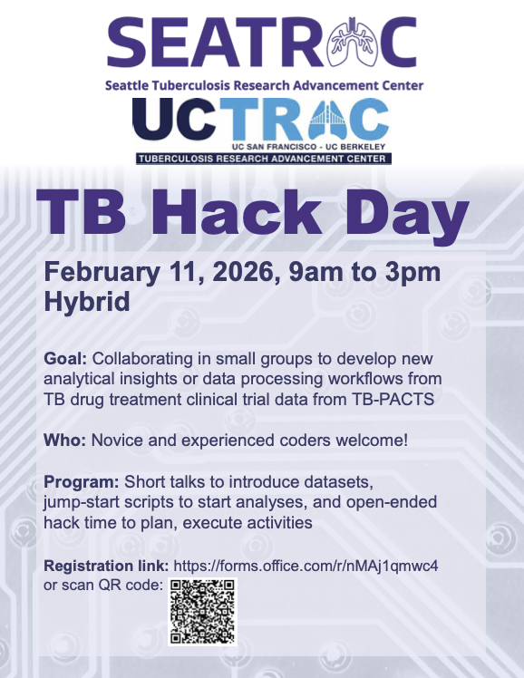

- [Speech and Language Processing](https://web.stanford.edu/~jurafsky/slp3/) — Jurafsky & Martin, comprehensive NLP textbook (free online, chapters 2-6 cover this lecture)
- [NLTK Book](https://www.nltk.org/book/) — official tutorial with exercises (chapters 1-7)
- [spaCy 101](https://spacy.io/usage/spacy-101) — core concepts and usage patterns
- [Real Python: NLP with spaCy](https://realpython.com/natural-language-processing-spacy-python/) — hands-on tutorial
- [Regex101](https://regex101.com/) — interactive regex tester with explanation
- [scispaCy](https://allenai.github.io/scispacy/) — biomedical NLP models

# Natural Language Processing

## What is NLP?


Humans communicate in natural language—English, Spanish, clinical shorthand. Computers need structure—numbers, categories, defined relationships. Natural language processing (NLP) bridges this gap, transforming free-form text into data that algorithms can analyze.

NLP powers everyday tools:

- **Search engines** understand queries and match relevant documents
- **Translation services** convert between languages
- **Voice assistants** interpret spoken commands
- **Email filters** detect spam and categorize messages

The core challenges:

- **Ambiguity** — "bank" means river bank or financial bank?
- **Context** — "not bad" means good
- **Variation** — "BP", "blood pressure", "b.p." all mean the same thing
- **Implicit knowledge** — "take with food" implies meals

## Why NLP for Health Data?

Electronic health records contain vast amounts of free-text data: physician notes, discharge summaries, radiology reports, pathology findings. Surveys and patient-reported outcomes add more unstructured text. NLP lets you:

- **Extract diagnoses** from clinical notes that weren't coded
- **Identify adverse events** mentioned in free text
- **Analyze sentiment** (positive/negative tone) in patient feedback
- **Build cohorts** from text descriptions that predate structured fields

| Data Source | Example Text | What NLP Can Extract |
|-------------|--------------|----------------------|
| Progress notes | "Patient denies chest pain, reports mild fatigue" | Symptoms (negated and affirmed) |
| Radiology reports | "No acute intracranial abnormality" | Findings, negation status |
| Discharge summaries | "Follow up with cardiology in 2 weeks" | Care instructions, timing |
| Patient surveys | "The wait time was frustrating" | Sentiment, specific complaints |

## Classical vs LLM-based Approaches

**Classical NLP** uses explicit pipelines: tokenize text, apply rules or statistics, convert to numerical features. **LLM-based NLP** uses neural networks trained on massive text corpora to learn representations end-to-end.

| Aspect | Classical NLP | LLM-based |
|--------|---------------|-----------|
| Text representation | Word counts, TF-IDF | Contextual embeddings |
| Pipeline | Explicit stages (tokenize → analyze → vectorize) | Often end-to-end |
| Interpretability | High—you can inspect features | Lower—embeddings are opaque |
| Computational cost | Low | High |
| Training data | Works with small labeled sets | Benefits from massive pretraining |

**When to use classical NLP:**

- You need interpretable features ("which words predict readmission?")
- Computational resources are limited
- You're building rule-based extraction
- The task is well-defined and doesn't require deep understanding

**When to use LLMs:**

- The task requires understanding context and nuance
- You need text generation or summarization
- Transfer learning from general knowledge helps your domain

Most real-world clinical NLP systems combine both: classical techniques for structured extraction, LLMs for complex reasoning.

## Tools: NLTK vs spaCy

Two Python libraries dominate classical NLP work.

**NLTK (Natural Language Toolkit)** is designed for learning and research. It offers many algorithms for each task, letting you explore different approaches. Processing is string-based—you work with lists of words and manual pipelines.

**spaCy** is designed for production applications. It provides one optimized algorithm per task, prioritizing speed and ease of use. Processing is object-oriented—you work with `Doc`, `Token`, and `Span` objects that carry rich annotations.

| Aspect | NLTK | spaCy |
|--------|------|-------|
| Philosophy | Educational, comprehensive | Production-ready, fast |
| Algorithm choice | Many algorithms to choose | One best algorithm per task |
| Processing style | String-based | Object-oriented (Doc, Token, Span) |
| Pipeline | Manual assembly | Integrated pipeline |
| Best for | Learning, research | Applications |

**spaCy's object model:**

- **Doc** — a processed document containing all tokens and annotations
- **Token** — a single word or punctuation mark with attributes (text, POS, lemma)
- **Span** — a slice of a Doc (like a substring, but with token information)

### Installation

| Tool | Install | First-time Setup |
|------|---------|------------------|
| NLTK | `pip install nltk` | `nltk.download('punkt_tab')`, `nltk.download('stopwords')` |
| spaCy | `pip install spacy` | `python -m spacy download en_core_web_sm` |
| scikit-learn | `pip install scikit-learn` | (none required) |

# Text Processing Fundamentals

Before analysis, we transform raw text into a consistent format. These preprocessing steps are foundational to nearly all NLP work.

## Tokenization

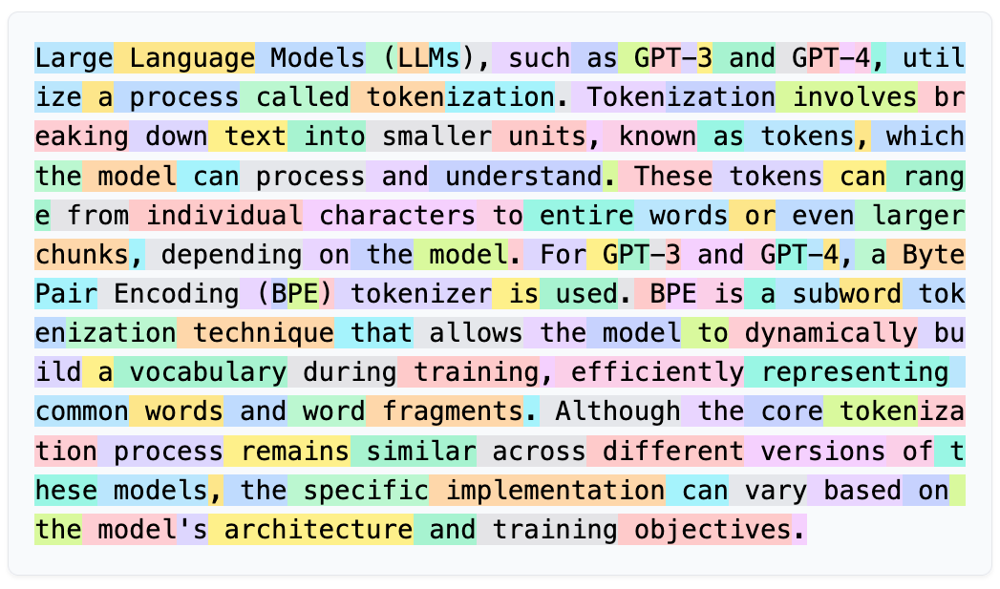

Tokenization splits text into individual units called **tokens**—usually words, but sometimes punctuation, numbers, or subwords. Every subsequent NLP step operates on tokens.

**Why tokenization matters:**

- "500mg" as one token vs. "500" + "mg" affects downstream analysis
- Abbreviations like "Dr." shouldn't be split at the period
- Medical terms like "COVID-19" should stay together

**Tokenization and NLP methods:** The choice of tokenization strategy depends on your downstream task. Classical NLP typically uses word-level tokenization. Modern LLMs use **subword tokenization** (BPE, WordPiece), which splits words into smaller pieces like "pre" + "process" + "ing"—this handles rare words better and creates a fixed vocabulary size. The tokenizer and model must match: you can't use a word tokenizer with a model trained on subwords.

```
Sentence: "Dr. Smith prescribed 500mg ibuprofen."

Whitespace split:   ["Dr.", "Smith", "prescribed", "500mg", "ibuprofen."]
                    ↑ keeps punctuation attached

NLTK word_tokenize: ["Dr.", "Smith", "prescribed", "500mg", "ibuprofen", "."]
                    ↑ handles abbreviations, splits final "."

spaCy tokenizer:    ["Dr.", "Smith", "prescribed", "500", "mg", "ibuprofen", "."]
                    ↑ splits numbers from units
```

### Reference Card: Tokenization

| Category | Method | Purpose & Arguments | Typical Output |
| :--- | :--- | :--- | :--- |
| **Basic** | `text.split()` | Splits on whitespace only. | `list[str]` |
| **NLTK** | `nltk.word_tokenize(text)` | Tokenizes handling punctuation and abbreviations. | `list[str]` |
| **NLTK** | `nltk.sent_tokenize(text)` | Splits text into sentences. | `list[str]` |
| **NLTK** | `RegexpTokenizer(pattern)` | Custom tokenizer using regex pattern (e.g., `r'\w+'` for words only). | `list[str]` via `.tokenize(text)` |
| **spaCy** | `for token in doc` | Iterates tokens after `doc = nlp(text)`. | `Token` objects |

### Code Snippet: Tokenization

```python
import nltk
nltk.download('punkt_tab')

text = "Dr. Smith prescribed 500mg ibuprofen. Take twice daily."

# Naive split
print(text.split())
# ['Dr.', 'Smith', 'prescribed', '500mg', 'ibuprofen.', 'Take', 'twice', 'daily.']

# NLTK word tokenize
print(nltk.word_tokenize(text))
# ['Dr.', 'Smith', 'prescribed', '500mg', 'ibuprofen', '.', 'Take', 'twice', 'daily', '.']

# NLTK sentence tokenize
print(nltk.sent_tokenize(text))
# ['Dr. Smith prescribed 500mg ibuprofen.', 'Take twice daily.']
```

## Normalization

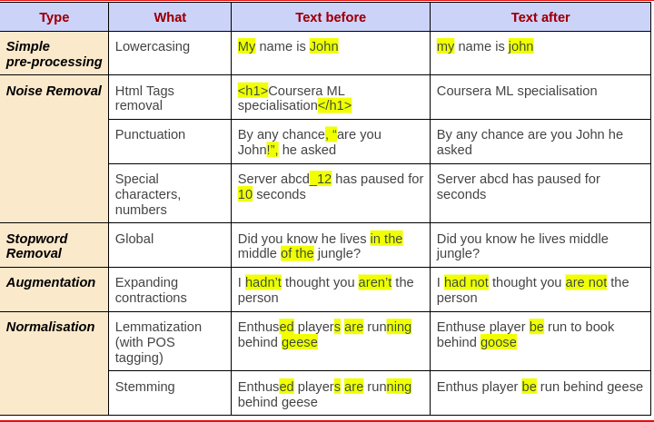

Normalization transforms tokens into a consistent form.

**Lowercasing** reduces vocabulary size by treating "Patient" and "patient" as the same word.

> **Caveat:** Lowercasing can destroy useful information. "US" (United States) becomes "us" (pronoun). In clinical text, abbreviations often rely on case: "MS" could mean multiple sclerosis, mental status, or morphine sulfate.

**Stopword removal** filters out common words like "the", "is", "and" that appear frequently but carry little meaning for many tasks. A **stopword list** is a predefined set of these common words.

> **Caveat:** Stopwords aren't always useless. "No chest pain" loses critical meaning if you remove "no". For clinical text, be careful with negation words.

**Punctuation removal** strips commas, periods, and other marks—unless they carry meaning (like hyphens in "COVID-19").

### Reference Card: Normalization

| Category | Method | Purpose & Arguments | Typical Output |
| :--- | :--- | :--- | :--- |
| **Case** | `text.lower()` | Converts string to lowercase. | `str` |
| **Punctuation** | `text.translate(str.maketrans('', '', string.punctuation))` | Removes all punctuation characters. | `str` |
| **Stopwords** | `stopwords.words('english')` | Returns NLTK's English stopword list. | `list[str]` (179 words) |

### Code Snippet: Normalization

```python
import string
import nltk
from nltk.corpus import stopwords

nltk.download('punkt_tab')
nltk.download('stopwords')

text = "The Patient, age 45, presents WITH chest pain."

text = text.lower()
text = text.translate(str.maketrans('', '', string.punctuation))
tokens = nltk.word_tokenize(text)

stop_words = set(stopwords.words('english'))
tokens = [t for t in tokens if t not in stop_words]

print(tokens)
# ['patient', 'age', '45', 'presents', 'chest', 'pain']
```

## Stemming and Lemmatization

Both techniques reduce words to a common base form, helping group related words together.

**Stemming** chops off word endings using simple rules. It's fast but crude—"studies" becomes "studi" (not a real word).

**Lemmatization** uses vocabulary and word structure analysis to find the actual dictionary form (the **lemma**). "studies" → "study", "better" → "good". More accurate but slower.

```
Word          Stemmer Output    Lemmatizer Output
───────────────────────────────────────────────────
"running"     "run"             "run"
"studies"     "studi"           "study"
"better"      "better"          "good" (with POS=adj)
"universities" "univers"        "university"
```

### Reference Card: Stemming & Lemmatization

| Category | Method | Purpose & Arguments | Typical Output |
| :--- | :--- | :--- | :--- |
| **Stemming** | `PorterStemmer().stem(word)` | Classic rule-based English stemmer. | `str` |
| **Stemming** | `SnowballStemmer('english').stem(word)` | Improved Porter variant. | `str` |
| **Lemmatization** | `WordNetLemmatizer().lemmatize(word, pos='v')` | Dictionary lookup. `pos`: 'n', 'v', 'a', 'r'. | `str` |
| **Lemmatization** | `token.lemma_` | spaCy attribute, automatic in pipeline. | `str` |

### Code Snippet: Stemming vs Lemmatization

```python
from nltk.stem import PorterStemmer, WordNetLemmatizer
import nltk
nltk.download('wordnet')

stemmer = PorterStemmer()
lemmatizer = WordNetLemmatizer()

words = ["running", "studies", "better", "caring"]

for word in words:
    print(f"{word}: stem={stemmer.stem(word)}, lemma={lemmatizer.lemmatize(word, pos='v')}")
```

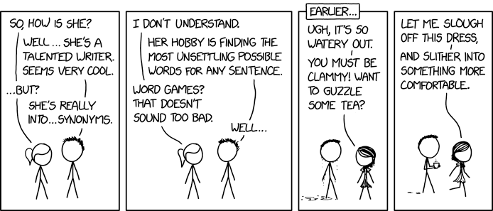

# LIVE DEMO

# Part-of-Speech Tagging

Part-of-speech (POS) tagging labels each token with its grammatical role: noun, verb, adjective, etc.

## Concepts

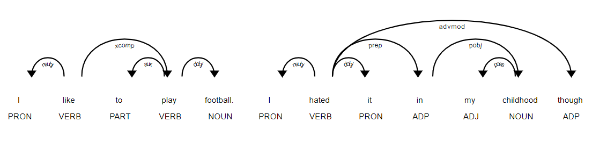

POS tagging enables:

- **Better lemmatization** — knowing "running" is a verb vs noun
- **Information extraction** — find all nouns to identify topics
- **Syntax analysis** — understand sentence structure

```
"The patient reported severe chest pain yesterday."

The      → DT  (determiner)
patient  → NN  (noun, singular)
reported → VBD (verb, past tense)
severe   → JJ  (adjective)
chest    → NN  (noun, singular)
pain     → NN  (noun, singular)
```

Tags follow standardized sets. **Penn Treebank** tags (NLTK) are the traditional English standard. **Universal Dependencies** tags (spaCy) work across languages.

### Common POS Tags

| Tag | Description | Example |
|-----|-------------|---------|
| NN | Noun, singular | patient, pain |
| NNS | Noun, plural | patients, symptoms |
| VB | Verb, base form | diagnose, treat |
| VBD | Verb, past tense | diagnosed, treated |
| VBG | Verb, gerund | diagnosing, running |
| JJ | Adjective | severe, chronic |
| RB | Adverb | quickly, very |
| DT | Determiner | the, a, an |

## NLTK

### Reference Card: NLTK POS Tagging

| Category | Method | Purpose & Arguments | Typical Output |
| :--- | :--- | :--- | :--- |
| **Tag** | `nltk.pos_tag(tokens)` | Tags list of tokens with POS. | `list[tuple[str, str]]` |
| **Help** | `nltk.help.upenn_tagset('NN')` | Explains a Penn Treebank tag. | Printed description |

### Code Snippet: NLTK POS Tagging

```python
import nltk
nltk.download('averaged_perceptron_tagger_eng')

text = "The patient reported severe chest pain."
tokens = nltk.word_tokenize(text)
tagged = nltk.pos_tag(tokens)

print(tagged)
# [('The', 'DT'), ('patient', 'NN'), ('reported', 'VBD'),
#  ('severe', 'JJ'), ('chest', 'NN'), ('pain', 'NN'), ('.', '.')]

# Find all nouns
nouns = [word for word, tag in tagged if tag.startswith('NN')]
print(nouns)  # ['patient', 'chest', 'pain']
```

## spaCy

### Reference Card: spaCy POS Tagging

| Category | Method / Attribute | Purpose & Arguments | Typical Output |
| :--- | :--- | :--- | :--- |
| **Coarse** | `token.pos_` | Universal Dependencies POS tag. | `str` (`"NOUN"`, `"VERB"`) |
| **Fine** | `token.tag_` | Fine-grained Penn Treebank style tag. | `str` (`"NN"`, `"VBD"`) |
| **Help** | `spacy.explain(tag)` | Explains any spaCy tag. | `str` |

### Code Snippet: spaCy POS Tagging

```python
import spacy

nlp = spacy.load("en_core_web_sm")
doc = nlp("The patient reported severe chest pain.")

for token in doc:
    print(f"{token.text:12} {token.pos_:6} {token.tag_}")

# The          DET    DT
# patient      NOUN   NN
# reported     VERB   VBD
# severe       ADJ    JJ
# chest        NOUN   NN
# pain         NOUN   NN
```

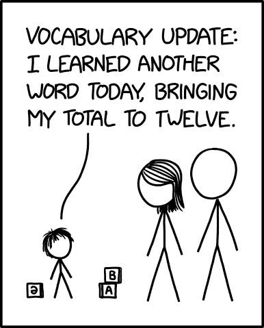

# Named Entity Recognition

Named Entity Recognition (NER) identifies and classifies specific entities in text: people, organizations, locations, dates. For clinical text, specialized models can extract medications, dosages, diagnoses, and procedures.

## Concepts

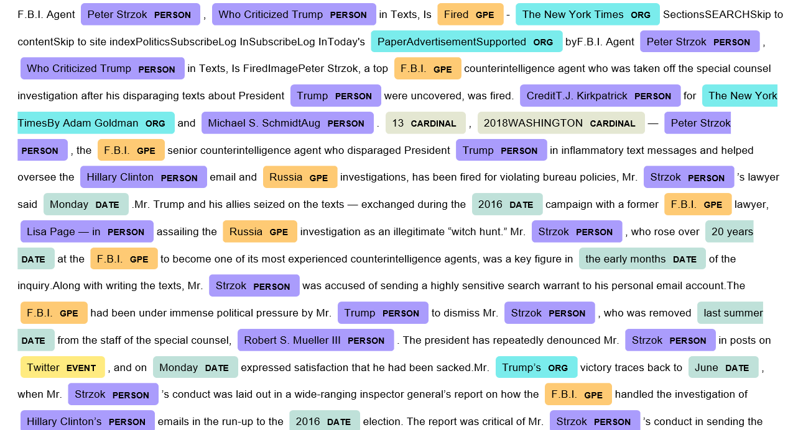

**Example:** "Dr. Smith at UCSF prescribed Metformin 500mg on January 15."

| Text | Entity Type |
|------|-------------|
| Dr. Smith | PERSON |
| UCSF | ORG (organization) |
| Metformin | (needs medical NER model) |
| 500mg | QUANTITY |
| January 15 | DATE |

**Standard NER entities:** PERSON, ORG, GPE (location), DATE, TIME, MONEY, PERCENT

**Clinical NER entities** (specialized models): MEDICATION, DOSAGE, DIAGNOSIS, PROCEDURE, ANATOMY

## NLTK

NLTK's NER requires POS-tagged input and returns a tree structure.

### Reference Card: NLTK NER

| Category | Method | Purpose & Arguments | Typical Output |
| :--- | :--- | :--- | :--- |
| **Extract** | `nltk.ne_chunk(tagged)` | Extracts named entities from POS-tagged tokens. | `nltk.Tree` |
| **Binary** | `nltk.ne_chunk(tagged, binary=True)` | Labels NE vs non-entity only. | `nltk.Tree` |

### Code Snippet: NLTK NER

```python
import nltk
nltk.download('maxent_ne_chunker_tab')
nltk.download('words')

text = "Dr. Smith at UCSF prescribed medication."
tokens = nltk.word_tokenize(text)
tagged = nltk.pos_tag(tokens)
entities = nltk.ne_chunk(tagged)

for chunk in entities:
    if hasattr(chunk, 'label'):
        print(f"{' '.join(c[0] for c in chunk)}: {chunk.label()}")
# UCSF: ORGANIZATION
```

## spaCy

### Reference Card: spaCy NER

| Category | Method / Attribute | Purpose & Arguments | Typical Output |
| :--- | :--- | :--- | :--- |
| **Access** | `doc.ents` | All named entities in document. | `tuple[Span]` |
| **Text** | `ent.text` | The entity's text content. | `str` |
| **Type** | `ent.label_` | Entity classification. | `str` (`"PERSON"`, `"ORG"`) |
| **Position** | `ent.start`, `ent.end` | Token indices of entity span. | `int` |

### Code Snippet: spaCy NER

```python
import spacy

nlp = spacy.load("en_core_web_sm")
doc = nlp("Dr. Smith at UCSF prescribed medication on January 15.")

for ent in doc.ents:
    print(f"{ent.text}: {ent.label_}")

# Dr. Smith: PERSON
# UCSF: ORG
# January 15: DATE
```

# Text Extraction

Beyond NER, we often need to extract specific patterns from text—vitals, dosages, dates, and other structured information. Regex is the workhorse for syntactic patterns; for more complex extraction, consider rule-based systems (spaCy's `Matcher`) or template filling.

## Regex Patterns

Regular expressions (regex, `import re`) are pattern-matching tools for extracting text that follows predictable formats. Use regex when:

- **NER doesn't cover your pattern** — vitals like "120/80" or dosages like "500mg" aren't standard NER types
- **You need exact format control** — dates in "MM/DD/YYYY" vs "Month DD, YYYY" vs "DD-Mon-YY"
- **The pattern is syntactic, not semantic** — phone numbers, IDs, lab values follow structural rules
- **You're building a preprocessing pipeline** — clean or normalize text before further analysis

NER identifies *what something means* (this is a person, this is a date). Regex extracts *what something looks like* (three digits, slash, three digits).

```
Pattern     Matches                Example
────────────────────────────────────────────────────────
\d          digit                  "5" in "500mg"
\d+         one or more digits     "500" in "500mg"
\w+         word characters        "patient" in "patient:"
[A-Z]+      uppercase letters      "BP" in "BP: 120/80"
\s          whitespace             spaces, tabs, newlines
(...)       capture group          extract matched portion
|           OR                     "mg|ml|mcg"

Clinical patterns:
• Vitals:  \d{2,3}/\d{2,3}        →  "120/80"
• Dosage:  \d+\s?(mg|ml|mcg)      →  "500 mg", "10ml"
• Date:    \d{1,2}/\d{1,2}/\d{4}  →  "01/15/2025"
```

### Reference Card: Python `re` Module

| Category | Method | Purpose & Arguments | Typical Output |
| :--- | :--- | :--- | :--- |
| **Search** | `re.search(pattern, text)` | Finds first match in text. | `Match` or `None` |
| **Find All** | `re.findall(pattern, text)` | Finds all non-overlapping matches. | `list[str]` |
| **Replace** | `re.sub(pattern, repl, text)` | Replaces matches with `repl` string. | `str` |
| **Extract** | `match.group()` | Returns the matched text. | `str` |
| **Groups** | `match.groups()` | Returns all captured groups. | `tuple[str]` |

### Code Snippet: Regex in the `re` Module

```python
import re

note = "BP 120/80, Metformin 500mg, Lab 01/15/2025"

bp = re.findall(r'\d{2,3}/\d{2,3}', note)                 # ['120/80']
meds = re.findall(r'(\w+)\s+(\d+)(mg|ml)', note)          # [('Metformin', '500', 'mg')]
cleaned = re.sub(r'\d{2}/\d{2}/\d{4}', '[DATE]', note)    # redact dates
```

## Regex Across NLP Tools

Regex patterns appear throughout the NLP toolkit—not just in the `re` module. Learning regex syntax pays off because you'll reuse it in many contexts.

```python
# TOKENIZATION: RegexpTokenizer uses regex to define what counts as a token
from nltk.tokenize import RegexpTokenizer
tokenizer = RegexpTokenizer(r'\w+')           # words only, no punctuation
tokenizer.tokenize("Hello, world!")           # ['Hello', 'world']

# PANDAS: .str methods accept regex for text columns
import pandas as pd
df = pd.DataFrame({'notes': ['BP 120/80', 'BP 130/85']})
df['systolic'] = df['notes'].str.extract(r'(\d+)/\d+')   # extract first number

# SPACY MATCHER: pattern-based matching (not regex, but similar concept)
# from spacy.matcher import Matcher
# matcher.add("BP_PATTERN", [[{"SHAPE": "ddd"}, {"TEXT": "/"}, {"SHAPE": "dd"}]])
```

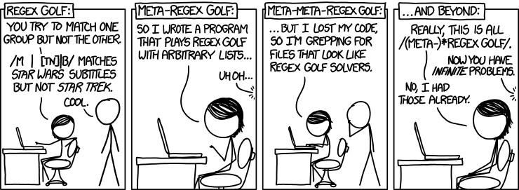

# LIVE DEMO

# Text Representation

To use text in machine learning, we need numerical representations. These classical approaches convert documents into vectors (lists of numbers).

## Bag of Words

**Bag of Words (BoW)** counts how many times each word appears, ignoring order. The result is a **document-term matrix** where each row is a document and each column is a word from the **vocabulary** (all unique words across documents).

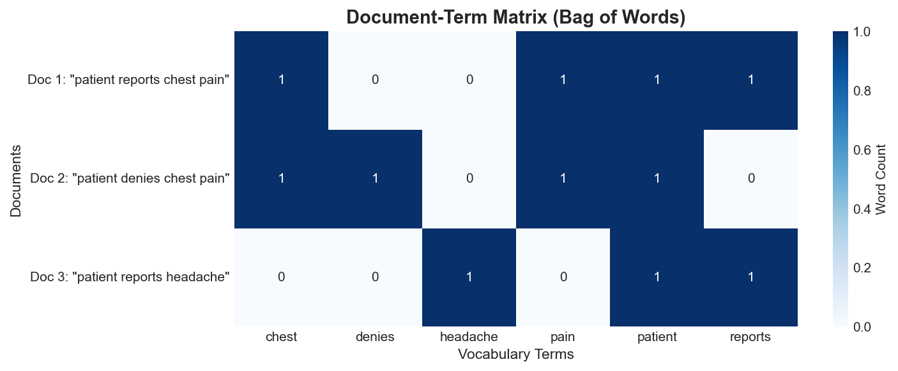

```
Documents:
1. "patient reports chest pain"
2. "patient denies chest pain"
3. "patient reports headache"

Vocabulary: [chest, denies, headache, pain, patient, reports]

Document-Term Matrix:
           chest  denies  headache  pain  patient  reports
Doc 1        1       0        0       1       1        1
Doc 2        1       1        0       1       1        0
Doc 3        0       0        1       0       1        1
```

**Limitations:**

- Ignores word order ("patient reports pain" = "pain reports patient")
- Creates **sparse matrices** (most values are 0)
- Common words dominate the counts

### Reference Card: `CountVectorizer`

| Category | Method | Purpose & Arguments | Typical Output |
| :--- | :--- | :--- | :--- |
| **Create** | `CountVectorizer(max_features=N, stop_words='english')` | Initializes vectorizer. `ngram_range=(1,1)` for unigrams. | `CountVectorizer` |
| **Fit** | `.fit_transform(docs)` | Learns vocabulary and transforms documents to counts. | Sparse matrix |
| **Inspect** | `.get_feature_names_out()` | Returns learned vocabulary. | `ndarray[str]` |
| **Convert** | `.toarray()` | Converts sparse matrix to dense array. | `ndarray` |

### Code Snippet: Bag of Words

```python
from sklearn.feature_extraction.text import CountVectorizer

docs = [
    "patient reports chest pain",
    "patient denies chest pain",
    "patient reports headache"
]

vectorizer = CountVectorizer()
X = vectorizer.fit_transform(docs)

print(vectorizer.get_feature_names_out())
# ['chest' 'denies' 'headache' 'pain' 'patient' 'reports']

print(X.toarray())
# [[1 0 0 1 1 1]
#  [1 1 0 1 1 0]
#  [0 0 1 0 1 1]]
```

## TF-IDF

**TF-IDF (Term Frequency–Inverse Document Frequency)** improves on raw counts by weighting words based on how distinctive they are. Words that appear in every document get downweighted; rare, specific terms get upweighted.

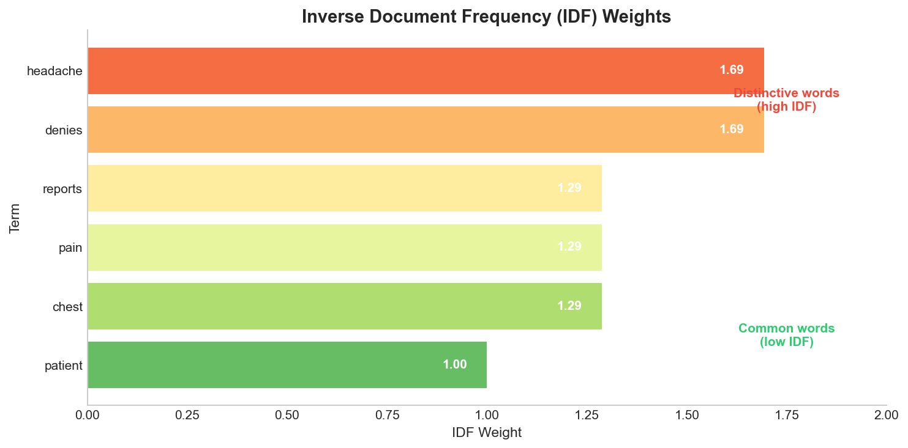

$$\text{TF-IDF}(word, doc) = \text{TF}(word, doc) \times \text{IDF}(word)$$

- **TF (Term Frequency)** — how often the word appears in this document
- **IDF (Inverse Document Frequency)** — how rare the word is across all documents: $\log(\text{total docs} / \text{docs containing word})$

> **Note:** scikit-learn's `TfidfVectorizer` uses a smoothed IDF formula by default: $\log((n+1)/(df+1)) + 1$, where $n$ is the total number of documents and $df$ is the document frequency. This prevents division by zero and slightly different values than the standard formula.

**Example:** "diabetes" appears in 10 of 1000 documents → high IDF (distinctive). "patient" appears in 900 of 1000 → low IDF (common).

### Reference Card: `TfidfVectorizer`

| Category | Method | Purpose & Arguments | Typical Output |
| :--- | :--- | :--- | :--- |
| **Create** | `TfidfVectorizer(max_df=0.9, min_df=2)` | Tokenizes + applies TF-IDF. `max_df`/`min_df` filter by doc frequency. | `TfidfVectorizer` |
| **Fit** | `.fit_transform(docs)` | Learns vocabulary and transforms to TF-IDF weights. | Sparse matrix |
| **Transform** | `.transform(new_docs)` | Transforms new text using learned vocabulary (no refitting). | Sparse matrix |
| **Inspect** | `.idf_` | Learned IDF weights for each term. | `ndarray[float]` |

### Code Snippet: TF-IDF

```python
from sklearn.feature_extraction.text import TfidfVectorizer

docs = [
    "patient reports chest pain",
    "patient denies chest pain",
    "patient reports headache"
]

vectorizer = TfidfVectorizer()
X = vectorizer.fit_transform(docs)

for word, idf in zip(vectorizer.get_feature_names_out(), vectorizer.idf_):
    print(f"{word}: IDF = {idf:.2f}")

# patient: IDF = 1.00   ← appears in all docs, lowest IDF
# denies: IDF = 1.69    ← appears in only 1 doc, high IDF
```

## N-grams

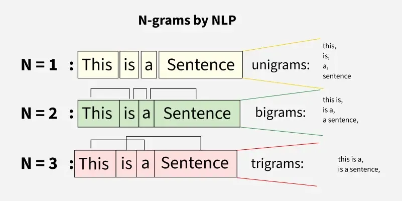

Single words (**unigrams**) lose context. **N-grams** capture sequences of N consecutive words.

- **Bigrams** (n=2): word pairs — "chest pain", "denies chest"
- **Trigrams** (n=3): word triples — "patient denies chest"

**Why n-grams matter for clinical text:**

- "chest pain" is meaningful as a unit
- "denies chest pain" captures negation context
- "no chest pain" vs "chest pain" mean opposite things

### Reference Card: N-grams

| Category | Method | Purpose & Arguments | Example Output |
| :--- | :--- | :--- | :--- |
| **Unigrams** | `ngram_range=(1, 1)` | Single words only (default). | `['chest', 'pain']` |
| **+ Bigrams** | `ngram_range=(1, 2)` | Words and word pairs. | `['chest', 'pain', 'chest pain']` |
| **+ Trigrams** | `ngram_range=(1, 3)` | Through 3-word sequences. | `['chest', 'chest pain', 'denies chest pain']` |

Use with `CountVectorizer` or `TfidfVectorizer`.

### Code Snippet: N-grams

```python
from sklearn.feature_extraction.text import CountVectorizer

docs = ["patient denies chest pain", "patient reports chest pain"]

vectorizer = CountVectorizer(ngram_range=(1, 2))
X = vectorizer.fit_transform(docs)

print(vectorizer.get_feature_names_out())
# ['chest', 'chest pain', 'denies', 'denies chest', 'pain',
#  'patient', 'patient denies', 'patient reports', 'reports', 'reports chest']
```


## Word Vectors

The representations above treat each word independently—"diabetes" and "hypertension" are just as different as "diabetes" and "pizza." **Word vectors** (embeddings) capture semantic similarity: related words have similar vectors.

spaCy's medium and large models (`en_core_web_md`, `en_core_web_lg`) include pre-computed word vectors. We'll cover how embeddings work in Lecture 07.

### Code Snippet: Word Vectors

```python
import spacy
# Note: en_core_web_sm has no vectors; use _md or _lg for word vectors
nlp = spacy.load("en_core_web_md")  # medium model has vectors
doc = nlp("diabetes hypertension")
print(doc[0].vector.shape)          # (300,) - 300-dimensional vector
print(doc[0].similarity(doc[1]))    # ~0.5 - related medical terms
```

For classical NLP, TF-IDF is your go-to representation: interpretable, effective, and doesn't require special models.

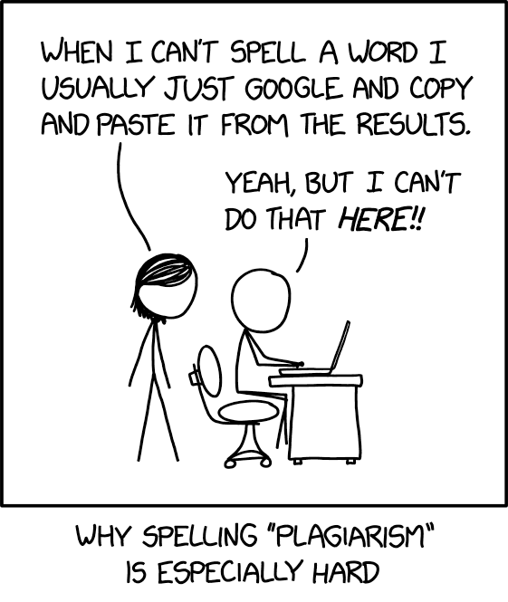

# Document Similarity

With text represented as vectors, we can measure how similar documents are. This enables search, clustering, and recommendation systems. Cosine similarity is the standard choice for text; alternatives include Jaccard similarity (for sets of words) and Euclidean distance (sensitive to document length).

## Cosine Similarity

**Cosine similarity** measures the angle between two vectors rather than their distance. This makes it robust to document length—a long document and a short document about the same topic will have high similarity.

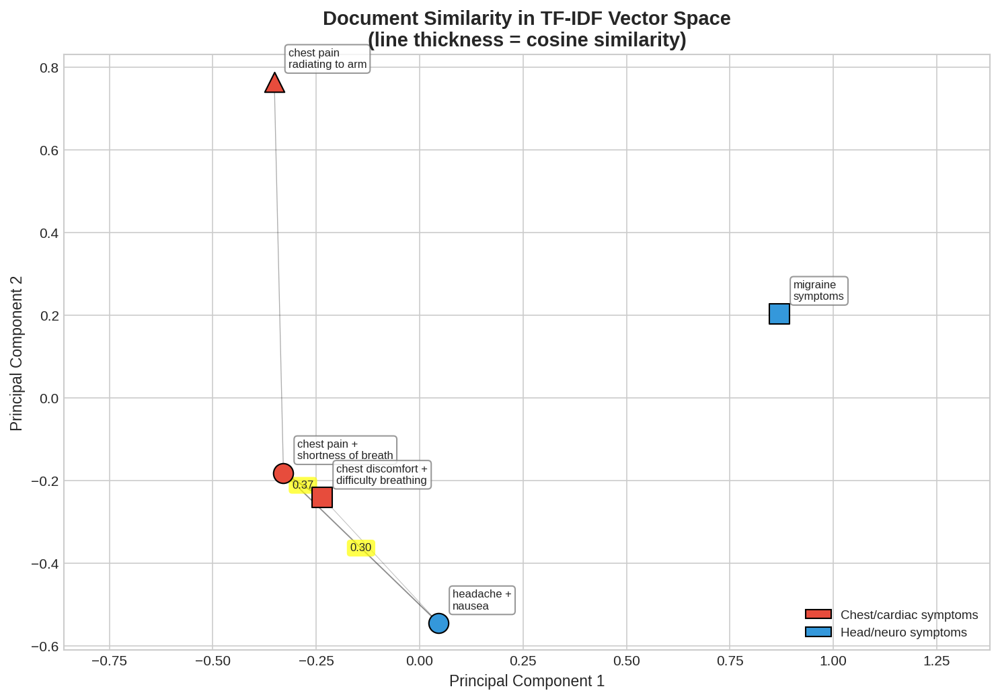

$$\cos(\theta) = \frac{A \cdot B}{\|A\| \times \|B\|}$$

- **Range:** 0 to 1 for TF-IDF vectors
- **1.0** = identical direction (very similar)
- **0.0** = perpendicular (no shared words)

### Reference Card: Document Similarity

| Category | Method | Purpose & Arguments | Typical Output |
| :--- | :--- | :--- | :--- |
| **Pairwise** | `cosine_similarity(X)` | Similarity between all row pairs in X. | `ndarray` (n×n) |
| **Compare** | `cosine_similarity(X, Y)` | Similarity between rows of X and Y. | `ndarray` |
| **Distance** | `spatial.distance.cosine(u, v)` | Cosine distance (1 - similarity). | `float` |
| **Jaccard** | `jaccard_score(set1, set2)` | Intersection/union of word sets. | `float` (0-1) |

### Code Snippet: Document Similarity

```python
from sklearn.feature_extraction.text import TfidfVectorizer
from sklearn.metrics.pairwise import cosine_similarity

docs = [
    "patient presents with chest pain and shortness of breath",
    "patient reports chest discomfort and difficulty breathing",
    "patient complains of headache and nausea"
]

vectorizer = TfidfVectorizer()
X = vectorizer.fit_transform(docs)

similarities = cosine_similarity(X)
print(similarities)
# [[1.   0.35 0.11]
#  [0.35 1.   0.11]
#  [0.11 0.11 1.  ]]
# Docs 0 and 1 are most similar (both about chest/breathing)

# Jaccard: compare word sets (ignores frequency)
words0 = set(docs[0].lower().split())
words1 = set(docs[1].lower().split())
jaccard = len(words0 & words1) / len(words0 | words1)
print(f"Jaccard: {jaccard:.2f}")  # 0.31
```

# Specialized Tools

General NLP tools work well for common text, but clinical language requires specialized models.

| Tool | Focus | Access |
|------|-------|--------|
| scispaCy | Biomedical NER | `pip install scispacy` |
| MedSpaCy | Negation detection, clinical pipelines | `pip install medspacy` |
| cTAKES | Full clinical NLP (Java) | Apache, open source |
| MetaMap | UMLS concept extraction | NLM, requires license |

**UMLS** (Unified Medical Language System) is a biomedical vocabulary database from the National Library of Medicine. It maps between coding systems (ICD, SNOMED, RxNorm) and provides standardized concept identifiers. Tools like MetaMap and QuickUMLS link free-text mentions to UMLS concepts.

# Challenges

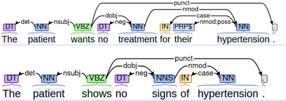

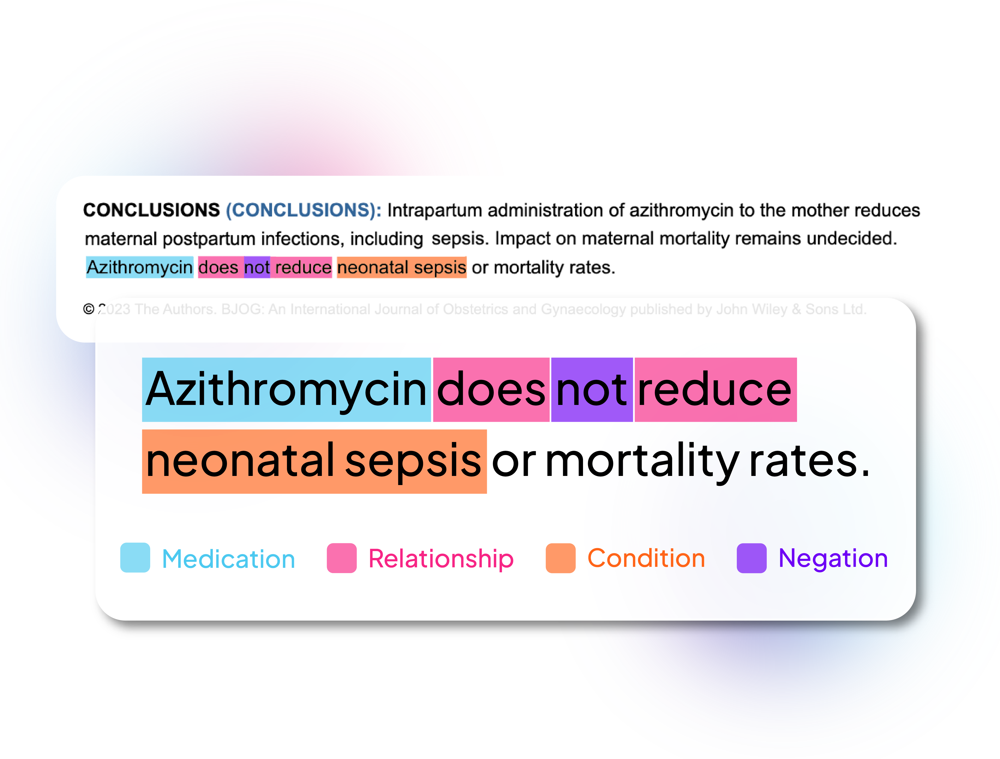

General NLP tools struggle with clinical text:

**Abbreviations** — "pt c/o SOB" = "patient complains of shortness of breath". Same abbreviation, different meanings: "MS" = multiple sclerosis OR mental status OR morphine sulfate.

**Negation** — "Patient denies chest pain" means chest pain is ABSENT. Simple keyword extraction misses this. Basic negation detection looks for negation words ("no", "denies", "without") within a few words of the finding: `re.search(r'\b(no|denies?|without)\s+\w+\s+chest\s+pain', text, re.I)` would catch this pattern.

**Uncertainty** — "possible pneumonia" ≠ "confirmed pneumonia". "rule out MI" = suspicion, not diagnosis.

**Temporality** — "History of diabetes" (past) vs "Patient has diabetes" (current) vs "Risk of diabetes" (future).

**Variations** — "hypertention", "htn", "HTN", "high blood pressure" all mean the same thing.

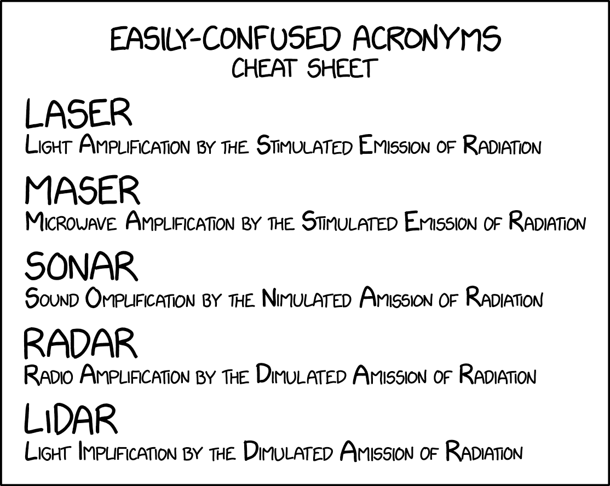

# Pipelines

Putting it all together: combine preprocessing, analysis, and extraction into reusable pipelines.

## NLTK Pipeline

NLTK requires manual assembly—each step is explicit and configurable.

### Code Snippet: NLTK Pipeline

```python
import nltk
import string
import re
from nltk.corpus import stopwords
from nltk.stem import WordNetLemmatizer

def nltk_pipeline(text):
    # Step 1: Tokenize
    tokens = nltk.word_tokenize(text.lower())
    
    # Step 2: Remove punctuation and stopwords
    stop_words = set(stopwords.words('english')) - {'no', 'not'}  # keep negations
    tokens = [t for t in tokens if t not in string.punctuation and t not in stop_words]
    
    # Step 3: Lemmatize
    lemmatizer = WordNetLemmatizer()
    tokens = [lemmatizer.lemmatize(t) for t in tokens]
    
    # Step 4: POS tag
    tagged = nltk.pos_tag(tokens)
    
    # Step 5: Extract named entities
    entities = nltk.ne_chunk(tagged)
    
    # Step 6: Extract patterns with regex
    bp = re.findall(r'\d{2,3}/\d{2,3}', text)
    
    return {
        'tokens': tokens,
        'pos_tags': tagged,
        'nouns': [word for word, tag in tagged if tag.startswith('NN')],
        'entities': entities,
        'blood_pressure': bp
    }

note = "Patient John Smith, age 45, presents with BP 140/90 and chest pain."
result = nltk_pipeline(note)
print(f"Tokens: {result['tokens']}")
print(f"Nouns: {result['nouns']}")
print(f"BP: {result['blood_pressure']}")
# Tokens: ['patient', 'john', 'smith', 'age', '45', 'present', 'bp', '140/90', 'chest', 'pain']
# Nouns: ['patient', 'john', 'smith', 'age', 'bp', 'chest', 'pain']
# BP: ['140/90']
```

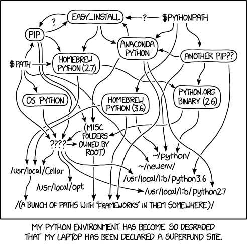

## spaCy Pipeline

spaCy's pipeline is integrated—one call processes everything.

### Code Snippet: spaCy Pipeline

```python
import spacy
import re

def spacy_pipeline(text):
    nlp = spacy.load("en_core_web_sm")
    doc = nlp(text)
    
    # All analysis available on doc object
    return {
        'tokens': [token.text for token in doc],
        'lemmas': [token.lemma_ for token in doc if not token.is_punct],
        'nouns': [token.lemma_ for token in doc if token.pos_ == "NOUN"],
        'entities': [(ent.text, ent.label_) for ent in doc.ents],
        'blood_pressure': re.findall(r'\d{2,3}/\d{2,3}', text)
    }

note = "Dr. Martinez at UCSF prescribed Metformin 500mg on 01/15/2025. Patient reports improved glucose control."
result = spacy_pipeline(note)
print(f"Nouns: {result['nouns']}")
print(f"Entities: {result['entities']}")
print(f"BP: {result['blood_pressure']}")
# Nouns: ['Dr.', 'UCSF', 'Metformin', 'glucose', 'control']
# Entities: [('Dr. Martinez', 'PERSON'), ('UCSF', 'ORG'), ('01/15/2025', 'DATE')]
# BP: []
```

### Reference Card: spaCy Pipeline

| Category | Method / Attribute | Purpose & Arguments | Typical Output |
| :--- | :--- | :--- | :--- |
| **Setup** | `spacy.load("en_core_web_sm")` | Loads English pipeline model. | `Language` (`nlp`) |
| **Process** | `nlp(text)` | Runs full pipeline in one call. | `Doc` object |
| **Token** | `token.lemma_` | Dictionary base form. | `str` |
| **Token** | `token.pos_` | Part-of-speech tag. | `str` (`"NOUN"`, `"VERB"`) |
| **Token** | `token.is_stop`, `token.is_punct` | Boolean filters. | `bool` |
| **Doc** | `doc.ents` | Named entities found. | `tuple[Span]` |

## Comparing the Approaches

| Aspect | NLTK Pipeline | spaCy Pipeline |
|--------|---------------|----------------|
| Assembly | Manual, step-by-step | Automatic, one call |
| Customization | Full control at each step | Configure via `nlp.disable()` |
| Stopwords | Explicit filtering | `token.is_stop` attribute |
| NER quality | Basic | Better out-of-box |
| Speed | Slower | Faster |

# LIVE DEMO

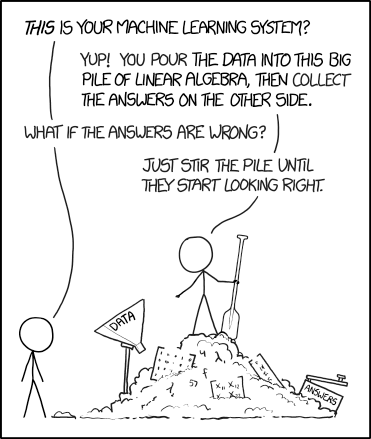
