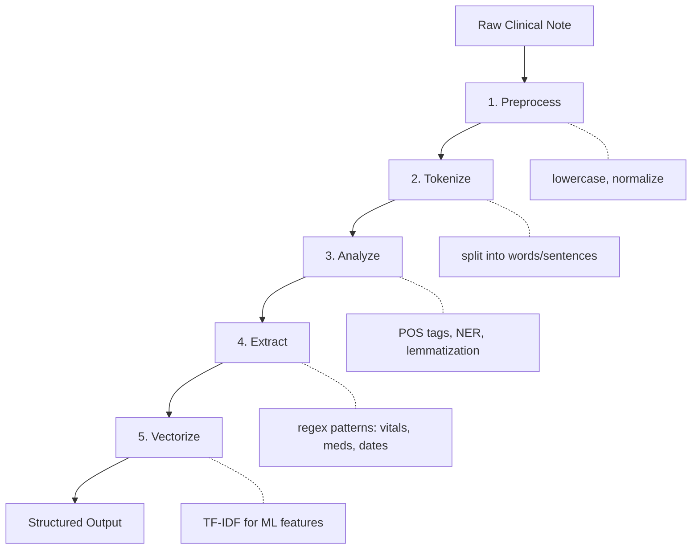

Natural Language Processing

# References

| Resource | Description |
|----------|-------------|
| [Speech and Language Processing](https://web.stanford.edu/~jurafsky/slp3/) | Jurafsky & Martin—comprehensive NLP textbook (free online) |
| [NLTK Book](https://www.nltk.org/book/) | Official NLTK tutorial with examples |
| [spaCy Documentation](https://spacy.io/usage) | Production NLP library docs |
| [Regular Expressions 101](https://regex101.com/) | Interactive regex tester |
| [scispaCy](https://allenai.github.io/scispacy/) | Biomedical NLP models for spaCy |

---

# Natural Language Processing (NLP)

## What is NLP?

Humans communicate in natural language—English, Spanish, clinical shorthand. Computers need structure—numbers, categories, defined relationships. Natural language processing (NLP) bridges this gap, transforming free-form text into data that algorithms can analyze.

NLP powers everyday tools you already use:

- **Search engines** understand queries and match relevant documents
- **Translation services** convert between languages
- **Voice assistants** interpret spoken commands
- **Email filters** detect spam and categorize messages

```
┌─────────────────────────────────────────────────────────────────────────┐
│                      The NLP Problem                                    │
├─────────────────────────────────────────────────────────────────────────┤
│                                                                         │
│   Human Language              →        Structured Data                  │
│   ────────────────────────────────────────────────────────────────      │
│   "Patient denies chest       →        symptoms: [fatigue]              │
│    pain, reports mild                  negated: [chest_pain]            │
│    fatigue"                            sentiment: neutral               │
│                                                                         │
│   Challenges:                                                           │
│   • Ambiguity ("bank" = river bank? financial bank?)                    │
│   • Context ("not bad" = good)                                          │
│   • Variation ("BP", "blood pressure", "b.p.")                          │
│   • Implicit knowledge ("take with food" implies meals)                 │
│                                                                         │
└─────────────────────────────────────────────────────────────────────────┘
```

## Why NLP for Health Data?

Electronic health records contain vast amounts of free-text data: physician notes, discharge summaries, radiology reports, pathology findings. Surveys and patient-reported outcomes add more unstructured text. NLP lets you:

- **Extract diagnoses** from clinical notes that weren't coded
- **Identify adverse events** mentioned in free text
- **Analyze sentiment** (positive/negative tone) in patient feedback
- **Build cohorts** from text descriptions that predate structured fields

| Data Source | Example Text | What NLP Can Extract |
|-------------|--------------|----------------------|
| Progress notes | "Patient denies chest pain, reports mild fatigue" | Symptoms (negated and affirmed) |
| Radiology reports | "No acute intracranial abnormality" | Findings, negation status |
| Discharge summaries | "Follow up with cardiology in 2 weeks" | Care instructions, timing |
| Patient surveys | "The wait time was frustrating" | Sentiment, specific complaints |

## NLP Tools: NLTK, spaCy, and Beyond

Two Python libraries dominate classical NLP work. Understanding their philosophies helps you choose the right tool.

**NLTK (Natural Language Toolkit)** is designed for learning and research. It offers many algorithms for each task, letting you explore different approaches. Processing is string-based—you work with lists of words and manual pipelines.

**spaCy** is designed for production applications. It provides one optimized algorithm per task, prioritizing speed and ease of use. Processing is object-oriented—you work with `Doc`, `Token`, and `Span` objects that carry rich annotations.

| Aspect | NLTK | spaCy |
|--------|------|-------|
| Philosophy | Educational, comprehensive | Production-ready, fast |
| Algorithm choice | Many algorithms to choose | One best algorithm per task |
| Processing style | String-based | Object-oriented (Doc, Token, Span) |
| Pipeline | Manual assembly | Integrated pipeline |
| Best for | Learning, research | Applications |
| Extras | Includes corpora & datasets | Focused on processing |

| Use NLTK when... | Use spaCy when... |
|------------------|-------------------|
| Learning NLP concepts | Building applications |
| Need specific algorithms | Processing large volumes |
| Academic research | Need speed and efficiency |
| Exploring different methods | Want batteries-included |

**spaCy's object model:**

- **Doc**: A processed document containing all tokens and annotations
- **Token**: A single word or punctuation mark with attributes (text, part-of-speech, lemma)
- **Span**: A slice of a Doc (like a substring, but with token information)—used for entities and phrases

### Reference Card: Tool Installation

| Tool | Install | First-time Setup |
|------|---------|------------------|
| NLTK | `pip install nltk` | `nltk.download('punkt')`, `nltk.download('stopwords')` |
| spaCy | `pip install spacy` | `python -m spacy download en_core_web_sm` |
| scikit-learn | `pip install scikit-learn` | (none required) |

## Classical vs. Modern NLP Approaches

This lecture covers **classical NLP**—techniques developed before large language models (LLMs) became practical. These methods remain valuable and widely used.

| Aspect | Classical NLP (this lecture) | LLM-based NLP (Lecture 07) |
|--------|------------------------------|----------------------------|
| Text representation | Word counts, TF-IDF | Contextual embeddings |
| Pipeline | Explicit stages (tokenize → analyze → vectorize) | Often end-to-end |
| Interpretability | High—you can inspect features | Lower—embeddings are opaque |
| Computational cost | Low | High |
| Training data | Works with small labeled sets | Benefits from massive pretraining |

**When to use classical NLP:**

- You need interpretable features (e.g., "which words predict readmission?")
- Computational resources are limited
- You're building rule-based extraction (regex, pattern matching)
- The task is well-defined and doesn't require deep understanding

**When to use LLMs:**

- The task requires understanding context and nuance
- You need text generation or summarization
- Transfer learning from general knowledge helps your domain

Most real-world clinical NLP systems combine both: classical techniques for structured extraction, LLMs for complex reasoning.

---

# Text Preprocessing

Raw text is messy. Before analysis, we transform it into a consistent format. The preprocessing pipeline typically flows: **tokenization → normalization → reduction**.

<!-- #FIXME: Replace with image - search: "NLP text processing pipeline flowchart diagram" -->

```
Raw Text ──► Tokenization ──► Normalization ──► Analysis ──► Output

"Patient      ["Patient",       ["patient",       POS tags,     structured
 reports      "reports",         "report",        entities,     data,
 mild..."     "mild", ...]       "mild", ...]     vectors       features
```

## Tokenization

Tokenization splits text into individual units called **tokens**—usually words, but sometimes punctuation, numbers, or subwords. This is the foundation of nearly all NLP work because every subsequent step operates on tokens.

```
┌─────────────────────────────────────────────────────────────────────────┐
│                        Tokenization Strategies                          │
├─────────────────────────────────────────────────────────────────────────┤
│                                                                         │
│   Sentence: "Dr. Smith prescribed 500mg ibuprofen."                     │
│                                                                         │
│   ┌─────────────────────────────────────────────────────────────────┐   │
│   │ Whitespace split:  ["Dr.", "Smith", "prescribed", "500mg",     │   │
│   │                     "ibuprofen."]                               │   │
│   │                     ↑ keeps punctuation attached                │   │
│   └─────────────────────────────────────────────────────────────────┘   │
│                                                                         │
│   ┌─────────────────────────────────────────────────────────────────┐   │
│   │ NLTK word_tokenize: ["Dr.", "Smith", "prescribed", "500mg",    │   │
│   │                      "ibuprofen", "."]                          │   │
│   │                      ↑ handles abbreviations, splits final "." │   │
│   └─────────────────────────────────────────────────────────────────┘   │
│                                                                         │
│   ┌─────────────────────────────────────────────────────────────────┐   │
│   │ spaCy tokenizer:    ["Dr.", "Smith", "prescribed", "500", "mg",│   │
│   │                      "ibuprofen", "."]                          │   │
│   │                      ↑ splits numbers from units                │   │
│   └─────────────────────────────────────────────────────────────────┘   │
│                                                                         │
└─────────────────────────────────────────────────────────────────────────┘
```

**Why tokenization matters:**

- "500mg" as one token vs. "500" + "mg" affects downstream analysis
- Abbreviations like "Dr." shouldn't be split at the period
- Medical terms like "COVID-19" should stay together

Modern LLMs use **subword tokenization** (covered in Lecture 07), which splits words into smaller pieces like "pre" + "process" + "ing". This handles rare words better but is more complex than word tokenization.

### Reference Card: Tokenization

| Tool | Function | Notes |
|------|----------|-------|
| Python | `text.split()` | Splits on whitespace only |
| NLTK | `nltk.word_tokenize(text)` | Handles punctuation, abbreviations |
| NLTK | `nltk.sent_tokenize(text)` | Splits into sentences |
| spaCy | `doc = nlp(text)` then `for token in doc` | Tokens accessible via iteration |

### Code Snippet: Tokenization Comparison

```python
import nltk
nltk.download('punkt_tab')

text = "Dr. Smith prescribed 500mg ibuprofen. Take twice daily."

# Naive split
print(text.split())
# ['Dr.', 'Smith', 'prescribed', '500mg', 'ibuprofen.', 'Take', 'twice', 'daily.']

# NLTK word tokenize
print(nltk.word_tokenize(text))
# ['Dr.', 'Smith', 'prescribed', '500mg', 'ibuprofen', '.', 'Take', 'twice', 'daily', '.']

# NLTK sentence tokenize
print(nltk.sent_tokenize(text))
# ['Dr. Smith prescribed 500mg ibuprofen.', 'Take twice daily.']
```

## Normalization

Normalization transforms tokens into a consistent form. Common operations include:

**Lowercasing** reduces vocabulary size by treating "Patient" and "patient" as the same word.

> **Caveat:** Lowercasing can destroy useful information. "US" (United States) becomes "us" (pronoun). In clinical text, abbreviations often rely on case: "MS" could mean multiple sclerosis, mental status, or morphine sulfate. Consider your task before lowercasing.

**Stopword removal** filters out common words like "the", "is", and "and" that appear frequently but carry little meaning for many tasks. A **stopword list** is simply a predefined set of these common words.

> **Caveat:** Stopwords aren't always useless. "No chest pain" loses critical meaning if you remove "no". For clinical text, be careful with negation words.

**Punctuation removal** strips commas, periods, and other marks—unless they carry meaning (like hyphens in "COVID-19").

```
┌─────────────────────────────────────────────────────────────────────────┐
│                        Normalization Pipeline                           │
├─────────────────────────────────────────────────────────────────────────┤
│                                                                         │
│   "The Patient, age 45, presents WITH chest pain."                      │
│                           │                                             │
│                           ▼                                             │
│   ┌─────────────────────────────────────────────┐                       │
│   │  1. Lowercase                               │                       │
│   │  "the patient, age 45, presents with..."    │                       │
│   └─────────────────────────────────────────────┘                       │
│                           │                                             │
│                           ▼                                             │
│   ┌─────────────────────────────────────────────┐                       │
│   │  2. Remove punctuation                      │                       │
│   │  "the patient age 45 presents with..."      │                       │
│   └─────────────────────────────────────────────┘                       │
│                           │                                             │
│                           ▼                                             │
│   ┌─────────────────────────────────────────────┐                       │
│   │  3. Remove stopwords                        │                       │
│   │  "patient age 45 presents chest pain"       │                       │
│   └─────────────────────────────────────────────┘                       │
│                                                                         │
└─────────────────────────────────────────────────────────────────────────┘
```

### Reference Card: Normalization

| Operation | NLTK | Python Built-in |
|-----------|------|-----------------|
| Lowercase | `text.lower()` | `text.lower()` |
| Remove punctuation | Use `string.punctuation` | `str.translate()` |
| Stopwords list | `nltk.corpus.stopwords.words('english')` | — |
| Check if stopword | `word in stopwords.words('english')` | — |

### Code Snippet: Normalization

```python
import string
import nltk
from nltk.corpus import stopwords

nltk.download('punkt')
nltk.download('stopwords')

text = "The Patient, age 45, presents WITH chest pain."

# Lowercase
text = text.lower()

# Remove punctuation
text = text.translate(str.maketrans('', '', string.punctuation))

# Tokenize
tokens = nltk.word_tokenize(text)

# Remove stopwords
stop_words = set(stopwords.words('english'))
tokens = [t for t in tokens if t not in stop_words]

print(tokens)
# ['patient', 'age', '45', 'presents', 'chest', 'pain']
```

## Stemming and Lemmatization

Both techniques reduce words to a common base form, helping group related words together. They work differently:

**Stemming** chops off word endings using simple rules. It's fast but crude—"studies" becomes "studi" (not a real word), and "better" stays "better" (missing the connection to "good").

**Lemmatization** uses vocabulary and word structure analysis to find the actual dictionary form (called the **lemma**). "studies" → "study", "better" → "good". It's more accurate but slower.

```
┌─────────────────────────────────────────────────────────────────────────┐
│                    Stemming vs. Lemmatization                           │
├─────────────────────────────────────────────────────────────────────────┤
│                                                                         │
│   Word          │  Stemmer Output    │  Lemmatizer Output              │
│   ─────────────────────────────────────────────────────────────────     │
│   "running"     │  "run"             │  "run"                          │
│   "studies"     │  "studi"           │  "study"                        │
│   "better"      │  "better"          │  "good" (with POS=adj)          │
│   "caring"      │  "care"            │  "care"                         │
│   "universities"│  "univers"         │  "university"                   │
│                                                                         │
│   Speed:        │  Fast (rules only) │  Slower (dictionary lookup)     │
│   Accuracy:     │  Lower             │  Higher                         │
│                                                                         │
└─────────────────────────────────────────────────────────────────────────┘
```

Lemmatization works best when it knows the word's grammatical role. "running" as a verb lemmatizes to "run", but as a noun ("the running of the bulls") it stays "running". This is why lemmatizers often accept a part-of-speech hint.

### Reference Card: Stemming & Lemmatization

| Tool | Class/Function | Notes |
|------|----------------|-------|
| NLTK | `PorterStemmer()` | Classic English stemmer |
| NLTK | `SnowballStemmer('english')` | Improved Porter variant |
| NLTK | `WordNetLemmatizer()` | Requires POS for best results |
| spaCy | `token.lemma_` | Built into pipeline, automatic |

### Code Snippet: Stemming vs. Lemmatization

```python
from nltk.stem import PorterStemmer, WordNetLemmatizer
import nltk
nltk.download('wordnet')

stemmer = PorterStemmer()
lemmatizer = WordNetLemmatizer()

words = ["running", "studies", "better", "caring"]

for word in words:
    print(f"{word}: stem={stemmer.stem(word)}, lemma={lemmatizer.lemmatize(word, pos='v')}")

# running: stem=run, lemma=run
# studies: stem=studi, lemma=study
# better: stem=better, lemma=better
# caring: stem=care, lemma=care
```


---

# LIVE DEMO!

---

# Linguistic Analysis

Beyond preprocessing, we can extract grammatical structure and meaningful entities from text. These techniques help identify *what* the text is about and *how* ideas relate.

## Part-of-Speech Tagging

Part-of-speech (POS) tagging labels each token with its grammatical role: noun, verb, adjective, etc. This enables:

- **Better lemmatization** (knowing "running" is a verb vs. noun)
- **Information extraction** (find all nouns to identify topics)
- **Syntax analysis** (understand sentence structure)

```
┌─────────────────────────────────────────────────────────────────────────┐
│                        POS Tag Examples                                 │
├─────────────────────────────────────────────────────────────────────────┤
│                                                                         │
│   "The patient reported severe chest pain yesterday."                   │
│                                                                         │
│    The      → DT  (determiner)                                          │
│    patient  → NN  (noun, singular)                                      │
│    reported → VBD (verb, past tense)                                    │
│    severe   → JJ  (adjective)                                           │
│    chest    → NN  (noun, singular)                                      │
│    pain     → NN  (noun, singular)                                      │
│    yesterday→ NN  (noun, singular)                                      │
│    .        → .   (punctuation)                                         │
│                                                                         │
└─────────────────────────────────────────────────────────────────────────┘
```

Tags follow standardized sets. **Penn Treebank** tags (used by NLTK) are the traditional standard for English. **Universal Dependencies** tags (used by spaCy) work across languages.

### Common POS Tags (Penn Treebank)

| Tag | Description | Example |
|-----|-------------|---------|
| NN | Noun, singular | patient, pain |
| NNS | Noun, plural | patients, symptoms |
| VB | Verb, base form | diagnose, treat |
| VBD | Verb, past tense | diagnosed, treated |
| VBG | Verb, gerund | diagnosing, running |
| JJ | Adjective | severe, chronic |
| RB | Adverb | quickly, very |
| DT | Determiner | the, a, an |
| IN | Preposition | in, on, with |
| PRP | Personal pronoun | he, she, they |

### Reference Card: POS Tagging

| Tool | Function | Tag Set |
|------|----------|---------|
| NLTK | `nltk.pos_tag(tokens)` | Penn Treebank |
| spaCy | `token.pos_` | Universal Dependencies (coarse) |
| spaCy | `token.tag_` | Fine-grained tags |

### Code Snippet: POS Tagging

```python
import nltk
nltk.download('averaged_perceptron_tagger_eng')

text = "The patient reported severe chest pain."
tokens = nltk.word_tokenize(text)
tagged = nltk.pos_tag(tokens)

print(tagged)
# [('The', 'DT'), ('patient', 'NN'), ('reported', 'VBD'),
#  ('severe', 'JJ'), ('chest', 'NN'), ('pain', 'NN'), ('.', '.')]

# Find all nouns
nouns = [word for word, tag in tagged if tag.startswith('NN')]
print(nouns)
# ['patient', 'chest', 'pain']
```


## Named Entity Recognition

Named Entity Recognition (NER) identifies and classifies specific entities in text: people, organizations, locations, dates. For clinical text, specialized models can extract medications, dosages, diagnoses, and procedures.

<!-- #FIXME: Replace with image - search: "named entity recognition NER clinical text visualization highlighted entities" -->

**Example:** "Dr. Smith at UCSF prescribed Metformin 500mg on January 15."

| Text | Entity Type |
|------|-------------|
| Dr. Smith | PERSON |
| UCSF | ORG (organization) |
| Metformin | (needs medical NER model) |
| 500mg | QUANTITY |
| January 15 | DATE |

**Standard NER entities:** PERSON, ORG, GPE (location), DATE, TIME, MONEY, PERCENT

**Clinical NER entities** (specialized models): MEDICATION, DOSAGE, DIAGNOSIS, PROCEDURE, ANATOMY

### Reference Card: Named Entity Recognition

| Tool | Function | Notes |
|------|----------|-------|
| NLTK | `nltk.ne_chunk(tagged)` | Returns tree structure, requires POS tags first |
| spaCy | `doc.ents` | Returns Span objects |
| spaCy | `ent.text`, `ent.label_` | Entity text and type |

### Code Snippet: NER with spaCy

```python
import spacy

nlp = spacy.load("en_core_web_sm")
text = "Dr. Smith at UCSF prescribed medication on January 15."
doc = nlp(text)

for ent in doc.ents:
    print(f"{ent.text}: {ent.label_}")

# Dr. Smith: PERSON
# UCSF: ORG
# January 15: DATE
```

## Regular Expressions for Text Extraction

Regular expressions (regex) are pattern-matching tools for extracting specific text patterns. Where NER identifies semantic entities, regex extracts syntactic patterns—perfect for structured data like vitals, dosages, and dates.

```
┌─────────────────────────────────────────────────────────────────────────┐
│                     Common Regex Patterns                               │
├─────────────────────────────────────────────────────────────────────────┤
│                                                                         │
│   Pattern     │  Matches                │  Example                      │
│   ────────────┼─────────────────────────┼─────────────────────────────  │
│   \d          │  digit                  │  "5" in "500mg"               │
│   \d+         │  one or more digits     │  "500" in "500mg"             │
│   \w+         │  word characters        │  "patient" in "patient:"      │
│   [A-Z]+      │  uppercase letters      │  "BP" in "BP: 120/80"         │
│   .+          │  any characters         │  everything until newline     │
│   \s          │  whitespace             │  spaces, tabs, newlines       │
│   ^           │  start of line          │  "^Diagnosis:"                │
│   $           │  end of line            │  "mg$"                        │
│   (...)       │  capture group          │  extract matched portion      │
│   (?:...)     │  non-capturing group    │  group without extracting     │
│   |           │  OR                     │  "mg|ml|mcg"                  │
│                                                                         │
│   Clinical patterns:                                                    │
│   • Vitals:    \d{2,3}/\d{2,3}         →  "120/80"                      │
│   • Dosage:    \d+\s?(mg|ml|mcg)       →  "500 mg", "10ml"              │
│   • Date:      \d{1,2}/\d{1,2}/\d{4}  →  "01/15/2025"                   │
│                                                                         │
└─────────────────────────────────────────────────────────────────────────┘
```

### Reference Card: Python Regex

| Function | Purpose | Returns |
|----------|---------|---------|
| `re.search(pattern, text)` | Find first match | Match object or None |
| `re.findall(pattern, text)` | Find all matches | List of strings |
| `re.sub(pattern, repl, text)` | Replace matches | Modified string |
| `re.compile(pattern)` | Pre-compile pattern | Regex object |
| `match.group()` | Get matched text | String |
| `match.groups()` | Get capture groups | Tuple |

### Code Snippet: Clinical Text Extraction

```python
import re

note = """
Patient vitals: BP 120/80, HR 72, Temp 98.6F
Medications: Metformin 500mg twice daily, Lisinopril 10mg daily
Lab results from 01/15/2025: HbA1c 7.2%
"""

# Extract blood pressure readings
bp_pattern = r'\d{2,3}/\d{2,3}'
bp_readings = re.findall(bp_pattern, note)
print(f"BP: {bp_readings}")  # ['120/80']

# Extract medication dosages
dose_pattern = r'(\w+)\s+(\d+)\s?(mg|ml)'
medications = re.findall(dose_pattern, note)
print(f"Meds: {medications}")  # [('Metformin', '500', 'mg'), ('Lisinopril', '10', 'mg')]

# Extract dates
date_pattern = r'\d{1,2}/\d{1,2}/\d{4}'
dates = re.findall(date_pattern, note)
print(f"Dates: {dates}")  # ['01/15/2025']
```

## The spaCy Pipeline

spaCy processes text through a unified pipeline, performing tokenization, POS tagging, lemmatization, and NER in one pass. This is more efficient than calling separate tools for each task.

### Reference Card: spaCy Components

| Component | Access | Description |
|-----------|--------|-------------|
| Load model | `nlp = spacy.load("en_core_web_sm")` | Small English model |
| Process text | `doc = nlp(text)` | Returns Doc object |
| Tokens | `for token in doc:` | Iterate through tokens |
| Token text | `token.text` | Original text |
| Lowercase | `token.lower_` | Lowercased text |
| Lemma | `token.lemma_` | Base form |
| POS tag | `token.pos_` | Universal POS tag |
| Fine POS | `token.tag_` | Detailed tag |
| Dependency | `token.dep_` | Syntactic dependency |
| Entities | `doc.ents` | Named entities |

### Code Snippet: spaCy Pipeline

```python
import spacy

nlp = spacy.load("en_core_web_sm")
text = "The patient was diagnosed with Type 2 diabetes."
doc = nlp(text)

for token in doc:
    print(f"{token.text:12} {token.pos_:6} {token.lemma_:12} {token.dep_}")

# The          DET    the          det
# patient      NOUN   patient      nsubjpass
# was          AUX    be           auxpass
# diagnosed    VERB   diagnose     ROOT
# with         ADP    with         prep
# Type         PROPN  Type         compound
# 2            NUM    2            compound
# diabetes     NOUN   diabetes     pobj
# .            PUNCT  .            punct
```


---

# LIVE DEMO!!

---

# Text Representation

To use text in machine learning, we need numerical representations. This section covers classical approaches that convert documents into vectors (lists of numbers).

## Bag of Words

The simplest approach is **Bag of Words (BoW)**: count how many times each word appears, ignoring order. The result is a **document-term matrix** where each row is a document and each column is a word from the **vocabulary** (the set of all unique words across documents).


```
┌─────────────────────────────────────────────────────────────────────────┐
│                        Bag of Words Example                             │
├─────────────────────────────────────────────────────────────────────────┤
│                                                                         │
│   Documents:                                                            │
│   1. "patient reports chest pain"                                       │
│   2. "patient denies chest pain"                                        │
│   3. "patient reports headache"                                         │
│                                                                         │
│   Vocabulary: [chest, denies, headache, pain, patient, reports]         │
│                                                                         │
│   Document-Term Matrix:                                                 │
│                                                                         │
│              chest  denies  headache  pain  patient  reports            │
│   Doc 1        1       0        0       1       1        1              │
│   Doc 2        1       1        0       1       1        0              │
│   Doc 3        0       0        1       0       1        1              │
│                                                                         │
└─────────────────────────────────────────────────────────────────────────┘
```

**Limitations of Bag of Words:**

- Ignores word order ("patient reports pain" = "pain reports patient")
- Creates **sparse matrices** (most values are 0, which is memory-efficient but can be tricky)
- Common words dominate the counts

### Reference Card: Bag of Words

| Tool | Class | Key Parameters |
|------|-------|----------------|
| scikit-learn | `CountVectorizer()` | `max_features`, `stop_words`, `ngram_range` |
| Method | `.fit_transform(docs)` | Returns sparse matrix |
| Method | `.get_feature_names_out()` | Returns vocabulary |
| Method | `.toarray()` | Convert sparse to dense array |

### Code Snippet: Bag of Words

```python
from sklearn.feature_extraction.text import CountVectorizer

docs = [
    "patient reports chest pain",
    "patient denies chest pain",
    "patient reports headache"
]

vectorizer = CountVectorizer()
X = vectorizer.fit_transform(docs)

print(vectorizer.get_feature_names_out())
# ['chest' 'denies' 'headache' 'pain' 'patient' 'reports']

print(X.toarray())
# [[1 0 0 1 1 1]
#  [1 1 0 1 1 0]
#  [0 0 1 0 1 1]]
```

## TF-IDF: Term Frequency–Inverse Document Frequency

TF-IDF improves on raw counts by weighting words based on how distinctive they are. Words that appear in every document (like "patient") get downweighted; rare, specific terms get upweighted.


```
┌─────────────────────────────────────────────────────────────────────────┐
│                           TF-IDF Formula                                │
├─────────────────────────────────────────────────────────────────────────┤
│                                                                         │
│   TF-IDF(word, doc) = TF(word, doc) × IDF(word)                         │
│                                                                         │
│   TF (Term Frequency):                                                  │
│   • How often the word appears in this document                         │
│   • TF = count(word in doc) / total words in doc                        │
│                                                                         │
│   IDF (Inverse Document Frequency):                                     │
│   • How rare the word is across all documents                           │
│   • IDF = log(total docs / docs containing word)                        │
│   • The log makes doubling frequency less than double the weight        │
│                                                                         │
│   ┌─────────────────────────────────────────────────────────────────┐   │
│   │  Example:                                                       │   │
│   │  "diabetes" appears in 10 of 1000 documents                     │   │
│   │  IDF = log(1000/10) = log(100) ≈ 2.0  (high—distinctive!)       │   │
│   │                                                                 │   │
│   │  "patient" appears in 900 of 1000 documents                     │   │
│   │  IDF = log(1000/900) ≈ 0.05  (low—common word)                  │   │
│   └─────────────────────────────────────────────────────────────────┘   │
│                                                                         │
└─────────────────────────────────────────────────────────────────────────┘
```

### Reference Card: TF-IDF

| Tool | Class | Notes |
|------|-------|-------|
| scikit-learn | `TfidfVectorizer()` | Combines tokenization + TF-IDF |
| scikit-learn | `TfidfTransformer()` | Applies to existing count matrix |
| Parameters | `max_df`, `min_df` | Filter by document frequency |
| Parameters | `ngram_range` | Include word pairs/triples |

### Code Snippet: TF-IDF

```python
from sklearn.feature_extraction.text import TfidfVectorizer

docs = [
    "patient reports chest pain",
    "patient denies chest pain",
    "patient reports headache"
]

vectorizer = TfidfVectorizer()
X = vectorizer.fit_transform(docs)

# Show feature names and their IDF values
for word, idf in zip(vectorizer.get_feature_names_out(), vectorizer.idf_):
    print(f"{word}: IDF = {idf:.2f}")

# chest: IDF = 1.29
# denies: IDF = 1.69    ← appears in only 1 doc, high IDF
# headache: IDF = 1.69  ← appears in only 1 doc, high IDF
# pain: IDF = 1.29
# patient: IDF = 1.00   ← appears in all docs, lowest IDF
# reports: IDF = 1.29
```

## N-grams: Capturing Word Context

Single words (called **unigrams**) lose context. **N-grams** capture sequences of N consecutive words, preserving some word order information.

- **Unigrams** (n=1): individual words
- **Bigrams** (n=2): word pairs
- **Trigrams** (n=3): word triples

```
┌─────────────────────────────────────────────────────────────────────────┐
│                           N-gram Examples                               │
├─────────────────────────────────────────────────────────────────────────┤
│                                                                         │
│   Text: "patient denies chest pain"                                     │
│                                                                         │
│   Unigrams (n=1): ["patient", "denies", "chest", "pain"]                │
│                                                                         │
│   Bigrams (n=2):  ["patient denies", "denies chest", "chest pain"]      │
│                                                                         │
│   Trigrams (n=3): ["patient denies chest", "denies chest pain"]         │
│                                                                         │
│   ┌─────────────────────────────────────────────────────────────────┐   │
│   │  Why n-grams matter for clinical text:                          │   │
│   │                                                                 │   │
│   │  • "chest pain" is meaningful as a unit                         │   │
│   │  • "denies chest pain" captures negation context                │   │
│   │  • "no chest pain" vs "chest pain" mean opposite things         │   │
│   └─────────────────────────────────────────────────────────────────┘   │
│                                                                         │
└─────────────────────────────────────────────────────────────────────────┘
```

### Reference Card: N-grams

| Tool | Parameter | Effect |
|------|-----------|--------|
| `CountVectorizer` | `ngram_range=(1, 1)` | Unigrams only (default) |
| `CountVectorizer` | `ngram_range=(1, 2)` | Unigrams and bigrams |
| `CountVectorizer` | `ngram_range=(2, 2)` | Bigrams only |
| `TfidfVectorizer` | `ngram_range=(1, 3)` | Unigrams through trigrams |

### Code Snippet: N-grams

```python
from sklearn.feature_extraction.text import CountVectorizer

docs = ["patient denies chest pain", "patient reports chest pain"]

# Unigrams + bigrams
vectorizer = CountVectorizer(ngram_range=(1, 2))
X = vectorizer.fit_transform(docs)

print(vectorizer.get_feature_names_out())
# ['chest', 'chest pain', 'denies', 'denies chest', 'pain',
#  'patient', 'patient denies', 'patient reports', 'reports', 'reports chest']
```


## A Note on Word Vectors

The representations above treat each word independently—"diabetes" and "hypertension" are just as different as "diabetes" and "pizza." **Word vectors** (also called embeddings) capture semantic similarity: related words have similar vectors.

spaCy's medium and large models (`en_core_web_md`, `en_core_web_lg`) include pre-computed word vectors. We'll cover how embeddings work in Lecture 07 when we discuss transformers and LLMs.

For now, TF-IDF is your go-to text representation: it's interpretable, works well for many tasks, and doesn't require special models.

---

# Working with Text

With preprocessing, analysis, and representation tools in hand, we can now tackle practical tasks.

## Document Similarity

With text represented as vectors, we can measure how similar documents are. This enables search, clustering, and recommendation systems.

**Cosine similarity** measures the angle between two vectors rather than their distance. This makes it robust to document length—a long document and a short document about the same topic will have high similarity even though their word counts differ.


<!-- #FIXME: If document_similarity.png doesn't show the formula/angle well, replace or supplement with: "cosine similarity vectors angle diagram machine learning" -->

**Cosine similarity** measures the angle between two vectors:

$$\cos(\theta) = \frac{A \cdot B}{\|A\| \times \|B\|}$$

- **Range:** 0 to 1 for TF-IDF vectors (no negative values)
- **1.0** = identical direction (very similar)
- **0.0** = perpendicular (unrelated—no shared words)

### Reference Card: Document Similarity

| Tool | Function | Returns |
|------|----------|---------|
| scikit-learn | `cosine_similarity(X)` | Pairwise similarity matrix |
| scikit-learn | `cosine_similarity(X, Y)` | Similarity between X and Y |
| scipy | `cosine(u, v)` | Cosine *distance* (1 - similarity) |

### Code Snippet: Document Similarity

```python
from sklearn.feature_extraction.text import TfidfVectorizer
from sklearn.metrics.pairwise import cosine_similarity

docs = [
    "patient presents with chest pain and shortness of breath",
    "patient reports chest discomfort and difficulty breathing",
    "patient complains of headache and nausea"
]

vectorizer = TfidfVectorizer()
X = vectorizer.fit_transform(docs)

# Compute pairwise similarities
similarities = cosine_similarity(X)
print(similarities)

# [[1.   0.35 0.11]
#  [0.35 1.   0.11]
#  [0.11 0.11 1.  ]]

# Docs 0 and 1 are most similar (both about chest/breathing)
# Doc 2 is different (headache/nausea)
```

## Building a Clinical NLP Pipeline

Here's how the pieces fit into a complete pipeline for processing clinical notes:

<!-- #FIXME: Replace with image - search: "clinical NLP pipeline flowchart preprocessing tokenization NER" -->



### Code Snippet: Simple Clinical Pipeline

```python
import spacy
import re

def process_clinical_note(note):
    """Extract structured information from a clinical note."""
    nlp = spacy.load("en_core_web_sm")

    # Process with spaCy (tokenize, POS, NER in one pass)
    doc = nlp(note)

    # Extract named entities
    entities = [(ent.text, ent.label_) for ent in doc.ents]

    # Extract vitals with regex
    bp = re.findall(r'\d{2,3}/\d{2,3}', note)

    # Get key nouns (potential symptoms/conditions)
    nouns = [token.lemma_ for token in doc if token.pos_ == "NOUN"]

    return {
        'entities': entities,
        'blood_pressure': bp,
        'key_terms': nouns
    }

note = "Patient John Smith, age 45, presents with BP 140/90 and chest pain."
result = process_clinical_note(note)
print(result)
# {'entities': [('John Smith', 'PERSON'), ('45', 'DATE')],
#  'blood_pressure': ['140/90'],
#  'key_terms': ['patient', 'age', 'chest', 'pain']}
```

## Challenges in Clinical NLP

Clinical text has unique challenges that general NLP tools don't handle well out of the box:

```
┌─────────────────────────────────────────────────────────────────────────┐
│                    Clinical NLP Challenges                              │
├─────────────────────────────────────────────────────────────────────────┤
│                                                                         │
│   1. ABBREVIATIONS                                                      │
│      "pt c/o SOB" = "patient complains of shortness of breath"          │
│      Same abbreviation, different meanings: "MS" = multiple sclerosis   │
│                                              OR mental status           │
│                                              OR morphine sulfate        │
│                                                                         │
│   2. NEGATION                                                           │
│      "Patient denies chest pain" → chest pain = ABSENT                  │
│      "No evidence of malignancy" → malignancy = ABSENT                  │
│      Simple keyword extraction misses this!                             │
│                                                                         │
│   3. UNCERTAINTY                                                        │
│      "possible pneumonia" ≠ "confirmed pneumonia"                       │
│      "rule out MI" = suspicion, not diagnosis                           │
│                                                                         │
│   4. TEMPORALITY                                                        │
│      "History of diabetes" = past                                       │
│      "Patient has diabetes" = current                                   │
│      "Risk of diabetes" = future/possible                               │
│                                                                         │
│   5. MISSPELLINGS & VARIATIONS                                          │
│      "hypertention", "htn", "HTN", "high blood pressure"                │
│      All mean the same thing!                                           │
│                                                                         │
└─────────────────────────────────────────────────────────────────────────┘
```

### Specialized Clinical NLP Tools

| Tool | Focus | Access |
|------|-------|--------|
| scispaCy | Biomedical NER | `pip install scispacy` |
| MedSpaCy | Clinical pipelines, negation detection | `pip install medspacy` |
| cTAKES | Clinical NLP (Java-based) | Apache, open source |
| MetaMap | UMLS concept extraction | NLM (National Library of Medicine), requires license |

**UMLS** (Unified Medical Language System) is a large database of biomedical vocabularies maintained by the National Library of Medicine. It maps between different medical coding systems and provides standardized concept identifiers.

---

# LIVE DEMO!!!

---

# Next Steps

You now have the foundations for working with text data:

- **Tokenization** splits text into processable units
- **Normalization** creates consistent representations (with caveats for clinical text)
- **Stemming/Lemmatization** reduces words to base forms
- **POS tagging** identifies grammatical structure
- **NER** extracts named entities
- **Regex** extracts structured patterns
- **BoW/TF-IDF** creates numerical representations for ML
- **Cosine similarity** measures document relatedness

For health data applications:

1. Start with general tools (NLTK, spaCy) to understand your data
2. Move to clinical-specific tools (scispaCy, MedSpaCy) for production
3. Always validate against manual review—NLP isn't perfect
4. Build negation detection into clinical pipelines
5. Consider whether lowercasing and stopword removal are appropriate for your task

In Lecture 07, we'll see how modern LLMs handle many of these tasks end-to-end with transformer architectures.


