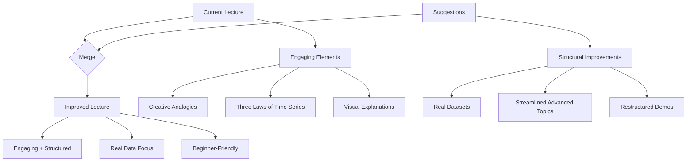
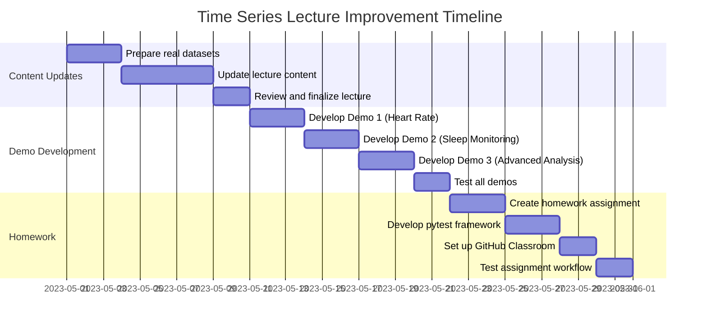

# Lecture 4 Improvement Plan: Merging Engaging Style with Structural Enhancements

## Overview

This plan outlines how to merge the engaging style of the current lecture with the structural improvements and real-data focus from the suggestions. The goal is to create a lecture that is both entertaining and effective for teaching time series concepts to health data science students.



## Elements to Preserve from Current Lecture

1. **Introduction and Humor**
   - Abraham Lincoln quote about the future coming "one data point at a time"
   - XKCD comic about extrapolation
   - Speaking notes with Netflix series analogy

2. **The Three Laws of Time Series**
   - Keep this creative Asimov-inspired section intact
   - Maintain the engaging format and explanations

3. **Clear Categorization of Time Series Types**
   - Keep the table comparing regular-interval, irregular-interval, and dense data
   - Retain the mermaid diagram showing the different types
   - Preserve the visual examples for each type

4. **Mermaid Diagrams and Visualizations**
   - Keep all mermaid diagrams for visual explanations
   - Maintain the visual approach to explaining concepts

5. **Engaging Section Headers and Emoji**
   - Preserve the emoji in section headers
   - Keep the engaging section titles

## Elements to Modify

1. **Code Examples**
   - Replace synthetic data examples with real data from PhysioNet
   - Simplify code examples to focus on key concepts
   - Add more comments explaining each step

2. **Advanced Topics**
   - Reduce depth on ARIMA, LSTM, and other advanced methods
   - Convert detailed explanations to brief mentions with references
   - Focus more time on fundamental concepts

3. **Demo References**
   - Update demo references to point to the new real-data demos
   - Ensure smooth transitions between lecture and demo sections

4. **Time Allocation**
   - Adjust section lengths to match the suggested time allocation
   - Ensure balanced coverage of fundamentals, regression, and applications

## Elements to Add

1. **Real Dataset References**
   - Add information about the PhysioNet datasets being used
   - Include links and brief descriptions

2. **Improved Health Data Relevance**
   - Add more examples from clinical monitoring, epidemiology, and healthcare operations
   - Connect concepts more directly to health applications

3. **Interactive Elements**
   - Add discussion prompts at the start of each section
   - Include comprehension checkpoints throughout

4. **Homework Assignment**
   - Add reference to the homework assignment using the Wearable Device Dataset
   - Briefly describe the assignment structure and learning objectives

## Section-by-Section Implementation Plan

### 1. Introduction (Keep with minor enhancements)

- Keep the Abraham Lincoln quote and XKCD comic
- Keep the Netflix series analogy in speaking notes
- Add a brief overview of the lecture structure
- Add a discussion prompt about time series in healthcare

### 2. Types of Time Series in Health Data (Keep intact)

- Keep the table and mermaid diagram
- Keep the visual examples for each type
- Add references to real datasets for each type

### 3. The Three Laws of Time Series (Keep intact)

- Preserve this creative section completely
- Add a brief connection to real-world health applications for each law

### 4. Time Series Fundamentals (Modify)

- Keep the structure but simplify explanations
- Replace synthetic data examples with Heart Rate Oscillations dataset examples
- Add more visual explanations of trend, seasonality, and noise
- Add a comprehension checkpoint

### 5. Demo 1: Exploring Temporal Patterns (Replace)

- Replace with the new demo using Heart Rate Oscillations during Meditation dataset
- Update the reference and transition text
- Add a brief preview of what students will learn

### 6. Regression for Time Series (Modify)

- Keep the structure but focus more on fundamentals
- Replace synthetic examples with Sleep Monitoring dataset examples
- Simplify the feature engineering section
- Add more health-relevant examples

### 7. Demo 2: Predictive Models (Replace)

- Replace with the new demo using Multilevel Monitoring of Activity and Sleep dataset
- Update the reference and transition text
- Add a brief preview of what students will learn

### 8. Practical Applications (Modify)

- Keep the structure but reduce advanced content
- Focus more on real-world health applications
- Add case studies from healthcare
- Briefly mention advanced methods without detailed explanations

### 9. Demo 3: Advanced Analysis (Replace)

- Replace with the new demo continuing with the Multilevel Monitoring dataset
- Update the reference and transition text
- Add a brief preview of what students will learn

### 10. Homework Assignment (Add)

- Add a new section briefly describing the homework
- Mention the Wearable Device Dataset
- Outline the three parts of the assignment
- Explain the GitHub Classroom integration

### 11. References and Resources (Keep with additions)

- Keep the existing references
- Add references to the PhysioNet datasets used
- Add references for the homework dataset

## Implementation Steps

1. **Prepare Real Datasets**
   - Download and explore the three PhysioNet datasets
   - Create sample code using the real data
   - Test all code examples to ensure they work

2. **Update Lecture Content**
   - Make the section-by-section changes outlined above
   - Ensure smooth transitions between sections
   - Verify all code examples run correctly with real data

3. **Develop Demos**
   - Create the three demos using the specified datasets
   - Ensure they follow the outlines in SUGGESTIONS.md
   - Test them to ensure they can be completed in 10-15 minutes each

4. **Create Homework Assignment**
   - Develop the homework assignment using the Wearable Device Dataset
   - Create the pytest framework for automated testing
   - Set up the GitHub Classroom integration

5. **Review and Finalize**
   - Check that the engaging style is preserved throughout
   - Verify that all code examples work with real data
   - Ensure the lecture flows logically and maintains student engagement

## Timeline



## Expected Outcomes

1. **Enhanced Lecture**
   - Maintains the engaging style of the original
   - Uses real data throughout for authentic learning
   - Is more accessible to beginners while still covering key concepts

2. **Improved Demos**
   - Use real health datasets from PhysioNet
   - Provide hands-on experience with actual health time series data
   - Build progressively in complexity

3. **Effective Homework**
   - Reinforces lecture concepts with a real-world dataset
   - Includes automated testing for efficient grading
   - Provides a complete learning experience

## Specific Code Modifications

### Example 1: Replacing Synthetic Heart Rate Data with Real Meditation Data

**Current Code (Synthetic):**
```python
# Simulate dense heart rate data (1 Hz for 2 hours)
np.random.seed(42)
t = pd.date_range('2024-01-01', periods=7200, freq='S')  # 2 hours, 1 sample/sec
# Simulate circadian + activity + noise
hr = 70 + 10*np.sin(2*np.pi*t.hour/24) + 5*np.sin(2*np.pi*t.minute/60) + np.random.normal(0, 2, len(t))
df = pd.DataFrame({'time': t, 'heart_rate': hr})
```

**Replacement Code (Real Data):**
```python
# Load real heart rate data from meditation dataset
import pandas as pd
import numpy as np
import matplotlib.pyplot as plt
from urllib.request import urlretrieve

# Download the dataset if not already present
url = "https://physionet.org/files/meditation/1.0.0/data/s001.txt"
local_file = "meditation_s001.txt"
urlretrieve(url, local_file)

# Load the data (adjust column names and format based on actual data)
df = pd.read_csv(local_file, sep='\t', header=None, 
                 names=['time', 'heart_rate'])

# Convert time to datetime if needed
df['time'] = pd.to_datetime(df['time'], unit='s')

# Display basic information
print(f"Data points: {len(df)}")
print(f"Time range: {df['time'].min()} to {df['time'].max()}")
print(f"Heart rate range: {df['heart_rate'].min()} to {df['heart_rate'].max()}")
```

### Example 2: Updating Demo Reference

**Current Reference:**
```markdown
## DEMO BREAK: Exploring Temporal Patterns in Health Data

See: [`demo1-time-patterns`](./demo/demo1-time-patterns.ipynb)
```

**Updated Reference:**
```markdown
## DEMO BREAK: Exploring Heart Rate Patterns During Meditation

In this demo, we'll explore real heart rate data from the Heart Rate Oscillations during Meditation dataset on PhysioNet. You'll learn how to:
- Load and visualize real physiological time series data
- Identify patterns in heart rate during different meditation techniques
- Perform basic statistical tests on time series data
- Handle missing values and irregularities in real-world data

See: [`demo1-heart-rate-meditation`](./demo/demo1-heart-rate-meditation.ipynb)
```

### Example 3: Simplifying ARIMA Explanation

**Current Detailed Explanation:**
```markdown
### 3.1 ARIMA and Seasonal Models

ARIMA (AutoRegressive Integrated Moving Average) combines three components:

1. **AR (p)**: Autoregression - using past values
2. **I (d)**: Integration - differencing to make stationary
3. **MA (q)**: Moving Average - using past errors

#### Example: Modeling Patient Temperature

```python
from statsmodels.tsa.arima.model import ARIMA
import numpy as np
import pandas as pd

# Generate hourly temperature data with daily pattern
np.random.seed(42)
hours = pd.date_range(start='2024-01-01', periods=24*30, freq='H')
temp_base = 37.0
daily_pattern = 0.3 * np.sin(2 * np.pi * hours.hour / 24)
noise = np.random.normal(0, 0.1, len(hours))
temperature = temp_base + daily_pattern + noise

# Fit ARIMA model
model = ARIMA(temperature, order=(24,1,1))  # p=24 for daily seasonality
results = model.fit()

# Make predictions
forecast = results.forecast(steps=24)  # Predict next 24 hours

# Plot results
plt.figure(figsize=(12, 6))
plt.plot(hours, temperature, label='Actual')
plt.plot(pd.date_range(start=hours[-1], periods=25, freq='H')[1:],
         forecast, label='Forecast', linestyle='--')
plt.title('Patient Temperature: Actual vs Forecast')
plt.legend()
plt.show()

# Print model summary
print(results.summary())
```
```

**Simplified Explanation:**
```markdown
### 3.1 Time Series Forecasting Methods

There are several approaches to forecasting time series data in healthcare:

1. **Simple Methods**: Moving averages and exponential smoothing
2. **Statistical Models**: ARIMA (AutoRegressive Integrated Moving Average)
3. **Machine Learning**: Random Forests, XGBoost, and neural networks

For this course, we'll focus on simple methods and briefly introduce ARIMA.

#### ARIMA in a Nutshell

ARIMA models combine three components:
- **AR**: Using past values to predict future ones
- **I**: Making the data stationary through differencing
- **MA**: Using past prediction errors

```python
# Example: Simple ARIMA for body temperature forecasting
from statsmodels.tsa.arima.model import ARIMA
import pandas as pd

# Load real temperature data from MMASH dataset
temp_data = pd.read_csv('mmash_temperature.csv', parse_dates=['timestamp'])
temp_data = temp_data.set_index('timestamp')

# Fit a simple ARIMA model
model = ARIMA(temp_data['temperature'], order=(1,0,0))  # Simple AR(1) model
results = model.fit()

# Forecast next 6 hours
forecast = results.forecast(steps=6)
print("Next 6 hours temperature forecast:", forecast.values)
```

For more advanced ARIMA modeling, see the references at the end of this lecture.