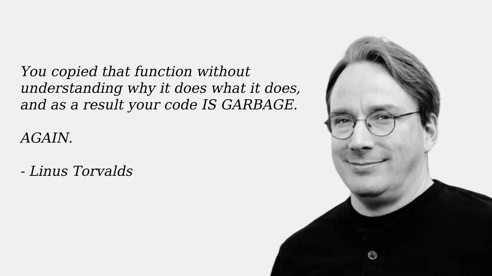

# Classification: Putting a label on things

<!---
This lecture introduces classification, a core concept in machine learning where the goal is to assign labels (like "disease" or "no disease") to data points. We'll cover the main types of classification models, how to evaluate them, and practical tips for working with real health data. The focus is on making these ideas accessible for beginners, with lots of examples and hands-on demos.
--->

- Quick example
- Classification model types and how to evaluate them
- How things can go wrong…
- … and how to fix it
- Hands-on with code

## Preamble

<!---
The preamble provides some context and resources for students interested in data science interviews and real-world health data sources. These links are useful for exploring how classification is used in practice and for preparing for technical interviews.
--->

1. [_The Urgency of Interpretability_ by Dario Amodei (Anthropic founder/CEO) on his blog](https://www.darioamodei.com/post/the-urgency-of-interpretability)
2. [HuggingFace's _Daily Papers_ by AK](https://huggingface.co/papers)
3. Example analytical technical interview - [Analytics Technical Interview](Analytics%20Technical%20Interview.md)
4. Example interview take-home - [https://github.com/christopherseaman/five_twelve](https://github.com/christopherseaman/five_twelve)
5. Data sources available on Physionet (some require credentialed access) - [https://physionet.org/about/database/](https://physionet.org/about/database/)
6. [_Labeling things by hand when everyone's trying not to_ part of Randy Au's excellent **Counting Stuff**](https://www.counting-stuff.com/labeling-things-by-hand-when-everyones-trying-not-to/)

## `git merge` conflicts

<!---
Understanding git merge conflicts is important for collaborating on code, especially in data science projects where multiple people may be working on the same files. Beginners often find merge conflicts intimidating, but they're just a way for git to ask you to clarify which changes to keep.
--->

1. Working in branches for each exercise
2. Save to branch and sync (discarding commits)
3. (_Optional_) Add files from branch back to `main` through a Pull Request


> [!info] Git merge conflicts | Atlassian Git Tutorial
> What is a git merge conflict?
> [https://www.atlassian.com/git/tutorials/using-branches/merge-conflicts](https://www.atlassian.com/git/tutorials/using-branches/merge-conflicts)

## On the perils of ChatGPT

Not exactly what Linus was talking about, but the quote remains relevant…



## 💥Crash course in classification


The building blocks of ML are algorithms for **regression** and **classification:**

- **Regression**: predicting continuous quantities
- **Classification**: predicting _discrete class labels_ (categories)

### **Classification methods**

<!---
This section introduces the most common classification algorithms. Each has its strengths and weaknesses, and the best choice depends on your data and problem. Beginners often think "fancier" models are always better, but simple models like logistic regression can be very effective and are easier to interpret.
--->

**Conceptual Overview:**
Classification algorithms learn to assign labels to data points based on their features. In health data, this might mean predicting whether a patient has a disease based on lab results.

**Reference Card: Common Classification Methods**

- **Logistic Regression:** Linear model for binary outcomes. Easy to interpret.
- **Decision Trees:** Tree structure, splits data by feature values. Intuitive but can overfit.
- **Random Forest:** Many decision trees combined. More robust, less overfitting.
- **Support Vector Machines (SVM):** Finds the best boundary between classes. Good for complex data.
- **Naive Bayes:** Probabilistic, assumes features are independent. Fast and simple.
- **Neural Networks:** Layers of nodes, can model complex patterns. Powerful but less interpretable.

**Minimal Example: Logistic Regression in Python**

```python
from sklearn.linear_model import LogisticRegression
X = [[1, 2], [2, 3], [3, 4]]
y = [0, 1, 0]
model = LogisticRegression().fit(X, y)
print(model.predict([[2, 2]]))  # Predicts class label
```

<!---
This code shows how to fit a logistic regression model using scikit-learn. Beginners sometimes forget to import the right class or to fit the model before predicting.
--->

- Some links to dive deeper:
    - A nice tour of methods: [**https://github.com/bagheri365/ML-Models-for-Classification**](https://github.com/bagheri365/ML-Models-for-Classification)
    - [**Cancer classification**](https://www.kaggle.com/code/nandita711/cancer-classification-eda-pca-random-forest) (Kaggle)
    - [**Comparison of XGBoost, Random Forest, and Nomograph for Prediction of Disease Severity**](https://www.frontiersin.org/articles/10.3389/fcimb.2022.819267/full)
    - [**Prediction Method for Hypertension**](https://www.ncbi.nlm.nih.gov/pmc/articles/PMC6963807/) (Diagnostics Journal)
    - [**Guide to Predictive Lead Scoring using ML**](https://towardsai.net/p/l/a-guide-to-predictive-lead-scoring-using-machine-learning) (Towards AI)
    - [**True end-to-end ML example: Lead Scoring**](https://towardsdatascience.com/a-true-end-to-end-ml-example-lead-scoring-f5b52e9a3c80) (Towards Data Science)

**🧠 Comprehension Checkpoint:**

- What is the difference between regression and classification?
- Name two classification algorithms and a scenario where each might be useful in health data.

<!---
Answers:
- Regression predicts continuous values (e.g., blood pressure), classification predicts discrete categories (e.g., disease/no disease).
- Logistic regression for predicting diabetes (yes/no); Random Forest for classifying cancer types.
--->


### Model evaluation

There are many more classification approaches than data scientists, so choosing the best one for your application can be daunting. Thankfully, all of them output predicted classes for each data point. We can use this similarity to define objective performance criteria based on how often the predicted class matches the underlying truth.

<!---
Evaluating classification models is about more than just "accuracy." This section introduces key metrics like precision, recall, and F1 score, which help you understand different aspects of model performance. The confusion matrix is a classic tool for visualizing how well your model is doing on each class.
--->

**Conceptual Overview:**
Model evaluation metrics help us understand how well our classifier is performing. In health data, it's especially important to know not just how often the model is right, but _how_ it gets things wrong (e.g., missing a disease vs. a false alarm).

- **Precision** (Positive Predictive Value) = $\frac{TP}{TP + FP}$

    > _How well it performs when it predicts positive_

- **Recall** (Sensitivity, True Positive Rate) = $\frac{TP}{TP+FN}$

    > _How well it performs among actual positives_

- **Accuracy** = **$\frac{(TP+TN)}{(TP+FP+FN+TN)}$**

    > _How well it performs among all known classes_

- **F1 score** = $2 \times \frac{Recall * Precision}{Recall + Precision}$

    > _Balanced score for overall model performance_

- **Specificity** (Selectivity, True Negative Rate) = $\frac{TN}{TN + FP}$

    > _Similar to_ **Recall**, _how well it performs among actual negatives_

- **Miss Rate** (False Negative Rate) = $\frac{FN}{TP + FN}$

    > _Proportion of positives that were incorrectly classified, good measure when missing a positive has a high cost_

- **Receiver-Operator Curve (ROC Curve) and Area Under the Curve (AUC)**

    > _Plot the True Positive vs. False Positive rates, which provides a scale-invariant measure of performance. A random model on balanced class data will have a score of 0.5, while a perfect model will always have a score of 1_

**Reference Card: `confusion_matrix`**

- **Function:** `sklearn.metrics.confusion_matrix()`
- **Purpose:** Compute confusion matrix to evaluate classification accuracy.
- **Key Parameters:**
  - `y_true`: (Required) Ground truth (correct) target values.
  - `y_pred`: (Required) Estimated targets as returned by a classifier.
  - `labels`: (Optional, default=None) List of labels to index the matrix. If `None`, labels that appear at least once in `y_true` or `y_pred` are used in sorted order.
  - `normalize`: (Optional, default=None) Normalizes confusion matrix over the true (rows), predicted (columns) conditions or all the population. Can be 'true', 'pred', 'all', or None.

**Example:**

```python
from sklearn.metrics import confusion_matrix
y_true = [1, 0, 1, 1, 0] # Actual labels
y_pred = [1, 0, 0, 1, 1] # Predicted labels
cm = confusion_matrix(y_true, y_pred)
print(cm)
# Output interpretation (for binary case):
# [[TN, FP],
#  [FN, TP]]
```

<!---
This function calculates the confusion matrix. The output array shows True Negatives (TN), False Positives (FP), False Negatives (FN), and True Positives (TP). It's fundamental for calculating other metrics like precision and recall. Beginners often mix up the order of `y_true` and `y_pred` or misinterpret the matrix layout (rows are actual, columns are predicted by default). In health data, understanding FN (missing a disease) vs FP (false alarm) is critical.
--->

I get in trouble with the data science police if I don't include something about confusion matrices:


- **Precision** (Positive Predictive Value) = $\frac{TP}{TP + FP}$

    > _How well it performs when it predicts positive_

- **Recall** (Sensitivity, True Positive Rate) = $\frac{TP}{TP+FN}$

    > _How well it performs among actual positives_

- **Accuracy** = **$\frac{(TP+TN)}{(TP+FP+FN+TN)}$**

    > _How well it performs among all known classes_

- **F1 score** = $2 \times \frac{Recall * Precision}{Recall + Precision}$

    > _Balanced score for overall model performance_

- **Specificity** (Selectivity, True Negative Rate) = $\frac{TN}{TN + FP}$

    > _Similar to_ **Recall**, _how well it performs among actual negatives_

- **Miss Rate** (False Negative Rate) = $\frac{FN}{TP + FN}$

    > _Proportion of positives that were incorrectly classified, good measure when missing a positive has a high cost_

- **Receiver-Operator Curve (ROC Curve) and Area Under the Curve (AUC)**

    > _Plot the True Positive vs. False Positive rates, which provides a scale-invariant measure of performance. A random model on balanced class data will have a score of 0.5, while a perfect model will always have a score of 1_


### ROC curve

<!---
ROC curves are a visual way to see how well your classifier separates the classes at different thresholds. In health data, this is especially useful for understanding trade-offs between catching all cases (sensitivity) and avoiding false alarms (specificity). Beginners sometimes confuse TPR and FPR, or think a single threshold is "best"—but the ROC curve shows performance across all possible thresholds.
--->

**Conceptual Overview:**
An **ROC curve** (Receiver Operating Characteristic curve) shows how a classifier's performance changes as you vary the threshold for predicting "positive." It plots:

- **True Positive Rate (TPR)** (a.k.a. recall): How many actual positives did we catch?
    - **TPR (Recall):** $TPR = TP / (TP + FN)$
- **False Positive Rate (FPR):** How many actual negatives did we incorrectly call positive?
    - **FPR:** $FPR = FP / (FP + TN)$


**Reference Card: `roc_curve`**

- **Function:** `sklearn.metrics.roc_curve()`
- **Purpose:** Compute Receiver operating characteristic (ROC) curve points.
- **Key Parameters:**
  - `y_true`: (Required) True binary labels.
  - `y_score`: (Required) Target scores, can either be probability estimates of the positive class or confidence values.
  - `pos_label`: (Optional, default=1) The label of the positive class.
  - `drop_intermediate`: (Optional, default=True) Whether to drop some suboptimal thresholds which would not appear on a plotted ROC curve.

**Example:**

```python
from sklearn.metrics import roc_curve
y_true = [0, 0, 1, 1]        # Actual labels
y_scores = [0.1, 0.4, 0.35, 0.8] # Model scores/probabilities for class 1
fpr, tpr, thresholds = roc_curve(y_true, y_scores)
print("FPR:", fpr)
print("TPR:", tpr)
# Typically, you'd plot fpr vs tpr using matplotlib
```

<!---
This function calculates the False Positive Rate (FPR), True Positive Rate (TPR), and corresponding thresholds needed to plot an ROC curve. It's essential for visualizing the trade-off between sensitivity and specificity. Beginners often mistakenly provide predicted class labels (`predict()`) instead of probability scores (`predict_proba()[:, 1]`) for `y_score`. Remember, the ROC curve evaluates the model's ranking ability across different decision thresholds.
--->

An ROC curve plots TPR vs. FPR at different classification thresholds. Lowering the classification threshold classifies more items as positive, thus increasing both False Positives and True Positives. The following figure shows a typical ROC curve.


**Figure 4. TP vs. FP rate at different classification thresholds.**

To compute the points in an ROC curve, we could evaluate a logistic regression model many times with different classification thresholds, but this would be inefficient. Fortunately, there's an efficient, sorting-based algorithm that can provide this information for us, called AUC.

### AUC/AUROC: Area Under the ROC Curve

<!---
AUC (Area Under the Curve) is a single-number summary of the ROC curve. It tells you, on average, how well your model separates the classes across all possible thresholds. In health data, a higher AUC means your model is better at distinguishing between, say, "disease" and "no disease"—regardless of where you set the cutoff. Beginners sometimes think AUC is always the best metric, but it's not perfect for every situation.
--->

**Conceptual Overview:**
While the ROC curve visualizes the trade-off between TPR and FPR across different thresholds, the **AUC (Area Under the Curve)** provides a single number summarizing this performance. It measures the _overall_ ability of a classifier to rank positive cases higher than negative ones across all thresholds. An AUC of 1.0 represents a perfect classifier (covering the entire area), while 0.5 means the model is no better than random guessing (following the diagonal line).

**Reference Card: AUC/AUROC**

- **AUC/AUROC (Area Under the ROC Curve):** Probability that a randomly chosen positive is ranked above a randomly chosen negative.
- **Range:** 0 (worst) to 1 (best); 0.5 = random.

**Reference Card: `roc_auc_score`**

- **Function:** `sklearn.metrics.roc_auc_score()`
- **Purpose:** Compute Area Under the Receiver Operating Characteristic Curve (AUC) from prediction scores.
- **Key Parameters:**
  - `y_true`: (Required) True binary labels.
  - `y_score`: (Required) Target scores, can either be probability estimates of the positive class or confidence values.
  - `average`: (Optional, default='macro') Determines the type of averaging performed on the data for multiclass problems.
  - `max_fpr`: (Optional, default=None) If not `None`, the standardized partial AUC over the range [0, max_fpr] is returned.

**Example:**


**Figure 5. AUC (Area under the ROC Curve).**

AUC provides an aggregate measure of performance across all possible classification thresholds. One way of interpreting AUC is as the probability that the model ranks a random positive example more highly than a random negative example. For example, given the following examples, which are arranged from left to right in ascending order of logistic regression predictions:


**Figure 6. Predictions ranked in ascending order of logistic regression score.**

AUC represents the probability that a random positive (green) example is positioned to the right of a random negative (red) example.

AUC ranges in value from 0 to 1. A model whose predictions are 100% wrong has an AUC of 0.0; one whose predictions are 100% correct has an AUC of 1.0.

```python
from sklearn.metrics import roc_auc_score
y_true = [0, 0, 1, 1]        # Actual labels
y_scores = [0.1, 0.4, 0.35, 0.8] # Model scores/probabilities for class 1
auc_score = roc_auc_score(y_true, y_scores)
print(f"AUC Score: {auc_score}")  # Output: AUC Score: 0.75
```

<!---
This function calculates the AUC, a single metric summarizing the ROC curve. It represents the probability that the classifier ranks a random positive instance higher than a random negative one. Like `roc_curve`, it requires probability scores, not class predictions. Beginners might forget this and get incorrect results. An AUC of 0.5 suggests random performance, while 1.0 is perfect. It's a common metric but doesn't capture everything (e.g., performance at specific thresholds or calibration).
--->


**Figure 5. AUC (Area under the ROC Curve).**

AUC provides an aggregate measure of performance across all possible classification thresholds. One way of interpreting AUC is as the probability that the model ranks a random positive example more highly than a random negative example. For example, given the following examples, which are arranged from left to right in ascending order of logistic regression predictions:


**Figure 6. Predictions ranked in ascending order of logistic regression score.**

AUC represents the probability that a random positive (green) example is positioned to the right of a random negative (red) example.

AUC ranges in value from 0 to 1. A model whose predictions are 100% wrong has an AUC of 0.0; one whose predictions are 100% correct has an AUC of 1.0.

AUC is desirable for the following two reasons:

- AUC is **scale-invariant**. It measures how well predictions are ranked, rather than their absolute values.
- AUC is **classification-threshold-invariant**. It measures the quality of the model's predictions irrespective of what classification threshold is chosen.

However, both these reasons come with caveats, which may limit the usefulness of AUC in certain use cases:

- **Scale invariance is not always desirable.** For example, sometimes we really do need well calibrated probability outputs, and AUC won't tell us about that.
- **Classification-threshold invariance is not always desirable.** In cases where there are wide disparities in the cost of false negatives vs. false positives, it may be critical to minimize one type of classification error. For example, when doing email spam detection, you likely want to prioritize minimizing false positives (even if that results in a significant increase of false negatives). AUC isn't a useful metric for this type of optimization.

- [How to evaluate classification models](https://www.edlitera.com/en/blog/posts/evaluating-classification-models) (edlitera)

**🧠 Comprehension Checkpoint:**

- What does an AUC of 0.5 mean? What about 1.0?
- Why might AUC not be the best metric for every health data problem?

<!---
Answers:
- AUC of 0.5 means the model is no better than random guessing; 1.0 means perfect separation of classes.
- AUC doesn't account for class imbalance or the cost of different types of errors; sometimes you care more about recall or precision.
--->

## 🦾 LIVE DEMO

A hands-on walkthrough of binary classification with logistic regression, using synthetic diabetes data.
See: [demo/01_diabetes_prediction.md](demo/01_diabetes_prediction.md)

### Supervised vs. unsupervised

There are two(-ish) overarching categories of classification algorithms: **supervised** and **unsupervised**. There are many possible approaches in each category, and some that work well in both (deep learning, for example).

<!---
This section introduces the two main types of machine learning: supervised (learning from labeled data) and unsupervised (finding patterns in unlabeled data). Beginners often confuse these, but the key is whether you know the "right answer" for each example. Semi-supervised learning is a hybrid, useful in health data where labels are expensive.
--->

**Conceptual Overview:**

- **Supervised learning:** The model learns from examples where the correct answer (label) is known. E.g., predicting if a patient has diabetes based on lab results.
- **Unsupervised learning:** The model tries to find structure in data without labels. E.g., grouping patients by similar symptoms.
- **Semi-supervised:** Some data is labeled, some isn't—common in medical imaging. Includes "reinforcement learning" where the classifier may train itself

**Reference Card: Supervised vs. Unsupervised Learning**

- **Supervised:** Needs labeled data (X, y)
- **Unsupervised:** Only needs features (X)
- **Semi-supervised:** Mix of both

![[unsupervised.png]]

### Supervised models

<!---
Supervised models are the workhorses of health data science. The key idea is to split your data into "train" and "test" sets, so you can see how well your model generalizes to new, unseen data. Beginners sometimes accidentally test on the training set, leading to over-optimistic results.
--->

To fairly evaluate each model, we must **test** its performance on different data than it was **train**ed on. So we split our dataset into two partitions: **test** and **train**:

- **Train** - the model is built using this data, which includes class labels
- **Test** - the model is tested using this data, withholding class labels

#### Quick supervised model review

Let's look at a few tools that you should get a lot of use out of:

- **Logistic Regression** shouldn't be overlooked! It's not as new as some other models, but it's simple and works.
- **Random Forest** is an ensemble model that makes many decision trees using bagging, then takes a simple vote across them to assign a class
- **XGBoost** is another ensemble and arguably the most widely used (and useful) algorithm in tabular ML (it can do regression, classification, and julienne fries!)
- **Deep Learning** uses artificial neural networks with multiple layers to learn complex patterns from data. These models have performed well in a variety of tasks: image recognition, speech recognition, and natural language processing.

    _Deep Learning models may also be used in unsupervised settings_

**Reference Card: `train_test_split`**

- **Function:** `sklearn.model_selection.train_test_split()`
- **Purpose:** Split arrays or matrices into random train and test subsets.
- **Key Parameters:**
  - `*arrays`: (Required) Sequence of indexables with same length / shape[0]. Allowed inputs are lists, numpy arrays, scipy-sparse matrices or pandas dataframes.
  - `test_size`: (Optional, default=0.25) If float, should be between 0.0 and 1.0 and represent the proportion of the dataset to include in the test split. If int, represents the absolute number of test samples.
  - `train_size`: (Optional, default=None) If float/int, represents the proportion/absolute number for the train split. If `None`, it's set to the complement of `test_size`.
  - `random_state`: (Optional, default=None) Controls the shuffling applied to the data before applying the split. Pass an int for reproducible output across multiple function calls.
  - `shuffle`: (Optional, default=True) Whether or not to shuffle the data before splitting.
  - `stratify`: (Optional, default=None) If not None, data is split in a stratified fashion, using this as the class labels. Essential for imbalanced classification tasks.

**Example:**

```python
from sklearn.model_selection import train_test_split
import numpy as np
X = np.array([[1, 2], [2, 3], [3, 4], [4, 5], [5, 6], [6, 7]])
y = np.array([0, 1, 0, 1, 0, 1])
# Split data: 70% train, 30% test, stratified by y, reproducible
X_train, X_test, y_train, y_test = train_test_split(
    X, y, test_size=0.3, random_state=42, stratify=y
)
print("X_train shape:", X_train.shape)
print("X_test shape:", X_test.shape)
```

<!---
This is a crucial first step in supervised learning to prevent overfitting and evaluate model generalization. Always split your data *before* doing any feature scaling or resampling (like SMOTE) that learns from the data, applying those steps only to the training set. Beginners often forget to set `random_state` for reproducibility or neglect `stratify` for imbalanced datasets, which can lead to misleading evaluation results if the test set doesn't reflect the true class distribution.
--->

**🧠 Comprehension Checkpoint:**

- What is the difference between supervised and unsupervised learning?
- Why do we split data into train and test sets?

<!---
Answers:
- Supervised learning uses labeled data (with known outcomes); unsupervised learning finds patterns in unlabeled data.
- To evaluate how well the model generalizes to new, unseen data and avoid overfitting.
--->


#### Logistic regression

<!---
Logistic regression is a classic, beginner-friendly model for binary classification. It outputs probabilities using a sigmoid curve, making it easy to interpret. In health data, it's often used for risk prediction (e.g., probability of disease).
--->

Logistic regression works similarly to linear regression but uses a sigmoid curve that squeezes our straight line into an S-curve.

**Reference Card: `LogisticRegression`**

- **Function:** `sklearn.linear_model.LogisticRegression()`
- **Purpose:** Linear model for classification (binary or multinomial).
- **Key Parameters:**
  - `penalty`: (Optional, default='l2') Specify the norm used in the penalization ('l1', 'l2', 'elasticnet', 'none').
  - `C`: (Optional, default=1.0) Inverse of regularization strength; must be a positive float. Smaller values specify stronger regularization.
  - `solver`: (Optional, default='lbfgs') Algorithm to use in the optimization problem. Common choices: 'liblinear' (good for small datasets), 'lbfgs', 'sag', 'saga' (faster for large ones).
  - `max_iter`: (Optional, default=100) Maximum number of iterations taken for the solvers to converge.
  - `random_state`: (Optional, default=None) Used when `solver` == ‘sag’, ‘saga’ or ‘liblinear’ to shuffle the data.

**Example:**

```python
from sklearn.linear_model import LogisticRegression
X = [[1, 2], [2, 3], [3, 4]]
y = [0, 1, 0]
model = LogisticRegression().fit(X, y)
print(model.predict([[2, 2]]))
```

<!---
This code fits a logistic regression model and predicts a class. Logistic Regression is a fundamental linear classifier, often a good baseline. It models the probability of the default class using the logistic (sigmoid) function. Beginners sometimes forget that `C` controls the *inverse* of regularization strength (smaller C = stronger regularization) or struggle choosing the right `solver`. For health data, its interpretability (coefficients relate to odds ratios) is a major advantage. Remember to scale features before fitting!
--->


Additionally, it uses **log loss** in place of our usual mean-squared error cost function. This provides a convex curve for approximating variable weights using gradient descent.


- [Logistic regression](https://christophm.github.io/interpretable-ml-book/logistic.html) (interpretable ml)
- [Logistic Regression using Gradient descent](https://www.kaggle.com/general/192255) (kaggle)

#### Random forest

<!---
Random forests are powerful and robust for tabular health data. They combine many decision trees, each trained on a random subset of the data, and vote on the final prediction. Beginners sometimes think more trees always means better results, but too many can slow things down.
--->

Each of the steps can be tweaked, but the general flow goes:

1. **Bagging** - create _k_ random samples from the data set
2. **Grow trees** - individual decision trees are constructed by choosing the best features and cutpoints to separate the classes
3. **Classify** - instances are run through all trees and assigned a class by majority vote

**Reference Card: `RandomForestClassifier`**

- **Function:** `sklearn.ensemble.RandomForestClassifier()`
- **Purpose:** Ensemble of decision trees for classification
- **Key Parameters:** 
  - `n_estimators`: (Optional, default=100) The number of trees in the forest.
  - `max_depth`: (Optional, default=None) The maximum depth of the tree. If None, then nodes are expanded until all leaves are pure or until all leaves contain less than min_samples_split samples.
  - `min_samples_split`: (Optional, default=2) The minimum number of samples required to split an internal node.
  - `min_samples_leaf`: (Optional, default=1) The minimum number of samples required to be at a leaf node.
  - `max_features`: (Optional, default='sqrt') The number of features to consider when looking for the best split.
## Boosted trees and gradient boosting

<!--- Boosted trees combine many weak models (shallow trees) into a strong one by focusing each new tree on the mistakes of the previous ones. This is like a relay race where each runner tries to make up for the last runner's lost time. In health data, boosting can help capture subtle patterns, but can also overfit if not tuned carefully.
---&gt;

&gt; [!info] A Visual Guide to Gradient Boosted Trees
&gt; An intuitive visual guide and video explaining GBT and the MNIST database
&gt; [https://towardsdatascience.com/a-visual-guide-to-gradient-boosted-trees-8d9ed578b33](https://towardsdatascience.com/a-visual-guide-to-gradient-boosted-trees-8d9ed578b33)

&gt; [!info] Introduction to Boosted Trees — xgboost 2.0.3 documentation
&gt; XGBoost stands for "Extreme Gradient Boosting", where the term "Gradient Boosting" originates from the paper Greedy Function Approximation: A Gradient Boosting Machine, by Friedman.
&gt; [https://xgboost.readthedocs.io/en/stable/tutorials/model.html](https://xgboost.readthedocs.io/en/stable/tutorials/model.html)

- **Boosting** - sequentially choosing models by minimizing errors from previous models while increasing the influence of high-performing models; i.e., each model tries to improve where the last was wrong
- **Gradient boosting** - a stagewise additive algorithm sequentially adding trees to improve performance measured by a **loss function** until some threshold is met. It's a greedy algorithm prone to overfitting but often proves useful when focused on poor-performing areas

### Gradient Boosting Explained

Gradient Boosting is an iterative machine learning algorithm that is used to improve the accuracy of a model over time. Gradient Boosting works by building decision trees one at a time, where each subsequent tree is built to correct the errors of the previous tree.

**How Gradient Boosting Works (Step-by-Step):**
1. **Start with a simple model:** Build an initial decision tree on the training data.
2. **Calculate errors:** Compare the predictions of the tree to the actual values and calculate the errors (residuals).
3. **Build a new tree for the errors:** Train a new decision tree to predict the errors made by the previous tree, not the original target.
4. **Update predictions:** Add the new tree’s predictions to the previous predictions to get improved results.
5. **Repeat:** Continue building new trees, each time focusing on the remaining errors, until you reach a set number of trees or the model stops improving.
6. **Combine all trees:** The final prediction is a combination (sum) of all the trees’ outputs.
7. **Minimize loss:** The process uses gradient descent to minimize a loss function, making the model better at each step.
8. **Result:** The final model is highly accurate and can handle complex patterns, but care must be taken to avoid overfitting.

<!---
This list is based on the visual you provided and matches the standard explanation of gradient boosting. Each step builds on the previous, focusing on correcting errors, and the final model is the sum of all the trees.
---&gt;


- [XGBoost vs Random Forest](https://medium.com/geekculture/xgboost-versus-random-forest-898e42870f30) (geek culture)
- [Interpretable machine learning with XGBoost](https://towardsdatascience.com/interpretable-machine-learning-with-xgboost-9ec80d148d27) (towardsdatascience)

**🧠 Comprehension Checkpoint:**

- What is the main difference between random forest and XGBoost?
- Why might boosting lead to overfitting if not tuned carefully?

<!--- Answers:
- Random forest builds many trees independently and averages their results; XGBoost builds trees sequentially, each one correcting the errors of the previous.
- Boosting can overfit if too many trees are added or if the model is too complex, especially on noisy data.
---&gt;
  - `random_state`: (Optional, default=None) Controls both the randomness of the bootstrapping of the samples used when building trees and the sampling of the features to consider when looking for the best split at each node.

**Example:**

```python
from sklearn.ensemble import RandomForestClassifier
X = [[1, 2], [2, 3], [3, 4], [4, 5]]
y = [0, 1, 0, 1]
model = RandomForestClassifier(n_estimators=10).fit(X, y)
print(model.predict([[2, 2]]))
```

<!---
This code fits a random forest and predicts a class. Random Forests are powerful ensembles that reduce overfitting compared to single decision trees by averaging predictions from many trees built on random subsets of data and features. Beginners sometimes forget to set `random_state` for reproducibility or neglect tuning hyperparameters like `n_estimators` and `max_depth`. Feature importances (`model.feature_importances_`) are useful for interpretation in health contexts.
--->

<!---
This diagram illustrates the concept of Bagging (Bootstrap Aggregating), which is the core idea behind Random Forests.
1.  **Original Dataset:** We start with our full dataset (imagine a spreadsheet of patient data).
2.  **Bootstrap Samples:** We create multiple new datasets by sampling *with replacement* from the original. This means some patients might appear multiple times in a sample, while others might be left out. Each sample is roughly the same size as the original. Think of it like drawing names from a hat, putting the name back each time.
3.  **Train Models:** We train a separate decision tree on each of these bootstrap samples. Because each tree sees slightly different data, they will learn slightly different patterns.
4.  **Aggregate Predictions:** For a new patient, we run their data through *all* the trees. For classification, each tree "votes" for a class, and the class with the most votes wins. For regression, we average the predictions. This ensemble approach makes the final prediction more robust and less prone to overfitting than a single decision tree. It's the wisdom of the crowd, but for trees!
--->


#### XGBoost

<!---
XGBoost is a high-performance, flexible tree-based model that often wins data science competitions. It's especially good for tabular data and can handle missing values. Beginners sometimes forget to install the xgboost package or use the right data format.
--->

XGBoost stands for **Extreme Gradient Boosting**. Like other tree algorithms, XGBoost considers each instance with a series of `if` statements, resulting in a leaf with associated class assignment scores. Where XGBoost differs is that it uses gradient boosting to focus on weak-performing areas of the previous tree.

**Reference Card: `XGBClassifier`**

- **Function:** `xgboost.XGBClassifier()`
- **Purpose:** Implementation of the gradient boosting algorithm for classification.
- **Key Parameters:**
  - `n_estimators`: (Optional, default=100) Number of gradient boosted trees. Equivalent to number of boosting rounds.
  - `learning_rate`: (Optional, default=0.3) Boosting learning rate (xgb's "eta"). Step size shrinkage used in update to prevents overfitting.
  - `max_depth`: (Optional, default=6) Maximum depth of a tree. Increasing this value will make the model more complex and more likely to overfit.
  - `subsample`: (Optional, default=1.0) Subsample ratio of the training instance. Setting it to 0.5 means that XGBoost would randomly sample half of the training data prior to growing trees.
  - `colsample_bytree`: (Optional, default=1.0) Subsample ratio of columns when constructing each tree.
  - `gamma`: (Optional, default=0) Minimum loss reduction required to make a further partition on a leaf node of the tree.
  - `random_state`: (Optional, default=None) Random number seed.

**Example:**

```python
import xgboost as xgb
X = [[1, 2], [2, 3], [3, 4], [4, 5]]
y = [0, 1, 0, 1]
model = xgb.XGBClassifier(n_estimators=10).fit(X, y)
print(model.predict([[2, 2]]))
```

<!---
This code fits an XGBoost classifier. XGBoost is a highly efficient and flexible implementation of gradient boosting, often achieving state-of-the-art results on tabular data. It builds trees sequentially, each correcting the errors of the previous ones. Key advantages include built-in regularization (gamma, lambda, alpha) and handling of missing values. Beginners often need to install the `xgboost` library separately (`pip install xgboost`) and should focus on tuning `n_estimators`, `learning_rate`, and `max_depth`.
--->

## Boosted trees and gradient boosting

<!---
Boosted trees combine many weak models (shallow trees) into a strong one by focusing each new tree on the mistakes of the previous ones. This is like a relay race where each runner tries to make up for the last runner's lost time. In health data, boosting can help capture subtle patterns, but can also overfit if not tuned carefully.
--->

> [!info] A Visual Guide to Gradient Boosted Trees
> An intuitive visual guide and video explaining GBT and the MNIST database
> [https://towardsdatascience.com/a-visual-guide-to-gradient-boosted-trees-8d9ed578b33](https://towardsdatascience.com/a-visual-guide-to-gradient-boosted-trees-8d9ed578b33)

> [!info] Introduction to Boosted Trees — xgboost 2.0.3 documentation
> XGBoost stands for "Extreme Gradient Boosting", where the term "Gradient Boosting" originates from the paper Greedy Function Approximation: A Gradient Boosting Machine, by Friedman.
> [https://xgboost.readthedocs.io/en/stable/tutorials/model.html](https://xgboost.readthedocs.io/en/stable/tutorials/model.html)

- **Boosting** - sequentially choosing models by minimizing errors from previous models while increasing the influence of high-performing models; i.e., each model tries to improve where the last was wrong
- **Gradient boosting** - a stagewise additive algorithm sequentially adding trees to improve performance measured by a **loss function** until some threshold is met. It's a greedy algorithm prone to overfitting but often proves useful when focused on poor-performing areas

### Gradient Boosting Explained

Gradient Boosting is an iterative machine learning algorithm that is used to improve the accuracy of a model over time. Gradient Boosting works by building decision trees one at a time, where each subsequent tree is built to correct the errors of the previous tree.

**How Gradient Boosting Works (Step-by-Step):**
1. **Start with a simple model:** Build an initial decision tree on the training data.
2. **Calculate errors:** Compare the predictions of the tree to the actual values and calculate the errors (residuals).
3. **Build a new tree for the errors:** Train a new decision tree to predict the errors made by the previous tree, not the original target.
4. **Update predictions:** Add the new tree’s predictions to the previous predictions to get improved results.
5. **Repeat:** Continue building new trees, each time focusing on the remaining errors, until you reach a set number of trees or the model stops improving.
6. **Combine all trees:** The final prediction is a combination (sum) of all the trees’ outputs.
7. **Minimize loss:** The process uses gradient descent to minimize a loss function, making the model better at each step.
8. **Result:** The final model is highly accurate and can handle complex patterns, but care must be taken to avoid overfitting.

<!---
This list is based on the visual you provided and matches the standard explanation of gradient boosting. Each step builds on the previous, focusing on correcting errors, and the final model is the sum of all the trees.
--->


- [XGBoost vs Random Forest](https://medium.com/geekculture/xgboost-versus-random-forest-898e42870f30) (geek culture)
- [Interpretable machine learning with XGBoost](https://towardsdatascience.com/interpretable-machine-learning-with-xgboost-9ec80d148d27) (towardsdatascience)

**🧠 Comprehension Checkpoint:**

- What is the main difference between random forest and XGBoost?
- Why might boosting lead to overfitting if not tuned carefully?

<!---
Answers:
- Random forest builds many trees independently and averages their results; XGBoost builds trees sequentially, each one correcting the errors of the previous.
- Boosting can overfit if too many trees are added or if the model is too complex, especially on noisy data.
--->

### Deep learning

<!---
Deep learning uses artificial neural networks with many layers to learn complex patterns. It's behind much of the recent progress in AI, from image recognition to language models. In health data, deep learning is powerful for images and signals, but requires lots of data and compute. Beginners often think deep learning is always better, but simpler models are often best for small tabular datasets.
--->

**Conceptual Overview:**
Deep learning is a type of machine learning that uses networks of "neurons" (like a simplified brain) to learn from data. These models can learn very complex patterns, especially in images, text, and signals.

An example from TensorFlow Keras:

**Reference Card: Keras Sequential Model**

- **Function:** `tensorflow.keras.Sequential()` / `tensorflow.keras.layers.Dense()` / `model.compile()`
- **Purpose:** Build, configure, and prepare a linear stack of neural network layers for training.
- **Key Parameters:**
  - `layers.Dense(units)`: (Required) Number of neurons in the layer.
  - `layers.Dense(activation)`: (Optional) Activation function ('relu', 'sigmoid', 'softmax', etc.).
  - `layers.Dense(input_shape)`: (Required for first layer) Shape of the input data (tuple).
  - `model.compile(optimizer)`: (Required) Optimizer algorithm ('adam', 'sgd', etc.).
  - `model.compile(loss)`: (Required) Loss function ('binary_crossentropy', 'categorical_crossentropy', 'mse', etc.).
  - `model.compile(metrics)`: (Optional) List of metrics to evaluate during training (e.g., ['accuracy']).

**Example:**

```python
from tensorflow import keras
from tensorflow.keras import layers
model = keras.Sequential([
    layers.Dense(8, activation='relu', input_shape=(2,)),
    layers.Dense(1, activation='sigmoid')
])
model.compile(optimizer='adam', loss='binary_crossentropy')
# model.fit(X_train, y_train, epochs=10)  # Uncomment to train
```

<!---
This code defines a simple two-layer neural network using Keras (often used via TensorFlow). The `Sequential` model is a linear stack of layers. `Dense` layers are fully connected. `relu` is a common activation for hidden layers, `sigmoid` for binary classification output. `compile` configures the model for training with an optimizer and loss function. Beginners often struggle with choosing the right architecture (layers, units), activation functions, loss function, and optimizer. Deep learning requires significant data and computational resources compared to tree-based models.
--->

**Deep learning** is a subfield of machine learning that uses artificial neural networks with multiple layers to learn complex patterns from data. These models use back-propagation to adjust the weights in each layer during training, allowing them to model very large and complex datasets.

Deep learning models are especially useful for handling large datasets with high dimensionality, and they can be used for both supervised and unsupervised learning tasks. However, they often require a large amount of data and computation power to train effectively.

These models have performed well in a variety of tasks such as image recognition, speech recognition, and natural language processing.

- **Artificial neural networks** - a computational model inspired by biological neural networks that learn by adjusting the weights between neurons through training data
- **Deep neural networks** - an artificial neural network with more than one hidden layer; these additional layers enable the model to learn more complex patterns from the input data
- **Convolutional neural networks** - a type of deep neural network designed for image and video recognition tasks that use convolutional layers to detect features in the input data
- **Recurrent neural networks** - a type of deep neural network designed for sequence data that uses recurrent connections to remember previous inputs and outputs
- **Popular frameworks** - TensorFlow, PyTorch, and Keras are commonly used deep learning frameworks for building and training deep learning models. Each framework maintains a list of tutorials/examples for getting started (and plenty more on the web + youtube):
    - **Keras**
        - [https://keras.io/getting_started/](https://keras.io/getting_started/)
        - _Deep Learning with Python_ (free pdf)
    - **Pytorch**
        - [https://pytorch.org/tutorials/](https://pytorch.org/tutorials/)
        - [https://github.com/ritchieng/the-incredible-pytorch](https://github.com/ritchieng/the-incredible-pytorch)
    - **Tensorflow**
        - [https://www.tensorflow.org/tutorials/quickstart/beginner](https://www.tensorflow.org/tutorials/quickstart/beginner)
        - Tensorflow [https://github.com/tensorflow/examples](https://github.com/tensorflow/examples)
    - **JAX**
        - [https://jax.readthedocs.io/en/latest/notebooks/quickstart.html](https://jax.readthedocs.io/en/latest/notebooks/quickstart.html)
        - [https://github.com/gordicaleksa/get-started-with-JAX](https://github.com/gordicaleksa/get-started-with-JAX)

### Unsupervised models

<!---
Unsupervised models find patterns in data without using labels. They're great for exploring new datasets, finding groups (clusters), or reducing the number of features. Beginners sometimes expect unsupervised models to "predict" something, but their main job is to reveal structure or simplify data.
--->

**Conceptual Overview:**
Unsupervised learning is about discovering hidden patterns or groupings in data when you don't know the "right answer" for each example.

**Reference Card: Unsupervised Learning Methods**

- **Clustering:** Group similar data points (e.g., K-means, hierarchical)
- **Association:** Find rules about how variables relate (e.g., Apriori)
- **Dimensionality reduction:** Reduce number of features (e.g., PCA, t-SNE)

**Reference Card: `KMeans`**

- **Function:** `sklearn.cluster.KMeans()`
- **Purpose:** Find groups (clusters) of similar data points in unlabeled data.
- **Key Parameters:**
  - `n_clusters`: (Required) The number of clusters to form as well as the number of centroids to generate.
  - `init`: (Optional, default='k-means++') Method for initialization ('k-means++', 'random'). 'k-means++' selects initial cluster centers in a smart way to speed up convergence.
  - `n_init`: (Optional, default=10) Number of time the k-means algorithm will be run with different centroid seeds. The final results will be the best output of n_init consecutive runs in terms of inertia.
  - `max_iter`: (Optional, default=300) Maximum number of iterations of the k-means algorithm for a single run.
  - `random_state`: (Optional, default=None) Determines random number generation for centroid initialization. Use an int to make the randomness deterministic.

**Example:**

```python
from sklearn.cluster import KMeans
import numpy as np
X = np.array([[1, 2], [1.5, 1.8], [5, 8], [8, 8], [1, 0.6], [9, 11]])
kmeans = KMeans(n_clusters=2, random_state=42, n_init='auto').fit(X)
print("Cluster labels:", kmeans.labels_)
print("Cluster centers:", kmeans.cluster_centers_)
```

<!---
This code performs K-means clustering to group data points into a specified number of clusters (`n_clusters`). It's an unsupervised algorithm, meaning it doesn't use labels (`y`). K-means works by iteratively assigning points to the nearest cluster center (centroid) and then updating the centroid position. Beginners often forget to scale features before applying K-means (as it's distance-based) or struggle with choosing the optimal `n_clusters` (often requiring methods like the elbow plot or silhouette score). `n_init='auto'` is recommended in recent scikit-learn versions.
--->

- **Clustering**: grouping points based on similarities/differences; e.g., proximity and separability of data, market segmentation, image compression
    - K-means (and Fuzzy K-means)
    - Hierarchical clustering (e.g., BIRCH)
    - Gaussian mixture
    - Affinity Propagation
    - Anomaly detection
        - Isolation Forest
        - Local Outlier Factor
        - Min Covariant Determinant
- **Association**: reveals relationships between variables; e.g., A goes up and B goes down, people who buy X also buy Y
    - Apriori
    - Equivalence Class Transformation (eclat)
    - Frequent-Pattern (F-P) Growth
- **Dimensionality** reduction: reduces the inputs to a smaller size while attempting to preserve predictive power; e.g., removing noise and collinearity
    - Principal Component Analysis
    - Manifold Learning — LLE, Isomap, t-SNE
    - Autoencoders

Links to learn more:

- Unsupervised Learning: Algorithms and Examples ([altexsoft](https://www.altexsoft.com/blog/unsupervised-machine-learning/))


## 📉 How models fail

<!---
This section explores common ways machine learning models can go wrong. Understanding these failure modes is crucial for building robust models in health data science. Beginners often think a high accuracy means a good model, but issues like bad labels, overfitting, or data shifts can lead to misleading results.
--->

**Conceptual Overview:**
Even the best models can fail if the data is messy, the problem is hard, or the world changes. Common failure modes include:

- Bad or inconsistent labels (garbage in, garbage out!)
- Underfitting (model too simple) or overfitting (model too complex)
- Dataset shift (data changes between training and real-world use)
- Hidden confounders (Simpson's paradox)
- Imbalanced or "troublesome" classes

### Labeling

<!---
Labeling problems are especially common in health data, where human error or ambiguity can creep in. If your labels are wrong, your model will learn the wrong thing—no matter how fancy the algorithm.
--->

Oh, labeling…

Labeling issues can arise when the data is not labeled correctly or consistently, which can lead to biased or inaccurate models. Examples of labeling issues include:

- **Mislabeling**: Labels that are assigned to data points are incorrect.
- **Ambiguous labeling**: Labels that are assigned to data points are not clear or specific.
- **Inconsistent labeling**: Labels that are assigned to similar data points are not the same

### Fit

<!---
Underfitting means your model is too simple to capture the patterns; overfitting means it memorizes the training data but fails on new data. Beginners often think more features or more complex models are always better, but that's not true!
--->

A model may fail to fit the data in one of two ways: under-fitting or over-fitting:

- **Under-fitting**: The model fails to capture the the differences between the classes. The model may be too simple, lack the necessary features, or the classes may not easily divide based on existing data.
- **Over-fitting**: The model fits the training data too closely, leading to poor generalization. This can be the case when the model is overly complex or the data may have "too many features".

    > **Note**: _With enough variables you can build a perfect predictor for anything (at least in the training set). That doesn't mean the model will perform well in the wild_

### **Dataset Shift**

<!---
Dataset shift is when the data your model sees in the real world is different from what it saw during training. This is a big problem in health data, where populations, measurement devices, or clinical practices can change over time.
--->

Dataset shift occurs when the distribution of the data changes between the training and test sets. Dataset shift can be divided into three types:

1. **Covariate Shift**: A change in the distribution of the independent variables between the training and test sets.
2. **Prior Probability Shift**: A change in the distribution of the target variable between the training and test sets.
3. **Conceptual Shift**: A change in the relationship between the independent and target variables between the training and test sets.

See: [https://d2l.ai/chapter_linear-classification/environment-and-distribution-shift.html](https://d2l.ai/chapter_linear-classification/environment-and-distribution-shift.html)

### Simpson's Paradox

<!---
Simpson's paradox is a classic statistical gotcha: a trend that appears in groups disappears or reverses when you combine the groups. In health data, this can happen if you don't account for confounders like age or sex.
--->

**Simpson's paradox** occurs when a trend appears in several different groups of data, but disappears or reverses when these groups are combined. It is a common problem in statistics and machine learning that can occur when there are confounding variables that affect the relationship between the independent and dependent variables.


### Troublesome classes

<!---
Some classes are just hard to classify—maybe they're rare, noisy, or overlap with others. In health data, this often happens with rare diseases or subtypes. It's important to identify and address these to avoid misleading results.
--->

Certain classes or categories in a dataset may be more difficult to classify accurately than others. This can be due to imbalanced class distribution, noisy data, or other factors. Identifying and addressing troublesome classes is an important step in building effective classification models.

Additional topics that could be added to this section include:

- Bias and fairness in classification models
- Lack of interpretability in black-box models
- Adversarial attacks and robustness of classification models
- Transfer learning and domain adaptation in classification models
- Active learning and semi-supervised learning for classification.


**🧠 Comprehension Checkpoint:**

- What is overfitting, and why is it a problem?
- Give an example of how dataset shift could affect a health prediction model.
- Why is it important to check for labeling errors in your data?

<!---
Answers:
- Overfitting is when a model learns the training data too well, including noise, and performs poorly on new data.
- If a model is trained on data from one hospital but used in another with different patient populations, predictions may be inaccurate.
- Labeling errors can mislead the model during training, resulting in poor or biased predictions.
--->

## 🚀 Automated Feature Engineering

Automated feature engineering is the process of using algorithms or libraries to automatically create new features from your existing data—without having to manually invent each one. Instead of hand-coding every transformation, automated tools systematically combine, aggregate, and transform your raw variables to generate a much larger set of potentially useful features.

- **Why automate?**
    - Saves time and reduces manual effort, especially with large or complex datasets.
    - Can discover subtle or non-obvious patterns by combining features in ways a human might not think of.
    - Especially powerful for relational data (multiple linked tables) and time series, where relationships and trends can be hard to spot.

- **How does it work?**
    - Automated feature engineering tools apply a set of mathematical operations (like sum, mean, count, difference, ratio, etc.) to your data, often stacking these operations across different columns or tables.
    - For example, you might automatically generate features like "average blood pressure per patient," "number of visits in the last month," or "maximum heart rate difference between visits."

<!---
Automated feature engineering is like having a robot assistant that tries out hundreds of possible feature combinations for you, but it still requires human oversight to ensure the features make sense and are clinically meaningful. In health data, interpretability and domain knowledge are still essential—automated tools can suggest, but not judge, what is useful.
--->

### 🛠️ Featuretools Library: Automated Feature Synthesis

**Featuretools** is a Python library that automates the creation of new features from your data, especially when you have multiple related tables (like patients, visits, and labs). Its core innovation is **deep feature synthesis (DFS)**, which systematically combines and stacks simple operations—like sum, mean, count, difference, and ratios—across different variables and tables to generate complex, multi-level features.

- **What is Deep Feature Synthesis (DFS)?**
    - DFS works by chaining together basic operations (called "primitives") to create new features. For example, it might:
        - Aggregate: Compute the mean, sum, or count of lab results for each patient.
        - Transform: Calculate the difference between a patient's max and min blood pressure.
        - Combine: Stack these operations, such as "mean of the difference in lab values per visit per patient."
    - DFS explores many possible combinations, including across relationships (e.g., "number of visits in last 30 days" or "average glucose per visit per patient").

- **Why is this useful in health data?**
    - Health records are often spread across multiple tables (patients, visits, labs, medications).
    - DFS can automatically create features that summarize a patient's history, recent trends, or event counts—without you having to write custom code for each one.
    - This approach can reveal subtle patterns and relationships that manual feature engineering might miss.

<!---
Featuretools and DFS are especially powerful for electronic health record (EHR) data, where you have many related tables and want to quickly generate a rich set of features for modeling. Beginners may find the terminology ("entityset", "deep feature synthesis") intimidating, but the core idea is to automate the repetitive parts of feature creation by systematically combining variables and operations.
--->

**Reference Card: `featuretools.dfs`**

- **Function:** `featuretools.dfs()` (Deep Feature Synthesis)
- **Purpose:** Automatically generate features from relational datasets organized in an EntitySet.
- **Key Parameters:**
  - `entityset`: (Required) A Featuretools EntitySet object containing dataframes and their relationships.
  - `target_dataframe_name`: (Required) The name of the dataframe for which to build features.
  - `agg_primitives`: (Optional) List of aggregation primitives (e.g., 'mean', 'sum', 'count', 'std') to apply across relationships.
  - `trans_primitives`: (Optional) List of transformation primitives (e.g., 'month', 'weekday', 'diff', 'percentile') to apply to single columns.
  - `max_depth`: (Optional, default=2) Maximum depth of features to create (how many primitives to stack).
  - `features_only`: (Optional, default=False) If True, return only the list of feature definitions instead of computing the feature matrix.

**Example:**

```python
import featuretools as ft
import pandas as pd

# Example: patients and visits
patients = pd.DataFrame({'patient_id': [1, 2], 'age': [65, 70]})
visits = pd.DataFrame({'visit_id': [1, 2, 3], 'patient_id': [1, 1, 2], 'bp': [120, 130, 125]})

es = ft.EntitySet(id='health')
es = es.add_dataframe(dataframe_name='patients', dataframe=patients, index='patient_id')
es = es.add_dataframe(dataframe_name='visits', dataframe=visits, index='visit_id')
es = es.add_relationship('patients', 'patient_id', 'visits', 'patient_id')

feature_matrix, feature_defs = ft.dfs(entityset=es, target_dataframe_name='patients')
print(feature_matrix)
```

```

<!---
This code demonstrates Deep Feature Synthesis (DFS) using Featuretools. First, an `EntitySet` is created to define the tables (`patients`, `visits`) and their relationship. Then, `ft.dfs` automatically generates features for the `target_dataframe_name` ('patients') by applying aggregation primitives (like MEAN, COUNT of visits' 'bp') and transformation primitives. This automates the creation of potentially hundreds of features, saving significant effort, especially with complex relational health data. Beginners might find setting up the EntitySet relationships the trickiest part.
--->

### 🩺 Domain-Specific Feature Derivations

Sometimes, the best features come from domain knowledge—knowing what matters in health data.

- **Examples:**
    - Calculating BMI from height and weight
    - Deriving heart rate variability from RR intervals
    - Creating a "polypharmacy" flag for patients on multiple medications

#### Example: Creating a BMI feature

```python
import pandas as pd

df = pd.DataFrame({'weight_kg': [70, 80], 'height_m': [1.75, 1.80]})
df['BMI'] = df['weight_kg'] / (df['height_m'] ** 2)
print(df)
```

<!---
Domain-specific features often have clinical meaning, making models more interpretable and relevant. Beginners sometimes overlook these, focusing only on what automated tools provide. Always ask: "What would a clinician want to know?"
--->

## Model Interpretation with Tree-Based Models

Understanding **why** a model makes its predictions is crucial in health data science—especially when decisions impact patient care. Tree-based models (like Random Forests and XGBoost) can be interpreted using specialized tools that reveal which features drive predictions.

<!---
Interpretability is a key concern in health data science. Clinicians and stakeholders need to trust and understand model outputs. Tree-based models are more interpretable than deep neural networks, but still benefit from tools that make their decision process transparent. This section introduces SHAP and eli5, two popular Python libraries for model interpretation.
--->

### SHAP Values for Feature Importance

**SHAP** (SHapley Additive exPlanations) assigns each feature an importance value for a particular prediction, based on cooperative game theory.

**Reference Card: `shap.TreeExplainer` & `shap.summary_plot`**

- **Function:** `shap.TreeExplainer(model)`, `shap.summary_plot(shap_values, features)`
- **Purpose:** Explain the output of tree-based models (like XGBoost, RandomForest) using SHAP values. `summary_plot` visualizes global feature importance.
- **Key Parameters:**
  - `TreeExplainer(model)`: (Required) The tree-based model object to explain.
  - `TreeExplainer(data)`: (Optional) A background dataset used for conditioning (often the training data).
  - `explainer.shap_values(X)`: (Required) The data instances (e.g., test set) for which to compute SHAP values.
  - `summary_plot(shap_values)`: (Required) The computed SHAP values.
  - `summary_plot(features)`: (Required) The feature data corresponding to `shap_values`.
  - `summary_plot(plot_type)`: (Optional, default="dot") Type of plot ('dot', 'bar', 'violin').

**Example:**

```python
import shap
import xgboost as xgb
import pandas as pd

# Train a simple model (example)
X = pd.DataFrame({'age': [50, 60], 'bp': [120, 140]})
y = [0, 1]
model = xgb.XGBClassifier().fit(X, y)

# Explain predictions
explainer = shap.TreeExplainer(model)
shap_values = explainer.shap_values(X)
```

# Visualize feature importance


shap.summary_plot(shap_values, X, plot_type="bar")

<!---
This code calculates and visualizes SHAP values for an XGBoost model. `TreeExplainer` is optimized for tree models. `shap_values` gives the contribution of each feature to each prediction. `summary_plot` (with `plot_type="bar"`) shows the mean absolute SHAP value per feature, indicating overall importance. SHAP provides theoretically sound, consistent feature attributions, crucial for understanding model behavior in high-stakes domains like healthcare. Beginners might initially find the concept of Shapley values abstract, but the plots provide intuitive insights into feature impact. Remember to install the `shap` library (`pip install shap`).
--->


*Example SHAP summary plot: Each dot shows a feature's impact on a prediction. Color indicates feature value (red=high, blue=low).*


*Example SHAP dependence plot: Shows how the effect of one feature depends on the value of another feature. In this case the A/G ratio (albumin to globulin in blood) has a cutoff ~1.5 for a change in prognosis.*


### eli5 for Model Inspection

**eli5** is a Python library that helps demystify machine learning models by showing feature weights and decision paths.

**Reference Card: `eli5.show_weights`**

- **Function:** `eli5.show_weights()`
- **Purpose:** Explain weights and feature importances of black-box or white-box estimators.
- **Key Parameters:**
  - `estimator`: (Required) Trained scikit-learn compatible estimator object.
  - `feature_names`: (Optional) List of feature names corresponding to the columns in the input data.
  - `top`: (Optional, default=None) Number of top features to show. If None, show all features.
  - `target_names`: (Optional) Names for the target variable classes.

**Example:**

```python
import eli5
from sklearn.ensemble import RandomForestClassifier

X = [[1, 2], [3, 4], [5, 6]]
y = [0, 1, 0]
model = RandomForestClassifier().fit(X, y)

# Show feature importances
eli5.show_weights(model, feature_names=['feature1', 'feature2'])
```
 
<!---
This code uses `eli5` (Explain Like I'm 5) to show feature importances for a RandomForestClassifier. `eli5.show_weights` provides a simple table ranking features by their contribution (using mean decrease in impurity for forests). It's a quick way to get a global sense of feature importance. Beginners find `eli5` quite accessible due to its straightforward output. Remember to install it (`pip install eli5`) and provide `feature_names` for better readability. While less theoretically grounded than SHAP for complex interactions, it's great for a first look.
--->


*Example eli5 feature importance visualization for a tree-based model.*


*Example eli5 explanation of a single prediction, showing how each feature contributed.*


*Example eli5 visual breakdown of a single prediction, highlighting the contribution of each feature.*


### Interpreting Feature Interactions

Tree-based models can capture interactions between features (e.g., age and blood pressure together may be more predictive than either alone). Tools like SHAP can help visualize these interactions.

#### Example: SHAP dependence plot

```python
# Continuing from previous SHAP example
shap.dependence_plot('age', shap_values, X)
```

<!---
A dependence plot shows how the SHAP value for one feature changes as its value changes, possibly depending on another feature. This can reveal interactions, such as risk increasing only when both age and blood pressure are high.
--->

### 🧪 LIVE DEMO 2: Classification with Derived Features

A hands-on demo of feature engineering from time series sensor data, comparing RandomForest and XGBoost, and interpreting results with eli5 and SHAP.
See: [demo/02_basic_classification.md](demo/02_basic_classification.md)

## Practical Data Preparation

Preparing your data is just as important as choosing the right model. Good data prep can make or break your results—especially with real-world health data, which is often messy, imbalanced, and full of categorical variables.

<!---
This section introduces practical tools for preparing data for machine learning. Many students underestimate the importance of data prep, but it's often where the most meaningful improvements in model performance come from. The focus here is on categorical encoding and handling imbalanced classes, two common challenges in health datasets.
--->

### OneHotEncoder for Categorical Variables

Many machine learning models require all input features to be numeric. **One-hot encoding** transforms categorical variables (like "smoker" or "blood type") into a set of binary columns.

**Reference Card: `OneHotEncoder`**

- **Function:** `sklearn.preprocessing.OneHotEncoder()`
- **Purpose:** Encode categorical features as a one-hot numeric array.
- **Key Parameters:**
  - `categories`: (Optional, default='auto') Categories per feature. 'auto' determines categories automatically from the training data.
  - `drop`: (Optional, default=None) Specifies a category to drop for each feature ('first', 'if_binary', or an array). Helps avoid multicollinearity.
  - `sparse_output`: (Optional, default=True) Will return sparse matrix if set True else will return an array. Changed from `sparse` in newer versions.
  - `handle_unknown`: (Optional, default='error') Whether to raise an error or ignore if an unknown categorical feature is present during transform ('error', 'ignore', 'infrequent_if_exist').

**Example:**

```python
from sklearn.preprocessing import OneHotEncoder
import pandas as pd

df = pd.DataFrame({'smoker': ['yes', 'no', 'no', 'yes']})
encoder = OneHotEncoder(sparse=False, handle_unknown='ignore')
encoded = encoder.fit_transform(df[['smoker']])
print(encoded)
```

```

<!---
This code uses `OneHotEncoder` to transform a categorical feature ('smoker') into numerical format suitable for most ML algorithms. Each category becomes a new binary column (0 or 1). Setting `sparse_output=False` (or `sparse=False` in older sklearn) returns a dense NumPy array, often easier for beginners. `handle_unknown='ignore'` is crucial for real-world data where the test set might contain categories not seen during training. Remember to fit the encoder *only* on the training data and then transform both train and test sets.
--->


### Handling Imbalanced Data with SMOTE

In health data, one class (like "disease present") is often much rarer than the other. **SMOTE** (Synthetic Minority Over-sampling Technique) creates synthetic examples of the minority class to balance the dataset.


**Reference Card: `SMOTE`**

- **Function:** `imblearn.over_sampling.SMOTE()` (Synthetic Minority Over-sampling Technique)
- **Purpose:** Address class imbalance by oversampling the minority class(es) by creating synthetic samples.
- **Key Parameters:**
  - `sampling_strategy`: (Optional, default='auto') Specifies the target class distribution after resampling. 'auto' resamples all minority classes to match the majority class count. Can be a float (ratio relative to majority) or a dict `{class_label: count}`.
  - `k_neighbors`: (Optional, int, default=5) Number of nearest neighbors in the minority class used as a basis for generating synthetic samples.
  - `random_state`: (Optional, int, default=None) Controls the randomization of the algorithm for reproducible results.

**Example:**

```python
from imblearn.over_sampling import SMOTE
from sklearn.datasets import make_classification
import numpy as np
import collections # To display class counts

# Create a sample imbalanced dataset (e.g., 90 class 0, 10 class 1)
X, y = make_classification(n_samples=100, n_features=2, n_informative=2,
                           n_redundant=0, n_repeated=0, n_classes=2,
                           n_clusters_per_class=1, weights=[0.9, 0.1],
                           class_sep=0.8, random_state=42)

print("Original dataset shape %s" % collections.Counter(y))

# Apply SMOTE
smote = SMOTE(random_state=42)
X_resampled, y_resampled = smote.fit_resample(X, y)

print("Resampled dataset shape %s" % collections.Counter(y_resampled))
# print("Resampled X shape:", X_resampled.shape) # Uncomment to see shape
```

<!---
This code applies SMOTE to handle class imbalance, a common issue in health data (e.g., rare diseases). SMOTE generates *synthetic* minority samples by interpolating between existing minority samples and their nearest neighbors, rather than just duplicating them. This helps prevent overfitting while balancing the dataset for training. **Crucially**, apply SMOTE *only* to the training data *after* splitting, never to the test set, to avoid data leakage and get a realistic performance evaluation. Beginners often make this mistake. Remember `pip install imbalanced-learn`.
--->


### When and How to Combine Techniques

Often, you'll need to use several data prep techniques together: splitting, encoding, scaling, balancing, and more. The order is crucial to prevent data leakage and ensure reliable model evaluation!

- **Recommended Order (to prevent data leakage):**
  1. **Split into train/test sets:** This is the **most critical first step**. Isolate your test set completely. Consider using *stratified sampling* (`stratify=y` in `train_test_split`) to ensure both train and test sets have similar proportions of each class, especially important with imbalanced data.
  2. **Encode categorical variables:** Fit the encoder *only* on the training data, then transform both the training and test data.
  3. **Scale/normalize features (if needed):** Fit the scaler *only* on the training data, then transform both the training and test data.
  4. **Balance classes (Optional, e.g., SMOTE):** Apply balancing techniques *only* to the **training set**. *Never* apply balancing to the test set, as this would leak information and give an unrealistic performance estimate.

- **Why this order?**
    - **Splitting first** prevents any information from the test set influencing preprocessing steps (like scaling parameters or SMOTE neighbors) applied to the training set. This avoids "data leakage" and ensures your evaluation reflects real-world performance on unseen data.
    - Fitting encoders and scalers *only* on the training data simulates the real-world scenario where you only have access to historical (training) data to prepare your model.
    - Balancing *only* the training set prevents the model from being evaluated on synthetic data and ensures the test set reflects the original class distribution (or the expected real-world distribution).

- **If Not Balancing:** If you choose not to balance the training data (e.g., due to concerns about introducing noise with synthetic data), it's crucial to use evaluation metrics that account for imbalance. Don't rely solely on accuracy. Instead, focus on:
    - **Confusion Matrix:** To see performance per class (TP, TN, FP, FN).
    - **Precision, Recall, F1-score:** Especially the F1-score, which balances precision and recall. Consider these metrics for the minority class specifically.
    - **ROC AUC:** While useful, remember it can be misleadingly high on imbalanced data. Consider Precision-Recall AUC as an alternative.

### 🧪 LIVE DEMO 3: Imbalanced Classification & Model Interpretation

A hands-on demo for handling imbalanced classes, categorical feature encoding, SMOTE, and model interpretation with eli5.
See: [demo/03_imbalanced_classification.md](demo/03_imbalanced_classification.md)

<!---
Combining techniques is common in real-world projects. Beginners sometimes apply SMOTE before splitting data, which can cause data leakage. Always split your data first, then apply SMOTE only to the training set. Data leakage is a subtle but critical mistake: if you balance or scale using the whole dataset, your model may "see" information from the test set during training, leading to misleadingly high accuracy. Always keep your test set isolated until final evaluation.
--->