Classification: Putting a Label on Things

- Quick example
- Classification model types and how to evaluate them
- How things can go wrong…
- … and how to fix it
- Hands-on with code

# Crash Course in Classification


The building blocks of ML are algorithms for **regression** and **classification:**

- **Regression**: predicting continuous quantities
- **Classification**: predicting _discrete class labels_ (categories)

## Classification Methods

Classification algorithms learn to assign labels to data points based on their features. In health data, this might mean predicting whether a patient has a disease based on lab results.

### Reference Card: Common Classification Methods

| Method | Description | Strengths |
|:---|:---|:---|
| **Logistic Regression** | Linear model for binary outcomes | Easy to interpret, fast |
| **Decision Trees** | Tree structure, splits data by feature values | Intuitive but can overfit |
| **Random Forest** | Many decision trees combined | More robust, less overfitting |
| **Support Vector Machines (SVM)** | Finds the best boundary between classes | Good for complex data |
| **Naive Bayes** | Probabilistic, assumes features are independent | Fast and simple |
| **Neural Networks** | Layers of nodes, can model complex patterns | Powerful but less interpretable |

### Code Snippet: Logistic Regression

```python
from sklearn.linear_model import LogisticRegression
X = [[1, 2], [2, 3], [3, 4]]
y = [0, 1, 0]
model = LogisticRegression().fit(X, y)
print(model.predict([[2, 2]]))  # Predicts class label
```

- Some links to dive deeper:
    - A nice tour of methods: [**https://github.com/bagheri365/ML-Models-for-Classification**](https://github.com/bagheri365/ML-Models-for-Classification)
    - [**Cancer classification**](https://www.kaggle.com/code/nandita711/cancer-classification-eda-pca-random-forest) (Kaggle)
    - [**Comparison of XGBoost, Random Forest, and Nomograph for Prediction of Disease Severity**](https://www.frontiersin.org/articles/10.3389/fcimb.2022.819267/full)
    - [**Prediction Method for Hypertension**](https://www.ncbi.nlm.nih.gov/pmc/articles/PMC6963807/) (Diagnostics Journal)

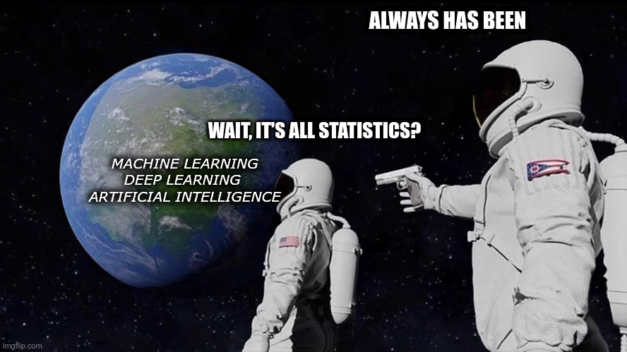

## Model Evaluation

There are many more classification approaches than data scientists, so choosing the best one for your application can be daunting. Thankfully, all of them output predicted classes for each data point. We can use this similarity to define objective performance criteria based on how often the predicted class matches the underlying truth.

I get in trouble with the data science police if I don't include something about confusion matrices:

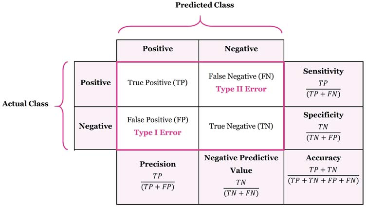

- **Precision** (Positive Predictive Value) = $\frac{TP}{TP + FP}$

    > _How well it performs when it predicts positive_

- **Recall** (Sensitivity, True Positive Rate) = $\frac{TP}{TP+FN}$

    > _How well it performs among actual positives_

- **Accuracy** = $\frac{(TP+TN)}{(TP+FP+FN+TN)}$

    > _How well it performs among all known classes_

- **F1 score** = $2 \times \frac{Recall \times Precision}{Recall + Precision}$

    > _Balanced score for overall model performance_

- **Specificity** (Selectivity, True Negative Rate) = $\frac{TN}{TN + FP}$

    > _Similar to_ **Recall**, _how well it performs among actual negatives_

- **Miss Rate** (False Negative Rate) = $\frac{FN}{TP + FN}$

    > _Proportion of positives that were incorrectly classified, good measure when missing a positive has a high cost_

### Reference Card: `confusion_matrix`

| Component | Details |
|:---|:---|
| **Function** | `sklearn.metrics.confusion_matrix()` |
| **Purpose** | Compute confusion matrix to evaluate classification accuracy |
| **Key Parameters** | • `y_true`: Ground truth target values<br>• `y_pred`: Estimated targets from classifier<br>• `labels`: List of labels to index the matrix<br>• `normalize`: Normalize over 'true', 'pred', 'all', or None |
| **Returns** | Array where rows are actual, columns are predicted |

### Code Snippet: Confusion Matrix

```python
from sklearn.metrics import confusion_matrix
y_true = [1, 0, 1, 1, 0]  # Actual labels
y_pred = [1, 0, 0, 1, 1]  # Predicted labels
cm = confusion_matrix(y_true, y_pred)
print(cm)
# Output interpretation (for binary case):
# [[TN, FP],
#  [FN, TP]]
```

## Classification Report

The `classification_report` function provides a comprehensive summary of precision, recall, and F1-score for each class in a single call—essential for evaluating multi-class models.

### Reference Card: `classification_report`

| Component | Details |
|:---|:---|
| **Function** | `sklearn.metrics.classification_report()` |
| **Purpose** | Build a text report showing main classification metrics per class |
| **Key Parameters** | • `y_true`: Ground truth target values<br>• `y_pred`: Estimated targets from classifier<br>• `target_names`: Display names for classes<br>• `output_dict`: Return dict instead of string |
| **Returns** | String (or dict) with precision, recall, F1-score, support per class |

### Code Snippet: Classification Report

```python
from sklearn.metrics import classification_report

y_true = [0, 0, 1, 1, 1, 2, 2]
y_pred = [0, 1, 1, 1, 0, 2, 2]

print(classification_report(y_true, y_pred, target_names=['No Disease', 'Mild', 'Severe']))
#               precision    recall  f1-score   support
# 
#   No Disease       0.50      0.50      0.50         2
#         Mild       0.67      0.67      0.67         3
#       Severe       1.00      1.00      1.00         2
# 
#     accuracy                           0.71         7
#    macro avg       0.72      0.72      0.72         7
# weighted avg       0.71      0.71      0.71         7
```

## ROC Curve and AUC

An **ROC curve** (Receiver Operating Characteristic curve) shows how a classifier's performance changes as you vary the threshold for predicting "positive." It plots:

- **True Positive Rate (TPR)** (a.k.a. recall): How many actual positives did we catch?
    - **TPR (Recall):** $TPR = \frac{TP}{TP + FN}$
- **False Positive Rate (FPR):** How many actual negatives did we incorrectly call positive?
    - **FPR:** $FPR = \frac{FP}{FP + TN}$

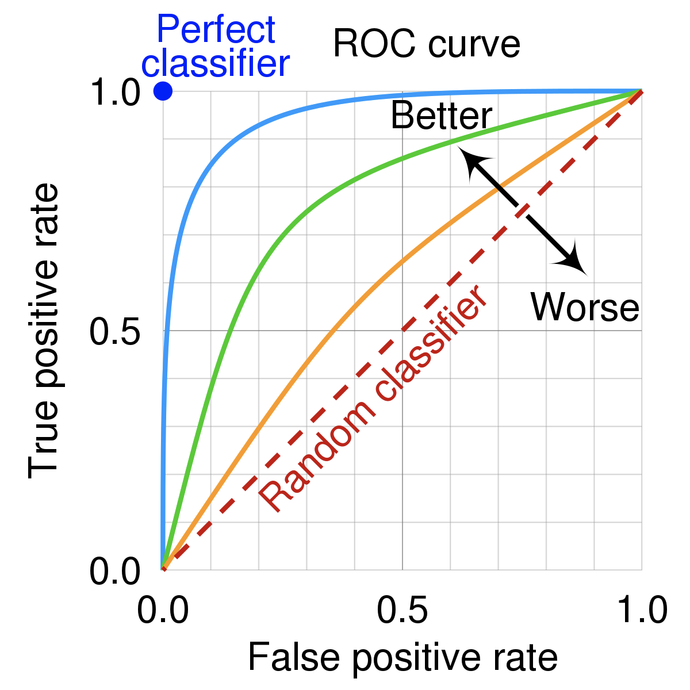

### Reference Card: `roc_curve` and `roc_auc_score`

| Component | Details |
|:---|:---|
| **`roc_curve()`** | Returns FPR, TPR, and thresholds for plotting |
| **`roc_auc_score()`** | Returns the Area Under the ROC Curve |
| **Key Parameters** | • `y_true`: True binary labels<br>• `y_score`: Probability estimates (use `predict_proba()[:, 1]`) |
| **Interpretation** | AUC = 0.5 is random guessing; AUC = 1.0 is perfect |

### Code Snippet: ROC and AUC

```python
from sklearn.metrics import roc_curve, roc_auc_score

y_true = [0, 0, 1, 1]
y_scores = [0.1, 0.4, 0.35, 0.8]  # Model probabilities

fpr, tpr, thresholds = roc_curve(y_true, y_scores)
auc_score = roc_auc_score(y_true, y_scores)
print(f"AUC Score: {auc_score}")  # Output: AUC Score: 0.75
```

AUC is desirable for two reasons:

- AUC is **scale-invariant**. It measures how well predictions are ranked, rather than their absolute values.
- AUC is **classification-threshold-invariant**. It measures the quality of the model's predictions irrespective of what classification threshold is chosen.

However, both these reasons come with caveats:

- **Scale invariance is not always desirable.** Sometimes we need well calibrated probability outputs, and AUC won't tell us about that.
- **Classification-threshold invariance is not always desirable.** In cases where there are wide disparities in the cost of false negatives vs. false positives, AUC isn't the right metric.

- [How to evaluate classification models](https://www.edlitera.com/en/blog/posts/evaluating-classification-models) (edlitera)

# LIVE DEMO!

A hands-on walkthrough of binary classification with logistic regression, using synthetic diabetes data.

See: [demo/01_diabetes_prediction.md](demo/01_diabetes_prediction.md)

# Supervised vs. Unsupervised

There are two(-ish) overarching categories of classification algorithms: **supervised** and **unsupervised**. There are many possible approaches in each category, and some that work well in both (deep learning, for example).

- **Supervised** - uses labeled datasets with known classes for the data points
- **Unsupervised** - uses unlabeled data to uncover organizational patterns
- **Semi-supervised** - some data with labels is used to extract relevant features, while others without can amplify that signal; e.g., medical images (x-ray, CT)

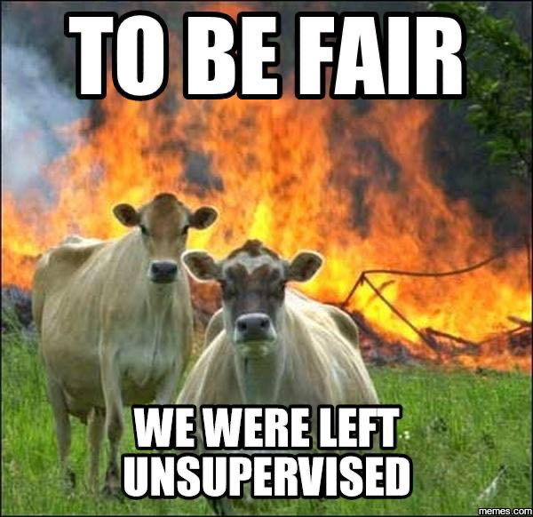

## Supervised Models

To fairly evaluate each model, we must **test** its performance on different data than it was **train**ed on. So we split our dataset into two partitions: **test** and **train**:

- **Train** - the model is built using this data, which includes class labels
- **Test** - the model is tested using this data, withholding class labels

### Reference Card: `train_test_split`

| Component | Details |
|:---|:---|
| **Function** | `sklearn.model_selection.train_test_split()` |
| **Purpose** | Split arrays into random train and test subsets |
| **Key Parameters** | • `test_size`: Proportion for test (default 0.25)<br>• `random_state`: Seed for reproducibility<br>• `stratify`: Preserve class ratios in splits (pass `y` for classification) |
| **Returns** | `X_train, X_test, y_train, y_test` |

> **Tip:** Always use `stratify=y` for classification tasks—especially with imbalanced classes—to ensure both train and test sets have similar class distributions.

### Code Snippet: Train/Test Split

```python
from sklearn.model_selection import train_test_split
import numpy as np

X = np.array([[1, 2], [2, 3], [3, 4], [4, 5], [5, 6], [6, 7]])
y = np.array([0, 1, 0, 1, 0, 1])

X_train, X_test, y_train, y_test = train_test_split(
    X, y, test_size=0.3, random_state=42, stratify=y
)
print("X_train shape:", X_train.shape)
print("X_test shape:", X_test.shape)
```

## Cross-Validation for Model Comparison

A single train/test split can be misleading if the split happens to be particularly easy or hard. **Cross-validation** provides more robust performance estimates by training and testing on multiple different splits of the data.

**K-Fold Cross-Validation:**

1. Split data into *k* equal parts (folds)
2. Train on k-1 folds, test on the remaining fold
3. Repeat k times, each fold serving as test once
4. Average the results for final performance estimate

### Reference Card: `cross_val_score`

| Component | Details |
|:---|:---|
| **Function** | `sklearn.model_selection.cross_val_score()` |
| **Purpose** | Evaluate model with cross-validation, returning scores for each fold |
| **Key Parameters** | • `estimator`: Model to evaluate<br>• `X, y`: Features and labels<br>• `cv`: Number of folds or CV splitter<br>• `scoring`: Metric to use ('accuracy', 'f1', 'roc_auc') |
| **Returns** | Array of scores, one per fold |

### Code Snippet: Cross-Validation

```python
from sklearn.model_selection import cross_val_score, StratifiedKFold
from sklearn.ensemble import RandomForestClassifier
import numpy as np

X = np.random.randn(100, 5)
y = np.random.randint(0, 2, 100)

model = RandomForestClassifier(n_estimators=50, random_state=42)

# Simple 5-fold cross-validation
scores = cross_val_score(model, X, y, cv=5, scoring='f1')
print(f"F1 scores per fold: {scores}")
print(f"Mean F1: {scores.mean():.3f} (+/- {scores.std() * 2:.3f})")
```

### Reference Card: `StratifiedKFold`

| Component | Details |
|:---|:---|
| **Function** | `sklearn.model_selection.StratifiedKFold()` |
| **Purpose** | K-fold iterator that preserves class distribution in each fold |
| **Key Parameters** | • `n_splits`: Number of folds (default 5)<br>• `shuffle`: Shuffle data before splitting<br>• `random_state`: Seed for reproducibility |
| **Use With** | Pass to `cross_val_score(cv=...)` or iterate manually |

### Code Snippet: Comparing Multiple Models

```python
from sklearn.model_selection import cross_val_score, StratifiedKFold
from sklearn.linear_model import LogisticRegression
from sklearn.ensemble import RandomForestClassifier
from xgboost import XGBClassifier

# Define models to compare
models = {
    'Logistic Regression': LogisticRegression(max_iter=1000),
    'Random Forest': RandomForestClassifier(n_estimators=100),
    'XGBoost': XGBClassifier(n_estimators=100, verbosity=0)
}

# Use same CV splitter for fair comparison
cv = StratifiedKFold(n_splits=5, shuffle=True, random_state=42)

# Compare models
for name, model in models.items():
    scores = cross_val_score(model, X, y, cv=cv, scoring='f1')
    print(f"{name}: F1 = {scores.mean():.3f} (+/- {scores.std() * 2:.3f})")
```

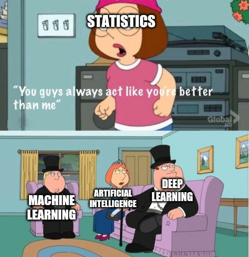

## Quick Supervised Model Review

Let's look at a few tools that you should get a lot of use out of:

- **Logistic Regression** shouldn't be overlooked! It's not as new as some other models, but it's simple and works.
- **Random Forest** is an ensemble model that makes many decision trees using bagging, then takes a simple vote across them to assign a class
- **XGBoost** is another ensemble and arguably the most widely used (and useful) algorithm in tabular ML (it can do regression, classification, and julienne fries!)
- **Deep Learning** uses artificial neural networks with multiple layers to learn complex patterns from data. These models have performed well in a variety of tasks: image recognition, speech recognition, and natural language processing.

    _Deep Learning models may also be used in unsupervised settings_

## Logistic Regression

Logistic regression works similarly to linear regression but uses a sigmoid curve that squeezes our straight line into an S-curve.

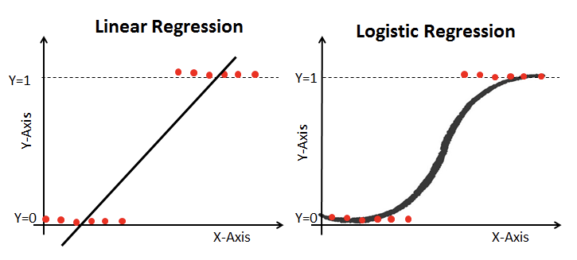

Additionally, it uses **log loss** in place of our usual mean-squared error cost function. This provides a convex curve for approximating variable weights using gradient descent.


### Reference Card: `LogisticRegression`

| Component | Details |
|:---|:---|
| **Function** | `sklearn.linear_model.LogisticRegression()` |
| **Purpose** | Linear model for classification (binary or multinomial) |
| **Key Parameters** | • `penalty`: Regularization ('l2', 'l1', 'elasticnet')<br>• `C`: Inverse regularization strength (smaller = stronger)<br>• `solver`: Optimization algorithm<br>• `max_iter`: Max iterations for convergence |
| **Key Methods** | `.fit()`, `.predict()`, `.predict_proba()` |

- [Logistic regression](https://christophm.github.io/interpretable-ml-book/logistic.html) (interpretable ml)
- [Logistic Regression using Gradient descent](https://www.kaggle.com/general/192255) (kaggle)

## Random Forest

Each of the steps can be tweaked, but the general flow goes:

1. **Bagging** - create _k_ random samples from the data set
2. **Grow trees** - individual decision trees are constructed by choosing the best features and cutpoints to separate the classes
3. **Classify** - instances are run through all trees and assigned a class by majority vote

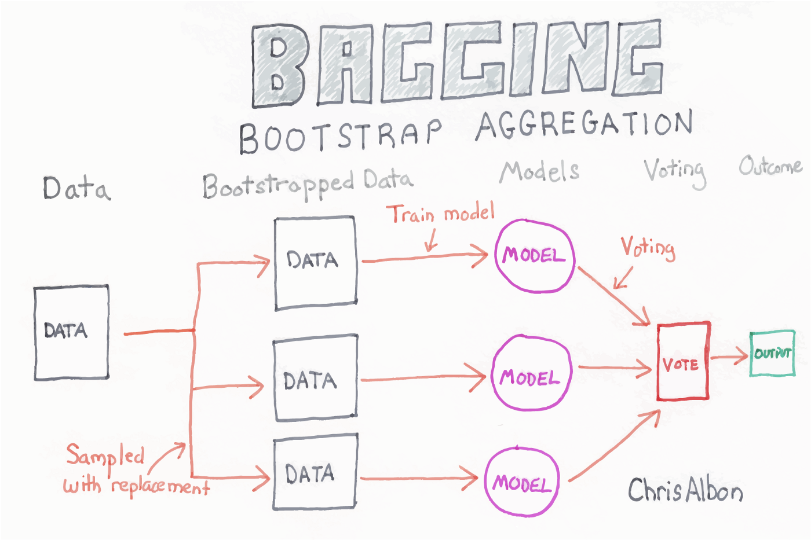

### Reference Card: `RandomForestClassifier`

| Component | Details |
|:---|:---|
| **Function** | `sklearn.ensemble.RandomForestClassifier()` |
| **Purpose** | Ensemble of decision trees for classification |
| **Key Parameters** | • `n_estimators`: Number of trees (default 100)<br>• `max_depth`: Maximum tree depth<br>• `min_samples_split`: Min samples to split a node<br>• `max_features`: Features to consider per split |
| **Attributes** | `.feature_importances_` - importance of each feature |

### Code Snippet: Random Forest

```python
from sklearn.ensemble import RandomForestClassifier

X = [[1, 2], [2, 3], [3, 4], [4, 5]]
y = [0, 1, 0, 1]
model = RandomForestClassifier(n_estimators=10).fit(X, y)
print(model.predict([[2, 2]]))
```

## XGBoost

XGBoost stands for **Extreme Gradient Boosting**. Like other tree algorithms, XGBoost considers each instance with a series of `if` statements, resulting in a leaf with associated class assignment scores. Where XGBoost differs is that it uses gradient boosting to focus on weak-performing areas of the previous tree.

- **Boosting** - sequentially choosing models by minimizing errors from previous models while increasing the influence of high-performing models; i.e., each model tries to improve where the last was wrong
- **Gradient boosting** - a stagewise additive algorithm sequentially adding trees to improve performance measured by a **loss function** until some threshold is met. It's a greedy algorithm prone to overfitting but often proves useful when focused on poor-performing areas

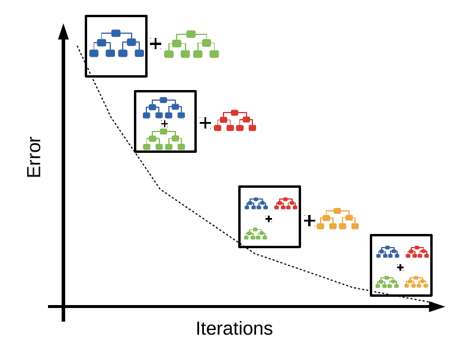

### Reference Card: `XGBClassifier`

| Component | Details |
|:---|:---|
| **Function** | `xgboost.XGBClassifier()` |
| **Purpose** | Gradient boosting implementation for classification |
| **Key Parameters** | • `n_estimators`: Number of boosting rounds<br>• `learning_rate`: Step size shrinkage (eta)<br>• `max_depth`: Maximum tree depth<br>• `subsample`: Training instance subsample ratio |
| **Install** | `pip install xgboost` |

### Code Snippet: XGBoost

```python
import xgboost as xgb

X = [[1, 2], [2, 3], [3, 4], [4, 5]]
y = [0, 1, 0, 1]
model = xgb.XGBClassifier(n_estimators=10).fit(X, y)
print(model.predict([[2, 2]]))
```

- [XGBoost vs Random Forest](https://medium.com/geekculture/xgboost-versus-random-forest-898e42870f30) (geek culture)
- [Interpretable machine learning with XGBoost](https://towardsdatascience.com/interpretable-machine-learning-with-xgboost-9ec80d148d27) (towardsdatascience)

## Deep Learning

**Deep learning** is a subfield of machine learning that uses artificial neural networks with multiple layers to learn complex patterns from data. These models use back-propagation to adjust the weights in each layer during training, allowing them to model very large and complex datasets.

Deep learning models are especially useful for handling large datasets with high dimensionality, and they can be used for both supervised and unsupervised learning tasks. However, they often require a large amount of data and computation power to train effectively.

- **Artificial neural networks** - a computational model inspired by biological neural networks
- **Deep neural networks** - an ANN with more than one hidden layer
- **Convolutional neural networks** - designed for image and video recognition
- **Recurrent neural networks** - designed for sequence data

### Reference Card: Keras Sequential Model

| Component | Details |
|:---|:---|
| **`Sequential()`** | Linear stack of neural network layers |
| **`Dense(units, activation)`** | Fully connected layer |
| **`model.compile()`** | Configure for training (optimizer, loss, metrics) |
| **Common Activations** | 'relu', 'sigmoid', 'softmax', 'tanh' |

### Code Snippet: Simple Neural Network

```python
from tensorflow import keras
from tensorflow.keras import layers

model = keras.Sequential([
    layers.Dense(8, activation='relu', input_shape=(2,)),
    layers.Dense(1, activation='sigmoid')
])
model.compile(optimizer='adam', loss='binary_crossentropy')
# model.fit(X_train, y_train, epochs=10)
```

**Popular frameworks:**

- **Keras** - [https://keras.io/getting_started/](https://keras.io/getting_started/)
- **PyTorch** - [https://pytorch.org/tutorials/](https://pytorch.org/tutorials/)
- **TensorFlow** - [https://www.tensorflow.org/tutorials/quickstart/beginner](https://www.tensorflow.org/tutorials/quickstart/beginner)
- **JAX** - [https://jax.readthedocs.io/en/latest/notebooks/quickstart.html](https://jax.readthedocs.io/en/latest/notebooks/quickstart.html)

## Unsupervised Models (Further Reading)

Unsupervised models are used when you don't have labeled data. While this course focuses on supervised classification, it's worth knowing what's available:

- **Clustering**: grouping points based on similarities/differences; e.g., K-means, hierarchical clustering
- **Association**: reveals relationships between variables; e.g., Apriori, F-P Growth
- **Dimensionality reduction**: reduces the inputs to a smaller size; e.g., PCA, t-SNE, autoencoders

- [Unsupervised Learning: Algorithms and Examples](https://www.altexsoft.com/blog/unsupervised-machine-learning/) (altexsoft)

# LIVE DEMO!!

Feature engineering from sensor data, comparing RandomForest and XGBoost, and interpreting results.

See: [demo/02_basic_classification.md](demo/02_basic_classification.md)

# How Models Fail

Even the best models can fail if the data is messy, the problem is hard, or the world changes. Common failure modes include:

- Bad or inconsistent labels (garbage in, garbage out!)
- Underfitting (model too simple) or overfitting (model too complex)
- Dataset shift (data changes between training and real-world use)
- Hidden confounders (Simpson's paradox)
- Imbalanced or "troublesome" classes

## Labeling

Oh, labeling…

Labeling issues can arise when the data is not labeled correctly or consistently, which can lead to biased or inaccurate models. Examples of labeling issues include:

- **Mislabeling**: Labels that are assigned to data points are incorrect.
- **Ambiguous labeling**: Labels that are assigned to data points are not clear or specific.
- **Inconsistent labeling**: Labels that are assigned to similar data points are not the same

## Fit

A model may fail to fit the data in one of two ways: under-fitting or over-fitting:

- **Under-fitting**: The model fails to capture the differences between the classes. The model may be too simple, lack the necessary features, or the classes may not easily divide based on existing data.
- **Over-fitting**: The model fits the training data too closely, leading to poor generalization. This can be the case when the model is overly complex or the data may have "too many features".

    > **Note**: _With enough variables you can build a perfect predictor for anything (at least in the training set). That doesn't mean the model will perform well in the wild_

## Dataset Shift

Dataset shift occurs when the distribution of the data changes between the training and test sets. Dataset shift can be divided into three types:

1. **Covariate Shift**: A change in the distribution of the independent variables between the training and test sets.
2. **Prior Probability Shift**: A change in the distribution of the target variable between the training and test sets.
3. **Concept Shift**: A change in the relationship between the independent and target variables between the training and test sets.

See: [https://d2l.ai/chapter_linear-classification/environment-and-distribution-shift.html](https://d2l.ai/chapter_linear-classification/environment-and-distribution-shift.html)

## Simpson's Paradox

**Simpson's paradox** occurs when a trend appears in several different groups of data, but disappears or reverses when these groups are combined. It is a common problem in statistics and machine learning that can occur when there are confounding variables that affect the relationship between the independent and dependent variables.

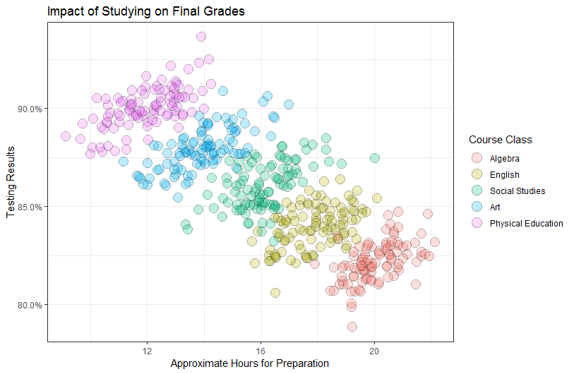

## Troublesome Classes

Certain classes or categories in a dataset may be more difficult to classify accurately than others. This can be due to imbalanced class distribution, noisy data, or other factors. Identifying and addressing troublesome classes is an important step in building effective classification models.

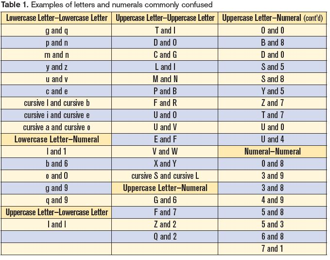

# Feature Engineering

Good features often matter more than the choice of algorithm. Feature engineering combines domain knowledge with data transformation to create inputs that help models learn.

## Domain-Specific Feature Derivations

The best features often come from domain knowledge—knowing what matters in health data:

- Calculating BMI from height and weight
- Deriving heart rate variability from RR intervals
- Creating a "polypharmacy" flag for patients on multiple medications
- Age buckets for risk stratification

## Automated Feature Engineering (Further Reading)

For complex relational datasets, libraries like **featuretools** can automatically generate features using Deep Feature Synthesis. This is especially useful for time series and multi-table data.

- [Featuretools documentation](https://featuretools.alteryx.com/en/stable/)

# Model Interpretation

Understanding **why** a model makes its predictions is crucial in health data science—especially when decisions impact patient care.


## SHAP Values for Feature Importance

**SHAP** (SHapley Additive exPlanations) assigns each feature an importance value for a particular prediction, based on cooperative game theory. SHAP provides more rigorous explanations than simpler methods but takes longer to compute.

### Reference Card: SHAP

| Component | Details |
|:---|:---|
| **`TreeExplainer(model)`** | Explainer optimized for tree-based models |
| **`explainer.shap_values(X)`** | Compute SHAP values for data |
| **`summary_plot()`** | Visualize global feature importance |
| **`dependence_plot()`** | Show feature interactions |
| **Install** | `pip install shap` |

### Code Snippet: SHAP

```python
import shap
import xgboost as xgb
import pandas as pd

X = pd.DataFrame({'age': [50, 60], 'bp': [120, 140]})
y = [0, 1]
model = xgb.XGBClassifier().fit(X, y)

explainer = shap.TreeExplainer(model)
shap_values = explainer.shap_values(X)
shap.summary_plot(shap_values, X, plot_type="bar")
```

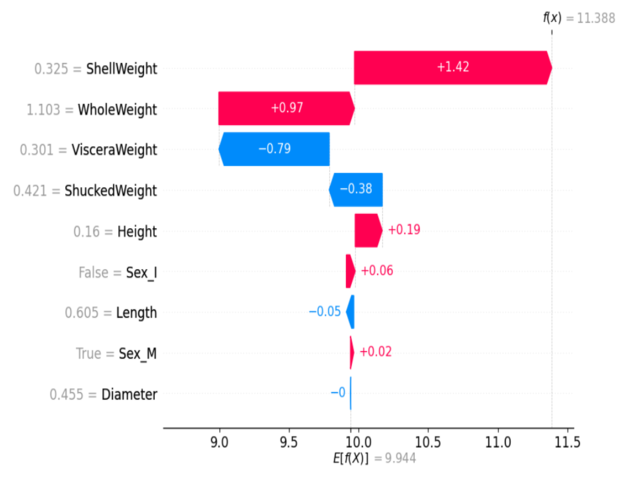

*Example SHAP summary plot: Each dot shows a feature's impact on a prediction. Color indicates feature value (red=high, blue=low).*

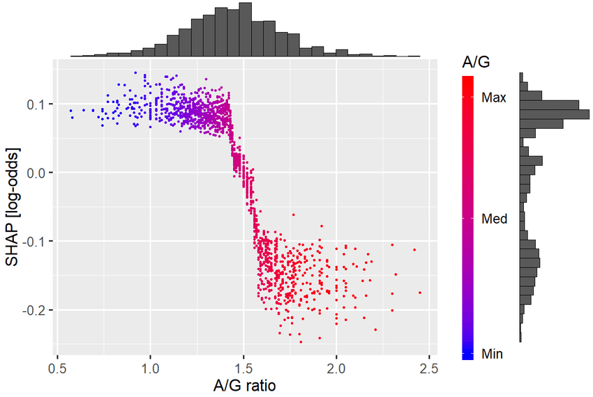

*Example SHAP dependence plot: Shows how the effect of one feature depends on the value of another feature.*

## eli5 for Model Inspection

**eli5** is a Python library that helps demystify machine learning models by showing feature weights and decision paths.

### Reference Card: eli5

| Component | Details |
|:---|:---|
| **`show_weights()`** | Display feature importances |
| **`show_prediction()`** | Explain a single prediction |
| **Key Parameters** | • `estimator`: Trained model<br>• `feature_names`: List of feature names<br>• `top`: Number of top features to show |
| **Install** | `pip install eli5` |

### Code Snippet: eli5

```python
import eli5
from sklearn.ensemble import RandomForestClassifier

X = [[1, 2], [3, 4], [5, 6]]
y = [0, 1, 0]
model = RandomForestClassifier().fit(X, y)

eli5.show_weights(model, feature_names=['feature1', 'feature2'])
```

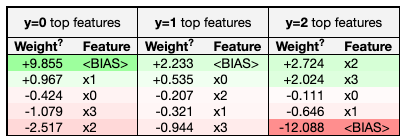

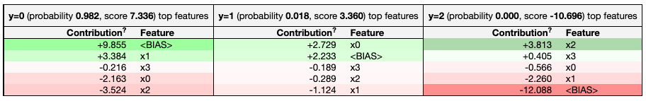

# Practical Data Preparation

Preparing your data is just as important as choosing the right model. Good data prep can make or break your results—especially with real-world health data, which is often messy, imbalanced, and full of categorical variables.

## Feature Scaling with StandardScaler

Many algorithms (especially logistic regression, SVMs, and neural networks) perform better when features are on similar scales. **StandardScaler** transforms features to have mean=0 and standard deviation=1.

### Reference Card: `StandardScaler`

| Component | Details |
|:---|:---|
| **Function** | `sklearn.preprocessing.StandardScaler()` |
| **Purpose** | Standardize features by removing the mean and scaling to unit variance |
| **Key Methods** | • `fit(X)`: Compute mean and std from training data<br>• `transform(X)`: Apply standardization<br>• `fit_transform(X)`: Fit and transform in one step<br>• `inverse_transform(X)`: Reverse the transformation |
| **When to Use** | Logistic regression, SVM, neural networks, K-means, PCA |

### Code Snippet: StandardScaler

```python
from sklearn.preprocessing import StandardScaler
import numpy as np

# Sample data with different scales
X = np.array([[50, 180000], [65, 220000], [35, 150000]])  # Age, Income

scaler = StandardScaler()
X_scaled = scaler.fit_transform(X)
print("Original:\n", X)
print("Scaled:\n", X_scaled)
# Each column now has mean≈0, std≈1
```

## OneHotEncoder for Categorical Variables

Many machine learning models require all input features to be numeric. **One-hot encoding** transforms categorical variables (like "smoker" or "blood type") into a set of binary columns.

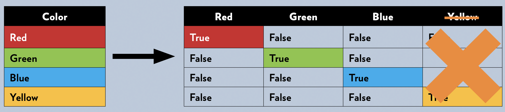

### Reference Card: `OneHotEncoder`

| Component | Details |
|:---|:---|
| **Function** | `sklearn.preprocessing.OneHotEncoder()` |
| **Purpose** | Encode categorical features as binary columns |
| **Key Parameters** | • `categories`: Categories per feature ('auto')<br>• `drop`: Drop category to avoid multicollinearity<br>• `sparse_output`: Return sparse matrix or array<br>• `handle_unknown`: How to handle unknown categories |

### Code Snippet: OneHotEncoder

```python
from sklearn.preprocessing import OneHotEncoder
import pandas as pd

df = pd.DataFrame({'smoker': ['yes', 'no', 'no', 'yes']})
encoder = OneHotEncoder(sparse_output=False, handle_unknown='ignore')
encoded = encoder.fit_transform(df[['smoker']])
print(encoded)
```

## Handling Imbalanced Data with SMOTE

In health data, one class (like "disease present") is often much rarer than the other. **SMOTE** (Synthetic Minority Over-sampling Technique) creates synthetic examples of the minority class to balance the dataset.

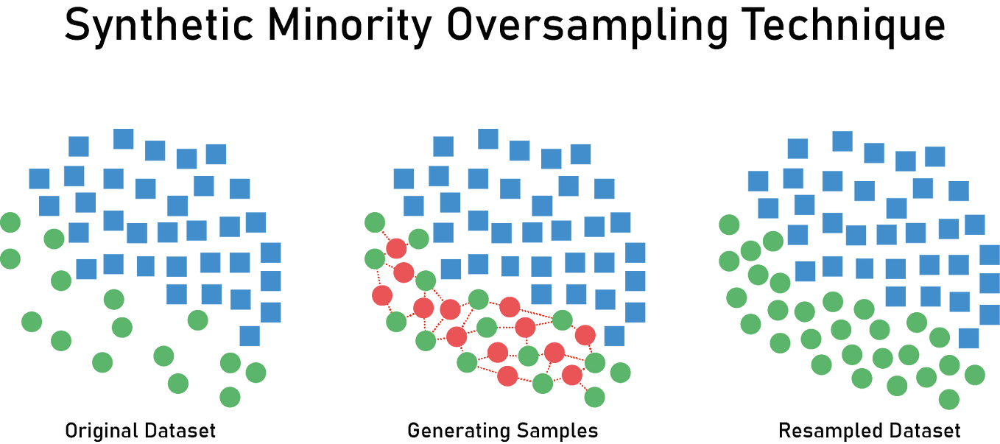

### Reference Card: `SMOTE`

| Component | Details |
|:---|:---|
| **Function** | `imblearn.over_sampling.SMOTE()` |
| **Purpose** | Oversample minority class with synthetic samples |
| **Key Parameters** | • `sampling_strategy`: Target class distribution<br>• `k_neighbors`: Neighbors used for interpolation<br>• `random_state`: For reproducibility |
| **Install** | `pip install imbalanced-learn` |

### Code Snippet: SMOTE

```python
from imblearn.over_sampling import SMOTE
from sklearn.datasets import make_classification
import collections

X, y = make_classification(n_samples=100, weights=[0.9, 0.1], random_state=42)
print("Original:", collections.Counter(y))

smote = SMOTE(random_state=42)
X_resampled, y_resampled = smote.fit_resample(X, y)
print("Resampled:", collections.Counter(y_resampled))
```

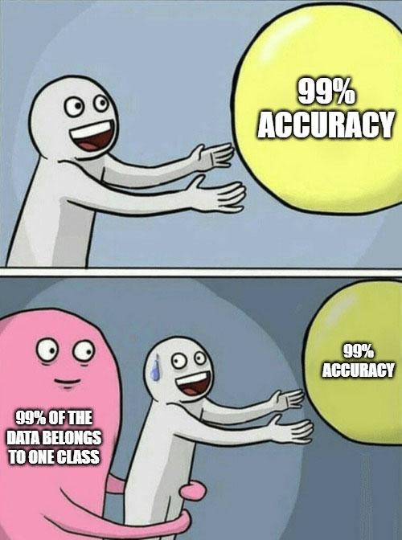

## When and How to Combine Techniques

Often, you'll need to use several data prep techniques together. The order is crucial to prevent **data leakage**—when information from the test set accidentally influences training, leading to overly optimistic performance estimates.

**Recommended Order:**

1. **Split into train/test sets FIRST:** Use `stratify=y` to preserve class ratios
2. **Encode categorical variables:** Fit encoder *only* on training data, then transform both
3. **Scale/normalize features (if needed):** Fit scaler *only* on training data, then transform both
4. **Balance classes (Optional, e.g., SMOTE):** Apply *only* to training set—never test!

> **Why split first?** If you fit your scaler or encoder on the full dataset before splitting, your model "sees" test data statistics during training. This leaks information and makes your model appear better than it really is.

**If Not Balancing:** Use evaluation metrics that account for imbalance:

- **Confusion Matrix:** Performance per class
- **Precision, Recall, F1-score:** Especially for minority class
- **ROC AUC:** Or Precision-Recall AUC for imbalanced data

# LIVE DEMO!!!

Handling imbalanced classes, categorical feature encoding, SMOTE, and model interpretation with eli5.

See: [demo/03_imbalanced_classification.md](demo/03_imbalanced_classification.md)
