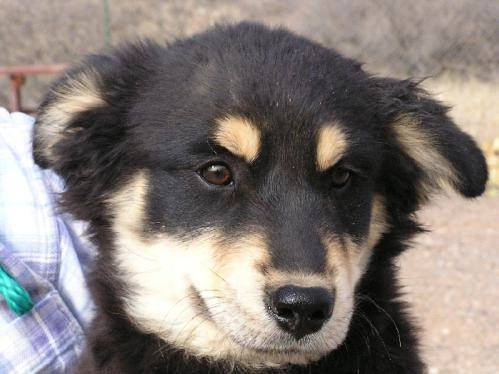

## 🤖 Accelerate Your Models with GPUs

The models you'll build in this course—especially deep learning models—can require significant computational power, which might make them run slowly on your laptop. **Don't panic!** There are free cloud services you can use to leverage GPU-based computing:

- [**Google Colab**](https://colab.research.google.com) – Easiest to use with excellent GitHub integration, but completely public (okay for today, but **NEVER USE COLAB WITH SENSITIVE/PHI DATA**)
- [**Paperspace**](https://www.paperspace.com) – (my weapon of choice) provides customizable private virtual computing with GPUs, but that customization comes at the cost of added complexity. Easy-ish to use, but not as easy as Colab
- **UCSF's Wynton** – File a ticket with IT to get access

### Example speed-up

From training the "Which animal is this" in the "Hands-on practice" section below

```Shell
## 2018 Macbook Pro
Epoch 1/25
63/63 [==============================] - 1177s 18s/step - loss: 0.7522 - accuracy: 0.5904 - val_loss: 0.8942 - val_accuracy: 0.4998

## Google Colab GPU
Epoch 1/25
63/63 [==============================] - 150s 2s/step - loss: 0.7323 - accuracy: 0.6080 - val_loss: 0.9307 - val_accuracy: 0.4998

## Paperspace RTX-5000
Epoch 1/25
63/63 [==============================] - 64s 989ms/step - loss: 0.7348 - accuracy: 0.5988 - val_loss: 0.8696 - val_accuracy: 0.4998
```

<!---
GPU acceleration is a game-changer for deep learning and large models. Beginners often don't realize how much faster training can be with the right hardware. It's important to know your options for cloud-based resources, but always be mindful of data privacy and institutional policies when using external services.
--->

## 🎛️Model tuning (teaser)

Fixing poor-performing models can take many forms

- Additional data or data preparation
    - **FEATURE ENGINEERING!** (worth a whole lecture or even a course)
- Change algorithm or parameters
- Train specialized model for poor-classes

## Process for model training

### Loss & accuracy over epochs

When training machine learning models, it's crucial to understand how loss and accuracy metrics evolve over multiple epochs.

- **epoch:** One full pass through the training data, often broken down into smaller **steps**
- **loss:** Quantifies the difference between the predicted output and the actual target values

    > In essence, it represents the error the model is making, and during training, the goal is to minimize this error:

- **accuracy:** Model evaluation metric as defined above (# correct)/(# total)

    > For certain models, it may be possible to specify different evaluation metrics

Monitoring these metrics can provide insights into the model's learning behavior. By observing these trends, we can identify potential challenges such as overfitting or under-fitting and how we might address those issues. We will visualize this with a graph depicting the training and validation loss/accuracy curves during the "Hands-on practice" section.

### Hyperparameters

Also written as "hyper-parameters", these are the arguments passed into models that may be adjusted. **They are set prior to training and adjusting them can significantly impact the model's behavior.**

Hyperparameters play a critical role in shaping the behavior and performance of machine learning models. Examples include learning rates, regularization strengths, and tree depths. Proper tuning of hyperparameters is essential for optimizing model performance.

#### Examples of hyperparameters

- **Learning Rate (LR)**
    - **Applicable Models:** Neural Networks, Gradient Boosted Trees, Support Vector Machines.
    - **Description:** Controls the step size during optimization. Too high can lead to overshooting, too low can result in slow convergence.
- **Regularization Strength**
    - **Applicable Models:** Linear Regression, Logistic Regression.
    - **Description:** Balances fitting the training data well while avoiding overfitting. Higher values increase regularization.
- **Tree Depth (Max Depth)**
    - **Applicable Models:** Decision Trees, Random Forest, Gradient Boosted Trees.
    - **Description:** Limits the maximum depth of individual trees, preventing overfitting.
- **Number of Estimators (Trees)**
    - **Applicable Models:** Random Forest, Gradient Boosted Trees.
    - **Description:** Determines how many trees are built in an ensemble model.
- **Batch Size**
    - **Applicable Models:** Neural Networks.
    - **Description:** Number of training examples utilized in one iteration. Larger batches may speed up training but require more memory.
- **Dropout Rate**
    - **Applicable Models:** Neural Networks.
    - **Description:** Fraction of input units to drop during training. Prevents overfitting by introducing redundancy.
- **Kernel Size**
    - **Applicable Models:** Convolutional Neural Networks (CNN).
    - **Description:** Specifies the size of the convolutional kernel in CNN layers.
- **C (Cost) in SVM**
    - **Applicable Models:** Support Vector Machines.
    - **Description:** Trade-off between smooth decision boundaries and classifying training points correctly.
- **Alpha**
    - **Applicable Models:** Ridge Regression.
    - **Description:** Regularization term in Ridge Regression to control the influence of high-degree polynomial terms.
- **Min Samples Split**
    - **Applicable Models:** Decision Trees, Random Forest.
    - **Description:** The minimum number of samples required to split an internal node.

### Model showdown process

We want to be rigorous when training multiple models and choosing a winner so, like in any research project, we should pre-define the methodology before beginning.

#### Example model selection flow

- **Load data**
    - **Import:** raw data into a performance layer (e.g., database)
    - **Validate:** import matches data dictionary
    - **Store:** in a persistent format (e.g., parquet)
- **Exploratory data analysis**
    - **Autoprofile:** Utilize autoprofiling (via `ydata-profiling` or similar)
        - **Column value counts:** Identify the distribution of values in each column
        - **Numerical distribution:** Measures of center and spread
    - **Autoprofile, split by Outcome/Class:** Generate separate autoprofiles by segment
    - **Identify problem variables:** Identify high missing values, unusual distributions, or potential data quality issues
- **Transform**
    - **Clean up problem variables:** Address missing values, outliers, or any other issues identified during exploratory analysis
    - **Recode categories:** Recode categorical variables as discussed earlier
    - **Manual feature engineering:** Use subject-matter expertise to combine/transform variables
    - **Automated feature engineering:** Use automated feature engineering tools (e.g., `featuretools` )
    - **Statistical feature engineering:** Utilize self-organizing maps, clustering, principle component analysis, etc. to
- **Model selection**
    - **Reserve validation set:** create a validation set that will be excluded from training/testing
    - **Evaluation criteria:** Define evaluation metrics based on the specifics of the problem being addressed
    - **Candidate models:** Which models should be included in the "showdown" based upon the type of problem and data available
    - **Hyperparameter tuning:** Search for good hyperparameters for applicable models, noting that at this stage we are only looking for decent approximations rather than optimal
    - **Crossfold training:** Assess model performance robustness across randomized train/test subsets. Create a random train/test split for each round and that same split across all models that round
    - **Distribution on unknown class:** Examine how well models generalize to the unknown class
    - **Evaluate & select winner:** Evaluate model performance on the validation set and select the best-performing model
    - **Feature importance:** Analyze feature importance scores from different models
- **Document! Document! Document!**
    - **Process:** What did you do and why
    - **Trade-offs:** Which choices were made, what would be better/worse if you had made others
    - **Technical information:** Anything necessary to reproduce your training
    - **Results**: (_duh_)

### Tips

- **Start with "baby" :** Start with smaller, simpler models to identify issues early and streamline the debugging process.
- **Use validation sets**: A separate validation set allows you to evaluate model performance during training and prevent overfitting
- **Early stopping**: It is possible to halt training when improvements on the validation set plateau, preventing overfitting by stopping when loss increments fall below a threshold.
- **Logging and monitoring**: Log key metrics and monitor them during training, either through log files, print statements, or tools like TensorBoard for real-time visualization
- **Document :all_the_things:**: Clear documentation, including hyper-parameters and model architecture, are the only way to make your models reproducible and to collaboratively troubleshoot.
- **Cross-Validation**: Cross-validation (train/test on random subsets) is important for obtaining a robust estimate of model performance, particularly with limited data.


### Which animal is this?

Adapted from Google Keras code example [Image classification from scratch](https://keras.io/examples/vision/image_classification_from_scratch/). We'll try to classify dogs vs cats vs pandas:




1. Make sure we're in a virtual environment
2. Install and load libraries
3. Download data and split into train, test, and validation
4. Define model
5. Train model
6. Check train/test performance
7. Validate against new data

### Classify 0 vs 1 from `emnist`

#### Setup

**Install/import libraries**

As usual, remember to use a virtual environment!

**Download data**

The `emnist` library will download a copy of the dataset

#### Define helper functions, columns, subsets

It's a good idea to preprocess the data to make it easier to work with. You can create subsets of the data for training, validation, and testing. Also, since the labels in the original dataset are encoded as integers, it may be helpful to create a dictionary that maps the integer labels to their corresponding characters.

#### Pre-built models classifying 0/1

- Logistic regression
- RandomForest
- XGBoost
- Neural network

#### Evaluate/compare model performance

- Confusion matrix: A table that shows the number of true positives, true negatives, false positives, and false negatives for a binary classification problem.
- Accuracy: The proportion of correct predictions over the total number of predictions.
- Precision: The proportion of true positives over the total number of positive predictions.
- Recall: The proportion of true positives over the total number of actual positives.
- F1 score: The harmonic mean of precision and recall, which balances both metrics and gives equal weight to both.

## 🦾Exercise

### 1. Classify all symbols

#### Choose a model

Your choice of model! Choose wisely…

#### Train away

Is do you need to tune any parameters? Is the model expecting data in a different format?

#### Evaluate the model

Evaluate the models on the test set, analyze the confusion matrix to see where the model performs well and where it struggles.

#### Investigate subsets

On which classes does the model perform well? Poorly? Evaluate again, excluding easily confused symbols (such as 'O' and '0').

#### Improve performance

Brainstorm for improving the performance. This could include trying different architectures, adding more layers, changing the loss function, or using data augmentation techniques.


## 🚶‍♀️Self-guided topics

### Awesome list of applications

- [https://github.com/ritchieng/the-incredible-pytorch](https://github.com/ritchieng/the-incredible-pytorch)

### More MNIST

Classifying hand-written digits is the "Hello, World!" of image ML.

- K-means - [https://github.com/sharmaroshan/MNIST-Using-K-means](https://github.com/sharmaroshan/MNIST-Using-K-means)
- MNIST, the Hello World of Deep Learning ([medium](https://medium.com/fenwicks/tutorial-1-mnist-the-hello-world-of-deep-learning-abd252c47709))

### Fashion MNIST

- `torchvision` [provides this dataset](https://pytorch.org/vision/stable/datasets.html) and is a great tool for image classification
- [Fashion MNIST](https://colab.research.google.com/github/tensorflow/docs/blob/master/site/en/tutorials/keras/classification.ipynb) example using Colab
- TensorFlow - [https://jobcollinsdulo.medium.com/part-one-image-classification-with-tensorflow-python-f92f94121ec1](https://jobcollinsdulo.medium.com/part-one-image-classification-with-tensorflow-python-f92f94121ec1)
- PyTorch - [https://medium.com/ml2vec/intro-to-pytorch-with-image-classification-on-a-fashion-clothes-dataset-e589682df0c5](https://medium.com/ml2vec/intro-to-pytorch-with-image-classification-on-a-fashion-clothes-dataset-e589682df0c5)

### Tabular data

- [https://github.com/ThisIsJohnnyLau/dirty_data_project](https://github.com/ThisIsJohnnyLau/dirty_data_project) (6 datasets for cleaning)
- Using Unsupervised Learning to optimise Children's T-shirt Sizing ([towardsdatascience](https://towardsdatascience.com/using-unsupervised-learning-to-optimise-childrens-t-shirt-sizing-d919d3cbc1f6))

### Panoramic dental x-rays

Example flow:

- [https://github.com/clemkoa/tooth-detection](https://github.com/clemkoa/tooth-detection)
- [https://github.com/Nirzu97/PROJECT-Dental-Disease-Detection](https://github.com/Nirzu97/PROJECT-Dental-Disease-Detection)
- X-ray imaging available at the [Tufts Dental Database](http://tdd.ece.tufts.edu)

### Data cleaning for images

- Introduction to Image Pre-processing | What is Image Pre-processing? ([Great Learning](https://www.mygreatlearning.com/blog/introduction-to-image-pre-processing/))
- [https://github.com/Nirzu97/PROJECT-Dental-Disease-Detection](https://github.com/Nirzu97/PROJECT-Dental-Disease-Detection) (see pptx for a good slide on this)

### Publications on X-ray classification

- Supervised and unsupervised language modelling in Chest X-Ray ([PLOS ONE](https://journals.plos.org/plosone/article?id=10.1371/journal.pone.0229963))
- Unsupervised Clustering of COVID-19 Chest X-Ray Images with a Self-Organizing Feature Map ([IEEE Xplore](https://ieeexplore.ieee.org/document/9184493))
- A benchmark for comparison of dental radiography analysis algorithms ([ScienceDirect](https://www.sciencedirect.com/science/article/pii/S1361841516000190))
