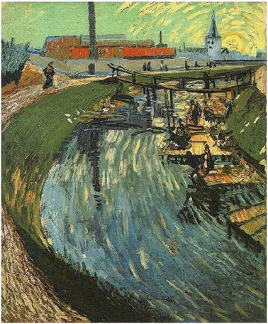
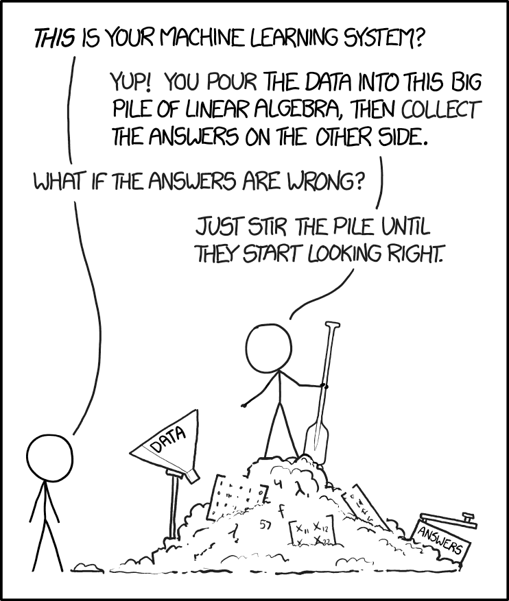
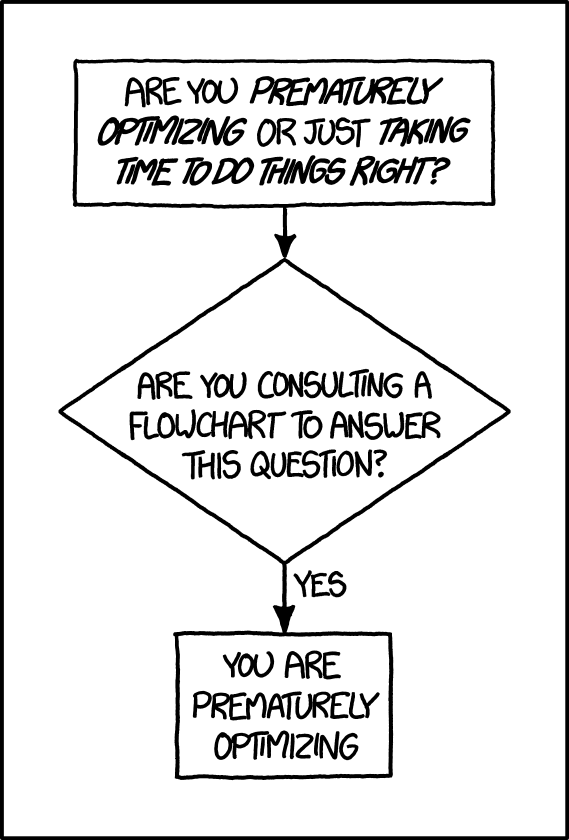
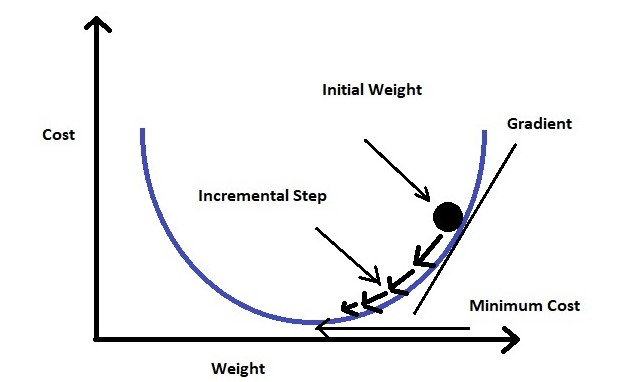
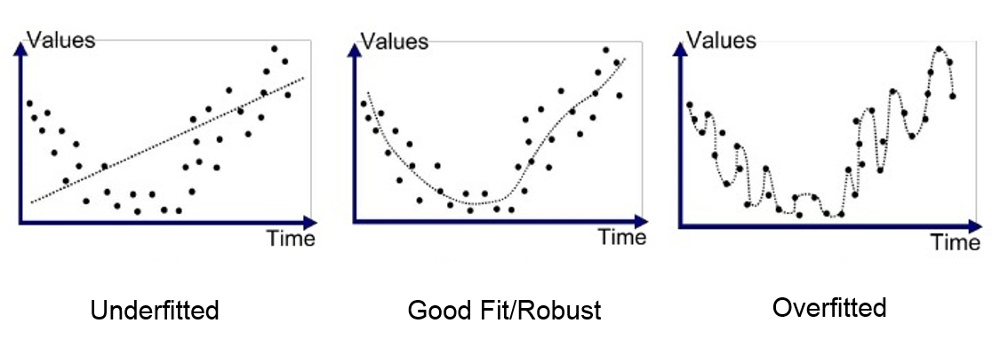
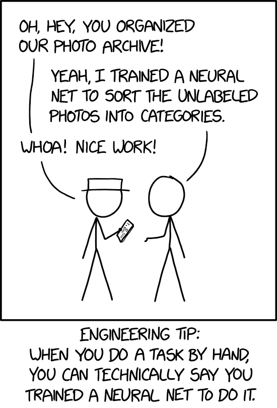
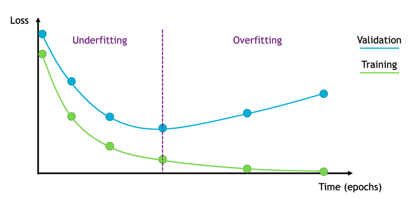

Neural Networks: If I Only Had a Brain

- hw06 #FIXME


# Neural Networks Overview

Neural networks are computing systems loosely inspired by biological brains. They learn patterns from data by adjusting internal parameters — no explicit programming required. This section covers the biological analogy, how artificial neurons work, and why neural networks are so powerful.

## Biological Inspiration


A **neuron** has:

- Branching input (dendrites)
- Branching output (the axon)

Information flows from dendrites to axon via the cell body. Axon connects to dendrites via synapses:

- Synapses vary in strength
- Synapses may be excitatory or inhibitory

### Pigeons as Art Experts (Watanabe et al. 1995)

Experiment:

- Pigeon in Skinner box
- Present paintings of two different artists (e.g. Chagall / Van Gogh)
- Reward for pecking when presented a particular artist (e.g. Van Gogh)





Pigeons discriminated between Van Gogh and Chagall with 95% accuracy on training images and 85% on previously unseen paintings.

Pigeons do not simply memorize the pictures!

- They extract and recognize patterns (the "style")
- They generalize from training data to make predictions

This is what neural networks (biological and artificial) are good at.

### The Tank Detector Parable

In the 1980s, the Pentagon allegedly trained a neural network to detect tanks in photos. They split their photos into training and test sets, and the network learned to identify every test photo correctly.


Then they tested on *new* photos. **The results were completely random.**

After investigation, they discovered: all tank photos were taken on sunny days, while tree-only photos were taken on cloudy days. The military was the proud owner of a computer that could tell you if it was sunny.

> **Note:** This story is [likely apocryphal](https://www.gwern.net/Tanks), but it's a perfect illustration of **data bias** — and why representative, diverse training data matters more than a clever model.

## Artificial Neural Networks

Neural networks draw inspiration from biological neural networks. The mapping is loose but useful:

| Biological | Artificial | Role |
|:---|:---|:---|
| **Dendrites** | Inputs ($x_i$) | Receive incoming signals |
| **Synaptic strength** | Weights ($w_i$) | Control how much each input matters |
| **Cell body** | Summation + activation | Combine inputs and decide whether to "fire" |
| **Axon** | Output ($y$) | Pass the result to the next layer |

A single artificial neuron takes multiple inputs, multiplies each by a weight, sums them up, and passes the result through an activation function:


Mathematically, this is a weighted sum plus bias, passed through a non-linear function $f$:


Stack these neurons into layers — input, hidden, output — and you get a neural network:


Each neuron:

1. Receives inputs ($x_1, x_2, ..., x_n$), each multiplied by a **weight** ($w_1, w_2, ..., w_n$)
2. Sums the weighted inputs plus a **bias** ($b$)
3. Passes the result through an **activation function** ($f$)
4. Produces output: $y = f(\sum w_i x_i + b)$

### Reference Card: Artificial Neuron

| Component | Details |
|:---|:---|
| **Inputs** | Feature values ($x_1, x_2, ..., x_n$) from data or previous layer |
| **Weights** | Learned parameters ($w_i$) controlling each input's influence |
| **Bias** | Offset term ($b$) allowing the neuron to shift its activation |
| **Activation** | Non-linear function applied to the weighted sum (e.g., ReLU, sigmoid) |
| **Output** | $y = f(\sum w_i x_i + b)$ — fed to the next layer or used as prediction |

### Network Structure

Neurons are organized into **layers**:

- **Input layer** — receives the raw features (one neuron per feature)
- **Hidden layers** — intermediate layers where the network learns patterns (not directly visible to us — hence "hidden")
- **Output layer** — produces the final prediction (one neuron per class, or one for regression)

A **feedforward network** passes data in one direction: input → hidden layers → output. No loops.

An **epoch** is one complete pass through the entire training dataset. Training typically runs for many epochs, with the model improving each time.

## Universal Approximation Theorem

One of the most profound aspects of neural networks: a feedforward network with a single hidden layer can approximate any continuous function, given sufficient neurons and appropriate activation functions.


In practice, this means a sufficiently large network can learn to map any input to any output — classifying images, predicting patient outcomes, or translating languages. Here's the intuition: given enough neurons, the network can approximate the decision boundary between "cat" and "dog" (or any other categories) to arbitrary precision.


Deeper networks with fewer neurons per layer tend to generalize better than very wide, shallow networks.

# LIVE DEMO!

# Activation Functions

Remember the biological neuron's cell body — it receives inputs from dendrites and "decides" whether to fire. The activation function is the artificial version of that decision. It takes the weighted sum of inputs and transforms it into the neuron's output.

Activation functions introduce **non-linearity** into neural networks. Without them, stacking layers of linear operations just produces another linear operation — no matter how deep the network, it would behave like a single linear model, unable to capture the complex patterns that make neural networks powerful. You've already seen one activation function in disguise: the sigmoid function that powers logistic regression from last lecture. Neural networks generalize this idea — every neuron gets its own activation function.

Each activation function has trade-offs. The right choice depends on where in the network the function is used (hidden layer vs. output layer) and what kind of prediction you're making.

> **Why this matters for deep networks:** Some activation functions (like sigmoid) squash their output into a narrow range. When you stack many layers, these small values get multiplied together and shrink toward zero — meaning early layers barely get updated during training. This is called the **vanishing gradient** problem (more on gradients in the Backpropagation section below). ReLU largely avoids this issue, which is why it's the default choice for hidden layers.

### Reference Card: Activation Functions

| Function | Formula | Range | Pros | Cons | Use Cases |
|:---|:---|:---|:---|:---|:---|
| **ReLU** | $\max(0, x)$ | $[0, \infty)$ | Fast, mitigates vanishing gradients | Dying ReLU problem | Hidden layers (default) |
| **Sigmoid** | $\frac{1}{1 + e^{-x}}$ | $(0, 1)$ | Outputs probability | Vanishing gradients, not zero-centered | Binary output layer |
| **Tanh** | $\frac{e^x - e^{-x}}{e^x + e^{-x}}$ | $(-1, 1)$ | Zero-centered | Vanishing gradients | Hidden layers (RNNs) |
| **Leaky ReLU** | $\max(0.01x, x)$ | $(-\infty, \infty)$ | No dying neurons | Small negative gradient | When dying ReLU is a concern |
| **Softmax** | $\frac{e^{x_i}}{\sum e^{x_j}}$ | $(0, 1)$ | Multi-class probabilities | Computationally expensive | Multi-class output layer |

## Introducing: ReLU

The **Rectified Linear Unit (ReLU)** is the default activation function for hidden layers in modern deep learning. It's popular because it's dead simple: pass positive values through unchanged, zero everything else.

### Reference Card: ReLU

| Component | Details |
|:---|:---|
| **Function** | $f(x) = \max(0, x)$ |
| **Purpose** | Introduces non-linearity by zeroing negative values |
| **Gradient** | 1 for $x > 0$, 0 for $x < 0$ (undefined at 0, typically set to 0) |
| **Strengths** | Computationally efficient, mitigates vanishing gradient, sparse activation |
| **Dying ReLU** | Neurons stuck at zero output if weights push all inputs negative — use Leaky ReLU or careful weight initialization to mitigate |


### Code Snippet: ReLU

```python
import numpy as np

def relu(x):
    return np.maximum(0, x)

x = np.array([-2, -1, 0, 1, 2])
print(relu(x))  # [0 0 0 1 2]
```



# How Neural Networks Learn

In the last lecture, we trained classifiers — logistic regression, random forests, XGBoost — with a single call to `.fit()` and evaluated them with train/test splits, cross-validation, and metrics like precision, recall, and AUC. Neural networks follow the same high-level pattern — split your data, fit on training, evaluate on validation — and the same evaluation metrics apply. But the *training process itself* is more involved.

Instead of a closed-form solution, neural networks learn iteratively: make a prediction, measure the error, adjust weights, repeat. Three concepts work together: a **cost function** measures error, **backpropagation** distributes that error to each weight, and **gradient descent** updates weights to reduce error.

> **Remember from last lecture:** Always split your data before training. Fit preprocessors (like `StandardScaler`) on training data only to prevent data leakage. Use `stratify=y` when splitting classification datasets.

## Cost Functions

The cost function (or loss function) quantifies how wrong the model's predictions are. Training minimizes this value.

Consider a concrete example: your model predicts a 30% chance of disease for a patient who actually has the disease. How bad is that mistake? What about predicting 90% for a healthy patient? The cost function answers these questions with a single number — and different cost functions answer them differently. Cross-entropy penalizes confident wrong answers harshly, while MSE treats all errors more uniformly.

The choice of loss function depends on your task — just like choosing between accuracy, precision, and recall in the last lecture, different loss functions emphasize different kinds of errors.

### Reference Card: Cost Functions

| Function | Formula | Best For | Notes |
|:---|:---|:---|:---|
| **MSE** | $\frac{1}{n}\sum(y - \hat{y})^2$ | Regression | Penalizes large errors heavily |
| **Cross-Entropy** | $-\sum y \log(\hat{y})$ | Multi-class classification | Works with softmax output |
| **Binary Cross-Entropy** | $-[y\log(\hat{y}) + (1-y)\log(1-\hat{y})]$ | Binary classification | Works with sigmoid output |
| **Huber Loss** | MSE when small, MAE when large | Robust regression | Less sensitive to outliers than MSE |

## Backpropagation

**Backpropagation** is the algorithm that makes neural network training possible. A neural network might have thousands or millions of weights — backpropagation efficiently computes how much each one contributed to the overall error, then distributes that error backward through the network.

You don't need to implement this yourself (Keras handles it inside `model.fit()`), but understanding the idea helps you diagnose training problems.


The process:

1. **Forward pass** — input flows through the network, producing a prediction
2. **Compute loss** — compare prediction to true label using the cost function
3. **Backward pass** — compute the gradient of the loss with respect to each weight using the **chain rule** of calculus
4. **Update weights** — adjust each weight proportionally to its gradient

### Reference Card: Backpropagation

| Component | Details |
|:---|:---|
| **Purpose** | Compute gradients of the loss with respect to every weight in the network |
| **Mechanism** | Apply the chain rule layer-by-layer, from output back to input |
| **Forward Pass** | Compute and cache activations at each layer |
| **Backward Pass** | Propagate error gradients from output to input layers |
| **Key Insight** | Each weight's gradient tells us how much changing that weight would change the loss |
| **In Keras** | Handled automatically by `model.fit()` — no manual implementation needed |



## Gradient Descent

**Gradient descent** is the optimization algorithm that uses the gradients from backpropagation to update weights. Think of it as navigating a hilly landscape in fog — you can only feel the slope under your feet and step downhill. The "landscape" is the loss surface — a map of how the cost function changes as you adjust the network's weights. The lowest point on that surface is the set of weights that makes your model's predictions as close to the truth as possible.

 #FIXME

The **learning rate** ($\alpha$) controls step size:

- Too large: overshoot the minimum, training diverges
- Too small: training is painfully slow, may get stuck in local minima
- Just right: converges efficiently to a good solution

### Reference Card: Gradient Descent Variants

| Variant | Batch Size | Pros | Cons |
|:---|:---|:---|:---|
| **Batch GD** | Entire dataset | Stable convergence | Slow, memory-intensive |
| **Stochastic GD (SGD)** | Single sample | Fast updates, can escape local minima | Noisy, unstable |
| **Mini-batch GD** | Small subset (32–512) | Best of both worlds | Requires batch size tuning |

Modern practice almost always uses **mini-batch gradient descent** — that's what the `batch_size` parameter in `model.fit()` controls. The default is 32, which is a good starting point. Larger batches use more memory but give more stable gradients; smaller batches are noisier but can help escape local minima.

The other key choice is the **optimizer**. **Adam** (the default in most Keras examples) automatically adjusts the learning rate for each parameter, so it works well out of the box. If you need more control, **SGD** with a tuned learning rate is the classic alternative.

### Code Snippet: Optimizers

```python
# Adam — good default
model.compile(optimizer='adam', loss='categorical_crossentropy')

# SGD — when you want explicit control
from keras.optimizers import SGD
model.compile(optimizer=SGD(learning_rate=0.01), loss='categorical_crossentropy')
```

## Regularization

We saw overfitting in the last lecture — a model that memorizes training data (including its noise) rather than learning general patterns. Neural networks are especially prone to this because they have so many parameters. The classic sign: training accuracy keeps climbing while validation accuracy plateaus or drops.

 #FIXME

The tank detector parable from earlier is a perfect example: the network overfit to weather patterns in the training photos instead of learning what tanks actually look like. Regularization techniques constrain the model to generalize better.

### Reference Card: Regularization Techniques

| Technique | How It Works | Keras Usage |
|:---|:---|:---|
| **L1 Regularization** | Adds sum of absolute weights to loss; encourages sparsity | `Dense(64, kernel_regularizer='l1')` |
| **L2 Regularization** | Adds sum of squared weights to loss; penalizes large weights | `Dense(64, kernel_regularizer='l2')` |
| **Dropout** | Randomly zeros a fraction of neurons during training | `Dropout(0.5)` layer |
| **Early Stopping** | Stops training when validation loss stops improving | `EarlyStopping` callback |
| **Data Augmentation** | Applies random transformations to training data (rotation, flip, etc.) | `keras.layers.RandomFlip`, `RandomRotation`, etc. |

### Reference Card: `Dropout`

| Component | Details |
|:---|:---|
| **Function** | `keras.layers.Dropout(rate)` |
| **Purpose** | Randomly set a fraction of input units to zero during training to prevent overfitting |
| **Key Parameters** | `rate`: Fraction of inputs to drop (e.g., 0.5 = 50%) |
| **Behavior** | Active during training only — at inference, all neurons are used (with scaled outputs) |
| **Placement** | After Dense or Conv layers, before the next layer |

## Preparing Data for Neural Networks

Neural networks are sensitive to input scale. Features with large values will dominate training, so normalizing or standardizing inputs is essential — not optional. You already know `StandardScaler` from last lecture — the same tool applies here, along with a few neural-network-specific steps.

### Reference Card: Data Preparation

| Step | What to Do | Why |
|:---|:---|:---|
| **Split first** | Train/validation/test split before any preprocessing | Prevents data leakage — validation data must never influence preprocessing |
| **Normalize** | Scale features to [0, 1] with `MinMaxScaler` | Good for bounded data (e.g., pixel values) |
| **Standardize** | Center to mean=0, std=1 with `StandardScaler` | Good default for most tabular features |
| **Encode labels** | One-hot encode with `to_categorical()` or `LabelEncoder` | Neural networks need numeric targets |
| **Reshape** | Match expected input shape (e.g., `(28, 28, 1)` for images) | Layers expect specific tensor dimensions |

### Code Snippet: Preparing Inputs

```python
from sklearn.preprocessing import StandardScaler
from keras.utils import to_categorical

# Scale features (fit on training data only)
scaler = StandardScaler()
X_train = scaler.fit_transform(X_train)
X_val = scaler.transform(X_val)

# One-hot encode labels for multi-class
y_train = to_categorical(y_train, num_classes=10)
y_val = to_categorical(y_val, num_classes=10)
```

## Keras: The Framework We'll Use

Now that you understand what cost functions, backpropagation, gradient descent, and regularization do, here's how you use them in practice. **Keras** is a high-level deep learning API that gives you the same define-compile-fit workflow you saw with scikit-learn, but with more control over model architecture.

> **Import styles:** You'll see two import patterns in the wild: `from keras import Sequential` (standalone Keras) and `from tensorflow.keras import Sequential` (TensorFlow-bundled). Both work. Standalone `keras` is the modern default (Keras 3+); `tensorflow.keras` is common in older tutorials. Either is fine for this course.

The basic workflow:

1. **Define** the model — stack layers using `Sequential`
2. **Compile** — specify the optimizer, loss function, and metrics
3. **Fit** — train on data with `model.fit()`
4. **Evaluate / Predict** — test on new data

### Code Snippet: Keras Workflow

```python
from keras import Sequential
from keras.layers import Dense

# 1. Define
model = Sequential([
    Dense(64, activation='relu', input_shape=(10,)),
    Dense(3, activation='softmax')
])

# 2. Compile
model.compile(optimizer='adam',
              loss='categorical_crossentropy',
              metrics=['accuracy'])

# 3. Fit
history = model.fit(X_train, y_train,
                    validation_data=(X_val, y_val),
                    epochs=20)

# 4. Predict
predictions = model.predict(X_new)
```

### Reference Card: `model.compile()`

| Component | Details |
|:---|:---|
| **Function** | `model.compile(optimizer, loss, metrics)` |
| **Purpose** | Configure the model for training |
| **Key Parameters** | • `optimizer`: Which optimizer to use — `'adam'` (good default) or `'sgd'` (more control)<br>• `loss`: Loss function — `'categorical_crossentropy'`, `'binary_crossentropy'`, `'mse'`, etc.<br>• `metrics`: List of metrics to track, e.g. `['accuracy']` |

### Reference Card: `model.fit()`

| Component | Details |
|:---|:---|
| **Function** | `model.fit(x, y, ...)` |
| **Purpose** | Train the model for a fixed number of epochs on the given data |
| **Key Parameters** | • `x, y`: Training data and labels<br>• `epochs`: Number of passes through the full dataset<br>• `batch_size`: Samples per gradient update (default 32)<br>• `validation_data`: Tuple `(X_val, y_val)` for monitoring<br>• `callbacks`: List of callback objects (EarlyStopping, etc.) |
| **Returns** | `History` object with loss/metric values per epoch |

### Code Snippet: Choosing a Loss Function

```python
# Binary classification — sigmoid output + binary cross-entropy
model.compile(optimizer='adam', loss='binary_crossentropy', metrics=['accuracy'])

# Multi-class classification — softmax output + categorical cross-entropy
model.compile(optimizer='adam', loss='categorical_crossentropy', metrics=['accuracy'])

# Regression — linear output + MSE
model.compile(optimizer='adam', loss='mse')
```

### Code Snippet: Regularization in Practice

```python
from keras import Sequential
from keras.layers import Dense, Dropout

model = Sequential([
    Dense(128, activation='relu', input_shape=(784,),
          kernel_regularizer='l2'),
    Dropout(0.5),
    Dense(64, activation='relu', kernel_regularizer='l2'),
    Dropout(0.3),
    Dense(10, activation='softmax')
])
```

# LIVE DEMO!!

# Model Architecture

The architecture of a neural network — its layers, connections, and shapes — defines what it can learn. We'll start by building simple networks from Dense layers, then see why specialized layers like Conv2D and LSTM exist.

## Starting Simple: Dense Networks

The simplest neural network is a stack of **Dense** (fully connected) layers. Every neuron in one layer connects to every neuron in the next.

### Reference Card: `Dense`

| Component | Details |
|:---|:---|
| **Function** | `keras.layers.Dense(units, activation=None)` |
| **Purpose** | Fully connected layer — every input connects to every output |
| **Key Parameters** | • `units`: Number of output neurons<br>• `activation`: Activation function (`'relu'`, `'sigmoid'`, `'softmax'`, etc.)<br>• `input_shape`: Required on the first layer only<br>• `kernel_regularizer`: Optional weight regularization (`'l1'`, `'l2'`) |
| **Use Cases** | Hidden layers in any network, output layers for classification/regression |

### Code Snippet: Dense Network for Image Classification

```python
from keras import Sequential
from keras.layers import Dense, Flatten, Dropout

# Classify 28x28 grayscale images using only Dense layers
model = Sequential([
    Flatten(input_shape=(28, 28, 1)),  # Flatten 2D image into 1D vector (784 values)
    Dense(128, activation='relu'),
    Dropout(0.3),
    Dense(64, activation='relu'),
    Dense(10, activation='softmax')
])

model.compile(optimizer='adam', loss='categorical_crossentropy', metrics=['accuracy'])
model.summary()
```

This works, but it has limitations: `Flatten` destroys spatial structure. The model sees 784 independent numbers — it doesn't know which pixels are neighbors. For images, we need layers that understand spatial relationships.

## Common Layer Types

Beyond Dense layers, Keras provides specialized layers for different data types. Here's a quick overview — we'll cover the most important ones (Conv2D and LSTM) in detail below.

| Layer Type | Purpose | When to Use |
|:---|:---|:---|
| **Dense/Linear** | Fully connected layer | Final layers, tabular data |
| **Conv2D** | Spatial feature extraction | Images, medical imaging |
| **LSTM/GRU** | Sequential data with memory | Time series, clinical notes |
| **Embedding** | Map indices to dense vectors | Text, categorical data |
| **BatchNorm** | Normalize layer inputs | Deep networks, unstable training |
| **Dropout** | Prevent overfitting | After Dense or Conv layers |

## Convolutional Neural Networks (CNNs)

Dense layers treat every input pixel independently — `Flatten` turns a 28x28 image into 784 numbers and the network has no idea which pixels are neighbors. A **convolutional layer** instead slides a small filter (kernel) across the image, detecting local patterns — edges, textures, shapes — regardless of where they appear.

Imagine a tiny 3x3 window scanning across a chest X-ray. At each position, the filter multiplies its 9 learned values against the 9 pixels it overlaps, producing a single output number. A filter tuned to detect horizontal edges will "light up" wherever the image has a horizontal edge — whether that's in the top-left corner or bottom-right. This is why CNNs are so powerful for medical imaging: the same tumor edge pattern gets detected no matter where it appears in the scan.


CNNs learn hierarchical features: early layers detect edges and textures, deeper layers combine those into shapes and objects — much like how the visual cortex processes information in stages.

### Building a CNN Step by Step

Start with the same image classification task, but replace the Dense-only approach:

1. **Conv2D** — scan the image with learnable filters to detect local patterns
2. **MaxPooling2D** — shrink the feature maps, keeping the strongest signals
3. **Repeat** — stack more Conv2D + Pooling to learn higher-level features
4. **Flatten + Dense** — convert the feature maps to a classification

### Reference Card: `Conv2D`

| Component | Details |
|:---|:---|
| **Function** | `keras.layers.Conv2D()` |
| **Purpose** | Apply learnable filters to extract spatial features from images |
| **Key Parameters** | • `filters`: Number of output filters<br>• `kernel_size`: Size of convolution window (e.g., 3 or (3,3))<br>• `strides`: Step size for sliding window<br>• `padding`: `'valid'` (no padding) or `'same'` (preserve dimensions)<br>• `activation`: Activation function |
| **Output Shape** | (batch, height, width, filters) |

### Reference Card: `MaxPooling2D`

| Component | Details |
|:---|:---|
| **Function** | `keras.layers.MaxPooling2D()` |
| **Purpose** | Downsample by taking maximum value in each window |
| **Key Parameters** | • `pool_size`: Window size (e.g., (2,2))<br>• `strides`: Step size (defaults to pool_size)<br>• `padding`: `'valid'` or `'same'` |
| **Effect** | Reduces spatial dimensions; helps detect features regardless of exact position |

### Code Snippet: Building a CNN

```python
from keras import Sequential
from keras.layers import Conv2D, MaxPooling2D, Flatten, Dense, Dropout

# Same task as the Dense model, but now using spatial structure
model = Sequential([
    # Layer 1: detect simple patterns (edges, textures)
    Conv2D(32, (3, 3), activation='relu', input_shape=(28, 28, 1)),
    MaxPooling2D((2, 2)),

    # Layer 2: combine simple patterns into complex features
    Conv2D(64, (3, 3), activation='relu'),
    MaxPooling2D((2, 2)),

    # Classification head: same Dense layers as before
    Flatten(),       # Reshape 2D feature maps into a 1D vector for Dense layers
    Dropout(0.5),
    Dense(64, activation='relu'),
    Dense(10, activation='softmax')
])
```

Compare this to the Dense-only model: the first half (Conv2D + Pooling) extracts spatial features that the Dense layers can then classify. This typically improves accuracy on image tasks significantly.



## Recurrent Neural Networks (RNNs)

Every model we've seen so far — from logistic regression in the last lecture to CNNs above — treats each input as independent. A blood pressure reading is just a number; a pixel is just a value. But some data has a meaningful **order** — a patient's vital signs over 24 hours, words in a clinical note, beats in an ECG trace. The order carries information, and ignoring it throws away signal. A blood pressure of 180 means something very different if the previous reading was 120 (sudden spike) versus 175 (stable-high).

RNNs maintain a **hidden state** that carries information from previous time steps, so the network can "remember" what it has seen.


### Building an RNN Step by Step

For sequential data (e.g., predicting the next value in a time series):

1. **SimpleRNN or LSTM** — process the sequence one step at a time, accumulating context
2. **Dense** — map the final hidden state to a prediction

### Reference Card: `SimpleRNN`

| Component | Details |
|:---|:---|
| **Function** | `keras.layers.SimpleRNN()` |
| **Purpose** | Basic RNN layer for sequential data |
| **Key Parameters** | • `units`: Number of output units<br>• `activation`: Activation function (default `'tanh'`)<br>• `return_sequences`: Return full sequence or just last output<br>• `input_shape`: Tuple of (timesteps, features) |
| **Use Cases** | Short sequences, simple patterns, educational demos |

### Code Snippet: Simple RNN

```python
from keras import Sequential
from keras.layers import SimpleRNN, Dense

# Predict next value from a sequence of 10 time steps, each with 3 features
model = Sequential([
    SimpleRNN(32, input_shape=(10, 3)),  # Process sequence, output final hidden state
    Dense(1)                              # Map to prediction
])

model.compile(optimizer='adam', loss='mse')
```

SimpleRNN works for short sequences, but struggles with long ones — gradients vanish over many time steps. **LSTM** adds a gating mechanism to control what information to keep, forget, and output.

### Long Short-Term Memory (LSTM)

**Three gates control information flow:**

1. **Forget Gate:** What information to discard from the cell state
2. **Input Gate:** What new information to store in the cell state
3. **Output Gate:** What information to output from the cell state

### Reference Card: `LSTM`

| Component | Details |
|:---|:---|
| **Function** | `keras.layers.LSTM()` |
| **Purpose** | Process sequential data with long-term memory |
| **Key Parameters** | • `units`: Dimensionality of output space<br>• `return_sequences`: Return full sequence (`True`) or just last output (`False`)<br>• `dropout`: Fraction of units to drop for inputs<br>• `recurrent_dropout`: Fraction to drop for recurrent state |
| **Use Cases** | Time series forecasting, text generation, clinical sequence data |


The internal architecture shows how LSTM's three gates (forget, input, output) and GRU's simpler two-gate design (reset, update) control information flow. GRU is faster to train with fewer parameters, while LSTM is more expressive for complex sequences:


### Code Snippet: LSTM for Time Series

```python
from keras import Sequential
from keras.layers import LSTM, Dense, Dropout

# Classify ECG recordings: 140 time steps, 1 feature (voltage)
model = Sequential([
    LSTM(64, input_shape=(140, 1)),
    Dropout(0.2),
    Dense(32, activation='relu'),
    Dense(5, activation='softmax')  # 5 heartbeat classes
])

model.compile(optimizer='adam', loss='categorical_crossentropy', metrics=['accuracy'])
```

## Specialized Architectures

Beyond CNNs and RNNs, several other architectures address specific problem types. You don't need to build these from scratch — pre-trained versions are available through libraries like Hugging Face — but knowing what exists helps you choose the right tool. We'll cover transformers in the next lecture.

### Reference Card: Specialized Architectures

| Architecture | Key Idea | Health Data Use Cases |
|:---|:---|:---|
| **Transformers** | Attention mechanisms process all inputs in parallel | Clinical NLP, medical report generation, protein structure |
| **GANs** | Two networks compete: one generates, one discriminates | Synthetic medical images, data augmentation for rare conditions |
| **Autoencoders** | Compress input to a bottleneck, then reconstruct | Anomaly detection in lab results, dimensionality reduction |
| **Graph Neural Networks** | Operate on graph-structured data | Molecular property prediction, drug interaction networks |
| **Diffusion Models** | Iteratively remove noise to generate data | Medical image synthesis, super-resolution imaging |

# Training in Practice

Building a model is only half the job — you also need to manage the training process. This section covers the tools Keras provides for monitoring, saving, and controlling training runs.

## Training Callbacks

Neural network training can take minutes to hours. You don't want to babysit it — and you definitely don't want to lose your best model because training ran too long and started overfitting. Callbacks hook into the training loop to save checkpoints, stop early, or log metrics — without modifying your training code.

 #FIXME

### Reference Card: `ModelCheckpoint`

| Component | Details |
|:---|:---|
| **Function** | `keras.callbacks.ModelCheckpoint()` |
| **Purpose** | Save model weights or full model during training |
| **Key Parameters** | • `filepath`: Path to save (can include `{epoch}`, `{val_loss}`)<br>• `save_best_only`: Only save when monitored metric improves<br>• `monitor`: Metric to monitor (e.g., `'val_loss'`)<br>• `save_weights_only`: Save weights only or full model |
| **Use Case** | Keep best model for deployment, resume training after interruption |

### Reference Card: `EarlyStopping`

| Component | Details |
|:---|:---|
| **Function** | `keras.callbacks.EarlyStopping()` |
| **Purpose** | Stop training when monitored metric stops improving |
| **Key Parameters** | • `monitor`: Metric to monitor (e.g., `'val_loss'`)<br>• `patience`: Epochs to wait before stopping<br>• `restore_best_weights`: Restore weights from best epoch<br>• `min_delta`: Minimum change to qualify as improvement |
| **Use Case** | Prevent overfitting, save compute time |

### Code Snippet: Training Callbacks

```python
from keras.callbacks import ModelCheckpoint, EarlyStopping

callbacks = [
    ModelCheckpoint(
        'best_model.keras',
        save_best_only=True,
        monitor='val_accuracy'
    ),
    EarlyStopping(
        monitor='val_loss',
        patience=5,
        restore_best_weights=True
    )
]

history = model.fit(X_train, y_train,
                    validation_data=(X_val, y_val),
                    epochs=100,
                    callbacks=callbacks)
```

## Saving and Loading Models

Training a model can take a long time — you don't want to retrain from scratch every time you need a prediction. Keras makes it easy to save and load models.

### Code Snippet: Saving Models (Keras)

```python
# Save entire model (architecture + weights + optimizer state)
model.save('my_model.keras')

# Load model
from keras.models import load_model
loaded_model = load_model('my_model.keras')

# Save weights only
model.save_weights('model_weights.weights.h5')
model.load_weights('model_weights.weights.h5')
```

### Code Snippet: Saving Models (PyTorch)

```python
import torch

# Save model state dict
torch.save(model.state_dict(), 'model.pth')

# Load (requires model class definition)
model.load_state_dict(torch.load('model.pth'))
```

## Monitoring with TensorBoard

How do you know if training is going well? Watching numbers scroll by isn't great. TensorBoard provides real-time visualization of training metrics — loss curves, accuracy, weight distributions, and model architecture — in a web dashboard.

### Reference Card: `TensorBoard`

| Component | Details |
|:---|:---|
| **Function** | `keras.callbacks.TensorBoard()` |
| **Purpose** | Log training metrics for real-time visualization in a web dashboard |
| **Key Parameters** | • `log_dir`: Directory for log files (e.g., `'./logs'`)<br>• `histogram_freq`: Epoch interval for weight histograms (0 to disable)<br>• `write_graph`: Whether to log the model graph |
| **Launch** | `tensorboard --logdir=./logs` in terminal, then open the URL in a browser |

### Code Snippet: TensorBoard

```python
from keras.callbacks import TensorBoard

tensorboard_cb = TensorBoard(
    log_dir='./logs',
    histogram_freq=1,
    write_graph=True
)

model.fit(X_train, y_train, callbacks=[tensorboard_cb])
```

## Keras vs. PyTorch

So far we've used Keras for everything. But you'll encounter **PyTorch** in many tutorials, papers, and production systems. The core ideas are the same — layers, loss functions, optimizers, backpropagation — but the API style is different.

PyTorch offers a more explicit approach where you define the forward pass directly and write your own training loop. Here's a preview to see how the same model looks in both frameworks.

### Code Snippet: PyTorch Model

```python
import torch
import torch.nn as nn

class SimpleNN(nn.Module):
    def __init__(self):
        super().__init__()
        self.fc1 = nn.Linear(784, 128)
        self.fc2 = nn.Linear(128, 10)

    def forward(self, x):
        x = torch.relu(self.fc1(x))
        return self.fc2(x)

model = SimpleNN()
loss_fn = nn.CrossEntropyLoss()
optimizer = torch.optim.Adam(model.parameters(), lr=1e-3)

# Training loop (explicit — you control every step)
for inputs, targets in train_loader:
    optimizer.zero_grad()
    loss = loss_fn(model(inputs), targets)
    loss.backward()
    optimizer.step()
```

> **Keras vs. PyTorch:** Keras provides high-level APIs (`model.fit()`) that handle the training loop for you. PyTorch gives you explicit control over every step. Both are widely used — Keras for rapid prototyping, PyTorch for research flexibility.

# LIVE DEMO!!!


# Neural Networks in Practice

Neural networks are powerful but not magic. Knowing when to use them — and when a simpler model from last lecture will do — is an important skill. Last week you compared logistic regression, random forests, XGBoost, and a simple neural network on handwritten digits — and the classical models held their own. A random forest on well-engineered features often beats a poorly configured neural network, and it's far easier to explain to a clinician.

### Reference Card: When to Use Neural Networks

| Scenario | Neural Network? | Better Alternative |
|:---|:---|:---|
| **Tabular data, <10k rows** | Probably not | Random Forest, XGBoost |
| **Image classification** | Yes (CNN) | — |
| **Time series / sequential data** | Yes (LSTM/RNN) | ARIMA for simple forecasts |
| **Text / NLP** | Yes (Transformers) | Bag-of-words + LogReg for simple tasks |
| **Structured data, interpretability required** | No | Decision trees, logistic regression |
| **Small labeled dataset** | Transfer learning or no | Classical ML with feature engineering |

## Areas of Active Research

The field moves fast. These directions are especially relevant to health data science:

- **Few-Shot Learning:** In clinical settings, you might have only a handful of labeled examples (e.g., 20 X-rays of a rare condition). Few-shot methods learn useful representations from very limited labeled data, often by leveraging pre-trained models.
- **Foundation Models:** Large models pre-trained on massive datasets (like GPT for text, or Med-PaLM for medical QA) that can be fine-tuned for specific tasks. This is transfer learning at scale — and it's transforming what's possible with small clinical datasets.
- **Explainability (XAI):** Tools like SHAP, LIME, and attention visualization help interpret "black box" models. In healthcare, a model's prediction is only useful if clinicians can understand *why* it made that prediction. We'll see more of this in future lectures.
- **Federated Learning:** Trains a shared model across multiple hospitals without moving patient data. Each site trains locally and shares only model updates — not raw records. This is how you do multi-site studies without centralized data.

## Current Limitations

Neural networks are powerful, but they come with real constraints — especially in clinical settings:

- **Interpretability:** A neural network might achieve 95% accuracy, but "the model says so" isn't an acceptable diagnosis. Clinicians need to understand the reasoning. This is the biggest barrier to clinical adoption.
- **Data Hunger:** High-performing deep learning models typically require thousands to millions of labeled examples. In medicine, labeled data is expensive — it requires expert annotation (radiologist reads, pathology reports).
- **Computational Cost:** Training a large model requires GPUs (sometimes clusters of them) and significant energy and time. Inference is cheaper but still heavier than classical ML.
- **Distribution Shift:** A model trained on data from one hospital may perform poorly at another — different scanners, patient populations, documentation practices. Always validate on data from the deployment environment.

## Design Patterns

When you do reach for a neural network, these established patterns help you get better results:

- **Transfer Learning:** Start from a model pre-trained on a large dataset (like ImageNet for images), then fine-tune on your smaller dataset. Often the best approach when you have limited data — the model already knows about edges, textures, and shapes.
- **Ensemble Methods:** Train multiple models and combine their predictions (averaging or voting). This almost always improves accuracy and makes predictions more robust.
- **Normalization:** Batch normalization, layer normalization, and instance normalization all stabilize training by controlling the scale of values flowing through the network. Use `BatchNormalization()` in Keras when training is unstable.
- **Residual Connections:** In very deep networks (50+ layers), skip connections let gradients flow directly through the network, preventing the vanishing gradient problem. This is how architectures like ResNet can be hundreds of layers deep.

# References

## Documentation

- [Keras Documentation](https://keras.io/)
- [Keras Getting Started](https://keras.io/getting_started/)
- [TensorFlow Tutorials](https://www.tensorflow.org/tutorials)
- [PyTorch Tutorials](https://pytorch.org/tutorials/)

## Books

- _Deep Learning with Python_, Chollet - [Manning](https://www.manning.com/books/deep-learning-with-python-second-edition) — **the** Keras book, practical and accessible
- _Dive into Deep Learning_ - [d2l.ai](https://d2l.ai) — hands-on with code examples
- _Deep Learning_, Goodfellow, Bengio & Courville - [free online](https://www.deeplearningbook.org/) — comprehensive theory reference

## Tutorials & Articles

- [A Visual Introduction to Neural Networks](http://www.r2d3.us/visual-intro-to-machine-learning-part-1/)
- [3Blue1Brown: Neural Networks](https://www.3blue1brown.com/topics/neural-networks) - excellent visual series
- [TensorFlow Playground](https://playground.tensorflow.org/) - interactive neural network visualization
- [Neural Network Zoo](https://www.asimovinstitute.org/neural-network-zoo/) - visual guide to network architectures

## Health Data Science & Deep Learning

- Miotto et al. (2018). Deep learning for healthcare: review, opportunities and challenges. _Briefings in Bioinformatics_
- Esteva et al. (2017). Dermatologist-level classification of skin cancer with deep neural networks. _Nature_
- Rajpurkar et al. (2017). CheXNet: Radiologist-level pneumonia detection on chest X-rays with deep learning
