# Neural Networks: If I Only Had a Brain [pdf](lecture_06.pdf)

## Before we begin - It came from the internet

<details><summary>Click to show</summary>


- Fun example: 20 Questions bot [https://github.com/earthtojake/20q](https://github.com/earthtojake/20q)
- Tips for using the shell (terminal, command line) [ShellIntro.pdf](media/ShellIntro.pdf)
- [Sycophancy and LLM's with Sam Altman](https://www.theverge.com/tech/657409/chat-gpt-sycophantic-responses-gpt-4o-sam-altman)
- We explore large-scale training of generative models on video data. [https://openai.com/research/video-generation-models-as-world-simulators](https://openai.com/research/video-generation-models-as-world-simulators)  
- This blog is intended to be a place to share ideas and results that are too weird, incomplete, or off-topic to turn into an academic paper, but that I think may be important. [https://sohl-dickstein.github.io/2024/02/12/fractal.html](https://sohl-dickstein.github.io/2024/02/12/fractal.html)  

### Recent-ish datasci papers from NEJM

- [**How Censoring Works**](https://evidence.nejm.org/doi/full/10.1056/EVIDstat2300205?emp=marcom&utm_source=nejmglist&utm_medium=email&utm_campaign=evengage23)
- [**Large Language Models**](https://evidence.nejm.org/doi/full/10.1056/EVIDstat2300128?emp=marcom)
- [**The Problem of Multiple Comparisons**](https://evidence.nejm.org/doi/full/10.1056/EVIDstat2200171?emp=marcom&utm_source=nejmglist&utm_medium=email&utm_campaign=evengage23)
- [**Bayesian Way**](https://evidence.nejm.org/doi/full/10.1056/EVIDstat2300090?emp=marcom&utm_source=nejmglist&utm_medium=email&utm_campaign=evengage23)

### Newsletters

- [**Distill**](https://distill.pub/)**:** A journal that offers clear and interactive explanations of machine learning and deep learning concepts.
- [**The Gradient**](https://thegradient.pub/)**:** A publication that focuses on the latest trends and insights in AI and machine learning research.
- **[The Hugging Face Daily Papers](https://huggingface.co/papers)**: A curated list of new research papers from arXiv, each linked to its related models/datasets and Spaces (platform where developers can create, host, and share their ML applications)

### Models

- [https://github.com/microsoft/RespireNet](https://github.com/microsoft/RespireNet) - A CNN-based model designed for COVID-19 severity prediction from lung ultrasound images, showcasing the application of neural networks in healthcare.
- [https://github.com/ritchieng/the-incredible-pytorch](https://github.com/ritchieng/the-incredible-pytorch) - curated list of tutorials, projects, libraries, videos, papers, and books

</details>

## Neural Network References

<details><summary>Click to show</summary>

### Books

#### Recommendations

- _Python for Data Analysis_, McKinney - author's [website](https://wesmckinney.com/book/)
- _Python Data Science Handbook,_ VanderPlas - author's [website](https://jakevdp.github.io/PythonDataScienceHandbook/)
- _Deep Learning_, Goodfellow, Bengio & Courville - [free online](https://www.deeplearningbook.org/)
- _Deep Learning with Python_, Chollet - [Manning](https://www.manning.com/books/deep-learning-with-python-second-edition)
- _Python Machine Learning_, Raschka & Mirjalili - [author's website](https://sebastianraschka.com/books/)
- _Dive into Deep Learning_ - authors' [website](https://d2l.ai)
- _Understanding Deep Learning_ - author's [website](https://udlbook.github.io/udlbook/) (**WARNING:** intense math)

#### [O'Reilly Library Access](https://www.oreilly.com/library-access/) (UCSF institutional access)

- [Hands-on Machine Learning, Géron](https://learning.oreilly.com/library/view/hands-on-machine-learning/9781098125967/) and companion [repository](https://github.com/ageron/handson-ml3)
- [Machine Learning with PyTorch and Scikit-Learn, Raschka](https://learning.oreilly.com/library/view/machine-learning-with/9781801819312/)
- [Deep Learning with PyTorch, Viehmann](https://learning.oreilly.com/library/view/deep-learning-with/9781617295263/)
- [Machine Learning Design Patterns](https://learning.oreilly.com/library/view/machine-learning-design/9781098115777/), Lakshmanan, et al.

### Tutorials

- **[TensorFlow Tutorials](https://www.tensorflow.org/tutorials):** Official tutorials covering various aspects of TensorFlow, from basics to advanced techniques.
- **[PyTorch Tutorials](https://pytorch.org/tutorials/):** Collection of tutorials for learning and implementing neural networks using PyTorch.
- **[Keras Documentation](https://keras.io/):** Comprehensive guides and tutorials for building neural networks with Keras, a high-level neural networks API.
- **[Stanford CS231n: Convolutional Neural Networks for Visual Recognition](http://cs231n.stanford.edu/)**
- **[Coursera: Deep Learning Specialization (Andrew Ng)](https://www.coursera.org/specializations/deep-learning)**

### Health Data Science & Deep Learning Applications

- **Miotto, R., Wang, F., Wang, S., Jiang, X., & Dudley, J. T. (2018).** Deep learning for healthcare: review, opportunities and challenges. _Briefings in Bioinformatics_, 19(6), 1236-1246. [Link](https://academic.oup.com/bib/article/19/6/1236/2562734)
- **Esteva, A., et al. (2017).** Dermatologist-level classification of skin cancer with deep neural networks. _Nature_, 542(7639), 115-118. [Link](https://www.nature.com/articles/nature21056)
- **Rajpurkar, P., et al. (2017).** CheXNet: Radiologist-level pneumonia detection on chest X-rays with deep learning. _arXiv preprint arXiv:1711.05225_. [Link](https://arxiv.org/abs/1711.05225)

### Interpretability & Ethics

- **Doshi-Velez, F., & Kim, B. (2017).** Towards a rigorous science of interpretable machine learning. _arXiv preprint arXiv:1702.08608_. [Link](https://arxiv.org/abs/1702.08608)
- **Caruana, R., et al. (2015).** Intelligible models for healthcare: Predicting pneumonia risk and hospital 30-day readmission. _KDD 2015_. [Link](https://dl.acm.org/doi/10.1145/2783258.2788613)

</details>

### Preparation for next week (LLMs)

- _What are embeddings?,_ Vicki Boykis [available at the author's website](https://vickiboykis.com/what_are_embeddings/)

[LLM Survey](media/LLM_survey.pdf)

## **Neural networks overview**

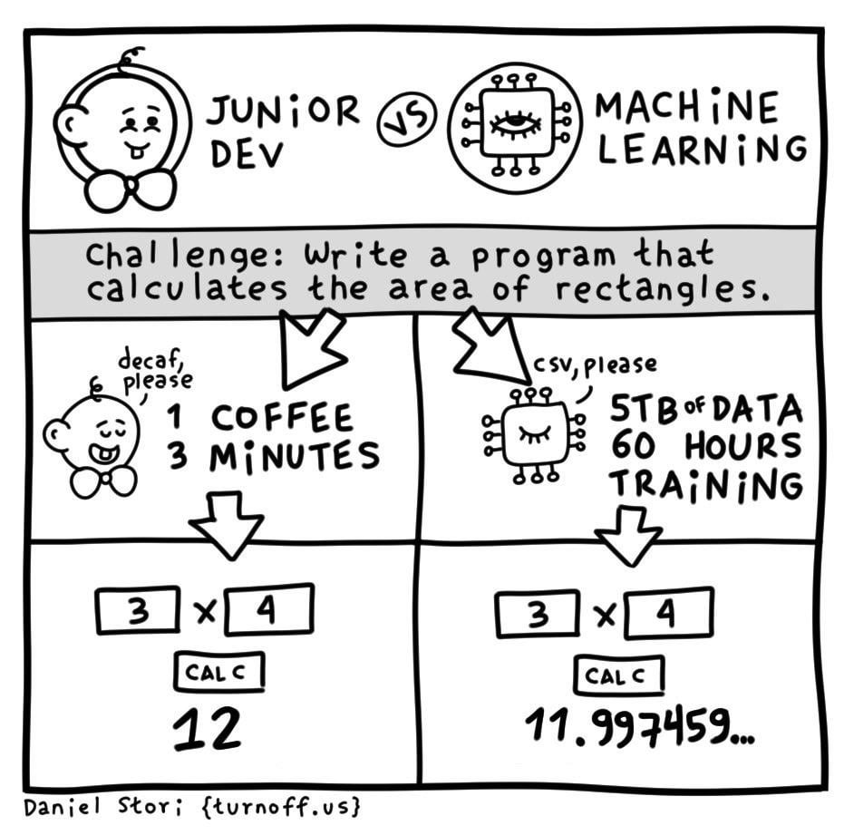

### Biological inspiration
<!---
Biological neural networks are complex systems that inspire artificial neural networks. Let's break down the key components and their functions to understand how they work.
--->

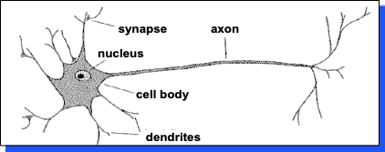

A **neuron** has:
<!---
A biological neuron is the basic building block of the nervous system. It processes and transmits information through electrical and chemical signals.
--->

- Branching input (dendrites)
- Branching output (the axon)

The information circulates from the dendrites to the axon via the cell body

Axon connects to dendrites via synapses

- Synapses vary in strength
- Synapses may be excitatory or inhibitory

#### _Pigeons as art experts_ (Watanabe _et al._ 1995)
<!---
This experiment demonstrates the ability of biological neural networks to learn and generalize complex patterns, such as artistic styles. It shows that with proper training, even non-human biological systems can develop impressive pattern recognition capabilities.
--->

Experiment:

- Pigeon in Skinner box
- Present paintings of two different artists (e.g. Chagall / Van Gogh)
- Reward for pecking when presented a particular artist (e.g. Van Gogh)

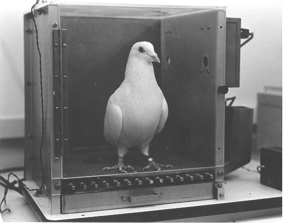


Pigeons were able to discriminate between Van Gogh and Chagall with 95% accuracy (when presented with pictures they had been trained on). Discrimination still 85% successful for previously unseen paintings of the artists

Pigeons do not simply memorize the pictures!

- They can extract and recognize patterns (the 'style')
- They generalize from the already seen to make predictions

This is what neural networks (biological and artificial) are good at (unlike conventional computer)

### Artificial neural networks

Neural networks draw inspiration from the biological neural networks that constitute animal brains. Just as biological neurons transmit signals to each other via synapses, artificial neural networks (ANNs) consist of interconnected nodes or "neurons" that process and pass on information. This design allows ANNs to learn and make decisions, mimicking some level of natural intelligence.

**Artificial neurons:** Non-linear, parameterized function with restricted output range

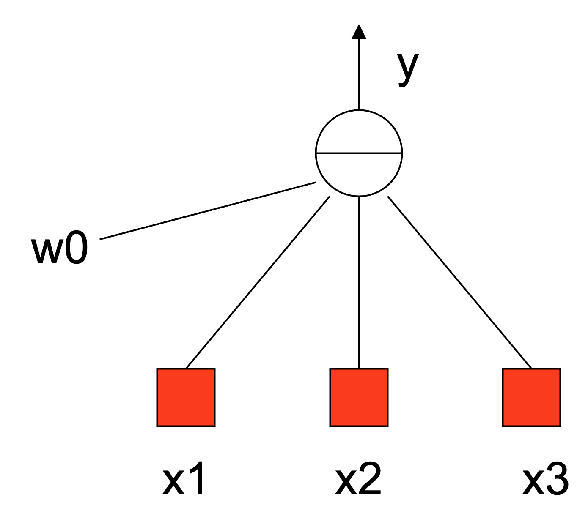

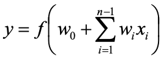

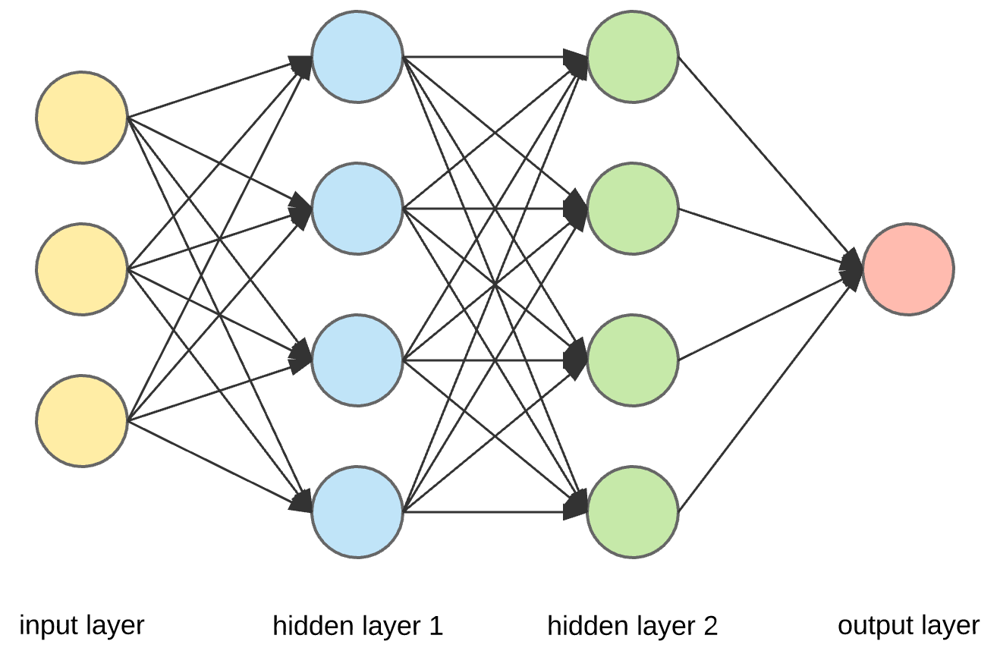

### Famous application: tank or not-a-tank

<!---
This case study illustrates the importance of data quality and diversity in training neural networks. The model's failure to generalize highlights the issue of overfitting to specific characteristics in the training data.
--->

#### Data Bias and Overfitting

The research team took 100 photos of tanks hiding behind trees and 100 photos of trees without tanks. However, all tank photos were taken on sunny days, while tree-only photos were taken on cloudy days. The neural network learned to distinguish between sunny and cloudy conditions rather than the presence or absence of tanks.

**Lesson Learned:** Data bias can lead to unexpected model behavior. Ensuring diverse and representative training data is crucial.

In the 1980s (some say 60's?), the Pentagon wanted to harness computer technology to make their tanks harder to attack.

The preliminary plan was to fit each tank with a digital camera hooked up to a computer. The computer would continually scan the environment outside for possible threats - such as an enemy tank hiding behind a tree - and alert the tank crew to anything suspicious.

Computers are really good at doing repetitive tasks without taking a break, but they are generally bad at interpreting images. The only possible way to solve the problem was to employ a neural network.

The research team went out and took 100 photographs of tanks hiding behind trees, and then took 100 photographs of trees - with no tanks. They took 50 photos from each group and put them in a vault for safe-keeping. They scanned the remaining 100 photos into their mainframe computer.


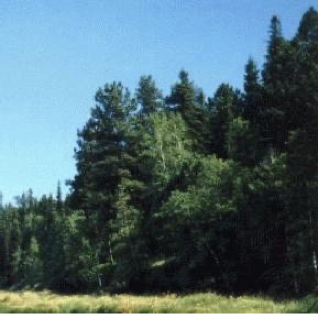

!!! note "Historical Note"
    The tank detector example is apocryphal - there's no evidence it actually happened. However, it serves as a useful parable about data bias and overfitting. For more details, see [this analysis](https://gwern.net/tank).

#### Success

The huge neural network was fed each photo one at a time and asked if there was a tank hiding behind the trees. Of-course at the beginning its answers were completely random since the network didn't know what was going on or what it was supposed to do. But each time it was fed a photo and it generated an answer, the scientists told it if it was right or wrong. If it was wrong it would randomly change the weightings in its network until it gave the correct answer.

But the scientists were worried: _had it actually found a way to recognize if there was a tank in the photo, or had it merely memorized which photos had tanks and which did not?_

This is a big problem with neural networks, after they have trained themselves you have no idea how they arrive at their answers, they just do. The question was did it understand the concept of tanks vs. no tanks, or had it merely memorized the answers? So the scientists took out the photos they had been keeping in the vault and fed them through the computer. The computer had never seen these photos before - this would be the big test. **To their immense relief the neural net correctly identified each photo as either having a tank or not having one.**

#### Testing with new data

The Pentagon was very pleased with this, but a little bit suspicious, they wanted to see this marvel of modern technology for themselves. They took another set of photos (half with tanks and half without) and scanned them into the computer and through the neural network.

**The results were completely random**. For a long time nobody could figure out why. After all nobody understood how the neural had trained itself.

**The military was now the proud owner of a multi-million dollar mainframe computer that could tell you if it was sunny or not!**

### Applications in Machine Learning

#### Demo Break 1: Animal Identifier

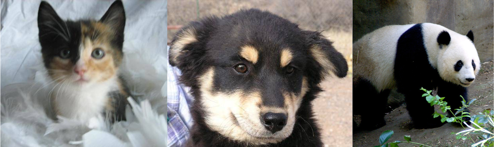

<!---
    - [Which animal is this?](https://github.com/christopherseaman/datasci_223/blob/main/exercises/4-classification/practice_1-which_animal.ipynb): A practical exercise in applying CNNs to a multi-class classification problem.
--->

Neural networks have revolutionized the field of machine learning, providing the backbone for a myriad of applications:

- **Image Recognition:** ANNs, particularly Convolutional Neural Networks (CNNs), have become instrumental in image analysis, powering applications from facial recognition systems to medical imaging diagnostics.
- **Natural Language Processing (NLP):** Through models like Recurrent Neural Networks (RNNs) and more recently, Transformers, neural networks have significantly advanced the ability of computers to understand and generate human language, enabling technologies such as language translation services, chatbots, and voice-activated assistants.
- **Autonomous Driving:** Neural networks are at the heart of autonomous vehicle systems, enabling them to interpret sensor data, make decisions, and learn from vast amounts of driving data to navigate safely.

### Simulating Complex Functions

One of the most profound aspects of neural networks is their ability to approximate virtually any complex function, a property known as the **Universal Approximation Theorem**. This theorem suggests that a feedforward network with a single hidden layer containing a finite number of neurons can approximate continuous functions on compact subsets of $\mathbb{R}^n$, given appropriate activation functions.

The **layered composition** of neural networks, where each layer's output serves as the input to the next, allows these models to learn hierarchies of features. In the context of image recognition, for instance, initial layers might learn to recognize edges and basic textures, while deeper layers can identify more complex structures like shapes or specific objects. This hierarchical learning makes neural networks particularly adept at handling data with complex, hierarchical structures, such as images, sound, and text.

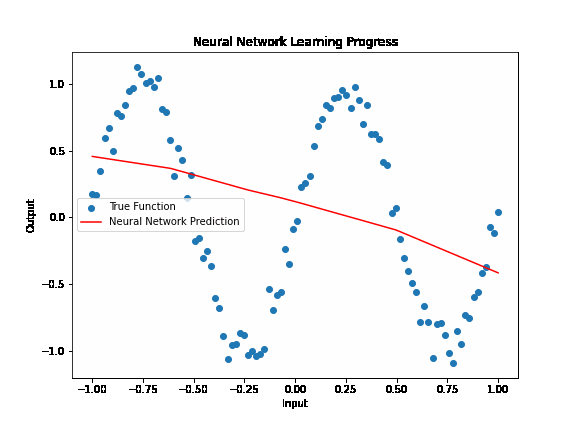

## **Activation functions**

Activation functions play a crucial role in neural networks by introducing non-linearity. Without these functions, a neural network, regardless of its depth, would essentially behave like a linear model, unable to capture the complex patterns found in real-world data. Non-linearity allows neural networks to learn and model complex relationships between input and output data, making them capable of performing tasks like image recognition, language translation, and many others beyond the scope of simple linear models.

In essence, activation functions enable neural networks to solve non-linear problems, expanding their applicability far beyond linear models. Coupled with careful input preparation, neural networks can model complex functions and discover intricate patterns in vast and varied datasets.

### Similarity to Logistic Regression

### Comparison of Activation Functions

| Function | Pros | Cons | Use Cases |
|---------|------|------|-----------|
| ReLU    | Computationally efficient, mitigates vanishing gradients | Dying ReLU problem | Deep networks, hidden layers |
| Sigmoid | Outputs probability between 0 and 1 | Vanishing gradients, not zero-centered | Binary classification output layer |
| Tanh | Zero-centered, stronger gradients than sigmoid | Vanishing gradients | Hidden layers, when zero-centering is beneficial |
| Leaky ReLU | Mitigates dying ReLU problem | Non-zero gradient for negative inputs can lead to increased computational cost | Variants of ReLU, when dying ReLU is a concern |

<!---
This table provides a comparison of common activation functions used in neural networks. Understanding their pros and cons helps in choosing the appropriate function for different layers and tasks.
--->
<!---
While activation functions introduce non-linearity, their concept is somewhat analogous to logistic regression in how they process inputs. Understanding this similarity can help beginners grasp the basics of how activation functions work in neural networks.
--->

The concept of activation functions in neural networks bears a resemblance to logistic regression in several ways:

- **Weighted Sum Inputs:** Both neural networks and logistic regression models compute a weighted sum of the input features. In neural networks, this sum is then passed through an activation function.
- **Activation Output:** The activation function's output can be seen as a decision, similar to the logistic function in logistic regression, which maps the weighted sum (plus bias term) to a probability score indicating the likelihood of a particular class or outcome. In short, the output is always a score in the interval $y \in [0,1] = f(\{x_i\}) = \sum{w_i x_i} + b$
-

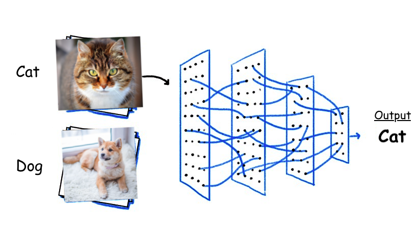

### Introducing: ReLU

**Reference Card: `ReLU`**

- **Function:** $f(x) = \max(0,x)$
- **Purpose:** Introduces non-linearity by replacing negative values with zero, allowing the network to learn complex patterns.
- **Key Characteristics:**
    - Computationally efficient
    - Helps mitigate the vanishing gradient problem
    - Leads to sparse activations

**Minimal Example:**

```python
import numpy as np

## Example input
x = np.array([-1, 0, 1])

## Applying ReLU
relu_output = np.maximum(0, x)
print(relu_output)  # Output: [0 0 1)
```
<!---
This example demonstrates how ReLU works by applying it to a simple array. Beginners should note how ReLU affects different input values and consider its implications for neural network training.
--->

The **Rectified Linear Unit (ReLU)** has become one of the most widely used activation functions in neural networks, especially in deep learning architectures. ReLU is defined as $f(x) = \max(0,x)$, effectively replacing all negative values in the activation map with zero.

**Note:** There are other common activation functions, including sigmoid, tanh, and Leaky ReLU

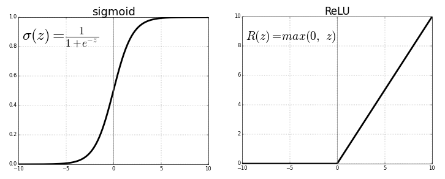

#### Advantages of ReLU

Its popularity stems from its simplicity and efficiency, offering several advantages:

- **Simplicity:** The ReLU function is computationally efficient, allowing neural networks to train faster and perform better, especially in deep learning architectures. Its simple max operation is much less computationally expensive than functions like sigmoid or tanh.
- **Mitigating Vanishing Gradient Problem:** ReLU helps in mitigating the vanishing gradient problem, which is prevalent in deep networks with saturating activation functions. Since the gradient of ReLU for positive inputs is always 1, it ensures that the gradient does not vanish during backpropagation, facilitating deeper network training.
- **Sparse Activation:** In ReLU, only positive values have non-zero outputs, leading to sparse activations within neural networks. This sparsity can lead to more efficient and less overfitting-prone models, as not all neurons are activated simultaneously.
- **Improved Gradient Flow:** For positive input values, the derivative of ReLU is constant (1), which means that the gradient flow during backpropagation is not hindered by the activation function. This allows for more effective learning, especially in deeper layers of a network.

Overall, ReLU's introduction marked a significant advancement in neural network activation functions, contributing to the rapid development of deep learning by enabling the training of much deeper networks than was previously feasible.

## Preparing Inputs

Proper input preparation is crucial for the efficient and effective training of neural networks.

Typically, the initial layer of a neural network assigns individual neurons to specific inputs, which, with the **Universal Approximation Theorem**, provides a degree of resilience to inputs that vary widely in scale. However, preparing inputs through meticulous cleaning, transformation, and feature engineering remains vital. This preparation streamlines the problem the network must solve by consolidating co-linear inputs, harmonizing scales, and merging inputs that might have significant interactions.

!!! important "Note"
    Consider the neurons as a finite resource: data preparation can spare capacity that would otherwise be used to approximate these preprocessing steps  

### Input Shape Importance
<!---
Neural networks require inputs to have consistent dimensions. This section discusses the importance of preprocessing data to meet this requirement.
--->

- **Consistent Dimensions:** Neural networks require a fixed size of input; thus, it's crucial to preprocess the data to ensure consistent dimensions. For images, this might involve cropping or padding to achieve uniform dimensions. For text or sequences, this could mean padding shorter sequences or truncating longer ones to a fixed length.
- **Batch Size:** The choice of batch size can affect both the speed and stability of the training process. Larger batches provide a more accurate estimate of the gradient, but they require more memory and might lead to slower convergence.

### Data cleaning & transformation
<!---
Proper data cleaning and transformation are essential steps in preparing inputs for neural networks. These processes help in improving the quality of the data and making it more suitable for modeling.
--->

### Why Normalize and Standardize?

1. **Improved Convergence:** Neural networks converge faster when the input data is normalized or standardized. This is because the gradients are more stable, leading to more efficient weight updates.
2. **Avoiding Saturation:** Activation functions like sigmoid and tanh can saturate when inputs are too large, leading to vanishing gradients. Normalization and standardization help keep the inputs within a range where these functions are most effective.
3. **Equal Contribution:** When features are on different scales, some features may dominate the learning process. Normalization and standardization ensure that all features contribute equally to the learning process.
4. **Better Performance:** Models trained on normalized or standardized data often perform better because the training process is more stable and efficient.

### Techniques

1. **Normalization:** Scaling input features so they are on a similar scale can prevent certain features from dominating due to their scale. Normalization adjusts the data to fall within a smaller, specified range, such as -1 to 1 or 0 to 1.

   ```python
   from sklearn.preprocessing import MinMaxScaler
   scaler = MinMaxScaler()
   normalized_data = scaler.fit_transform(data)
   ```

2. **Standardization:** This involves transforming the data to have a mean of zero and a standard deviation of one. Standardization ensures that the feature distribution is centered around 0, with a standard deviation that scales the distribution. This is particularly useful for inputs to activation functions that are sensitive to magnitude, such as sigmoid or tanh.

   ```python
   from sklearn.preprocessing import StandardScaler
   scaler = StandardScaler()
   standardized_data = scaler.fit_transform(data)
   ```

### When to Use

- **Normalization:** Use when the data does not follow a Gaussian distribution or when you want to scale the data to a specific range.
- **Standardization:** Use when the data follows a Gaussian distribution or when the algorithm assumes that the data is centered around zero.

### Practical Example

Consider a dataset with features on different scales. Without normalization or standardization, the neural network might struggle to learn effectively.

```python
import numpy as np
from sklearn.preprocessing import StandardScaler

# Example data
data = np.array([[1, 200], [2, 300], [3, 400]])

# Standardizing data
scaler = StandardScaler()
standardized_data = scaler.fit_transform(data)
print(standardized_data)
```

- **Handling Missing Values:** Missing data can significantly impact the performance of neural networks. Techniques such as imputation (filling missing values with the mean, median, or mode), or using a model to predict missing values, can be employed to address this issue.

#### Reference Card: Data Normalization

- **Function:** Scaling input features to a similar scale
- **Purpose:** Prevents feature dominance due to scale differences
- **Common Techniques:** Min-Max Scaling, Standardization

**Minimal Example:**

```python
from sklearn.preprocessing import StandardScaler
import numpy as np

## Example data
data = np.array([[1, 2], [3, 4]])

## Standardizing data
scaler = StandardScaler()
standardized_data = scaler.fit_transform(data)
print(standardized_data)
```
<!---
This example demonstrates how to standardize data using Scikit-learn's StandardScaler. Beginners should understand the importance of scaling data for neural network training.
--->

- **Feature Selection:** Identifying and selecting the most informative features can reduce the dimensionality of the data and improve model performance. Techniques such as correlation analysis, principal component analysis (PCA), or model-based selection can be used to identify the most relevant features.
- **Feature Encoding:** Proper encoding of categorical variables is crucial. Techniques like one-hot encoding or embedding layers for deep learning models can transform categorical variables into a format that neural networks can work with effectively.
- **Feature Construction:** Creating new features through domain knowledge or by combining existing features can provide additional information to the model, potentially improving its performance. For example, creating polynomial features or interaction terms might expose new patterns to the model.
- **Temporal and Spatial Features:** For time series data, deriving features like rolling averages or time lags can capture temporal dynamics. For spatial data, features that capture spatial relationships or clustering can be beneficial.

## **Training Neural Networks**

Training neural networks involves adjusting the weights and biases of the network to minimize the difference between the predicted output and the actual output. This process is guided by several key components and techniques:

### Backpropagation
<!---
Backpropagation is a critical component of neural network training. It allows the network to learn from its mistakes by distributing the error back through the layers.
--->

**Backpropagation** is the cornerstone of neural network training, allowing the adjustment of weights in the network based on the error rate obtained in the previous epoch (i.e., iteration). It effectively distributes the error back through the network layers, providing insight into the responsibility of each weight towards the error.

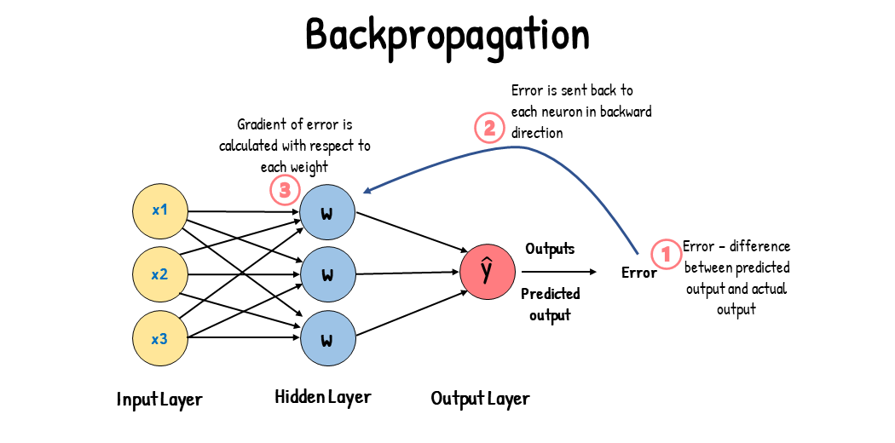

### Gradient descent
<!---
Gradient descent is an optimization algorithm that minimizes the cost function by adjusting the network's weights. It's a fundamental concept in training neural networks.
--->

**Gradient descent** is the optimization algorithm used to minimize the cost function, which represents the difference between the network's predicted output and the actual output. By calculating the gradient of the cost function, gradient descent adjusts the weights in the direction that most reduces the cost.

### Cost Functions
<!---
Cost functions guide the optimization process during neural network training. Choosing the right cost function is crucial for achieving good model performance.
--->

**Reference Card: Cross-Entropy Loss**

- **Function:** Measures the difference between predicted probabilities and actual labels
- **Purpose:** Suitable for classification tasks
- **Strengths:** Ideal for models outputting probabilities
- **Weaknesses:** Can lead to numerical instability if not implemented carefully

**Minimal Example:**

```python
import torch
import torch.nn.functional as F

## Example predictions and actual labels
predictions = torch.tensor([[0.7, 0.3], [0.4, 0.6]])
labels = torch.tensor([0, 1])

## Calculating Cross-Entropy Loss
loss = F.cross_entropy(predictions, labels)
print(loss)
```
<!---
This example demonstrates how to calculate Cross-Entropy Loss using PyTorch. Beginners should understand its application in classification tasks and the importance of proper implementation.
--->

In neural network training, selecting an appropriate cost function is crucial as it guides the optimization process.

Each cost function has its specific use cases and considerations. The choice depends on the particular problem, the type of neural network being trained, and the desired properties of the model (e.g., robustness to outliers, probabilistic output).

Here are some commonly used cost functions along with their strengths and weaknesses:

- **Mean Squared Error (MSE):**
    - **Strengths:** Intuitive, widely used for regression tasks; heavily penalizes large errors due to squaring, leading to robust models.
    - **Weaknesses:** Can be overly sensitive to outliers; assumes a Gaussian distribution of errors.
- **Cross-Entropy Loss:**
    - **Strengths:** Ideal for classification tasks; well-suited for models outputting probabilities (e.g., models with a softmax final layer).
    - **Weaknesses:** Can lead to numerical instability if not implemented with care (e.g., log(0) situations).
- **Binary Cross-Entropy Loss:**
    - **Strengths:** Special case of cross-entropy for binary classification tasks; aligns well with models outputting a probability between 0 and 1.
    - **Weaknesses:** Not suitable for multi-class classification tasks.
- **Hinge Loss:**
    - **Strengths:** Commonly used for Support Vector Machines and "maximum-margin" classification, encouraging examples to be on the correct side of the margin.
    - **Weaknesses:** Not as interpretable as probabilistic losses like cross-entropy; less common in neural networks.
- **Kullback-Leibler Divergence (KL Divergence):**
    - **Strengths:** Measures how one probability distribution diverges from a second, expected distribution; useful in unsupervised learning, reinforcement learning, and models like autoencoders.
    - **Weaknesses:** Asymmetric, which can be a limitation depending on the application; requires careful handling of zero probabilities.
- **Huber Loss:**
    - **Strengths:** Combines the best of MSE and absolute loss by being quadratic for small errors and linear for large errors, reducing sensitivity to outliers compared to MSE.
    - **Weaknesses:** The transition between quadratic and linear (controlled by the δ parameter) can be arbitrary and may need tuning.
- **Log-Cosh Loss:**
    - **Strengths:** Smooth approximation of the MSE that remains numerically stable; behaves like MSE for small errors and like absolute loss for large errors.
    - **Weaknesses:** Not as commonly used or understood as MSE or cross-entropy; may require more computational resources due to the use of hyperbolic cosine function.

#### **Advanced Optimization Techniques**

Beyond basic gradient descent, there are several optimization algorithms like SGD (Stochastic Gradient Descent), Adam (Adaptive Moment Estimation), and RMSprop (Root Mean Square Propagation), each with its own advantages in terms of speed and convergence stability.

### Evaluation Metrics

Evaluation metrics are crucial for assessing the performance of neural networks.

Each metric offers unique insights into model performance, and the choice of metric should align with the specific objectives and constraints of the task at hand. In practice, it's often beneficial to consider multiple metrics to gain a comprehensive understanding of a model's strengths and weaknesses.

- **Accuracy:**
    - **Strengths:** Intuitive and straightforward; measures the proportion of correct predictions.
    - **Weaknesses:** Can be misleading in imbalanced datasets where one class dominates.
- **Precision and Recall:**
    - **Strengths:** Useful in imbalanced datasets; precision focuses on the quality of positive predictions, while recall emphasizes the coverage of actual positive cases.
    - **Weaknesses:** Trade-off between the two (improving one can worsen the other); doesn't provide a single metric for optimization.
- **F1 Score:**
    - **Strengths:** Harmonic mean of precision and recall, providing a single metric that balances the two; useful in imbalanced datasets.
    - **Weaknesses:** May not capture the nuances in cases where one aspect (precision or recall) is more important than the other.
- **Mean Squared Error (MSE) and Root Mean Squared Error (RMSE):**
    - **Strengths:** Directly corresponds to the cost function used in many regression tasks; easy to interpret in terms of the data scale.
    - **Weaknesses:** Highly sensitive to outliers; may not accurately reflect performance in non-Gaussian distributions.
- **Mean Absolute Error (MAE):**
    - **Strengths:** Intuitive, represents average error magnitude without considering direction; less sensitive to outliers than MSE.
    - **Weaknesses:** May not fully capture the impact of large errors as MSE does.
- **Area Under the ROC Curve (AUC-ROC):**
    - **Strengths:** Represents model's ability to discriminate between classes; robust to imbalanced datasets; can be used to choose decision thresholds.
    - **Weaknesses:** May be less informative in highly imbalanced situations or when different costs are associated with different types of errors.
- **Confusion Matrix:**
    - **Strengths:** Provides a detailed breakdown of predictions vs. actual values, allowing for in-depth analysis of type I and type II errors.
    - **Weaknesses:** More complex to interpret at a glance than a single metric; doesn't summarize performance into a single number.
- **Log Loss (for classification):**
    - **Strengths:** Penalizes confidence in wrong predictions; useful for probabilistic outputs.
    - **Weaknesses:** Can be heavily influenced by small probabilities; less intuitive than accuracy or error rate.

### Regularization and Overfitting

Overfitting occurs when a model learns the training data too well, including its noise, resulting in poor performance on unseen data. Techniques to combat overfitting include simplifying the model, using more training data, and employing regularization techniques.

**Regularization methods** like L1 and L2 regularization, dropout, and early stopping add constraints to the network or its training process to prevent overfitting by discouraging overly complex models.

### Interpretability and Explainability

Interpretability and explainability are crucial for understanding how machine learning models, especially neural networks, arrive at their predictions.

**Interpretability** refers to the degree to which a human can understand the cause of a decision, and **explainability** involves the clarity with which a model can describe its functioning. Techniques for enhancing these aspects include feature importance, model simplification, and visualization tools. Ensuring models are interpretable and explainable is crucial, especially in sensitive applications like healthcare and finance, where decisions need to be justified and understood by stakeholders.

When selecting tools for interpretability and explainability, it's essential to consider the model type, the complexity of the dataset, the computational resources available, and the specific needs of the stakeholders who will be using the explanations. Combining multiple approaches can often provide a more comprehensive understanding of the model's behavior.

#### Tools and Libraries for Interpretability and Explainability

- **LIME (Local Interpretable Model-agnostic Explanations):**
    - **Features:** Generates explanations for individual predictions, showing how different features influence the output.
    - **Strengths:** Model-agnostic; can be used with any model type.
    - **Weaknesses:** Local explanations may not provide a complete picture of the model's overall behavior.
- **SHAP (SHapley Additive exPlanations):**
    - **Features:** Uses game theory to explain the output of any model by computing the contribution of each feature to the prediction.
    - **Strengths:** Considers feature interactions; provides both local and global explanations.
    - **Weaknesses:** Can be computationally expensive, especially for complex models and large datasets.
- **Feature Importance:**
    - **Features:** Ranks features based on their importance in the model, often derived from the model itself (e.g., coefficients in linear models, feature importance in tree-based models).
    - **Strengths:** Provides a straightforward, global view of feature relevance.
    - **Weaknesses:** May not capture nonlinear relationships or interactions between features effectively.
- **Partial Dependence Plots (PDPs) and Individual Conditional Expectation (ICE) Plots:**
    - **Features:** PDPs show the average effect of a feature on the prediction, while ICE plots show this effect for individual instances.
    - **Strengths:** Offers insights into the model's behavior over a range of feature values.
    - **Weaknesses:** PDPs can be misleading if features are correlated; ICE plots can become cluttered with many instances.
- **Integrated Gradients:**
    - **Features:** Attribute the prediction of a deep network to its input features, based on gradients.
    - **Strengths:** Provides detailed explanations suitable for complex models like deep neural networks.
    - **Weaknesses:** Interpretation of the results can be challenging, especially with high-dimensional data.
- **Counterfactual Explanations:**
    - **Features:** Explains model decisions by showing how slight changes in input features could lead to different predictions.
    - **Strengths:** Intuitive and actionable insights; user-friendly explanations.
    - **Weaknesses:** Generating relevant and realistic counterfactuals can be complex.
- **Grad-CAM (Gradient-weighted Class Activation Mapping):**
    - **Features:** Uses gradients flowing into the final convolutional layer of CNNs to produce a heatmap highlighting important regions in the input image for predicting the concept.
    - **Strengths:** Offers visual explanations that are easy to interpret.
    - **Weaknesses:** Specific to convolutional neural networks; may not be applicable to other model types.

### Saving Models and Training Checkpoints

<!---
Saving models and training checkpoints is crucial for preserving progress, enabling model reuse, and facilitating transfer learning. This section covers best practices for model persistence.
--->

#### Why Save Models?

- Preserve training progress
- Enable model reuse
- Facilitate transfer learning
- Share models with others

#### Saving in Keras

```python
## Save the entire model
model.save('my_model.keras')

## Save only the weights
model.save_weights('my_model_weights.keras')

## Save checkpoints during training
checkpoint_callback = tf.keras.callbacks.ModelCheckpoint(
    filepath='checkpoints/model.{epoch:02d}.keras',
    save_weights_only=True,
    save_freq='epoch'
)
model.fit(x_train, y_train, callbacks=[checkpoint_callback])
```

#### Saving in PyTorch

```python
## Save the entire model
torch.save(model.state_dict(), 'model.pth')

## Save checkpoints during training
checkpoint = {
    'epoch': epoch,
    'model_state_dict': model.state_dict(),
    'optimizer_state_dict': optimizer.state_dict(),
    'loss': loss,
}
torch.save(checkpoint, 'checkpoint.pth')

## Load checkpoint
checkpoint = torch.load('checkpoint.pth')
model.load_state_dict(checkpoint['model_state_dict'])
optimizer.load_state_dict(checkpoint['optimizer_state_dict'])
epoch = checkpoint['epoch')
```

#### Best Practices: Saving Models

- Save both model architecture and weights
- Use version control for model files
- Document model versions and training parameters
- Save checkpoints at regular intervals
- Consider using cloud storage for large models

### Monitoring the training process with TensorBoard

In our examples we monitor training via text output, but more sophisticated tools exist to visualize the training process. One popular tool is **TensorBoard**, which can be useful when training large models using parallelization across multiple GPUs.

Incorporating TensorBoard into the training process not only aids in model development and tuning but also enhances transparency and understanding of the model's learning dynamics, making it an invaluable tool in the neural network training toolkit.

- **Real-time Monitoring:** TensorBoard provides a user-friendly interface to monitor the training process in real time, allowing for the visualization of metrics like loss and accuracy across epochs, which is crucial for understanding model performance and convergence.
- **Hyperparameter Tuning:** It offers tools for hyperparameter tuning, enabling the comparison of model performance across different sets of hyperparameters, which is essential for optimizing model configurations.
- **Model Architecture Visualization:** TensorBoard can visualize the neural network's architecture, offering insights into the model's structure and helping identify potential areas for improvement or optimization.
- **Gradient and Weight Visualization:** It allows for the inspection of gradients and weights during training, helping to diagnose issues related to learning, such as vanishing or exploding gradients.
- **Embedding Visualization:** TensorBoard provides functionalities to visualize high-dimensional data embeddings, which can be particularly useful for tasks involving complex data representations, such as NLP or image processing.

#### TensorBoard Integration

##### Reference Card: TensorBoard Setup

```python
## Keras
tensorboard_callback = tf.keras.callbacks.TensorBoard(
    log_dir="./logs",
    histogram_freq=1,
    write_graph=True,
    write_images=True
)
model.fit(x_train, y_train, callbacks=[tensorboard_callback])

## PyTorch
from torch.utils.tensorboard import SummaryWriter
writer = SummaryWriter('runs/experiment_1')
for epoch in range(num_epochs):
    # Training loop
    writer.add_scalar('Loss/train', loss.item(), epoch)
    writer.add_scalar('Accuracy/train', accuracy, epoch)
```

#### Key Features

- Real-time monitoring of training metrics
- Visualization of model architecture
- Histogram of weights and biases
- Projector for high-dimensional data visualization
- Profiler for performance analysis

#### Demo Break 2

## **Model Architecture**

The architecture of a neural network is a critical factor that defines its ability to learn and solve complex problems. It encompasses the layout of neurons and layers, how they're interconnected, and the flow of data through the network. This section explores various architectural designs, their unique features, and their suitability for different tasks in machine learning.

### Network Depth & Connectedness

#### Shallow vs. Deep
<!---
Understanding the difference between shallow and deep networks is crucial for designing effective neural network architectures. Shallow networks are suitable for simple problems, while deep networks are better suited for complex tasks.
--->

- **Shallow Networks:** Typically consist of a few layers, including input and output layers, and perhaps one or two hidden layers. Shallow networks are suited for simpler problems where the relationship between the input and output is not overly complex.
- **Deep Networks:** Contain many layers, sometimes hundreds or thousands, enabling them to learn features at multiple levels of abstraction. Deep networks are more suited for complex problems like image recognition, where higher-level features (like shapes) are built from lower-level features (like edges and corners).

#### Depth Challenges

- Deep networks can be more challenging to train due to issues like vanishing and exploding gradients. Advanced techniques like residual connections (ResNets), batch normalization, and advanced optimizers have been developed to address these challenges, allowing for successful training of deep networks.

#### Connectedness: Dense vs. Sparse
<!---
The connectedness of a neural network significantly impacts its performance and efficiency. Fully connected layers are powerful but can be computationally expensive, while sparse connectivity can reduce demands and prevent overfitting.
--->

##### Reference Card: Residual Connections

- **Function:** Allows gradients to flow directly through the network by skipping one or more layers
- **Purpose:** Mitigates vanishing gradient problem, enabling training of very deep networks
- **Key Characteristics:**
    - Improves gradient flow
    - Enables deeper network training

**Minimal Example:**

```python
import torch
import torch.nn as nn

class ResidualBlock(nn.Module):
    def __init__(self):
        super(ResidualBlock, self).__init__()
        self.fc1 = nn.Linear(128, 128)
        self.fc2 = nn.Linear(128, 128)

    def forward(self, x):
        residual = x
        out = torch.relu(self.fc1(x))
        out = self.fc2(out)
        out += residual  # Residual connection
        out = torch.relu(out)
        return out
```
<!---
This example demonstrates a simple residual block using PyTorch. Beginners should understand how residual connections help in training deep networks.
--->

The connectedness of a neural network refers to how neurons within layers are linked to each other and to neurons in adjacent layers. This structure significantly influences the network's capacity to capture patterns and relationships in the data.

- **Fully Connected Layers:** In a fully connected (or dense) layer, every neuron is connected to every neuron in the previous and following layers. This setup is powerful for capturing complex relationships but can be computationally expensive and prone to overfitting, especially in deep networks with a large number of parameters.
- **Sparse Connectivity:** To reduce computational demands and overfitting, some architectures employ sparse connectivity, where neurons are only connected to a subset of neurons in adjacent layers. Convolutional layers in CNNs are an example, where each neuron is connected only to a local region of the input.
- **Skip Connections:** An innovation to improve training in deep networks, skip connections, as used in ResNet architectures, allow the gradient to flow directly through the network by skipping one or more layers. This design helps mitigate the vanishing gradient problem and supports the training of very deep networks.
- **Recurrent Connections:** In RNNs, connections between neurons form loops, creating a 'memory' of previous inputs. This structure is ideal for sequential data, allowing the network to maintain information across time steps, which is crucial for tasks like language modeling and time series prediction.

The connectedness within a neural network's architecture is pivotal in defining its learning capabilities, computational efficiency, and applicability to different tasks. By carefully designing the network's structure, it's possible to balance the model's expressiveness with its generalizability and computational demands.

### Convolution and Recurrence: Architectures for Specific Data Types

By understanding the unique characteristics and strengths of CNNs and RNNs, neural network designers can choose or craft architectures that are best suited to the specific requirements of their machine learning tasks, whether they involve analyzing visual data, decoding language, predicting future events, or any other application that relies on understanding spatial or temporal data.

#### CNN vs. RNN Comparison

| Feature | CNN | RNN |
|---------|-----|-----|
| Use Case | Images, spatial data | Time series, sequential data |
| Key Layer | Convolutional | Recurrent |
| Strength | Local pattern detection | Sequence memory |
| Data Structure | Grid-like (e.g., pixels) | Sequential (e.g., words, time steps) |
| Memory | Limited to receptive field | Can maintain long-term dependencies |
| Parallelization | Highly parallelizable | Sequential processing |
| Common Applications | Image classification, object detection | Language modeling, time series prediction |

#### Convolutional Neural Networks (CNNs)

CNNs are specialized for processing data with a known grid-like structure, exemplified by image data.

- **Convolutional Layers:** The core building blocks of CNNs, these layers apply a convolution operation to the input, passing the result to the next layer. This process allows the network to build a complex hierarchy of features from simple patterns to more abstract concepts, making CNNs highly effective for tasks like image and video recognition, image classification, and more.
- **Pooling Layers:** Often follow convolutional layers and are used to reduce the spatial dimensions (width and height) of the input volume for the next convolutional layer. Pooling helps in reducing the number of parameters and computation in the network, and hence also helps in controlling overfitting.

#### Recurrent Neural Networks (RNNs)

RNNs are designed to handle sequential data, where the order of the data points is significant.

- **Sequence Processing:** Unlike feedforward neural networks, RNNs have loops in them, allowing information to persist. This architecture makes them ideal for tasks where context from previous inputs is crucial, such as in language modeling or time series prediction.

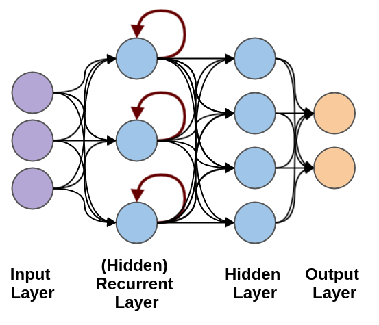

#### Long Short-Term Memory (LSTM)

LSTM is a specialized type of RNN designed to address the vanishing gradient problem and better capture long-term dependencies in sequential data.

<!---
LSTM networks are particularly powerful for healthcare applications because they can:
1. Remember important information over long sequences (e.g., patient history)
2. Forget irrelevant information (e.g., noise in vital signs)
3. Learn complex temporal patterns (e.g., disease progression)
--->

##### LSTM Architecture

The LSTM cell contains three gates that control information flow:

1. **Input Gate:** Controls what new information enters the cell state
   - Determines which values to update
   - Uses sigmoid activation to output values between 0 and 1
   - Example: Deciding which symptoms to remember in a patient's history

2. **Forget Gate:** Controls what information to discard from the cell state
   - Determines which information to throw away
   - Uses sigmoid activation to output values between 0 and 1
   - Example: Forgetting resolved symptoms while keeping active ones

3. **Output Gate:** Controls what information to output from the cell state
   - Determines which parts of the cell state to output
   - Uses sigmoid activation to output values between 0 and 1
   - Example: Deciding which information is relevant for the current prediction

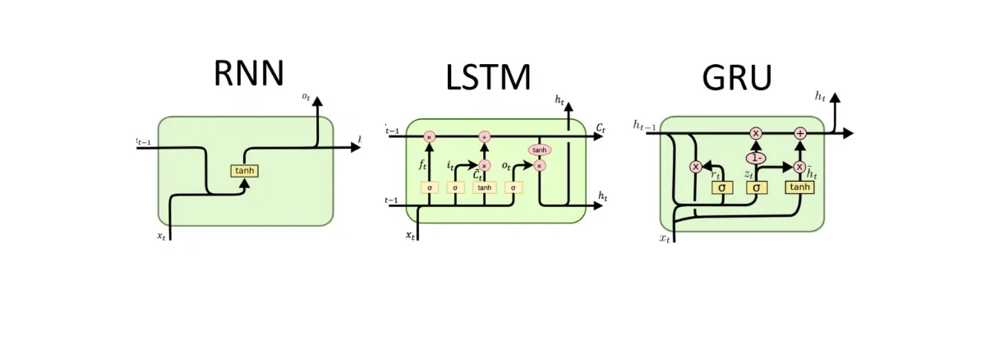

<!---
This diagram shows the key differences between LSTM and GRU architectures. LSTM has three gates (input, forget, output) while GRU has two gates (update and reset). The LSTM's additional gate gives it more control over information flow but makes it more complex.
--->

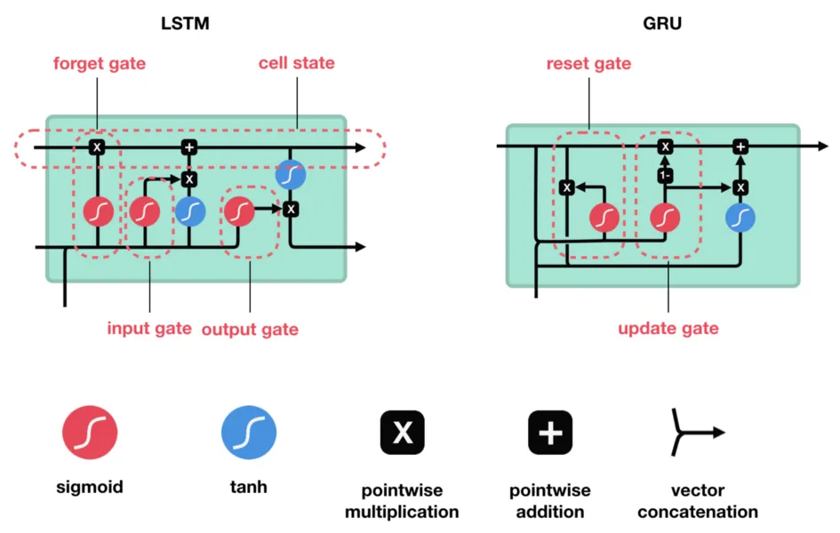

<!---
This detailed comparison shows the internal structure of both LSTM and GRU cells. Note how LSTM maintains both a cell state and hidden state, while GRU combines these into a single state. This makes GRU simpler but potentially less powerful for very long sequences.
--->

##### LSTM in Healthcare Applications

LSTMs excel in various healthcare scenarios:

1. **Clinical Note Analysis:**

   ```python
   # Example LSTM for clinical note classification
   model = Sequential([
       Embedding(vocab_size, embedding_dim, input_length=max_length),
       LSTM(128, return_sequences=True),
       Dropout(0.3),
       LSTM(64),
       Dense(num_classes, activation='softmax')
   ])
   ```

2. **Time Series Prediction:**

   ```python
   # Example LSTM for vital signs prediction
   model = Sequential([
       LSTM(64, input_shape=(time_steps, features)),
       Dropout(0.2),
       Dense(32, activation='relu'),
       Dense(1)  # Predict next value
   ])
   ```

3. **Patient Monitoring:**

   ```python
   # Example LSTM for patient state classification
   model = Sequential([
       LSTM(128, input_shape=(sequence_length, vital_signs)),
       BatchNormalization(),
       Dense(64, activation='relu'),
       Dropout(0.3),
       Dense(num_states, activation='softmax')
   ])
   ```

##### Best Practices for LSTM in Healthcare

1. **Data Preprocessing:**
   - Normalize time series data
   - Handle missing values appropriately
   - Consider sequence length and padding

2. **Model Architecture:**
   - Start with a simple architecture
   - Add layers gradually
   - Use dropout for regularization
   - Consider bidirectional LSTMs for better context

3. **Training Considerations:**
   - Use appropriate batch sizes
   - Monitor for overfitting
   - Consider using early stopping
   - Validate on representative data

4. **Common Challenges:**
   - Long training times
   - Memory requirements
   - Hyperparameter tuning
   - Interpretability

##### LSTM vs. Other Sequence Models

| Model Type | Strengths | Limitations | Best For |
|------------|-----------|-------------|-----------|
| LSTM | - Long-term dependencies<br>- Complex patterns<br>- Memory control | - Computationally expensive<br>- Longer training time | - Clinical notes<br>- Long sequences<br>- Complex temporal patterns |
| Simple RNN | - Simple implementation<br>- Faster training | - Vanishing gradient<br>- Short-term memory | - Short sequences<br>- Simple patterns |
| GRU | - Faster training<br>- Fewer parameters | - Less memory control<br>- Shorter memory | - Medium sequences<br>- Real-time applications |
| Transformer | - Parallel processing<br>- Long-range dependencies | - Large data requirements<br>- Complex implementation | - Large datasets<br>- Parallel processing |

#### Architectural Considerations

- **Spatial vs. Temporal Data:** CNNs excel at capturing spatial hierarchies in data (like images), where the location of features within the data is key. RNNs, on the other hand, shine with temporal data (like text or time series), where the sequence of data points is crucial.
- **Parameter Sharing:** CNNs use parameter sharing (the same filter applied across the image), which significantly reduces the number of parameters in the network, making them computationally efficient. RNNs share parameters across time steps, allowing them to process sequences of any length.
- **Applicability:** The choice between CNNs and RNNs (and their variants) depends heavily on the nature of the problem at hand. For mixed data types or complex tasks, **hybrid models** that combine aspects of CNNs and RNNs might be used to leverage the strengths of both architectures.

### Specialized Architectures

- **Generative Adversarial Networks (GANs)** consist of two networks, a generator and a discriminator, that are trained simultaneously. The generator learns to generate data similar to the input data, while the discriminator learns to distinguish between the generated data and the real data.
- **Graph Neural Networks (GNNs)** extend neural network methods to graph data, enabling the modeling of relationships and interactions in data structured as graphs. They are particularly useful in social network analysis, chemical molecule study, and recommendation systems.
- **Capsule Networks** offer an alternative to traditional convolutional networks by grouping neurons into "capsules" that represent various properties of the same entity, allowing the network to learn part-whole relationships. This architecture is designed to preserve spatial hierarchies between features, making it beneficial for tasks that require a high level of interpretability, such as object detection and recognition in images
- **Autoencoders** are designed for unsupervised learning tasks, such as dimensionality reduction or feature learning. They work by compressing the input into a latent-space representation and then reconstructing the output from this representation.
- **Variational Autoencoders (VAEs)** are generative models similar to autoencoders that learn to encode data into a latent space and reconstruct it. However, VAEs introduce a probabilistic twist, modeling the latent space as a distribution, which allows for the generation of new data points by sampling from this space
- **Diffusion Models** gradually add noise to data until it becomes indistinguishable from random noise and then learn to reverse this noising process to generate data. While they don't use a latent space in the traditional sense, the intermediate noisy states during the reverse process can be viewed as a form of high-dimensional latent representation.
- **Large Language Models (LLMs)** are transformer-based models trained on massive text corpora to understand and generate human-like text. They excel at:
    - **Contextual Understanding:** Capturing long-range dependencies in text through attention mechanisms
    - **Few-shot Learning:** Adapting to new tasks with minimal examples by leveraging their broad training
    - **Zero-shot Inference:** Performing tasks they weren't explicitly trained on through prompt engineering
    - **Health Applications:** Clinical note analysis, medical literature summarization, patient communication, and medical question answering

## **Neural Networks in Practice**

### Areas of Active Research

The field of neural networks is vibrant with research activity, exploring both foundational theories and innovative applications:

- **Few-Shot Learning:** This research area focuses on designing models that can learn from a very limited amount of data, akin to human learning efficiency.
- **Generative Models:** Innovations in models like GANs and diffusion models are pushing the boundaries of content creation, from realistic images to synthetic data for training other models.
- **Reinforcement Learning:** Combining neural networks with reinforcement learning principles is leading to breakthroughs in autonomous systems, game playing, and decision-making processes.
- **Explainability and Ethics:** As neural networks become more integral to critical applications, understanding their decision-making process and ensuring ethical usage are paramount.

### Current Limitations

Despite significant advancements, neural networks still face several limitations:

- **Interpretability:** The "black-box" nature of deep neural networks makes it challenging to understand and trust their decisions, especially in critical applications.
- **Data Dependency:** High-performing neural networks often require vast amounts of labeled data, which can be expensive or infeasible to obtain for many problems.
- **Computational Resources:** Training state-of-the-art models requires significant computational power, often necessitating specialized hardware like GPUs or TPUs.
- **Hallucination:** A phenomenon where generative models, such as GPT or large-scale image generators, produce outputs that are plausible but factually incorrect or nonsensical. This issue is particularly prevalent in models trained on vast, uncurated datasets and can lead to misleading or false outputs. More on this next time.

### Design Patterns

To navigate the challenges and leverage the strengths of neural networks, practitioners have adopted several design patterns:

- **Ensemble Methods:** Combining predictions from multiple neural network models to improve overall performance and reduce the likelihood of overfitting. This approach is beneficial in competitions and critical applications where even minor performance improvements are valuable.
- **Attention Mechanisms:** Beyond their use in Transformers, attention mechanisms can enhance various neural network architectures by allowing models to focus on the most relevant parts of the input data, leading to better performance, especially in tasks involving sequences or contexts.
- **Normalization Techniques:** Batch normalization, layer normalization, and instance normalization are strategies to stabilize and accelerate neural network training. By normalizing the inputs to layers within the network, these techniques help mitigate issues like internal covariate shift.
- **Regularization Techniques:** Beyond L1/L2 regularization, techniques such as dropout, data augmentation, and early stopping are employed to prevent overfitting and ensure that models generalize well to unseen data.
- **Residual Connections:** Popularized by ResNet architectures, residual connections help alleviate the vanishing gradient problem in deep networks by allowing gradients to flow through skip connections, enabling the training of much deeper networks.
- **Dynamic Architectures:** Incorporating mechanisms that allow the network to adapt its structure or computation paths dynamically based on the input data, such as Neural Architecture Search (NAS) or conditional computation, can lead to more efficient and effective models.
- **Transfer Learning:** Leveraging pre-trained models on large datasets and fine-tuning them for specific tasks can significantly reduce the data and computational resources required.
- **Modular Design:** Building neural networks with interchangeable modules or blocks allows for more flexible architectures that can be adapted to various tasks.
- **Hybrid Models:** Combining different types of neural networks, such as CNNs for feature extraction and RNNs for sequence processing, can harness the strengths of each architecture for complex tasks like video classification or multimodal analysis.

## Implementing a custom model from scratch

<!---
This section guides students through the process of building a neural network from scratch, including how to select appropriate layers and architectures for different types of health data problems.
--->

### Understanding Model Architecture

When building a neural network from scratch, you have several options:

1. **Start from Scratch:** Design your own architecture based on your understanding of the problem and available layer types
2. **Reference Published Models:** Implement architectures described in research papers
3. **Use Pre-built Models:** Adapt existing implementations from repositories like GitHub

For health data applications, common starting points include:

- **Medical Imaging:** CNNs with architectures inspired by ResNet or DenseNet
- **Clinical Notes:** Transformer-based models or LSTMs
- **Time Series Data:** LSTM or GRU networks
- **Tabular Data:** Dense networks with appropriate normalization

### Common Layer Types and When to Use Them

<!---
This section provides a comprehensive overview of common neural network layers, their purposes, and when to use them. The star emoji (⭐) indicates layers that are particularly common in health data applications.
--->

| Layer Type | Purpose | When to Use | Framework Keywords |
|------------|---------|-------------|-------------------|
| **Dense/Linear** ⭐ | Fully connected layer that connects every input to every output | - Final classification/regression layers<br>- Simple feedforward networks<br>- Tabular data processing | `Dense` (Keras)<br>`nn.Linear` (PyTorch) |
| **Convolutional (Conv2D)** ⭐ | Applies learned filters to extract spatial features | - Image processing<br>- Medical imaging analysis<br>- Pattern recognition in 2D data | `Conv2D` (Keras)<br>`nn.Conv2d` (PyTorch) |
| **LSTM** ⭐ | Processes sequential data with memory | - Time series analysis<br>- Clinical note processing<br>- Vital sign monitoring | `LSTM` (Keras)<br>`nn.LSTM` (PyTorch) |
| **GRU** | Simplified version of LSTM | - When computational efficiency is important<br>- Shorter sequences<br>- Similar performance to LSTM in many cases | `GRU` (Keras)<br>`nn.GRU` (PyTorch) |
| **Embedding** ⭐ | Maps discrete indices to dense vectors | - Text processing<br>- Categorical feature encoding<br>- Medical code representation | `Embedding` (Keras)<br>`nn.Embedding` (PyTorch) |
| **Batch Normalization** ⭐ | Normalizes layer inputs | - Deep networks<br>- When training is unstable<br>- Before activation functions | `BatchNormalization` (Keras)<br>`nn.BatchNorm1d/2d` (PyTorch) |
| **Dropout** ⭐ | Randomly zeros elements during training | - Preventing overfitting<br>- Regularization<br>- Large networks | `Dropout` (Keras)<br>`nn.Dropout` (PyTorch) |
| **Max Pooling** | Reduces spatial dimensions | - After convolutional layers<br>- Downsampling features<br>- Translation invariance | `MaxPooling2D` (Keras)<br>`nn.MaxPool2d` (PyTorch) |
| **Global Average Pooling** | Reduces to single value per channel | - Before final classification<br>- Reducing parameters<br>- Feature aggregation | `GlobalAveragePooling2D` (Keras)<br>`nn.AdaptiveAvgPool2d` (PyTorch) |
| **Transformer** | Processes sequences with attention | - Long-range dependencies<br>- Parallel processing<br>- Complex sequence tasks | `Transformer` (Keras)<br>`nn.Transformer` (PyTorch) |

### Building Custom Neural Networks

When implementing a custom model, follow these steps:

1. **Define the Input Layer:** Match the shape of your input data
2. **Add Hidden Layers:** Choose appropriate layer types based on your data and task
3. **Add Regularization:** Include dropout and normalization where needed
4. **Define the Output Layer:** Match the requirements of your task (e.g., softmax for classification)
5. **Compile the Model:** Choose appropriate loss function and optimizer
6. **Train and Evaluate:** Monitor training progress and adjust architecture as needed

#### Key Parameters to Consider

When constructing a neural network, several key parameters need to be defined:

- **`input_size`:** The dimensionality of your input data (e.g., 784 for 28x28 images)
- **`hidden_size`:** A tunable parameter that determines the size of hidden layers
- **`num_classes`:** The number of distinct categories in your classification task

#### Best Practices: Custom Neural Networks

- Start with a simple architecture and gradually add complexity
- Choose appropriate activation functions for hidden layers
- Use a suitable loss function and optimizer based on the task
- Monitor training progress and adjust hyperparameters as needed
- Consider using regularization techniques to prevent overfitting

#### Minimal Example in Keras:**

##### Reference Card: Keras Layers for Custom Neural Networks

- **Basic Layers:** `Dense`, `Flatten`, `Reshape`
- **Convolutional:** `Conv2D`, `MaxPooling2D`, `GlobalAveragePooling2D`
- **Recurrent:** `LSTM`, `GRU`
- **Normalization:** `BatchNormalization`
- **Regularization:** `Dropout`
- **Embedding:** `Embedding`

**Model Structure:**
Begin by initializing a  
`Sequential` model in Keras, then sequentially add layers, starting from input to output. For the EMNIST dataset, a simple model might include a layer to reshape the input, a flattening layer to convert 2D images to 1D vectors, and dense layers for classification purposes:

```python
from keras.models import Sequential
from keras.layers import Dense, Flatten, Reshape

input_size = 784  # EMNIST images are 28x28 pixels
hidden_size = 128  # Tunable parameter for the hidden layer
num_classes = 47  # Number of classes in the EMNIST Balanced dataset

model = Sequential([
    Reshape((28, 28, 1), input_shape=(input_size,)),
    Flatten(),
    Dense(hidden_size, activation='relu'),
    Dense(num_classes, activation='softmax')
])
```

**Compiling and Training:**
After defining the model, compile it with the chosen optimizer and loss function, and then train it using the `fit` method.

```python
model.compile(optimizer='adam',
              loss='categorical_crossentropy',
              metrics=['accuracy'])
model.fit(x_train, y_train, batch_size=32, epochs=10)
```

#### Minimal Example in PyTorch

##### Reference Card: PyTorch Layers and Functions for Custom Neural Networks

- **Basic Layers:** `nn.Linear`, `nn.Flatten`, `nn.Unflatten`
- **Convolutional:** `nn.Conv2d`, `nn.MaxPool2d`, `nn.AdaptiveAvgPool2d`
- **Recurrent:** `nn.LSTM`, `nn.GRU`
- **Normalization:** `nn.BatchNorm1d`, `nn.BatchNorm2d`
- **Regularization:** `nn.Dropout`
- **Embedding:** `nn.Embedding`
- **Activation Functions:** `torch.relu`, `torch.softmax`

##### Model Structure

In PyTorch, define a custom neural network by subclassing  
`nn.Module`. Initialize the layers in the constructor and specify the forward pass logic. A straightforward network might include a fully connected layer for the hidden layer and an output layer:

```Python
import torch
import torch.nn as nn
import torch.nn.functional as F

class SimpleNN(nn.Module):
    def __init__(self, input_size=784, hidden_size=128, num_classes=47):
        super(SimpleNN, self).__init__()
        self.fc1 = nn.Linear(input_size, hidden_size)
        self.fc2 = nn.Linear(hidden_size, num_classes)

    def forward(self, x):
        x = F.relu(self.fc1(x))
        x = self.fc2(x)
        return x
```

**Loss Function and Optimizer Setup:**  
Choose a suitable loss function and optimizer. For classification,  
`CrossEntropyLoss` is typically used, and `Adam` is a widely used optimizer:

```Python
model = SimpleNN(input_size=784, hidden_size=128, num_classes=47)
loss_fn = nn.CrossEntropyLoss()
optimizer = torch.optim.Adam(model.parameters(), lr=1e-3)
```

#### **Training the Models**

For training, you'll require a dataset (e.g., EMNIST), a loss function, and an optimizer. Define the number of training epochs and the batch size as well.

**PyTorch Training Loop:**  
In PyTorch, iterate over your dataset in batches, pass the inputs through the model to obtain outputs, compute the loss, and update the model parameters using  
`loss.backward()` and `optimizer.step()`:

```Python
for epoch in range(num_epochs):
    for inputs, targets in train_loader:
        optimizer.zero_grad()
        outputs = model(inputs)
        loss = loss_fn(outputs, targets)
        loss.backward()
        optimizer.step()
```

**NOTE:** In this setup, PyTorch uses a for loop to walk through the epochs. It is possible that we could customize the training routine for different epochs with this structure.

#### Training Considerations

- **Batch Size:** Affects both training speed and model stability
- **Learning Rate:** Controls the size of weight updates
- **Number of Epochs:** Determines how many times the model sees the entire dataset
- **Validation Split:** Helps monitor for overfitting
- **Early Stopping:** Can prevent overfitting by stopping training when validation performance plateaus

## Demo Break 3: Building a Neural Network from Scratch (MNIST)

## Examples with code

Practical implementations of neural network models provide valuable insights and hands-on experience:

- **CNNs:** Implementations of ResNet and XCeption in Keras for image classification tasks, demonstrating the effectiveness of deep convolutional architectures.
- **Hybrid Models:** Demonstrating the combination of CNNs and RNNs in Keras for tasks that require understanding both spatial and temporal data.
    - [https://github.com/ankangd/HybridCovidLUS](https://github.com/ankangd/HybridCovidLUS): An example of a hybrid model applied to medical imaging for COVID-19 analysis.
- **GPT from Scratch:** Building a simplified version of the GPT model in PyTorch, offering insights into the workings of transformer models.
    - [https://github.com/tezansahu/PyTorch-GANs](https://github.com/tezansahu/PyTorch-GANs): A beginner-friendly implementation showing how to train a GAN on the MNIST dataset to generate digit images.
- **Multi-Model Systems:** Exploring the interaction between different models, such as in GANs, where a generative model is pitted against a discriminative model to produce high-quality synthetic data.
