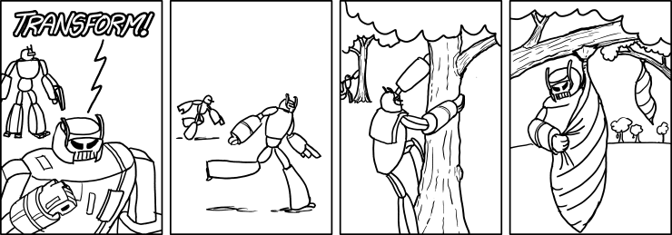
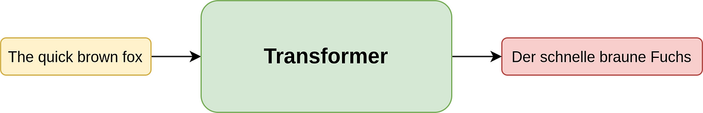
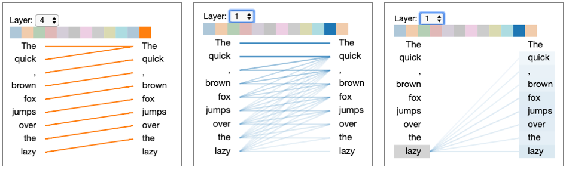
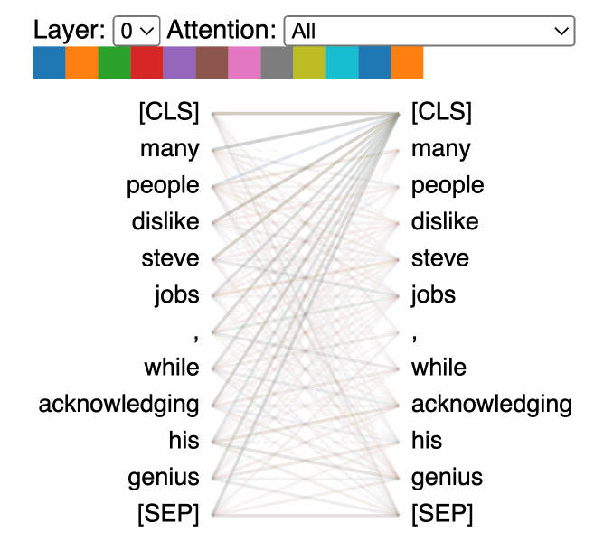
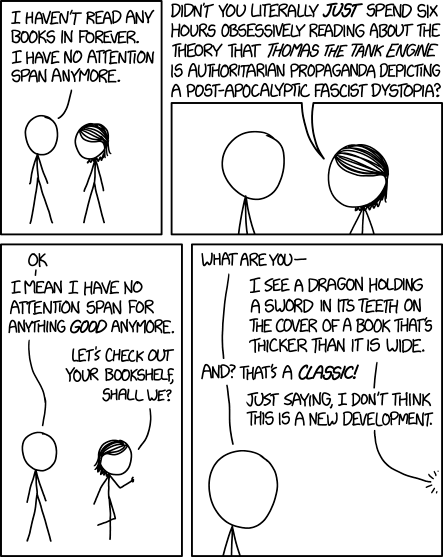
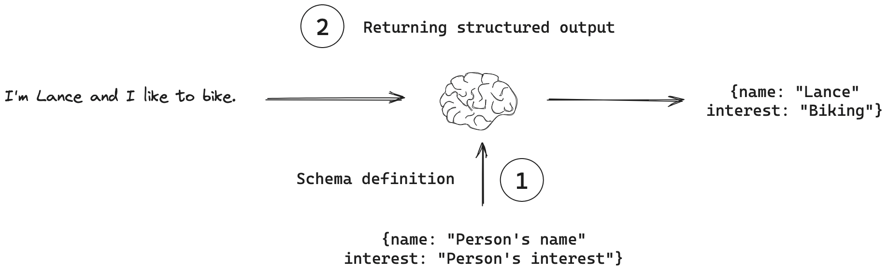
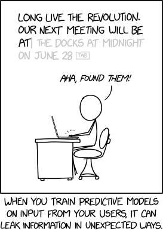
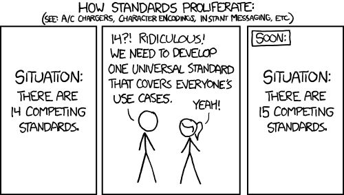

Transformers: More than Meets the Eye

- hw07 #FIXME:URL

# Links

## Transformers & Attention

- [The Illustrated Transformer](https://jalammar.github.io/illustrated-transformer/) — Jay Alammar's visual walkthrough (essential reading)
- [Everything About Transformers](https://www.krupadave.com/articles/everything-about-transformers) — story-driven visual reference (essential reading)
- [Transformer Explainer](https://poloclub.github.io/transformer-explainer/) — interactive tool
- [Attention is All You Need](https://arxiv.org/abs/1706.03762) — the original 2017 paper
- [Attention mechanism paper (2015)](https://arxiv.org/abs/1409.0473) — Bahdanau attention
- [Building Transformers from Scratch](https://vectorfold.studio/blog/transformers) — code-first guide
- [Visual introduction to Attention](https://erdem.pl/2021/05/introduction-to-attention-mechanism)
- [Multi-head attention deep dive](https://towardsdatascience.com/transformers-explained-visually-part-3-multi-head-attention-deep-dive-1c1ff1024853)

## Building GPTs

- [microGPT blog](https://karpathy.github.io/2026/02/12/microgpt/) — 200-line, zero-dependency GPT
- [microGPT visualizer](https://microgpt.boratto.ca) — interactive GPT internals visualization
- [nanoGPT repo](https://github.com/karpathy/nanoGPT) — minimal GPT training code
- [Karpathy's Zero to Hero](https://karpathy.ai/zero-to-hero.html) — neural network video series
- [Let's Build GPT (YouTube)](https://www.youtube.com/watch?v=kCc8FmEb1nY) — building GPT from scratch
- [GPT-2 WebGL visualizer](https://github.com/nathan-barry/gpt2-webgl)

## LLMs

- [List of open source LLMs](https://github.com/eugeneyan/open-llms)
- [GPT (2018) paper](https://s3-us-west-2.amazonaws.com/openai-assets/research-covers/language-unsupervised/language_understanding_paper.pdf)
- [RLHF paper](https://arxiv.org/abs/2203.02155) — Reinforcement Learning from Human Feedback
- [DistilBERT paper](https://arxiv.org/pdf/1910.01108v4.pdf) — knowledge distillation

## Healthcare AI

- [UCSF Versa](https://ai.ucsf.edu/platforms-tools-and-resources/ucsf-versa) — institutional LLM tool
- [Google Med-PaLM](https://sites.research.google/med-palm/) — medical LLM research

## Prompt Engineering Guides

- **Anthropic**: [docs.anthropic.com/en/docs/build-with-claude/prompt-engineering](https://docs.anthropic.com/en/docs/build-with-claude/prompt-engineering)
- **OpenAI**: [platform.openai.com/docs/guides/prompt-engineering](https://platform.openai.com/docs/guides/prompt-engineering)
- **OpenAI examples**: [platform.openai.com/docs/examples](https://platform.openai.com/docs/examples)

## Where to Play Around

- [Hugging Face NLP Course](https://huggingface.co/learn/nlp-course/chapter3/2?fw=pt)
- [Google Vertex AI](https://cloud.google.com/vertex-ai)
- [OpenAI Platform](https://platform.openai.com/)

# From Neural Networks to Transformers



In Lecture 6 you trained dense networks, CNNs, and LSTMs. LSTMs process sequences one token at a time — what if we could process them all at once?

The path from biological inspiration to modern LLMs involved solving several fundamental problems in sequence processing. Each breakthrough unlocked the next.

## Word Embeddings (2013)

**word2vec**: Represent words as vectors in high-dimensional space

- Similar words cluster together ("insulin" near "glucose")
- Used **Continuous Bag of Words** and **Skip-gram** algorithms for building context
    - **CBOW**: surrounding words used to predict word in the middle
    - **Skip-gram**: input word used to predict context
    - Precursors to **Attention**

## Sequence-to-Sequence & RNNs (2014)

**Encoder-decoder architecture**: Transform one sequence into another

- Encoder processes input into fixed representation
- Decoder generates output from that representation
- Used for translation, summarization
- Built on **RNNs** (Recurrent Neural Networks) with sequential processing

### RNNs, LSTM, and Limitations

RNNs introduced "memory" to neural networks — the same innovation you saw with LSTMs in Lecture 6. But they hit two walls:

**1. Vanishing gradients**: Error signals shrink as they propagate backward through time. Early words in a sequence get minimal learning signal. LSTMs improved this with gating mechanisms, but the fundamental issue remained for very long sequences.

**2. Sequential bottleneck**: Must process word-by-word (word 1 → word 2 → word 3...). Cannot parallelize training. Slow and doesn't scale.

## Attention Mechanism (2015)

**Key innovation**: Decoder focuses on specific input parts at each step

- Dynamically weights which inputs matter most
- Solves information bottleneck
- But still used RNNs underneath — attention was an add-on, not a replacement

## Transformers (2017)

**"Attention is All You Need"**: Eliminated sequential processing entirely

- Process entire sequence simultaneously (parallel)
- All tokens relate to all others via attention
- No vanishing gradient problem
- 100x+ training speedup enables web-scale datasets

## The Scale-Up Era (2018–2026)

### Reference Card: NLP Model Evolution

| Year | Innovation | Key Insight |
|:---|:---|:---|
| **2013** | Word2Vec | Words as vectors; similar meanings cluster together |
| **2014** | Seq2Seq / RNNs | Encode input → decode output; sequential processing |
| **2015** | Attention | Decoder can focus on relevant input parts dynamically |
| **2017** | Transformer | Attention *is* the architecture; parallel processing |
| **2018** | GPT (170M params), BERT | Pre-train on massive text, fine-tune for tasks |
| **2020** | GPT-3 (175B params) | Few-shot learning — examples in the prompt, no retraining |
| **2022** | ChatGPT + RLHF (Reinforcement Learning from Human Feedback) | Human feedback alignment; 100M users in 2 months |
| **2024** | GPT-4, Claude 3.5, Gemini, Llama 3 | 200K+ token context windows; multimodal |
| **2025–26** | Claude 4, GPT-4o, reasoning models | Agentic workflows; tool use; structured outputs |

# Transformer Architecture

The foundational paper is [**Attention is All You Need**](https://arxiv.org/abs/1706.03762) (2017), published by researchers at Google. For a deep understanding, read at least one of these two articles — they explain the architecture better than any summary can:

- [**The Illustrated Transformer**](https://jalammar.github.io/illustrated-transformer/) — Jay Alammar's step-by-step visual walkthrough
- [**Everything About Transformers**](https://www.krupadave.com/articles/everything-about-transformers) — story-driven visual reference

What follows is a condensed version — the articles above go deeper.



## The Big Picture

A transformer takes an input sequence and produces an output sequence. The **encoder** turns input into a numerical representation; the **decoder** uses that to generate output one token at a time.

The key difference from RNNs: transformers process the entire sequence at once, in parallel. No waiting for word 1 to finish before starting word 2.

The pipeline: **Tokenize → Embed → Add positional encodings → Stack attention layers → Generate output**

## Self-Attention: The Core Innovation

Consider the sentence: *"The animal didn't cross the street because **it** was too tired."* When processing "it," the model needs to figure out that "it" refers to "the animal" — not "the street."

Self-attention solves this. Each token computes how much it should "attend to" every other token in the sequence. This lets the model capture long-range dependencies directly, without needing to pass information token-by-token through a chain of hidden states.

### How It Works: Query, Key, Value

Think of it like a search engine. For each token, the model creates three vectors:

- **Query (Q)**: What this token is *looking for* — like what you type into a search bar
- **Key (K)**: What this token *offers* to others — like the title of a web page
- **Value (V)**: The actual *content* to retrieve — like the web page itself

The attention mechanism computes a dot product between each Query and every Key. High dot product = high relevance. These scores are normalized with **softmax** (converting raw scores into probabilities that sum to 1), then used to create a weighted combination of Values.

The scores are divided by $\sqrt{d_k}$ (the square root of the key dimension) to prevent dot products from growing too large in high dimensions, which would push softmax into regions with tiny gradients.

### Reference Card: Scaled Dot-Product Attention

| Component | Details |
|:---|:---|
| **Formula** | $\text{Attention}(Q, K, V) = \text{softmax}\left(\frac{QK^T}{\sqrt{d_k}}\right)V$ |
| **Q (Query)** | What we're looking for — "which other tokens matter to me?" |
| **K (Key)** | What each token offers — "here's what I represent" |
| **V (Value)** | The actual information to retrieve |
| **Scaling** | $\sqrt{d_k}$ prevents dot products from growing too large with high dimensions |

### Code Snippet: Simplified Attention

```python
import numpy as np

def scaled_dot_product_attention(query, key, value):
    """Compute scaled dot-product attention (pure numpy)."""
    d_k = query.shape[-1]
    scores = query @ key.T / np.sqrt(d_k)
    weights = np.exp(scores) / np.exp(scores).sum(axis=-1, keepdims=True)  # softmax
    return weights @ value
```

## Multi-Head Attention

A single attention pass captures one type of relationship. But language has many simultaneous relationships — syntax, semantics, entity references, temporal ordering.

Multi-head attention runs multiple attention operations in parallel, each with its own learned Q/K/V weight matrices. With the sentence *"He swung the bat with incredible force"*: one head might focus on "swung ↔ bat" (action–object), another on "incredible ↔ force" (modifier–noun), and another on resolving that "bat" means a baseball bat, not an animal.

The original transformer uses 8 heads with 512-dimensional embeddings, giving each head 64 dimensions (512 ÷ 8). Too few heads and each must learn too many relationship types; too many and each becomes too small to represent anything meaningful.



*The left and center figures represent different layers / attention heads. The right figure depicts the same layer/head as the center figure, but with the token "lazy" selected.*



## Positional Encoding

Unlike RNNs, which inherently know word order (they process sequentially), transformers see the entire input at once — and have no built-in sense of order. "The cat sat on the mat" and "The mat sat on the cat" would look identical.

Positional encodings fix this by adding a unique vector to each token's embedding. The original paper uses sine and cosine functions at different frequencies: low-frequency waves capture broad structure (beginning vs. end of sequence), while high-frequency waves capture fine-grained position (adjacent tokens). Together, they create a unique "positional fingerprint" for every position.

## Putting It All Together

### Reference Card: Transformer Components

| Component | Purpose | Details |
|:---|:---|:---|
| **Input Embedding** | Convert tokens to vectors | Maps discrete tokens to continuous space |
| **Positional Encoding** | Add order information | Since attention is order-agnostic, position must be injected |
| **Multi-Head Attention** | Learn different relationship types | Each head focuses on different aspects (syntax, semantics, entity references) |
| **Feed-Forward Network** | Add non-linearity | Applied to each position independently |
| **Layer Normalization** | Stabilize training | Normalize activations within a layer |
| **Residual Connections** | Enable gradient flow | Skip connections around sublayers; preserve information through deep stacks |

Each encoder/decoder layer combines these components: self-attention → residual connection + normalization → feedforward → residual connection + normalization. Stack 6+ of these layers, and you have a transformer.

**Want to explore interactively?** [Transformer Explainer](https://poloclub.github.io/transformer-explainer/) — step through a working transformer model and see what each component does.

## Beyond Text

Transformers aren't just for language. The attention mechanism generalizes to any sequential data:

- **Vision Transformers (ViT)**: images split into patches, each patch treated as a token
- **Time-series**: EHR data, sensor readings, financial sequences
- **Multimodal models**: GPT-4o, Gemini, Claude process text, images, and audio together

The key principle: attention works on any sequence where order and relationships matter.


# Building a GPT from Scratch

What does it actually take to build a language model? Less than you might think. Andrej Karpathy's [microGPT](https://karpathy.github.io/2026/02/12/microgpt/) demonstrates that a working GPT can be built in ~200 lines of Python with zero dependencies.

The key pieces:

- **Tokenization** (character-level): split text into individual characters as tokens. Production models use **BPE (Byte Pair Encoding)** instead, which groups common character sequences into subword tokens (~4 characters per token on average). Models process 64K–200K+ tokens per request.
- **Autograd engine**: compute gradients automatically for backpropagation
- **Multi-head attention blocks**: the core transformer layer — self-attention + feedforward
- **Training loop**: forward pass → compute loss (cross-entropy: measures how far predictions are from the correct next token) → backprop → update weights using the Adam optimizer (an adaptive learning rate method)
- **Inference/sampling with temperature**: generate text by repeatedly predicting the next token

The surprising thing: scaling from microGPT to GPT-4 changes the tokenizer (BPE instead of characters), the data (terabytes instead of kilobytes), and the compute (thousands of GPUs instead of your laptop) — but the core algorithm doesn't change.

These models learn from their training data. *All* of it. Including whatever biases exist in the text. If we're lucky, we might guess at the biases we introduce — but not always.

### Reference Card: GPT Components

| Component | Details |
|:---|:---|
| **Tokenizer** | Splits text into tokens (characters, subwords, or words). BPE is standard for production models. |
| **Embedding Layer** | Maps each token to a dense vector + adds positional encoding. |
| **Attention Blocks** | Stacked self-attention + feedforward layers. Each block refines the representation. |
| **Output Head** | Linear layer projecting back to vocabulary size → softmax → next-token probabilities. |
| **Training** | Autoregressive: predict next token, compute cross-entropy loss, backprop, Adam update. |
| **Inference** | Sample from output distribution. Temperature controls randomness (0 = greedy, 1 = diverse). |

### Code Snippet: Minimal Attention Block

```python
import numpy as np

class AttentionBlock:
    """Simplified single-head attention block (conceptual)."""
    def __init__(self, dim):
        self.wq = np.random.randn(dim, dim) * 0.02  # query weights
        self.wk = np.random.randn(dim, dim) * 0.02  # key weights
        self.wv = np.random.randn(dim, dim) * 0.02  # value weights

    def forward(self, x):
        q, k, v = x @ self.wq, x @ self.wk, x @ self.wv
        scores = q @ k.T / np.sqrt(x.shape[-1])
        weights = np.exp(scores) / np.exp(scores).sum(axis=-1, keepdims=True)
        return weights @ v
```

**Resources:**
- [microGPT visualizer](https://microgpt.boratto.ca) — interactive visualization of GPT internals
- [Let's Build GPT](https://www.youtube.com/watch?v=kCc8FmEb1nY) — Karpathy's video walkthrough
- [nanoGPT repo](https://github.com/karpathy/nanoGPT) — minimal GPT training code

# LIVE DEMO!

Exploring attention visualization with nanoGPT — seeing what the model "looks at" when processing text.

See: [demo/02-nanogpt_attention.md](demo/02-nanogpt_attention.md)



# Embeddings

Embeddings map discrete tokens (words, sentences, documents) to continuous vectors where **meaning is geometry**. Similar items cluster together; relationships become directions in space.


This idea connects back to Lecture 4's word vectors — but modern embedding models go far beyond individual words.


*Semantic similarity in embedding space: "king" - "man" + "woman" ≈ "queen" — geometry captures analogies*

## From Words to Sentences

| Method | What It Embeds | Key Properties |
|:---|:---|:---|
| **Word2Vec** (2013) | Individual words | Skip-gram / CBOW; similar words cluster together |
| **GloVe** | Individual words | Global co-occurrence statistics; pre-trained on large corpora |
| **FastText** | Subwords → words | Handles out-of-vocabulary words via character n-grams |
| **BERT Embeddings** | Words in context | Same word gets different vectors in different sentences |
| **Sentence Transformers** | Full sentences/paragraphs | Purpose-built for similarity tasks; fixed-size output vectors |

The key evolution: Word2Vec gives one vector per word regardless of context. BERT and Sentence Transformers give *contextualized* embeddings — "bank" near "river" gets a different vector than "bank" near "money."

## Practical Usage

Embeddings enable a family of powerful applications:

- **Semantic search**: Find documents by meaning, not just keywords — "cardiac symptoms" matches "chest pain and shortness of breath"
- **Document clustering**: Group related documents automatically
- **Similarity matching**: Find duplicates, related items, or near-misses
- **Anomaly detection**: Identify outliers in embedding space
- **Classification features**: Use embeddings as input to downstream models

### Reference Card: Common Embedding Methods

| Method | Description | Use Cases |
|:---|:---|:---|
| **Word2Vec** | Skip-gram or CBOW to learn word vectors | Text similarity, analogy tasks |
| **GloVe** | Global vectors from co-occurrence statistics | Pre-trained embeddings for NLP |
| **FastText** | Subword embeddings (handles OOV words) | Morphologically rich languages |
| **BERT Embeddings** | Contextualized embeddings from transformers | State-of-the-art NLP tasks |
| **Sentence Transformers** | Full sentence/paragraph embeddings | Semantic search, clustering |

### Reference Card: `SentenceTransformer`

| Component | Details |
|:---|:---|
| **Library** | `sentence-transformers` (`pip install sentence-transformers`) |
| **Purpose** | Generate dense vector embeddings for sentences/paragraphs |
| **Key Method** | `model.encode(sentences)` — returns numpy array of embeddings |
| **Popular Models** | `all-MiniLM-L6-v2` (fast), `all-mpnet-base-v2` (accurate) |
| **Output** | Fixed-size vectors (e.g., 384 or 768 dimensions) |

### Reference Card: `cosine_similarity`

| Component | Details |
|:---|:---|
| **Function** | `sklearn.metrics.pairwise.cosine_similarity()` |
| **Purpose** | Measure similarity between vectors (1 = identical, 0 = orthogonal, -1 = opposite) |
| **Input** | Two arrays of shape (n_samples, n_features) |
| **Use Case** | Compare embeddings to find semantically similar texts |

### Code Snippet: Computing and Comparing Embeddings

```python
from sentence_transformers import SentenceTransformer
from sklearn.metrics.pairwise import cosine_similarity

model = SentenceTransformer('all-MiniLM-L6-v2')

# Clinical documents
docs = [
    "Patient presents with chest pain and shortness of breath",
    "Lab results show elevated troponin levels",
    "Patient reports headache and nausea",
]

embeddings = model.encode(docs)

# Find most similar to a query
query_emb = model.encode(["cardiac symptoms"])
similarities = cosine_similarity(query_emb, embeddings)[0]

for doc, sim in sorted(zip(docs, similarities), key=lambda x: -x[1]):
    print(f"{sim:.3f}  {doc}")
```

## Vector Databases

For production applications with many documents, you need a vector database — a data store optimized for similarity search over embedding vectors.

### Reference Card: Vector Database Options

| Database | Type | Strengths |
|:---|:---|:---|
| **ChromaDB** | In-memory/persistent | Simple API, good for prototyping |
| **FAISS** | In-memory | Fast, scalable, from Meta AI |
| **Pinecone** | Cloud service | Managed, production-ready |
| **Weaviate** | Self-hosted/cloud | Full-text + vector search |
| **pgvector** | PostgreSQL extension | Integrate with existing DB |

### Code Snippet: ChromaDB Vector Search

```python
import chromadb
from sentence_transformers import SentenceTransformer

model = SentenceTransformer('all-MiniLM-L6-v2')
client = chromadb.Client()
collection = client.create_collection("clinical_notes")

# Add documents
documents = ["Note 1...", "Note 2...", "Note 3..."]
collection.add(
    documents=documents,
    ids=[f"doc_{i}" for i in range(len(documents))],
    embeddings=model.encode(documents).tolist()
)

# Query
results = collection.query(
    query_embeddings=model.encode(["chest pain symptoms"]).tolist(),
    n_results=3
)
```

Vector databases will come back in Lecture 8 when we build RAG pipelines.


# LLMs and General-Purpose Models

Recent years have seen the emergence of large language models (LLMs) like GPT-4, Claude, and Gemini — massive, **general-purpose models** capable of understanding and generating human-like text across a wide range of tasks.

What makes them "general purpose"? Pre-training on enormous text corpora gives them broad knowledge and emergent capabilities that weren't explicitly trained. The same model can translate, summarize, classify, write code, and reason about problems.

## Fine-Tuning vs Prompt Engineering

Two approaches to adapting an LLM to your task:

| Approach | When to Use | Effort | Cost |
|:---|:---|:---|:---|
| **Prompting** (recommended default) | Most tasks; fast iteration | Minutes to test | Lower |
| **Fine-tuning** (specialized cases) | Specialized vocabulary, domain patterns | Days–weeks | Higher |

**Prompting** is the recommended starting point:
- Fast iteration (minutes to test)
- No data collection needed
- Works across many tasks
- Lower cost

**Fine-tuning** is for specialized cases only:
- Adapt pre-trained model on your specific data
- Requires 100s–1000s labeled examples
- Lengthy dataset preparation and training

### Reference Card: Fine-Tuning with Hugging Face

| Component | Details |
|:---|:---|
| **Purpose** | Adapt pre-trained model to specific task/domain |
| **Data Needed** | 100s–1000s labeled examples typically |
| **Key Classes** | `Trainer`, `TrainingArguments`, `AutoModel` |
| **When to Use** | Specialized vocabulary, domain-specific patterns |
| **Alternative** | Prompt engineering (faster, no training) |

### Code Snippet: Fine-Tuning a GPT

```python
from transformers import GPT2Tokenizer, GPT2LMHeadModel, Trainer, TrainingArguments

tokenizer = GPT2Tokenizer.from_pretrained('gpt2')
model = GPT2LMHeadModel.from_pretrained('gpt2')

# Prepare your dataset
texts = ["Your clinical notes", "More clinical text"]
inputs = tokenizer(texts, padding=True, truncation=True, return_tensors="pt")

training_args = TrainingArguments(
    output_dir="./results",
    num_train_epochs=3,
    per_device_train_batch_size=4,
)

trainer = Trainer(model=model, args=training_args, train_dataset=inputs)
trainer.train()
```

## Addressing Hallucination

There is no general solution to preventing model hallucination. One way to think of it: like regression, when extrapolating beyond the training data you run the risk of assumptions that no longer hold.

Approaches include:
- **Training Data Curation:** High-quality, accurate training data reduces hallucination likelihood
- **Prompt and Output Design:** Careful prompts and output constraints mitigate hallucination in generative tasks
- **Human-in-the-loop:** Incorporate human feedback to identify and correct hallucinations
- **Retrieval-Augmented Generation (RAG):** Ground model responses in retrieved documents — we'll build this in Lecture 8

If you don't know how to do something yourself, you won't know if an LLM is doing it well. LLMs amplify expertise — they don't replace it.

# Prompt Engineering

Prompt engineering is the practice of crafting input prompts that guide the model to generate desired outputs. This exploits the model's ability to understand context and generate relevant responses — "programming" the model for new tasks without retraining.

A useful template for structuring prompts:

```
[ROLE]        Who the model should act as
[TASK]        What you need done
[FORMAT]      How to structure the output
[CONSTRAINTS] Boundaries and requirements
[EXAMPLES]    Concrete input/output pairs
```

Not every prompt needs all five sections, but thinking in these terms helps craft more effective prompts.

## Zero-Shot, One-Shot, and Few-Shot Learning

One of the most remarkable capabilities of modern LLMs is their ability to perform tasks with minimal examples.

### Reference Card: Prompting Techniques

| Technique | Description | When to Use |
|:---|:---|:---|
| **Zero-shot** | Task description only, no examples | Simple, well-defined tasks |
| **One-shot** | Single example provided | When pattern is clear from one case |
| **Few-shot** | 2–5 examples provided | Complex patterns, structured output |
| **Chain-of-thought** | Ask model to show reasoning steps | Multi-step reasoning tasks |

### Code Snippet: Few-Shot Prompting

```python
prompt = """Extract diagnoses from clinical notes.

Example 1:
Note: "Patient presents with elevated blood glucose and polyuria."
Diagnosis: Type 2 Diabetes Mellitus

Example 2:
Note: "Chest pain radiating to left arm, elevated troponin."
Diagnosis: Acute Myocardial Infarction

Now extract the diagnosis:
Note: "Patient has persistent cough, fever, and infiltrates on chest X-ray."
Diagnosis:"""
```

## Structured Responses

A **structured response** is output that follows a specific, machine-readable format — JSON, XML, or a table — rather than free-form text.

The traditional approach — parsing free text with regex — is fragile and error-prone. Structured outputs let the model guarantee schema conformance, giving you simpler prompts, reliable downstream processing, and enforceable output formats via function calling.



### Why does it matter in health data science?

- **Reliability:** Structured outputs are easier to validate and less prone to hallucination
- **Interoperability:** Can be directly consumed by other systems (EHRs, analytics pipelines)
- **Automation:** Enables downstream processing — automated coding, reporting, alerting
- **Auditability:** Easier to check for missing or inconsistent information

### How to get structured responses

- Use **schema-based prompting**: "Provide your answer in the following JSON format: { ... }"
- Be explicit about required fields and data types
- Validate the output programmatically

### Reference Card: Structured Output Prompting

| Component | Details |
|:---|:---|
| **Schema Definition** | Explicitly define JSON structure in prompt |
| **Required Fields** | List all mandatory fields with types |
| **Validation** | Parse and validate output programmatically |
| **Fallback** | Handle parsing errors gracefully |

### Code Snippet: Schema-Based Prompting

```python
prompt = """Extract the following information from the clinical note and return it as JSON:
{
  "diagnosis": "<primary diagnosis>",
  "confidence": <0.0-1.0>,
  "icd_code": "<ICD-10 code if known>",
  "reasoning": "<brief explanation>"
}

Clinical Note: "65-year-old male with chest pain, ST elevation in leads V1-V4,
troponin elevated at 2.5 ng/mL. Cardiology consulted for emergent catheterization."
"""
```



# LIVE DEMO!!

Embedding similarity search and prompt engineering techniques — finding semantically similar clinical documents and structuring LLM outputs.

See: [demo/03-api_prompt_engineering.md](demo/03-api_prompt_engineering.md)

# LLM API Integration



Building applications with language models requires understanding how to interact with their APIs effectively. Students need API access working before Lecture 8's applied work.

## API Access Patterns

- **REST APIs**: HTTP endpoints that accept JSON payloads containing your prompt and parameters, returning generated text
- **SDK/Libraries**: Client libraries like OpenAI Python, Anthropic SDK, and Hugging Face provide convenient wrappers
- **Authentication**: API keys stored securely as environment variables or in a secrets manager

### Reference Card: LLM API Providers

| Provider | Models | Strengths |
|:---|:---|:---|
| **OpenAI** | GPT-4o, o1, o3 | Best general-purpose, function calling, structured outputs |
| **Anthropic** | Claude 4, Claude 4.5 | Long context, safety focus, tool use |
| **Google** | Gemini | Multimodal, large context |
| **Hugging Face** | Various open models | Free tier, open source options |

### Code Snippet: OpenAI API

```python
from openai import OpenAI

client = OpenAI()  # Uses OPENAI_API_KEY env var

response = client.chat.completions.create(
    model="gpt-4o-mini",
    messages=[
        {"role": "system", "content": "You are a helpful medical assistant."},
        {"role": "user", "content": "What are the symptoms of diabetes?"}
    ],
    max_tokens=150
)

print(response.choices[0].message.content)
```

## Function Calling: Enforcing Schema Compliance

Modern LLM APIs support **function calling** — you define a schema for expected output, and the model returns a response conforming to that schema.

- Guides the model to return only data matching your structure (required fields, types)
- Reduces hallucinated or malformed outputs
- Makes LLM integration into production systems practical — especially in healthcare where data quality is critical

### Reference Card: Function Calling

| Component | Details |
|:---|:---|
| **Purpose** | Enforce structured output schema |
| **Definition** | JSON schema with properties and types |
| **Required Fields** | Specify mandatory fields in schema |
| **Validation** | Model attempts to conform to schema |

### Code Snippet: Function Calling

```python
tools = [
    {
        "type": "function",
        "function": {
            "name": "extract_diagnosis",
            "parameters": {
                "type": "object",
                "properties": {
                    "diagnosis": {"type": "string"},
                    "confidence": {"type": "number"},
                    "reasoning": {"type": "string"}
                },
                "required": ["diagnosis", "confidence", "reasoning"]
            }
        }
    }
]

response = client.chat.completions.create(
    model="gpt-4o",
    messages=[{"role": "user", "content": "Extract the diagnosis from this note..."}],
    tools=tools,
    tool_choice={"type": "function", "function": {"name": "extract_diagnosis"}}
)
```

## Building a Complete LLM Chat Application

When building applications that interact with LLMs, separate your code into distinct components:

1. **LLM Client Library**: Handles API communication, error handling, conversation formatting
2. **Command Line Interface**: Provides a user interface leveraging the client library

This separation of concerns makes the code more maintainable, testable, and reusable.

### Code Snippet: LLM Client Class

```python
import time
import logging
from openai import OpenAI

class LLMClient:
    """Client for interacting with LLM APIs."""

    def __init__(self, model="gpt-4o-mini", max_retries=3):
        self.client = OpenAI()
        self.model = model
        self.max_retries = max_retries
        self.history = []

    def chat(self, message, system_prompt=None):
        """Send a message and get a response, with retry logic."""
        if system_prompt and not self.history:
            self.history.append({"role": "system", "content": system_prompt})
        self.history.append({"role": "user", "content": message})

        for attempt in range(self.max_retries):
            try:
                response = self.client.chat.completions.create(
                    model=self.model, messages=self.history
                )
                reply = response.choices[0].message.content
                self.history.append({"role": "assistant", "content": reply})
                return reply
            except Exception as e:
                logging.error(f"Attempt {attempt + 1} failed: {e}")
                time.sleep(2 ** attempt)

        return "Error generating response."
```

## Error Handling Best Practices

- **Rate limiting**: Implement exponential backoff for rate limits
- **Timeout handling**: Set appropriate timeouts for connection issues
- **Response validation**: Always validate structure and content of API responses
- **Cost management**: Monitor token usage and implement budgets

# LIVE DEMO!!!

Zero-, one-, and few-shot prompting via API — clinical text classification, diagnosis extraction, and structured output generation.

See: [demo/03-api_prompt_engineering.md](demo/03-api_prompt_engineering.md)

