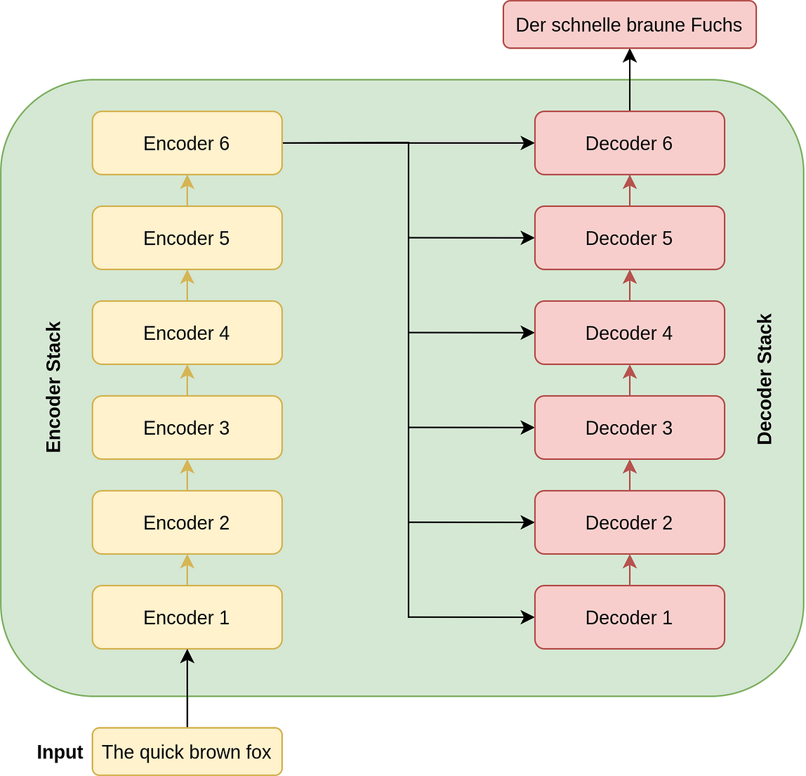
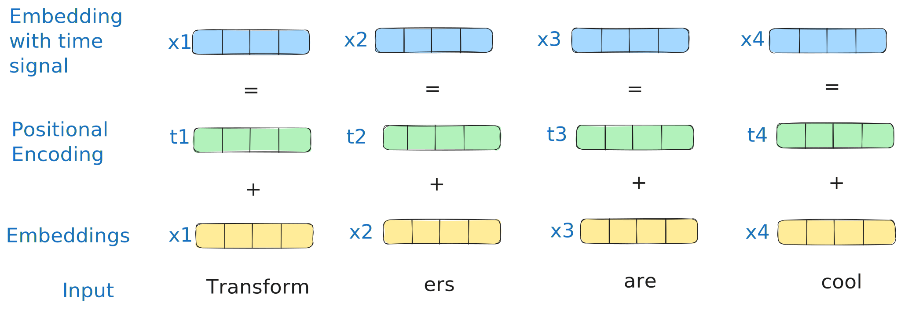
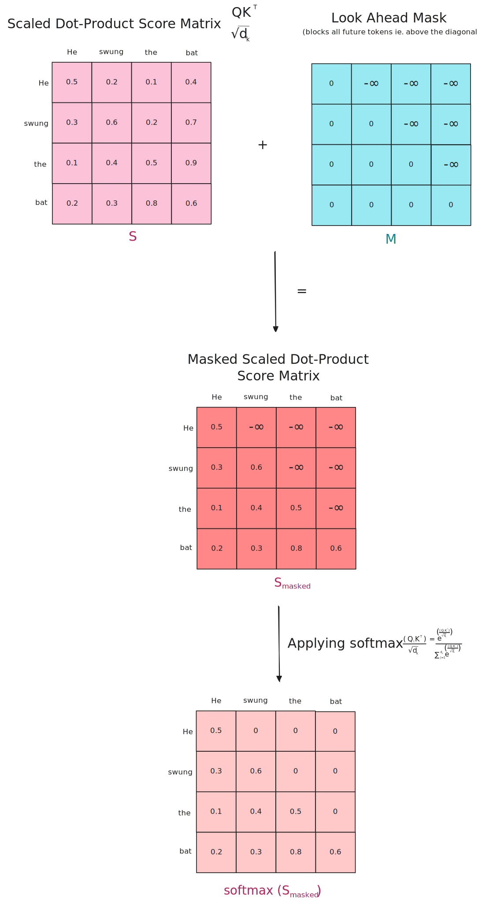

Transformers: More than Meets the Eye

- hw07 #FIXME:URL

# Links

## Transformers & Attention

- [The Illustrated Transformer](https://jalammar.github.io/illustrated-transformer/) — Jay Alammar's visual walkthrough
- [Everything About Transformers](https://www.krupadave.com/articles/everything-about-transformers) — story-driven visual reference
- [Transformer Explainer](https://poloclub.github.io/transformer-explainer/) — interactive tool
- [Attention is All You Need](https://arxiv.org/abs/1706.03762) — the original 2017 paper
- [Attention mechanism paper (2015)](https://arxiv.org/abs/1409.0473) — Bahdanau attention
- [Building Transformers from Scratch](https://vectorfold.studio/blog/transformers) — code-first guide
- [Visual introduction to Attention](https://erdem.pl/2021/05/introduction-to-attention-mechanism)
- [Multi-head attention deep dive](https://towardsdatascience.com/transformers-explained-visually-part-3-multi-head-attention-deep-dive-1c1ff1024853)

## Building GPTs

- [microGPT blog](https://karpathy.github.io/2026/02/12/microgpt/) — 200-line, zero-dependency GPT
- [microGPT visualizer](https://microgpt.boratto.ca) — interactive GPT internals visualization
- [nanoGPT repo](https://github.com/karpathy/nanoGPT) — minimal GPT training code
- [Karpathy's Zero to Hero](https://karpathy.ai/zero-to-hero.html) — neural network video series
- [Let's Build GPT (YouTube)](https://www.youtube.com/watch?v=kCc8FmEb1nY) — building GPT from scratch
- [GPT-2 WebGL visualizer](https://github.com/nathan-barry/gpt2-webgl)

## LLMs

- [Post-Chatbot Era (The Atlantic)](https://www.theatlantic.com/technology/2026/02/post-chatbot-claude-code-ai-agents/686029/) — zeitgeist piece on where AI is heading
- [List of open source LLMs](https://github.com/eugeneyan/open-llms)
- [GPT (2018) paper](https://s3-us-west-2.amazonaws.com/openai-assets/research-covers/language-unsupervised/language_understanding_paper.pdf)
- [RLHF paper](https://arxiv.org/abs/2203.02155) — Reinforcement Learning from Human Feedback
- [DistilBERT paper](https://arxiv.org/pdf/1910.01108v4.pdf) — knowledge distillation

## Healthcare AI

- [UCSF Versa](https://ai.ucsf.edu/platforms-tools-and-resources/ucsf-versa) — institutional LLM tool (sunsetting soon)
- [UCSF ChatGPT Enterprise](https://ai.ucsf.edu/ucsf-chatgpt-enterprise) — Versa replacement (coming online March 2026)
- [Google Med-PaLM](https://sites.research.google/med-palm/) — medical LLM research
- [Azure Text Analytics for Health](https://learn.microsoft.com/en-us/azure/ai-services/language-service/text-analytics-for-health/overview)

## Prompt Engineering Guides

- **Anthropic**: [docs.anthropic.com/en/docs/build-with-claude/prompt-engineering](https://docs.anthropic.com/en/docs/build-with-claude/prompt-engineering)
- **OpenAI**: [platform.openai.com/docs/guides/prompt-engineering](https://platform.openai.com/docs/guides/prompt-engineering)
- **OpenAI examples**: [platform.openai.com/docs/examples](https://platform.openai.com/docs/examples)

## Where to Play Around

- [Hugging Face NLP Course](https://huggingface.co/learn/nlp-course/chapter3/2?fw=pt)
- [Google Vertex AI](https://cloud.google.com/vertex-ai)
- [OpenAI Platform](https://platform.openai.com/)

# From Neural Networks to Transformers


LSTMs process sequences one token at a time — _what if we could process them all at once?_


_From [Everything About Transformers](https://www.krupadave.com/articles/everything-about-transformers) — the abbreviated timeline from feedforward networks to transformers_


_From [Everything About Transformers](https://www.krupadave.com/articles/everything-about-transformers) — detailed history of language models up to the transformer breakthrough (2017)_

The key milestones: **word2vec** (2013) showed that words could be represented as vectors where similar meanings cluster together. **RNNs** and **seq2seq** (sequence-to-sequence) models (2014) introduced memory and encoder-decoder architectures for translation and summarization — but processed tokens sequentially, creating a speed bottleneck and losing information over long distances.


The **attention mechanism** (2015) let decoders focus on relevant input parts dynamically, but still ran on top of RNNs. Then **transformers** (2017) eliminated sequential processing entirely: process the full sequence in parallel, let every token attend to every other token, and scale to web-sized datasets. That's the architecture we'll dissect below.

## The Scale-Up Era (2018–2026)

Once transformers removed the sequential bottleneck, the race was on: bigger models, more data, faster hardware. Each generation unlocked capabilities that the previous generation couldn't achieve — from basic text completion to multi-turn reasoning and tool use. The progression happened faster than anyone predicted.

A few key moments in this timeline:

- **ELMo (2018)** from Allen AI introduced _contextualized_ word embeddings — the same word gets different vectors depending on surrounding context. This was a major step beyond Word2Vec's static vectors.
- **BERT (2018)** from Google used _bidirectional_ training (reading left-to-right AND right-to-left simultaneously) to build deep contextual understanding. BERT dominated NLP benchmarks and became the foundation for most task-specific models.
- **GPT (2018)** from OpenAI took the opposite approach: _unidirectional_ (left-to-right only), trained to predict the next token. This autoregressive design turned out to be the key to generation — and is how all modern LLMs work.
- **T5 (2019)** from Google reframed every NLP task as text-to-text — translation, summarization, classification, and Q&A all use the same "text in, text out" format. This unified approach simplified multi-task training.
- **GPT-3 (2020)** demonstrated that scale alone could produce qualitative leaps: with 175B parameters, it could perform tasks from just a few examples in the prompt (few-shot learning), with no fine-tuning needed.
- **ChatGPT (2022)** combined GPT-3.5 with RLHF (Reinforcement Learning from Human Feedback) — training the model to align with human preferences through a reward signal. This made LLMs conversational and useful to non-technical users, reaching 100M users within two months.
- **Open-weight models** like Meta's Llama series (2023–) made competitive models freely available, enabling local deployment and domain-specific fine-tuning without depending on API providers.

# Transformer Architecture


## The Problem: Processing Everything at Once

RNNs process sequences token-by-token — slow, and information degrades over long distances. Transformers process the full sequence in parallel, but that creates a new problem: **how does any token know about any other token?** The answer is **attention**.



The original transformer uses an **encoder-decoder** structure:

- **Encoder**: reads the entire input, builds a rich representation
- **Decoder**: uses that representation to generate output one token at a time
- Both are stacks of 6 identical layers (same structure, different learned weights)
- Pipeline: **Tokenize → Embed → Add positional encodings → Stack attention layers → Generate output**

## Self-Attention: Letting Tokens Talk

Consider the sentence: _"The animal didn't cross the street because **it** was too tired."_ When processing "it," the model needs to figure out that "it" refers to "the animal" — not "the street." An RNN would have to propagate that information through every intermediate token. Self-attention solves this directly: every token computes how much it should "attend to" every other token, capturing long-range dependencies in a single step.

### How It Works: Query, Key, Value

Think of it like a search engine. For each token, the model creates three vectors from learned weight matrices:

- **Query (Q)**: What this token is _looking for_ — like what's typed into a search bar
- **Key (K)**: What this token _offers_ to others — like the title of a web page
- **Value (V)**: The actual _content_ to retrieve — like the web page itself

Here's what that looks like with concrete numbers. Take a 3-token input — "cat," "sat," "mat" — each with a tiny 4-dimensional embedding. The model multiplies each embedding by learned weight matrices $W_Q$, $W_K$, $W_V$ to produce Q, K, V vectors. Let's trace what happens from the perspective of "cat":

1. **Score**: Compute the dot product of $Q_\text{cat}$ against every token's Key:
    - $Q_\text{cat} \cdot K_\text{cat} = 112$, $Q_\text{cat} \cdot K_\text{sat} = 96$, $Q_\text{cat} \cdot K_\text{mat} = 78$
2. **Scale**: Divide by $\sqrt{d_k} = \sqrt{4} = 2$: scores become $56, 48, 39$
3. **Softmax** (convert scores to probabilities summing to 1): $[0.73, 0.22, 0.05]$ — "cat" attends mostly to itself and somewhat to "sat"
4. **Weighted sum**: Multiply each Value vector by its weight and sum: $0.73 \cdot V_\text{cat} + 0.22 \cdot V_\text{sat} + 0.05 \cdot V_\text{mat}$ — the output is a new representation of "cat" that blends information from the whole sequence

Repeat for every token, and you get a new set of representations where each token "knows about" every other token. That's self-attention.


_From [Everything About Transformers](https://www.krupadave.com/articles/everything-about-transformers) — each token's embedding is multiplied by learned weight matrices to produce Query, Key, and Value vectors_

### Reference Card: Scaled Dot-Product Attention

| Component     | Details                                                                           |
| :------------ | :-------------------------------------------------------------------------------- |
| **Formula**   | $\text{Attention}(Q, K, V) = \text{softmax}\left(\frac{QK^T}{\sqrt{d_k}}\right)V$ |
| **Q (Query)** | What we're looking for — "which other tokens matter to me?"                       |
| **K (Key)**   | What each token offers — "here's what I represent"                                |
| **V (Value)** | The actual information to retrieve                                                |
| **Scaling**   | $\sqrt{d_k}$ prevents dot products from growing too large with high dimensions    |

### Code Snippet: Simplified Attention

```python
import numpy as np

def scaled_dot_product_attention(query, key, value):
    """Compute scaled dot-product attention (pure numpy)."""
    d_k = query.shape[-1]
    scores = query @ key.T / np.sqrt(d_k)
    weights = np.exp(scores) / np.exp(scores).sum(axis=-1, keepdims=True)  # softmax
    return weights @ value
```

## Multi-Head Attention

A single attention pass averages all relationship types into one set of weights. But language has many simultaneous relationships — syntax, semantics, entity references, temporal ordering. Multi-head attention runs multiple attention operations in parallel, each with its own learned Q/K/V matrices, so each head can specialize.

- Original transformer: 8 heads, 512-dimensional embeddings → 64 dimensions per head
- After all heads compute, results are concatenated and projected back to the full dimension


_The left and center figures represent different layers / attention heads. The right figure depicts the same layer/head as the center figure, but with the token "lazy" selected._


## Positional Encoding

Self-attention is a set operation — "The cat sat on the mat" and "The mat sat on the cat" would produce identical representations without intervention. Positional encodings fix this by adding a unique vector to each token's embedding before attention.

- **Sine/cosine** (original paper): low frequencies distinguish broad position (start vs. end), high frequencies distinguish adjacent tokens. Key property: position $p + k$ is a linear function of position $p$, so the model learns _relative_ positions.
- **Modern alternatives**: learned positional embeddings or rotary positional embeddings (RoPE) — same principle, different implementation.



_From [Everything About Transformers](https://www.krupadave.com/articles/everything-about-transformers)_


_From [The Illustrated Transformer](https://jalammar.github.io/illustrated-transformer/) — each row is a position's encoding vector; the pattern of sine (left half) and cosine (right half) creates a unique fingerprint for every position_

## Inside a Transformer Layer

### Feed-Forward Networks

Attention blends representations but can't transform them. The feed-forward network handles that: each token passes through a two-layer network (expand 4x → apply activation function → project back down). Attention gathers evidence; the feed-forward layer draws conclusions.

### Residual Connections and Layer Normalization

Deep networks suffer from vanishing gradients — early layers stop learning. Two fixes:

- **Residual connections**: `output = x + Sublayer(x)` — a gradient highway that bypasses each sublayer
- **Layer normalization**: rescales activations to mean=0, variance=1, preventing signal drift

Every sublayer follows: `LayerNorm(x + Sublayer(x))`.


_From [The Illustrated Transformer](https://jalammar.github.io/illustrated-transformer/) — the Add & Norm pattern wrapping each sublayer_

### Masked Attention in the Decoder

Encoders attend to the full input (bidirectional). Decoders can't — future tokens don't exist yet during generation. **Masked self-attention** sets future positions to $-\infty$ before softmax, zeroing their weights. This makes the decoder autoregressive: each token attends only to earlier tokens and itself.



_From [Everything About Transformers](https://www.krupadave.com/articles/everything-about-transformers) — the look-ahead mask prevents the decoder from attending to future positions_

## The Full Picture

| Layer Type | Pipeline |
| :--- | :--- |
| **Encoder** | self-attention → add & norm → feed-forward → add & norm |
| **Decoder** | masked self-attention → add & norm → **cross-attention** (queries attend to encoder's keys/values) → add & norm → feed-forward → add & norm |

Stack 6 of each and you have the original transformer.


_From [Everything About Transformers](https://www.krupadave.com/articles/everything-about-transformers) — the complete encoder-decoder architecture with all sublayers_

**How training works**: Two sequences are involved — the source (encoder input, left side) and the target (decoder input, right side). During training, the decoder receives the target sequence shifted one position right, starting with a `<start>` token, so each position only sees previous tokens.

The bridge between the two sides is **cross-attention**: the encoder's output provides Keys and Values, while the decoder's hidden states provide Queries. This lets the decoder attend across sequences — aligning what it's generating with what the encoder understood from the input.

At the top of the decoder, a linear layer projects to vocabulary size and softmax converts to probabilities. That's where the model's prediction meets the actual next token: **cross-entropy loss** measures the gap, gradients flow back through the entire network, and the **Adam optimizer** updates all weights. Repeat over billions of examples.

### Reference Card: Transformer Components

| Component                | What Problem It Solves                 | Details                                                                       |
| :----------------------- | :------------------------------------- | :---------------------------------------------------------------------------- |
| **Input Embedding**      | Discrete tokens → continuous space     | Maps each token to a dense vector the network can process                     |
| **Positional Encoding**  | Attention is order-agnostic            | Injects position information so the model can distinguish word order          |
| **Multi-Head Attention** | Single attention can't specialize      | Each head focuses on different aspects (syntax, semantics, entity references) |
| **Cross-Attention**      | Decoder needs to read the input        | Decoder queries attend to encoder keys/values — "what did the input say?"     |
| **Feed-Forward Network** | Attention blends but can't transform   | Two-layer network (expand 4x, activate, contract) applied at each position    |
| **Layer Normalization**  | Deep networks have unstable signals    | Rescale activations to mean=0, variance=1 within each layer                   |
| **Residual Connections** | Deep networks have vanishing gradients | Skip connections create gradient highways through the full stack              |
| **Masking**              | Decoder can't peek at future tokens    | Sets future positions to $-\infty$ before softmax                             |

## Beyond Text

Anything with sequential or structured data can (in theory) be transformer'd. The attention mechanism generalizes well beyond language:

- **Vision Transformers (ViT)**: images split into patches, each patch treated as a token
- **Time-series**: EHR data, sensor readings, financial sequences
- **Protein structure**: AlphaFold uses attention over amino acid sequences
- **Multimodal models**: GPT-4o, Gemini, Claude process text, images, and audio together


# Building a GPT from Scratch

Andrej Karpathy's [microGPT](https://karpathy.github.io/2026/02/12/microgpt/) demonstrates that a working GPT can be built in ~200 lines of Python with zero dependencies.


Follow the colored bands top-to-bottom:

| Band | What It Does |
| :--- | :--- |
| **Autograd Engine** (orange) | Gradient-tracking machinery that powers backpropagation |
| **Input** | Raw text → characters → integer token IDs |
| **Embeddings** | Token embedding + position embedding (input embedding + positional encoding) |
| **Normalization** | Layer norm (RMSNorm) — the "Add & Norm" pattern |
| **Transformer Block** (×`n_layer`) | Multi-head self-attention (4 heads × 16 dims) → MLP (feed-forward) with residual connections |
| **Output Head** | Linear projection from embedding dim → vocabulary size (27 chars) |
| **Prediction** | Softmax → next-token probabilities |
| **Training** | Cross-entropy loss (how wrong?) → backprop → Adam optimizer updates weights |
| **Inference** | Sample from probability distribution; temperature controls randomness |

**Tokenization**: microGPT uses characters. Production models use **BPE (Byte Pair Encoding)** — subword tokens averaging ~4 characters each. Modern context windows: 64K–200K+ tokens.

Scaling from microGPT to GPT-4 changes the tokenizer, the data (terabytes), and the compute (thousands of GPUs) — but the core algorithm doesn't much change.

These models learn from their training data. _All_ of it. Including whatever biases exist in the text.

### Reference Card: GPT Components

| Component            | Details                                                                                                                                               |
| :------------------- | :---------------------------------------------------------------------------------------------------------------------------------------------------- |
| **Tokenizer**        | Splits text into tokens (characters, subwords, or words). BPE is standard for production models.                                                      |
| **Embedding Layer**  | Maps each token to a dense vector + adds positional encoding.                                                                                         |
| **Attention Blocks** | Stacked self-attention + feedforward layers. Each block refines the representation.                                                                   |
| **Output Head**      | Linear layer projecting back to vocabulary size → softmax → next-token probabilities.                                                                 |
| **Training**         | Autoregressive — each token is predicted from all previous tokens (the model never "peeks ahead"): cross-entropy loss (how wrong were the predictions?), backprop, Adam optimizer (adaptive learning rates). |
| **Inference**        | Sample from output distribution. Temperature controls randomness (0 = greedy, 1 = diverse).                                                           |

### Code Snippet: Attention Block with Learned Projections

The earlier attention snippet took pre-computed Q, K, V as inputs. In a real transformer, the model _learns_ how to create Q, K, V from the input — that's what the weight matrices do:

```python
import numpy as np

class AttentionBlock:
    """Single-head attention with learned Q/K/V projections."""
    def __init__(self, dim):
        self.wq = np.random.randn(dim, dim) * 0.02  # learned query projection
        self.wk = np.random.randn(dim, dim) * 0.02  # learned key projection
        self.wv = np.random.randn(dim, dim) * 0.02  # learned value projection

    def forward(self, x):
        # Project input into Q, K, V spaces (this is what the model learns)
        q, k, v = x @ self.wq, x @ self.wk, x @ self.wv
        scores = q @ k.T / np.sqrt(x.shape[-1])
        weights = np.exp(scores) / np.exp(scores).sum(axis=-1, keepdims=True)
        return weights @ v
```

# LIVE DEMO!

Explore attention and GPT internals with the [microGPT visualizer](https://microgpt.boratto.ca).


# Embeddings

Embeddings map discrete tokens (words, sentences, documents) to continuous vectors where **meaning is geometry**. Similar items cluster together; relationships become directions in space.


_Word2Vec's two training approaches: CBOW predicts a target word from context; Skip-gram predicts context from a target word_

The idea generalizes beyond text — recommendation systems, drug interactions, diagnostic codes, and categorical variables can all be embedded.


_"king" − "man" + "woman" ≈ "queen" — geometry captures analogies_

Key applications: semantic search, document clustering, similarity matching, anomaly detection, classification features.

### Reference Card: Common Embedding Methods

| Method | Type | Key Characteristic |
| :--- | :--- | :--- |
| **Word2Vec** | Word-level, static | Learned from co-occurrence; fast to train |
| **GloVe** (Global Vectors) | Word-level, static | Factorizes co-occurrence matrix; similar to Word2Vec |
| **FastText** | Subword-level, static | Character n-grams handle misspellings and rare words |
| **Sentence Transformers** | Sentence-level, contextual | Same word gets different vectors by context; purpose-built for similarity |

## Sentence Transformers

Modern embedding models like **Sentence Transformers** produce fixed-size vectors for full sentences or paragraphs — purpose-built for similarity tasks. Unlike Word2Vec's static per-word vectors, these give _contextualized_ embeddings: "bank" near "river" gets a different vector than "bank" near "money."

### Reference Card: `SentenceTransformer`

| Component          | Details                                                       |
| :----------------- | :------------------------------------------------------------ |
| **Library**        | `sentence-transformers` (`pip install sentence-transformers`) |
| **Purpose**        | Generate dense vector embeddings for sentences/paragraphs     |
| **Key Method**     | `model.encode(sentences)` — returns numpy array of embeddings |
| **Popular Models** | `all-MiniLM-L6-v2` (fast), `all-mpnet-base-v2` (accurate)     |
| **Output**         | Fixed-size vectors (e.g., 384 or 768 dimensions)              |

## Cosine Similarity

To compare embeddings, use **cosine similarity** — it measures the angle between two vectors, ignoring magnitude.

### Reference Card: `cosine_similarity`

| Component    | Details                                                                           |
| :----------- | :-------------------------------------------------------------------------------- |
| **Function** | `sklearn.metrics.pairwise.cosine_similarity()`                                    |
| **Purpose**  | Measure similarity between vectors (1 = identical, 0 = orthogonal, -1 = opposite) |
| **Input**    | Two arrays of shape (n_samples, n_features)                                       |
| **Use Case** | Compare embeddings to find semantically similar texts                             |

### Code Snippet: Computing and Comparing Embeddings

```python
from sentence_transformers import SentenceTransformer
from sklearn.metrics.pairwise import cosine_similarity

model = SentenceTransformer('all-MiniLM-L6-v2')

# Clinical documents
docs = [
    "Patient presents with chest pain and shortness of breath",
    "Lab results show elevated troponin levels",
    "Patient reports headache and nausea",
]

embeddings = model.encode(docs)

# Find most similar to a query
query_emb = model.encode(["cardiac symptoms"])
similarities = cosine_similarity(query_emb, embeddings)[0]

for doc, sim in sorted(zip(docs, similarities), key=lambda x: -x[1]):
    print(f"{sim:.3f}  {doc}")
```

## Vector Databases

For production-scale similarity search, a **vector database** stores and indexes embedding vectors for fast retrieval.

### Reference Card: Vector Database Options

| Database                                  | Type                 | Strengths                        |
| :---------------------------------------- | :------------------- | :------------------------------- |
| **ChromaDB**                              | In-memory/persistent | Simple API, good for prototyping |
| **FAISS** (Facebook AI Similarity Search) | In-memory            | Fast, scalable, from Meta AI     |
| **Pinecone**                              | Cloud service        | Managed, production-ready        |
| **Weaviate**                              | Self-hosted/cloud    | Full-text + vector search        |
| **pgvector**                              | PostgreSQL extension | Integrate with existing DB       |


# General Models → Specific Details

LLMs like GPT-4, Claude, and Gemini are **general-purpose models** — pre-trained on enormous text corpora, they develop **emergent capabilities** (abilities that arise from scale, not explicit training). The same model can translate, summarize, classify, write code, and reason about problems. You no longer need to build a custom NLP pipeline or LLM for every new task.


Two approaches to go from a general model to your specific task:

| Approach                            | When to Use                             | Effort          | Cost   |
| :---------------------------------- | :-------------------------------------- | :-------------- | :----- |
| **Prompting** (recommended default) | Most tasks; fast iteration              | Minutes to test | Lower  |
| **Fine-tuning** (specialized cases) | Specialized vocabulary, domain patterns | Days–weeks      | Higher |

## Fine-Tuning

Fine-tuning adapts a pre-trained model to your domain by continuing training on your data. Save it for cases where you need the model to learn specialized vocabulary or patterns (e.g., pathology report terminology, rare disease phenotypes) and you have hundreds or thousands of labeled examples.

### Reference Card: Fine-Tuning with Hugging Face

| Component       | Details                                          |
| :-------------- | :----------------------------------------------- |
| **Purpose**     | Adapt pre-trained model to specific task/domain  |
| **Data Needed** | 100s–1000s labeled examples typically            |
| **Key Classes** | `Trainer`, `TrainingArguments`, `AutoModel`      |
| **When to Use** | Specialized vocabulary, domain-specific patterns |
| **Alternative** | Prompt engineering (faster, no training)         |

### Code Snippet: Fine-Tuning a GPT

```python
from transformers import GPT2Tokenizer, GPT2LMHeadModel, Trainer, TrainingArguments
from datasets import Dataset

tokenizer = GPT2Tokenizer.from_pretrained('gpt2')
tokenizer.pad_token = tokenizer.eos_token
model = GPT2LMHeadModel.from_pretrained('gpt2')

# Tokenize and wrap in a Dataset (Trainer requires this format)
texts = ["Clinical notes about diabetes management", "More clinical text about hypertension"]
tokenized = tokenizer(texts, padding=True, truncation=True, return_tensors="pt")
tokenized["labels"] = tokenized["input_ids"].clone()
dataset = Dataset.from_dict({k: v.tolist() for k, v in tokenized.items()})

training_args = TrainingArguments(
    output_dir="./results",
    num_train_epochs=3,
    per_device_train_batch_size=4,
)

trainer = Trainer(model=model, args=training_args, train_dataset=dataset)
trainer.train()
```

## Hallucination

No general solution — think of it like regression extrapolating beyond training data. The model confidently generates plausible-sounding text that may be completely wrong.

Mitigations (none foolproof):

- **RAG (Retrieval-Augmented Generation)**: ground responses in actual documents (Lecture 8)
- **Prompt and output design**: structured outputs, schema enforcement, require citations
- **Human-in-the-loop**: expert review, especially for high-stakes decisions

!!! warning
    If you don't know how to do something yourself, you won't know if an LLM is doing it well. LLMs amplify expertise — they don't replace it.

# LIVE DEMO!!

# Prompt Engineering

Prompt engineering crafts input prompts that guide models to produce desired outputs — "programming" the model without retraining.

```
[ROLE]        Who the model should act as
[TASK]        What needs to be done
[FORMAT]      How to structure the output
[CONSTRAINTS] Boundaries and requirements
[EXAMPLES]    Concrete input/output pairs
```

## Zero-Shot, One-Shot, and Few-Shot Learning

- **Zero-shot**: task description only, no examples — works for simple, well-defined tasks
- **One-shot**: single example establishes the pattern
- **Few-shot**: 2–5 examples — needed for complex output formats or domain-specific conventions

The more structured the task, the more examples help. Extracting JSON from clinical notes benefits from few-shot examples; simple classification ("positive or negative?") works zero-shot.

### Reference Card: Prompting Techniques

| Technique            | Description                                               | When to Use                                        |
| :------------------- | :-------------------------------------------------------- | :------------------------------------------------- |
| **Zero-shot**        | Task description only, no examples                        | Simple, well-defined tasks                         |
| **One-shot**         | Single example provided                                   | When pattern is clear from one case                |
| **Few-shot**         | 2–5 examples provided                                     | Complex patterns, structured output                |
| **Chain-of-thought** | Ask model to show reasoning step-by-step before answering | Multi-step reasoning tasks (expanded in Lecture 8) |

### Code Snippet: Few-Shot Prompting

```python
prompt = """Extract diagnoses from clinical notes.

Example 1:
Note: "Patient presents with elevated blood glucose and polyuria."
Diagnosis: Type 2 Diabetes Mellitus

Example 2:
Note: "Chest pain radiating to left arm, elevated troponin."
Diagnosis: Acute Myocardial Infarction

Now extract the diagnosis:
Note: "Patient has persistent cough, fever, and infiltrates on chest X-ray."
Diagnosis:"""
```

## Structured Responses

**Structured responses** follow a machine-readable format (JSON, XML, table) rather than free text. Instead of parsing free text with fragile regex, the model guarantees schema conformance.


Why this matters for health data:

- **Reliability**: easier to validate, less hallucination-prone
- **Interoperability**: directly consumed by EHRs, analytics pipelines
- **Auditability**: easier to check for missing or inconsistent information

How: use **schema-based prompting** ("Return JSON in this format: { ... }"), specify required fields and types, validate output programmatically.

### Reference Card: Structured Output Prompting

| Component             | Details                                    |
| :-------------------- | :----------------------------------------- |
| **Schema Definition** | Explicitly define JSON structure in prompt |
| **Required Fields**   | List all mandatory fields with types       |
| **Validation**        | Parse and validate output programmatically |
| **Fallback**          | Handle parsing errors gracefully           |

### Code Snippet: Schema-Based Prompting

```python
prompt = """Extract the following information from the clinical note and return it as JSON:
{
  "diagnosis": "<primary diagnosis>",
  "confidence": <0.0-1.0>,
  "icd_code": "<ICD-10 code if known>",
  "reasoning": "<brief explanation>"
}

Clinical Note: "65-year-old male with chest pain, ST elevation in leads V1-V4,
troponin elevated at 2.5 ng/mL. Cardiology consulted for emergent catheterization."
"""
```


# LLM API Integration

## API Access Patterns


- **REST APIs**: HTTP endpoints that accept JSON payloads containing your prompt and parameters, returning generated text
- **SDKs (Software Development Kits)**: Client libraries like OpenAI Python and Anthropic SDK provide convenient wrappers; OpenAI-compatible providers (OpenRouter, Together, etc.) reuse the same SDK with a different `base_url`
- **Authentication**: API keys stored securely as environment variables or in a secrets manager

### Reference Card: LLM API Providers

| Provider       | Models                         | Strengths                                                  |
| :------------- | :----------------------------- | :--------------------------------------------------------- |
| **OpenAI**     | GPT-4o, o1, o3                 | Best general-purpose, function calling, structured outputs |
| **Anthropic**  | Claude 4, Claude 4.5           | Long context, safety focus, tool use                       |
| **Google**     | Gemini                         | Multimodal, large context                                  |
| **OpenRouter** | All of the above + open models | OpenAI-compatible SDK, cheap, wide model selection         |

### Code Snippet: OpenAI API

```python
from openai import OpenAI

client = OpenAI()  # Uses OPENAI_API_KEY env var

response = client.chat.completions.create(
    model="gpt-4o-mini",
    messages=[
        {"role": "system", "content": "You are a helpful medical assistant."},
        {"role": "user", "content": "What are the symptoms of diabetes?"}
    ],
    max_tokens=150
)

print(response.choices[0].message.content)
```

### Code Snippet: OpenRouter (OpenAI-Compatible)

OpenRouter aggregates models from every major provider behind a single OpenAI-compatible API. You use the same `openai` SDK — just change the `base_url`.

```python
import os
from openai import OpenAI

client = OpenAI(
    base_url="https://openrouter.ai/api/v1",
    api_key=os.environ["OPENROUTER_API_KEY"],
)

response = client.chat.completions.create(
    model="anthropic/claude-sonnet-4",  # or "openai/gpt-4o-mini", etc.
    messages=[
        {"role": "system", "content": "You are a helpful medical assistant."},
        {"role": "user", "content": "Summarize: Patient presents with chest pain and elevated troponin."}
    ],
    max_tokens=150
)

print(response.choices[0].message.content)
```


# LIVE DEMO!!!
