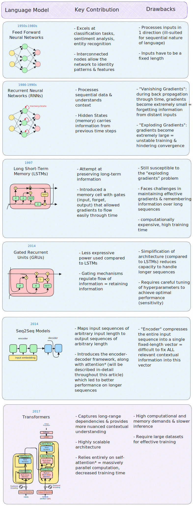

Transformers: More than Meets the Eye

- hw07 #FIXME:URL

# Links

## Transformers & Attention

- [The Illustrated Transformer](https://jalammar.github.io/illustrated-transformer/) — Jay Alammar's visual walkthrough
- [Everything About Transformers](https://www.krupadave.com/articles/everything-about-transformers) — story-driven visual reference
- [Transformer Explainer](https://poloclub.github.io/transformer-explainer/) — interactive tool
- [Attention is All You Need](https://arxiv.org/abs/1706.03762) — the original 2017 paper
- [Attention mechanism paper (2015)](https://arxiv.org/abs/1409.0473) — Bahdanau attention
- [Building Transformers from Scratch](https://vectorfold.studio/blog/transformers) — code-first guide
- [Visual introduction to Attention](https://erdem.pl/2021/05/introduction-to-attention-mechanism)
- [Multi-head attention deep dive](https://towardsdatascience.com/transformers-explained-visually-part-3-multi-head-attention-deep-dive-1c1ff1024853)

## Building GPTs

- [microGPT blog](https://karpathy.github.io/2026/02/12/microgpt/) — 200-line, zero-dependency GPT
- [microGPT visualizer](https://microgpt.boratto.ca) — interactive GPT internals visualization
- [nanoGPT repo](https://github.com/karpathy/nanoGPT) — minimal GPT training code
- [Karpathy's Zero to Hero](https://karpathy.ai/zero-to-hero.html) — neural network video series
- [Let's Build GPT (YouTube)](https://www.youtube.com/watch?v=kCc8FmEb1nY) — building GPT from scratch
- [GPT-2 WebGL visualizer](https://github.com/nathan-barry/gpt2-webgl)

## LLMs

- [List of open source LLMs](https://github.com/eugeneyan/open-llms)
- [GPT (2018) paper](https://s3-us-west-2.amazonaws.com/openai-assets/research-covers/language-unsupervised/language_understanding_paper.pdf)
- [RLHF paper](https://arxiv.org/abs/2203.02155) — Reinforcement Learning from Human Feedback
- [DistilBERT paper](https://arxiv.org/pdf/1910.01108v4.pdf) — knowledge distillation

## Healthcare AI

- [UCSF Versa](https://ai.ucsf.edu/platforms-tools-and-resources/ucsf-versa) — institutional LLM tool (sunsetting soon)
- [UCSF ChatGPT Enterprise](https://ai.ucsf.edu/ucsf-chatgpt-enterprise) — Versa replacement (coming online March 2026)
- [Google Med-PaLM](https://sites.research.google/med-palm/) — medical LLM research
- [Azure Text Analytics for Health](https://learn.microsoft.com/en-us/azure/ai-services/language-service/text-analytics-for-health/overview)

## Prompt Engineering Guides

- **Anthropic**: [docs.anthropic.com/en/docs/build-with-claude/prompt-engineering](https://docs.anthropic.com/en/docs/build-with-claude/prompt-engineering)
- **OpenAI**: [platform.openai.com/docs/guides/prompt-engineering](https://platform.openai.com/docs/guides/prompt-engineering)
- **OpenAI examples**: [platform.openai.com/docs/examples](https://platform.openai.com/docs/examples)

## Where to Play Around

- [Hugging Face NLP Course](https://huggingface.co/learn/nlp-course/chapter3/2?fw=pt)
- [Google Vertex AI](https://cloud.google.com/vertex-ai)
- [OpenAI Platform](https://platform.openai.com/)

# From Neural Networks to Transformers


In Lecture 6 we trained dense networks, CNNs, and LSTMs. LSTMs process sequences one token at a time — _what if we could process them all at once?_

## Word Embeddings (2013)

**word2vec**: Represent words as vectors in high-dimensional space

- Similar words cluster together ("insulin" near "glucose")
- Used **Continuous Bag of Words** and **Skip-gram** algorithms for building context
    - **CBOW**: surrounding words used to predict word in the middle
    - **Skip-gram**: input word used to predict context
- Key idea: words that appear in similar contexts get similar vectors — this notion of "context determines meaning" reappears throughout the transformer story


## Sequence-to-Sequence & RNNs (2014)

**Encoder-decoder architecture**: Transform one sequence into another


- Encoder processes input into fixed representation
- Decoder generates output from that representation
- Used for translation, summarization
- Built on **RNNs** (Recurrent Neural Networks) with sequential processing

### RNNs, LSTM, and Limitations

RNNs introduced "memory" to neural networks — the same innovation as LSTMs in Lecture 6. But they hit two walls:

**1. Vanishing gradients**: Error signals shrink as they propagate backward through time. Early words in a sequence get minimal learning signal. LSTMs improved this with gating mechanisms, but the fundamental issue remained for very long sequences.

**2. Sequential bottleneck**: Must process word-by-word (word 1 → word 2 → word 3...). Cannot parallelize training. Slow and doesn't scale.

## Attention Mechanism (2015)

**Key innovation**: Decoder focuses on specific input parts at each step

- Dynamically weights which inputs matter most
- Solves information bottleneck
- But still used RNNs underneath — attention was an add-on, not a replacement

## Transformers (2017)

**"Attention is All You Need"**: Eliminated sequential processing entirely

- Process entire sequence simultaneously (parallel)
- All tokens relate to all others via attention
- No vanishing gradient problem
- 100x+ training speedup enables web-scale datasets

## The Scale-Up Era (2018–2026)

Once transformers removed the sequential bottleneck, the race was on: bigger models, more data, faster hardware. Each generation unlocked capabilities that the previous generation couldn't achieve — from basic text completion to multi-turn reasoning and tool use. The progression happened faster than anyone predicted.

A few key moments in this timeline:

- **ELMo (2018)** from Allen AI introduced _contextualized_ word embeddings — the same word gets different vectors depending on surrounding context. This was a major step beyond Word2Vec's static vectors.
- **BERT (2018)** from Google used _bidirectional_ training (reading left-to-right AND right-to-left simultaneously) to build deep contextual understanding. BERT dominated NLP benchmarks and became the foundation for most task-specific models.
- **GPT (2018)** from OpenAI took the opposite approach: _unidirectional_ (left-to-right only), trained to predict the next token. This autoregressive design turned out to be the key to generation — and is how all modern LLMs work.
- **T5 (2019)** from Google reframed every NLP task as text-to-text — translation, summarization, classification, and Q&A all use the same "text in, text out" format. This unified approach simplified multi-task training.
- **GPT-3 (2020)** demonstrated that scale alone could produce qualitative leaps: with 175B parameters, it could perform tasks from just a few examples in the prompt (few-shot learning), with no fine-tuning needed.
- **ChatGPT (2022)** combined GPT-3.5 with RLHF (Reinforcement Learning from Human Feedback) — training the model to align with human preferences through a reward signal. This made LLMs conversational and useful to non-technical users, reaching 100M users within two months.
- **Open-weight models** like Meta's Llama series (2023–) made competitive models freely available, enabling local deployment and domain-specific fine-tuning without depending on API providers.

### Reference Card: NLP Model Evolution

| Year        | Innovation                                                       | Organization | Key Insight                                                      |
| :---------- | :--------------------------------------------------------------- | :----------- | :--------------------------------------------------------------- |
| **1997**    | LSTM                                                             | Hochreiter & Schmidhuber | Gating mechanism for long-range memory in sequences |
| **2013**    | Word2Vec                                                         | Google       | Words as vectors; similar meanings cluster together              |
| **2014**    | Seq2Seq / RNNs                                                   | Google       | Encode input → decode output; sequential processing              |
| **2015**    | Attention ([Bahdanau et al.](https://arxiv.org/abs/1409.0473))   | Bengio Lab   | Decoder can focus on relevant input parts dynamically            |
| **2017**    | Transformer ([Vaswani et al.](https://arxiv.org/abs/1706.03762)) | Google       | Attention _is_ the architecture; parallel processing             |
| **2018**    | ELMo, GPT (117M), BERT                                          | Allen AI, OpenAI, Google | Contextualized embeddings; pre-train then fine-tune |
| **2019**    | GPT-2 (1.5B), T5                                                | OpenAI, Google | Coherent generation; all tasks as text-to-text                 |
| **2020**    | GPT-3 (175B)                                                     | OpenAI       | Few-shot learning — examples in the prompt, no retraining        |
| **2022**    | ChatGPT + RLHF                                                   | OpenAI       | Human feedback alignment; 100M users in 2 months                 |
| **2023**    | GPT-4, Llama 2, Claude 2                                         | OpenAI, Meta, Anthropic | Multimodal input; open-weight models             |
| **2024**    | Claude 3.5, Gemini, Llama 3                                      | Anthropic, Google, Meta | 200K+ token context windows; widespread API access |
| **2025–26** | Claude 4, GPT-4o, reasoning models                               | Anthropic, OpenAI, et al. | Agentic workflows; tool use; structured outputs  |

# Transformer Architecture

The foundational paper is [**Attention is All You Need**](https://arxiv.org/abs/1706.03762) (2017), published by researchers at Google. What follows is a condensed overview — these two articles explain the architecture far better than any summary can, and you should read at least one:

- [**The Illustrated Transformer**](https://jalammar.github.io/illustrated-transformer/) — Jay Alammar's step-by-step visual walkthrough
- [**Everything About Transformers**](https://www.krupadave.com/articles/everything-about-transformers) — story-driven visual reference


## The Big Picture

A transformer takes an input sequence and produces an output sequence. The **encoder** reads the entire input at once and builds a rich numerical representation; the **decoder** uses that representation to generate output one token at a time.

The key difference from RNNs: transformers process the entire sequence at once, in parallel. No waiting for word 1 to finish before starting word 2.

The pipeline: **Tokenize → Embed → Add positional encodings → Stack attention layers → Generate output**


The original transformer stacks 6 encoder layers and 6 decoder layers. Each encoder layer has identical structure (self-attention → feed-forward) but learns its own weights. Each decoder layer adds a third sublayer: **cross-attention** that lets the decoder attend to the encoder's output — this is how the decoder knows what the input said.



_From [Everything About Transformers](https://www.krupadave.com/articles/everything-about-transformers) — the full architecture with its evolutionary lineage from RNNs and LSTMs_

## Self-Attention: The Core Innovation

Consider the sentence: _"The animal didn't cross the street because **it** was too tired."_ When processing "it," the model needs to figure out that "it" refers to "the animal" — not "the street."

Self-attention solves this. Each token computes how much it should "attend to" every other token in the sequence. This lets the model capture long-range dependencies directly, without needing to pass information token-by-token through a chain of hidden states.

### How It Works: Query, Key, Value

Think of it like a search engine. For each token, the model creates three vectors:

- **Query (Q)**: What this token is _looking for_ — like what's typed into a search bar
- **Key (K)**: What this token _offers_ to others — like the title of a web page
- **Value (V)**: The actual _content_ to retrieve — like the web page itself

The step-by-step process (following [The Illustrated Transformer](https://jalammar.github.io/illustrated-transformer/)):

1. **Create Q, K, V** — multiply each token's embedding by three learned weight matrices to produce Query, Key, and Value vectors
2. **Score** — compute the dot product of the current token's Query against every token's Key. High dot product = high relevance
3. **Scale** — divide scores by $\sqrt{d_k}$ (the square root of the key dimension) to prevent dot products from growing too large in high dimensions, which would push softmax into regions with tiny gradients
4. **Normalize** — apply **softmax** to convert raw scores into probabilities that sum to 1
5. **Weight** — multiply each Value vector by its softmax score
6. **Sum** — add up the weighted Values to produce the output for this token — a representation that encodes how every other token relates to it


_From [Everything About Transformers](https://www.krupadave.com/articles/everything-about-transformers) — each token's embedding is multiplied by learned weight matrices to produce Query, Key, and Value vectors_

### Reference Card: Scaled Dot-Product Attention

| Component     | Details                                                                           |
| :------------ | :-------------------------------------------------------------------------------- |
| **Formula**   | $\text{Attention}(Q, K, V) = \text{softmax}\left(\frac{QK^T}{\sqrt{d_k}}\right)V$ |
| **Q (Query)** | What we're looking for — "which other tokens matter to me?"                       |
| **K (Key)**   | What each token offers — "here's what I represent"                                |
| **V (Value)** | The actual information to retrieve                                                |
| **Scaling**   | $\sqrt{d_k}$ prevents dot products from growing too large with high dimensions    |

### Code Snippet: Simplified Attention

```python
import numpy as np

def scaled_dot_product_attention(query, key, value):
    """Compute scaled dot-product attention (pure numpy)."""
    d_k = query.shape[-1]
    scores = query @ key.T / np.sqrt(d_k)
    weights = np.exp(scores) / np.exp(scores).sum(axis=-1, keepdims=True)  # softmax
    return weights @ value
```

## Multi-Head Attention

A single attention pass captures one type of relationship. But language has many simultaneous relationships — syntax, semantics, entity references, temporal ordering.

Multi-head attention runs multiple attention operations in parallel, each with its own learned Q/K/V weight matrices. With the sentence _"He swung the bat with incredible force"_: one head might focus on "swung ↔ bat" (action–object), another on "incredible ↔ force" (modifier–noun), and another on resolving that "bat" means a baseball bat, not an animal.

The original transformer uses 8 heads with 512-dimensional embeddings, giving each head 64 dimensions (512 ÷ 8). Too few heads and each must learn too many relationship types; too many and each becomes too small to represent anything meaningful.


_The left and center figures represent different layers / attention heads. The right figure depicts the same layer/head as the center figure, but with the token "lazy" selected._


## Positional Encoding

Unlike RNNs, which inherently know word order (they process sequentially), transformers see the entire input at once — and have no built-in sense of order. "The cat sat on the mat" and "The mat sat on the cat" would look identical.

Positional encodings fix this by adding a unique vector to each token's embedding. The original paper uses sine and cosine functions at different frequencies: low-frequency waves capture broad structure (beginning vs. end of sequence), while high-frequency waves capture fine-grained position (adjacent tokens). Together, they create a unique "positional fingerprint" for every position.


_From [Everything About Transformers](https://www.krupadave.com/articles/everything-about-transformers)_


_From [The Illustrated Transformer](https://jalammar.github.io/illustrated-transformer/) — each row is a position's encoding vector; the pattern of sine (left half) and cosine (right half) creates a unique fingerprint for every position_

## Putting It All Together

### Feed-Forward Networks

After attention, each token independently passes through a two-layer feed-forward network: expand to 4x the embedding dimension, apply a non-linear activation (ReLU or GELU), then project back down to the original dimension. This is where the model detects higher-level features — attention figures out _which_ tokens matter, and the feed-forward network figures out _what to do_ with that information.

### Residual Connections and Layer Normalization

Two mechanisms keep deep transformers trainable:

- **Residual connections** (skip connections): the input to each sublayer is added back to its output. This creates a direct path for gradients to flow through the network — without them, a 6+ layer transformer would be effectively untrainable.
- **Layer normalization**: rescales activations to have mean 0 and variance 1 within each layer, preventing values from exploding or vanishing as they pass through many layers.

Every sublayer follows the same pattern: `LayerNorm(x + Sublayer(x))`.


_From [The Illustrated Transformer](https://jalammar.github.io/illustrated-transformer/) — the Add & Norm pattern wrapping each sublayer_

### Masked Attention in the Decoder

Encoders can attend to the full input sequence (bidirectional). Decoders cannot — when generating token 5, the model must not peek at tokens 6, 7, 8... (they don't exist yet during inference). **Masked self-attention** sets future positions to $-\infty$ before softmax, zeroing out their attention weights. This ensures the decoder is autoregressive: each token can only attend to earlier tokens and itself.


_From [Everything About Transformers](https://www.krupadave.com/articles/everything-about-transformers) — the look-ahead mask prevents the decoder from attending to future positions_

### Reference Card: Transformer Components

| Component                | Purpose                            | Details                                                                       |
| :----------------------- | :--------------------------------- | :---------------------------------------------------------------------------- |
| **Input Embedding**      | Convert tokens to vectors          | Maps discrete tokens to continuous space                                      |
| **Positional Encoding**  | Add order information              | Since attention is order-agnostic, position must be injected                  |
| **Multi-Head Attention** | Learn different relationship types | Each head focuses on different aspects (syntax, semantics, entity references) |
| **Cross-Attention**      | Connect encoder to decoder         | Decoder queries attend to encoder keys/values — "what did the input say?"     |
| **Feed-Forward Network** | Transform representations          | Two-layer network (expand 4x → activate → contract) at each position         |
| **Layer Normalization**  | Stabilize training                 | Rescale activations to mean=0, variance=1 within each layer                   |
| **Residual Connections** | Enable gradient flow               | Skip connections around sublayers; preserve information through deep stacks   |
| **Masking**              | Prevent peeking at future tokens   | Decoder self-attention masks future positions to $-\infty$                    |

Each encoder layer: self-attention → add & normalize → feed-forward → add & normalize. Each decoder layer adds cross-attention between those two steps. Stack 6+ of these layers and you have a transformer.

**Want to explore interactively?** [Transformer Explainer](https://poloclub.github.io/transformer-explainer/) — step through a working transformer model and see what each component does.

## Beyond Text

Transformers aren't just for language. The attention mechanism generalizes to any sequential data:

- **Vision Transformers (ViT)**: images split into patches, each patch treated as a token
- **Time-series**: EHR data, sensor readings, financial sequences
- **Multimodal models**: GPT-4o, Gemini, Claude process text, images, and audio together

The key principle: attention works on any sequence where order and relationships matter.


# Building a GPT from Scratch

Andrej Karpathy's [microGPT](https://karpathy.github.io/2026/02/12/microgpt/) demonstrates that a working GPT can be built in ~200 lines of Python with zero dependencies.


The key pieces:

- **Tokenization** (character-level): split text into individual characters as tokens. Production models use **BPE (Byte Pair Encoding)** instead, which groups common character sequences into subword tokens (~4 characters per token on average). Modern models have context windows of 64K–200K+ tokens — that's the total amount of text the model can "see" at once.
- **Autograd engine**: compute gradients automatically for backpropagation
- **Multi-head attention blocks**: the core transformer layer — self-attention + feedforward
- **Training loop**: forward pass → compute loss (cross-entropy: measures how far predictions are from the correct next token) → backprop → update weights using the Adam optimizer (an adaptive learning rate method)
- **Inference/sampling with temperature**: generate text by repeatedly predicting the next token

The surprising thing: scaling from microGPT to GPT-4 changes the tokenizer (BPE instead of characters), the data (terabytes instead of kilobytes), and the compute (thousands of GPUs) — but the core algorithm doesn't much change.

These models learn from their training data. _All_ of it. Including whatever biases exist in the text. If we're lucky, we might guess at the biases we introduce — but not always.

### Reference Card: GPT Components

| Component            | Details                                                                                                                                               |
| :------------------- | :---------------------------------------------------------------------------------------------------------------------------------------------------- |
| **Tokenizer**        | Splits text into tokens (characters, subwords, or words). BPE is standard for production models.                                                      |
| **Embedding Layer**  | Maps each token to a dense vector + adds positional encoding.                                                                                         |
| **Attention Blocks** | Stacked self-attention + feedforward layers. Each block refines the representation.                                                                   |
| **Output Head**      | Linear layer projecting back to vocabulary size → softmax → next-token probabilities.                                                                 |
| **Training**         | Autoregressive — each token is predicted from all previous tokens (the model never "peeks ahead"): compute cross-entropy loss, backprop, Adam update. |
| **Inference**        | Sample from output distribution. Temperature controls randomness (0 = greedy, 1 = diverse).                                                           |

### Code Snippet: Attention Block with Learned Projections

The earlier attention snippet took pre-computed Q, K, V as inputs. In a real transformer, the model _learns_ how to create Q, K, V from the input — that's what the weight matrices do:

```python
import numpy as np

class AttentionBlock:
    """Single-head attention with learned Q/K/V projections."""
    def __init__(self, dim):
        self.wq = np.random.randn(dim, dim) * 0.02  # learned query projection
        self.wk = np.random.randn(dim, dim) * 0.02  # learned key projection
        self.wv = np.random.randn(dim, dim) * 0.02  # learned value projection

    def forward(self, x):
        # Project input into Q, K, V spaces (this is what the model learns)
        q, k, v = x @ self.wq, x @ self.wk, x @ self.wv
        scores = q @ k.T / np.sqrt(x.shape[-1])
        weights = np.exp(scores) / np.exp(scores).sum(axis=-1, keepdims=True)
        return weights @ v
```

**Resources:**

- [microGPT Explainer blog](https://karpathy.github.io/2026/02/12/microgpt/)
- [microGPT in a single web page](https://karpathy.ai/microgpt.html)
- [microGPT visualizer](https://microgpt.boratto.ca) — interactive visualization of GPT internals
- Older Karpathy
    - [Let's Build GPT](https://www.youtube.com/watch?v=kCc8FmEb1nY) — Karpathy's video walkthrough
    - [nanoGPT repo](https://github.com/karpathy/nanoGPT) — minimal GPT training code

# LIVE DEMO!


# Embeddings

Embeddings map discrete tokens (words, sentences, documents) to continuous vectors where **meaning is geometry**. Similar items cluster together; relationships become directions in space.


This idea connects back to Lecture 4's word vectors — but modern embedding models go far beyond individual words. If you've seen autoencoders (Lecture 6), the concept is related: an autoencoder compresses input into a compact **latent space** representation, then reconstructs the original. Embeddings are the same idea applied to discrete inputs — the model learns to place similar items near each other in a continuous space, creating a compressed representation that captures meaning rather than raw features.

Embeddings aren't limited to text, either. In recommendation systems, users and items can share an embedding space — a patient's preferences and a treatment's characteristics become vectors whose proximity predicts relevance. Drug interactions, diagnostic codes, and categorical variables can all be embedded the same way. Anywhere you have discrete categories with hidden relationships, embeddings can surface them.


_Semantic similarity in embedding space: "king" - "man" + "woman" ≈ "queen" — geometry captures analogies_

## From Words to Sentences

| Method                                                             | What It Embeds            | Key Properties                                                |
| :----------------------------------------------------------------- | :------------------------ | :------------------------------------------------------------ |
| **Word2Vec** (2013)                                                | Individual words          | Skip-gram / CBOW; similar words cluster together              |
| **GloVe** (Global Vectors)                                         | Individual words          | Global co-occurrence statistics; pre-trained on large corpora |
| **FastText**                                                       | Subwords → words          | Handles out-of-vocabulary words via character n-grams         |
| **BERT** (Bidirectional Encoder Representations from Transformers) | Words in context          | Same word gets different vectors in different sentences       |
| **Sentence Transformers**                                          | Full sentences/paragraphs | Purpose-built for similarity tasks; fixed-size output vectors |

The key evolution: Word2Vec gives one vector per word regardless of context. BERT and Sentence Transformers give _contextualized_ embeddings — "bank" near "river" gets a different vector than "bank" near "money." This matters in clinical text, where abbreviations like "PT" can mean "physical therapy," "prothrombin time," or "patient" depending on context.

## Practical Usage

Embeddings enable a family of powerful applications:

- **Semantic search**: Find documents by meaning, not just keywords — "cardiac symptoms" matches "chest pain and shortness of breath"
- **Document clustering**: Group related documents automatically
- **Similarity matching**: Find duplicates, related items, or near-misses
- **Anomaly detection**: Identify outliers in embedding space
- **Classification features**: Use embeddings as input to downstream models

### Reference Card: Common Embedding Methods

| Method                     | Description                                          | Use Cases                      |
| :------------------------- | :--------------------------------------------------- | :----------------------------- |
| **Word2Vec**               | Skip-gram or CBOW to learn word vectors              | Text similarity, analogy tasks |
| **GloVe** (Global Vectors) | Global vectors from co-occurrence statistics         | Pre-trained embeddings for NLP |
| **FastText**               | Subword embeddings (handles out-of-vocabulary words) | Morphologically rich languages |
| **BERT**                   | Contextualized embeddings from transformers          | State-of-the-art NLP tasks     |
| **Sentence Transformers**  | Full sentence/paragraph embeddings                   | Semantic search, clustering    |

### Reference Card: `SentenceTransformer`

| Component          | Details                                                       |
| :----------------- | :------------------------------------------------------------ |
| **Library**        | `sentence-transformers` (`pip install sentence-transformers`) |
| **Purpose**        | Generate dense vector embeddings for sentences/paragraphs     |
| **Key Method**     | `model.encode(sentences)` — returns numpy array of embeddings |
| **Popular Models** | `all-MiniLM-L6-v2` (fast), `all-mpnet-base-v2` (accurate)     |
| **Output**         | Fixed-size vectors (e.g., 384 or 768 dimensions)              |

### Reference Card: `cosine_similarity`

| Component    | Details                                                                           |
| :----------- | :-------------------------------------------------------------------------------- |
| **Function** | `sklearn.metrics.pairwise.cosine_similarity()`                                    |
| **Purpose**  | Measure similarity between vectors (1 = identical, 0 = orthogonal, -1 = opposite) |
| **Input**    | Two arrays of shape (n_samples, n_features)                                       |
| **Use Case** | Compare embeddings to find semantically similar texts                             |

### Code Snippet: Computing and Comparing Embeddings

```python
from sentence_transformers import SentenceTransformer
from sklearn.metrics.pairwise import cosine_similarity

model = SentenceTransformer('all-MiniLM-L6-v2')

# Clinical documents
docs = [
    "Patient presents with chest pain and shortness of breath",
    "Lab results show elevated troponin levels",
    "Patient reports headache and nausea",
]

embeddings = model.encode(docs)

# Find most similar to a query
query_emb = model.encode(["cardiac symptoms"])
similarities = cosine_similarity(query_emb, embeddings)[0]

for doc, sim in sorted(zip(docs, similarities), key=lambda x: -x[1]):
    print(f"{sim:.3f}  {doc}")
```

## Vector Databases

A "vector database" is used for production applications of embeddings with many "documents" (whatever the unit of analysis is) — a data store optimized for similarity search over embedding vectors.

### Reference Card: Vector Database Options

| Database                                  | Type                 | Strengths                        |
| :---------------------------------------- | :------------------- | :------------------------------- |
| **ChromaDB**                              | In-memory/persistent | Simple API, good for prototyping |
| **FAISS** (Facebook AI Similarity Search) | In-memory            | Fast, scalable, from Meta AI     |
| **Pinecone**                              | Cloud service        | Managed, production-ready        |
| **Weaviate**                              | Self-hosted/cloud    | Full-text + vector search        |
| **pgvector**                              | PostgreSQL extension | Integrate with existing DB       |

### Code Snippet: ChromaDB Vector Search

```python
import chromadb
from sentence_transformers import SentenceTransformer

model = SentenceTransformer('all-MiniLM-L6-v2')
client = chromadb.Client()
collection = client.create_collection("clinical_notes")

# Add documents
documents = ["Note 1...", "Note 2...", "Note 3..."]
collection.add(
    documents=documents,
    ids=[f"doc_{i}" for i in range(len(documents))],
    embeddings=model.encode(documents).tolist()
)

# Query
results = collection.query(
    query_embeddings=model.encode(["chest pain symptoms"]).tolist(),
    n_results=3
)
```

We'll use vector databases again in Lecture 8 when we build RAG pipelines.


# LLMs and General-Purpose Models

Recent years have seen the emergence of large language models (LLMs) like GPT-4, Claude, and Gemini — massive, **general-purpose models** capable of understanding and generating human-like text across a wide range of tasks. This represents a paradigm shift: instead of training a separate model for each task (one for translation, another for summarization, another for classification), a single model pre-trained on a vast corpus of text can be adapted to any of these tasks with minimal effort.

What makes them "general purpose"? Pre-training on enormous text corpora gives them broad knowledge and **emergent capabilities** — abilities that weren't explicitly trained but arise from scale. The same model can translate, summarize, classify, write code, and reason about problems. These capabilities improve unpredictably as models get larger, which is why the field has pushed toward ever-bigger models (GPT-1's 117M parameters → GPT-2's 1.5B → GPT-3's 175B → GPT-4's undisclosed but much larger count).

The practical consequence: you no longer need to build a custom NLP pipeline for every new task. A well-crafted prompt to a general-purpose model often matches or exceeds the performance of a task-specific model that took weeks to train — especially when you don't have large labeled datasets (which is common in healthcare).


## Fine-Tuning vs Prompt Engineering

Two approaches to adapting an LLM to the task:

| Approach                            | When to Use                             | Effort          | Cost   |
| :---------------------------------- | :-------------------------------------- | :-------------- | :----- |
| **Prompting** (recommended default) | Most tasks; fast iteration              | Minutes to test | Lower  |
| **Fine-tuning** (specialized cases) | Specialized vocabulary, domain patterns | Days–weeks      | Higher |

**Prompting** is almost always the right starting point — you can test ideas in minutes and iterate quickly. Save **fine-tuning** for cases where you need a model to learn specialized vocabulary or patterns (e.g., pathology report terminology, rare disease phenotypes) and you have hundreds or thousands of labeled examples to train on.

### Reference Card: Fine-Tuning with Hugging Face

| Component       | Details                                          |
| :-------------- | :----------------------------------------------- |
| **Purpose**     | Adapt pre-trained model to specific task/domain  |
| **Data Needed** | 100s–1000s labeled examples typically            |
| **Key Classes** | `Trainer`, `TrainingArguments`, `AutoModel`      |
| **When to Use** | Specialized vocabulary, domain-specific patterns |
| **Alternative** | Prompt engineering (faster, no training)         |

### Code Snippet: Fine-Tuning a GPT

```python
from transformers import GPT2Tokenizer, GPT2LMHeadModel, Trainer, TrainingArguments
from datasets import Dataset

tokenizer = GPT2Tokenizer.from_pretrained('gpt2')
tokenizer.pad_token = tokenizer.eos_token
model = GPT2LMHeadModel.from_pretrained('gpt2')

# Tokenize and wrap in a Dataset (Trainer requires this format)
texts = ["Clinical notes about diabetes management", "More clinical text about hypertension"]
tokenized = tokenizer(texts, padding=True, truncation=True, return_tensors="pt")
tokenized["labels"] = tokenized["input_ids"].clone()
dataset = Dataset.from_dict({k: v.tolist() for k, v in tokenized.items()})

training_args = TrainingArguments(
    output_dir="./results",
    num_train_epochs=3,
    per_device_train_batch_size=4,
)

trainer = Trainer(model=model, args=training_args, train_dataset=dataset)
trainer.train()
```

## Hallucination

There is no general solution to preventing model hallucination — think of it like regression extrapolating beyond training data. When the model encounters inputs outside its training distribution, it doesn't say "I don't know." It confidently generates plausible-sounding text that may be completely wrong.

Mitigations exist but none are foolproof:

- **RAG (Retrieval-Augmented Generation)**: Ground the model's responses in actual documents (covered in Lecture 8)
- **Prompt and output design**: Constrain what the model can say — structured outputs, schema enforcement, explicit instructions to cite sources
- **Human-in-the-loop**: Expert review of outputs, especially for high-stakes decisions

We'll cover failure modes and defenses in depth in Lecture 8.

!!! warning
If you don't know how to do something yourself, you won't know if an LLM is doing it well. LLMs amplify expertise — they don't replace it.

# LIVE DEMO!!

# Prompt Engineering

Prompt engineering crafts input prompts that guide models to produce desired outputs — effectively "programming" the model without retraining.

A useful template for structuring prompts:

```
[ROLE]        Who the model should act as
[TASK]        What needs to be done
[FORMAT]      How to structure the output
[CONSTRAINTS] Boundaries and requirements
[EXAMPLES]    Concrete input/output pairs
```

Not every prompt needs all five sections, but thinking in these terms helps craft more effective prompts.

## Zero-Shot, One-Shot, and Few-Shot Learning

One of the most remarkable capabilities of LLMs is performing tasks they were never explicitly trained on. A **zero-shot** prompt describes only the task — no examples. **One-shot** gives a single example to establish the pattern. **Few-shot** provides 2–5 examples, which is often enough for the model to learn complex output formats or domain-specific conventions.

The more ambiguous or structured the task, the more examples help. For simple classification ("is this positive or negative?"), zero-shot often suffices. For extracting structured JSON from clinical notes, a few-shot prompt with representative examples dramatically improves consistency.

### Reference Card: Prompting Techniques

| Technique            | Description                                               | When to Use                                        |
| :------------------- | :-------------------------------------------------------- | :------------------------------------------------- |
| **Zero-shot**        | Task description only, no examples                        | Simple, well-defined tasks                         |
| **One-shot**         | Single example provided                                   | When pattern is clear from one case                |
| **Few-shot**         | 2–5 examples provided                                     | Complex patterns, structured output                |
| **Chain-of-thought** | Ask model to show reasoning step-by-step before answering | Multi-step reasoning tasks (expanded in Lecture 8) |

### Code Snippet: Few-Shot Prompting

```python
prompt = """Extract diagnoses from clinical notes.

Example 1:
Note: "Patient presents with elevated blood glucose and polyuria."
Diagnosis: Type 2 Diabetes Mellitus

Example 2:
Note: "Chest pain radiating to left arm, elevated troponin."
Diagnosis: Acute Myocardial Infarction

Now extract the diagnosis:
Note: "Patient has persistent cough, fever, and infiltrates on chest X-ray."
Diagnosis:"""
```

## Structured Responses

A **structured response** is output that follows a specific, machine-readable format — JSON, XML, or a table — rather than free-form text.

The traditional approach — parsing free text with regex — is fragile and error-prone. Structured outputs let the model guarantee schema conformance, giving simpler prompts, reliable downstream processing, and enforceable output formats via function calling.


### Structured Outputs in Health Data Science

- **Reliability:** Structured outputs are easier to validate and less prone to hallucination
- **Interoperability:** Can be directly consumed by other systems (EHRs, analytics pipelines)
- **Automation:** Enables downstream processing — automated coding, reporting, alerting
- **Auditability:** Easier to check for missing or inconsistent information

### How to get structured responses

- Use **schema-based prompting**: "Provide an answer in the following JSON format: { ... }"
- Be explicit about required fields and data types
- Validate the output programmatically

### Reference Card: Structured Output Prompting

| Component             | Details                                    |
| :-------------------- | :----------------------------------------- |
| **Schema Definition** | Explicitly define JSON structure in prompt |
| **Required Fields**   | List all mandatory fields with types       |
| **Validation**        | Parse and validate output programmatically |
| **Fallback**          | Handle parsing errors gracefully           |

### Code Snippet: Schema-Based Prompting

```python
prompt = """Extract the following information from the clinical note and return it as JSON:
{
  "diagnosis": "<primary diagnosis>",
  "confidence": <0.0-1.0>,
  "icd_code": "<ICD-10 code if known>",
  "reasoning": "<brief explanation>"
}

Clinical Note: "65-year-old male with chest pain, ST elevation in leads V1-V4,
troponin elevated at 2.5 ng/mL. Cardiology consulted for emergent catheterization."
"""
```


# LLM API Integration

## API Access Patterns


- **REST APIs**: HTTP endpoints that accept JSON payloads containing your prompt and parameters, returning generated text
- **SDKs (Software Development Kits)**: Client libraries like OpenAI Python and Anthropic SDK provide convenient wrappers; OpenAI-compatible providers (OpenRouter, Together, etc.) reuse the same SDK with a different `base_url`
- **Authentication**: API keys stored securely as environment variables or in a secrets manager

### Reference Card: LLM API Providers

| Provider       | Models                         | Strengths                                                  |
| :------------- | :----------------------------- | :--------------------------------------------------------- |
| **OpenAI**     | GPT-4o, o1, o3                 | Best general-purpose, function calling, structured outputs |
| **Anthropic**  | Claude 4, Claude 4.5           | Long context, safety focus, tool use                       |
| **Google**     | Gemini                         | Multimodal, large context                                  |
| **OpenRouter** | All of the above + open models | OpenAI-compatible SDK, cheap, wide model selection         |

### Code Snippet: OpenAI API

```python
from openai import OpenAI

client = OpenAI()  # Uses OPENAI_API_KEY env var

response = client.chat.completions.create(
    model="gpt-4o-mini",
    messages=[
        {"role": "system", "content": "You are a helpful medical assistant."},
        {"role": "user", "content": "What are the symptoms of diabetes?"}
    ],
    max_tokens=150
)

print(response.choices[0].message.content)
```

### Code Snippet: OpenRouter (OpenAI-Compatible)

OpenRouter aggregates models from every major provider behind a single OpenAI-compatible API. You use the same `openai` SDK — just change the `base_url`.

```python
import os
from openai import OpenAI

client = OpenAI(
    base_url="https://openrouter.ai/api/v1",
    api_key=os.environ["OPENROUTER_API_KEY"],
)

response = client.chat.completions.create(
    model="anthropic/claude-sonnet-4",  # or "openai/gpt-4o-mini", etc.
    messages=[
        {"role": "system", "content": "You are a helpful medical assistant."},
        {"role": "user", "content": "Summarize: Patient presents with chest pain and elevated troponin."}
    ],
    max_tokens=150
)

print(response.choices[0].message.content)
```


## Function Calling

Modern LLM APIs support **function calling** (also called **tool use**) — you define functions the model can invoke, and the model decides when and how to call them. This is different from structured outputs (where the model formats its response as JSON). With function calling, the model actually _requests that your code execute a function_ and returns the arguments it wants to pass.

- The model chooses which function to call and with what arguments
- Your code executes the function and returns the result to the model
- Enables LLMs to interact with external systems — databases, calculators, APIs
- In healthcare: the model extracts data from text and calls a function with typed, validated arguments

### Reference Card: Function Calling

| Component           | Details                               |
| :------------------ | :------------------------------------ |
| **Purpose**         | Enforce structured output schema      |
| **Definition**      | JSON schema with properties and types |
| **Required Fields** | Specify mandatory fields in schema    |
| **Validation**      | Model attempts to conform to schema   |

### Code Snippet: Function Calling

```python
tools = [
    {
        "type": "function",
        "function": {
            "name": "extract_diagnosis",
            "parameters": {
                "type": "object",
                "properties": {
                    "diagnosis": {"type": "string"},
                    "confidence": {"type": "number"},
                    "reasoning": {"type": "string"}
                },
                "required": ["diagnosis", "confidence", "reasoning"]
            }
        }
    }
]

response = client.chat.completions.create(
    model="gpt-4o",
    messages=[{"role": "user", "content": "Extract the diagnosis from this note..."}],
    tools=tools,
    tool_choice={"type": "function", "function": {"name": "extract_diagnosis"}}
)
```

## Building a Complete LLM Chat Application

When building applications that interact with LLMs, wrap the API in a reusable client class that handles conversation history, retries, and error handling. This separates API communication from application logic — the same client can power a CLI, a web app, or a batch pipeline.

### Code Snippet: LLM Client Class

```python
import time
import logging
from openai import OpenAI

class LLMClient:
    """Client for interacting with LLM APIs."""

    def __init__(self, model="gpt-4o-mini", max_retries=3):
        self.client = OpenAI()
        self.model = model
        self.max_retries = max_retries
        self.history = []

    def chat(self, message, system_prompt=None):
        """Send a message and get a response, with retry logic."""
        if system_prompt and not self.history:
            self.history.append({"role": "system", "content": system_prompt})
        self.history.append({"role": "user", "content": message})

        for attempt in range(self.max_retries):
            try:
                response = self.client.chat.completions.create(
                    model=self.model, messages=self.history
                )
                reply = response.choices[0].message.content
                self.history.append({"role": "assistant", "content": reply})
                return reply
            except Exception as e:
                logging.error(f"Attempt {attempt + 1} failed: {e}")
                time.sleep(2 ** attempt)

        return "Error generating response."
```

## Error Handling Best Practices

The `LLMClient` above demonstrates the key pattern: retry with exponential backoff. Beyond that:

- **Rate limiting**: Most providers return HTTP 429 when you exceed rate limits — back off and retry
- **Timeout handling**: Set appropriate timeouts; long prompts or large `max_tokens` can take 30+ seconds
- **Response validation**: Always check that the response structure matches expectations before using it
- **Cost management**: Monitor token usage (`response.usage.total_tokens`) and set budgets — a runaway loop can burn through credits quickly

# LIVE DEMO!!!
