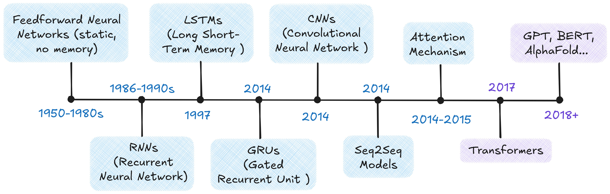
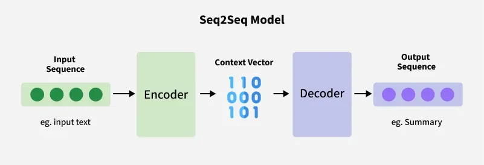
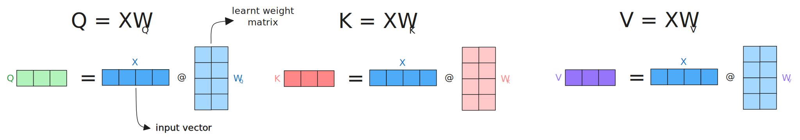
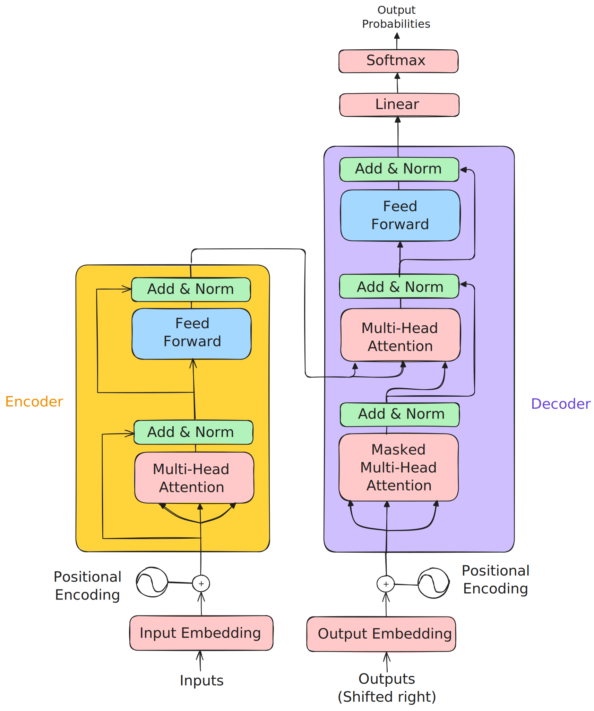
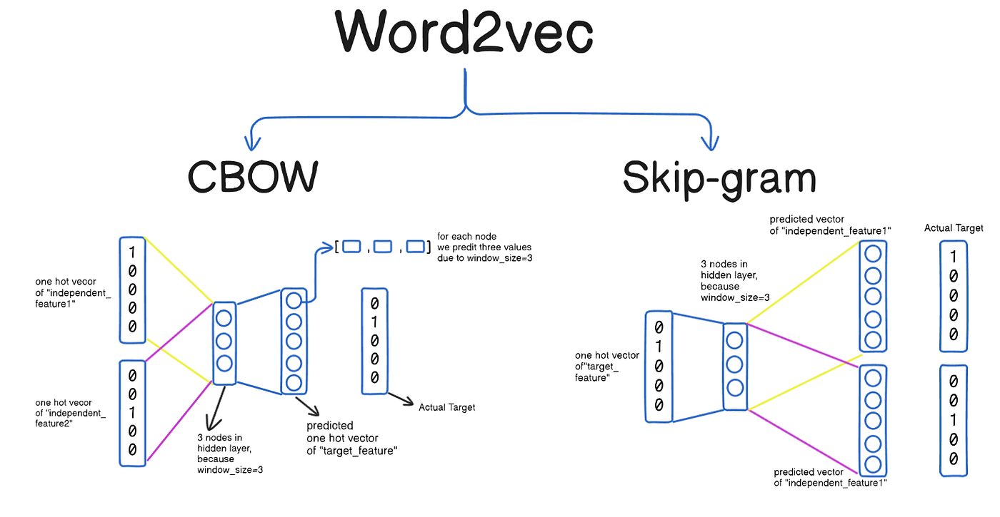
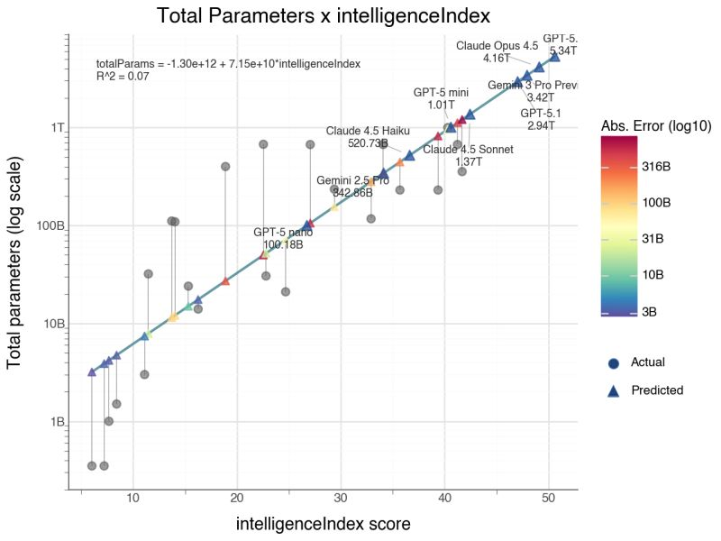
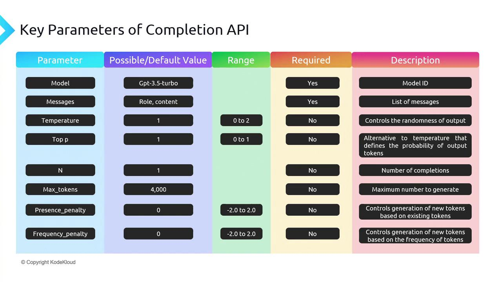

Transformers: More than Meets the Eye

- hw07 #FIXME:URL

# Links

## Transformers & Attention

- [The Illustrated Transformer](https://jalammar.github.io/illustrated-transformer/) — Jay Alammar's visual walkthrough
- [Everything About Transformers](https://www.krupadave.com/articles/everything-about-transformers) — story-driven visual reference
- [Transformer Explainer](https://poloclub.github.io/transformer-explainer/) — interactive tool
- [Attention is All You Need](https://arxiv.org/abs/1706.03762) — the original 2017 paper
- [Attention mechanism paper (2015)](https://arxiv.org/abs/1409.0473) — Bahdanau attention
- [Building Transformers from Scratch](https://vectorfold.studio/blog/transformers) — code-first guide
- [Visual introduction to Attention](https://erdem.pl/2021/05/introduction-to-attention-mechanism)
- [Multi-head attention deep dive](https://towardsdatascience.com/transformers-explained-visually-part-3-multi-head-attention-deep-dive-1c1ff1024853)

## Building GPTs

- [microGPT blog](https://karpathy.github.io/2026/02/12/microgpt/) — 200-line, zero-dependency GPT
- [microGPT visualizer](https://microgpt.boratto.ca) — interactive GPT internals visualization
- [nanoGPT repo](https://github.com/karpathy/nanoGPT) — minimal GPT training code
- [Karpathy's Zero to Hero](https://karpathy.ai/zero-to-hero.html) — neural network video series
- [Let's Build GPT (YouTube)](https://www.youtube.com/watch?v=kCc8FmEb1nY) — building GPT from scratch
- [GPT-2 WebGL visualizer](https://github.com/nathan-barry/gpt2-webgl)

## LLMs

- [Post-Chatbot Era (The Atlantic)](https://www.theatlantic.com/technology/2026/02/post-chatbot-claude-code-ai-agents/686029/) — zeitgeist piece on where AI is heading
- [List of open source LLMs](https://github.com/eugeneyan/open-llms)
- [GPT (2018) paper](https://s3-us-west-2.amazonaws.com/openai-assets/research-covers/language-unsupervised/language_understanding_paper.pdf)
- [RLHF paper](https://arxiv.org/abs/2203.02155) — Reinforcement Learning from Human Feedback
- [DistilBERT paper](https://arxiv.org/pdf/1910.01108v4.pdf) — knowledge distillation

## Healthcare AI

- [UCSF Versa](https://ai.ucsf.edu/platforms-tools-and-resources/ucsf-versa) — institutional LLM tool (sunsetting soon)
- [UCSF ChatGPT Enterprise](https://ai.ucsf.edu/ucsf-chatgpt-enterprise) — Versa replacement (coming online March 2026)
- [Google Med-PaLM](https://sites.research.google/med-palm/) — medical LLM research
- [Azure Text Analytics for Health](https://learn.microsoft.com/en-us/azure/ai-services/language-service/text-analytics-for-health/overview)

## Prompt Engineering Guides

- **Anthropic**: [docs.anthropic.com/en/docs/build-with-claude/prompt-engineering](https://docs.anthropic.com/en/docs/build-with-claude/prompt-engineering)
- **OpenAI**: [platform.openai.com/docs/guides/prompt-engineering](https://platform.openai.com/docs/guides/prompt-engineering)
- **OpenAI examples**: [platform.openai.com/docs/examples](https://platform.openai.com/docs/examples)

## Where to Play Around

- [Hugging Face NLP Course](https://huggingface.co/learn/nlp-course/chapter3/2?fw=pt)
- [Google Vertex AI](https://cloud.google.com/vertex-ai)
- [OpenAI Platform](https://platform.openai.com/)

# From Neural Networks to Transformers







## The Scale-Up Era (2018–)

- **ELMo (2018)**: contextualized word embeddings — same word, different vector depending on context
- **BERT (2018)**: bidirectional training; dominated NLP benchmarks
- **GPT (2018)**: unidirectional, predict-the-next-token — the design behind all modern LLMs
- **T5 (2019)**: every NLP task as text-to-text
- **GPT-3 (2020)**: 175B parameters; few-shot learning from examples in the prompt alone
- **ChatGPT (2022)**: GPT-3.5 + RLHF; 100M users in two months
- **Open-weight models** (2023–): Llama, Mistral — competitive models you can run locally
- **Reasoning models** (2024–): o1/o3, DeepSeek-R1 — chain-of-thought at inference time
- **Agentic AI** (2025–): models that use tools, write code, and orchestrate multi-step workflows

# Transformer Architecture

## The Problem: Processing Everything at Once

Transformers process the full sequence in parallel, but that creates a new problem: **how does any token know about any other token?** The answer is **attention**.

The original transformer uses an **encoder-decoder** structure:

- **Encoder**: reads the entire input, builds a rich representation
- **Decoder**: uses that representation to generate output one token at a time
- Both are stacks of 6 identical layers (same structure, different learned weights)
- Pipeline: **Tokenize → Embed → Add positional encodings → Stack attention layers → Generate output**

## Self-Attention: Letting Tokens Talk

_"The animal didn't cross the street because **it** was too tired."_ — what does "it" refer to? Self-attention lets every token compute how much it should attend to every other token, resolving this in a single step.

### How It Works: Query, Key, Value

For each token, the model creates three vectors from learned weight matrices:

- **Query (Q)**: What this token is _looking for_
- **Key (K)**: What this token _offers_ to others
- **Value (V)**: The actual _content_ to retrieve

For a 3-token input — "cat," "sat," "mat" — each embedding is multiplied by learned weight matrices $W_Q$, $W_K$, $W_V$ to produce Q, K, V vectors. From the perspective of "cat":

1. **Score**: Compute the dot product of $Q_\text{cat}$ against every token's Key:
    - $Q_\text{cat} \cdot K_\text{cat} = 112$, $Q_\text{cat} \cdot K_\text{sat} = 96$, $Q_\text{cat} \cdot K_\text{mat} = 78$
2. **Scale**: Divide by $\sqrt{d_k} = \sqrt{4} = 2$: scores become $56, 48, 39$
3. **Softmax** (convert scores to probabilities summing to 1): $[0.73, 0.22, 0.05]$ — "cat" attends mostly to itself and somewhat to "sat"
4. **Weighted sum**: $0.73 \cdot V_\text{cat} + 0.22 \cdot V_\text{sat} + 0.05 \cdot V_\text{mat}$ — a new representation of "cat" that blends information from the whole sequence

Repeat for every token. That's self-attention.



### Code Snippet: Simplified Attention

```python
import numpy as np

def scaled_dot_product_attention(query, key, value):
    """Compute scaled dot-product attention (pure numpy)."""
    d_k = query.shape[-1]
    scores = query @ key.T / np.sqrt(d_k)
    weights = np.exp(scores) / np.exp(scores).sum(axis=-1, keepdims=True)  # softmax
    return weights @ value
```

## Multi-Head Attention

Language has many simultaneous relationships — syntax, semantics, entity references, temporal ordering. Multi-head attention runs multiple attention operations in parallel, each with its own learned Q/K/V matrices, so each head can specialize.

- 8 heads, 512-dim embeddings → 64 dims per head
- Results are concatenated and projected back to full dimension


_The left and center figures represent different layers / attention heads. The right figure depicts the same layer/head as the center figure, but with the token "lazy" selected._


## Putting It Together



**How training works**: The encoder reads the source sequence; the decoder generates the target one token at a time. **Cross-attention** bridges the two: the decoder's queries attend to the encoder's keys and values. Cross-entropy loss measures prediction error, gradients flow back, and the Adam optimizer updates weights. Repeat over billions of examples.

### Reference Card: Transformer Components

| Component                | What Problem It Solves                 | Details                                                                       |
| :----------------------- | :------------------------------------- | :---------------------------------------------------------------------------- |
| **Input Embedding**      | Discrete tokens → continuous space     | Maps each token to a dense vector the network can process                     |
| **Positional Encoding**  | Attention is order-agnostic            | Injects position information so the model can distinguish word order          |
| **Multi-Head Attention** | Single attention can't specialize      | Each head focuses on different aspects (syntax, semantics, entity references) |
| **Cross-Attention**      | Decoder needs to read the input        | Decoder queries attend to encoder keys/values — "what did the input say?"     |
| **Feed-Forward Network** | Attention blends but can't transform   | Two-layer network (expand 4x, activate, contract) applied at each position    |
| **Layer Normalization**  | Deep networks have unstable signals    | Rescale activations to mean=0, variance=1 within each layer                   |
| **Residual Connections** | Deep networks have vanishing gradients | Skip connections create gradient highways through the full stack              |
| **Masking**              | Decoder can't peek at future tokens    | Sets future positions to $-\infty$ before softmax                             |

## Beyond Text

- **Vision Transformers (ViT)**: images split into patches, each patch treated as a token
- **Time-series**: EHR data, sensor readings, financial sequences
- **Protein structure**: AlphaFold uses attention over amino acid sequences
- **Multimodal models**: GPT-4o, Gemini, Claude process text, images, and audio together

# Building a GPT from Scratch

A working GPT in ~200 lines of Python — Karpathy's [microGPT](https://karpathy.github.io/2026/02/12/microgpt/).


| Band | What It Does |
| :--- | :--- |
| **Autograd Engine** (orange) | Gradient-tracking machinery that powers backpropagation |
| **Input** | Raw text → characters → integer token IDs |
| **Embeddings** | Token embedding + position embedding (input embedding + positional encoding) |
| **Normalization** | Layer norm (RMSNorm) — the "Add & Norm" pattern |
| **Transformer Block** (×`n_layer`) | Multi-head self-attention (4 heads × 16 dims) → MLP (feed-forward) with residual connections |
| **Output Head** | Linear projection from embedding dim → vocabulary size (27 chars) |
| **Prediction** | Softmax → next-token probabilities |
| **Training** | Cross-entropy loss (how wrong?) → backprop → Adam optimizer updates weights |
| **Inference** | Sample from probability distribution; temperature controls randomness |

**Tokenization**: microGPT uses characters. Production models use **BPE (Byte Pair Encoding)** — subword tokens averaging ~4 characters each. Modern context windows: 64K–200K+ tokens.

Scaling to GPT-4 changes the tokenizer, the data (terabytes), and the compute (thousands of GPUs) — but the core algorithm is the same.

# LIVE DEMO!


# Embeddings

Embeddings map discrete tokens to continuous vectors where **meaning is geometry**. Similar items cluster together; relationships become directions.



_Word2Vec's two training approaches: CBOW predicts a target word from context; Skip-gram predicts context from a target word_

The idea generalizes beyond text — recommendation systems, drug interactions, diagnostic codes, and categorical variables can all be embedded.


_"king" − "man" + "woman" ≈ "queen" — geometry captures analogies_

Key applications: semantic search, document clustering, similarity matching, anomaly detection, classification features.

### Reference Card: Common Embedding Methods

| Method | Type | Key Characteristic |
| :--- | :--- | :--- |
| **Word2Vec** | Word-level, static | Learned from co-occurrence; fast to train |
| **GloVe** (Global Vectors) | Word-level, static | Factorizes co-occurrence matrix; similar to Word2Vec |
| **FastText** | Subword-level, static | Character n-grams handle misspellings and rare words |
| **Sentence Transformers** | Sentence-level, contextual | Same word gets different vectors by context; purpose-built for similarity |

## Sentence Transformers

**Sentence Transformers** produce fixed-size vectors for full sentences — _contextualized_ embeddings where "bank" near "river" gets a different vector than "bank" near "money."

### Reference Card: `SentenceTransformer`

| Component          | Details                                                       |
| :----------------- | :------------------------------------------------------------ |
| **Library**        | `sentence-transformers` (`pip install sentence-transformers`) |
| **Purpose**        | Generate dense vector embeddings for sentences/paragraphs     |
| **Key Method**     | `model.encode(sentences)` — returns numpy array of embeddings |
| **Popular Models** | `all-MiniLM-L6-v2` (fast), `all-mpnet-base-v2` (accurate)     |
| **Output**         | Fixed-size vectors (e.g., 384 or 768 dimensions)              |

## Cosine Similarity

Measures the angle between two vectors, ignoring magnitude.

### Reference Card: `cosine_similarity`

| Component    | Details                                                                           |
| :----------- | :-------------------------------------------------------------------------------- |
| **Function** | `sklearn.metrics.pairwise.cosine_similarity()`                                    |
| **Purpose**  | Measure similarity between vectors (1 = identical, 0 = orthogonal, -1 = opposite) |
| **Input**    | Two arrays of shape (n_samples, n_features)                                       |
| **Use Case** | Compare embeddings to find semantically similar texts                             |

### Code Snippet: Computing and Comparing Embeddings

```python
from sentence_transformers import SentenceTransformer
from sklearn.metrics.pairwise import cosine_similarity

model = SentenceTransformer('all-MiniLM-L6-v2')

# Clinical documents
docs = [
    "Patient presents with chest pain and shortness of breath",
    "Lab results show elevated troponin levels",
    "Patient reports headache and nausea",
]

embeddings = model.encode(docs)

# Find most similar to a query
query_emb = model.encode(["cardiac symptoms"])
similarities = cosine_similarity(query_emb, embeddings)[0]

for doc, sim in sorted(zip(docs, similarities), key=lambda x: -x[1]):
    print(f"{sim:.3f}  {doc}")
```

## Vector Databases

Stores and indexes embedding vectors for fast similarity search at scale.

### Reference Card: Vector Database Options

| Database                                  | Type                 | Strengths                        |
| :---------------------------------------- | :------------------- | :------------------------------- |
| **ChromaDB**                              | In-memory/persistent | Simple API, good for prototyping |
| **FAISS** (Facebook AI Similarity Search) | In-memory            | Fast, scalable, from Meta AI     |
| **Pinecone**                              | Cloud service        | Managed, production-ready        |
| **Weaviate**                              | Self-hosted/cloud    | Full-text + vector search        |
| **pgvector**                              | PostgreSQL extension | Integrate with existing DB       |

### Code Snippet: Vector Database with ChromaDB

```python
import chromadb

client = chromadb.Client()
collection = client.create_collection("clinical_notes")

# Add documents (ChromaDB handles embedding automatically)
collection.add(
    documents=["Patient has type 2 diabetes", "Elevated troponin, chest pain"],
    ids=["note1", "note2"]
)

# Query by semantic similarity
results = collection.query(query_texts=["cardiac symptoms"], n_results=1)
print(results["documents"])  # [['Elevated troponin, chest pain']]
```


# General Models → Specific Details

LLMs are **general-purpose** — the same model translates, summarizes, classifies, writes code, and reasons. No custom pipeline needed per task.



Two approaches to go from a general model to your specific task:

| Approach                            | When to Use                             | Effort          | Cost   |
| :---------------------------------- | :-------------------------------------- | :-------------- | :----- |
| **Prompting** (recommended default) | Most tasks; fast iteration              | Minutes to test | Lower  |
| **Fine-tuning** (specialized cases) | Specialized vocabulary, domain patterns | Days–weeks      | Higher |

## Fine-Tuning

Continue training a pre-trained model on your domain data. Save it for specialized vocabulary or patterns (e.g., pathology report terminology) where you have hundreds+ labeled examples.

### Reference Card: Fine-Tuning with Hugging Face

| Component       | Details                                          |
| :-------------- | :----------------------------------------------- |
| **Purpose**     | Adapt pre-trained model to specific task/domain  |
| **Data Needed** | 100s–1000s labeled examples typically            |
| **Key Classes** | `Trainer`, `TrainingArguments`, `AutoModel`      |
| **When to Use** | Specialized vocabulary, domain-specific patterns |
| **Alternative** | Prompt engineering (faster, no training)         |

### Code Snippet: Fine-Tuning a GPT

```python
from transformers import GPT2Tokenizer, GPT2LMHeadModel, Trainer, TrainingArguments
from datasets import Dataset

tokenizer = GPT2Tokenizer.from_pretrained('gpt2')
tokenizer.pad_token = tokenizer.eos_token
model = GPT2LMHeadModel.from_pretrained('gpt2')

# Tokenize and wrap in a Dataset (Trainer requires this format)
texts = ["Clinical notes about diabetes management", "More clinical text about hypertension"]
tokenized = tokenizer(texts, padding=True, truncation=True, return_tensors="pt")
tokenized["labels"] = tokenized["input_ids"].clone()
dataset = Dataset.from_dict({k: v.tolist() for k, v in tokenized.items()})

training_args = TrainingArguments(
    output_dir="./results",
    num_train_epochs=3,
    per_device_train_batch_size=4,
)

trainer = Trainer(model=model, args=training_args, train_dataset=dataset)
trainer.train()
```

## Hallucination

No general solution. The model confidently generates plausible-sounding text that may be completely wrong.

Mitigations (none foolproof):

- **RAG (Retrieval-Augmented Generation)**: ground responses in actual documents (Lecture 8)
- **Prompt and output design**: structured outputs, schema enforcement, require citations
- **Human-in-the-loop**: expert review, especially for high-stakes decisions

# LIVE DEMO!!

# Prompt Engineering

"Programming" the model without retraining.

```text
[ROLE]        Who the model should act as
[TASK]        What needs to be done
[FORMAT]      How to structure the output
[CONSTRAINTS] Boundaries and requirements
[EXAMPLES]    Concrete input/output pairs
```

## Zero-Shot, One-Shot, and Few-Shot Learning

- **Zero-shot**: task description only, no examples — works for simple, well-defined tasks
- **One-shot**: single example establishes the pattern
- **Few-shot**: 2–5 examples — needed for complex output formats or domain-specific conventions

The more structured the task, the more examples help.

### Reference Card: Prompting Techniques

| Technique            | Description                                               | When to Use                                        |
| :------------------- | :-------------------------------------------------------- | :------------------------------------------------- |
| **Zero-shot**        | Task description only, no examples                        | Simple, well-defined tasks                         |
| **One-shot**         | Single example provided                                   | When pattern is clear from one case                |
| **Few-shot**         | 2–5 examples provided                                     | Complex patterns, structured output                |
| **Chain-of-thought** | Ask model to show reasoning step-by-step before answering | Multi-step reasoning tasks (expanded in Lecture 8) |

### Code Snippet: Few-Shot Prompting

```python
prompt = """Extract diagnoses from clinical notes.

Example 1:
Note: "Patient presents with elevated blood glucose and polyuria."
Diagnosis: Type 2 Diabetes Mellitus

Example 2:
Note: "Chest pain radiating to left arm, elevated troponin."
Diagnosis: Acute Myocardial Infarction

Now extract the diagnosis:
Note: "Patient has persistent cough, fever, and infiltrates on chest X-ray."
Diagnosis:"""
```

## System Prompts

Sets the model's persona, constraints, and default behavior for the entire conversation.

```python
messages = [
    {"role": "system", "content": """You are a clinical documentation assistant.
Rules:
- Use ICD-10 codes when identifying diagnoses
- Flag any findings that need follow-up
- Never provide treatment recommendations"""},
    {"role": "user", "content": "Summarize this note: ..."}
]
```

## Prompt Chaining

Break complex tasks into sequential steps where each prompt's output feeds into the next.

```text
Step 1: Extract medications from clinical note → list
Step 2: For each medication, check for interactions → table
Step 3: Summarize findings for clinician → report
```

This is the foundation of agentic workflows (Lecture 8).

## Structured Responses

Machine-readable output (JSON, XML, table) instead of free text. Specify the schema in the prompt, validate programmatically.


### Reference Card: Structured Output Prompting

| Component             | Details                                    |
| :-------------------- | :----------------------------------------- |
| **Schema Definition** | Explicitly define JSON structure in prompt |
| **Required Fields**   | List all mandatory fields with types       |
| **Validation**        | Parse and validate output programmatically |
| **Fallback**          | Handle parsing errors gracefully           |

### Code Snippet: Schema-Based Prompting

```python
prompt = """Extract the following information from the clinical note and return it as JSON:
{
  "diagnosis": "<primary diagnosis>",
  "confidence": <0.0-1.0>,
  "icd_code": "<ICD-10 code if known>",
  "reasoning": "<brief explanation>"
}

Clinical Note: "65-year-old male with chest pain, ST elevation in leads V1-V4,
troponin elevated at 2.5 ng/mL. Cardiology consulted for emergent catheterization."
"""
```

# LLM API Integration

## API Access Patterns



- **REST APIs**: HTTP endpoints accepting JSON, returning generated text
- **SDKs**: OpenAI Python, Anthropic SDK; OpenAI-compatible providers (OpenRouter, Together) reuse the same SDK with a different `base_url`
- **Authentication**: API keys in environment variables or a secrets manager

### Code Snippet: OpenAI API

```python
from openai import OpenAI

client = OpenAI()  # Uses OPENAI_API_KEY env var

response = client.chat.completions.create(
    model="gpt-4o-mini",
    messages=[
        {"role": "system", "content": "You are a helpful medical assistant."},
        {"role": "user", "content": "What are the symptoms of diabetes?"}
    ],
    max_tokens=150
)

print(response.choices[0].message.content)
```

### Code Snippet: OpenRouter (OpenAI-Compatible)

Same `openai` SDK, different `base_url` — access models from every major provider.

```python
import os
from openai import OpenAI

client = OpenAI(
    base_url="https://openrouter.ai/api/v1",
    api_key=os.environ["OPENROUTER_API_KEY"],
)

response = client.chat.completions.create(
    model="anthropic/claude-sonnet-4",  # or "openai/gpt-4o-mini", etc.
    messages=[
        {"role": "system", "content": "You are a helpful medical assistant."},
        {"role": "user", "content": "Summarize: Patient presents with chest pain and elevated troponin."}
    ],
    max_tokens=150
)

print(response.choices[0].message.content)
```


# LIVE DEMO!!!
