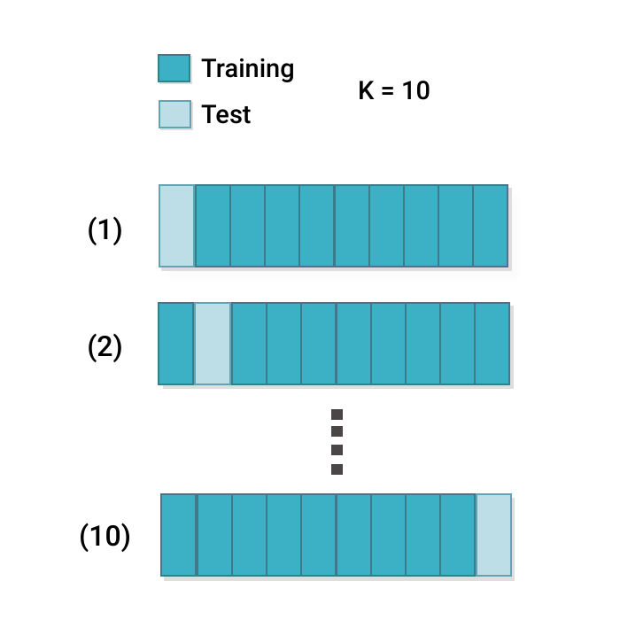
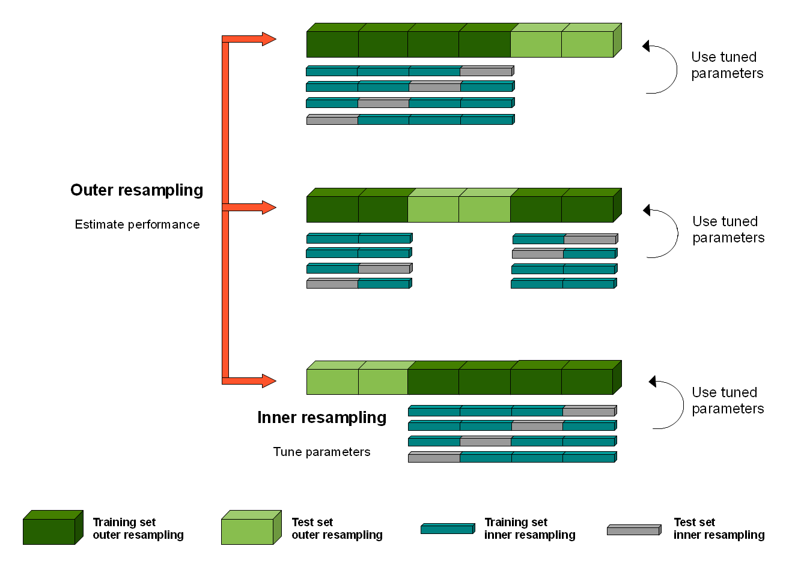
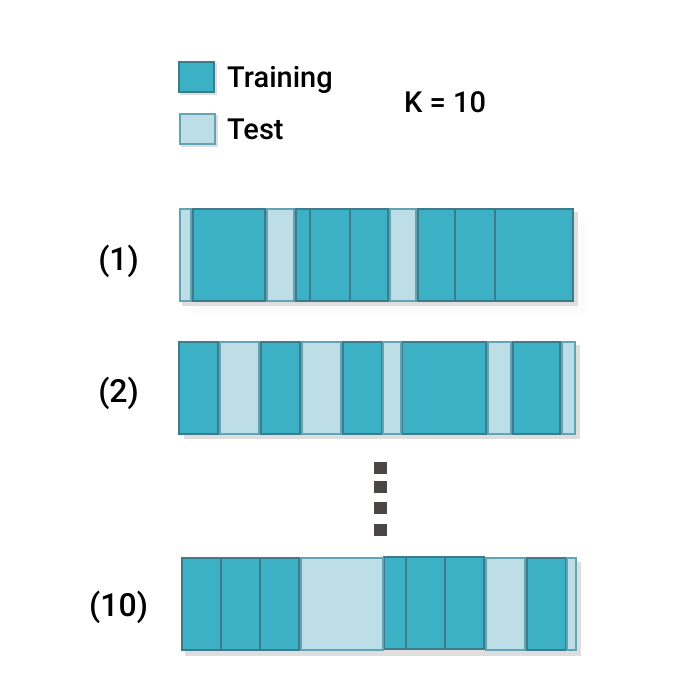

# Transformers: More than Meets the Eye

## Outline

## 

## Systematic model selection

1. **Preparation and Setup**
    - **Parameter Definition:** Establish the number of splits or folds (K) for the validation process, decide on the repetitions for techniques like Repeated K-Fold or K-Split if needed, and outline the hyperparameter grid (C) for each candidate model. For models lacking hyperparameters, set C to an empty configuration.
2. **Data Partitioning**
    - **Validation Holdout (Optional):** Optionally reserve a subset of the data as a standalone validation set (V) to provide an unbiased final evaluation.
3. **Model Evaluation**
    - **K Splits/Folds Validation (Outer Loop):** Organize the data into K distinct splits or folds, using a consistent strategy to ensure each segment of data is used for validation once. This could involve stratified sampling to preserve class distributions in cases of imbalanced datasets.
        - **Hyperparameter Optimization (Inner Loop):** Within each split or fold, perform hyperparameter tuning for models with configurable parameters. This can include nested validation within the training portion of each split or fold to determine the optimal settings.
4. **Performance Aggregation**
    - **Score Compilation:** Collect and average the performance scores across all K splits or folds to derive a comprehensive performance metric for each model configuration.
5. **Model Selection**
    - **Optimal Model Identification:** Evaluate the aggregated performance of each model to select the one that demonstrates the best balance of accuracy, precision, recall, F1 score, or other relevant metrics, considering the specific objectives and constraints of the study.
6. **Final Model Training and Validation**
    - **Comprehensive Training:** Use the entire dataset (excluding any validation holdout) to train the selected model with the identified optimal hyperparameters.
    - **External Validation (Optional):** If a separate validation set was reserved or an external dataset is available, assess the finalized model against this data to gauge its performance and generalizability.
7. **Documentation and Transparency**
    - **In-depth Reporting:** Thoroughly document the selection process, including the rationale behind the choice of metrics, models, hyperparameters, and the comparative performance across different model configurations, to ensure clarity and reproducibility.

### **Additional Considerations**

- **Class Imbalances:** If applicable, ensure strategies to handle class imbalances (e.g., stratified sampling, class weights) are integrated into both the training and validation processes.
- **Computational Efficiency:** Be mindful of the computational complexity, particularly with a large number of models, hyperparameters, and folds. Employ efficient search techniques and parallel processing where feasible.
- **Domain Requirements:** Customize the model selection framework to align with the domain-specific needs and the nature of the data, ensuring the chosen approach is both relevant and practical.

### Simple k-fold




### Random k-fold



### Nested k-fold



## Live Demo!

Training splits for systematic model comparison

## A Brief History of Transformers


### Transformers and Attention

**Transformers** have redefined the landscape of neural network architectures, particularly in the field of Natural Language Processing (NLP) and beyond. By introducing a novel structure that leverages the power of attention mechanisms, transformers offer a significant departure from traditional recurrent models.

The first appearance of transformers is in the paper [**Attention is All You Need**](https://arxiv.org/abs/1706.03762), published by researchers at Google.

Transformers have rapidly become the architecture of choice for a wide range of NLP tasks, achieving state-of-the-art results in machine translation, text generation, sentiment analysis, and more. Their flexibility and efficiency have also inspired adaptations of the transformer architecture to other domains, such as computer vision and audio processing, marking a significant evolution in the field of deep learning.

![media/tx_basic.png]

![media/tx_moderate.png]

![media/1_vrSX_Ku3EmGPyqF_E-2_Vg.png]

#### Transformer Architecture

- **Parallel Processing:** Unlike their recurrent predecessors, transformers process entire sequences simultaneously, which eliminates the sequential computation inherent in RNNs and LSTMs. This characteristic allows for substantial improvements in training efficiency and model scalability.
- **Self-Attention:** At the heart of the transformer architecture is the self-attention mechanism, which computes the representation of a sequence by relating different positions of a single sequence. This mechanism enables the model to dynamically weigh the importance of each part of the input data, enhancing its ability to capture complex relationships within the data.
- **Layered Structure:** Transformers are composed of stacked layers of self-attention and position-wise feedforward networks. Each layer in the transformer processes the entire input data in parallel, which contributes to the model's exceptional efficiency and effectiveness.

#### Attention Mechanism

The **attention** mechanism allows transformers to consider the entire context of the input sequence, or any subset of it, regardless of the distance between elements in the sequence. This global view is particularly advantageous for tasks that require understanding long-range dependencies, such as document summarization or question-answering.

![media/attention.png]

The left and center figures represent different layers / attention heads. The right figure depicts the same layer/head as the center figure, but with the token _lazy_ selected

![media/simple-pretty-gif.gif]

- **Scaled Dot-Product Attention:** The most commonly used attention mechanism in transformers involves computing the dot product of the query with all keys, dividing each by the square root of the dimension of the keys, applying a softmax function to obtain the weights on the values. This approach efficiently captures the relevance of different parts of the input data to each other.
- **Multi-Head Attention:** Transformers further extend the capabilities of the attention mechanism through the use of multi-head attention. This involves running multiple attention operations in parallel, with each "head" focusing on different parts of the input data. This diversity allows the model to attend to different aspects of the data, enhancing its representational power.

## Live Demo!

DIY GPT [nanoGPT](https://github.com/karpathy/nanoGPT)

## Interlude: Latent Space

The concept of latent space is particularly relevant in the context of autoencoders and generative models within neural network architectures. You can introduce latent space in a subsection under these topics, explaining its significance in learning compact, meaningful representations of data. Here's a suggestion on where and how to incorporate it:

In the realm of autoencoders and generative models, such as Variational Autoencoders (VAEs) and Generative Adversarial Networks (GANs), the concept of latent space plays a central role. Latent space refers to the compressed representation that these models learn, which captures the essential information of the input data in a lower-dimensional form.

- **Role in Autoencoders:** In autoencoders, the encoder part of the model compresses the input into a latent space representation, and the decoder part attempts to reconstruct the input from this latent representation. The latent space thus acts as a bottleneck, forcing the autoencoder to learn the most salient features of the data.
- **Generative Model Applications:** In generative models like VAEs and GANs, the latent space representation can be sampled to generate new data points that are similar to the original data. For example, in the case of images, by sampling different points in the latent space, a model can generate new images that share characteristics with the training set but are not identical replicas.

### Significance of Latent Space

- **Data Compression:** Latent space representations allow for efficient data compression, reducing the dimensionality of the data while retaining its critical features. This aspect is particularly useful in tasks that involve high-dimensional data, such as images or complex sensor data.
- **Feature Learning:** The process of learning a latent space encourages the model to discover and encode meaningful patterns and relationships in the data, often leading to representations that can be useful for other machine learning tasks.
- **Interpretability and Exploration:** Examining the latent space can provide insights into the data's underlying structure. In some cases, latent space representations can be manipulated to explore variations of the generated data, offering a tool for understanding how different features contribute to the data generation process.

## Embeddings

**Embeddings** are a natural extension of the latent space, particularly in the context of handling high-dimensional categorical data. They transform sparse, discrete input features into a continuous, lower-dimensional space, much like the latent representations in autoencoders and generative models.

Embeddings map high-dimensional data, such as words or categorical variables, to a dense vector space where semantically similar items are positioned closely together. This transformation facilitates the neural network's task of discerning patterns and relationships in the data.

- **Application in NLP:** In the realm of Natural Language Processing, embeddings like Word2Vec and GloVe have transformed the way text is represented, enabling models to capture and utilize the semantic and syntactic nuances of language. Each word is represented as a vector, encapsulating its meaning based on the context in which it appears.
- **Categorical Data Representation:** Beyond text, embeddings are instrumental in representing categorical data in tasks beyond NLP. For example, in recommendation systems, embeddings can represent users and items in a shared vector space, capturing preferences and item characteristics that drive personalized recommendations.

### Advantages

- **Efficiency and Dimensionality Reduction:** Embeddings reduce the computational burden on neural networks by condensing high-dimensional data into more manageable forms without sacrificing the richness of the data's semantic and syntactic properties.
- **Enhanced Semantic Understanding:** By embedding high-dimensional data into a continuous space, neural networks can more easily capture and leverage the inherent similarities and differences within the data, leading to more accurate and nuanced predictions.
- **Facilitating Transfer Learning:** Similar to latent space representations, embeddings can be employed in a transfer learning context, where knowledge from one domain can enhance performance in related but distinct tasks.

## LLMs and the Rise of General-Purpose Models

Recent years have seen the emergence of large language models (LLMs) like GPT-3, BERT, and their successors, which represent a paradigm shift towards training massive, **general-purpose models**. These models are capable of understanding and generating human-like text and can be adapted to a wide range of tasks, from translation and summarization to question-answering and creative writing.

### Fine-Tuning

Training an existing transformer-based model on new data is called **fine-tuning**. It is one possible way to extend its capability.

- **Adaptability:** Fine-tuning involves taking a model that has been pre-trained on a vast corpus of data and adjusting its parameters slightly to specialize in a more narrow task. This process leverages the broad understanding these models have developed to achieve high performance on specific tasks with relatively minimal additional training.
- **Efficiency:** By starting with a pre-trained model, researchers and practitioners can bypass the need for extensive computational resources required to train large models from scratch. Fine-tuning allows for the customization of these powerful models to specific needs while retaining the general knowledge they have already acquired.

- Fine-tuning a GPT using PyTorch

### **Step 1: Install Transformers and PyTorch**

Ensure you have the `**transformers**` and `**torch**` libraries installed. You can install them using pip if you haven't already:

```Shell
pip install transformers torch
```

### **Step 2: Load a Pre-Trained Model and Tokenizer**

First, import the necessary modules and load a pre-trained model along with its corresponding tokenizer. We'll use GPT-2 as an example.

```Python
from transformers import GPT2Tokenizer, GPT2LMHeadModel

tokenizer = GPT2Tokenizer.from_pretrained('gpt2')
model = GPT2LMHeadModel.from_pretrained('gpt2')
```

### **Step 3: Prepare Your Dataset**

Prepare your text data for training. This involves tokenizing your text corpus and creating a dataset that the model can process.

```Python
texts = ["Your text data", "More text data"]  # Replace with your text corpus
inputs = tokenizer(texts, padding=True, truncation=True, return_tensors="pt")
```

### **Step 4: Fine-Tune the Model**

Use the Hugging Face `**Trainer**` class or a custom training loop to fine-tune the model on your dataset. For simplicity, we'll use the `**Trainer**`.

```Python
from transformers import Trainer, TrainingArguments

training_args = TrainingArguments(
    output_dir="./results",           # Output directory
    num_train_epochs=3,               # Total number of training epochs
    per_device_train_batch_size=4,    # Batch size per device during training
    per_device_eval_batch_size=4,     # Batch size for evaluation
    warmup_steps=500,                 # Number of warmup steps for learning rate scheduler
    weight_decay=0.01,                # Strength of weight decay
)

trainer = Trainer(
    model=model,
    args=training_args,
    train_dataset=inputs,  # Assuming `inputs` is your processed dataset
    # eval_dataset=eval_dataset,  # If you have a validation set
)

trainer.train()
```

### **Step 5: Save and Use the Fine-Tuned Model**

After fine-tuning, save your model for future use and inference.

```Python
pythonCopy code
trainer.save_model("./fine_tuned_model")

# To use the model for generation:
prompt = "Your prompt here"
input_ids = tokenizer.encode(prompt, return_tensors="pt")
generated_text_ids = model.generate(input_ids, max_length=100)
generated_text = tokenizer.decode(generated_text_ids[0], skip_special_tokens=True)

print(generated_text)
```
    
### Prompt Engineering and One-Shot Learning

Prompt engineering is the art of crafting input prompts that guide the model to generate desired outputs. This technique exploits the model's ability to understand context and generate relevant responses, making it possible to "program" the model for new tasks without explicit retraining.

### **One-Shot and Few-Shot Learning**

One of the most remarkable capabilities of modern LLMs is their ability to perform tasks with minimal examples — sometimes just **one or a few (few-shot learning)**. This ability stems from their extensive pre-training, which provides a rich context for understanding and generating text.

### Addressing Hallucination

There is no general solution to preventing model hallucination. One way I like to think of it is akin to regression: when extrapolating beyond the training data you run the risk of making assumptions that no longer hold.

Approaches include:

- **Training Data Curation:** Carefully curating and vetting training datasets can reduce the likelihood of hallucination by ensuring that models learn from high-quality, accurate data.
- **Prompt and Output Design:** In generative models, carefully designing input prompts and setting constraints on outputs can mitigate hallucination effects. This is particularly relevant in NLP applications where the context and phrasing of prompts can significantly influence the model's output.
- **Human-in-the-loop:** Incorporating human feedback into the training loop can help identify and correct hallucinations, leading to models that better align with factual accuracy and user expectations.


- [https://github.com/karpathy/nanoGPT](https://github.com/karpathy/nanoGPT): Accompanied by a [full walkthrough video](https://www.youtube.com/watch?v=kCc8FmEb1nY), this implementation demystifies the GPT architecture.


## Live Demo!

Zero-, One-, and Few-Shot Learning

## Links

- Attention Paper - [https://arxiv.org/abs/1409.0473](https://arxiv.org/abs/1409.0473)
- Visual introduction to Attention - [https://erdem.pl/2021/05/introduction-to-attention-mechanism](https://erdem.pl/2021/05/introduction-to-attention-mechanism)
- Transformers
    - "Attention is all you need" paper [https://arxiv.org/abs/1706.03762](https://arxiv.org/abs/1706.03762)
    - The Illustrated Transformer [https://jalammar.github.io/illustrated-transformer/](https://jalammar.github.io/illustrated-transformer/)
- Multi head attention - [https://towardsdatascience.com/transformers-explained-visually-part-3-multi-head-attention-deep-dive-1c1ff1024853](https://towardsdatascience.com/transformers-explained-visually-part-3-multi-head-attention-deep-dive-1c1ff1024853)
- DIT nanoGPT from scratch - [https://github.com/karpathy/nanoGPT/blob/master/train.py](https://github.com/karpathy/nanoGPT/blob/master/train.py)
    - Karpathy's Neural Networks: Zero to Hero - [https://karpathy.ai/zero-to-hero.html](https://karpathy.ai/zero-to-hero.html)
    - Let's build GPT: from scratch, in code, spelled out [https://www.youtube.com/watch?v=kCc8FmEb1nY](https://www.youtube.com/watch?v=kCc8FmEb1nY)
- Reinforcement Learning with Human Feedback - [https://arxiv.org/abs/2203.02155](https://arxiv.org/abs/2203.02155)

### LLMS

List of open source LLMS

- [https://github.com/eugeneyan/open-llms](https://github.com/eugeneyan/open-llms)
- GPT (2018) [https://s3-us-west-2.amazonaws.com/openai-assets/research-covers/language-unsupervised/language_understanding_paper.pdf](https://s3-us-west-2.amazonaws.com/openai-assets/research-covers/language-unsupervised/language_understanding_paper.pdf)

Knowledge Distillation

- DistilBERT, a distilled version of BERT: smaller, faster, cheaper and lighter [https://arxiv.org/pdf/1910.01108v4.pdf](https://arxiv.org/pdf/1910.01108v4.pdf)

Health CARE & AI

- UCSF Versa! [https://ai.ucsf.edu/platforms-tools-and-resources/ucsf-versa](https://ai.ucsf.edu/platforms-tools-and-resources/ucsf-versa)
- [https://thymia.ai/](https://thymia.ai/)su
- [https://www.suki.ai/](https://www.suki.ai/)
- [https://www.riken.jp/en/research/labs/bdr/](https://www.riken.jp/en/research/labs/bdr/)
- [https://sites.research.google/med-palm/](https://sites.research.google/med-palm/)


Where to play around

- [https://huggingface.co/learn/nlp-course/chapter3/2?fw=pt](https://huggingface.co/learn/nlp-course/chapter3/2?fw=pt)
- [https://cloud.google.com/vertex-ai](https://cloud.google.com/vertex-ai)
- [https://platform.openai.com/](https://platform.openai.com/)
- [https://github.com/openai/evals](https://github.com/openai/evals)