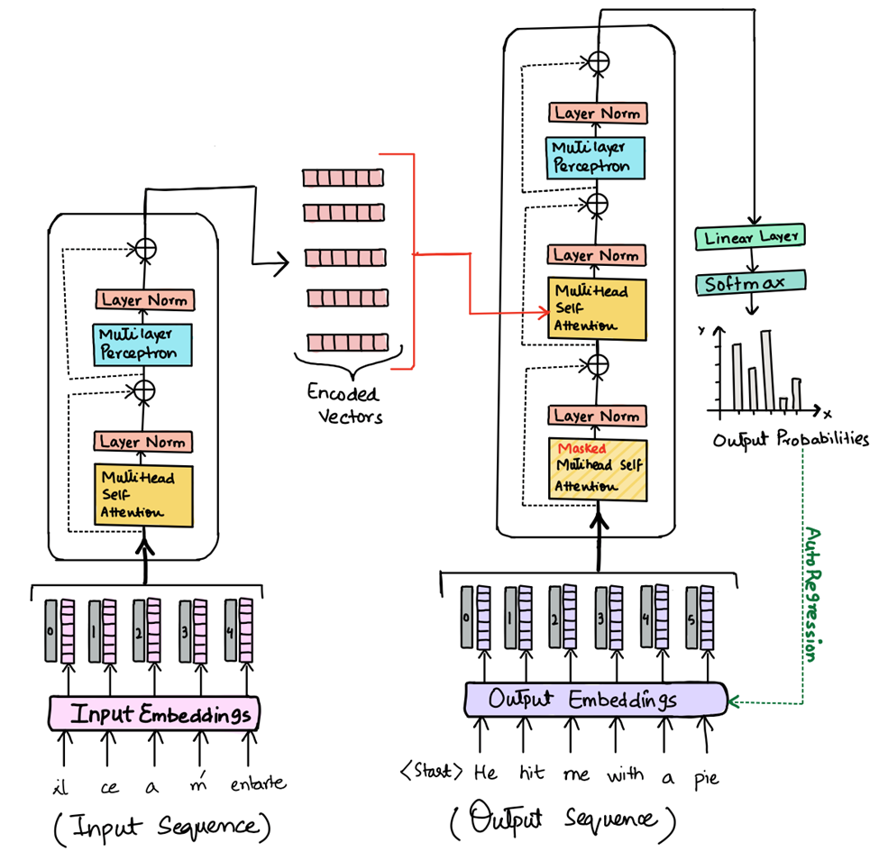
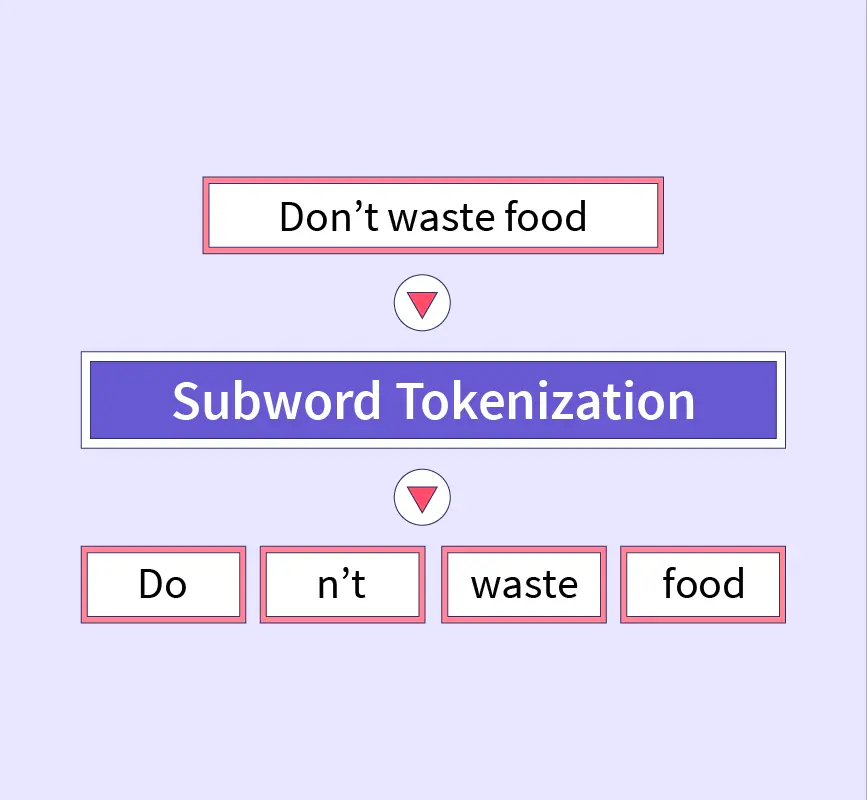
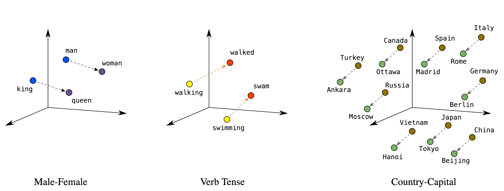

Transformers: More than Meets the Eye

- A Brief History of Transformers
- Transformer Architecture and Attention
- Latent Space and Embeddings
- LLMs and General-Purpose Models
- Prompt Engineering and Structured Responses
- LLM API Integration

# A Brief History of Transformers

Understanding where we came from helps appreciate where we are. The path to modern LLMs involved solving several fundamental problems in sequence processing.

## Word Embeddings (2013)

**word2vec**: Represent words as vectors in high-dimensional space

- Similar words cluster together ("insulin" near "glucose")
- Used **Continuous Bag of Words** and **Skip-gram** algorithms for building context
    - **CBOW**: surrounding words used to predict word in the middle
    - **Skip-gram**: input word used to predict context
    - Precursors to **Attention**

## Sequence-to-Sequence & RNNs (2014)

**Encoder-decoder architecture**: Transform one sequence into another

- Encoder processes input into fixed representation
- Decoder generates output from that representation
- Used for translation, summarization
- Built on **RNNs** (Recurrent Neural Networks) with sequential processing

### RNNs, LSTM, and Limitations

Introduce "memory" to neural networks

**Two critical problems**:

**1. Vanishing gradients**: Error signals shrink as they propagate backward through time. Early words in sequence get minimal learning signal.

**2. Sequential bottleneck**: Must process word-by-word (word 1 → word 2 → word 3…). Cannot parallelize training. Slow and doesn't scale.

## Attention Mechanism (2015)

**Key innovation**: Decoder focuses on specific input parts at each step

- Dynamically weights which inputs matter most
- Solves information bottleneck

## Transformers (2017)

**"Attention is All You Need"**: Eliminated sequential processing entirely

**Transformer solution**:

- Process entire sequence simultaneously (parallel)
- All tokens relate to all others via attention
- No vanishing gradient problem
- 100x+ training speedup enables web-scale datasets

## The Scale-Up Era (2018-2024)

| Year | Milestone |
|------|-----------|
| **2018** | GPT (170M parameters), BERT |
| **2020** | GPT-3 (175B parameters), few-shot learning |
| **2022** | ChatGPT with RLHF (Reinforcement Learning from Human Feedback), 100M users in 2 months |
| **2024** | GPT-4, Claude 3.5, Gemini, Llama 3 (200K+ token context windows) |

# Transformers and Attention

**Transformers** have redefined the landscape of neural network architectures, particularly in the field of Natural Language Processing (NLP) and beyond. By introducing a novel structure that leverages the power of attention mechanisms, transformers offer a significant departure from traditional recurrent models.

The first appearance of transformers is in the paper [**Attention is All You Need**](https://arxiv.org/abs/1706.03762) (2017), published by researchers at Google.

Transformers have rapidly become the architecture of choice for a wide range of NLP tasks, achieving state-of-the-art results in machine translation, text generation, sentiment analysis, and more. Their flexibility and efficiency have also inspired adaptations of the transformer architecture to other domains, such as computer vision and audio processing, marking a significant evolution in the field of deep learning.




## Transformer Architecture

- **Parallel Processing:** Unlike their recurrent predecessors, transformers process entire sequences simultaneously, which eliminates the sequential computation inherent in RNNs and LSTMs. This characteristic allows for substantial improvements in training efficiency and model scalability.
- **Self-Attention:** At the heart of the transformer architecture is the self-attention mechanism, which computes the representation of a sequence by relating different positions of a single sequence. This mechanism enables the model to dynamically weigh the importance of each part of the input data, enhancing its ability to capture complex relationships within the data.
- **Layered Structure:** Transformers are composed of stacked layers of self-attention and position-wise feedforward networks. Each layer in the transformer processes the entire input data in parallel, which contributes to the model's exceptional efficiency and effectiveness.

### Reference Card: Transformer Components

| Component | Purpose | Details |
|:---|:---|:---|
| **Input Embedding** | Convert tokens to vectors | Maps discrete tokens to continuous space |
| **Positional Encoding** | Add order information | Since attention is order-agnostic |
| **Multi-Head Attention** | Learn different relationship types | Each head focuses on different aspects |
| **Feed-Forward Network** | Add non-linearity | Applied to each position independently |
| **Layer Normalization** | Stabilize training | Normalize activations within a layer |
| **Residual Connections** | Enable gradient flow | Skip connections around sublayers |

## Attention Mechanism

The **attention** mechanism allows transformers to consider the entire context of the input sequence, or any subset of it, regardless of the distance between elements in the sequence. This global view is particularly advantageous for tasks that require understanding long-range dependencies, such as document summarization or question-answering.


The left and center figures represent different layers / attention heads. The right figure depicts the same layer/head as the center figure, but with the token _lazy_ selected


- **Scaled Dot-Product Attention:** The most commonly used attention mechanism in transformers involves computing the dot product of the query with all keys, dividing each by the square root of the dimension of the keys, applying a softmax function to obtain the weights on the values. This approach efficiently captures the relevance of different parts of the input data to each other.
- **Multi-Head Attention:** Transformers further extend the capabilities of the attention mechanism through the use of multi-head attention. This involves running multiple attention operations in parallel, with each "head" focusing on different parts of the input data. This diversity allows the model to attend to different aspects of the data, enhancing its representational power.

### Reference Card: Scaled Dot-Product Attention

| Component | Details |
|:---|:---|
| **Formula** | $\text{Attention}(Q, K, V) = \text{softmax}\left(\frac{QK^T}{\sqrt{d_k}}\right)V$ |
| **Q (Query)** | What we're looking for |
| **K (Key)** | What each token offers |
| **V (Value)** | The actual information to retrieve |
| **Scaling** | $\sqrt{d_k}$ prevents dot products from growing too large |

### Code Snippet: Simplified Attention

```python
import torch
import torch.nn.functional as F

def scaled_dot_product_attention(query, key, value):
    """Compute scaled dot-product attention."""
    d_k = query.size(-1)
    scores = torch.matmul(query, key.transpose(-2, -1)) / (d_k ** 0.5)
    attention_weights = F.softmax(scores, dim=-1)
    return torch.matmul(attention_weights, value)
```

- [Transformer Explainer](https://poloclub.github.io/transformer-explainer/)

# LIVE DEMO!

Exploring nanoGPT to see how attention works under the hood—visualizing what the model "looks at" when processing text.

See: [demo/02-nanogpt_attention.md](demo/02-nanogpt_attention.md)

# Latent Space and Embeddings

The concept of latent space is particularly relevant in the context of autoencoders and generative models within neural network architectures. Latent space refers to the compressed representation that these models learn, which captures the essential information of the input data in a lower-dimensional form.

## Understanding Latent Space

- **Role in Autoencoders:** In autoencoders, the encoder part of the model compresses the input into a latent space representation, and the decoder part attempts to reconstruct the input from this latent representation. The latent space thus acts as a bottleneck, forcing the autoencoder to learn the most salient features of the data.
- **Generative Model Applications:** In generative models like VAEs and GANs, the latent space representation can be sampled to generate new data points that are similar to the original data. For example, in the case of images, by sampling different points in the latent space, a model can generate new images that share characteristics with the training set but are not identical replicas.

### Significance of Latent Space

- **Data Compression:** Latent space representations allow for efficient data compression, reducing the dimensionality of the data while retaining its critical features. This aspect is particularly useful in tasks that involve high-dimensional data, such as images or complex sensor data.
- **Feature Learning:** The process of learning a latent space encourages the model to discover and encode meaningful patterns and relationships in the data, often leading to representations that can be useful for other machine learning tasks.
- **Interpretability and Exploration:** Examining the latent space can provide insights into the data's underlying structure. In some cases, latent space representations can be manipulated to explore variations of the generated data, offering a tool for understanding how different features contribute to the data generation process.

## Embeddings

**Embeddings** are a natural extension of the latent space, particularly in the context of handling high-dimensional categorical data. They transform sparse, discrete input features into a continuous, lower-dimensional space, much like the latent representations in autoencoders and generative models.



Embeddings map high-dimensional data, such as words or categorical variables, to a dense vector space where semantically similar items are positioned closely together. This transformation facilitates the neural network's task of discerning patterns and relationships in the data.



*Semantic similarity in embedding space: "king" - "man" + "woman" ≈ "queen" — geometry captures analogies*

- **Application in NLP:** In the realm of Natural Language Processing, embeddings like Word2Vec and GloVe have transformed the way text is represented, enabling models to capture and utilize the semantic and syntactic nuances of language. Each word is represented as a vector, encapsulating its meaning based on the context in which it appears.
- **Categorical Data Representation:** Beyond text, embeddings are instrumental in representing categorical data in tasks beyond NLP. For example, in recommendation systems, embeddings can represent users and items in a shared vector space, capturing preferences and item characteristics that drive personalized recommendations.

### Reference Card: Common Embedding Methods

| Method | Description | Use Cases |
|:---|:---|:---|
| **Word2Vec** | Skip-gram or CBOW to learn word vectors | Text similarity, analogy tasks |
| **GloVe** | Global vectors from co-occurrence statistics | Pre-trained embeddings for NLP |
| **FastText** | Subword embeddings (handles OOV words) | Morphologically rich languages |
| **BERT Embeddings** | Contextualized embeddings from transformers | State-of-the-art NLP tasks |
| **Sentence Transformers** | Full sentence/paragraph embeddings | Semantic search, clustering |

### Reference Card: `SentenceTransformer`

| Component | Details |
|:---|:---|
| **Library** | `sentence-transformers` (`pip install sentence-transformers`) |
| **Purpose** | Generate dense vector embeddings for sentences/paragraphs |
| **Key Method** | `model.encode(sentences)` - returns numpy array of embeddings |
| **Popular Models** | `all-MiniLM-L6-v2` (fast), `all-mpnet-base-v2` (accurate) |
| **Output** | Fixed-size vectors (e.g., 384 or 768 dimensions) |

### Reference Card: `cosine_similarity`

| Component | Details |
|:---|:---|
| **Function** | `sklearn.metrics.pairwise.cosine_similarity()` |
| **Purpose** | Measure similarity between vectors (1 = identical, 0 = orthogonal, -1 = opposite) |
| **Input** | Two arrays of shape (n_samples, n_features) |
| **Use Case** | Compare embeddings to find semantically similar texts |

### Code Snippet: Using Pre-trained Embeddings

```python
from sentence_transformers import SentenceTransformer

# Load a pre-trained model
model = SentenceTransformer('all-MiniLM-L6-v2')

# Generate embeddings for sentences
sentences = ["The patient has diabetes.", "Blood glucose levels are elevated."]
embeddings = model.encode(sentences)

# Compute similarity
from sklearn.metrics.pairwise import cosine_similarity
similarity = cosine_similarity([embeddings[0]], [embeddings[1]])
print(f"Similarity: {similarity[0][0]:.3f}")  # Output: ~0.6-0.8
```

### Advantages of Embeddings

- **Efficiency and Dimensionality Reduction:** Embeddings reduce the computational burden on neural networks by condensing high-dimensional data into more manageable forms without sacrificing the richness of the data's semantic and syntactic properties.
- **Enhanced Semantic Understanding:** By embedding high-dimensional data into a continuous space, neural networks can more easily capture and leverage the inherent similarities and differences within the data, leading to more accurate and nuanced predictions.
- **Facilitating Transfer Learning:** Similar to latent space representations, embeddings can be employed in a transfer learning context, where knowledge from one domain can enhance performance in related but distinct tasks.

# LLMs and the Rise of General-Purpose Models

Recent years have seen the emergence of large language models (LLMs) like GPT-3, BERT, and their successors, which represent a paradigm shift towards training massive, **general-purpose models**. These models are capable of understanding and generating human-like text and can be adapted to a wide range of tasks, from translation and summarization to question-answering and creative writing.

## Fine-Tuning

Training an existing transformer-based model on new data is called **fine-tuning**. It is one possible way to extend its capability.

- **Adaptability:** Fine-tuning involves taking a model that has been pre-trained on a vast corpus of data and adjusting its parameters slightly to specialize in a more narrow task. This process leverages the broad understanding these models have developed to achieve high performance on specific tasks with relatively minimal additional training.
- **Efficiency:** By starting with a pre-trained model, researchers and practitioners can bypass the need for extensive computational resources required to train large models from scratch. Fine-tuning allows for the customization of these powerful models to specific needs while retaining the general knowledge they have already acquired.

### Reference Card: Fine-Tuning with Hugging Face

| Component | Details |
|:---|:---|
| **Purpose** | Adapt pre-trained model to specific task/domain |
| **Data Needed** | 100s-1000s labeled examples typically |
| **Key Classes** | `Trainer`, `TrainingArguments`, `AutoModel` |
| **When to Use** | Specialized vocabulary, domain-specific patterns |
| **Alternative** | Prompt engineering (faster, no training) |

### Code Snippet: Fine-Tuning a GPT

```python
from transformers import GPT2Tokenizer, GPT2LMHeadModel, Trainer, TrainingArguments

tokenizer = GPT2Tokenizer.from_pretrained('gpt2')
model = GPT2LMHeadModel.from_pretrained('gpt2')

# Prepare your dataset
texts = ["Your clinical notes", "More clinical text"]
inputs = tokenizer(texts, padding=True, truncation=True, return_tensors="pt")

training_args = TrainingArguments(
    output_dir="./results",
    num_train_epochs=3,
    per_device_train_batch_size=4,
)

trainer = Trainer(model=model, args=training_args, train_dataset=inputs)
trainer.train()
```

## Fine-Tuning vs Prompt Engineering

| Approach | When to Use | Effort | Cost |
|----------|-------------|--------|------|
| **Prompting** | Default choice, fast iteration | Minutes to test | Lower |
| **Fine-tuning** | Specialized vocabulary, domain patterns | Days-weeks | Higher |

**Prompting** (recommended default):

- Fast iteration (minutes to test)
- No data collection needed
- Works across many tasks
- Lower cost

**Fine-tuning** (specialized cases only):

- Adapt pre-trained model on your specific data
- Requires 100s-1000s labeled examples
- Lengthy dataset preparation and training

# LIVE DEMO!!

Systematic model comparison using cross-validation techniques from Lecture 5, applied to a healthcare dataset.

See: [demo/01-model_selection.md](demo/01-model_selection.md)

# Prompt Engineering

Prompt engineering is the art of crafting input prompts that guide the model to generate desired outputs. This technique exploits the model's ability to understand context and generate relevant responses, making it possible to "program" the model for new tasks without explicit retraining.

## One-Shot and Few-Shot Learning

One of the most remarkable capabilities of modern LLMs is their ability to perform tasks with minimal examples — sometimes just **one or a few (few-shot learning)**. This ability stems from their extensive pre-training, which provides a rich context for understanding and generating text.

### Reference Card: Prompting Techniques

| Technique | Description | When to Use |
|:---|:---|:---|
| **Zero-shot** | Task description only, no examples | Simple, well-defined tasks |
| **One-shot** | Single example provided | When pattern is clear from one case |
| **Few-shot** | 2-5 examples provided | Complex patterns, structured output |
| **Chain-of-thought** | Ask model to show reasoning steps | Multi-step reasoning tasks |

### Code Snippet: Few-Shot Prompting

```python
prompt = """Extract diagnoses from clinical notes.

Example 1:
Note: "Patient presents with elevated blood glucose and polyuria."
Diagnosis: Type 2 Diabetes Mellitus

Example 2:
Note: "Chest pain radiating to left arm, elevated troponin."
Diagnosis: Acute Myocardial Infarction

Now extract the diagnosis:
Note: "Patient has persistent cough, fever, and infiltrates on chest X-ray."
Diagnosis:"""
```

## Structured Responses: Why and How

A **structured response** is output from a language model that follows a specific, machine-readable format—such as JSON, XML, or a table—rather than free-form text.


### Why does it matter in health data science?

- **Reliability:** Structured outputs are easier to validate and less prone to hallucination.
- **Interoperability:** They can be directly used by other software systems (e.g., EHRs, analytics pipelines).
- **Automation:** Structured data enables downstream processing, such as automated coding, reporting, or alerting.
- **Auditability:** It's easier to check for missing or inconsistent information.

### How do you get a structured response from an LLM?

- Use **schema-based prompting**: "Provide your answer in the following JSON format: { ... }"
- Be explicit about required fields and data types.
- Validate the output programmatically.

### Reference Card: Structured Output Prompting

| Component | Details |
|:---|:---|
| **Schema Definition** | Explicitly define JSON structure in prompt |
| **Required Fields** | List all mandatory fields with types |
| **Validation** | Parse and validate output programmatically |
| **Fallback** | Handle parsing errors gracefully |

### Code Snippet: Schema-Based Prompting

```python
prompt = """Extract the following information from the clinical note and return it as JSON:
{
  "diagnosis": "<primary diagnosis>",
  "confidence": <0.0-1.0>,
  "icd_code": "<ICD-10 code if known>",
  "reasoning": "<brief explanation>"
}

Clinical Note: "65-year-old male with chest pain, ST elevation in leads V1-V4, 
troponin elevated at 2.5 ng/mL. Cardiology consulted for emergent catheterization."
"""
```

## Addressing Hallucination

There is no general solution to preventing model hallucination. One way I like to think of it is akin to regression: when extrapolating beyond the training data you run the risk of making assumptions that no longer hold.

Approaches include:

- **Training Data Curation:** Carefully curating and vetting training datasets can reduce the likelihood of hallucination by ensuring that models learn from high-quality, accurate data.
- **Prompt and Output Design:** In generative models, carefully designing input prompts and setting constraints on outputs can mitigate hallucination effects. This is particularly relevant in NLP applications where the context and phrasing of prompts can significantly influence the model's output.
- **Human-in-the-loop:** Incorporating human feedback into the training loop can help identify and correct hallucinations, leading to models that better align with factual accuracy and user expectations.
- **Retrieval-Augmented Generation (RAG):** Ground model responses in retrieved documents, providing verifiable sources.

# LLM API Integration

Building applications with language models requires understanding how to interact with their APIs effectively.

## API Access Patterns

- **REST APIs**: Most LLM providers offer HTTP endpoints that accept JSON payloads containing your prompt and parameters, returning generated text responses
- **SDK/Libraries**: Client libraries like OpenAI Python, Hugging Face Transformers, and LangChain provide convenient wrappers around the raw APIs
- **Authentication**: API keys are typically required and should be stored securely as environment variables or in a secrets manager

## Common LLM API Providers

### Reference Card: LLM API Providers

| Provider | Models | Strengths |
|:---|:---|:---|
| **OpenAI** | GPT-4, GPT-4o, o1 | Best general-purpose, function calling |
| **Anthropic** | Claude 3.5, Claude 4 | Long context, safety focus |
| **Google** | Gemini | Multimodal, large context |
| **Hugging Face** | Various open models | Free tier, open source options |

### Code Snippet: OpenAI API

```python
import openai

client = openai.OpenAI()  # Uses OPENAI_API_KEY env var

response = client.chat.completions.create(
    model="gpt-4o",
    messages=[
        {"role": "system", "content": "You are a helpful medical assistant."},
        {"role": "user", "content": "What are the symptoms of diabetes?"}
    ],
    max_tokens=150
)

print(response.choices[0].message.content)
```

### Code Snippet: Hugging Face Inference API

```python
import requests

API_URL = "https://api-inference.huggingface.co/models/google/flan-t5-large"
headers = {"Authorization": f"Bearer {your_api_key}"}

def query(payload):
    response = requests.post(API_URL, headers=headers, json=payload)
    return response.json()

output = query({"inputs": "What are the symptoms of diabetes?"})
print(output)
```

## Function Calling: Enforcing Schema Compliance

Modern LLM APIs (like OpenAI's GPT-4) support a feature called **function calling**. This allows you to define a schema (function signature) for the expected output, and the model will return a response that matches this schema—helping to ensure the output is well-structured and reliable.

**Why is this useful?**

- The model is guided to only return data that fits your specified structure (e.g., required fields, data types).
- Reduces the risk of hallucinated or malformed outputs.
- Makes it easier to integrate LLMs into production systems, especially in healthcare where data quality is critical.

### Reference Card: Function Calling

| Component | Details |
|:---|:---|
| **Purpose** | Enforce structured output schema |
| **Definition** | JSON schema with properties and types |
| **Required Fields** | Specify mandatory fields in schema |
| **Validation** | Model attempts to conform to schema |

### Code Snippet: Function Calling

```python
functions = [
    {
        "name": "extract_diagnosis",
        "parameters": {
            "type": "object",
            "properties": {
                "diagnosis": {"type": "string"},
                "confidence": {"type": "number"},
                "reasoning": {"type": "string"}
            },
            "required": ["diagnosis", "confidence", "reasoning"]
        }
    }
]

response = client.chat.completions.create(
    model="gpt-4o",
    messages=[{"role": "user", "content": "Extract the diagnosis from this note..."}],
    functions=functions,
    function_call={"name": "extract_diagnosis"}
)
```

## Error Handling and Best Practices

- **Rate limiting**: Implement exponential backoff to handle rate limits gracefully
- **Timeout handling**: Set appropriate timeouts and handle connection issues
- **Response validation**: Always validate the structure and content of API responses
- **Caching**: Consider caching responses for identical or similar prompts to reduce costs
- **Prompt engineering**: Craft clear, specific prompts to get better responses
- **Cost management**: Monitor token usage and implement budgeting controls

## Building a Complete LLM Chat Application

When building applications that interact with LLMs, it's good practice to separate your code into distinct components with clear responsibilities:

1. **LLM Client Library**: Handles the low-level API communication, error handling, and conversation formatting
2. **Command Line Interface**: Provides a user interface that leverages the client library

This separation of concerns makes the code more maintainable, testable, and reusable.

### Code Snippet: LLM Client Class

```python
import requests
import time
import logging

class LLMClient:
    """Client for interacting with LLM APIs"""
    
    def __init__(self, model_name="google/flan-t5-base", api_key=None, max_retries=3):
        self.model_name = model_name
        self.api_key = api_key
        self.max_retries = max_retries
        self.api_url = f"https://api-inference.huggingface.co/models/{model_name}"
        self.headers = {"Authorization": f"Bearer {self.api_key}"} if self.api_key else {}
    
    def generate_text(self, prompt):
        """Generate text from the LLM based on the prompt"""
        for attempt in range(self.max_retries):
            try:
                response = requests.post(
                    self.api_url, headers=self.headers,
                    json={"inputs": prompt}, timeout=30
                )
                if response.status_code == 200:
                    return response.json()[0]["generated_text"]
                elif response.status_code == 429:
                    time.sleep(int(response.headers.get("Retry-After", 30)))
                else:
                    time.sleep(2 ** attempt)  # Exponential backoff
            except Exception as e:
                logging.error(f"Error: {e}")
                time.sleep(2 ** attempt)
        return "Error generating response."
```

### Benefits of This Architecture

1. **Separation of concerns**: The LLMClient handles API communication, while the CLI handles user interaction
2. **Reusability**: The LLMClient can be used in other applications (web apps, APIs, etc.)
3. **Maintainability**: Changes to the API interaction logic only need to be made in one place
4. **Testability**: Each component can be tested independently
5. **Flexibility**: The CLI can be easily modified without changing the core client logic

# LIVE DEMO!!!

Zero-, One-, and Few-Shot Learning with API prompt engineering.

See: [demo/03-api_prompt_engineering.md](demo/03-api_prompt_engineering.md)

# Resources and Links

## Transformers and Attention

- Attention Paper - [https://arxiv.org/abs/1409.0473](https://arxiv.org/abs/1409.0473)
- Visual introduction to Attention - [https://erdem.pl/2021/05/introduction-to-attention-mechanism](https://erdem.pl/2021/05/introduction-to-attention-mechanism)
- "Attention is all you need" paper [https://arxiv.org/abs/1706.03762](https://arxiv.org/abs/1706.03762)
- The Illustrated Transformer [https://jalammar.github.io/illustrated-transformer/](https://jalammar.github.io/illustrated-transformer/)
- [Building Transformers from Scratch](https://vectorfold.studio/blog/transformers)
- [Transformer Explainer](https://poloclub.github.io/transformer-explainer/)
- Multi head attention - [https://towardsdatascience.com/transformers-explained-visually-part-3-multi-head-attention-deep-dive-1c1ff1024853](https://towardsdatascience.com/transformers-explained-visually-part-3-multi-head-attention-deep-dive-1c1ff1024853)

## DIY nanoGPT

- DIY nanoGPT from scratch - [https://github.com/karpathy/nanoGPT/blob/master/train.py](https://github.com/karpathy/nanoGPT/blob/master/train.py)
- Karpathy's Neural Networks: Zero to Hero - [https://karpathy.ai/zero-to-hero.html](https://karpathy.ai/zero-to-hero.html)
- Let's build GPT: from scratch, in code, spelled out [https://www.youtube.com/watch?v=kCc8FmEb1nY](https://www.youtube.com/watch?v=kCc8FmEb1nY)
- [Visualize GPT-2 using WebGL](https://github.com/nathan-barry/gpt2-webgl)

## LLMs

- [ChatGPT or Grok? Gemini or Claude?: Which AIs do which tasks best, explained.](https://www.vox.com/future-perfect/411924/artificial-intelligence-chatbots-openai-chatgpt-anthropic-google-gemini-claude-grok)
- List of open source LLMS: [https://github.com/eugeneyan/open-llms](https://github.com/eugeneyan/open-llms)
- GPT (2018) [https://s3-us-west-2.amazonaws.com/openai-assets/research-covers/language-unsupervised/language_understanding_paper.pdf](https://s3-us-west-2.amazonaws.com/openai-assets/research-covers/language-unsupervised/language_understanding_paper.pdf)
- Reinforcement Learning with Human Feedback - [https://arxiv.org/abs/2203.02155](https://arxiv.org/abs/2203.02155)

## Healthcare AI

- UCSF Versa! [https://ai.ucsf.edu/platforms-tools-and-resources/ucsf-versa](https://ai.ucsf.edu/platforms-tools-and-resources/ucsf-versa)
- [https://sites.research.google/med-palm/](https://sites.research.google/med-palm/)

## Prompt Engineering Guides

- **Anthropic**: [https://docs.anthropic.com/en/docs/build-with-claude/prompt-engineering](https://docs.anthropic.com/en/docs/build-with-claude/prompt-engineering)
- **OpenAI**: [https://platform.openai.com/docs/examples](https://platform.openai.com/docs/examples)

## Where to Play Around

- [https://huggingface.co/learn/nlp-course/chapter3/2?fw=pt](https://huggingface.co/learn/nlp-course/chapter3/2?fw=pt)
- [https://cloud.google.com/vertex-ai](https://cloud.google.com/vertex-ai)
- [https://platform.openai.com/](https://platform.openai.com/)
