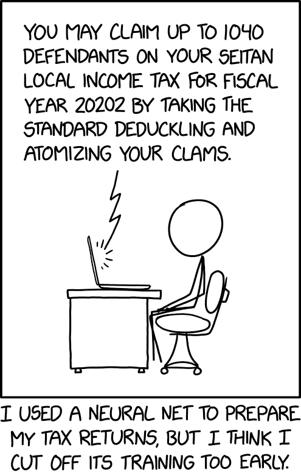
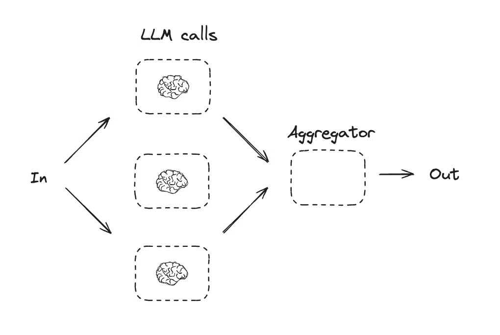
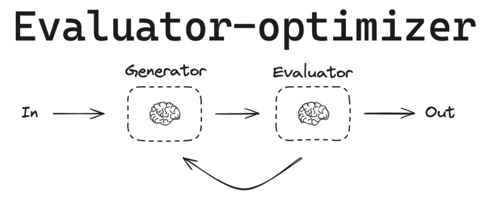

LLM Applications & Workflows

- hw08 #FIXME:URL

# Links

## Prompt Engineering Guides

- **Anthropic**: [docs.anthropic.com/en/docs/build-with-claude/prompt-engineering](https://docs.anthropic.com/en/docs/build-with-claude/prompt-engineering)
- **OpenAI**: [platform.openai.com/docs/guides/prompt-engineering](https://platform.openai.com/docs/guides/prompt-engineering)
- **OpenAI examples**: [platform.openai.com/docs/examples](https://platform.openai.com/docs/examples)

## Agent & Workflow Frameworks

- [OpenAI Agents SDK](https://github.com/openai/openai-agents-python) — primary framework
- [OpenAI Agents SDK docs](https://openai.github.io/openai-agents-python)
- [OpenAI Agent Builder](https://platform.openai.com/agent-builder) — visual workflow builder
- [OpenAI Agents guide](https://platform.openai.com/docs/guides/agents)
- [LangChain](https://python.langchain.com/docs) — chains and agents
- [LangGraph](https://www.langchain.com/langgraph) — stateful agent graphs
- [`abe_froman`](https://github.com/christopherseaman/abe_froman) — human-readable custom workflow example (LangGraph)
- [AutoGen](https://microsoft.github.io/autogen/stable//index.html) — multi-agent conversations
- [smolagents](https://huggingface.co/docs/smolagents/index) — lightweight agents
- [AI SDK](https://ai-sdk.dev/docs/agents/overview) — TypeScript web-integrated agents

## MCP

- [MCP Documentation](https://modelcontextprotocol.io)
- [MCP servers repo](https://github.com/modelcontextprotocol/servers)
- [MCP Python SDK](https://github.com/modelcontextprotocol/python-sdk)

## Self-Hosting & Tools

- [Ollama](https://ollama.com) — desktop model hosting
- [PocketPal](https://github.com/a-ghorbani/pocketpal-ai) — mobile model hosting
- [IBM Granite 4.0](https://www.ibm.com/new/announcements/ibm-granite-4-0-hyper-efficient-high-performance-hybrid-models) — efficient open models
- [OpenAI open-source models](https://openai.com/index/introducing-gpt-oss/)

## Healthcare AI

- [UCSF Versa](https://ai.ucsf.edu/platforms-tools-and-resources/ucsf-versa) — institutional LLM tool (sunsetting soon)
- [UCSF ChatGPT Enterprise](https://ai.ucsf.edu/ucsf-chatgpt-enterprise) — Versa replacement (coming online March 2026)
- [Suki AI](https://www.suki.ai/) — clinical AI assistant
- [Google Med-PaLM](https://sites.research.google/med-palm/) — medical LLM research

## Developer Tools

- [Claude Code](https://www.claude.com/product/claude-code) — CLI-based agentic coding
- [Cursor](https://cursor.com/) — AI-powered editor
- [OpenAI Codex](https://openai.com/codex/) — code generation

## Cookbooks & Guides

- [Fighting With AI](https://www.fightingwithai.com/) — practical guide to failure modes, prompt engineering, and guardrails for AI coding tools
- [Anthropic Cookbook](https://github.com/anthropics/anthropic-cookbook)
- [OpenAI Cookbook](https://cookbook.openai.com/)
- [OpenAI Evals](https://github.com/openai/evals) — evaluation framework

## Workflow Orchestrators

- [Kestra](https://kestra.io) — data orchestration
- [Inngest](https://www.inngest.com) — event-driven workflows
- [Temporal](https://temporal.io) — durable execution

## Papers

- [Apple "Illusion of Thinking"](https://machinelearning.apple.com/research/illusion-of-thinking) — LLM reasoning limitations
- [GPT (2018)](https://s3-us-west-2.amazonaws.com/openai-assets/research-covers/language-unsupervised/language_understanding_paper.pdf)
- [RLHF](https://arxiv.org/abs/2203.02155) — Reinforcement Learning from Human Feedback

# When to Use LLMs

Before diving into agents, RAG, and workflows — the most important skill is knowing **when** to use LLMs and when not to.

## Good Fits for LLMs

- **Text summarization and transformation**: Condense documents while preserving key information
- **Structured data extraction**: Convert unstructured text to structured formats (JSON, tables)
- **Content classification**: Categorize by type, topic, sentiment
- **Question answering over documents**: Answer questions based on provided context
- **Draft generation with review**: First drafts that humans refine

## Poor Fits for LLMs

Conversely, some tasks look like they should work but consistently produce poor results:

- **Precise calculations**: Use tools (calculators, code) instead
- **Factual retrieval without verification**: LLMs may hallucinate
- **Real-time data without external connection**: Models have knowledge cutoffs
- **High-stakes autonomous decisions**: Require human oversight
- **Deterministic logic**: Use rule engines instead

### Reference Card: LLM Decision Framework

| Question                                      | Yes →                    | No →                       |
| :-------------------------------------------- | :----------------------- | :------------------------- |
| **Can you describe the task clearly?**        | Good candidate           | Clarify requirements first |
| **Are errors catchable?**                     | Proceed with validation  | Add human review or avoid  |
| **Can you validate outputs?**                 | Automate with checks     | Use expert oversight       |
| **Do you have domain expertise to evaluate?** | LLM amplifies your skill | Risk of undetected errors  |

# Common Failure Modes

!!! warning
If you don't know how to do something yourself, you won't know if an LLM is doing it well. LLMs amplify expertise — they don't replace it.

Understanding how LLMs fail helps you design better systems and set appropriate expectations. [Fighting With AI](https://www.fightingwithai.com/) covers these patterns in depth with actionable mitigation strategies.

## Reference Card: Failure Modes & Mitigations

| Failure Mode                | What Happens                                                      | Mitigation                                                           |
| :-------------------------- | :---------------------------------------------------------------- | :------------------------------------------------------------------- |
| **Hallucinations**          | Fabricated citations, confident incorrect answers                 | RAG, fact-checking, citations, temperature=0, training data curation |
| **Prompt injection**        | User input overrides system instructions                          | Input sanitization, delimiters, XML tags                             |
| **Inconsistency**           | Same input → different outputs                                    | temperature=0, seeded states, validation                             |
| **Math errors**             | Arithmetic fails silently, especially multi-step unit conversions | Tool use (not guaranteed); or LLM extracts values, Python computes   |
| **Context overflow**        | Important information at edges gets lost                          | Strategic positioning, chunking, hierarchical summarization          |
| **Task/expertise mismatch** | User can't identify LLM errors                                   | Expert review, reference materials, limit autonomy                   |

## Prompt Injection


Models may treat user content as instructions. The defense: separate system instructions from user content using roles and delimiters (XML tags like `<user_input>...</user_input>`). Guardrails (covered in Workflows below) validate both inputs and outputs.

## Math Errors

LLMs approximate numbers through pattern matching — they don't execute arithmetic. Multi-step calculations with unit conversions (e.g., mcg/kg/min → mL/hr) fail more often than simple ones. Never rely on LLM arithmetic for critical values — use the LLM to extract values, then compute with Python. We'll see code for this in the Deterministic Steps pattern below.

# Practical Recommendations

## Start Small

Every major provider offers a model hierarchy — start with the smallest model that handles your task and only upgrade when needed. Each tier is roughly 5–10x cheaper than the one above it:

- **OpenAI**: GPT-5.2 → GPT-5-mini → GPT-5-nano
- **Anthropic**: Claude Opus → Claude Sonnet → Claude Haiku
- **Google**: Gemini Pro → Gemini Flash → Gemini Flash Lite

**Self-hosted options** (free, private): [Ollama](https://ollama.com) (desktop) and [PocketPal](https://github.com/a-ghorbani/pocketpal-ai) (mobile) let you run models locally — no API costs, no usage limits, ideal for sensitive data prototyping.

## Testing & Validation

**Start simple**:

1. Test on 5–10 representative examples first
2. Manually review outputs
3. Try edge cases (missing data, unusual formats)
4. Incorporate failures into few-shot examples

**Red flags to watch for**:

- Inconsistent outputs for similar inputs
- Made-up citations or facts
- Missing required information
- Wrong format or structure

Choose tasks that you can meaningfully oversee. Think of LLMs as prolific interns — productive but requiring supervision.

### Reference Card: Getting Started Checklist

| Step              | Action                                                           |
| :---------------- | :--------------------------------------------------------------- |
| **1. Prototype**  | Use a mini/nano model (gpt-5-mini, Claude Haiku, Gemini Flash)  |
| **2. Test**       | Run 5–10 representative examples, manually review outputs        |
| **3. Edge cases** | Try missing data, unusual formats, adversarial inputs            |
| **4. Iterate**    | Incorporate failures into few-shot examples or guardrails        |
| **5. Upgrade**    | Switch to a larger model only if the smaller one can't handle it |
| **6. Monitor**    | Track costs, latency, and output quality in production           |




# Agentic LLMs


You can send a prompt and get a response. Now: what can you _build_ with it?

An **agent** is an LLM that can take actions — not just generate text, but use tools, gather information, and iterate toward a goal. When Claude Code reads your files, decides what to edit, runs tests, and loops until the bug is fixed — that's an agent. When ChatGPT searches the web, reads results, and synthesizes an answer — that's an agent too.

The key difference from a chatbot: an agent has a **goal** and takes **actions** to achieve it. It decides what to do next based on what it observes, rather than waiting for you to tell it each step. This autonomy is what makes agents powerful — and what makes them tricky to get right.


## Traditional vs Agentic LLM Use

| Traditional                      | Agentic                             |
| :------------------------------- | :---------------------------------- |
| Single request → single response | Multi-turn, self-guided iterations  |
| User provides all context        | Agent gathers information as needed |
| Fixed output                     | Iterates until task complete        |
| No tool access                   | Can invoke external functions       |

## Key Characteristics of Agents

- **Autonomy**: Agent decides next steps based on observations
- **Tool use**: Can invoke external functions (search, database queries, calculators)
- **Iteration**: Loops until task complete or max steps reached
- **State management**: Maintains context across multiple actions

## The Agent Loop

```
Plan → Act → Observe → Reflect → (repeat)
```

This loop naturally extends **chain-of-thought** reasoning — instead of reasoning in a single generation, the agent reasons across multiple steps, each grounded in real observations rather than generated all at once.

Here's what that looks like for a real task:

```
Task: "Find recent papers on treatment X and summarize findings"
    ↓
1. Agent searches literature database (tool call)
    ↓
2. Agent reads top 3 papers (tool call)
    ↓
3. Agent synthesizes findings
    ↓
4. Agent checks if answer is complete
    ↓
   If not → searches for more specific info
    ↓
5. Returns final summary
```

### Reference Card: Agent Components

| Component     | Purpose                                                   |
| :------------ | :-------------------------------------------------------- |
| **Planner**   | Breaks task into steps                                    |
| **Memory**    | Stores conversation history and intermediate results      |
| **Tools**     | External functions the agent can call                     |
| **Executor**  | Runs tools and collects results                           |
| **Reflector** | Evaluates progress, decides whether to continue or return |

### Code Snippet: Simple Agent Loop

This is what's happening under the hood when tools like Claude Code or ChatGPT work on multi-step tasks:

```python
from openai import OpenAI
client = OpenAI()

def agent_loop(task, tools, max_steps=10):
    messages = [{"role": "user", "content": task}]

    for step in range(max_steps):
        response = client.chat.completions.create(
            model="gpt-5.2", messages=messages,
            tools=tools, tool_choice="auto"        # model decides which tools to call
        )
        msg = response.choices[0].message
        messages.append(msg)

        if not msg.tool_calls:                      # no tool calls → agent is done
            return msg.content

        for call in msg.tool_calls:                 # execute each tool, feed results back
            result = run_tool(call)
            messages.append({"role": "tool", "tool_call_id": call.id, "content": str(result)})

    return "Max steps reached"
```

## Function Calling

Modern LLM APIs support **function calling** — you define functions using JSON schemas, and the model can invoke them. This single mechanism serves two distinct purposes:

- **Tool use**: The agent _chooses_ to call external functions (search, calculate, query a database) as part of working toward a goal. This is what makes agents agentic.
- **Structured output**: You _force_ the model to return data matching a specific schema. The model isn't taking action — it's formatting its response. You saw this idea in Lecture 7 with schema-based prompting; function calling guarantees compliance.

Both use the same API (`tools` parameter), but they serve different purposes. Tool use is about **action**; structured output is about **format**.

Tool use is the core of what makes agents work. You define tools the model can call, and the model decides _when_ and _which_ to call based on the task. Your code executes the function and feeds the result back. You'll see tool use throughout this lecture: RAG uses it to retrieve information, MCP standardizes how tools connect to LLMs, and workflows orchestrate multiple tool calls into reliable pipelines.


### Reference Card: Function Calling

| Component            | Details                                          |
| :------------------- | :----------------------------------------------- |
| **Purpose**          | Let the model invoke tools or produce structured data |
| **Definition**       | JSON schema with properties and types            |
| **`tool_choice`**    | `"auto"` (model decides) or forced (specific function) |
| **Tool use pattern** | Model chooses tool → your code executes → result fed back |
| **Structured output pattern** | Model forced to return data matching schema |

### Code Snippet: Function Calling

```python
# Define a tool using a JSON schema
tools = [
    {
        "type": "function",
        "function": {
            "name": "calculate_bmi",
            "description": "Calculate BMI from weight and height",
            "parameters": {
                "type": "object",
                "properties": {
                    "weight_kg": {"type": "number"},
                    "height_m": {"type": "number"}
                },
                "required": ["weight_kg", "height_m"]
            }
        }
    }
]

# Tool use: model decides whether to call the tool
response = client.chat.completions.create(
    model="gpt-5.2",
    messages=[{"role": "user", "content": "What's the BMI for a 75kg, 1.75m patient?"}],
    tools=tools,
    tool_choice="auto"
)

# Structured output: force the model to return data matching the schema
response = client.chat.completions.create(
    model="gpt-5.2",
    messages=[{"role": "user", "content": "Extract BMI data from this clinical note..."}],
    tools=tools,
    tool_choice={"type": "function", "function": {"name": "calculate_bmi"}}  # forced
)
```

## Building an Agent

You've seen the concepts — now here's what defining an agent looks like in code. The [OpenAI Agents SDK](https://openai.github.io/openai-agents-python) wraps the agent loop, tool dispatch, and message management into a clean API:

### Code Snippet: OpenAI Agents SDK

```python
# pip install openai-agents
from agents import Agent, Runner, function_tool

@function_tool
def calculate_bmi(weight_kg: float, height_m: float) -> str:
    """Calculate BMI from weight and height."""
    bmi = weight_kg / (height_m ** 2)
    return f"BMI: {bmi:.1f}"

agent = Agent(
    name="Health Assistant",
    instructions="You help with health data analysis. Use tools for calculations.",
    tools=[calculate_bmi],
)

result = Runner.run_sync(agent, "Calculate BMI for a 75kg patient who is 1.75m tall")
print(result.final_output)
```

The SDK handles the agent loop automatically — you define tools, instructions, and the agent figures out the rest. More framework options in the Workflow section below.


# LIVE DEMO!

# Retrieval-Augmented Generation (RAG)

The core problem with LLMs: they only know what was in their training data, and they'll confidently make things up when they don't know. **RAG** (Retrieval-Augmented Generation) solves this by giving the model relevant documents _at query time_ — instead of hoping the model knows something, you look it up first and include it in the prompt.

## Why RAG?

- **Reduces hallucinations**: Responses grounded in retrieved documents
- **Provides sources**: Can cite specific documents
- **Keeps information current**: Update documents without retraining
- **Domain adaptation**: Use your own documents without fine-tuning

## The RAG Pipeline

The pipeline:


```
Query → Embed → Retrieve Similar Chunks → Add to Prompt → Generate Response
```

### Reference Card: RAG Pipeline

| Component     | Details                                                             |
| :------------ | :------------------------------------------------------------------ |
| **Signature** | `query → embed → retrieve → augment → generate`                     |
| **Purpose**   | Ground LLM responses in retrieved documents to reduce hallucination |
| **Embed**     | Convert query to vector using same model as document embeddings     |
| **Retrieve**  | Find top-k similar chunks from vector store (ChromaDB, FAISS, etc.) |
| **Augment**   | Insert retrieved chunks into system prompt as context               |
| **Generate**  | LLM produces response grounded in provided context                  |

### Code Snippet: Simple RAG Pipeline

```python
from sentence_transformers import SentenceTransformer
import chromadb
from openai import OpenAI

embedding_model = SentenceTransformer('all-MiniLM-L6-v2')
llm_client = OpenAI()
db = chromadb.Client()
collection = db.create_collection("docs")

def index_documents(documents):
    """Add documents to the vector store. In practice, split long documents
    into chunks first (e.g., by paragraph or fixed token count)."""
    embeddings = embedding_model.encode(documents).tolist()
    collection.add(
        documents=documents,
        embeddings=embeddings,
        ids=[f"doc_{i}" for i in range(len(documents))]
    )

def rag_query(question, n_results=3):
    """Retrieve relevant chunks and generate a grounded response."""
    query_embedding = embedding_model.encode([question]).tolist()
    results = collection.query(query_embeddings=query_embedding, n_results=n_results)

    context = "\n\n".join(results['documents'][0])

    response = llm_client.chat.completions.create(
        model="gpt-5-mini",
        messages=[
            {"role": "system", "content": f"Answer based on this context:\n{context}"},
            {"role": "user", "content": question}
        ]
    )
    return response.choices[0].message.content
```

# Model Context Protocol (MCP)

MCP provides a standardized way to connect LLMs to external data sources and tools. Instead of writing custom integrations for each tool, MCP offers pre-built servers that expose capabilities in a consistent format.

## Why MCP?

- **Standardization**: Same interface for files, databases, APIs, web scraping
- **Reusability**: Pre-built servers for common tools (GitHub, Slack, Postgres, etc.)
- **Security**: Consistent authentication and permission model
- **Discovery**: LLMs can discover available tools dynamically

## How MCP Works

```
┌─────────────┐    MCP Protocol    ┌─────────────┐
│  LLM/Agent  │ ◄───────────────► │  MCP Server │ ◄──► External Service
└─────────────┘                    └─────────────┘
     Your code connects here            Pre-built or custom
```

1. **MCP Server** exposes tools and resources via a standard protocol
2. **Your code** connects to the server and discovers available capabilities
3. **LLM** receives tool definitions and can invoke them through your code

MCP fits naturally with agents: MCP servers are the _tools_ that agents can call.

### Reference Card: MCP Concepts

| Concept       | Description                                                                     |
| :------------ | :------------------------------------------------------------------------------ |
| **Server**    | Process that exposes tools/resources (e.g., filesystem server, database server) |
| **Tool**      | Function the LLM can invoke (e.g., `read_file`, `query_database`)               |
| **Resource**  | Data the LLM can read (e.g., file contents, API responses)                      |
| **Transport** | How client and server communicate (stdio, HTTP)                                 |

### Code Snippet: Using MCP

The pattern is always the same — connect to a server, discover its tools, and pass them to the LLM:

```python
# 1. Connect to an MCP server (filesystem, database, GitHub, etc.)
session = connect_to_mcp_server("@modelcontextprotocol/server-filesystem")

# 2. Discover available tools — same format as function calling
tools = session.list_tools()   # e.g., read_file, write_file, list_directory

# 3. Pass tools to the LLM — it can now invoke them
response = client.chat.completions.create(
    model="gpt-5.2", tools=tools, messages=messages
)
```

## Common MCP Servers

| Category         | Server                                    | Use Cases              |
| :--------------- | :---------------------------------------- | :--------------------- |
| **File systems** | `@modelcontextprotocol/server-filesystem` | Read/write local files |
| **Databases**    | `@modelcontextprotocol/server-postgres`   | Query databases        |
| **Web**          | `@modelcontextprotocol/server-puppeteer`  | Browser automation     |
| **Code**         | `@modelcontextprotocol/server-github`     | Repository operations  |


# LIVE DEMO!!

# Workflow Orchestration Patterns

An agent without a workflow is a loose cannon — powerful but unpredictable. Real tasks span multiple steps and decision points. Workflows provide structure for complex LLM applications, turning ad-hoc agent behavior into something reliable, auditable, and cost-effective.

## Why Workflows?

- **Reliability**: Each step is simple, testable, debuggable
- **Cost control**: Use small models for simple steps, large models only when needed
- **Auditability**: Track which step failed, inspect intermediate outputs
- **Safety**: Add guardrails, validation, and human checkpoints
- **State management**: Maintain context across steps, remember decisions, handle partial failures
- **Error handling**: Retries, fallbacks, human-in-the-loop checkpoints
- **Observability**: Inspect intermediate outputs, debug chains, trace failures to specific steps

Two implementation approaches:

- **Visual builders** (e.g., [OpenAI Agent Builder](https://platform.openai.com/agent-builder)): Good for rapid prototyping and demos
- **Code-first** (e.g., Agents SDK, LangGraph): Better for complex logic, version control, and production systems

## Pattern: Prompt Chaining

Why not put everything in one big prompt? Because each step in a chain is simpler, more testable, and produces an intermediate artifact you can inspect. If step 2 fails, you know exactly where — and you can fix that step without touching the others. Chaining also lets you use different models or temperatures per step (e.g., a cheap model for extraction, an expensive one for synthesis).


We'll define a simple `llm_call()` wrapper here and reuse it throughout the rest of this lecture:

### Code Snippet: Prompt Chain

```python
from openai import OpenAI

client = OpenAI()

def llm_call(prompt: str) -> str:
    """Simple wrapper for OpenAI chat completion."""
    response = client.chat.completions.create(
        model="gpt-5-mini",
        messages=[{"role": "user", "content": prompt}]
    )
    return response.choices[0].message.content

def extract_classify_summarize(document: str) -> dict:
    """Chain of LLM calls: extract → classify → summarize."""
    entities = llm_call(f"Extract all medical entities from this text as a list:\n{document}")
    classified = llm_call(f"Classify these entities by type (condition, medication, procedure):\n{entities}")
    summary = llm_call(f"Write a brief clinical summary based on:\n{classified}")

    return {"entities": entities, "classified": classified, "summary": summary}
```

## Workflow Patterns

Most agent builders represent workflows as a graph of nodes. The exact names vary by framework, but the building blocks are consistent:


- **Model call**: A single LLM prompt/response step
- **Tool call**: Deterministic function execution (search, database, calculator)
- **Router/logic**: Branching based on classification or criteria
- **Guardrail/validator**: Check input/output for safety, schema, or quality
- **Human approval**: Pause for review before high-stakes actions
- **Parallel fan-out**: Run independent steps concurrently and merge results

### Pattern: Guardrails

**Concept**: Input/output monitors that enforce safety and compliance rules


**Common guardrails**:

- **PII/PHI detection**: Flag or redact protected health information
- **Hallucination detection**: Check if claims are grounded in source text
- **Jailbreak detection**: Identify prompt injection attempts
- **Format validation**: Ensure structured outputs meet schema

#### Reference Card: Common Guardrails

| Guardrail                   | Purpose                                                                            |
| :-------------------------- | :--------------------------------------------------------------------------------- |
| **PII/PHI detection**       | Flag or redact Protected Health Information or Personally Identifiable Information |
| **Hallucination detection** | Check if claims are grounded in source text                                        |
| **Jailbreak detection**     | Identify prompt injection attempts                                                 |
| **Format validation**       | Ensure structured outputs meet schema                                              |
| **Content filtering**       | Block inappropriate content                                                        |

#### Code Snippet: Guardrails (Input/Output Check)

```python
import re

def check_for_phi(text: str) -> list[str]:
    """Check for common PHI patterns. Production systems use NLP models
    (e.g., Presidio, clinical NER) for more robust detection."""
    patterns = {
        'SSN': r'\b\d{3}-\d{2}-\d{4}\b',
        'phone': r'\b\d{3}[-.]?\d{3}[-.]?\d{4}\b',
        'MRN': r'\b(MRN|Medical Record)[\s:#]*\d+\b',
    }
    return [name for name, pat in patterns.items() if re.search(pat, text, re.IGNORECASE)]

def safe_llm_call(prompt: str) -> str:
    """Wrap llm_call() with input and output guardrails."""
    if found := check_for_phi(prompt):
        raise ValueError(f"PHI detected in input: {found}")
    output = llm_call(prompt)
    if found := check_for_phi(output):
        raise ValueError(f"PHI detected in output: {found}")
    return output
```

### Pattern: Routing & Logic

**Concept**: Conditional branching based on content or criteria


**Logic nodes**:

- **If/else**: Route based on classification or criteria
- **While loops**: Repeat until condition met (e.g., all sections complete)
- **Human approval**: Pause for review before high-stakes action

### Pattern: Deterministic Steps

**Concept**: Integrate rule-based logic alongside LLM calls. Use LLMs for what they're good at (language), use code for what it's good at (math, lookups, validation).

**Use cases**: Known logic that does not require LLM flexibility — dose calculations, date arithmetic, database lookups, schema validation.

#### Code Snippet: LLM Extracts, Python Validates

```python
import json

REQUIRED_FIELDS = {"diagnosis": str, "medications": list, "allergies": list}

def extract_and_validate(clinical_note: str) -> dict:
    """LLM extracts structured data; Python validates the result."""
    raw = llm_call(f"Extract diagnosis, medications, and allergies as JSON:\n{clinical_note}")
    data = json.loads(raw)

    # DETERMINISTIC: Validate structure (never trust LLM output blindly)
    for field, expected_type in REQUIRED_FIELDS.items():
        if field not in data:
            raise ValueError(f"Missing required field: {field}")
        if not isinstance(data[field], expected_type):
            raise TypeError(f"{field} must be {expected_type.__name__}")

    return data
```

### Pattern: Parallelization

**Concept**: Run independent LLM tasks simultaneously



**Speed**:

- **Divide-and-conquer**: Split subtasks, execute in parallel, combine results
- **First-to-finish**: Start the same task with different strategies, accept the first completed

**Confidence**:

1. Run task multiple times with different prompts or models
2. Choose winner or synthesize results

### Pattern: Orchestrator-Workers

**Concept**: A central agent breaks a task into subtasks and delegates each to a specialist worker. The orchestrator coordinates results.


**Use cases**:

- Multi-section reports (each section handled by a worker)
- Medication extraction plus interaction checking plus summary generation
- Research tasks requiring multiple queries

### Pattern: Evaluator-Optimizer

**Concept**: Generate a response, evaluate its quality (with a second LLM call or deterministic checks), then refine until it meets a threshold.



**Use cases**:

- Clinical note generation with completeness validation
- Extraction tasks with accuracy scoring
- Draft letters that must meet strict formatting

### Pattern: Human-in-the-loop

**Concept**: Pause for human review before high-stakes actions. The workflow continues only after explicit approval.

**Common checkpoints**:

- Diagnosis confirmation
- Prescription recommendations
- Sending patient communications

### Agent & Workflow Frameworks

| Framework                     | Focus                                                    | Notes                                                                                                  |
| :---------------------------- | :------------------------------------------------------- | :----------------------------------------------------------------------------------------------------- |
| **OpenAI Agents SDK**         | Agent building with tools, handoffs, guardrails, tracing | Primary framework for this course. Has [Agent Builder GUI](https://platform.openai.com/agent-builder). |
| **LangChain / LangGraph**     | Chains, agents, stateful graphs                          | Widely used, steeper learning curve. Good for custom workflows.                                        |
| **AutoGen** (Microsoft)       | Multi-agent conversations                                | Research-oriented, good for multi-agent patterns                                                       |
| **smolagents** (Hugging Face) | Lightweight agents                                       | Minimal, good for quick prototyping                                                                    |

### Reference Card: Workflow Patterns

| Pattern                  | When to Use                          | Key Benefit                   |
| :----------------------- | :----------------------------------- | :---------------------------- |
| **Prompt Chaining**      | Sequential multi-step processing     | Each step simple and testable |
| **Guardrails**           | Safety-critical applications         | Enforce compliance rules      |
| **Deterministic Steps**  | Math, lookups, exact logic           | Correctness guarantees        |
| **Orchestrator-Workers** | Complex tasks needing specialization | Divide and conquer            |
| **Evaluator-Optimizer**  | Quality-sensitive outputs            | Iterative refinement          |
| **Routing**              | Variable task types                  | Match task to best handler    |


## The Recurring Theme

These are bias machines. They learn from whatever data and labels we give them. Neural networks (and LLMs) absorb whatever biases exist in their training data. If we're lucky, we might guess at the biases we introduce — but not always.

If you don't know how to do something yourself, you won't know if an LLM is doing it well. Domain expertise is the irreplaceable ingredient.

# LIVE DEMO!!!
