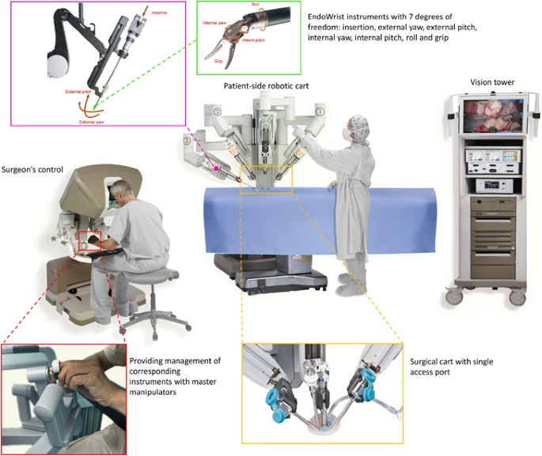
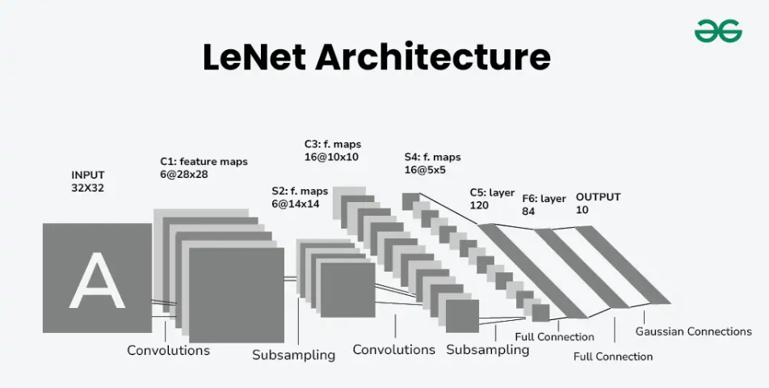
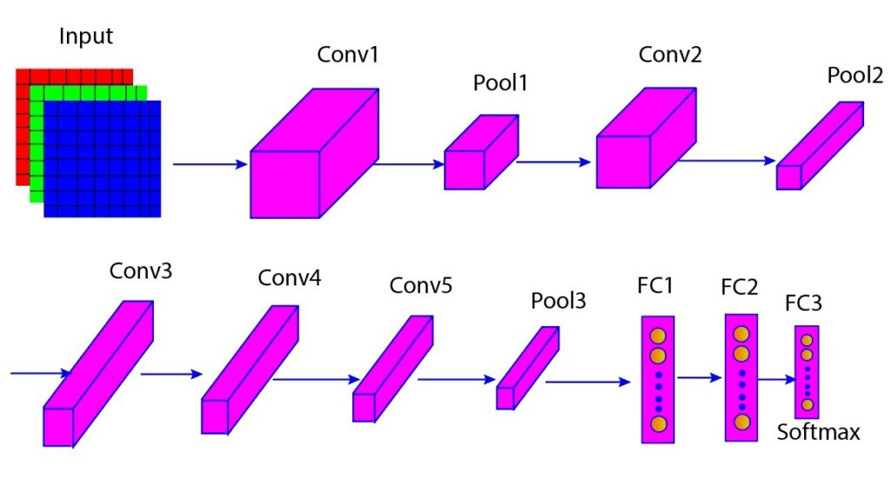
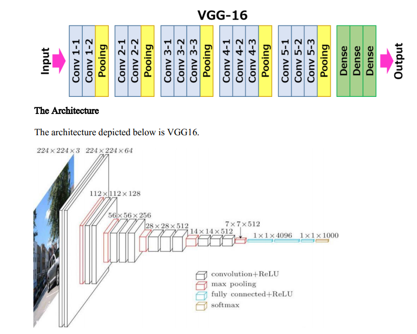
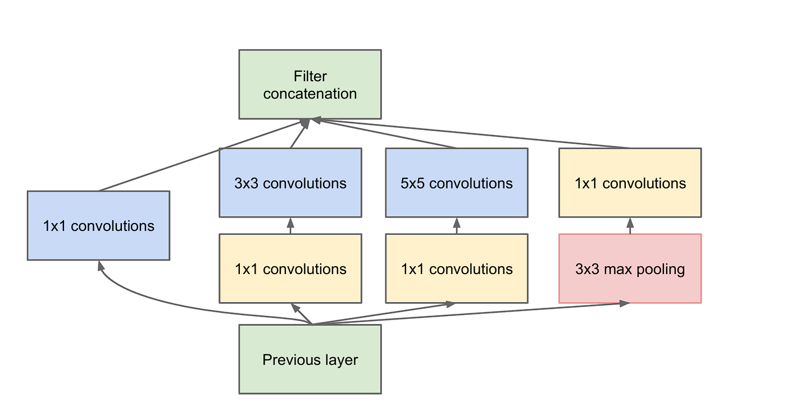
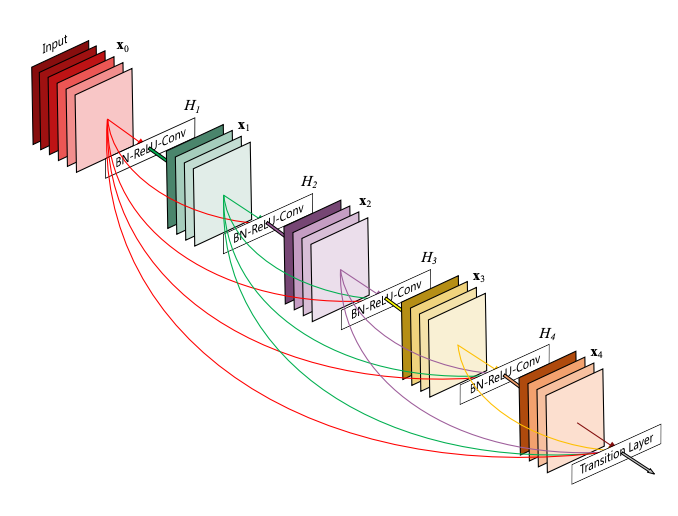

# Computer Vision for Health Data Science - Lecture 08

## Overall Learning Objectives

* Understand fundamental concepts of digital image representation and processing.
* Grasp the architecture and core components of Convolutional Neural Networks (CNNs) for image analysis.
* Learn about key computer vision tasks: image classification, object detection, and image segmentation, with a focus on medical applications.
* Gain hands-on experience loading, processing, and analyzing medical images using Python libraries.
* Be aware of transfer learning techniques and their utility in medical imaging.
* Recognize advanced topics and resources for further learning in medical computer vision, including an introduction to video object tracking.

## Outline

1. Introduction to Computer Vision & Image Data (20 min)
    * **What is Computer Vision?**
        * Brief overview and its significance in health data science.
        * Examples: Radiograph analysis, pathology slide interpretation, robotic surgery guidance.
    * **Digital Image Representation:**
        * Pixels, Resolution, Aspect Ratio.
        * Color Spaces: Grayscale, RGB.
    * **Medical Image Formats:**
        * **DICOM (Digital Imaging and Communications in Medicine):**
            * Overview: Structure, metadata (tags), pixel data.
            * Importance of Series, Study, Instance.
            * Concept of Windowing/Leveling for visualization.
        * Other common formats (PNG, JPEG, TIFF) and their use cases.
    * **Essential Python Libraries for Imaging:**
        * **Pillow (PIL Fork):** Basic image loading, manipulation, and saving.
        * **OpenCV (`cv2`):** Advanced image processing, feature detection, and CV algorithms.
        * **Pydicom & SimpleITK:** For reading, writing, and manipulating DICOM files.
        * **Matplotlib:** For image visualization.
    * **Reference Card:** Pillow & OpenCV: Core functions for image loading, saving, property access.
        * `Image.open()`, `Image.save()`, `image.size`, `image.mode` (Pillow)
        * `cv2.imread()`, `cv2.imwrite()`, `image.shape`, `cv2.cvtColor()` (OpenCV)
        * `pydicom.dcmread()` (Pydicom)
2. Convolutional Neural Networks (CNNs) for Image Analysis (20 min)
    * **Why CNNs for Images?**
        * Limitations of traditional NNs for image data.
        * Local connectivity, parameter sharing, and hierarchical feature learning.
    * **Core CNN Components (Building on previous NN knowledge):**
        * **Convolutional Layer:**
            * Filters/Kernels (and their role in feature detection).
            * Shared Weights & Parameter Efficiency.
            * Stride and Padding.
            * Feature Maps (Activation Maps).
        * **Activation Functions (e.g., ReLU):** Introducing non-linearity.
        * **Pooling Layer (e.g., Max Pooling):** Down-sampling and invariance.
        * **Fully Connected (Dense) Layer:** For classification based on learned features.
    * **Hierarchical Feature Learning:**
        * Visual examples: Early layers learn simple features (edges, corners), deeper layers learn more complex patterns (textures, parts of objects, objects).
    * **Building a CNN:** Stacking layers, typical architectural patterns (e.g., Conv-ReLU-Pool blocks).
    * **Ethical Note:** Brief mention of how biases in training data (e.g., medical images from specific demographics) can affect CNN feature learning and outcomes.
    * **Reference Card:** Key CNN Layers (TensorFlow/Keras syntax).
        * `tf.keras.layers.Conv2D()`
        * `tf.keras.layers.MaxPooling2D()`
        * `tf.keras.layers.Dense()`
        * `tf.keras.layers.ReLU()` / `activation='relu'`
    * **Minimal Example:** Conceptual structure of a simple CNN for image classification.

        ```python
        # Conceptual Keras model
        # model = Sequential([
        #   Conv2D(filters, kernel_size, activation='relu', input_shape=(...)),
        #   MaxPooling2D(),
        #   Conv2D(filters, kernel_size, activation='relu'),
        #   MaxPooling2D(),
        #   Flatten(),
        #   Dense(units, activation='relu'),
        #   Dense(num_classes, activation='softmax')
        # ])
        ```

3. Demo 1: Image Loading, Preprocessing & Basic CNN (10 min)

    * **File:** `lectures/08/demo/01_image_cnn_basics.md`
    * **Content:** Covers loading DICOM/standard images, inspection, preprocessing (resize, normalize, color convert), visualization, and optionally building a basic CNN structure.

4. Key Computer Vision Tasks & Techniques (25 min)
    1. Image Classification
        * Task: Assigning a label to an entire image (e.g., "normal" vs. "abnormal" chest X-ray).
        * Recap: Using CNNs as feature extractors followed by a classifier.
        * Common CNN Architectures (brief overview of their significance):
            * LeNet, AlexNet (historical context)
            * VGG, ResNet, Inception, DenseNet, MobileNet (key ideas like depth, residual connections, efficiency).

    2. Transfer Learning for Medical Image Classification

        * Concept: Using knowledge from models pre-trained on large datasets (e.g., ImageNet) for new, often smaller, medical datasets.
        * Why it's crucial for medical imaging (limited annotated data).
        * Strategies:
            * **Feature Extraction:** Use pre-trained CNN as a fixed feature extractor, train a new classifier on top.
            * **Fine-Tuning:** Unfreeze some of the later layers of the pre-trained CNN and train them on the new dataset with a small learning rate.
        * **Reference Card:** Transfer Learning Steps.
            1. Load pre-trained model (e.g., `tf.keras.applications.ResNet50(weights='imagenet', include_top=False)`).
            2. Freeze base model layers (`base_model.trainable = False`).
            3. Add new custom classification layers.
            4. Compile and train the new model on your data.
            5. (Optional) Fine-tune by unfreezing some top layers of the base model and re-training with a very low learning rate.

    3. Object Detection

        * Task: Classification + Localization (drawing bounding boxes around detected objects).
            * Examples: Finding nodules in lung CTs, identifying cells in microscopy.
        * Key Concepts:
            * Bounding Boxes (representation: x, y, width, height or x_min, y_min, x_max, y_max).
            * Anchor Boxes (predefined boxes of various scales/ratios).
            * Non-Maximum Suppression (NMS) (to remove redundant overlapping boxes).
        * Approaches (briefly):
            * Two-Stage Detectors (e.g., Faster R-CNN: region proposal then classification).
            * One-Stage Detectors (e.g., YOLO, SSD: direct prediction of boxes and classes).
        * Evaluation Metrics:
            * Intersection over Union (IoU).
            * Mean Average Precision (mAP).
        * **Reference Card:** IoU Calculation.
            * `IoU = Area_of_Overlap / Area_of_Union`

5. Demo 2: Transfer Learning for Medical Image Classification (10 min)

    * **File:** `lectures/08/demo/02_transfer_learning_classification.md`
    * **Content:** Demonstrates adapting a pre-trained CNN (e.g., MobileNetV2) for medical image classification using a MedMNIST subset, including model modification, training, and evaluation.

6. Image Segmentation (15 min)

    * Task: Pixel-level classification (assigning a class label to each pixel in an image).
        * Examples: Segmenting organs, delineating tumors, identifying different tissue types.
    * Types:
        * **Semantic Segmentation:** Labeling all pixels belonging to a class (e.g., all "tumor" pixels).
        * **Instance Segmentation:** Differentiating instances of the same class (e.g., "tumor_1", "tumor_2"). (Mention briefly, focus on semantic).
    * **U-Net Architecture:**
        * Significance and widespread use in medical image segmentation.
        * Encoder-Decoder Structure:
            * Contracting Path (Encoder): Captures context, extracts features (similar to a classification CNN).
            * Expanding Path (Decoder): Recovers spatial resolution, localizes features.
        * **Skip Connections:** Crucial for combining high-level semantic features from the encoder with low-level fine-grained features from the decoder, leading to precise segmentation. (Illustrate with a U-Net diagram).
    * Loss Functions for Segmentation (briefly):
        * Pixel-wise Cross-Entropy.
        * Dice Loss, Jaccard (IoU) Loss (better for imbalanced classes, common in medical segmentation).
    * **Reference Card:** U-Net Architecture Diagram (conceptual blocks).
    * **Minimal Example:** Conceptual U-Net structure.

        ```python
        # Conceptual U-Net structure
        # inputs = Input(...)
        # # Encoder
        # c1 = Conv2D(...)(inputs) ... p1 = MaxPooling2D(...)(c1)
        # ...
        # # Bottleneck
        # bn = Conv2D(...)(...)
        # # Decoder
        # u1 = Conv2DTranspose(...)(bn) ... u1 = concatenate([u1, c_corresponding]) ... u1 = Conv2D(...)(u1)
        # ...
        # outputs = Conv2D(num_classes, 1, activation='softmax')(...)
        # model = Model(inputs=[inputs], outputs=[outputs])
        ```

7. Demo 3: Pre-trained Object Detection or Segmentation (10 min)

    * **File:** `lectures/08/demo/03_pretrained_detection_or_segmentation.md`
    * **Content:** Offers options for using pre-trained models for either object detection (e.g., YOLO) or image segmentation (e.g., DeepLabV3 from TF Hub), focusing on inference and visualization.

8. Advanced Topics & Future Directions (10 min)

    * **Briefly touch upon:**
        * **Video Data:** Images over time, introducing temporal dimension. Challenges: motion, appearance changes.
        * **Vision Transformers (ViTs):** Applying Transformer architectures (from NLP) to images. How they work (patches as tokens, self-attention). Potential advantages in medical imaging.
        * **Generative Models (GANs, Diffusion Models):**
            * Synthetic medical data generation (for data augmentation, privacy).
            * Image enhancement, super-resolution, modality translation.
        * **Explainable AI (XAI) for Medical CV:**
            * Importance of model interpretability in clinical settings (trust, debugging, discovery).
            * Methods like Grad-CAM, LIME, SHAP to visualize what the model "looks at".
        * **Self-Supervised Learning:** Learning representations from unlabeled data, reducing reliance on large annotated datasets.
    * **Data Augmentation:**
        * Techniques: Rotation, scaling, flipping, brightness/contrast changes, elastic deformations.
        * Libraries: Albumentations (powerful for image augmentation).
    * **Key Libraries & Toolkits for Medical CV:**
        * **MONAI:** PyTorch-based framework for deep learning in healthcare imaging.
        * **SimpleITK:** Powerful library for medical image analysis, including registration and segmentation.

9. Mini-Demo: Introduction to Video Object Tracking (5 min)

    * **File:** `lectures/08/demo/04_video_object_tracking_mini_demo.md`
    * **Content:** Introduces video object tracking concepts with brief visual demonstrations of detection-based (NN) and optical flow-based approaches.

10. References & Further Learning

    * **Key Review Papers / Comprehensive Textbooks:** (Self-search encouraged for latest comprehensive resources and foundational texts in medical computer vision).
    * **Datasets:** TCIA (The Cancer Imaging Archive), Grand Challenge, MedMNIST, Kaggle datasets.
    * **Annotation Tools:** ITK-SNAP, 3D Slicer, LabelMe, CVAT.
    * **Conferences:** MICCAI (Medical Image Computing and Computer Assisted Intervention), CVPR (Conference on Computer Vision and Pattern Recognition), RSNA (Radiological Society of North America).
    * **Online Courses & Communities:** Platforms like Coursera, edX, Fast.ai; communities like Kaggle, PapersWithCode.

---

## Lecture Content

### 1. Introduction to Computer Vision & Image Data (Est. 20 min)

Welcome to the fascinating world of Computer Vision! 👁️‍🗨️💻

<!---
    **Speaking Notes:**
    *   Start with a hook: "How many of you have a smartphone that can recognize your face? Or have seen cars that can drive themselves? That's computer vision in action!"
    *   Transition to the relevance in health data science. Emphasize that images are a huge and rich source of data in healthcare.
    *   Keep the energy up – this is an exciting field!
--->

#### A. What is Computer Vision?

**Computer Vision (CV)** is a field of artificial intelligence (AI) that enables computers and systems to derive meaningful information from digital images, videos, and other visual inputs — and take actions or make recommendations based on that information. If AI enables computers to think, computer vision enables them to see, observe, and understand.

It's like teaching a computer to "see" and interpret the world much like humans do, but often with the ability to perceive details or patterns that might escape the human eye, or to do so tirelessly and at scale.

**Significance in Health Data Science:**
In healthcare, computer vision is revolutionizing numerous areas:

*   **Diagnostics:** Assisting in the detection and diagnosis of diseases from medical scans (e.g., identifying tumors in MRIs, cancerous cells in pathology slides, or signs of diabetic retinopathy in fundus images).
*   **Surgical Assistance:** Guiding robotic surgeries with enhanced precision, providing real-time feedback to surgeons.
*   **Patient Monitoring:** Observing patients for fall detection, monitoring vital signs remotely, or tracking recovery progress.
*   **Drug Discovery:** Analyzing cellular images to understand drug effects and accelerate research.
*   **Personalized Medicine:** Tailoring treatments based on visual biomarkers extracted from images.

**Examples in Healthcare:**

1.  **Radiograph Analysis:**
    *   Detecting pneumonia or lung nodules in Chest X-rays.
    *   Identifying fractures in bone X-rays.
    <!-- #FIXME: Add image: Example of a chest X-ray with a highlighted nodule (simulated or real if public domain and annotated). lectures/08/media/xray_nodule_example.png -->
    
    <!---
        **Speaking Notes:**
        *   Briefly explain what a radiograph is.
        *   Mention the challenges: subtle signs, inter-observer variability among radiologists.
        *   CV can act as a "second pair of eyes."
    --->

2.  **Pathology Slide Interpretation:**
    *   Automated counting and classification of cells (e.g., identifying cancerous vs. non-cancerous cells).
    *   Grading tumors based on morphology.
    <!-- #FIXME: Add image: Example of a digital pathology slide with cells highlighted/classified. lectures/08/media/pathology_slide_example.png -->
    
    <!---
        **Speaking Notes:**
        *   Pathology is a cornerstone of cancer diagnosis.
        *   Huge amounts of data on a single slide; CV can help analyze this efficiently.
    --->

3.  **Robotic Surgery Guidance:**
    *   Providing surgeons with 3D visualization of the surgical site.
    *   Tracking surgical instruments with high precision.
    *   Overlaying pre-operative scan data onto the live surgical view.
    <!-- #FIXME: Add image: Conceptual image of robotic surgery with CV guidance (e.g., screen overlay). lectures/08/media/robotic_surgery_cv.png -->
    
    <!---
        **Speaking Notes:**
        *   Focus on how CV enhances the surgeon's capabilities, improving outcomes and safety.
    --->

Think of the last time you used a filter on a photo app, or how your phone unlocks with your face. That's computer vision! Now imagine that power applied to saving lives.

#### B. Digital Image Representation

How does a computer "see" an image? It all comes down to numbers!

<!---
    **Speaking Notes:**
    *   Relate this to something students already know – perhaps how text is represented by numbers (ASCII, Unicode).
    *   Use an analogy: a digital image is like a giant spreadsheet of numbers.
--->

*   **Pixels (Picture Elements):**
    *   A digital image is a grid of tiny squares called pixels. Each pixel has a specific location (coordinates) and a value (or set of values) representing its color or intensity.
    *   Think of it like a mosaic, where each tile is a pixel.
    <!-- #FIXME: Add image: Zoomed-in image showing individual pixels. lectures/08/media/pixel_grid_example.png -->
    

*   **Resolution:**
    *   Describes the dimensions of the image in terms of pixels, typically expressed as `width x height` (e.g., 1920x1080 pixels).
    *   Higher resolution means more pixels, more detail, but also a larger file size and more data to process.
    <!---
        **Speaking Notes:**
        *   Show two images of the same thing at different resolutions to illustrate the point.
        *   Mention the trade-off: detail vs. computational cost.
    --->
    <!-- #FIXME: Add image: Side-by-side comparison of a low-res and high-res image of the same subject. lectures/08/media/resolution_comparison.png -->
    

*   **Aspect Ratio:**
    *   The ratio of an image's width to its height (e.g., 16:9 for widescreen, 4:3 for older displays, 1:1 for square images).
    *   Important for displaying images without distortion.

*   **Color Spaces:** Define how pixel values are interpreted as colors.
    *   **Grayscale:**
        *   Each pixel has a single value representing its intensity (shade of gray), typically from 0 (black) to 255 (white) for an 8-bit image.
        *   Common in medical imaging like X-rays and CT scans where color isn't primary diagnostic information.
        <!-- #FIXME: Add image: Example of a grayscale medical image (e.g., X-ray) and a small patch showing pixel intensity values. lectures/08/media/grayscale_example.png -->
        
    *   **RGB (Red, Green, Blue):**
        *   Each pixel has three values, one for the intensity of Red, one for Green, and one for Blue.
        *   By combining these three primary colors in various proportions, a wide spectrum of colors can be represented.
        *   Each channel typically ranges from 0 to 255. So, a white pixel might be (255, 255, 255) and a black pixel (0, 0, 0). A pure red pixel would be (255, 0, 0).
        *   Used in color photography, dermatology images, some pathology stains.
        <!-- #FIXME: Add image: An RGB image decomposed into its R, G, and B channels. lectures/08/media/rgb_channels_example.png -->
        
    <!---
        **Speaking Notes:**
        *   Briefly mention that there are other color spaces (HSV, CMYK) but RGB and Grayscale are most common for our purposes.
        *   Explain bit depth briefly (e.g., 8-bit means 2^8 = 256 values per channel). Medical images can have higher bit depths (e.g., 12-bit, 16-bit) for more intensity levels.
    --->

#### C. Medical Image Formats

While we see images as JPEGs or PNGs in daily life, medical imaging has specialized formats, primarily DICOM.

<!---
    **Speaking Notes:**
    *   Emphasize that DICOM is more than just pixels; it's a comprehensive standard.
    *   This is crucial for interoperability and maintaining patient context.
--->

*   **DICOM (Digital Imaging and Communications in Medicine):**
    *   **Overview:** The international standard for handling, storing, printing, and transmitting information in medical imaging. It includes a file format definition and a network communications protocol.
    *   **Structure:** A DICOM file is not just an image; it's a dataset containing:
        *   **Pixel Data:** The actual image itself.
        *   **Metadata (Tags):** A rich set of information about the patient (e.g., PatientID, PatientName, Age, Sex), the acquisition (e.g., Modality like CT/MR/X-Ray, StudyDate, AcquisitionTime, equipment settings like KVP for X-rays), the study, series, and more. These are stored as key-value pairs called DICOM tags (e.g., `(0010,0010)` for PatientName).
        <!-- #FIXME: Add image: Screenshot of a DICOM viewer showing image and some metadata tags. lectures/08/media/dicom_viewer_metadata.png -->
        
    *   **Importance of Series, Study, Instance:**
        *   **Instance:** A single image (or frame in a multi-frame image).
        *   **Series:** A sequence of related images acquired in a specific way (e.g., multiple slices in a CT scan, different views in an X-ray exam).
        *   **Study:** A collection of series for a particular patient exam (e.g., a chest CT study might include multiple series with different reconstruction parameters).
        <!---
            **Speaking Notes:**
            *   Analogy: Study = Doctor's visit/exam. Series = A set of pictures taken during that exam. Instance = One picture.
        --->
    *   **Concept of Windowing/Leveling (or Window Width/Window Center):**
        *   Medical images, especially from modalities like CT, often have a much wider range of pixel intensity values than can be displayed effectively on a standard monitor (e.g., 12-bit or 16-bit data, representing thousands of shades).
        *   **Windowing** allows us to select a specific range of these intensity values (the "window") to display.
            *   **Window Width (WW):** The range of intensity values displayed. A narrow window provides higher contrast for values within that range.
            *   **Window Level (WL) or Window Center (WC):** The center of that intensity range.
        *   By adjusting WW/WL, clinicians can highlight different tissues (e.g., bone window, lung window, soft tissue window in a CT scan).
        <!-- #FIXME: Add image: Example of a CT scan displayed with different window/level settings (e.g., bone window vs. lung window). lectures/08/media/dicom_windowing_example.png -->
        
        <!---
            **Speaking Notes:**
            *   This is a critical concept for anyone working with raw DICOM data, as the default display might not show the relevant structures.
            *   It's a form of display normalization, not a change to the underlying pixel data.
        --->

*   **Other Common Formats (PNG, JPEG, TIFF):**
    *   **PNG (Portable Network Graphics):** Lossless compression, good for medical images where detail is critical and for images with sharp lines/text. Supports transparency.
    *   **JPEG (Joint Photographic Experts Group):** Lossy compression, good for photographs, can achieve high compression ratios but may introduce artifacts. Often *not* ideal for primary diagnostic medical images but might be used for previews or non-diagnostic purposes.
    *   **TIFF (Tagged Image File Format):** Flexible format, can be lossless or lossy, supports multiple layers and high bit depths. Sometimes used in research or for microscopy.
    *   **Use Cases:** These formats are often used when DICOMs are converted for research, publication, or use in systems that don't directly support DICOM. However, conversion can lead to loss of metadata.

    [](https://xkcd.com/2178/)
    <!-- Source: https://xkcd.com/2178/ -->
    <!---
        **Speaking Notes:**
        *   Briefly discuss the implications of lossy vs. lossless compression in a medical context.
        *   Mention that when converting from DICOM, it's crucial to consider what metadata might be lost.
    --->

#### D. Essential Python Libraries for Imaging

To work with these images in Python, we have several powerful libraries:

<!---
    **Speaking Notes:**
    *   This is a quick overview; students will get hands-on in the demo.
    *   Highlight the primary purpose of each.
--->

*   **Pillow (PIL Fork):**
    *   The "Python Imaging Library" (PIL) was the original, but Pillow is the actively maintained fork.
    *   Great for basic image loading, manipulation (resizing, cropping, rotation, color conversion), and saving in various common formats (PNG, JPEG, TIFF, etc.).
    *   Generally easier to use for simple tasks than OpenCV.
    <!-- #FIXME: Add image: Pillow logo. lectures/08/media/pillow_logo.png -->
    

*   **OpenCV (`cv2`):**
    *   Open Source Computer Vision Library – a comprehensive library for a vast range of computer vision and image processing algorithms.
    *   Excellent for more advanced tasks: feature detection, object tracking, video analysis, image filtering, morphological operations, and much more.
    *   Can read/write many image and video formats.
    *   Often preferred for performance-critical applications.
    <!-- #FIXME: Add image: OpenCV logo. lectures/08/media/opencv_logo.png -->
    

*   **Pydicom:**
    *   The go-to library for reading, modifying, and writing DICOM files in Python.
    *   Allows easy access to both the pixel data and all the metadata tags.
    <!-- #FIXME: Add image: Pydicom logo (if one exists, or a conceptual DICOM tag icon). lectures/08/media/pydicom_logo.png -->
    

*   **SimpleITK (or ITK-Python):**
    *   Built on top of the Insight Segmentation and Registration Toolkit (ITK), a powerful open-source system for image analysis, particularly strong in medical image registration and segmentation.
    *   Provides an easier-to-use Python interface to many ITK functionalities.
    *   Supports many medical image formats, including DICOM.
    <!-- #FIXME: Add image: SimpleITK or ITK logo. lectures/08/media/simpleitk_logo.png -->
    

*   **Matplotlib:**
    *   While primarily a plotting library, `matplotlib.pyplot` (often imported as `plt`) is extensively used for displaying images within Python scripts and Jupyter notebooks (`plt.imshow()`).
    *   Essential for visualizing images, feature maps, and results.
    <!-- #FIXME: Add image: Matplotlib logo. lectures/08/media/matplotlib_logo.png -->
    

#### E. Reference Card: Basic Image Loading & Properties

Here's a quick reference for common operations. We'll see these in action in the demo!

**Pillow (`from PIL import Image`)**
*   Load image: `img_pil = Image.open("path/to/image.png")`
*   Save image: `img_pil.save("path/to/output.jpg")`
*   Get size (width, height): `width, height = img_pil.size`
*   Get mode (e.g., 'RGB', 'L'): `mode = img_pil.mode`
*   Convert to NumPy array: `img_np = np.array(img_pil)`

**OpenCV (`import cv2`)**
*   Load image: `img_cv = cv2.imread("path/to/image.png")` (reads as BGR by default)
    *   Load as grayscale: `img_gray_cv = cv2.imread("path/to/image.png", cv2.IMREAD_GRAYSCALE)`
*   Save image: `cv2.imwrite("path/to/output.png", img_cv)`
*   Get shape (height, width, channels): `h, w, c = img_cv.shape` (if color) or `h, w = img_gray_cv.shape` (if grayscale)
*   Convert color space (e.g., BGR to RGB): `img_rgb_cv = cv2.cvtColor(img_cv, cv2.COLOR_BGR2RGB)`

**Pydicom (`import pydicom`)**
*   Load DICOM file: `ds = pydicom.dcmread("path/to/dicomfile.dcm")`
*   Access pixel data: `pixel_array = ds.pixel_array`
*   Access metadata tag (e.g., PatientName): `patient_name = ds.PatientName` or `patient_name = ds[0x0010, 0x0010].value`

<!---
    **Speaking Notes:**
    *   Reassure students that they don't need to memorize this all now.
    *   The demos will make these concrete.
    *   This card is for their future reference.
--->

### 2. Convolutional Neural Networks (CNNs) for Image Analysis (Est. 20 min)

Now that we understand how images are represented digitally, let's dive into the workhorses of modern computer vision: Convolutional Neural Networks, or CNNs (sometimes called ConvNets). You've encountered Neural Networks before; CNNs are a specialized type brilliantly designed for processing grid-like data, such as images.

<!---
    **Speaking Notes:**
    *   Connect to previous NN lecture. Ask students what they remember about standard NNs (Dense layers).
    *   Motivate *why* CNNs are needed for images, as opposed to just flattening an image and feeding it to a regular Dense network.
--->

#### A. Why CNNs for Images?

If you have a 224x224 pixel RGB image, that's 224 * 224 * 3 = 150,528 input features! If you fed this into a standard fully connected neural network (Dense layers), the first hidden layer alone would have an enormous number of weights. For example, a hidden layer with just 1000 neurons would mean 150,528 * 1000 weights! This leads to:

*   **Huge number of parameters:** Computationally expensive, prone to overfitting, requires massive datasets.
*   **Loss of spatial information:** Flattening an image into a 1D vector discards the 2D structure – the fact that nearby pixels are related is lost. A pixel on the top left is treated the same as a pixel on the bottom right in terms of its input connection to a neuron.

CNNs address these issues through three key ideas:

1.  **Local Connectivity (Receptive Fields):** Neurons in a convolutional layer are only connected to a small, local region of the input image (their "receptive field"). This allows the network to learn features like edges or corners from small parts of the image first.
    <!---
        **Speaking Notes:**
        *   Analogy: Like how your eye focuses on a small part of a scene at a time to recognize details.
    --->
2.  **Parameter (Weight) Sharing:** The same set of weights (a "filter" or "kernel") is applied across different locations in the input image. If a filter is good at detecting a horizontal edge, it can detect it anywhere in the image using the same weights. This drastically reduces the number of parameters.
    <!---
        **Speaking Notes:**
        *   This is a powerful concept. It means the network learns features that are *translation invariant* (an edge is an edge, no matter where it appears).
    --->
3.  **Hierarchical Feature Learning:** CNNs typically stack multiple layers. Early layers learn simple features (edges, corners, textures). Subsequent layers combine these simple features to learn more complex patterns (parts of objects, like an eye or a wheel), and even deeper layers can learn to recognize entire objects.
    <!---
        **Speaking Notes:**
        *   This mimics how the human visual cortex is thought to work, processing information in a hierarchy.
    --->

[](https://xkcd.com/1838/)
<!-- Source: https://xkcd.com/1838/ -->
<!-- While not directly about CNNs, it humorously touches on the "pile of linear algebra" aspect of NNs. -->

#### B. Core CNN Components

Let's break down the main building blocks of a CNN. These build upon concepts from standard neural networks but are specialized for image data.

<!---
    **Speaking Notes:**
    *   For each component, explain its purpose, key parameters/concepts, and how it contributes to the overall network.
    *   Use analogies and simple diagrams where possible.
--->

1.  **Convolutional Layer:** The star of the show! 🌟
    *   **Purpose:** To extract features from the input image by applying learnable filters.
    *   **Filters/Kernels:**
        *   Small matrices of weights (e.g., 3x3, 5x5 pixels). Each filter is specialized to detect a particular type of feature (e.g., an edge, a specific texture, a corner).
        *   The layer typically learns multiple filters in parallel, each looking for a different pattern.
        <!-- #FIXME: Add image: Diagram showing a 3x3 filter sliding over an input image patch, performing element-wise multiplication and sum. lectures/08/media/convolution_filter_animation.gif (animated if possible) or lectures/08/media/convolution_filter_static.png -->
        
        <!---
            **Speaking Notes:**
            *   Analogy: A filter is like a magnifying glass that highlights specific patterns.
            *   Show a simple example of an edge detection kernel (e.g., Sobel) if time permits, or just describe it.
        --->
    *   **Shared Weights & Parameter Efficiency:** As mentioned, the *same* filter (set of weights) is convolved (slid) across the entire input image. This means the number of parameters depends only on the filter size and number of filters, not the input image size.
    *   **Stride:** The number of pixels the filter slides over the input image at each step. A stride of 1 means it moves one pixel at a time. A stride of 2 means it skips every other pixel, which can also reduce the output size.
    *   **Padding:** Adding pixels (usually zeros) around the border of the input image before convolution.
        *   **Why?** Without padding, the output feature map would be smaller than the input. Also, pixels at the very edge of the image would be processed by the filter fewer times than pixels in the center.
        *   `padding='valid'` (no padding): Output size shrinks.
        *   `padding='same'`: Padding is added such that the output feature map has the same height and width as the input (assuming stride 1).
        <!-- #FIXME: Add image: Diagram illustrating 'valid' vs 'same' padding. lectures/08/media/padding_example.png -->
        
    *   **Feature Maps (Activation Maps):** The output of applying one filter across the input image. It's a 2D map where high values indicate the presence of the feature that the filter is tuned to detect. If a convolutional layer has, say, 32 filters, it will produce 32 feature maps.
        <!-- #FIXME: Add image: Example showing an input image and a couple of resulting feature maps highlighting different aspects (e.g., edges, textures). lectures/08/media/feature_maps_example.png -->
        

2.  **Activation Functions (e.g., ReLU):**
    *   **Purpose:** To introduce non-linearity into the model. Without non-linearity, a deep stack of layers would behave like a single linear layer.
    *   **ReLU (Rectified Linear Unit):** `f(x) = max(0, x)`.
        *   Very common in CNNs. It's simple, computationally efficient, and helps mitigate the vanishing gradient problem.
        *   It essentially "turns off" neurons that have negative activation.
    <!-- #FIXME: Add image: Graph of the ReLU activation function. lectures/08/media/relu_function.png -->
    
    <!---
        **Speaking Notes:**
        *   Remind students about activation functions from the general NN lecture.
        *   Mention other activations like Sigmoid or Tanh are less common in hidden conv layers but might appear in output layers for specific tasks.
    --->

3.  **Pooling Layer (e.g., Max Pooling):**
    *   **Purpose:** To reduce the spatial dimensions (height and width) of the feature maps, thereby reducing the number of parameters and computation in the network. It also helps to make the learned features somewhat invariant to small translations in the input.
    *   **Max Pooling:** The most common type. It takes a small window (e.g., 2x2 pixels) over the feature map and outputs the maximum value within that window. It effectively keeps the strongest activations.
    *   **Average Pooling:** Takes the average value within the window. Less common in modern CNNs for feature extraction.
    <!-- #FIXME: Add image: Diagram illustrating 2x2 Max Pooling operation on a small feature map. lectures/08/media/max_pooling_example.png -->
    
    <!---
        **Speaking Notes:**
        *   Analogy: Summarizing a neighborhood by its most prominent feature.
        *   Explain how this helps with computational efficiency and some degree of translation invariance.
    --->

4.  **Fully Connected (Dense) Layer:**
    *   **Purpose:** Typically used at the end of the CNN, after several convolutional and pooling layers have extracted features and reduced dimensionality. These layers perform the final classification (or regression) based on the high-level features learned by the convolutional part of the network.
    *   **How it works:** Each neuron in a dense layer is connected to *all* neurons in the previous layer (which is usually the flattened output of the last pooling or convolutional layer).
    *   The final dense layer often has a `softmax` activation function for multi-class classification (to output probabilities for each class) or a `sigmoid` for binary classification.
    <!---
        **Speaking Notes:**
        *   This is where the "decision making" happens based on the learned features.
        *   Connect this back to the standard Dense layers students learned about previously.
    --->

#### C. Hierarchical Feature Learning

One of the most powerful aspects of CNNs is their ability to automatically learn a hierarchy of features.

*   **Early Layers (closer to input):** Learn simple, low-level features like edges, corners, simple textures, and color blobs.
    <!-- #FIXME: Add image: Visualization of features learned by early CNN layers (e.g., Gabor-like filters, edge detectors). lectures/08/media/cnn_early_features.png -->
    
*   **Middle Layers:** Combine these low-level features to detect more complex patterns or parts of objects, like an eye, a nose, a wheel, or a specific texture pattern (e.g., fur, scales).
    <!-- #FIXME: Add image: Visualization of features learned by middle CNN layers (e.g., object parts). lectures/08/media/cnn_mid_features.png -->
    
*   **Deeper Layers (closer to output):** Combine mid-level features to recognize entire objects or more abstract concepts relevant to the task.
    <!-- #FIXME: Add image: Visualization of features/activations from deeper CNN layers showing object-level recognition. lectures/08/media/cnn_deep_features.png -->
    

This hierarchical process allows CNNs to learn rich, discriminative representations from raw pixel data without requiring manual feature engineering, which was a major bottleneck in traditional computer vision.

<!---
    **Speaking Notes:**
    *   This is a key takeaway! Emphasize the "automatic feature learning" aspect.
    *   Use an analogy: learning letters -> words -> sentences -> meaning.
--->

#### D. Building a CNN: Stacking Layers

A typical CNN architecture for image classification involves stacking these layers:

`INPUT -> [[CONV -> ReLU] * N -> POOL?] * M -> [FC -> ReLU] * K -> FC (Softmax/Sigmoid)`

Where:
*   `CONV -> ReLU`: A convolutional layer followed by a ReLU activation. This block might be repeated `N` times.
*   `POOL?`: An optional pooling layer.
*   This entire `[[CONV -> ReLU] * N -> POOL?]` block might be repeated `M` times, with the number of filters in CONV layers often increasing in deeper blocks.
*   `FC -> ReLU`: A fully connected layer followed by ReLU. This might be repeated `K` times.
*   The final `FC` layer is the output layer with an appropriate activation for the task (e.g., softmax for multi-class classification).
*   A `Flatten` layer is needed before the first FC layer to convert the 2D feature maps from the convolutional/pooling part into a 1D vector.

<!-- #FIXME: Add image: A simple block diagram of a typical CNN architecture (e.g., Input -> Conv -> Pool -> Conv -> Pool -> FC -> Output). lectures/08/media/cnn_architecture_diagram.png -->


<!---
    **Speaking Notes:**
    *   Walk through a very simple conceptual example (like LeNet-5 if students have heard of it, or just a generic one).
    *   Don't get bogged down in specific numbers of filters/layers yet, just the general flow.
--->

#### E. Ethical Note: Bias in CNNs

It's crucial to remember that CNNs learn from the data they are trained on. If the training data contains biases, the CNN will learn and potentially amplify these biases.

*   **Example in Medical Imaging:** If a CNN for detecting skin cancer is trained predominantly on images of light-skinned individuals, it may perform poorly on images of dark-skinned individuals, leading to health disparities.
*   **Other Biases:** Datasets might be biased by age, sex, socioeconomic status, geographic location, or the types of equipment used for imaging.

**Consequences:**
*   Inequitable performance across different demographic groups.
*   Reinforcement of existing health disparities.
*   Lack of trust in AI systems if they are perceived as unfair or inaccurate for certain populations.

**Addressing Bias:**
*   Curating diverse and representative training datasets.
*   Developing bias detection and mitigation techniques.
*   Auditing models for fairness across subgroups.
*   Ensuring transparency in model development and deployment.

This is an active area of research and a critical consideration for deploying AI in healthcare responsibly.

<!---
    **Speaking Notes:**
    *   This is a very important point. Emphasize the responsibility of data scientists.
    *   Relate it to the "Garbage In, Garbage Out" principle.
--->

#### F. Reference Card: Key CNN Layers (TensorFlow/Keras)

Here are the common TensorFlow/Keras layers used to build CNNs:

*   **Convolutional Layer:**
    *   `tf.keras.layers.Conv2D(filters, kernel_size, strides=(1,1), padding='valid', activation=None, ...)`
        *   `filters`: Number of output filters (feature maps).
        *   `kernel_size`: Height and width of the convolution window (e.g., `(3,3)`).
        *   `strides`: Tuple of 2 integers, specifying the strides of the convolution.
        *   `padding`: `"valid"` or `"same"`.
        *   `activation`: Activation function to use (e.g., `'relu'`, or apply separately).

*   **Activation (can be part of a layer or separate):**
    *   `tf.keras.layers.ReLU()`
    *   Or use `activation='relu'` argument in `Conv2D` or `Dense`.

*   **Pooling Layer (Max Pooling):**
    *   `tf.keras.layers.MaxPooling2D(pool_size=(2,2), strides=None, padding='valid', ...)`
        *   `pool_size`: Window size to take the max over (e.g., `(2,2)`).
        *   `strides`: Strides of the pooling operation. Defaults to `pool_size`.

*   **Flatten Layer:**
    *   `tf.keras.layers.Flatten()`
        *   Converts multi-dimensional input (e.g., from pooling layer) to a 1D vector.

*   **Fully Connected (Dense) Layer:**
    *   `tf.keras.layers.Dense(units, activation=None, ...)`
        *   `units`: Number of neurons in the layer.
        *   `activation`: Activation function (e.g., `'relu'`, `'softmax'`, `'sigmoid'`).

#### G. Minimal Example: Conceptual CNN Structure

This is the conceptual Keras model structure we saw in the outline. It illustrates how these layers are typically stacked. We'll build something similar in the demo.

```python
# Conceptual Keras model for image classification
# from tensorflow.keras.models import Sequential
# from tensorflow.keras.layers import Conv2D, MaxPooling2D, Flatten, Dense

# model = Sequential([
#   Conv2D(32, (3,3), activation='relu', input_shape=(height, width, channels), padding='same'),
#   MaxPooling2D((2,2)),
#   Conv2D(64, (3,3), activation='relu', padding='same'),
#   MaxPooling2D((2,2)),
#   Flatten(),
#   Dense(128, activation='relu'),
#   Dense(num_classes, activation='softmax') # For multi-class output
# ])

# model.summary() # Would print the architecture
```

<!---
    **Speaking Notes:**
    *   Briefly point out the increasing number of filters in deeper conv layers (common practice).
    *   Mention the flatten layer as the bridge to the dense layers.
    *   This sets the stage for the first demo where they might build a simple CNN structure.
--->

### 3. Demo 1: Image Loading, Preprocessing & Basic CNN (Est. 10 min)

Alright, theory is great, but let's get our hands dirty! 🛠️
In this first demo, we'll put into practice what we've learned about digital images and the basic building blocks of CNNs.

<!---
    **Speaking Notes:**
    *   Transition smoothly from the CNN concepts to the demo.
    *   "We've talked about pixels, DICOM, Python libraries, and the layers of a CNN. Now let's see them in action."
    *   Briefly state the objectives of the demo.
    *   Direct students to open the demo file.
--->

*   **File:** [`lectures/08/demo/01_image_cnn_basics.md`](lectures/08/demo/01_image_cnn_basics.md)
*   **Content:** This demo notebook will guide you through:
    *   Loading medical images in both DICOM and standard formats (like PNG/JPEG) using `Pydicom`, `Pillow`, and `OpenCV`.
    *   Inspecting image properties: dimensions, pixel data types, and extracting metadata from DICOM files.
    *   Performing essential preprocessing steps: resizing images to a uniform size, normalizing pixel values, and converting between color spaces (e.g., RGB to grayscale).
    *   Visualizing images at various stages using `Matplotlib`.
    *   Optionally, we'll define the structure of a very simple CNN model using `TensorFlow/Keras` and look at its summary (we won't train it in this demo, just see how it's built).

**Let's switch over to the demo notebook!**

<!---
    **Speaking Notes:**
    *   Ensure students know where to find the demo file.
    *   Be prepared to guide them through the initial steps if they have environment issues.
    *   The demo itself has detailed explanations.
--->

### 4. Key Computer Vision Tasks & Techniques (Est. 25 min)

Now that we have a foundational understanding of images and CNNs, let's explore some of the major tasks that computer vision can accomplish, especially in the context of health data.

<!---
    **Speaking Notes:**
    *   Transition from the basics to applications.
    *   "We've built our toolkit (image understanding, CNNs). Now, what cool things can we *do* with it?"
    *   Introduce the three main tasks for this section: Classification, Transfer Learning (as a technique for classification), and Object Detection.
--->

#### A. Image Classification

**Task:** Assigning a single label (or class) to an entire image.
*   **Question it answers:** "What is in this image?" or "Does this image belong to category X?"
*   **Examples in Health Data Science:**
    *   Classifying a chest X-ray as "normal" or "pneumonia."
        <!-- #FIXME: Add image: Example of a chest X-ray labeled "Pneumonia" and another labeled "Normal". lectures/08/media/xray_classification_example.png -->
        
    *   Determining if a skin lesion image is "benign" or "malignant."
        <!-- #FIXME: Add image: Example of a dermoscopy image labeled "Malignant" and another "Benign". lectures/08/media/dermoscopy_classification_example.png -->
        
    *   Identifying the type of cell in a microscopy image (e.g., "lymphocyte," "epithelial cell").

**Recap: Using CNNs for Classification**
As we discussed, a typical CNN architecture for classification uses:
1.  A series of convolutional and pooling layers to extract increasingly complex features from the image.
2.  A `Flatten` layer to convert the 2D feature maps into a 1D vector.
3.  One or more `Dense` (fully connected) layers to perform classification based on these features.
4.  An output `Dense` layer with `softmax` activation (for multi-class) or `sigmoid` activation (for binary-class) to produce the class probabilities or label.

**Common CNN Architectures (A Brief Historical Tour & Key Ideas):**
Over the years, researchers have developed many influential CNN architectures. Understanding their evolution can provide insights into what makes these models work well. We won't dive deep, but it's good to be familiar with some names:

*   **LeNet-5 (1990s, Yann LeCun et al.):** One of the earliest successful CNNs, primarily used for handwritten digit recognition (MNIST dataset). Relatively simple by today's standards but laid much of the groundwork.
    <!-- #FIXME: Add image: Diagram of LeNet-5 architecture. lectures/08/media/lenet5_architecture.png -->
    
*   **AlexNet (2012, Alex Krizhevsky et al.):** A breakthrough! Won the ImageNet Large Scale Visual Recognition Challenge (ILSVRC) by a large margin. Deeper and wider than LeNet, used ReLU activations and dropout for regularization. Showed the power of GPUs for training deep networks.
    <!-- #FIXME: Add image: Diagram of AlexNet architecture. lectures/08/media/alexnet_architecture.png -->
    
*   **VGGNets (VGG-16, VGG-19) (2014, Simonyan & Zisserman):** Showed that depth is critical. Used very small (3x3) convolutional filters stacked on top of each other. Simpler and more uniform architecture than AlexNet. Very influential, though computationally expensive.
    <!-- #FIXME: Add image: Diagram of VGG-16 architecture. lectures/08/media/vgg16_architecture.png -->
    
*   **GoogLeNet / Inception (2014, Szegedy et al.):** Introduced the "Inception module," which performs convolutions with different filter sizes in parallel and concatenates their outputs. This allows the network to capture features at multiple scales. More computationally efficient than VGG.
    <!-- #FIXME: Add image: Diagram of an Inception module. lectures/08/media/inception_module.png -->
    
*   **ResNet (Residual Networks) (2015, He et al.):** Another major breakthrough, enabling the training of *extremely* deep networks (e.g., 50, 101, 152 layers) by introducing "skip connections" or "residual blocks." These connections allow gradients to flow more easily through very deep networks, addressing the vanishing gradient problem. Won ILSVRC 2015.
    <!-- #FIXME: Add image: Diagram of a ResNet residual block. lectures/08/media/resnet_block.png -->
    
*   **DenseNet (Densely Connected Convolutional Networks) (2016, Huang et al.):** Each layer is connected to every other layer in a feed-forward fashion. Encourages feature reuse and strengthens feature propagation.
    <!-- #FIXME: Add image: Diagram illustrating DenseNet connectivity. lectures/08/media/densenet_connectivity.png -->
    
*   **MobileNets (Howard et al.), SqueezeNets, ShuffleNets, etc.:** Architectures designed for efficiency (lower computational cost, smaller model size), making them suitable for mobile and embedded devices. They often use techniques like depthwise separable convolutions.

<!---
    **Speaking Notes:**
    *   This is a "hall of fame" – students don't need to memorize details of each.
    *   Focus on the *key idea* each architecture introduced (depth for VGG, inception modules for GoogLeNet, skip connections for ResNet, efficiency for MobileNets).
    *   Mention that many pre-trained models available in libraries like Keras are based on these architectures.
--->

#### B. Transfer Learning for Medical Image Classification

Training a state-of-the-art CNN from scratch requires a *massive* amount of labeled data (often millions of images) and significant computational resources. In many specialized domains, like medical imaging, acquiring such large labeled datasets can be extremely challenging and expensive.

**This is where Transfer Learning comes to the rescue!** 🦸‍♀️🦸‍♂️

*   **Concept:** Transfer learning is a machine learning technique where a model developed for a task is reused as the starting point for a model on a second, related task.
    *   For CNNs, this typically means taking a model pre-trained on a very large dataset (like **ImageNet**, which has millions of images and 1000 categories of everyday objects like cats, dogs, cars, etc.) and adapting it for your specific, often smaller, medical dataset.
    <!-- #FIXME: Add image: Diagram illustrating transfer learning: Large Source Dataset (ImageNet) -> Pre-trained Model -> Small Target Dataset (Medical) -> New Model. lectures/08/media/transfer_learning_diagram.png -->
    

*   **Why it's crucial for medical imaging:**
    *   **Limited Annotated Data:** Medical datasets are often small due to privacy concerns, the cost of expert annotation (e.g., by radiologists or pathologists), and the rarity of certain conditions.
    *   **Leveraging General Features:** The features learned by CNNs on large datasets (like edges, textures, shapes, parts of objects) are often general enough to be useful for other visual tasks, including medical image analysis. The early layers of a CNN trained on ImageNet learn to detect features that are fundamental to visual recognition, regardless of whether it's a cat or a cell.

*   **Strategies for Transfer Learning with CNNs:**

    1.  **Feature Extraction:**
        *   **How it works:**
            1.  Take a pre-trained CNN (e.g., VGG16, ResNet50, MobileNetV2 trained on ImageNet).
            2.  Remove the original classification layer (the "top" of the network).
            3.  Use the remaining convolutional base as a fixed feature extractor. You pass your medical images through this base, and the output will be a set of high-level features.
            4.  Train a new, smaller classifier (e.g., a few Dense layers) on top of these extracted features, using your labeled medical images.
        *   **When to use:** Good when your medical dataset is small and very different from the original dataset the CNN was trained on (though often still surprisingly effective). It's faster to train as only the new classifier's weights are updated.
        <!-- #FIXME: Add image: Diagram showing feature extraction: Input -> Frozen Pre-trained ConvBase -> Extracted Features -> New Classifier -> Output. lectures/08/media/feature_extraction_tl.png -->
        

    2.  **Fine-Tuning:**
        *   **How it works:**
            1.  Start with a pre-trained CNN, similar to feature extraction.
            2.  Replace the original classifier with a new one for your task.
            3.  Initially, freeze the weights of the convolutional base and train *only* the new classifier layers for a few epochs. This helps the new classifier adapt to the features from the pre-trained base.
            4.  Then, *unfreeze* some of the later layers of the convolutional base (e.g., the top few blocks) and continue training the entire network (both the unfrozen base layers and the new classifier) with a very **small learning rate**.
        *   **Why unfreeze later layers?** Early layers of a CNN learn very general features (edges, textures), while later layers learn more specialized features. For a new dataset, the general features are likely still useful, but the more specialized features might need some adjustment.
        *   **Why a small learning rate?** To avoid large updates that could destroy the valuable pre-trained weights. We only want to make small adjustments.
        *   **When to use:** Good when your medical dataset is reasonably sized and somewhat similar to the original dataset. Can lead to better performance than just feature extraction but requires more careful training.
        <!-- #FIXME: Add image: Diagram showing fine-tuning: Input -> Partially Frozen Pre-trained ConvBase + New Classifier -> Output. Highlight which layers are trained. lectures/08/media/fine_tuning_tl.png -->
        

<!---
    **Speaking Notes:**
    *   Emphasize that transfer learning is a *very* common and powerful technique in medical CV.
    *   Analogy for feature extraction: Using a professional photographer's expensive lens (the pre-trained base) with your own camera body and decision-making (the new classifier).
    *   Analogy for fine-tuning: Taking that lens and making slight adjustments to its focus ring for your specific type of photography.
    *   Stress the importance of a small learning rate for fine-tuning.
--->

*   **Reference Card: Transfer Learning Steps (Conceptual Keras-like)**
    1.  **Load Pre-trained Base Model:**
        *   Example: `base_model = tf.keras.applications.ResNet50(weights='imagenet', include_top=False, input_shape=(img_height, img_width, 3))`
    2.  **Freeze Base Model Layers:**
        *   `base_model.trainable = False`
    3.  **Add New Custom Classification Head:**
        *   `x = base_model.output`
        *   `x = GlobalAveragePooling2D()(x)` (Common practice)
        *   `x = Dense(128, activation='relu')(x)` (Example intermediate layer)
        *   `predictions = Dense(num_classes, activation='softmax')(x)`
        *   `model = Model(inputs=base_model.input, outputs=predictions)`
    4.  **Compile and Train the New Classifier Head:**
        *   `model.compile(optimizer=Adam(learning_rate=0.001), loss='categorical_crossentropy', metrics=['accuracy'])`
        *   `model.fit(train_data, epochs=initial_epochs, validation_data=val_data)`
    5.  **(Optional) Fine-Tuning:**
        *   Unfreeze some top layers of `base_model`:
            *   `base_model.trainable = True`
            *   Iterate through `base_model.layers` and set `layer.trainable = False` for early layers you want to keep frozen.
        *   Re-compile the model with a **very low learning rate**:
            *   `model.compile(optimizer=Adam(learning_rate=1e-5), loss='categorical_crossentropy', metrics=['accuracy'])`
        *   Continue training:
            *   `model.fit(train_data, epochs=fine_tune_epochs, validation_data=val_data, initial_epoch=initial_epochs)`

We'll implement transfer learning in Demo 2!

#### C. Object Detection

Image classification tells us *what* is in an image, but often we also need to know *where* it is. This is the task of **object detection**.

*   **Task:** Classification + Localization. This means identifying all objects of interest in an image and drawing a **bounding box** around each one, along with a class label for each box.
    <!-- #FIXME: Add image: Example of object detection: an image with multiple objects (e.g., cells, cars) each enclosed in a bounding box with a class label. lectures/08/media/object_detection_example.png -->
    
*   **Examples in Health Data Science:**
    *   Finding and outlining nodules or lesions in lung CT scans or chest X-rays.
    *   Identifying and counting different types of cells in microscopy images.
    *   Locating medical instruments during surgery in a video feed.
    *   Detecting polyps in colonoscopy videos.

*   **Key Concepts:**
    *   **Bounding Boxes:** Rectangles used to define the location and extent of an object. Typically represented by:
        *   `(x_min, y_min, x_max, y_max)`: Coordinates of the top-left and bottom-right corners.
        *   `(x, y, width, height)`: Coordinates of the top-left corner, plus width and height.
    *   **Anchor Boxes (or Priors):**
        *   Many modern detectors (especially one-stage detectors like YOLO and SSD) use a set of pre-defined bounding boxes of various sizes and aspect ratios at different locations in the image.
        *   Instead of predicting box coordinates from scratch, the model predicts *offsets* relative to these anchor boxes and a confidence score for each anchor containing an object. This simplifies the learning process.
        <!-- #FIXME: Add image: Illustration of anchor boxes of different scales/ratios at a point in an image. lectures/08/media/anchor_boxes_example.png -->
        
    *   **Non-Maximum Suppression (NMS):**
        *   Object detectors often output multiple overlapping bounding boxes for the same object.
        *   NMS is a post-processing step to eliminate redundant boxes. It keeps the box with the highest confidence score and suppresses (removes) other boxes that have a high Intersection over Union (IoU) with it.
        <!-- #FIXME: Add image: Diagram showing multiple overlapping boxes for one object before NMS, and the single best box after NMS. lectures/08/media/nms_example.png -->
        

*   **Approaches (Briefly):**
    *   **Two-Stage Detectors (e.g., R-CNN family: R-CNN, Fast R-CNN, Faster R-CNN):**
        1.  **Region Proposal:** First, identify a set of candidate regions in the image that might contain objects (e.g., using Selective Search in R-CNN, or a Region Proposal Network (RPN) in Faster R-CNN).
        2.  **Classification & Refinement:** Then, classify the objects within these proposed regions and refine the bounding box coordinates.
        *   Generally more accurate but can be slower.
    *   **One-Stage Detectors (e.g., YOLO - You Only Look Once, SSD - Single Shot MultiBox Detector):**
        *   Directly predict bounding boxes and class probabilities from the full image in a single pass through the network.
        *   Typically faster, making them suitable for real-time applications, though sometimes slightly less accurate than two-stage detectors (though this gap is closing).
        <!-- #FIXME: Add image: Conceptual difference between one-stage and two-stage detectors. lectures/08/media/one_vs_two_stage_detectors.png -->
        

*   **Evaluation Metrics:**
    *   **Intersection over Union (IoU) / Jaccard Index:**
        *   Measures the overlap between a predicted bounding box (`B_pred`) and a ground-truth bounding box (`B_gt`).
        *   `IoU = Area_of_Overlap(B_pred, B_gt) / Area_of_Union(B_pred, B_gt)`
        *   Ranges from 0 (no overlap) to 1 (perfect overlap). A common threshold to consider a detection "correct" is IoU > 0.5.
        <!-- #FIXME: Add image: Diagram illustrating IoU calculation (Area of Overlap / Area of Union). lectures/08/media/iou_diagram.png -->
        
    *   **Precision & Recall:**
        *   **Precision:** What proportion of positive identifications was actually correct? `TP / (TP + FP)` (TP=True Positives, FP=False Positives)
        *   **Recall:** What proportion of actual positives was identified correctly? `TP / (TP + FN)` (FN=False Negatives)
    *   **Average Precision (AP):** The area under the Precision-Recall curve for a specific class.
    *   **Mean Average Precision (mAP):** The average of AP values across all object classes (and sometimes across multiple IoU thresholds). This is the standard metric for evaluating object detection models.

*   **Reference Card: IoU Calculation**
    *   **Formula:** `IoU = Area_of_Overlap / Area_of_Union`
    *   **Steps:**
        1.  Given two bounding boxes (predicted and ground truth).
        2.  Calculate the coordinates of their intersection rectangle.
        3.  Calculate the area of this intersection. If no overlap, area is 0.
        4.  Calculate the area of the predicted box and the area of the ground truth box.
        5.  Area of Union = Area(Box1) + Area(Box2) - Area_of_Intersection.
        6.  Compute IoU.

<!---
    **Speaking Notes:**
    *   Object detection is a step up in complexity from classification.
    *   Highlight the IoU metric as fundamental.
    *   Briefly explain why mAP is used (to average performance across classes and thresholds).
    *   The demo will make YOLO more concrete.
--->

### 5. Demo 2: Transfer Learning for Medical Image Classification (Est. 10 min)

We've just discussed the power of transfer learning, especially when working with limited medical image datasets. Now it's time to see it in action!

<!---
    **Speaking Notes:**
    *   "Transfer learning is a cornerstone of practical deep learning for medical images. Let's walk through how to implement it."
    *   Briefly reiterate the goal: adapting a powerful pre-trained model for a new, specific medical task.
    *   Direct students to the second demo notebook.
--->

*   **File:** [`lectures/08/demo/02_transfer_learning_classification.md`](lectures/08/demo/02_transfer_learning_classification.md)
*   **Content:** This demo will guide you through:
    *   Loading a medical image dataset suitable for classification (we'll use a subset from MedMNIST, like PathMNIST).
    *   Choosing and loading a pre-trained CNN (e.g., MobileNetV2) from `tf.keras.applications`, excluding its original top classification layer.
    *   Freezing the weights of the base pre-trained model.
    *   Adding a new custom classification head (a few `Dense` layers) tailored to our MedMNIST task.
    *   Compiling this new hybrid model.
    *   Training the new classification head on the MedMNIST data.
    *   Evaluating the performance of our transfer learning model (accuracy, classification report, confusion matrix).

**Time to apply those pre-trained smarts! Open up the Demo 2 notebook.**

<!---
    **Speaking Notes:**
    *   Emphasize the steps: load base, freeze, add new top, train top.
    *   Mention that fine-tuning (unfreezing some base layers) is an optional next step they could explore, but this demo focuses on feature extraction and training a new head.
--->

### 6. Image Segmentation (Est. 15 min)

Beyond classifying an entire image or drawing bounding boxes around objects, **image segmentation** aims for a much more detailed understanding: classifying *every single pixel* in an image.

<!---
    **Speaking Notes:**
    *   "We've seen how to say 'this is a cat' (classification) and 'the cat is here' (object detection). Now, how do we outline the *exact* shape of the cat?"
    *   Emphasize the pixel-level precision.
--->

*   **Task:** Pixel-level classification. Assigning a class label to each pixel in an image. The output is often a "segmentation mask," which is an image of the same size as the input, where each pixel's value corresponds to its predicted class.
    <!-- #FIXME: Add image: Example of an input image and its corresponding semantic segmentation mask (e.g., a medical image with an organ segmented). lectures/08/media/segmentation_example.png -->
    

*   **Examples in Health Data Science:**
    *   **Organ Segmentation:** Precisely outlining organs like the liver, kidneys, heart, or brain in CT or MRI scans. This is crucial for quantitative analysis, volume measurement, and surgical planning.
        <!-- #FIXME: Add image: MRI/CT scan with a segmented organ (e.g., liver). lectures/08/media/organ_segmentation.png -->
        
    *   **Tumor Delineation:** Accurately segmenting tumors to measure their size, track changes over time in response to treatment, and plan radiotherapy.
        <!-- #FIXME: Add image: Tumor segmented in a medical scan. lectures/08/media/tumor_segmentation.png -->
        
    *   **Cell Segmentation:** Identifying and outlining individual cells or nuclei in microscopy images for quantitative pathology or cell counting.
    *   Segmenting different tissue types (e.g., gray matter, white matter, CSF in brain MRI).
    *   Identifying areas of disease, like lesions in multiple sclerosis or areas of stroke.

*   **Types of Segmentation:**
    *   **Semantic Segmentation:** Assigns a class label to each pixel. All pixels belonging to the same object class get the same label (e.g., all "car" pixels are labeled as car, all "tumor" pixels are labeled as tumor). It doesn't distinguish between different instances of the same class.
        <!-- #FIXME: Add image: Illustration of semantic segmentation (e.g., multiple sheep all colored the same). lectures/08/media/semantic_segmentation_illustration.png -->
        
    *   **Instance Segmentation:** Goes a step further. It not only classifies each pixel but also distinguishes between different instances of the same object class (e.g., "car_1," "car_2," "car_3" or "cell_1", "cell_2"). This is more complex.
        <!-- #FIXME: Add image: Illustration of instance segmentation (e.g., multiple sheep colored differently). lectures/08/media/instance_segmentation_illustration.png -->
        
    *   For this lecture, we'll primarily focus on **semantic segmentation**, which is very common in medical imaging.

*   **U-Net Architecture:**
    *   **Significance:** The U-Net architecture, introduced by Ronneberger, Fischer, and Brox in 2015, was a landmark paper specifically for biomedical image segmentation. It has become incredibly popular and influential, especially in medical imaging, due to its excellent performance with limited training data and its ability to produce precise segmentations.
        <!-- #FIXME: Add image: The U-Net architecture diagram from the original paper or a clear reproduction. lectures/08/media/unet_architecture_diagram.png -->
        
        <!---
            **Speaking Notes:**
            *   Highlight that U-Net was *designed* for biomedical images.
            *   Its U-shape is its defining characteristic.
        --->
    *   **Key Features of U-Net:**
        1.  **Encoder-Decoder Structure (Symmetric):**
            *   **Contracting Path (Encoder):** This part is like a typical classification CNN. It consists of repeated blocks of convolutions and max pooling operations. Its purpose is to capture the context in the image and extract increasingly complex features while reducing spatial resolution. It learns "what" is in the image.
            *   **Expanding Path (Decoder):** This part takes the low-resolution, high-level feature maps from the encoder and gradually upsamples them (using "up-convolutions" or "transposed convolutions") to recover the original image resolution. Its purpose is to precisely localize the features and produce a full-resolution segmentation mask. It learns "where" things are.
        2.  **Skip Connections:** This is a crucial innovation of U-Net. The feature maps from the encoder path are concatenated (merged) with the corresponding feature maps in the decoder path at the same spatial resolution.
            *   **Why are skip connections important?** The encoder loses some spatial information during pooling. Skip connections allow the decoder to reuse these high-resolution features from the encoder, combining the "what" (semantic context from deep layers) with the "where" (fine-grained spatial detail from early layers). This helps in producing much more precise segmentation boundaries.
            <!---
                **Speaking Notes:**
                *   Analogy for skip connections: Imagine trying to draw a detailed map. You first get a general idea of the continents (encoder), then you zoom in to draw coastlines (decoder). Skip connections are like having access to detailed local maps while you're drawing the zoomed-in version, ensuring your coastlines are accurate.
            --->

*   **Loss Functions for Segmentation:**
    *   While pixel-wise **Cross-Entropy** (used in classification) can be applied to segmentation (treating each pixel as a separate classification problem), it often struggles with class imbalance (e.g., when the object to be segmented is very small compared to the background).
    *   **Dice Loss (or Dice Coefficient based loss):**
        *   The Dice Coefficient is a measure of overlap, similar to IoU: `Dice = (2 * |X ∩ Y|) / (|X| + |Y|)`. It ranges from 0 to 1.
        *   Dice Loss is often defined as `1 - Dice Coefficient`.
        *   It's very popular for medical image segmentation because it's less sensitive to class imbalance and directly optimizes for overlap.
    *   **Jaccard Loss (or IoU Loss):**
        *   Based on the Jaccard Index (IoU): `Jaccard = |X ∩ Y| / |X ∪ Y|`.
        *   Jaccard Loss is often `1 - Jaccard Index`.
        *   Also good for handling class imbalance.
    *   Other variations and combinations exist (e.g., Focal Loss, Tversky Loss).

*   **Reference Card: U-Net Architecture (Conceptual Blocks)**
    *   **Encoder (Contracting Path):**
        *   Repeated Blocks: (Conv + ReLU) x2 -> MaxPool
        *   Number of filters typically doubles after each MaxPool.
        *   Spatial dimensions decrease, feature depth increases.
    *   **Bottleneck:**
        *   (Conv + ReLU) x2 at the lowest spatial resolution / deepest feature level.
    *   **Decoder (Expanding Path):**
        *   Repeated Blocks: Upsampling (Up-Convolution/Transposed Conv) -> Concatenate with corresponding Encoder features (Skip Connection) -> (Conv + ReLU) x2
        *   Number of filters typically halves after each upsampling block.
        *   Spatial dimensions increase, feature depth decreases.
    *   **Output Layer:**
        *   Final Convolution (e.g., 1x1 Conv) to map features to the desired number of classes.
        *   `Sigmoid` activation for binary segmentation (e.g., foreground/background).
        *   `Softmax` activation for multi-class segmentation.

*   **Minimal Example: Conceptual U-Net Structure (Keras-like)**
    ```python
    # Conceptual U-Net structure (highly simplified)
    # inputs = Input(shape=(height, width, channels))
    #
    # # Encoder
    # c1 = Conv2D(64, (3,3), activation='relu', padding='same')(inputs)
    # c1 = Conv2D(64, (3,3), activation='relu', padding='same')(c1)
    # p1 = MaxPooling2D((2,2))(c1)
    #
    # # ... more encoder blocks ...
    #
    # # Bottleneck
    # bn = Conv2D(1024, (3,3), activation='relu', padding='same')(...)
    # bn = Conv2D(1024, (3,3), activation='relu', padding='same')(bn)
    #
    # # Decoder
    # u1 = Conv2DTranspose(512, (2,2), strides=(2,2), padding='same')(bn)
    # u1 = concatenate([u1, corresponding_encoder_output_c4]) # Skip connection
    # u1 = Conv2D(512, (3,3), activation='relu', padding='same')(u1)
    # u1 = Conv2D(512, (3,3), activation='relu', padding='same')(u1)
    #
    # # ... more decoder blocks ...
    #
    # outputs = Conv2D(num_classes, (1,1), activation='softmax_or_sigmoid')(...)
    # model = Model(inputs=[inputs], outputs=[outputs])
    ```
    <!---
        **Speaking Notes:**
        *   U-Net is a very elegant and effective architecture.
        *   The skip connections are key to its success in medical imaging.
        *   Dice loss is a common choice for training.
    --->

### 7. Demo 3: Pre-trained Object Detection or Segmentation (Est. 10 min)

For our third demo, we'll explore how to quickly leverage powerful pre-trained models for either object detection or image segmentation without having to train them from scratch ourselves. This is incredibly useful for rapid prototyping or when you have limited data for a specific complex task.

<!---
    **Speaking Notes:**
    *   "We've seen classification and segmentation concepts. Now let's see how easy it can be to use a model someone *else* has already trained for these more complex tasks."
    *   Explain that the demo notebook offers two paths (detection or segmentation) and the instructor might choose one for the live demo due to time.
    *   Encourage students to explore both options in the notebook on their own time.
--->

*   **File:** [`lectures/08/demo/03_pretrained_detection_or_segmentation.md`](lectures/08/demo/03_pretrained_detection_or_segmentation.md)
*   **Content:** This demo notebook provides two main options:
    1.  **Option A: Object Detection with YOLO:**
        *   Uses a pre-trained YOLO (You Only Look Once) model from the `ultralytics` library.
        *   Shows how to load the model, feed it an image (either local or from a URL), and visualize the detected objects with their bounding boxes and class labels.
        *   This is great for quickly identifying common objects in images.
    2.  **Option B: Image Segmentation with TensorFlow Hub:**
        *   Uses a pre-trained semantic segmentation model (like DeepLabV3) from TensorFlow Hub.
        *   Demonstrates loading the model, preparing an image to match the model's expected input, performing segmentation, and visualizing the resulting pixel-level classification mask.

**Let's dive into Demo 3 to see these advanced pre-trained models in action!**

<!---
    **Speaking Notes:**
    *   Reiterate that the focus is on *using* these models (inference) rather than training them.
    *   Highlight the ease of use provided by libraries like Ultralytics and TensorFlow Hub.
--->

### 8. Advanced Topics & Future Directions (Est. 10 min)

The field of computer vision is incredibly dynamic and rapidly evolving. While we've covered the fundamentals, there are many advanced topics and exciting future directions. This section provides a brief glimpse into some of them.

<!---
    **Speaking Notes:**
    *   "We've built a strong foundation. Now, let's peek over the horizon at what's next or what more specialized tools exist."
    *   Keep this section high-level and conceptual. The goal is awareness, not deep understanding of each topic.
    *   Encourage students to explore these further if they are interested.
--->

*   **Briefly touch upon:**

    *   **Video Data & Analysis:**
        *   **Concept:** Videos are sequences of images (frames) over time, introducing a temporal dimension. Analyzing video involves understanding not just spatial features within frames but also temporal relationships between frames.
        *   **Challenges:** Motion, appearance changes of objects, occlusions, computational cost of processing many frames.
        *   **Applications in Health:** Gait analysis (e.g., for Parkinson's disease), surgical video analysis (e.g., skill assessment, instrument tracking), patient monitoring (e.g., fall detection, activity recognition), analysis of dynamic imaging (e.g., echocardiograms).
        *   We'll see a very brief mini-demo on video object tracking next!

    *   **Vision Transformers (ViTs):**
        *   **Concept:** Inspired by the success of Transformer models in Natural Language Processing (NLP), ViTs apply the Transformer architecture directly to images.
        *   **How they work (simplified):** An image is split into a sequence of fixed-size patches. These patches are treated like "tokens" (similar to words in NLP), linearly embedded, and fed into a standard Transformer encoder, which uses self-attention mechanisms to capture global relationships between patches.
            <!-- #FIXME: Add image: Conceptual diagram of a Vision Transformer (image -> patches -> Transformer -> class). lectures/08/media/vit_diagram.png -->
            
        *   **Potential Advantages:** Can capture long-range dependencies in images more effectively than CNNs (which have local receptive fields). Have shown state-of-the-art results on many benchmarks, sometimes outperforming CNNs, especially with very large training datasets.
        *   **Medical Imaging:** Being explored for various tasks, showing promise where global context is important.

    *   **Generative Models (GANs, Diffusion Models):**
        *   **Concept:** Models that can learn the underlying distribution of data and generate new, synthetic data samples that resemble the training data.
            *   **GANs (Generative Adversarial Networks):** Involve two networks, a Generator (creates fake data) and a Discriminator (tries to distinguish fake from real), trained in an adversarial game.
            *   **Diffusion Models:** Learn to denoise images by gradually adding noise to training data and then training a model to reverse this process. Can generate very high-quality images.
            <!-- #FIXME: Add image: Conceptual diagram of a GAN or a Diffusion Model process. lectures/08/media/generative_model_concept.png -->
            
        *   **Applications in Health:**
            *   **Synthetic Medical Data Generation:** Creating realistic medical images for training AI models (can help with data scarcity and privacy concerns), data augmentation.
            *   **Image Enhancement & Super-Resolution:** Improving the quality of low-resolution or noisy medical images.
            *   **Modality Translation:** Synthesizing one type of medical image from another (e.g., generating a CT scan from an MRI).
            *   Anomaly detection.

    *   **Explainable AI (XAI) for Medical CV:**
        *   **Importance:** As AI models become more complex ("black boxes"), understanding *why* they make certain predictions is crucial, especially in high-stakes fields like healthcare. Clinicians need to trust and verify AI-driven decisions.
        *   **Concept:** XAI techniques aim to provide insights into the decision-making process of AI models.
        *   **Methods for CV:**
            *   **Saliency Maps / Attention Maps:** Highlight which parts of an input image were most influential in a model's prediction.
            *   **Grad-CAM (Gradient-weighted Class Activation Mapping):** Produces a coarse localization map highlighting important regions in the image for predicting a specific class.
                <!-- #FIXME: Add image: Example of a Grad-CAM heatmap overlaid on an image, showing regions of interest for a classification. lectures/08/media/grad_cam_example.png -->
                
            *   **LIME (Local Interpretable Model-agnostic Explanations):** Explains individual predictions by learning a simpler, interpretable model locally around the prediction.
            *   **SHAP (SHapley Additive exPlanations):** Uses game theory concepts to assign an importance value to each feature for a particular prediction.
        *   **Benefits:** Debugging models, building trust, discovering new biomarkers or patterns, ensuring fairness.

    *   **Self-Supervised Learning (SSL):**
        *   **Concept:** A type of machine learning where models learn representations from large amounts of *unlabeled* data. The "supervision" comes from the data itself, by creating pretext tasks.
        *   **Example Pretext Tasks for Images:** Predicting the relative position of image patches, image colorization, image inpainting (filling in missing parts), contrastive learning (pulling similar images closer in feature space and pushing dissimilar ones apart).
        *   **Why it's important for Medical CV:** Reduces the dependency on large, expensively annotated datasets. Pre-trained SSL models can then be fine-tuned on smaller labeled datasets for specific tasks.
        <!-- #FIXME: Add image: Conceptual diagram of a self-supervised learning approach (e.g., contrastive learning with image augmentations). lectures/08/media/self_supervised_learning.png -->
        

*   **Data Augmentation:**
    *   **Concept:** Artificially increasing the size and diversity of your training dataset by creating modified copies of existing images. This helps prevent overfitting and improves model generalization.
    *   **Common Techniques for Images:**
        *   Geometric transformations: Rotation, scaling, flipping (horizontal/vertical), translation, shearing.
        *   Color space transformations: Adjusting brightness, contrast, saturation, hue.
        *   Adding noise (e.g., Gaussian noise).
        *   Elastic deformations (especially useful for medical images to simulate natural variations).
        *   Cutout / Mixup / CutMix: More advanced techniques that involve removing regions or mixing images/labels.
        <!-- #FIXME: Add image: Grid showing examples of various data augmentation techniques applied to a single image. lectures/08/media/data_augmentation_examples.png -->
        
    *   **Libraries:**
        *   **Albumentations:** A very popular and powerful Python library specifically designed for fast and flexible image augmentation. Highly recommended for computer vision projects.
        *   `tf.keras.preprocessing.image.ImageDataGenerator` (older Keras) or `tf.keras.layers.RandomFlip`, `tf.keras.layers.RandomRotation`, etc. (newer Keras preprocessing layers).

*   **Key Libraries & Toolkits for Medical CV (Beyond the Basics):**
    *   **MONAI (Medical Open Network for AI):**
        *   A PyTorch-based, open-source framework specifically designed for deep learning in healthcare imaging.
        *   Provides domain-specific tools for data loading, preprocessing, standard network architectures (like U-Net), and evaluation for medical imaging tasks.
        <!-- #FIXME: Add image: MONAI logo. lectures/08/media/monai_logo.png -->
        
    *   **SimpleITK:** (Mentioned earlier, but worth re-emphasizing for advanced analysis)
        *   Powerful for image registration (aligning images), segmentation, and general image analysis beyond just deep learning.

<!---
    **Speaking Notes:**
    *   For each topic, give a very brief "what it is" and "why it's cool/relevant for health."
    *   The goal is exposure, not mastery.
    *   Encourage students to look these up if a particular topic sparks their interest.
--->

### 9. Mini-Demo: Introduction to Video Object Tracking (Est. 5 min)

To wrap up our exploration of computer vision topics, let's take a quick look at how these concepts extend to video data. One common task is video object tracking.

<!---
    **Speaking Notes:**
    *   "We've touched on video data. Let's see a very quick visual of what tracking objects in a video might look like."
    *   This is a "show and tell" – emphasize visual understanding over code details due to time.
    *   Direct students to the final demo notebook if they want to try it themselves later.
--->

*   **File:** [`lectures/08/demo/04_video_object_tracking_mini_demo.md`](lectures/08/demo/04_video_object_tracking_mini_demo.md)
*   **Content:** This brief demo notebook will visually introduce two approaches:
    1.  **Detection-based Tracking (Conceptual):** We'll run a pre-trained object detector (like YOLO) on each frame of a sample video to show continuous detection. We'll conceptually discuss how these frame-by-frame detections would then be linked by a tracking algorithm (e.g., SORT, DeepSORT) to maintain object identities over time.
    2.  **Optical Flow-based Tracking:** We'll demonstrate tracking sparse feature points (corners) between video frames using the Lucas-Kanade algorithm in OpenCV. This shows a different way to follow motion without explicit object detection in every frame.

**Let's quickly run through this mini-demo to see tracking in motion!**

<!---
    **Speaking Notes:**
    *   Keep this very brief and visual.
    *   The goal is to spark curiosity about video analysis as a further area of study.
--->

### 10. References & Further Learning

This lecture has provided an introduction to the exciting field of computer vision and its applications in health data science. The journey doesn't end here! If you're interested in diving deeper, here are some resources to guide your continued learning.

<!---
    **Speaking Notes:**
    *   "We've covered a lot today! Computer vision is a vast and rapidly advancing field."
    *   "This final section points you to resources if you want to learn more, find datasets, or connect with the community."
    *   Encourage students to be proactive in seeking out new information as the field evolves.
--->

*   **Key Review Papers / Comprehensive Textbooks:**
    *   For foundational computer vision concepts:
        *   "Computer Vision: Algorithms and Applications" by Richard Szeliski.
        *   "Deep Learning" by Ian Goodfellow, Yoshua Bengio, and Aaron Courville (especially the chapters on CNNs).
    *   For medical image analysis and deep learning in healthcare:
        *   Search for recent review articles on "Deep Learning in Medical Imaging," "Computer Vision in Healthcare," or specific application areas (e.g., "AI in Radiology," "Deep Learning for Pathology") on platforms like PubMed, arXiv, or Google Scholar. The field moves fast, so recent reviews are valuable.
        *   (Self-search encouraged for the absolute latest comprehensive resources and foundational texts in medical computer vision, as new ones are published regularly).

*   **Datasets for Practice and Research:**
    *   **General CV Datasets (good for learning techniques):**
        *   ImageNet: Large-scale dataset for object recognition.
        *   COCO (Common Objects in Context): Object detection, segmentation, captioning.
        *   MNIST / Fashion-MNIST: Simple datasets for introductory image classification.
        *   CIFAR-10 / CIFAR-100: Small color images for classification.
    *   **Medical Imaging Datasets:**
        *   **MedMNIST:** A collection of standardized biomedical image datasets (used in our demos). Great for getting started. ([MedMNIST GitHub](https://medmnist.com/))
        *   **TCIA (The Cancer Imaging Archive):** A large archive of publicly available cancer imaging data (DICOM format) and associated clinical data. ([TCIA Website](https://www.cancerimagingarchive.net/))
        *   **Grand Challenge:** Hosts various challenges in biomedical image analysis, often with associated datasets. ([Grand Challenge Website](https://grand-challenge.org/))
        *   **Kaggle Datasets:** Kaggle hosts many competitions and public datasets, including numerous medical imaging challenges (e.g., RSNA challenges, SIIM-ISIC Melanoma Classification). ([Kaggle Datasets](https://www.kaggle.com/datasets))
        *   **NIH ChestX-ray8 / ChestX-ray14:** Large datasets of chest X-rays with disease labels.
        *   **Luna16 / LIDC-IDRI:** Datasets for lung nodule detection in CT scans.
        *   **BraTS (Brain Tumor Segmentation Challenge):** Datasets for brain tumor segmentation in MRI.
    <!---
        **Speaking Notes:**
        *   Emphasize the importance of understanding data usage agreements and patient privacy when working with medical datasets.
        *   TCIA is a particularly valuable resource for DICOM data.
    --->

*   **Annotation Tools (for creating your own labeled datasets):**
    *   **ITK-SNAP:** Interactive software for image navigation, annotation, and segmentation, especially for 3D medical images. ([ITK-SNAP Website](http://www.itksnap.org/))
    *   **3D Slicer:** A free, open-source software platform for medical image analysis and visualization, with powerful segmentation and annotation capabilities. ([3D Slicer Website](https://www.slicer.org/))
    *   **LabelMe / LabelImg:** General-purpose image annotation tools (bounding boxes, polygons).
    *   **CVAT (Computer Vision Annotation Tool):** Open-source, web-based annotation tool.
    *   **VGG Image Annotator (VIA):** Simple standalone manual annotation software for image, audio and video.

*   **Key Conferences & Journals (to follow cutting-edge research):**
    *   **Conferences:**
        *   **MICCAI (Medical Image Computing and Computer Assisted Intervention):** Premier conference for medical image analysis.
        *   **CVPR (Conference on Computer Vision and Pattern Recognition):** Top-tier general computer vision conference.
        *   **ICCV (International Conference on Computer Vision):** Another top-tier general CV conference.
        *   **ECCV (European Conference on Computer Vision):** Major general CV conference.
        *   **RSNA (Radiological Society of North America):** Major radiology conference, increasingly featuring AI/CV research.
        *   **NeurIPS, ICML, ICLR:** Top machine learning conferences with many CV papers.
    *   **Journals:**
        *   *IEEE Transactions on Medical Imaging*
        *   *Medical Image Analysis (MedIA)*
        *   *IEEE Transactions on Pattern Analysis and Machine Intelligence (TPAMI)*
        *   *International Journal of Computer Vision (IJCV)*
        *   Journals specific to medical specialties (e.g., *Radiology*, *JAMA*, *The Lancet*) often publish high-impact AI/CV studies.

*   **Online Courses & Communities:**
    *   **Courses:**
        *   Coursera, edX, Udacity: Offer many courses on deep learning, computer vision, and AI in healthcare from top universities and instructors (e.g., Andrew Ng's Deep Learning Specialization, Fast.ai courses).
        *   Stanford CS231n: Convolutional Neural Networks for Visual Recognition (lecture videos and materials often available online).
    *   **Communities:**
        *   Kaggle: Competitions, datasets, notebooks, and discussion forums.
        *   PapersWithCode: Research papers, code implementations, datasets, and leaderboards.
        *   GitHub: Hosts code for countless CV projects and libraries.
        *   Stack Overflow / Cross Validated: Q&A sites for programming and statistics/ML questions.
        *   Reddit communities (e.g., r/computervision, r/MachineLearning).
        *   Local meetups and study groups.

This journey into computer vision is just beginning. Keep exploring, keep learning, and think about how you can apply these powerful tools to solve real-world problems in health data science! Good luck! 🚀

<!---
    **Speaking Notes:**
    *   End on an encouraging and forward-looking note.
    *   Remind students that the lab session is a great place to ask more questions about the lecture or demos.
--->