# Computer Vision

## Outline

1. **Introduction to Computer Vision & Image Data**
    * What is computer vision and its applications in healthcare
    * Digital image representation (pixels, resolution, color spaces)
    * Medical image formats (DICOM, PNG, JPEG)
    * Python libraries for image processing

2. **Convolutional Neural Networks (CNNs)**
    * Why CNNs are effective for image analysis
    * Core components: convolutional layers, pooling, activation functions
    * Hierarchical feature learning
    * CNN architectures and implementation

3. **Demo 1: Image Loading, Preprocessing & Basic CNN**

4. **Key Computer Vision Tasks**
    * Image classification
    * Transfer learning for medical images
    * Object detection
    * Image segmentation with U-Net

5. **Demo 2: Transfer Learning for Medical Image Classification**

6. **Advanced Topics**
    * Video analysis and tracking
    * Vision Transformers
    * Generative models
    * Explainable AI for medical imaging
    * Self-supervised learning
7. **Demo 3: Pre-trained Object Detection or Segmentation**

8. **Resources for Further Learning**
    * Datasets, tools, and references
9. **Mini-Demo: Video Object Tracking**

## 1. Introduction to Computer Vision & Image Data

### A. What is Computer Vision?

**Computer Vision (CV)** is a field of artificial intelligence that enables computers to interpret and understand visual information from the world. It involves extracting meaningful information from digital images or videos and making decisions based on that information.

Computer vision systems can:

* Detect and classify objects in images
* Track movement across video frames
* Measure features and extract quantitative data
* Recognize patterns and anomalies
* Process visual information at scale

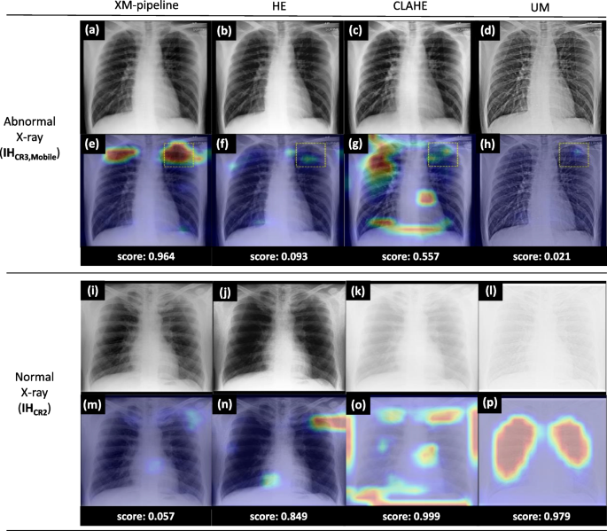

Computer vision has applications across many domains, from facial recognition in smartphones to autonomous vehicles. In data science, it enables the extraction of structured information from unstructured visual data, turning images into actionable insights.


The field combines techniques from image processing, pattern recognition, and deep learning to achieve increasingly sophisticated visual understanding capabilities.

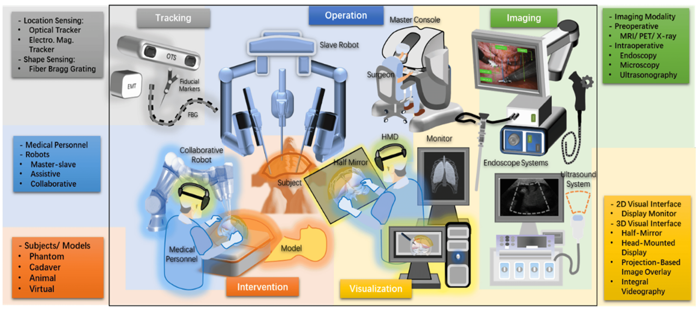

### B. Digital Image Representation

Images are represented as numerical data that computers can process:

* **Pixels**: The fundamental units of digital images
    * Grid of values representing color or intensity
    * Each pixel has specific coordinates (x, y)
    * Images are stored as 2D arrays (or 3D for color)
  
  

* **Resolution**: Number of pixels in an image
    * Expressed as width × height (e.g., 1920×1080)
    * Higher resolution = more detail but larger file size
  
  

* **Color Spaces**:
    * **Grayscale**: Single intensity value per pixel (0-255 for 8-bit)
        * Used in many medical images (X-rays, CT scans)
        * 0 = black, 255 = white

    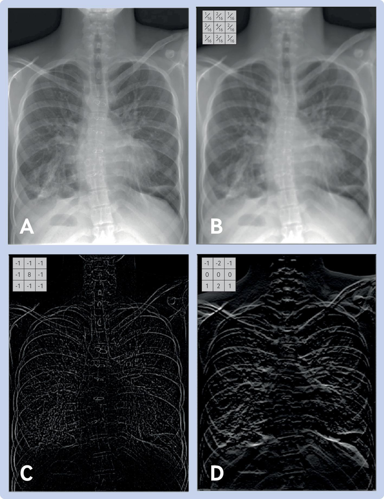

    * **RGB**: Three values per pixel (Red, Green, Blue)
        * Each channel typically ranges from 0-255
        * Combines to create full color spectrum
        * Example: (255,0,0) = red, (0,255,0) = green, (255,255,255) = white

    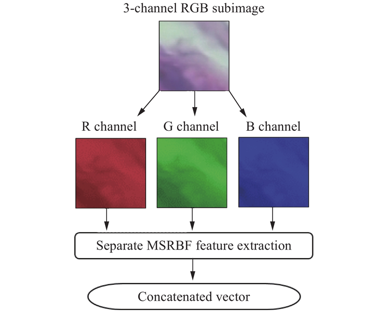

### C. Medical Image Formats

Medical imaging uses specialized formats beyond standard JPEGs and PNGs:

* **DICOM (Digital Imaging and Communications in Medicine)**
    * Standard format for medical imaging
    * Contains both pixel data AND metadata
    * Metadata includes:
        * Patient information (ID, name, demographics)
        * Acquisition parameters (modality, date, equipment settings)
        * Organizational hierarchy (study, series, instance)
  
  
  
    * **Windowing/Leveling**: Technique to visualize the wide dynamic range of medical images
        * Window Width (WW): Range of intensity values displayed
        * Window Level (WL): Center of intensity range
        * Different windows highlight different tissues (bone, lung, soft tissue)
  
  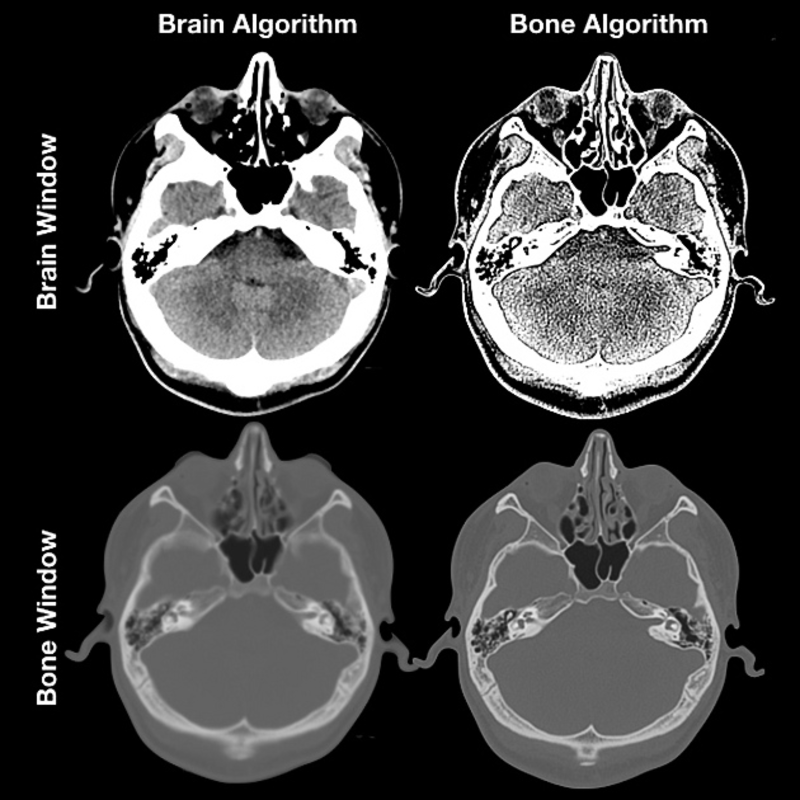

* **Other Common Formats**
    * **PNG**: Lossless compression, preserves details
    * **JPEG**: Lossy compression, smaller files but may lose detail
    * **TIFF**: Flexible format, supports multiple layers and high bit depths

[](https://xkcd.com/2178/)

### D. Essential Python Libraries for Imaging

Key Python libraries for working with images:

* **Pillow (PIL Fork)**: Basic image manipulation
    * Loading, saving, resizing, cropping, color conversion
    * Simple API for common tasks
    * `from PIL import Image`
  
  

* **OpenCV**: Comprehensive computer vision library
    * Advanced image processing algorithms
    * Feature detection, object tracking, video analysis
    * High-performance C++ backend with Python bindings
    * `import cv2`
  
  

* **Pydicom**: Specialized for DICOM files
    * Read/write DICOM files and access metadata
    * `import pydicom`
  
  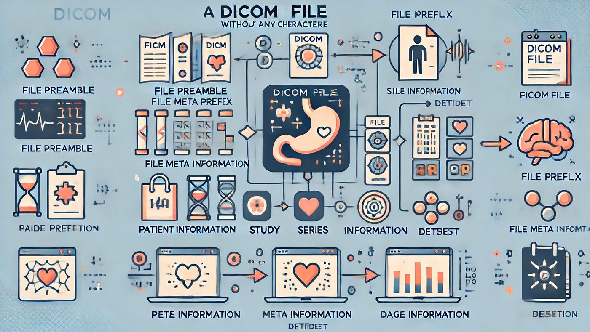

* **SimpleITK**: Medical image analysis toolkit
    * Registration, segmentation, filtering
    * Python interface to ITK
    * `import SimpleITK as sitk`
  
  

* **Matplotlib**: Visualization
    * Display images in notebooks with `plt.imshow()`
    * `import matplotlib.pyplot as plt`
  
  

### E. Reference Card: Basic Image Operations

```python
 Pillow
from PIL import Image
img = Image.open("image.png")           # Load image
img.save("output.jpg")                  # Save image
width, height = img.size                # Get dimensions
mode = img.mode                         # Get color mode ('RGB', 'L', etc.)
img_array = np.array(img)               # Convert to NumPy array

 OpenCV
import cv2
img = cv2.imread("image.png")           # Load image (BGR format)
img_gray = cv2.imread("image.png", cv2.IMREAD_GRAYSCALE)  # Load as grayscale
cv2.imwrite("output.png", img)          # Save image
h, w, c = img.shape                     # Get dimensions and channels
img_rgb = cv2.cvtColor(img, cv2.COLOR_BGR2RGB)  # Convert BGR to RGB

 Pydicom
import pydicom
ds = pydicom.dcmread("file.dcm")        # Load DICOM file
pixel_array = ds.pixel_array            # Get pixel data
patient_name = ds.PatientName           # Access metadata
```

## 2. Convolutional Neural Networks (CNNs) for Image Analysis

Building on the neural network concepts from Lecture 6, CNNs are specialized architectures designed specifically for image data.

### A. Why CNNs for Images?

Standard neural networks struggle with images for two key reasons:

* **Parameter Explosion**: A 224×224×3 RGB image has 150,528 input features. With 1000 neurons in the first hidden layer, that's 150+ million weights!

* **Loss of Spatial Information**: Flattening an image loses the 2D structure and relationships between neighboring pixels

CNNs solve these problems through three key innovations:

1. **Local Connectivity**: Neurons connect only to small regions of input (receptive fields)
2. **Parameter Sharing**: Same filter weights applied across the entire image
3. **Hierarchical Feature Learning**: Progressively more complex features at deeper layers

[](https://xkcd.com/1838/)

### B. Core CNN Components

1. **Convolutional Layer:**
    * Applies learnable filters across the input image
    * Each filter detects specific patterns (edges, textures, etc.)
    * Key parameters: filter size, number of filters, stride, padding

   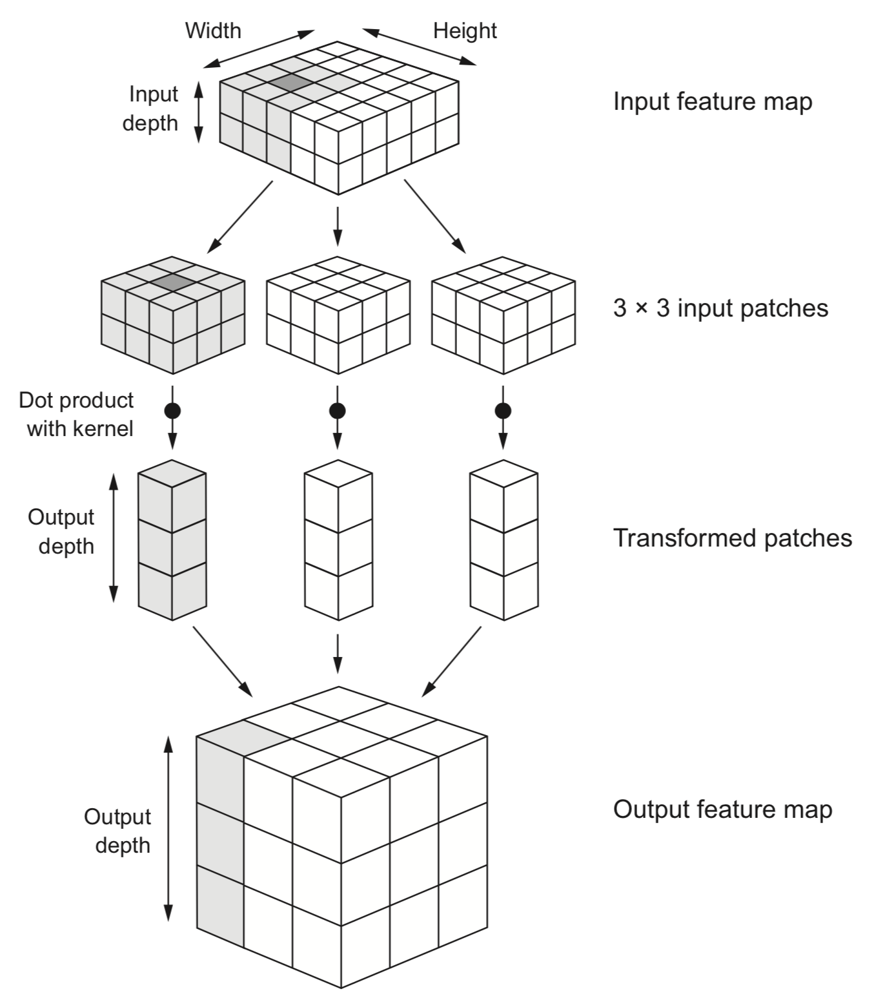

    * **Feature Maps:** Output of applying filters
    * **Stride:** Step size when sliding filter (affects output size)
    * **Padding:** Adding pixels around border to preserve dimensions

   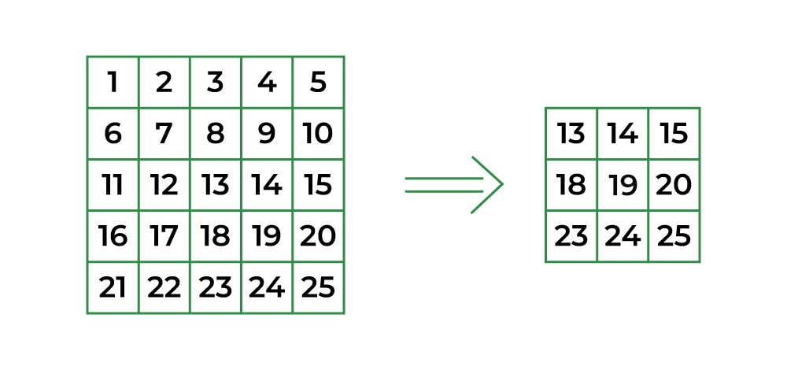
   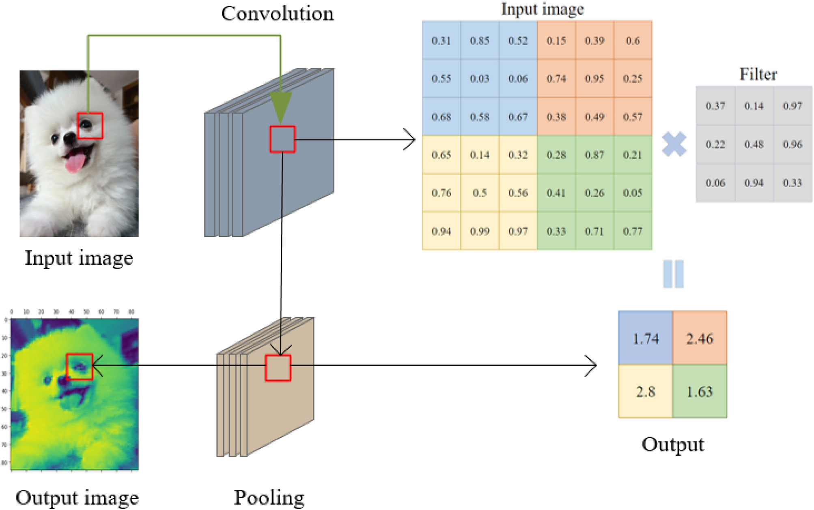

2. **Activation Functions:**
    * Add non-linearity to the model
    * **ReLU:** Most common, f(x) = max(0, x)
    * Simple, efficient, helps with vanishing gradient problem

   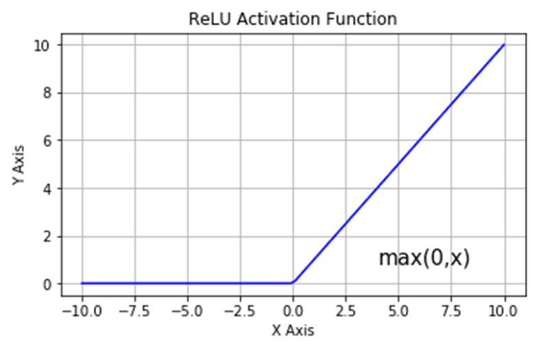

3. **Pooling Layer:**
    * Reduces spatial dimensions (downsampling)
    * **Max Pooling:** Takes maximum value in each window
    * Reduces computation and provides translation invariance

   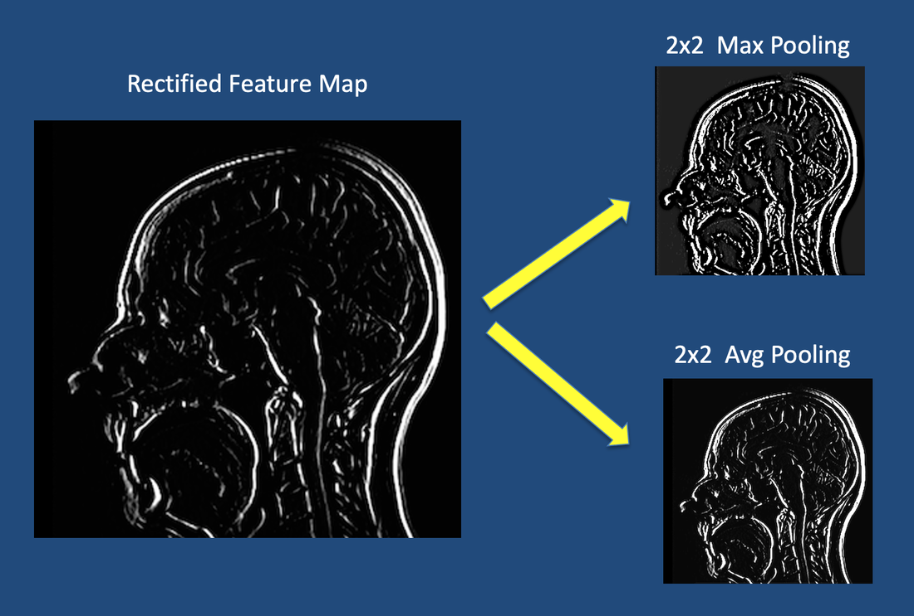

4. **Fully Connected Layer:**
    * Used at the end of the CNN for classification
    * Each neuron connects to all outputs from previous layer
    * Final layer uses softmax (multi-class) or sigmoid (binary) activation

### C. Hierarchical Feature Learning

CNNs automatically learn features at different levels of abstraction:

* **Early Layers:** Simple features like edges, corners, and textures
  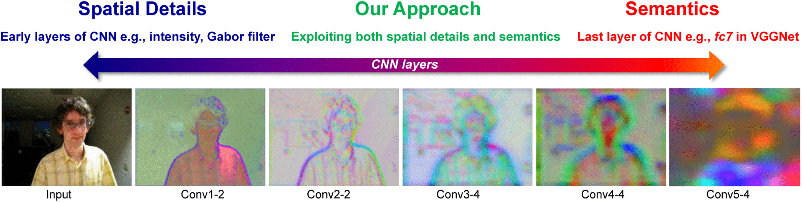

* **Middle Layers:** More complex patterns like parts of objects
  

* **Deep Layers:** High-level concepts and complete objects
  

This automatic feature hierarchy eliminates the need for manual feature engineering that was required in traditional computer vision.

### D. CNN Architecture

A typical CNN architecture follows this pattern:

```
INPUT → [[CONV → ReLU] → POOL] → [[CONV → ReLU] → POOL] → FLATTEN → FC → OUTPUT
```

* Number of filters typically increases in deeper layers
* Spatial dimensions decrease through pooling layers
* Final layers convert spatial features to classification outputs

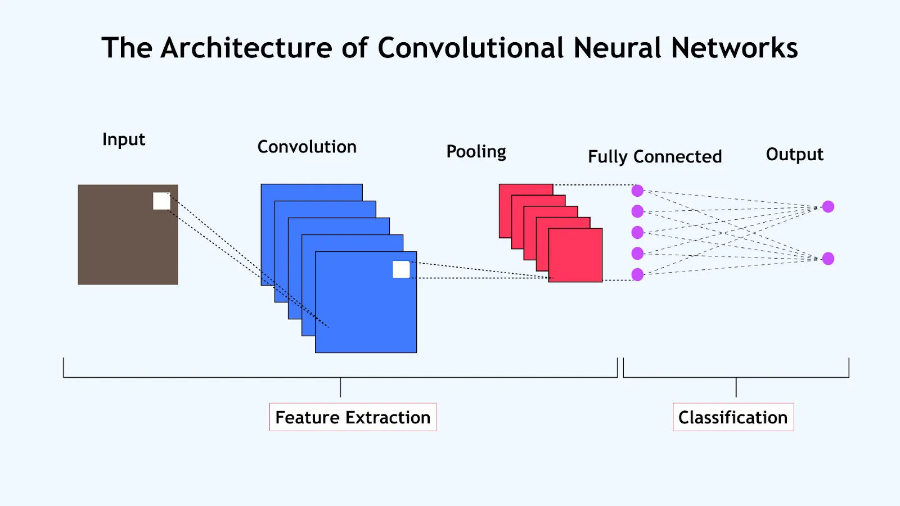

### E. Ethical Considerations

**Bias in CNNs:**

* Models learn biases present in training data
* Biased datasets lead to biased predictions
* Demographic imbalances can cause performance disparities

**Addressing Bias:**

* Diverse, representative training data
* Regular fairness audits across demographic groups
* Bias detection and mitigation techniques
* Transparent model development and deployment

This is a critical consideration for responsible AI deployment.

### F. Reference Card: CNN Layers in PyTorch and TensorFlow

**PyTorch:**

```python
 Convolutional Layer
nn.Conv2d(
    in_channels=3,            # Number of input channels
    out_channels=32,          # Number of output channels
    kernel_size=3,            # Size of convolution window
    stride=1,                 # Step size of the filter
    padding=0                 # Amount of padding (0=valid, 1=same for 3x3)
)

 Activation Function
nn.ReLU()                     # Applied as separate layer

 Pooling Layer
nn.MaxPool2d(
    kernel_size=2,            # Size of pooling window
    stride=2                  # Step size
)

 Flatten Layer
nn.Flatten()                  # Converts 2D feature maps to 1D vector

 Fully Connected Layer
nn.Linear(
    in_features=32*28*28,     # Input size
    out_features=128          # Number of neurons
)
```

**TensorFlow/Keras:**

```python
 Convolutional Layer
tf.keras.layers.Conv2D(
    filters=32,               # Number of output filters
    kernel_size=(3,3),        # Size of convolution window
    strides=(1,1),            # Step size of the filter
    padding='valid',          # 'valid' (no padding) or 'same' (preserve dimensions)
    activation='relu'         # Activation function
)

 Pooling Layer
tf.keras.layers.MaxPooling2D(
    pool_size=(2,2),          # Size of pooling window
    strides=None              # Step size (defaults to pool_size)
)

 Flatten Layer
tf.keras.layers.Flatten()     # Converts 2D feature maps to 1D vector

 Fully Connected Layer
tf.keras.layers.Dense(
    units=128,                # Number of neurons
    activation='relu'         # Activation function
)
```

### G. Minimal CNN Examples

**PyTorch Example:**

```python
import torch.nn as nn

class SimpleCNN(nn.Module):
    def __init__(self, num_classes):
        super(SimpleCNN, self).__init__()
        # First convolutional block
        self.conv1 = nn.Conv2d(3, 32, kernel_size=3, padding=1)
        self.relu1 = nn.ReLU()
        self.pool1 = nn.MaxPool2d(kernel_size=2)
        
        # Second convolutional block
        self.conv2 = nn.Conv2d(32, 64, kernel_size=3, padding=1)
        self.relu2 = nn.ReLU()
        self.pool2 = nn.MaxPool2d(kernel_size=2)
        
        # Classification head
        self.flatten = nn.Flatten()
        self.fc1 = nn.Linear(64 * (height//4) * (width//4), 128)
        self.relu3 = nn.ReLU()
        self.fc2 = nn.Linear(128, num_classes)
        
    def forward(self, x):
        # First block
        x = self.conv1(x)
        x = self.relu1(x)
        x = self.pool1(x)
        
        # Second block
        x = self.conv2(x)
        x = self.relu2(x)
        x = self.pool2(x)
        
        # Classification
        x = self.flatten(x)
        x = self.fc1(x)
        x = self.relu3(x)
        x = self.fc2(x)
        return x
```

**TensorFlow/Keras Example:**

```python
from tensorflow.keras.models import Sequential
from tensorflow.keras.layers import Conv2D, MaxPooling2D, Flatten, Dense

model = Sequential([
  # First convolutional block
  Conv2D(32, (3,3), activation='relu', input_shape=(height, width, channels), padding='same'),
  MaxPooling2D((2,2)),
  
  # Second convolutional block
  Conv2D(64, (3,3), activation='relu', padding='same'),
  MaxPooling2D((2,2)),
  
  # Classification head
  Flatten(),
  Dense(128, activation='relu'),
  Dense(num_classes, activation='softmax')  # For multi-class output
])
```

Both examples follow the same architecture pattern with increasing filter counts in deeper layers.

## 3. Demo 1: Image Loading, Preprocessing & Basic CNN

Let's put theory into practice! 🛠️

**File:** [`lectures/08/demo/01_image_cnn_basics.md`](lectures/08/demo/01_image_cnn_basics.md)

**What we'll cover:**

* Loading images in DICOM and standard formats using Pydicom, Pillow, and OpenCV
* Inspecting image properties and metadata
* Preprocessing: resizing, normalization, color space conversion
* Visualization with Matplotlib
* Building a simple CNN structure (without training)

**Let's switch to the demo notebook!**

## 4. Key Computer Vision Tasks & Techniques

With our understanding of images and CNNs, let's explore the major computer vision tasks:

* Image classification
* Transfer learning
* Object detection
* Image segmentation

### A. Image Classification

**Task:** Assigning a single label to an entire image

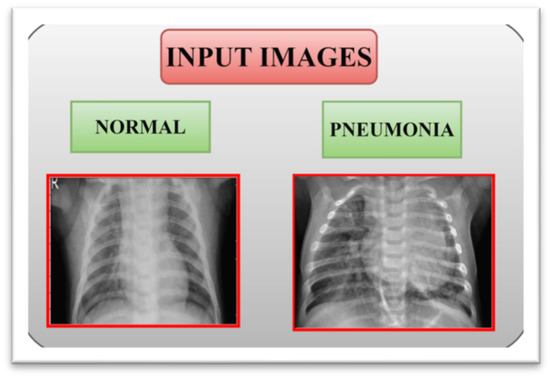
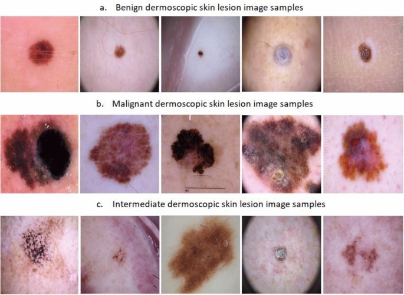

**CNN Architecture for Classification:**

* Convolutional layers extract features
* Flatten layer converts 2D features to 1D vector
* Dense layers perform final classification
* Output layer uses softmax (multi-class) or sigmoid (binary)

**Key CNN Architectures:**

| Architecture | Year | Key Innovation |
|--------------|------|----------------|
| LeNet-5      | 1990s| First successful CNN for digit recognition |
| AlexNet      | 2012 | Deeper network, ReLU, dropout, GPU training |
| VGG          | 2014 | Deeper networks with small (3×3) filters |
| Inception    | 2014 | Parallel filters at multiple scales |
| ResNet       | 2015 | Skip connections enabling very deep networks |
| MobileNet    | 2017 | Efficient models for mobile devices |

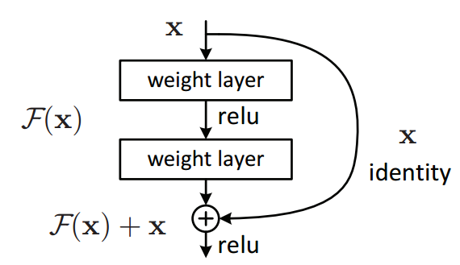

### B. Transfer Learning for Medical Image Classification

**Problem:** Medical imaging datasets are often too small to train deep CNNs from scratch

**Solution:** Transfer learning - reuse models pre-trained on large datasets (like ImageNet)


**Two Main Approaches:**

1. **Feature Extraction**
    * Use pre-trained CNN as a fixed feature extractor
    * Remove classification layers and add new ones for your task
    * Only train the new classification layers
    * Best for: Small medical datasets very different from original data

   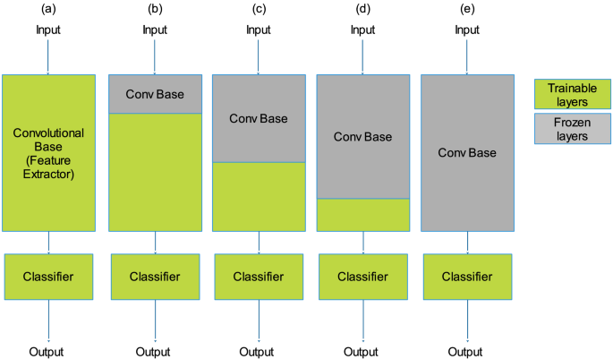

2. **Fine-Tuning**
    * Start with feature extraction approach
    * Then unfreeze some later layers of the base model
    * Continue training with very small learning rate
    * Best for: Larger medical datasets with some similarity to original data

   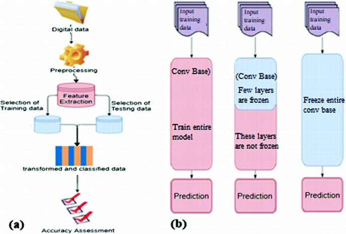

**Implementation (TensorFlow/Keras):**

```python
 1. Load pre-trained model without top layers
base_model = tf.keras.applications.ResNet50(
    weights='imagenet',
    include_top=False,
    input_shape=(224, 224, 3)
)

 2. Freeze base model
base_model.trainable = False

 3. Add new classification head
x = base_model.output
x = GlobalAveragePooling2D()(x)
x = Dense(128, activation='relu')(x)
outputs = Dense(num_classes, activation='softmax')(x)
model = Model(inputs=base_model.input, outputs=outputs)

 4. Train only the new layers
model.compile(optimizer='adam', loss='categorical_crossentropy')
model.fit(train_data, epochs=10)

 5. Optional: Fine-tuning
 Unfreeze some layers and train with small learning rate
```

We'll implement transfer learning in Demo 2!

### C. Object Detection

**Task:** Identify *what* objects are in an image AND *where* they are located

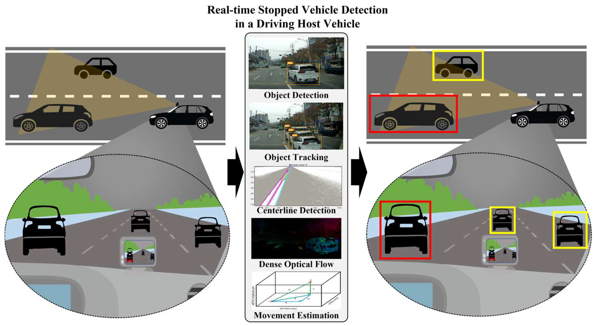

**Medical Applications:**

* Nodule detection in lung scans
* Cell counting in microscopy
* Surgical instrument tracking
* Polyp detection in colonoscopy

**Key Concepts:**

1. **Bounding Boxes**
    * Rectangles defining object location: `(x_min, y_min, x_max, y_max)` or `(x, y, width, height)`

2. **Anchor Boxes**
    * Predefined box templates at different locations, sizes, and aspect ratios
    * Model predicts offsets from these templates rather than absolute coordinates

   

3. **Non-Maximum Suppression (NMS)**
    * Post-processing to remove redundant overlapping detections
    * Keeps highest confidence detection when multiple boxes overlap

   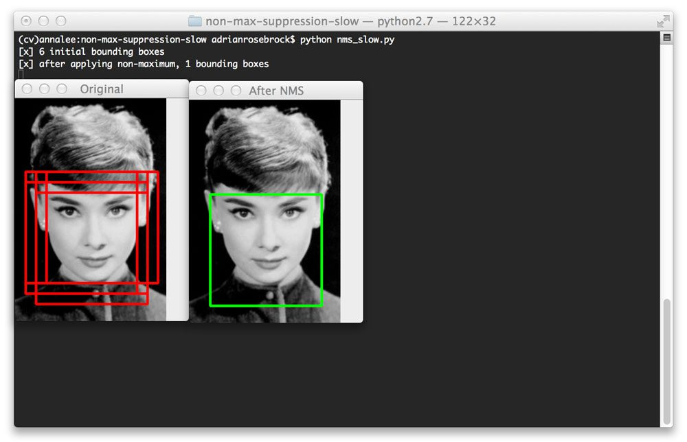

**Detection Approaches:**

| Two-Stage Detectors (R-CNN family) | One-Stage Detectors (YOLO, SSD) |
|-----------------------------------|--------------------------------|
| 1. Generate region proposals      | Predict boxes and classes in one pass |
| 2. Classify each region           | Faster but sometimes less accurate |
| More accurate but slower          | Better for real-time applications |


**Evaluation: Intersection over Union (IoU)**

* Measures overlap between predicted and ground-truth boxes
* IoU = Area of Overlap / Area of Union
* Detection considered correct when IoU > threshold (typically 0.5)

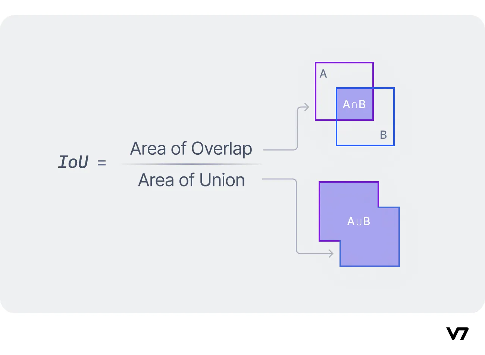

## 5. Demo 2: Transfer Learning for Medical Image Classification

Let's apply transfer learning to a medical image classification task!

**File:** [`lectures/08/demo/02_transfer_learning_classification.md`](lectures/08/demo/02_transfer_learning_classification.md)

**What we'll cover:**

* Loading a medical dataset (MedMNIST)
* Using a pre-trained model (MobileNetV2) as feature extractor
* Adding and training a custom classification head
* Evaluating model performance

**Open the Demo 2 notebook to get started!**

## 6. Image Segmentation

**Task:** Classify every pixel in an image - the most detailed form of visual understanding


**Medical Applications:**

* Organ segmentation for surgical planning and volume measurement
  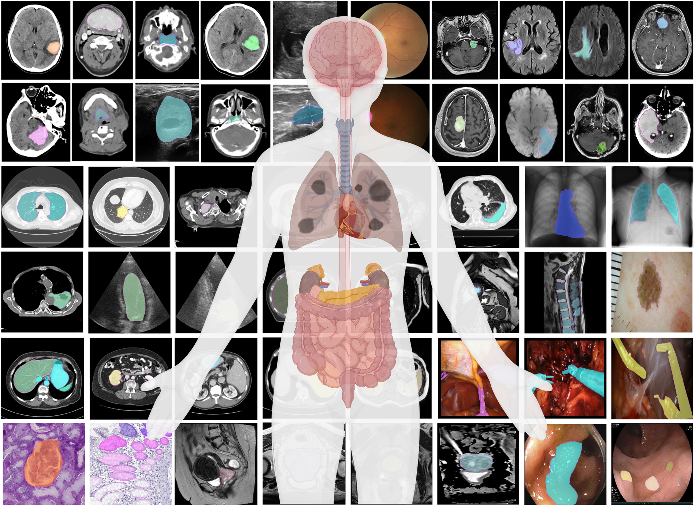
* Tumor delineation for treatment planning and monitoring
  
* Cell segmentation in microscopy images
* Tissue type differentiation (gray/white matter, CSF)

**Types:**

* **Semantic Segmentation:** Labels all pixels of the same class identically
* **Instance Segmentation:** Distinguishes between different instances of the same class
  

**U-Net Architecture:**

* Designed specifically for biomedical image segmentation
* Excellent performance with limited training data
* Key features:
    * Encoder-decoder structure (U-shaped)
    * Skip connections between corresponding encoder-decoder levels
  
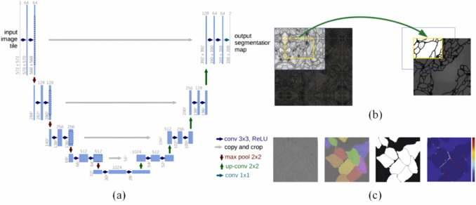
    **Key Features of U-Net:**
        1.  **Encoder-Decoder Structure (Symmetric):**
            *   **Contracting Path (Encoder):** This part is like a typical classification CNN. It consists of repeated blocks of convolutions and max pooling operations. Its purpose is to capture the context in the image and extract increasingly complex features while reducing spatial resolution. It learns "what" is in the image.
            *   **Expanding Path (Decoder):** This part takes the low-resolution, high-level feature maps from the encoder and gradually upsamples them (using "up-convolutions" or "transposed convolutions") to recover the original image resolution. Its purpose is to precisely localize the features and produce a full-resolution segmentation mask. It learns "where" things are.
        2.  **Skip Connections:** This is a crucial innovation of U-Net. The feature maps from the encoder path are concatenated (merged) with the corresponding feature maps in the decoder path at the same spatial resolution.
            *   **Why are skip connections important?** The encoder loses some spatial information during pooling. Skip connections allow the decoder to reuse these high-resolution features from the encoder, combining the "what" (semantic context from deep layers) with the "where" (fine-grained spatial detail from early layers). This helps in producing much more precise segmentation boundaries.

* **Loss Functions for Segmentation:**
    * While pixel-wise **Cross-Entropy** (used in classification) can be applied to segmentation (treating each pixel as a separate classification problem), it often struggles with class imbalance (e.g., when the object to be segmented is very small compared to the background).
    * **Dice Loss (or Dice Coefficient based loss):**
        * The Dice Coefficient is a measure of overlap, similar to IoU: `Dice = (2 * |X ∩ Y|) / (|X| + |Y|)`. It ranges from 0 to 1.
        * Dice Loss is often defined as `1 - Dice Coefficient`.
        * It's very popular for medical image segmentation because it's less sensitive to class imbalance and directly optimizes for overlap.
    * **Jaccard Loss (or IoU Loss):**
        * Based on the Jaccard Index (IoU): `Jaccard = |X ∩ Y| / |X ∪ Y|`.
        * Jaccard Loss is often `1 - Jaccard Index`.
        * Also good for handling class imbalance.
    * Other variations and combinations exist (e.g., Focal Loss, Tversky Loss).

* **Reference Card: U-Net Architecture (Conceptual Blocks)**
    * **Encoder (Contracting Path):**
        * Repeated Blocks: (Conv + ReLU) x2 -> MaxPool
        * Number of filters typically doubles after each MaxPool.
        * Spatial dimensions decrease, feature depth increases.
    * **Bottleneck:**
        * (Conv + ReLU) x2 at the lowest spatial resolution / deepest feature level.
    * **Decoder (Expanding Path):**
        * Repeated Blocks: Upsampling (Up-Convolution/Transposed Conv) -> Concatenate with corresponding Encoder features (Skip Connection) -> (Conv + ReLU) x2
        * Number of filters typically halves after each upsampling block.
        * Spatial dimensions increase, feature depth decreases.
    * **Output Layer:**
        * Final Convolution (e.g., 1x1 Conv) to map features to the desired number of classes.
        * `Sigmoid` activation for binary segmentation (e.g., foreground/background).
        * `Softmax` activation for multi-class segmentation.

* **Minimal Example: Conceptual U-Net Structure (Keras-like)**

    ```python
    # Conceptual U-Net structure (highly simplified)
    # inputs = Input(shape=(height, width, channels))
    #
    # # Encoder
    # c1 = Conv2D(64, (3,3), activation='relu', padding='same')(inputs)
    # c1 = Conv2D(64, (3,3), activation='relu', padding='same')(c1)
    # p1 = MaxPooling2D((2,2))(c1)
    #
    # # ... more encoder blocks ...
    #
    # # Bottleneck
    # bn = Conv2D(1024, (3,3), activation='relu', padding='same')(...)
    # bn = Conv2D(1024, (3,3), activation='relu', padding='same')(bn)
    #
    # # Decoder
    # u1 = Conv2DTranspose(512, (2,2), strides=(2,2), padding='same')(bn)
    # u1 = concatenate([u1, corresponding_encoder_output_c4]) # Skip connection
    # u1 = Conv2D(512, (3,3), activation='relu', padding='same')(u1)
    # u1 = Conv2D(512, (3,3), activation='relu', padding='same')(u1)
    #
    # # ... more decoder blocks ...
    #
    # outputs = Conv2D(num_classes, (1,1), activation='softmax_or_sigmoid')(...)
    # model = Model(inputs=[inputs], outputs=[outputs])
    ```

## 7. Demo 3: Pre-trained Object Detection or Segmentation

Let's explore how to use pre-trained models for complex vision tasks without training from scratch!

**File:** [`lectures/08/demo/03_pretrained_detection_or_segmentation.md`](lectures/08/demo/03_pretrained_detection_or_segmentation.md)

**Two options in this demo:**

1. **Object Detection with YOLO:**
    * Use pre-trained YOLO model from ultralytics library
    * Load model → feed image → visualize bounding boxes and labels
    * Perfect for rapid prototyping

2. **Image Segmentation with TensorFlow Hub:**
    * Use pre-trained DeepLabV3 model
    * Load model → prepare input → generate and visualize segmentation mask

**Let's see these powerful pre-trained models in action!**

## 8. Advanced Topics & Future Directions

The field of computer vision continues to evolve rapidly. Here's a glimpse of emerging technologies:

### Video Analysis

* Analyzing sequences of images with temporal relationships
* Applications: Gait analysis, surgical skill assessment, patient monitoring
* Challenges: Motion tracking, appearance changes, computational demands

### Vision Transformers (ViTs)

* Applying transformer architecture from NLP to images
* Images split into patches treated as "tokens"
* Better at capturing global relationships than CNNs
  
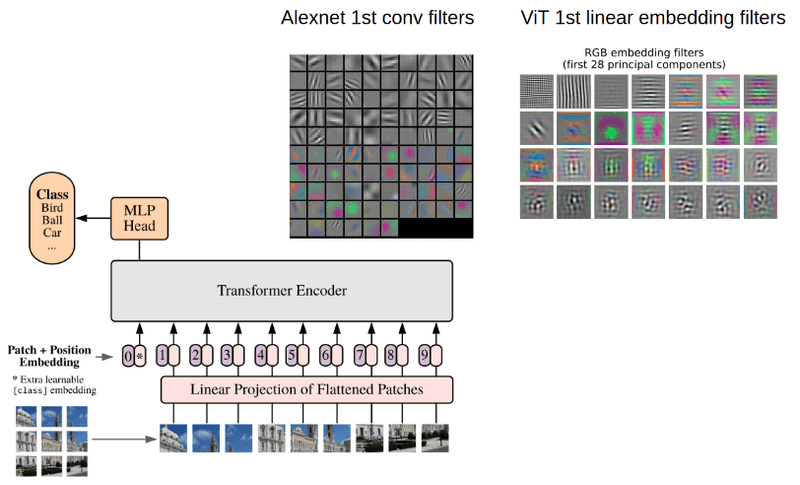

### Generative Models

* **GANs**: Generator and discriminator networks in adversarial training
* **Diffusion Models**: Gradual denoising process for high-quality generation
* Medical applications: Synthetic data generation, image enhancement, modality translation
  


### Explainable AI (XAI)

* Making "black box" models interpretable for clinical trust
* Methods: Grad-CAM, LIME, SHAP, attention maps
* Critical for clinical adoption and regulatory approval
  
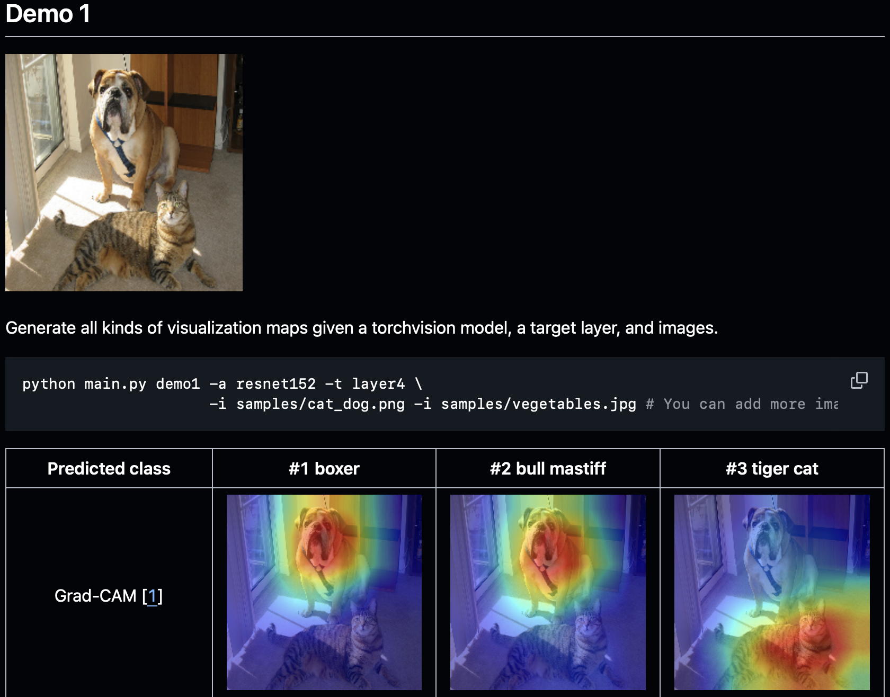

### Self-Supervised Learning

* Learning from unlabeled data using pretext tasks
* Reduces dependency on expensive annotations
* Particularly valuable for medical imaging
  


### Data Augmentation

* Creating modified copies of training images
* Techniques: Rotation, scaling, flipping, color adjustments
* Libraries: Albumentations, TensorFlow preprocessing layers
  
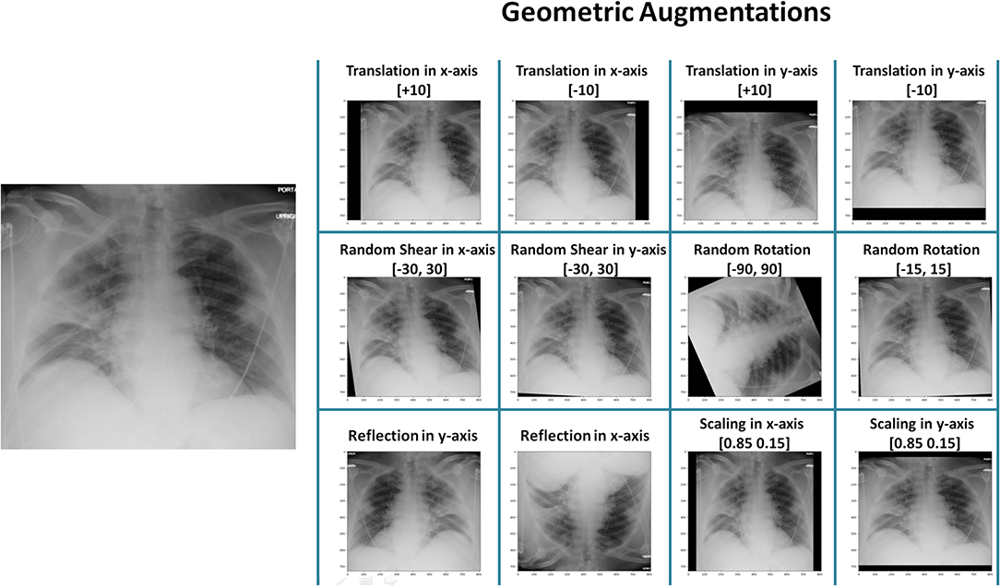

### Specialized Medical Imaging Libraries

* **MONAI**: PyTorch-based framework for healthcare imaging
* **SimpleITK**: Advanced registration and segmentation tools
  


## 9. Mini-Demo: Video Object Tracking

Let's briefly explore how computer vision extends to video data!

**File:** [`lectures/08/demo/04_video_object_tracking_mini_demo.md`](lectures/08/demo/04_video_object_tracking_mini_demo.md)

**Two tracking approaches:**

1. **Detection-based Tracking:**
    * Run object detector (YOLO) on each video frame
    * Link detections across frames to maintain identity

2. **Optical Flow Tracking:**
    * Track feature points between frames using Lucas-Kanade algorithm
    * Follow motion without needing full object detection

**Let's see tracking in action!**

## 10. Resources for Further Learning

### Textbooks & Papers

* "Computer Vision: Algorithms and Applications" by Richard Szeliski
* "Deep Learning" by Goodfellow, Bengio, and Courville
* Recent review papers on medical imaging AI (search PubMed, arXiv)

### Datasets

* **General:** ImageNet, COCO, MNIST, CIFAR
* **Medical:**
    * [MedMNIST](https://medmnist.com/) - Standardized biomedical datasets
    * [TCIA](https://www.cancerimagingarchive.net/) - Cancer imaging archive
    * [Grand Challenge](https://grand-challenge.org/) - Biomedical challenges
    * NIH ChestX-ray, LIDC-IDRI, BraTS

### Annotation Tools

* [ITK-SNAP](http://www.itksnap.org/) - 3D medical image segmentation
* [3D Slicer](https://www.slicer.org/) - Medical image analysis platform
* LabelMe, LabelImg, CVAT - General annotation tools

### Conferences & Journals

* **Conferences:** MICCAI, CVPR, ICCV, ECCV, RSNA, NeurIPS
* **Journals:** IEEE TMI, MedIA, TPAMI, IJCV

### Online Learning

* Coursera, edX, Fast.ai courses
* Stanford CS231n (Convolutional Neural Networks)
* Communities: Kaggle, PapersWithCode, GitHub
