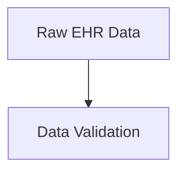
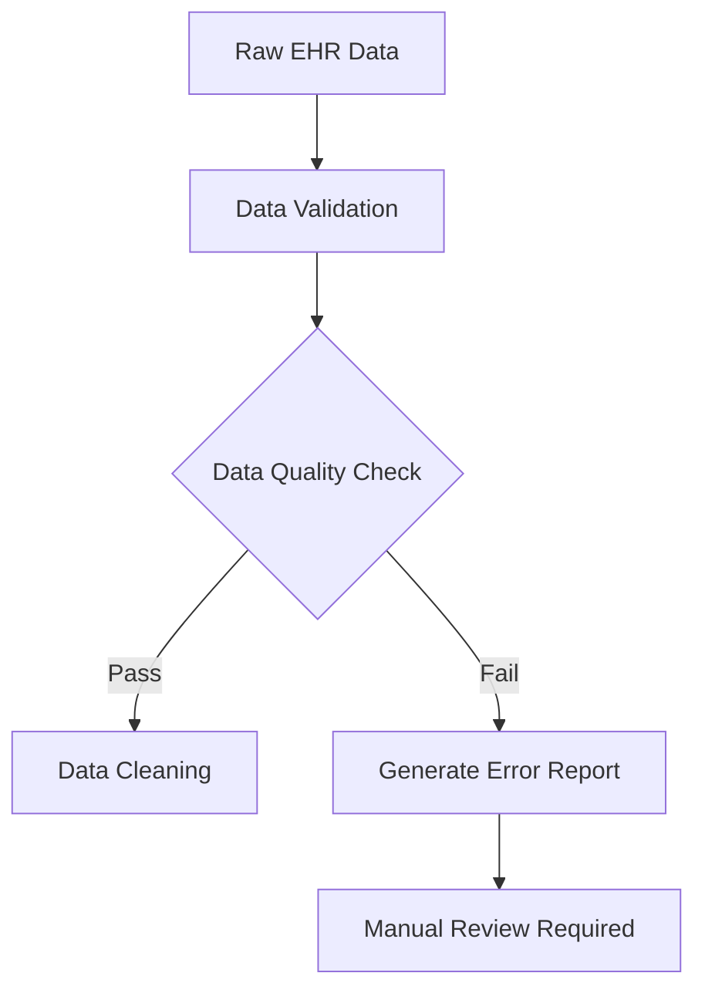
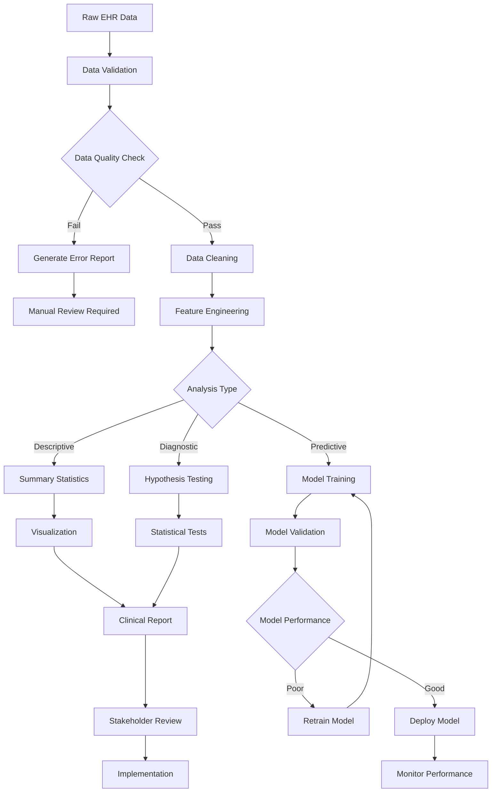
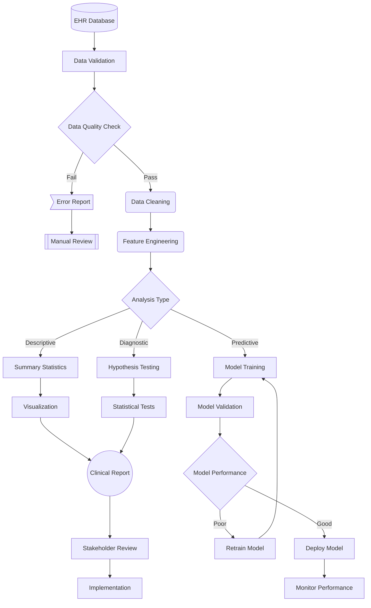
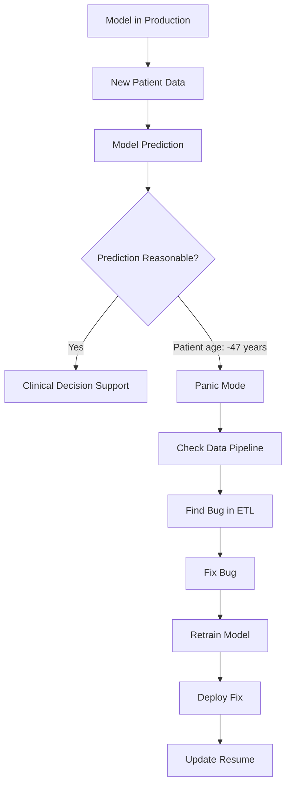

# Demo 1: Mermaid Flowchart - Clinical Data Pipeline

**Goal:** Create a comprehensive flowchart representing a real-world clinical data analysis pipeline using Mermaid syntax.

## Step 1: Set Up Your Environment

1. Open the [Mermaid Live Editor](https://mermaid.live) in your browser
2. Clear the default content
3. We'll build our diagram step by step

## Step 2: Basic Structure

Start with this basic framework:

**Test it:** Paste this into the Mermaid Live Editor. You should see two boxes connected by an arrow.

## Step 3: Add Decision Points

Now let's add some complexity with decision diamonds:

**What's happening:** The diamond shape `{}` creates decision points, and we can label the arrows with conditions.

## Step 4: Complete Clinical Pipeline

Replace your diagram with this comprehensive version:

## Step 5: Style It Up

Add some visual flair with different node shapes:

**Node shapes used:**
- `[()]` - Database cylinder
- `()` - Rounded rectangle for processes
- `>]` - Asymmetric shape for outputs
- `[[]]` - Subroutine box
- `(())` - Circle for final outputs

## Step 6: Save Your Work

1. Click the "Actions" menu in Mermaid Live Editor
2. Choose "Download SVG" to save as a vector image
3. Copy the code to save in your notes

## Success Validation

Your final diagram should:
- ✅ Show the complete data flow from raw data to implementation
- ✅ Include decision points with labeled paths
- ✅ Use different shapes to indicate different types of operations
- ✅ Be readable and logically organized

## Bonus Challenge

Create a second diagram showing what happens when your model goes into production and starts making predictions that are... questionable:

This bonus diagram captures the reality of production ML systems in healthcare! 🎭