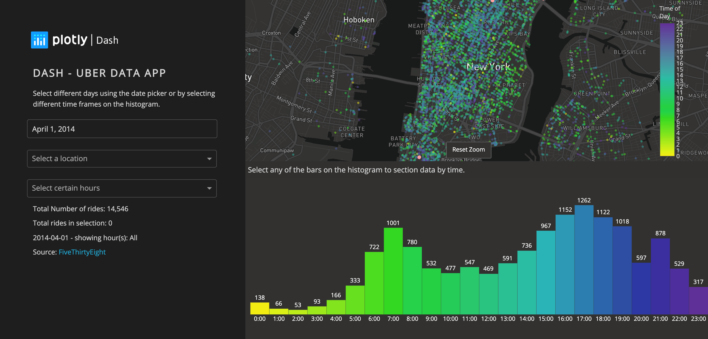

# Dash Uber Rides Demo (Pedagogical Version)

This project is a **deeply annotated, beginner-friendly Dash app** for exploring Uber ride data in New York City. It is designed for health data science and data visualization students who are new to Python, Dash, and interactive dashboards.

[Live dash!](https://dash.gallery/dash-uber-rides-demo/)

## What You'll Learn

- How to build a real-world interactive dashboard using Dash and Plotly
- How to structure a Dash app: layout, callbacks, and data wrangling
- How to use dropdowns, date pickers, and interactive maps in Dash
- How to connect user input to dynamic visualizations
- How to read and manipulate time series data with Pandas
- How to use Mapbox for geospatial visualization

## Features

- **Interactive map** of Uber rides in NYC, colored by hour of day
- **Histogram** of rides by hour, with selection linked to the map
- **Date picker** and **dropdowns** for filtering by date, hour, and location
- **Dynamic text outputs** showing ride counts for selected filters
- **Landmark centering** for quick map navigation

## Pedagogical Annotations

- The `app.py` script is **heavily commented** throughout:
  - Section headers for each major part of the app
  - Inline explanations for Dash concepts, data wrangling, and visualization logic
  - Comments on both "what" and "why" for each block
- Designed for students to read, run, and modify as they learn

## How to Run

1. **Install dependencies** (in your activated virtual environment):
   ```sh
   pip install -r requirements.txt
   ```
2. **Run the app:**
   ```sh
   python app.py
   ```
3. **Open your browser** to [http://127.0.0.1:8050](http://127.0.0.1:8050) to interact with the dashboard.

## Data Source

- [FiveThirtyEight Uber TLC FOIL Response](https://github.com/fivethirtyeight/uber-tlc-foil-response/tree/master/uber-trip-data)
- Data is loaded directly from GitHub in the script (no download required).

## For Instructors

- This version is ideal for code review, live coding, and student assignments.
- Encourage students to:
  - Add new filters or visualizations
  - Change the color scheme or layout
  - Connect to other geospatial datasets

---

*Happy exploring and learning with Dash!*

## Screenshots



## Resources

To learn more about Dash, please visit [documentation](https://plot.ly/dash).
