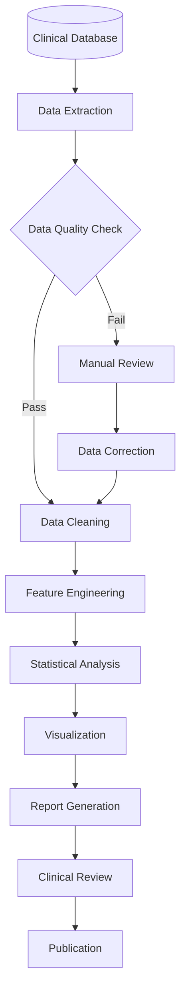

# Clinical Heart Rate Analysis Report

!!! info "Report Overview"
    This automated report analyzes heart rate patterns across different clinical populations, 
    examining relationships between age, medical conditions, and cardiovascular metrics.

## Executive Summary

Our analysis of **200 patients** reveals significant patterns in heart rate distribution across different medical conditions. Key findings include:

- **Healthy patients** show the most stable heart rate patterns (avg: 70 bpm)
- **Hypertensive patients** demonstrate elevated baseline heart rates (avg: 80 bpm)  
- **Arrhythmia patients** exhibit the highest variability in heart rate measurements
- **Age correlation** shows a moderate positive relationship with heart rate across all conditions

## Data Overview

```vegalite
{
  "schema-url": "charts/overview_scatter.json"
}
```

The scatter plot above shows the relationship between age and heart rate, with point size representing BMI and color indicating medical condition. Interactive features allow you to:

- **Hover** over points to see detailed patient information
- **Pan and zoom** to explore specific regions of the data
- **Identify outliers** and patterns within each condition group

## Patient Distribution

```vegalite
{
  "schema-url": "charts/condition_summary.json"
}
```

Our study population includes a representative mix of clinical conditions, with healthy patients comprising the largest group (40%), followed by hypertensive patients (30%).

## Analysis Workflow

The following diagram illustrates our data processing and analysis pipeline:



## Next Steps

1. **Expand sample size** to include more diverse populations
2. **Longitudinal analysis** to track changes over time  
3. **Machine learning models** for risk prediction
4. **Integration** with electronic health records

---

*This report was automatically generated on {{ "now" | date: "%Y-%m-%d" }} using MkDocs and Altair.*