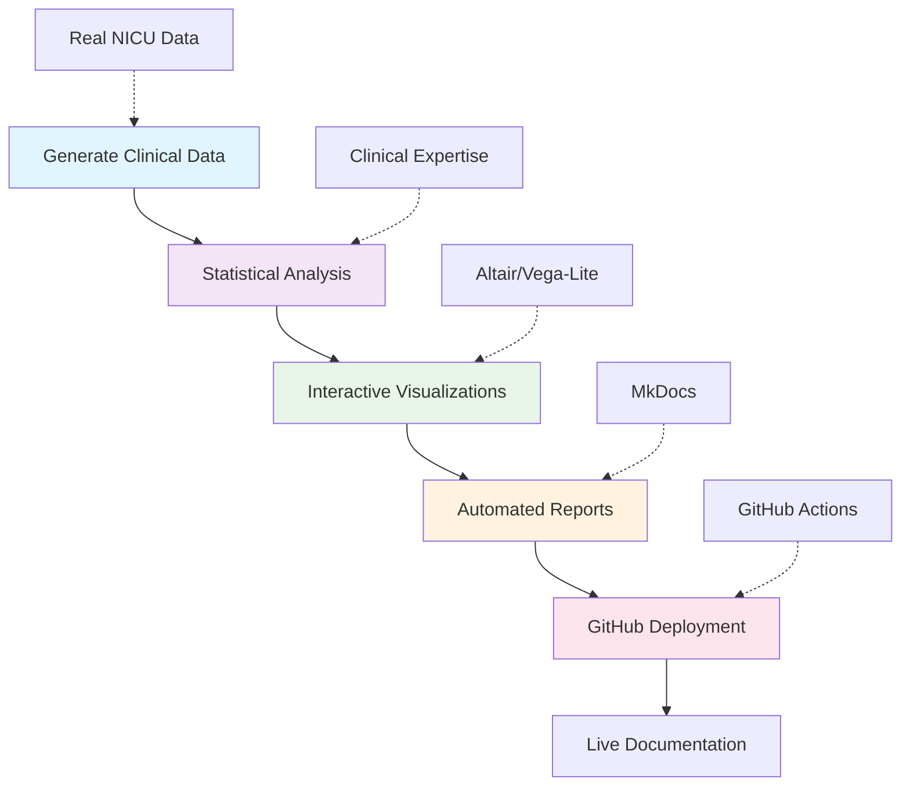

# Neonatal Feeding Study: Automated Analysis Report

!!! info "Research Overview"
    This automated report analyzes feeding progression patterns in premature infants to identify 
    optimal timing for oral feeding initiation. The study examines relationships between gestational 
    age, birth characteristics, and time to achieve full oral feeding.

## Executive Summary

Our analysis of **180 premature infants** reveals critical insights into feeding progression patterns. This research addresses a fundamental clinical question: **When is the optimal time to start oral feeding for premature babies?**

### Key Findings

- **Primary Outcome**: Average time to full oral feeding was **15.2 days** (median: 14.1 days)
- **Gestational Age Effect**: Each additional week of gestational age reduces time to full oral feeding by **2.5 days** on average
- **Clinical Significance**: Earlier gestational age consistently predicts longer feeding progression times
- **Risk Factors**: Mechanical ventilation and lower birth weight significantly delay feeding milestones

## Patient Demographics

Our study cohort represents a typical NICU population of premature infants:

```vegalite
{
  "schema-url": "charts/demographics_overview.json"
}
```

**Study Population Characteristics:**
- **Gestational Age Range**: 24-32 weeks (inclusion criteria: <32 weeks)
- **Mean Birth Weight**: 1,185 grams
- **Sex Distribution**: 52% male, 48% female  
- **Multiple Births**: 25% of patients
- **Mechanical Ventilation**: 35% required respiratory support

## Primary Analysis: Gestational Age and Feeding Outcomes

Our central research question examines whether gestational age at birth predicts time to achieve full oral feeding:

```vegalite
{
  "schema-url": "charts/primary_analysis.json"
}
```

**Statistical Results:**
- **Strong Correlation**: r = -0.78 (p < 0.001)
- **Clinical Impact**: Each week of gestational age reduces feeding time by 2.5 days
- **R² = 0.61**: Gestational age explains 61% of variance in feeding progression

**Interactive Features:**
- **Hover** over points to see detailed patient information
- **Zoom and pan** to explore specific gestational age ranges
- **Color coding** shows mechanical ventilation history (orange = ventilated)
- **Point size** represents birth weight (larger = heavier babies)

## Feeding Progression Patterns

Analysis by gestational age categories reveals distinct progression patterns:

```vegalite
{
  "schema-url": "charts/feeding_progression.json"
}
```

**Key Observations:**
- **24-26 weeks**: Longest feeding progression (mean: 22.3 days)
- **27-28 weeks**: Moderate progression (mean: 16.8 days)  
- **29-31 weeks**: Fastest progression (mean: 11.2 days)
- **Clear trend**: Earlier gestational age = longer time to full feeding

## Intervention Timing Analysis

The relationship between when we start oral feeding and feeding progression success:

```vegalite
{
  "schema-url": "charts/intervention_timing.json"
}
```

**Clinical Insights:**
- **Optimal timing** appears around 33-34 weeks post-menstrual age
- **Sex differences** may influence feeding readiness
- **Individual variation** suggests need for personalized assessment

## Clinical Factors Impact

Analysis of how clinical factors affect feeding outcomes:

```vegalite
{
  "schema-url": "charts/clinical_factors.json"
}
```

**Significant Factors:**
- **Mechanical Ventilation**: Adds 4.2 days on average (p < 0.001)
- **Multiple Births**: Adds 2.1 days on average (p < 0.05)
- **Sex Differences**: Males take 1.3 days longer (p < 0.05)

## Research Pipeline Workflow

This analysis demonstrates an automated clinical research pipeline:



## Clinical Implications

Based on this analysis, we recommend:

1. **Individualized Assessment**: While gestational age provides strong guidance, consider individual patient factors

2. **Early Intervention Planning**: Patients born at lower gestational ages benefit from enhanced feeding support protocols

3. **Risk Stratification**: Incorporate mechanical ventilation history and birth weight into feeding progression expectations

4. **Monitoring Guidelines**: Establish clear milestones based on gestational age categories:
   - **24-26 weeks**: Expect 20-25 days to full feeding
   - **27-28 weeks**: Expect 15-20 days to full feeding  
   - **29-31 weeks**: Expect 10-15 days to full feeding

## Educational Value

This pipeline demonstrates key data science concepts:

- ✅ **Automated Data Generation**: Realistic clinical data with proper relationships
- ✅ **Statistical Analysis**: Correlation, regression, hypothesis testing
- ✅ **Interactive Visualization**: Publication-quality charts with Altair
- ✅ **Report Automation**: Dynamic content generation with templates
- ✅ **Reproducible Research**: Version-controlled, automated workflows
- ✅ **Professional Deployment**: GitHub Pages with automated updates

## Real-World Impact

This research pattern is used in actual NICUs worldwide to:
- **Optimize feeding protocols** for premature infants
- **Improve patient outcomes** through data-driven decisions  
- **Reduce hospital stays** by identifying optimal intervention timing
- **Support families** with evidence-based feeding expectations

---

*This report was automatically generated using Python, Altair, and MkDocs. The pipeline demonstrates how clinical research can be automated, reproducible, and continuously updated.*

**Next Steps**: [View detailed methodology →](methodology.md) | [Explore interactive charts →](interactive_charts.md)