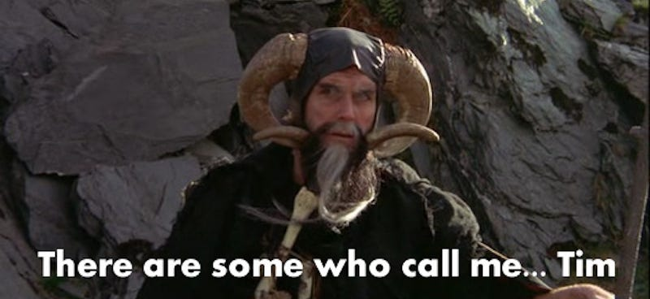
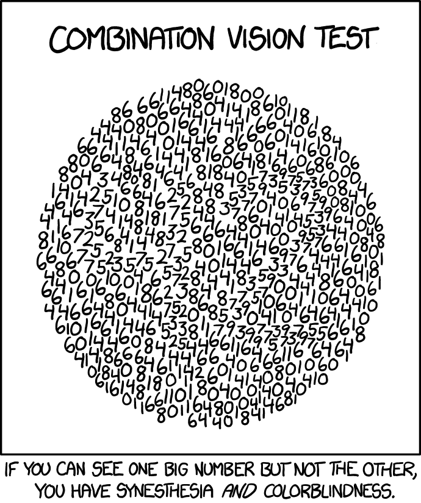
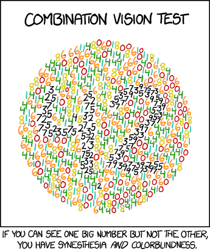

Computer Vision: Seeing with Silicon

# Links

## Recent News

- [AI models suck slightly less at math than they did last year](https://www.theregister.com/2026/02/26/ai_models_get_better_at/)
- [Testing Super Mario Using a Behavior Model Autonomously](https://testflows.com/blog/testing-super-mario-using-a-behavior-model-autonomously-part1/)
- [Code Isn’t Slowing Your Project Down, Communication Is](https://shiftmag.dev/code-isnt-slowing-your-project-down-communication-is-7889/)

## Books & Courses

- [Deep Learning with PyTorch](https://pytorch.org/tutorials/) — official PyTorch tutorials, excellent starting point
- _Dive into Deep Learning_ — [d2l.ai](https://d2l.ai) — hands-on with code examples in multiple frameworks
- ["Computer Vision: Algorithms and Applications" (2nd Edition)](https://szeliski.org/Book/) by Szeliski — free online, comprehensive reference
- ["Foundations of Computer Vision"](https://visionbook.mit.edu) by Torralba, Isola, and Freeman — modern MIT textbook

## Documentation

- [torchvision docs](https://pytorch.org/vision/stable/index.html) — transforms, models, datasets
- [timm docs](https://huggingface.co/docs/timm/index) — PyTorch Image Models, 1000+ pre-trained architectures
- [segmentation_models_pytorch](https://github.com/qubvel-org/segmentation_models.pytorch) — U-Net, FPN, DeepLabV3+ with any encoder
- [MONAI](https://monai.io/) — PyTorch framework for healthcare imaging

## Conferences & Journals

- [MICCAI](https://www.miccai.org/) — Medical Image Computing and Computer Assisted Intervention (top venue)
- [CVPR](https://cvpr.thecvf.com/) — Computer Vision and Pattern Recognition
- IEEE Transactions on Medical Imaging, Nature Medicine, The Lancet Digital Health

## Datasets for Medical CV

- [PhysioNet](https://physionet.org/) — Physiological and clinical data, including imaging
- [MedMNIST](https://medmnist.com/) — Standardized biomedical datasets (28×28 and 64×64)
- [TCIA](https://www.cancerimagingarchive.net/) — Cancer imaging archive
- [Grand Challenge](https://grand-challenge.org/) — Biomedical image analysis challenges
- NIH ChestX-ray14, LIDC-IDRI, BraTS, VinDr-CXR

## Annotation Tools

- [ITK-SNAP](https://www.itksnap.org/) — 3D medical image segmentation
- [3D Slicer](https://www.slicer.org/) — Medical image analysis platform
- [CVAT](https://github.com/opencv/cvat) — Open-source annotation tool (bounding boxes, masks)
- [Label Studio](https://labelstud.io/) — Multi-modal annotation platform

## Health Data Science & Computer Vision

- Esteva et al. (2017). Dermatologist-level classification of skin cancer with deep neural networks. _Nature_
- Rajpurkar et al. (2017). CheXNet: Radiologist-level pneumonia detection on chest X-rays with deep learning
- Ronneberger et al. (2015). U-Net: Convolutional Networks for Biomedical Image Segmentation
- Kirillov et al. (2023). Segment Anything (SAM) — foundation model for segmentation


# What Is Computer Vision?

**Computer vision (CV)** is a field of AI that enables computers to interpret and understand visual information — turning pixels into decisions. CV systems can classify objects, detect their locations, track movement across video, segment regions at the pixel level, and measure quantitative features from images.


In healthcare, CV is transforming radiology, pathology, dermatology, ophthalmology, and surgery. A single hospital can produce millions of imaging studies per year — far more than radiologists can review with full attention. Modern CV systems now match or exceed human-level performance on specific tasks like detecting diabetic retinopathy from retinal scans or classifying skin lesions from dermoscopy images.


## Digital Image Representation

Before a computer can "see" an image, the image must be represented as numbers. An image is a grid of **pixels** — each pixel stores a color or intensity value at coordinates (x, y). **Resolution** is the number of pixels (width × height), and medical images range widely: dermoscopy (3000×4000) to ultrasound (640×480).


- **Grayscale**: Single intensity value per pixel (0–255 for 8-bit). 0 = black, 255 = white. Used in many medical images (X-rays, CT scans).

    

- **RGB**: Three values per pixel (Red, Green, Blue), each 0–255. Shape in memory: (height, width, 3) for NumPy, (3, height, width) for PyTorch.

    

## Medical Image Formats

Medical imaging uses specialized formats beyond standard JPEGs and PNGs.

- **DICOM (Digital Imaging and Communications in Medicine)**
    - The standard format for medical imaging worldwide
    - Contains both pixel data AND rich metadata
    - Metadata includes: patient info (ID, demographics), acquisition parameters (modality, equipment), organizational hierarchy (study, series, instance)
    - Used by CT, MRI, X-ray, ultrasound, PET, and more

    

    

- **Other Common Formats**: PNG (lossless, good for sharing), JPEG (lossy, not ideal for diagnostics), TIFF (multi-layer, common in pathology), NIfTI (3D/4D neuroimaging volumes)

[](https://xkcd.com/1301/)

## The Python Imaging Stack

Key Python libraries for working with images:

- **Pillow (PIL Fork)**: The standard library for basic image manipulation — loading, saving, resizing, cropping, color conversion. Simple API for common tasks. `from PIL import Image`

    

- **OpenCV**: Comprehensive computer vision library with advanced image processing algorithms, feature detection, object tracking, and video analysis. High-performance C++ backend with Python bindings. `import cv2`

    

- **pydicom**: Specialized for DICOM files — read/write medical images and access rich metadata (patient info, acquisition parameters, modality). `import pydicom`

- **SimpleITK**: Medical image analysis toolkit for registration, segmentation, and filtering. Python interface to ITK. `import SimpleITK as sitk`

    

- **Matplotlib**: Visualization — display images in notebooks with `plt.imshow()`. `import matplotlib.pyplot as plt`

    

# CNNs in PyTorch

## Quick CNN Recap

CNNs use small learned **filters** (e.g., 3×3) that slide across the image, sharing parameters at every position. This avoids the parameter explosion of fully connected layers and preserves spatial structure. Stacking convolutional layers builds a hierarchy of features — edges → textures → parts → objects:


## PyTorch CNN Building Blocks

PyTorch provides all CNN components through `torch.nn`:

- **`nn.Conv2d`**: Applies learnable filters. Key args: `in_channels`, `out_channels`, `kernel_size`, `stride`, `padding`
- **`nn.MaxPool2d`**: Downsamples by taking the max value in each window.

    

- **`nn.BatchNorm2d`**: Normalizes layer outputs within a batch. Stabilizes and speeds up training.
- **`nn.ReLU`**, **`nn.Dropout2d`**, **`nn.Flatten`**, **`nn.Linear`**: Activation, regularization, reshaping, and fully connected layers (see reference card below).

A typical CNN architecture follows this pattern:

```
INPUT → [CONV → BN → ReLU → POOL] × N → FLATTEN → LINEAR → OUTPUT
```


### Reference Card: torch.nn CNN Layers

| Layer | Signature | Purpose | Key Parameters |
| :--- | :--- | :--- | :--- |
| **Conv2d** | `nn.Conv2d(in_ch, out_ch, kernel_size)` | Applies convolution filters | `stride=1`, `padding=0` (use `padding=1` for 3×3 to preserve size) |
| **MaxPool2d** | `nn.MaxPool2d(kernel_size)` | Downsamples spatial dimensions | `kernel_size=2, stride=2` halves H and W |
| **BatchNorm2d** | `nn.BatchNorm2d(num_features)` | Normalizes per-channel activations | `num_features` = number of channels |
| **ReLU** | `nn.ReLU(inplace=True)` | Activation: max(0, x) — introduces nonlinearity | `inplace=True` saves memory |
| **Dropout2d** | `nn.Dropout2d(p=0.25)` | Drops entire feature maps | `p` = probability of zeroing a channel |
| **Flatten** | `nn.Flatten()` | Reshapes (N, C, H, W) → (N, C×H×W) | Used before Linear layers |
| **Linear** | `nn.Linear(in_features, out_features)` | Fully connected layer | For classification head |

### Code Snippet: A Simple CNN in PyTorch

```python
import torch
import torch.nn as nn

class SimpleCNN(nn.Module):
    def __init__(self, num_classes=10):
        super().__init__()
        self.features = nn.Sequential(
            nn.Conv2d(3, 32, kernel_size=3, padding=1),
            nn.BatchNorm2d(32),
            nn.ReLU(inplace=True),
            nn.MaxPool2d(2),

            nn.Conv2d(32, 64, kernel_size=3, padding=1),
            nn.BatchNorm2d(64),
            nn.ReLU(inplace=True),
            nn.MaxPool2d(2),
        )
        self.classifier = nn.Sequential(
            nn.Flatten(),
            nn.Linear(64 * 56 * 56, 128),  # 224 / 2 / 2 = 56 after two MaxPool2d(2)
            nn.ReLU(inplace=True),
            nn.Dropout(0.5),
            nn.Linear(128, num_classes),
        )

    def forward(self, x):
        x = self.features(x)
        x = self.classifier(x)
        return x

model = SimpleCNN(num_classes=2)
```

## The PyTorch Training Loop

Unlike Keras' `model.fit()`, PyTorch gives you explicit control over every step of training. Each iteration through a batch follows five steps:

1. **Zero gradients** (`optimizer.zero_grad()`) — clear accumulated gradients from the previous batch
2. **Forward pass** (`outputs = model(inputs)`) — feed inputs through the model to get predictions
3. **Compute loss** (`loss = criterion(outputs, labels)`) — measure how wrong the predictions are
4. **Backward pass** (`loss.backward()`) — use **backpropagation** to compute the **gradient** for each weight — how much it contributed to the error
5. **Update weights** (`optimizer.step()`) — the **optimizer** adjusts weights in the direction that reduces the loss

An **epoch** is one complete pass through the entire training dataset. The **learning rate** (`lr`) controls how large each weight update step is — too high and training is unstable, too low and it's slow. For inference, call `model.eval()` (disables dropout/batchnorm training behavior) and wrap in `with torch.no_grad():`.

### Code Snippet: Training Loop

```python
device = torch.device("cuda" if torch.cuda.is_available() else "cpu")
model = SimpleCNN(num_classes=2).to(device)
criterion = nn.CrossEntropyLoss()
optimizer = torch.optim.Adam(model.parameters(), lr=1e-3)  # Adam is a widely-used default

for epoch in range(10):                        # 10 passes through the training data
    model.train()                              # enable dropout/batchnorm training behavior
    running_loss = 0.0
    for inputs, labels in train_loader:
        inputs, labels = inputs.to(device), labels.to(device)

        optimizer.zero_grad()                  # 1. clear old gradients
        outputs = model(inputs)                # 2. forward pass
        loss = criterion(outputs, labels)      # 3. compute loss
        loss.backward()                        # 4. compute gradients (backpropagation)
        optimizer.step()                       # 5. update weights

        running_loss += loss.item()
    print(f"Epoch {epoch+1}, Loss: {running_loss/len(train_loader):.4f}")
```

## Tensor Shape Conventions

PyTorch and Keras/TensorFlow arrange image tensors differently. In practice this means:

- **Shape mismatch errors** are the most common gotcha when mixing frameworks or loading data — always check `.shape`
- **PyTorch (NCHW)**: channels first — `torch.Size([16, 3, 224, 224])` for a batch of 16 RGB 224×224 images
- **Keras/TF (NHWC)**: channels last — `(16, 224, 224, 3)` for the same batch
- **`torchvision.transforms.ToTensor()`** handles the conversion from PIL (HWC) → PyTorch (CHW) automatically and scales pixel values from [0, 255] to [0.0, 1.0]
- When porting code or reading tutorials from the other framework, **transpose** the channel dimension (`permute` in PyTorch, `transpose` in NumPy)

[](https://xkcd.com/1882/)

# torchvision — The Computer Vision Toolkit

`torchvision` is PyTorch's companion library for computer vision — well-tested, GPU-optimized transforms, datasets, and pre-trained models for classification, detection, and segmentation.

## Transforms & Data Augmentation

`torchvision.transforms` provides composable image transformations. You build a pipeline by chaining operations with `Compose`:

**Essential transforms** (always used): `Resize`, `ToTensor` (scales [0, 255] → [0.0, 1.0]), `Normalize`, `CenterCrop`

**Key augmentation transforms** (training only — see full list in reference card below):

- `RandomHorizontalFlip(p=0.5)` — flip left-right with probability p. Also `RandomVerticalFlip` for medical images with no "up."
- `RandomRotation(degrees)` — rotate by a random angle within the specified range.
- `RandomResizedCrop(size)` — random crop and resize with scale + aspect ratio jitter. The most powerful single augmentation for training.
- `ColorJitter(brightness, contrast, saturation, hue)` — random color perturbations to make the model robust to lighting variation.

**Why augmentation matters**: Medical datasets are often small. Augmentation creates modified versions of each training image, helping the model generalize instead of memorizing.

For advanced augmentations (elastic deformations, grid distortion, CLAHE), see the **`albumentations`** library.


### ImageNet Normalization

**ImageNet** is a large dataset of 1.2 million natural photos used to pre-train most vision models. When using these pre-trained models, normalize your images to match the statistics ImageNet was trained with:

```python
normalize = transforms.Normalize(
    mean=[0.485, 0.456, 0.406],
    std=[0.229, 0.224, 0.225]
)
```

For grayscale medical images used with pre-trained RGB models, either:

- Convert to 3-channel by repeating the grayscale channel: `img.convert("RGB")` (most common approach)
- Or adjust normalization to single-channel statistics

### Reference Card: torchvision.transforms

| Category | Transform | Purpose | Common Args |
| :--- | :--- | :--- | :--- |
| **Pipeline** | `Compose([t1, t2, ...])` | Chain transforms in sequence | List of transforms |
| **Size** | `Resize(size)` | Resize to target size | `(224, 224)` or `256` (short edge) |
| **Conversion** | `ToTensor()` | PIL → tensor, scale to [0, 1] | — |
| **Normalize** | `Normalize(mean, std)` | Per-channel normalization | ImageNet: `[0.485, 0.456, 0.406]` |
| **Crop** | `CenterCrop(size)` | Crop from center | `224` |
| **Flip** | `RandomHorizontalFlip(p)` | Horizontal flip | `p=0.5` |
| **Rotate** | `RandomRotation(degrees)` | Random rotation | `(-15, 15)` |
| **Scale+Crop** | `RandomResizedCrop(size)` | Random crop + resize | `scale=(0.8, 1.0)` |
| **Color** | `ColorJitter(b, c, s, h)` | Random color changes | `brightness=0.2, contrast=0.2` |
| **Blur** | `GaussianBlur(kernel_size)` | Gaussian blur | `kernel_size=3` |
| **Erase** | `RandomErasing(p)` | Erase random rectangle | `p=0.1` |

### Code Snippet: Train vs Eval Transforms

```python
from torchvision import transforms

# Training: augmentation + normalization
train_transform = transforms.Compose([
    transforms.Resize((256, 256)),
    transforms.RandomResizedCrop(224),
    transforms.RandomHorizontalFlip(),
    transforms.RandomRotation(10),
    transforms.ColorJitter(brightness=0.2, contrast=0.2),
    transforms.ToTensor(),
    transforms.Normalize([0.485, 0.456, 0.406], [0.229, 0.224, 0.225]),
])

# Evaluation: deterministic resize + normalize only
eval_transform = transforms.Compose([
    transforms.Resize((224, 224)),
    transforms.ToTensor(),
    transforms.Normalize([0.485, 0.456, 0.406], [0.229, 0.224, 0.225]),
])
```

## Datasets & DataLoaders

`torchvision` provides two ways to load image data:

**`ImageFolder`** — the simplest approach for custom datasets. Expects a directory structure where each subdirectory is a class:

```
data/
├── normal/
│   ├── xray_001.png
│   ├── xray_002.png
│   └── ...
└── tuberculosis/
    ├── xray_101.png
    ├── xray_102.png
    └── ...
```

**Custom `Dataset`** — for more complex scenarios (DICOM files, multi-label, CSV-driven):

```python
from torch.utils.data import Dataset

class ChestXrayDataset(Dataset):
    def __init__(self, image_paths, labels, transform=None):
        self.image_paths = image_paths
        self.labels = labels
        self.transform = transform

    def __len__(self):
        return len(self.image_paths)

    def __getitem__(self, idx):
        img = Image.open(self.image_paths[idx]).convert("RGB")
        label = self.labels[idx]
        if self.transform:
            img = self.transform(img)
        return img, label
```

### DataLoader

`DataLoader` wraps a dataset and provides batching, shuffling, and parallel loading. It returns an iterable that yields `(batch_inputs, batch_labels)` tuples.

Key parameters:

- **`batch_size`** (int): Number of samples per batch (e.g., 32)
- **`shuffle`** (bool): Randomize order each epoch — `True` for training, `False` for eval
- **`num_workers`** (int): Parallel data loading processes (e.g., 4). Set to 0 for debugging.
- **`pin_memory`** (bool): Speed up CPU→GPU transfer. Set `True` when using CUDA.
- **`drop_last`** (bool): Drop last incomplete batch if dataset isn't evenly divisible

### Reference Card: `torch.utils.data.DataLoader`

| Parameter | Default | Training | Evaluation |
| :--- | :--- | :--- | :--- |
| **batch_size** | `1` | `32` (or largest that fits GPU) | Same or larger |
| **shuffle** | `False` | `True` | `False` |
| **num_workers** | `0` | `4` (tune to system) | Same |
| **pin_memory** | `False` | `True` (with CUDA) | `True` (with CUDA) |
| **drop_last** | `False` | `True` (for BatchNorm stability) | `False` |

### Code Snippet: ImageFolder + DataLoader

```python
from torchvision import transforms
from torchvision.datasets import ImageFolder
from torch.utils.data import DataLoader, random_split

# Create dataset with transforms
dataset = ImageFolder("data/chest_xrays", transform=train_transform)
print(f"Classes: {dataset.classes}")  # ['normal', 'tuberculosis']
print(f"Total images: {len(dataset)}")

# Split into train/val/test
train_size = int(0.7 * len(dataset))
val_size = int(0.15 * len(dataset))
test_size = len(dataset) - train_size - val_size
train_set, val_set, test_set = random_split(dataset, [train_size, val_size, test_size])

# Create DataLoaders
train_loader = DataLoader(train_set, batch_size=32, shuffle=True, num_workers=4)
val_loader = DataLoader(val_set, batch_size=32, shuffle=False, num_workers=4)
```

# LIVE DEMO!

# Transfer Learning & Pretrained Models

Transfer learning is the single most important practical technique in computer vision. Rather than training a CNN from scratch (which requires millions of images and days of GPU time), you start with a model that already understands visual features and adapt it to your specific task.

## Why Transfer Learning?

**ImageNet** is a massive benchmark dataset of 1.2 million labeled natural photos across 1,000 everyday categories (dogs, cars, chairs, food, etc.). A model pre-trained on ImageNet has already learned a rich hierarchy of visual features:

- **Early layers**: edges, corners, gradients, textures
- **Middle layers**: patterns, shapes, parts of objects
- **Deep layers**: complex structures, object parts, spatial relationships

These features transfer remarkably well to new domains — including medical imaging. A model that learned "edge" and "texture" features from natural photos can apply those same features to detect abnormalities in chest X-rays.


## Two Approaches

A pre-trained model has two logical parts:

- **Backbone**: The main body of the network that extracts features — all the convolutional layers that turn pixels into feature maps. This is the expensive part that learned from millions of images.
- **Head**: The final classification layer(s) that map features to class predictions. This is the part you replace for your task.

**1. Feature Extraction** — Freeze the pre-trained backbone, only train a new head:

- The pre-trained layers act as a fixed feature extractor
- Only the new head layers are trained
- Fast to train, works well with very small datasets
- Best when: few images (<1,000) and the pre-trained features are general enough for your domain

**2. Fine-Tuning** — Start frozen, then unfreeze some or all backbone layers:

- First train the head (feature extraction phase)
- Then unfreeze later backbone layers and continue training with a smaller learning rate
- Allows the model to adapt its learned features to your domain
- Best when: moderate dataset size (1,000–100,000), or target domain differs significantly from ImageNet (e.g., medical images vs natural photos)


## Pre-trained Models in torchvision

Pre-trained vision models are **foundation models** — the same concept from the LLM lectures. A large model is trained on massive data (ImageNet's 1.2M images), learning general-purpose features, then adapted for specific downstream tasks via transfer learning. The pattern is identical whether the domain is language or vision: pre-train once at scale, fine-tune cheaply for your task.

`torchvision.models` provides pre-trained architectures with a consistent API. The modern way to load them uses the `weights` parameter:

| Architecture | Year | Key Innovation | Params | torchvision name |
| :--- | :--- | :--- | :--- | :--- |
| Inception v3 | 2015 | Parallel filters at multiple scales | 24M | `inception_v3` |
| ResNet-18/50 | 2015 | Skip connections (shortcut paths that let information bypass layers, preventing vanishing gradients) → very deep networks | 11M/25M | `resnet18`, `resnet50` |
| MobileNetV2 | 2018 | Depthwise separable convolutions — splits expensive operations into cheaper steps → mobile-friendly | 3.4M | `mobilenet_v2` |
| EfficientNet-B0 | 2019 | Compound scaling — simultaneously scales network depth, width, and input resolution using a fixed ratio | 5.3M | `efficientnet_b0` |
| ConvNeXt-Tiny | 2022 | Modernized ConvNet matching ViT performance | 28M | `convnext_tiny` |

### Reference Card: torchvision.models

| Category | Method / Pattern | Purpose | Example |
| :--- | :--- | :--- | :--- |
| **Load model** | `models.resnet18(weights="DEFAULT")` | Load pre-trained ResNet-18 | Returns nn.Module |
| **Weights enum** | `models.ResNet18_Weights.IMAGENET1K_V1` | Specific weight version | Explicit versioning |
| **No pretrain** | `models.resnet18(weights=None)` | Random initialization | For training from scratch |
| **Freeze** | `model.requires_grad_(False)` | Freeze all parameters | Or loop: `param.requires_grad = False` |
| **Replace head** | `model.fc = nn.Linear(512, num_classes)` | New classifier for ResNet | `.classifier` for MobileNet/EfficientNet |
| **List models** | `models.list_models()` | See all available models | Filter by keyword |

For access to 1,000+ architectures beyond `torchvision`, the **`timm`** library (`timm.create_model(name, pretrained=True, num_classes=N)`) provides a uniform API with automatic head replacement.

### Code Snippet: Transfer Learning with ResNet-18

```python
import torchvision.models as models
import torch.nn as nn

# Load pretrained ResNet-18
model = models.resnet18(weights="DEFAULT")

# Freeze the backbone
for param in model.parameters():
    param.requires_grad = False

# Replace the classification head (512 → num_classes)
model.fc = nn.Sequential(
    nn.Linear(512, 128),
    nn.ReLU(),
    nn.Dropout(0.3),
    nn.Linear(128, 2),  # binary: normal vs tuberculosis
)

# Only the new head parameters will be trained
optimizer = torch.optim.Adam(model.fc.parameters(), lr=1e-3)
```

With **timm**, the same thing is even simpler:

```python
import timm

model = timm.create_model("resnet18", pretrained=True, num_classes=2)
```



# Evaluating Vision Models

## Classification Metrics

The classification metrics from lecture 05 — accuracy, precision, recall, F1, confusion matrix — apply directly to image classification. The key difference in medical imaging is **class imbalance**: a chest X-ray dataset might be 90% normal, 10% abnormal, so a model that always predicts "normal" gets 90% accuracy but catches zero diseases.

**Which metric matters depends on the clinical context:**

- **Screening** (mammography, TB detection): Maximize **recall** — missing a cancer is worse than a false alarm.
- **Confirmatory diagnosis** (biopsy prediction): Maximize **precision** — unnecessary procedures have real cost.

**Handling class imbalance:** Use weighted loss (`nn.CrossEntropyLoss(weight=...)`), weighted sampling (`WeightedRandomSampler`), or threshold tuning (don't always use 0.5).

**Critical: patient-level splits.** If the same patient's images appear in both training and test sets, the model learns patient-specific features and test metrics will be misleadingly high. Always split by **patient ID**, not by image.

### Code Snippet: Evaluation with torchmetrics

```python
import torchmetrics

# Initialize metrics
accuracy = torchmetrics.Accuracy(task="binary").to(device)
f1 = torchmetrics.F1Score(task="binary").to(device)
confusion = torchmetrics.ConfusionMatrix(task="binary").to(device)

# Evaluation loop
model.eval()
with torch.no_grad():
    for inputs, labels in test_loader:
        inputs, labels = inputs.to(device), labels.to(device)
        outputs = model(inputs)
        preds = outputs.argmax(dim=1)
        accuracy.update(preds, labels)
        f1.update(preds, labels)
        confusion.update(preds, labels)

print(f"Accuracy: {accuracy.compute():.4f}")
print(f"F1: {f1.compute():.4f}")
print(f"Confusion Matrix:\n{confusion.compute()}")
```

# LIVE DEMO!!

[](https://xkcd.com/2696/)

# Object Detection

## Computer Vision: Medical Applications

Detection and segmentation are the most impactful CV tasks in medicine:

- **Nodule detection** in chest CT / lung scans
- **Cell counting** in microscopy images
- **Polyp detection** in colonoscopy
- **Surgical instrument tracking** in robotic surgery
- **Fracture detection** in skeletal X-rays
- **Organ segmentation** for surgical planning and volume measurement
- **Tumor delineation** for radiation treatment planning and growth monitoring
- **Cell segmentation** in microscopy for counting and morphology analysis
- **Tissue type differentiation** (gray/white matter, cerebrospinal fluid in brain MRI)
- **Vessel segmentation** for angiography analysis
- **Wound measurement** from photographs

Image classification tells you _what's_ in an image. Object detection tells you _what_ and _where_. It's the difference between "this chest X-ray contains a nodule" and "there is a 12mm nodule in the right upper lobe." In clinical settings, location matters — a radiologist needs to know not just that something is abnormal, but exactly where to look.

The output of a detection model is a set of **bounding boxes**, each with a class label and a confidence score.


## Object Detection: Key Concepts

- **Bounding Boxes**: Rectangles that localize objects, represented as `(x_min, y_min, x_max, y_max)` or `(x_center, y_center, width, height)`.
- **IoU (Intersection over Union)**: Measures overlap between predicted and ground-truth regions. `IoU = |X∩Y| / |X∪Y|`. A detection is "correct" when IoU exceeds a threshold (typically 0.5). Also used as a segmentation metric (see below).
- **Dice Coefficient**: `2|X∩Y| / (|X|+|Y|)` — closely related to IoU, the standard metric for medical segmentation. Values range from 0 (no overlap) to 1 (perfect overlap).
- **Non-Maximum Suppression (NMS)**: Detectors generate multiple overlapping predictions for the same object. NMS keeps the highest-confidence box and discards others with IoU above a threshold.
- **mAP (mean Average Precision)**: The standard detection metric, averaging precision across recall levels and classes. `mAP@0.5` uses IoU threshold 0.5.


## Detector Families

| Approach | Examples | How It Works | Tradeoff |
| :--- | :--- | :--- | :--- |
| **Two-stage** | Faster R-CNN, Mask R-CNN | 1. Generate region proposals 2. Classify each region | More accurate, slower |
| **One-stage** | YOLO, SSD, RetinaNet, FCOS | Predict boxes + classes in one pass | Faster, sometimes less accurate |
| **Anchor-free** | FCOS, CenterNet | Predict object centers + sizes directly (no predefined box templates) | Simpler, competitive accuracy |


## Detection with torchvision

`torchvision.models.detection` provides pre-trained detection models. Most use a **Feature Pyramid Network (FPN)** on top of the backbone — FPN builds feature maps at multiple resolutions so the model can detect both small and large objects (a 3-pixel nodule and a full-lung opacity need different scales).

### Reference Card: torchvision.models.detection

| Model | Function | Backbone | Speed | Accuracy |
| :--- | :--- | :--- | :--- | :--- |
| **Faster R-CNN** | `fasterrcnn_resnet50_fpn(weights="DEFAULT")` | ResNet-50 + FPN | Medium | High |
| **FCOS** | `fcos_resnet50_fpn(weights="DEFAULT")` | ResNet-50 + FPN | Medium | High |
| **RetinaNet** | `retinanet_resnet50_fpn_v2(weights="DEFAULT")` | ResNet-50 + FPN | Medium | High |
| **SSD** | `ssd300_vgg16(weights="DEFAULT")` | VGG-16 | Fast | Moderate |
| **SSDLite** | `ssdlite320_mobilenet_v3_large(weights="DEFAULT")` | MobileNetV3 | Very fast | Moderate |

Most pre-trained detection models are trained on **COCO** (Common Objects in Context) — a large-scale detection dataset with 80 everyday object classes like person, car, cat, and chair. For medical applications, you'd fine-tune on your own annotated dataset.

### Code Snippet: Inference with Pretrained Faster R-CNN

```python
import torchvision
from torchvision.models.detection import fasterrcnn_resnet50_fpn, FasterRCNN_ResNet50_FPN_Weights
from torchvision.utils import draw_bounding_boxes
from torchvision.transforms.functional import to_pil_image

# Load pretrained model
weights = FasterRCNN_ResNet50_FPN_Weights.DEFAULT
model = fasterrcnn_resnet50_fpn(weights=weights)
model.eval()

# Prepare image
preprocess = weights.transforms()
img_tensor = preprocess(img)

# Run inference
with torch.no_grad():
    predictions = model([img_tensor])[0]

# Filter by confidence
keep = predictions["scores"] > 0.7
boxes = predictions["boxes"][keep]
labels = predictions["labels"][keep]
scores = predictions["scores"][keep]

# Visualize
label_names = [weights.meta["categories"][l] for l in labels]
result = draw_bounding_boxes(
    (img_tensor * 255).byte(), boxes, label_names, width=3
)
to_pil_image(result).show()
```

## Ultralytics YOLO

For the fastest path to object detection in practice, **Ultralytics YOLO** provides a batteries-included API:

```python
from ultralytics import YOLO

model = YOLO("yolo11n.pt")  # load pretrained YOLO11-nano
results = model("chest_xray.png")
results[0].show()  # display with bounding boxes

# Fine-tune on custom dataset
model.train(data="my_dataset.yaml", epochs=50)
```

[](https://xkcd.com/1213/)

[](https://xkcd.com/1213/)

# Image Segmentation

Segmentation is the most detailed form of visual understanding — it classifies every pixel in an image. Instead of one label per image (classification) or boxes around objects (detection), segmentation produces a **mask** that precisely outlines each region of interest. This matters clinically: a bounding box around a tumor tells you roughly where it is, but a segmentation mask tells you its exact shape, volume, and boundaries — critical for surgical planning and radiation therapy.


## Types of Segmentation

- **Semantic segmentation**: Labels every pixel with a class. All pixels of the same class get the same label (e.g., all "lung" pixels are one color). Does not distinguish between instances.
- **Instance segmentation**: Like semantic segmentation, but also distinguishes between individual objects (e.g., "cell #1" vs "cell #2").
- **Panoptic segmentation**: Combines both — every pixel gets a class AND an instance ID.


## U-Net Architecture

**U-Net** (Ronneberger et al., 2015) was designed specifically for biomedical image segmentation and remains the dominant architecture for medical imaging. It works remarkably well even with very limited training data.

> **tl;dr** — U-Net uses a U-shaped encoder-decoder CNN. The encoder extracts features at increasing granularity using convolutions and pooling. The decoder upsamples these features back to the original image size. Skip connections link encoder features to the decoder, combining "what" (semantic context) with "where" (spatial detail) for precise segmentation.


**Key components**:

1. **Encoder**: Like a classification CNN — `Conv → ReLU → MaxPool` blocks with doubling filters (64 → 128 → 256 → 512). Reduces spatial resolution while extracting increasingly abstract features.
2. **Bottleneck**: Deepest point with the most abstract features.
3. **Decoder**: Mirrors the encoder — `Upsample → Conv → ReLU` blocks that recover spatial resolution.
4. **Skip Connections**: The critical innovation — encoder feature maps are concatenated with decoder maps at matching resolutions, combining spatial detail with semantic context.
5. **Output Layer**: 1×1 convolution → `Sigmoid` (binary) or `Softmax` (multi-class).

## Loss Functions for Segmentation

Standard cross-entropy works but struggles with the extreme class imbalance common in medical segmentation (e.g., a small tumor in a large image). Specialized losses like **Dice Loss** optimize overlap directly, making them less sensitive to imbalance.

### Reference Card: Segmentation Loss Functions

| Loss | Signature | Best For | Key Behavior |
| :--- | :--- | :--- | :--- |
| **BCEWithLogitsLoss** | `nn.BCEWithLogitsLoss()` | Binary segmentation, balanced classes | Pixel-level cross-entropy with sigmoid built-in |
| **CrossEntropyLoss** | `nn.CrossEntropyLoss(weight=class_weights)` | Multi-class segmentation | Pass `weight` tensor for class balancing |
| **Dice Loss** | `smp.losses.DiceLoss()` | Imbalanced classes (most medical tasks) | Optimizes `1 - (2|X∩Y|) / (|X|+|Y|)` directly |
| **Jaccard Loss** | `smp.losses.JaccardLoss()` | Similar to Dice | Optimizes `1 - |X∩Y| / |X∪Y|`, slightly different gradients |
| **Focal Loss** | `smp.losses.FocalLoss()` | Severe class imbalance | Downweights easy pixels, γ parameter controls focus |
| **BCE + Dice** | Sum both losses | General-purpose | Combines pixel-level and region-level optimization |

## Segmentation with Packages

Rather than implementing U-Net from scratch, established libraries provide pre-built architectures with pre-trained encoders.

### `segmentation_models_pytorch` (smp)

The most popular segmentation library — provides U-Net, U-Net++, FPN, DeepLabV3+, and more, with any pre-trained encoder as the backbone.

Key parameters for `smp.Unet()`:

- **`encoder_name`** (str): Backbone architecture (e.g., `"resnet18"`, `"efficientnet-b0"`, `"mobilenet_v2"`)
- **`encoder_weights`** (str): Pre-trained weights (e.g., `"imagenet"`) or `None`
- **`in_channels`** (int): Input channels (3 for RGB, 1 for grayscale)
- **`classes`** (int): Number of output segmentation classes
- **`activation`** (str/None): Output activation (`"sigmoid"` for binary, `None` for logits)

Returns an `nn.Module` with `.encoder`, `.decoder`, `.segmentation_head` attributes.

### Reference Card: smp Architectures

| Architecture | Function | Best For |
| :--- | :--- | :--- |
| **U-Net** | `smp.Unet(...)` | General-purpose, medical imaging standard |
| **U-Net++** | `smp.UnetPlusPlus(...)` | Nested skip connections, improved boundary accuracy |
| **FPN** | `smp.FPN(...)` | Multi-scale features, good for varied object sizes |
| **DeepLabV3+** | `smp.DeepLabV3Plus(...)` | Strong at multi-scale context with dilated convolutions |

### `torchvision.models.segmentation`

`torchvision` also provides pre-trained segmentation models:

| Model | Function | Architecture |
| :--- | :--- | :--- |
| **DeepLabV3** | `deeplabv3_resnet50(weights="DEFAULT")` | Dilated convolutions (filters with spacing between elements to see a wider area without more parameters) + ResNet-50 |
| **FCN** | `fcn_resnet50(weights="DEFAULT")` | Fully Convolutional Network (replaces all dense layers with convolutions so it works on any input size) + ResNet-50 |
| **LRASPP** | `lraspp_mobilenet_v3_large(weights="DEFAULT")` | Lightweight mobile segmentation head + MobileNetV3 — fast, lower accuracy |

For specialized medical imaging workflows (3D volumes, DICOM series, medical-specific transforms and architectures), see **[MONAI](https://monai.io/)** — a PyTorch framework built specifically for healthcare imaging that extends `torchvision`-style segmentation with 3D support, medical-specific losses, and clinical data loaders.

### Code Snippet: U-Net with smp

```python
import segmentation_models_pytorch as smp

# Create U-Net with pretrained ResNet-18 encoder
model = smp.Unet(
    encoder_name="resnet18",
    encoder_weights="imagenet",
    in_channels=1,         # grayscale chest X-ray
    classes=1,             # binary: lung vs background
    activation="sigmoid",
)

# Dice loss for training
loss_fn = smp.losses.DiceLoss(mode="binary")

# Training is the same PyTorch loop as classification
# but inputs are images and targets are masks
for images, masks in train_loader:
    optimizer.zero_grad()
    outputs = model(images)
    loss = loss_fn(outputs, masks)
    loss.backward()
    optimizer.step()
```

[](https://xkcd.com/1138/)

# Advanced Topics & The Bigger Picture

Computer vision is evolving rapidly. Here's what's on the frontier — concepts to be aware of, not necessarily to implement today.

## Vision Transformers (ViTs)

Transformers — the architecture behind GPT and BERT — have been adapted for images. A **Vision Transformer** splits an image into patches (e.g., 16×16 pixels) and processes them as a sequence of tokens with self-attention, excelling at capturing **global relationships** across the entire image.


```python
import timm
model = timm.create_model("vit_base_patch16_224", pretrained=True, num_classes=2)
```

## Foundation Models for Vision

- **SAM (Segment Anything)** — given any image and a prompt (point, box, or text), produces a segmentation mask for objects it has never seen.
- **CLIP** — learns visual concepts from natural language, enabling zero-shot image classification via text prompts.
- **BiomedCLIP** — CLIP variant trained on biomedical image-text pairs from PubMed.

## Explainability in Medical CV

For clinical adoption, models must be interpretable. **Grad-CAM** uses gradients to produce heatmap overlays showing which image regions most influenced the prediction. Regulatory bodies (FDA, CE marking) increasingly require explainability, and clinicians won't trust a model they can't understand.


## Self-Supervised Learning

Most medical images are unlabeled. Self-supervised methods learn visual features from unlabeled data by solving pretext tasks (predicting rotations, reconstructing masked patches), then fine-tune for clinical tasks with very few labels. Key approaches: contrastive learning (SimCLR, MoCo), masked image modeling (MAE), and DINOv2.

## 3D & Volumetric Imaging

Many medical modalities produce 3D volumes (CT, MRI). **3D U-Net** and `nn.Conv3d` extend segmentation to volumes; **TorchIO** and **MONAI** provide specialized transforms and data loading for volumetric workflows.

# LIVE DEMO!!!
