Computer Vision: Seeing with Silicon

- hw09 #FIXME:URL

# Links

## Recent News

- [AI models suck slightly less at math than they did last year](https://www.theregister.com/2026/02/26/ai_models_get_better_at/)
- [Testing Super Mario Using a Behavior Model Autonomously](https://testflows.com/blog/testing-super-mario-using-a-behavior-model-autonomously-part1/)
- [Code Isn’t Slowing Your Project Down, Communication Is](https://shiftmag.dev/code-isnt-slowing-your-project-down-communication-is-7889/)

## Books & Courses

- [Deep Learning with PyTorch](https://pytorch.org/tutorials/) — official PyTorch tutorials, excellent starting point
- _Dive into Deep Learning_ — [d2l.ai](https://d2l.ai) — hands-on with code examples in multiple frameworks
- ["Computer Vision: Algorithms and Applications" (2nd Edition)](https://szeliski.org/Book/) by Szeliski — free online, comprehensive reference
- ["Foundations of Computer Vision"](https://visionbook.mit.edu) by Torralba, Isola, and Freeman — modern MIT textbook

## Documentation

- [torchvision docs](https://pytorch.org/vision/stable/index.html) — transforms, models, datasets
- [timm docs](https://huggingface.co/docs/timm/index) — PyTorch Image Models, 1000+ pretrained architectures
- [segmentation_models_pytorch](https://github.com/qubvel-org/segmentation_models.pytorch) — U-Net, FPN, DeepLabV3+ with any encoder
- [MONAI](https://monai.io/) — PyTorch framework for healthcare imaging

## Conferences & Journals

- [MICCAI](https://www.miccai.org/) — Medical Image Computing and Computer Assisted Intervention (top venue)
- [CVPR](https://cvpr.thecvf.com/) — Computer Vision and Pattern Recognition
- IEEE Transactions on Medical Imaging, Nature Medicine, The Lancet Digital Health

## Health Data Science & Computer Vision

- Esteva et al. (2017). Dermatologist-level classification of skin cancer with deep neural networks. _Nature_
- Rajpurkar et al. (2017). CheXNet: Radiologist-level pneumonia detection on chest X-rays with deep learning
- Ronneberger et al. (2015). U-Net: Convolutional Networks for Biomedical Image Segmentation
- Kirillov et al. (2023). Segment Anything (SAM) — foundation model for segmentation

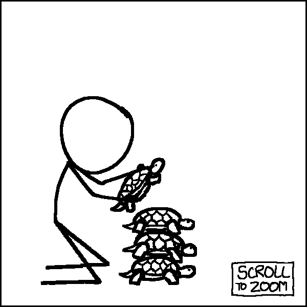

# What Is Computer Vision?

**Computer vision (CV)** is a field of AI that enables computers to interpret and understand visual information — turning pixels into decisions. CV systems can classify objects, detect their locations, track movement across video, segment regions at the pixel level, and measure quantitative features from images.


In healthcare, CV is transforming radiology, pathology, dermatology, ophthalmology, and surgery. A single hospital can produce millions of imaging studies per year — far more than radiologists can review with full attention. Modern CV systems now match or exceed human-level performance on specific tasks like detecting diabetic retinopathy from retinal scans or classifying skin lesions from dermoscopy images.

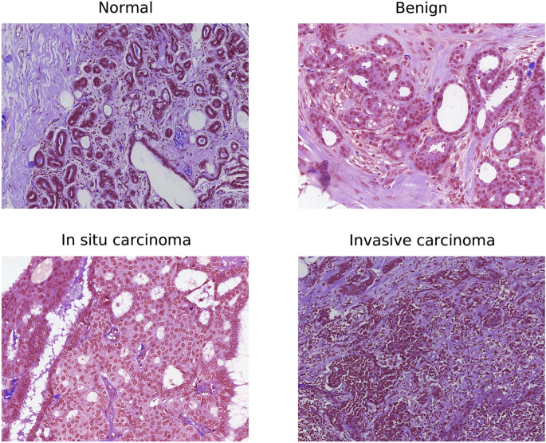

## Digital Image Representation

Before a computer can "see" an image, the image must be represented as numbers. An image is a grid of **pixels** — each pixel stores a color or intensity value at coordinates (x, y). **Resolution** is the number of pixels (width × height), and medical images range widely: dermoscopy (3000×4000) to ultrasound (640×480).

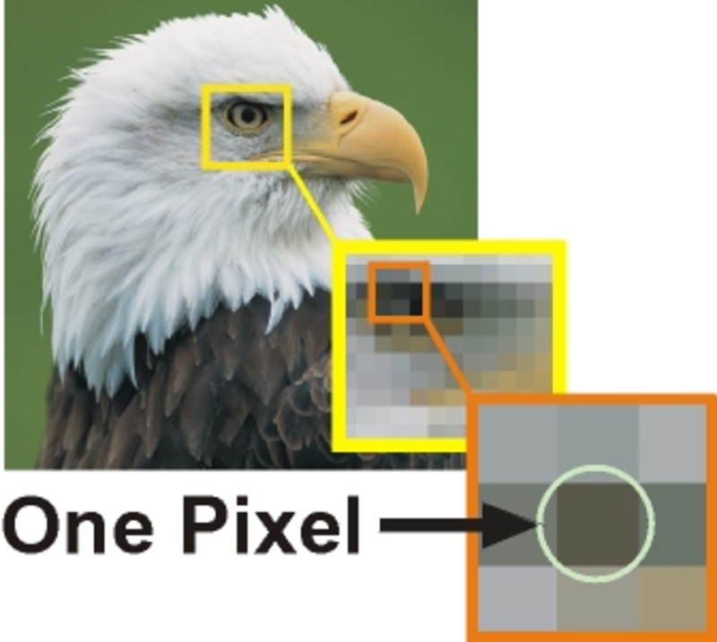

- **Grayscale**: Single intensity value per pixel (0–255 for 8-bit). 0 = black, 255 = white. Used in many medical images (X-rays, CT scans).

    

- **RGB**: Three values per pixel (Red, Green, Blue), each 0–255. Shape in memory: (height, width, 3) for NumPy, (3, height, width) for PyTorch.

    

## Medical Image Formats

Medical imaging uses specialized formats beyond standard JPEGs and PNGs.

- **DICOM (Digital Imaging and Communications in Medicine)**
    - The standard format for medical imaging worldwide
    - Contains both pixel data AND rich metadata
    - Metadata includes: patient info (ID, demographics), acquisition parameters (modality, equipment), organizational hierarchy (study, series, instance)
    - Used by CT, MRI, X-ray, ultrasound, PET, and more

    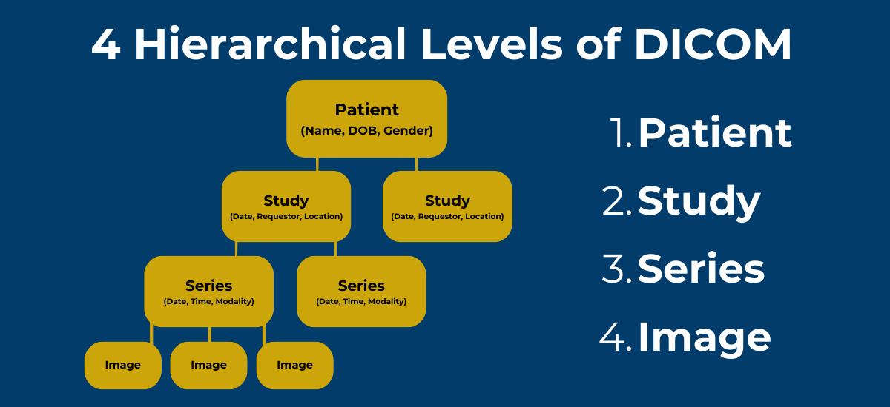

    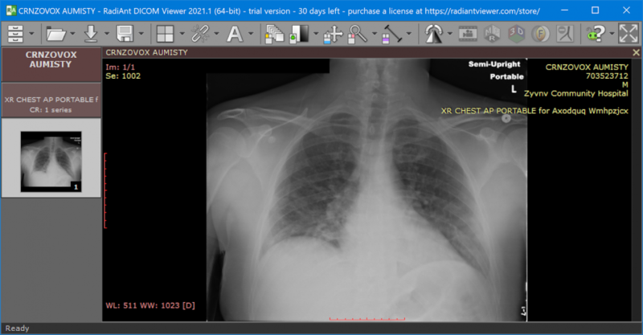

- **Other Common Formats**
    - **PNG**: Lossless compression, preserves all detail — good for sharing processed medical images
    - **JPEG**: Lossy compression, smaller files but may lose subtle detail — not ideal for diagnostic use
    - **TIFF**: Flexible, supports multiple layers and high bit depths — common in pathology
    - **NIfTI (.nii / .nii.gz)**: Standard for neuroimaging (MRI brain scans), stores 3D/4D volumes

[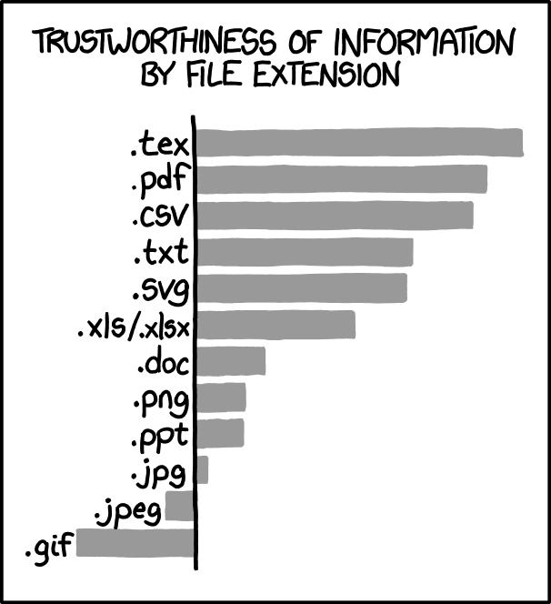](https://xkcd.com/1301/)

## The Python Imaging Stack

Python has a rich ecosystem for working with images. Here are the key libraries you'll use:

- **Pillow (PIL Fork)**: Basic image manipulation — loading, saving, resizing, cropping, color conversion. `from PIL import Image`
- **OpenCV**: Comprehensive CV library — advanced processing, feature detection, video analysis. High-performance C++ backend. `import cv2`
- **pydicom**: Read/write DICOM files, access metadata fields. `import pydicom`
- **torchvision**: PyTorch's computer vision library — transforms, pretrained models, datasets. `import torchvision`
- **matplotlib**: Visualization — display images in notebooks with `plt.imshow()`. `import matplotlib.pyplot as plt`

### Reference Card: Basic Image Operations

| Category | Library | Code | Purpose |
| :--- | :--- | :--- | :--- |
| **Load image** | Pillow | `Image.open("img.png")` | Returns PIL Image object |
| **Load image** | OpenCV | `cv2.imread("img.png")` | Returns numpy array (BGR format!) |
| **Load DICOM** | pydicom | `pydicom.dcmread("file.dcm")` | Returns Dataset with pixel_array + metadata |
| **Save image** | Pillow | `img.save("out.jpg")` | Saves in format determined by extension |
| **To numpy** | Pillow | `np.array(img)` | Converts PIL Image → numpy (H, W, C) |
| **To tensor** | torchvision | `transforms.ToTensor()(img)` | PIL Image → torch tensor (C, H, W), scales to [0, 1] |
| **Resize** | Pillow | `img.resize((224, 224))` | Resize to target dimensions |
| **Color convert** | OpenCV | `cv2.cvtColor(img, cv2.COLOR_BGR2RGB)` | OpenCV loads BGR — convert to RGB |
| **Display** | matplotlib | `plt.imshow(img, cmap='gray')` | Show image in notebook |

### Code Snippet: Loading Images Multiple Ways

```python
from PIL import Image
import pydicom
import numpy as np
import torch
from torchvision import transforms

# Standard image with Pillow
img_pil = Image.open("chest_xray.png")
img_array = np.array(img_pil)          # shape: (H, W) or (H, W, 3)

# DICOM with pydicom
ds = pydicom.dcmread("scan.dcm")
pixels = ds.pixel_array                 # shape: (H, W), dtype varies
patient = ds.PatientName               # access metadata
modality = ds.Modality                  # 'CR', 'CT', 'MR', etc.

# Convert to PyTorch tensor
to_tensor = transforms.ToTensor()
img_tensor = to_tensor(img_pil)         # shape: (C, H, W), range [0, 1]
```

# CNNs in PyTorch

In lecture 06 you were introduced to CNNs using Keras. Now let's apply those same ideas in **PyTorch** — the framework used in most research and increasingly in production. The core concepts are identical; the API style is different.

## Quick CNN Recap

Why not just flatten an image and feed it into a dense neural network? Consider a 224×224×3 RGB image — that's 150,528 input values. Connecting each to just 1,000 neurons means 150+ million weights in the first layer alone. That's a **parameter explosion**, and it also destroys the spatial structure of the image (neighboring pixels end up far apart in a flat vector).

CNNs solve both problems. Each convolutional layer applies small learned **filters** (e.g., 3×3) that slide across the image. The same filter is reused at every position — this **parameter sharing** means a 3×3 filter has only 9 weights regardless of image size. The output of applying a filter across the image is a **feature map**: a 2D grid showing where that pattern was detected.


Stacking convolutional layers builds a hierarchy of features — edges → textures → parts → objects:


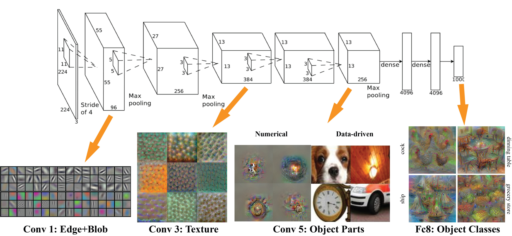

## PyTorch CNN Building Blocks

PyTorch provides all CNN components through `torch.nn`. Here are the core layers:

- **`nn.Conv2d`**: Applies learnable filters. Key args: `in_channels`, `out_channels`, `kernel_size`, `stride`, `padding`
- **`nn.MaxPool2d`**: Downsamples by taking the max value in each window. Reduces spatial dimensions while keeping the strongest activations.

    

- **`nn.BatchNorm2d`**: Normalizes activations within a batch. Stabilizes and speeds up training.
- **`nn.ReLU`**: Activation function — f(x) = max(0, x). Adds nonlinearity.
- **`nn.Dropout2d`**: Randomly zeros entire feature maps during training. Regularization for spatial data.
- **`nn.Flatten`**: Converts 2D feature maps to a 1D vector for the classification head.
- **`nn.Linear`**: Fully connected layer. Used in the classification head at the end of the network.

A typical CNN architecture follows this pattern:

```
INPUT → [CONV → BN → ReLU → POOL] × N → FLATTEN → LINEAR → OUTPUT
```


### Reference Card: torch.nn CNN Layers

| Layer | Signature | Purpose | Key Parameters |
| :--- | :--- | :--- | :--- |
| **Conv2d** | `nn.Conv2d(in_ch, out_ch, kernel_size)` | Applies convolution filters | `stride=1`, `padding=0` (use `padding=1` for 3×3 to preserve size) |
| **MaxPool2d** | `nn.MaxPool2d(kernel_size)` | Downsamples spatial dimensions | `kernel_size=2, stride=2` halves H and W |
| **BatchNorm2d** | `nn.BatchNorm2d(num_features)` | Normalizes per-channel activations | `num_features` = number of channels |
| **ReLU** | `nn.ReLU(inplace=True)` | Activation: max(0, x) | `inplace=True` saves memory |
| **Dropout2d** | `nn.Dropout2d(p=0.25)` | Drops entire feature maps | `p` = probability of zeroing a channel |
| **Flatten** | `nn.Flatten()` | Reshapes (N, C, H, W) → (N, C×H×W) | Used before Linear layers |
| **Linear** | `nn.Linear(in_features, out_features)` | Fully connected layer | For classification head |

### Code Snippet: A Simple CNN in PyTorch

```python
import torch
import torch.nn as nn

class SimpleCNN(nn.Module):
    def __init__(self, num_classes=10):
        super().__init__()
        self.features = nn.Sequential(
            nn.Conv2d(3, 32, kernel_size=3, padding=1),
            nn.BatchNorm2d(32),
            nn.ReLU(inplace=True),
            nn.MaxPool2d(2),

            nn.Conv2d(32, 64, kernel_size=3, padding=1),
            nn.BatchNorm2d(64),
            nn.ReLU(inplace=True),
            nn.MaxPool2d(2),
        )
        self.classifier = nn.Sequential(
            nn.Flatten(),
            nn.Linear(64 * 56 * 56, 128),  # 224 / 2 / 2 = 56 after two MaxPool2d(2)
            nn.ReLU(inplace=True),
            nn.Dropout(0.5),
            nn.Linear(128, num_classes),
        )

    def forward(self, x):
        x = self.features(x)
        x = self.classifier(x)
        return x

model = SimpleCNN(num_classes=2)
```

## The PyTorch Training Loop

Unlike Keras' `model.fit()`, PyTorch gives you explicit control over every step of training. This is more verbose but much more flexible:

### Reference Card: PyTorch Training Loop

| Component | Details |
| :--- | :--- |
| **Signature** | `for epoch in range(num_epochs): for inputs, labels in dataloader: ...` |
| **Purpose** | Trains a model by iterating over batches of data, computing loss, and updating weights via backpropagation. |
| **Steps** | 1. `optimizer.zero_grad()` — clear previous gradients<br>2. `outputs = model(inputs)` — forward pass<br>3. `loss = criterion(outputs, labels)` — compute loss<br>4. `loss.backward()` — compute gradients<br>5. `optimizer.step()` — update weights |
| **Key objects** | • **criterion**: Loss function (e.g., `nn.CrossEntropyLoss()`)<br>• **optimizer**: Weight updater (e.g., `torch.optim.Adam(model.parameters(), lr=1e-3)`)<br>• **device**: `torch.device("cuda" if torch.cuda.is_available() else "cpu")` |
| **Inference** | Wrap in `with torch.no_grad():` and call `model.eval()` to disable dropout/batchnorm training behavior |

### Code Snippet: Training Loop

```python
device = torch.device("cuda" if torch.cuda.is_available() else "cpu")
model = SimpleCNN(num_classes=2).to(device)
criterion = nn.CrossEntropyLoss()
optimizer = torch.optim.Adam(model.parameters(), lr=1e-3)

for epoch in range(10):
    model.train()
    running_loss = 0.0
    for inputs, labels in train_loader:
        inputs, labels = inputs.to(device), labels.to(device)

        optimizer.zero_grad()
        outputs = model(inputs)
        loss = criterion(outputs, labels)
        loss.backward()
        optimizer.step()

        running_loss += loss.item()
    print(f"Epoch {epoch+1}, Loss: {running_loss/len(train_loader):.4f}")
```

## Tensor Shape Conventions

One key difference between frameworks: **PyTorch uses NCHW** (batch, channels, height, width), while Keras/TensorFlow uses NHWC (batch, height, width, channels).

 #FIXME-missing-media

| Framework | Convention | Example (batch of 16 RGB 224×224 images) |
| :--- | :--- | :--- |
| PyTorch | NCHW | `torch.Size([16, 3, 224, 224])` |
| Keras/TF | NHWC | `(16, 224, 224, 3)` |

`torchvision.transforms.ToTensor()` handles the conversion from PIL (HWC) to PyTorch (CHW) automatically and scales pixel values from [0, 255] to [0.0, 1.0].

[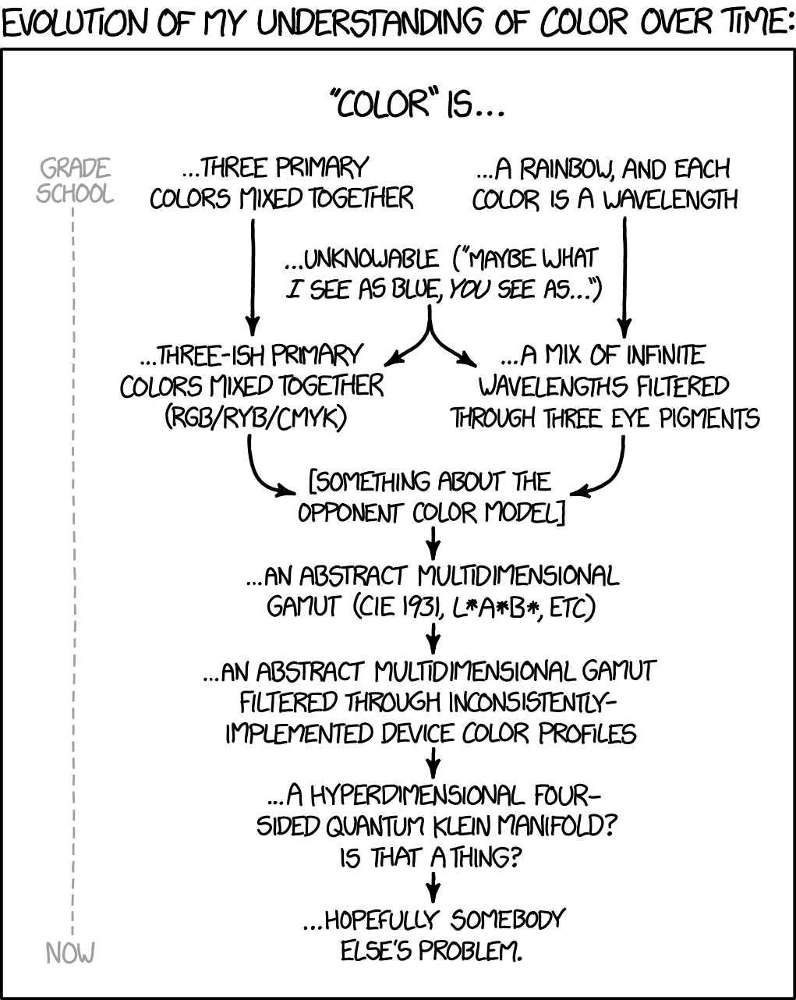](https://xkcd.com/1882/)

# torchvision — The Computer Vision Toolkit

`torchvision` is PyTorch's companion library for computer vision. It provides three essential components:

1. **Transforms**: image preprocessing and augmentation pipelines
2. **Datasets**: ready-to-use datasets and loading utilities
3. **Models**: pretrained architectures for classification, detection, and segmentation

Rather than building everything from scratch, lean on torchvision. It's well-tested, GPU-optimized, and follows consistent patterns.

## Transforms & Data Augmentation

`torchvision.transforms` provides composable image transformations. You build a pipeline by chaining operations with `Compose`:

**Essential transforms** (always used):

- `Resize(size)` — resize images to target dimensions
- `ToTensor()` — convert PIL Image to tensor, scales [0, 255] → [0.0, 1.0]
- `Normalize(mean, std)` — normalize channels to standard distribution
- `CenterCrop(size)` — crop from center (useful for eval)

**Augmentation transforms** (training only):

- `RandomHorizontalFlip(p=0.5)` — flip left-right with probability p
- `RandomVerticalFlip(p=0.5)` — flip top-bottom (useful for medical images with no "up")
- `RandomRotation(degrees)` — rotate by random angle
- `RandomResizedCrop(size)` — random crop and resize (scale + aspect ratio jitter)
- `ColorJitter(brightness, contrast, saturation, hue)` — random color perturbations
- `GaussianBlur(kernel_size)` — apply Gaussian blur
- `RandomAffine(degrees, translate, scale)` — combined rotation, translation, scaling
- `RandomErasing(p)` — randomly erase a rectangular patch (regularization)

For more advanced augmentation pipelines, the **`albumentations`** library is popular in medical imaging — it offers elastic deformations, grid distortion, and CLAHE, all optimized for speed.

**Why augmentation matters**: Medical imaging datasets are often small — hundreds or low thousands of images. Augmentation artificially increases diversity by creating modified versions of each training image. This helps the model generalize instead of memorizing the training set. A chest X-ray flipped horizontally is still a valid chest X-ray. A rotated pathology slide is still valid tissue.


### ImageNet Normalization

When using models pretrained on ImageNet, normalize your images to match the statistics ImageNet was trained with:

```python
normalize = transforms.Normalize(
    mean=[0.485, 0.456, 0.406],
    std=[0.229, 0.224, 0.225]
)
```

For grayscale medical images used with pretrained RGB models, either:

- Convert to 3-channel by repeating the grayscale channel: `img.convert("RGB")`
- Or adjust normalization to single-channel statistics

### Reference Card: torchvision.transforms

| Category | Transform | Purpose | Common Args |
| :--- | :--- | :--- | :--- |
| **Pipeline** | `Compose([t1, t2, ...])` | Chain transforms in sequence | List of transforms |
| **Size** | `Resize(size)` | Resize to target size | `(224, 224)` or `256` (short edge) |
| **Conversion** | `ToTensor()` | PIL → tensor, scale to [0, 1] | — |
| **Normalize** | `Normalize(mean, std)` | Per-channel normalization | ImageNet: `[0.485, 0.456, 0.406]` |
| **Crop** | `CenterCrop(size)` | Crop from center | `224` |
| **Flip** | `RandomHorizontalFlip(p)` | Horizontal flip | `p=0.5` |
| **Rotate** | `RandomRotation(degrees)` | Random rotation | `(-15, 15)` |
| **Scale+Crop** | `RandomResizedCrop(size)` | Random crop + resize | `scale=(0.8, 1.0)` |
| **Color** | `ColorJitter(b, c, s, h)` | Random color changes | `brightness=0.2, contrast=0.2` |
| **Blur** | `GaussianBlur(kernel_size)` | Gaussian blur | `kernel_size=3` |
| **Erase** | `RandomErasing(p)` | Erase random rectangle | `p=0.1` |

### Code Snippet: Train vs Eval Transforms

```python
from torchvision import transforms

# Training: augmentation + normalization
train_transform = transforms.Compose([
    transforms.Resize((256, 256)),
    transforms.RandomResizedCrop(224),
    transforms.RandomHorizontalFlip(),
    transforms.RandomRotation(10),
    transforms.ColorJitter(brightness=0.2, contrast=0.2),
    transforms.ToTensor(),
    transforms.Normalize([0.485, 0.456, 0.406], [0.229, 0.224, 0.225]),
])

# Evaluation: deterministic resize + normalize only
eval_transform = transforms.Compose([
    transforms.Resize((224, 224)),
    transforms.ToTensor(),
    transforms.Normalize([0.485, 0.456, 0.406], [0.229, 0.224, 0.225]),
])
```

## Datasets & DataLoaders

torchvision provides two ways to load image data:

**`ImageFolder`** — the simplest approach for custom datasets. Expects a directory structure where each subdirectory is a class:

```
data/
├── normal/
│   ├── xray_001.png
│   ├── xray_002.png
│   └── ...
└── tuberculosis/
    ├── xray_101.png
    ├── xray_102.png
    └── ...
```

**Custom `Dataset`** — for more complex scenarios (DICOM files, multi-label, CSV-driven):

```python
from torch.utils.data import Dataset

class ChestXrayDataset(Dataset):
    def __init__(self, image_paths, labels, transform=None):
        self.image_paths = image_paths
        self.labels = labels
        self.transform = transform

    def __len__(self):
        return len(self.image_paths)

    def __getitem__(self, idx):
        img = Image.open(self.image_paths[idx]).convert("RGB")
        label = self.labels[idx]
        if self.transform:
            img = self.transform(img)
        return img, label
```

**`DataLoader`** wraps a dataset and provides batching, shuffling, and parallel loading:

### Reference Card: `torch.utils.data.DataLoader`

| Component | Details |
| :--- | :--- |
| **Signature** | `DataLoader(dataset, batch_size=1, shuffle=False, num_workers=0, pin_memory=False, drop_last=False)` |
| **Purpose** | Wraps a Dataset to provide iterable batches with optional shuffling and parallel data loading. |
| **Parameters** | • **dataset**: A `Dataset` object (or `ImageFolder`)<br>• **batch_size** (int): Number of samples per batch (e.g., 32)<br>• **shuffle** (bool): Randomize order each epoch — `True` for training, `False` for eval<br>• **num_workers** (int): Parallel data loading processes (e.g., 4). Set to 0 for debugging.<br>• **pin_memory** (bool): Speed up CPU→GPU transfer. Set `True` when using CUDA.<br>• **drop_last** (bool): Drop last incomplete batch if dataset isn't evenly divisible |
| **Returns** | Iterable yielding `(batch_inputs, batch_labels)` tuples |

### Code Snippet: ImageFolder + DataLoader

```python
from torchvision import transforms
from torchvision.datasets import ImageFolder
from torch.utils.data import DataLoader, random_split

# Create dataset with transforms
dataset = ImageFolder("data/chest_xrays", transform=train_transform)
print(f"Classes: {dataset.classes}")  # ['normal', 'tuberculosis']
print(f"Total images: {len(dataset)}")

# Split into train/val/test
train_size = int(0.7 * len(dataset))
val_size = int(0.15 * len(dataset))
test_size = len(dataset) - train_size - val_size
train_set, val_set, test_set = random_split(dataset, [train_size, val_size, test_size])

# Create DataLoaders
train_loader = DataLoader(train_set, batch_size=32, shuffle=True, num_workers=4)
val_loader = DataLoader(val_set, batch_size=32, shuffle=False, num_workers=4)
```

# LIVE DEMO!

# Transfer Learning & Pretrained Models

Transfer learning is the single most important practical technique in computer vision. Rather than training a CNN from scratch (which requires millions of images and days of GPU time), you start with a model that already understands visual features and adapt it to your specific task.

## Why Transfer Learning?

**ImageNet** is a massive benchmark dataset of 1.2 million labeled natural photos across 1,000 everyday categories (dogs, cars, chairs, food, etc.). A model pretrained on ImageNet has already learned a rich hierarchy of visual features:

- **Early layers**: edges, corners, gradients, textures
- **Middle layers**: patterns, shapes, parts of objects
- **Deep layers**: complex structures, object parts, spatial relationships

These features transfer remarkably well to new domains — including medical imaging. A model that learned "edge" and "texture" features from natural photos can apply those same features to detect abnormalities in chest X-rays.

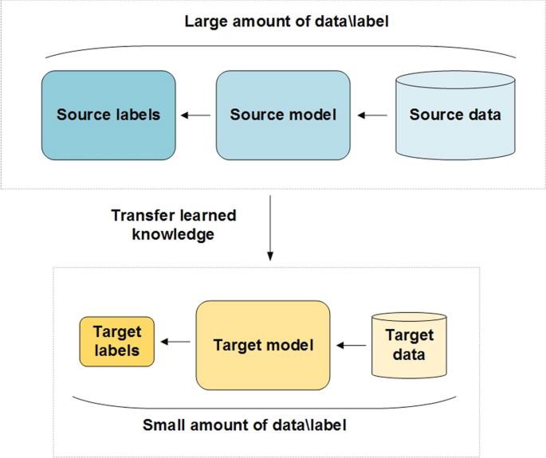

## Two Approaches

A pretrained model has two logical parts:

- **Backbone**: The main body of the network that extracts features — all the convolutional layers that turn pixels into feature maps. This is the expensive part that learned from millions of images.
- **Head**: The final classification layer(s) that map features to class predictions. This is the part you replace for your task.

**1. Feature Extraction** — Freeze the pretrained backbone, only train a new head:

- The pretrained layers act as a fixed feature extractor
- Only the new head layers are trained
- Fast to train, works well with very small datasets
- Best when: few images (<1,000) and the pretrained features are general enough for your domain

**2. Fine-Tuning** — Start frozen, then unfreeze some or all backbone layers:

- First train the head (feature extraction phase)
- Then unfreeze later backbone layers and continue training with a smaller learning rate
- Allows the model to adapt its learned features to your domain
- Best when: moderate dataset size (1,000–100,000), or target domain differs significantly from ImageNet (e.g., medical images vs natural photos)

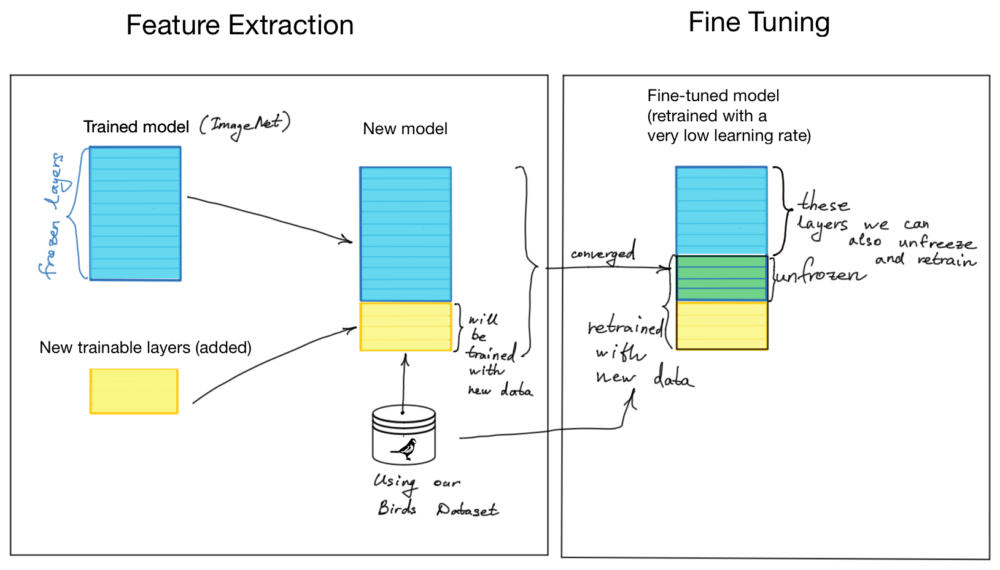

## Pretrained Models in torchvision

`torchvision.models` provides pretrained architectures with a consistent API. The modern way to load them uses the `weights` parameter:

| Architecture | Year | Key Innovation | Params | torchvision name |
| :--- | :--- | :--- | :--- | :--- |
| AlexNet | 2012 | Deep CNN + ReLU + dropout + GPU training | 61M | `alexnet` |
| VGG-16 | 2014 | Deeper networks with small 3×3 filters | 138M | `vgg16` |
| Inception v3 | 2015 | Parallel filters at multiple scales | 24M | `inception_v3` |
| ResNet-18/50 | 2015 | Skip connections (shortcut paths that let information bypass layers) → very deep networks | 11M/25M | `resnet18`, `resnet50` |
| MobileNetV2 | 2018 | Depthwise separable convolutions — splits expensive operations into cheaper steps → mobile-friendly | 3.4M | `mobilenet_v2` |
| EfficientNet-B0 | 2019 | Compound scaling — simultaneously scales network depth, width, and input resolution using a fixed ratio | 5.3M | `efficientnet_b0` |
| ConvNeXt-Tiny | 2022 | Modernized ConvNet matching ViT performance | 28M | `convnext_tiny` |

### Reference Card: torchvision.models

| Category | Method / Pattern | Purpose | Example |
| :--- | :--- | :--- | :--- |
| **Load model** | `models.resnet18(weights="DEFAULT")` | Load pretrained ResNet-18 | Returns nn.Module |
| **Weights enum** | `models.ResNet18_Weights.IMAGENET1K_V1` | Specific weight version | Explicit versioning |
| **No pretrain** | `models.resnet18(weights=None)` | Random initialization | For training from scratch |
| **Freeze** | `model.requires_grad_(False)` | Freeze all parameters | Or loop: `param.requires_grad = False` |
| **Replace head** | `model.fc = nn.Linear(512, num_classes)` | New classifier for ResNet | `.classifier` for MobileNet/EfficientNet |
| **List models** | `models.list_models()` | See all available models | Filter by keyword |

### Reference Card: `timm.create_model()`

| Component | Details |
| :--- | :--- |
| **Signature** | `timm.create_model(model_name, pretrained=True, num_classes=0, in_chans=3)` |
| **Purpose** | Creates any of 1,000+ pretrained vision models with a uniform API. Handles head replacement automatically. |
| **Parameters** | • **model_name** (str): Model identifier (e.g., `"resnet18"`, `"efficientnet_b0"`, `"vit_base_patch16_224"`)<br>• **pretrained** (bool): Load pretrained weights<br>• **num_classes** (int): Output classes. Set 0 to remove head (for feature extraction). Set to your number of classes to auto-create head.<br>• **in_chans** (int): Number of input channels (3 for RGB, 1 for grayscale) |
| **Returns** | `nn.Module` ready for training or inference |

### Code Snippet: Transfer Learning with ResNet-18

```python
import torchvision.models as models
import torch.nn as nn

# Load pretrained ResNet-18
model = models.resnet18(weights="DEFAULT")

# Freeze the backbone
for param in model.parameters():
    param.requires_grad = False

# Replace the classification head (512 → num_classes)
model.fc = nn.Sequential(
    nn.Linear(512, 128),
    nn.ReLU(),
    nn.Dropout(0.3),
    nn.Linear(128, 2),  # binary: normal vs tuberculosis
)

# Only the new head parameters will be trained
optimizer = torch.optim.Adam(model.fc.parameters(), lr=1e-3)
```

With **timm**, the same thing is even simpler:

```python
import timm

model = timm.create_model("resnet18", pretrained=True, num_classes=2)
```

[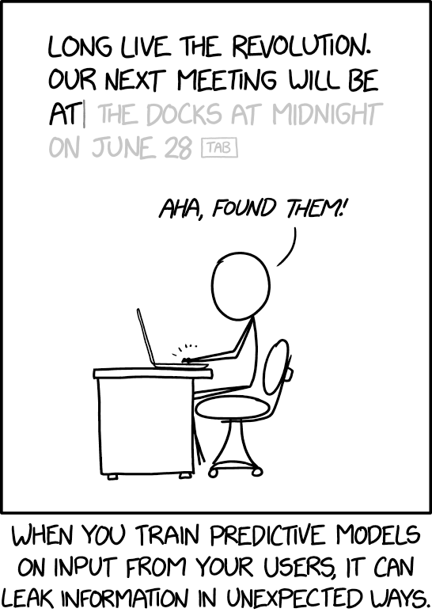](https://xkcd.com/2169/)

# Evaluating Vision Models

## Classification Metrics

Choosing the right evaluation metric depends on the clinical context. A model with 98% accuracy might still be dangerous if it misses 50% of cancers (low recall on the positive class).

# FIXME: Add confusion matrix heatmap or ROC curve example image

The classification metrics from lecture 05 apply directly to image classification:

- **Accuracy**: Fraction of correct predictions. Misleading when classes are imbalanced.
- **Precision**: Of predicted positives, how many are truly positive? (Avoid false alarms)
- **Recall / Sensitivity**: Of actual positives, how many did we catch? (Avoid missed diagnoses)
- **F1 Score**: Harmonic mean of precision and recall
- **Confusion Matrix**: Full breakdown of predictions vs ground truth

In medical imaging, **class imbalance** is the norm. A chest X-ray dataset might be 90% normal, 10% abnormal — a model that always predicts "normal" gets 90% accuracy but catches zero diseases.

**Which metric matters depends on the clinical context:**

- **Screening** (mammography, TB detection): Maximize **recall/sensitivity** — missing a cancer is worse than a false alarm. Accept more false positives.
- **Confirmatory diagnosis** (biopsy prediction): Maximize **specificity/precision** — triggering unnecessary procedures has real cost.

**Handling class imbalance:**

- **Weighted loss**: `nn.CrossEntropyLoss(weight=torch.tensor([1.0, 9.0]).to(device))` penalizes missed minorities
- **Weighted sampling**: `WeightedRandomSampler` (from `torch.utils.data`) oversamples the minority class in each batch
- **Threshold tuning**: Adjust the classification threshold to trade precision for recall (don't always use 0.5)

**Critical: patient-level splits.** Medical datasets often contain multiple images per patient (different views, time points, slices). If the same patient's images appear in both training and test sets, the model may learn patient-specific features rather than disease features — and test metrics will be misleadingly high. Always split by **patient ID**, not by image.

### Reference Card: Classification Metrics

| Metric | Formula / Definition | When to Use |
| :--- | :--- | :--- |
| **Accuracy** | Correct / Total | Balanced classes only |
| **Precision** | TP / (TP + FP) | When false positives are costly |
| **Recall** | TP / (TP + FN) | When missed positives are costly (screening) |
| **F1** | 2 × (P × R) / (P + R) | Balanced precision-recall tradeoff |
| **AUROC** | Area under ROC curve | Threshold-independent performance |

### Code Snippet: Evaluation with torchmetrics

```python
import torchmetrics

# Initialize metrics
accuracy = torchmetrics.Accuracy(task="binary").to(device)
f1 = torchmetrics.F1Score(task="binary").to(device)
confusion = torchmetrics.ConfusionMatrix(task="binary").to(device)

# Evaluation loop
model.eval()
with torch.no_grad():
    for inputs, labels in test_loader:
        inputs, labels = inputs.to(device), labels.to(device)
        outputs = model(inputs)
        preds = outputs.argmax(dim=1)
        accuracy.update(preds, labels)
        f1.update(preds, labels)
        confusion.update(preds, labels)

print(f"Accuracy: {accuracy.compute():.4f}")
print(f"F1: {f1.compute():.4f}")
print(f"Confusion Matrix:\n{confusion.compute()}")
```

# LIVE DEMO!!

[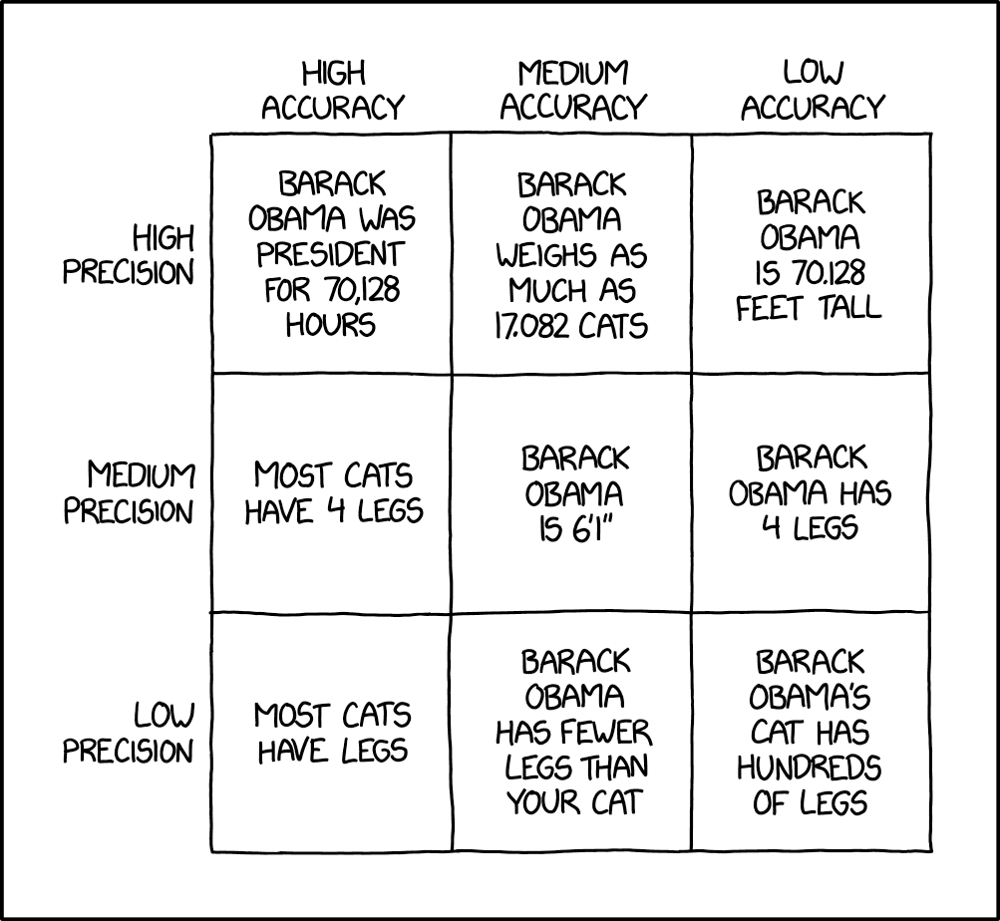](https://xkcd.com/2696/)

# Object Detection

Image classification tells you *what's* in an image. Object detection tells you *what* and *where*. It's the difference between "this chest X-ray contains a nodule" and "there is a 12mm nodule in the right upper lobe." In clinical settings, location matters — a radiologist needs to know not just that something is abnormal, but exactly where to look.

The output of a detection model is a set of **bounding boxes**, each with a class label and a confidence score.

## Medical Applications

- **Nodule detection** in chest CT / lung scans
- **Cell counting** in microscopy images
- **Polyp detection** in colonoscopy
- **Surgical instrument tracking** in robotic surgery
- **Fracture detection** in skeletal X-rays


## Key Concepts

**Bounding Boxes**: Rectangles that localize objects. Typically represented as `(x_min, y_min, x_max, y_max)` or `(x_center, y_center, width, height)`.

**Anchor Boxes**: Predefined box templates at various sizes and aspect ratios, placed at every position in the feature map. The model predicts _offsets_ from these anchors rather than absolute coordinates — this makes learning easier.

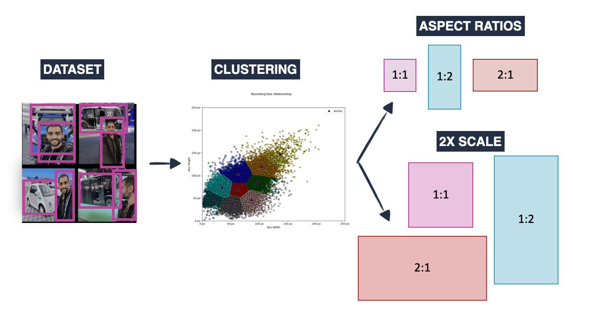

**IoU (Intersection over Union)**: Measures overlap between a predicted box and a ground-truth box. `IoU = Area_overlap / Area_union`. A detection is "correct" when IoU exceeds a threshold (typically 0.5).


**Non-Maximum Suppression (NMS)**: Post-processing to remove redundant overlapping detections. When multiple boxes detect the same object, NMS keeps the highest-confidence one and removes boxes with IoU above a threshold.


**mAP (mean Average Precision)**: The standard detection metric. Averages precision across recall levels and across classes. `mAP@0.5` uses an IoU threshold of 0.5; `mAP@[.5:.95]` averages across multiple thresholds.

### Reference Card: Detection Metrics

| Metric | Formula / Definition | When to Use |
| :--- | :--- | :--- |
| **IoU** | Overlap / Union | Localization quality — is the box in the right place? |
| **mAP** | Mean precision at recall levels | Overall detection quality across classes |

## Detector Families

| Approach | Examples | How It Works | Tradeoff |
| :--- | :--- | :--- | :--- |
| **Two-stage** | Faster R-CNN, Mask R-CNN | 1. Generate region proposals 2. Classify each region | More accurate, slower |
| **One-stage** | YOLO, SSD, RetinaNet, FCOS | Predict boxes + classes in one pass | Faster, sometimes less accurate |
| **Anchor-free** | FCOS (Fully Convolutional One-Stage), CenterNet | Predict object centers + sizes directly (no anchor templates needed) | Simpler, competitive accuracy |

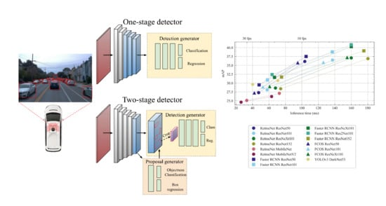

Two-stage detectors like **Faster R-CNN** first propose "interesting" regions, then classify each one. One-stage detectors like **YOLO** divide the image into a grid and predict boxes and classes simultaneously at each grid cell — much faster, making them suitable for real-time applications.

## Detection with torchvision

`torchvision.models.detection` provides pretrained detection models. Most use a **Feature Pyramid Network (FPN)** on top of the backbone — FPN builds feature maps at multiple resolutions so the model can detect both small and large objects (a 3-pixel nodule and a full-lung opacity need different scales).

### Reference Card: torchvision.models.detection

| Model | Function | Backbone | Speed | Accuracy |
| :--- | :--- | :--- | :--- | :--- |
| **Faster R-CNN** | `fasterrcnn_resnet50_fpn(weights="DEFAULT")` | ResNet-50 + FPN | Medium | High |
| **FCOS** | `fcos_resnet50_fpn(weights="DEFAULT")` | ResNet-50 + FPN | Medium | High |
| **RetinaNet** | `retinanet_resnet50_fpn_v2(weights="DEFAULT")` | ResNet-50 + FPN | Medium | High |
| **SSD** | `ssd300_vgg16(weights="DEFAULT")` | VGG-16 | Fast | Moderate |
| **SSDLite** | `ssdlite320_mobilenet_v3_large(weights="DEFAULT")` | MobileNetV3 | Very fast | Moderate |

All pretrained detection models are trained on **COCO** (Common Objects in Context) — a large-scale detection dataset with 80 everyday object classes like person, car, cat, and chair. For medical applications, you'd fine-tune on your own annotated dataset.

### Code Snippet: Inference with Pretrained Faster R-CNN

```python
import torchvision
from torchvision.models.detection import fasterrcnn_resnet50_fpn, FasterRCNN_ResNet50_FPN_Weights
from torchvision.utils import draw_bounding_boxes
from torchvision.transforms.functional import to_pil_image

# Load pretrained model
weights = FasterRCNN_ResNet50_FPN_Weights.DEFAULT
model = fasterrcnn_resnet50_fpn(weights=weights)
model.eval()

# Prepare image
preprocess = weights.transforms()
img_tensor = preprocess(img)

# Run inference
with torch.no_grad():
    predictions = model([img_tensor])[0]

# Filter by confidence
keep = predictions["scores"] > 0.7
boxes = predictions["boxes"][keep]
labels = predictions["labels"][keep]
scores = predictions["scores"][keep]

# Visualize
label_names = [weights.meta["categories"][l] for l in labels]
result = draw_bounding_boxes(
    (img_tensor * 255).byte(), boxes, label_names, width=3
)
to_pil_image(result).show()
```

## Ultralytics YOLO

For the fastest path to object detection in practice, **Ultralytics YOLO** provides a batteries-included API:

```python
from ultralytics import YOLO

model = YOLO("yolo11n.pt")  # load pretrained YOLO11-nano
results = model("chest_xray.png")
results[0].show()  # display with bounding boxes

# Fine-tune on custom dataset
model.train(data="my_dataset.yaml", epochs=50)
```

YOLO models are pretrained on COCO. For medical use, fine-tune on annotated medical images (bounding boxes around findings). Ultralytics handles the training loop, augmentation, and evaluation automatically.

[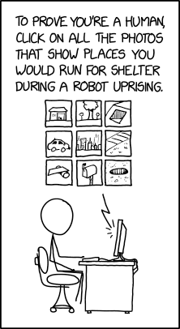](https://xkcd.com/2228/)

# Image Segmentation

Segmentation is the most detailed form of visual understanding — it classifies every pixel in an image. Instead of one label per image (classification) or boxes around objects (detection), segmentation produces a **mask** that precisely outlines each region of interest. This matters clinically: a bounding box around a tumor tells you roughly where it is, but a segmentation mask tells you its exact shape, volume, and boundaries — critical for surgical planning and radiation therapy.

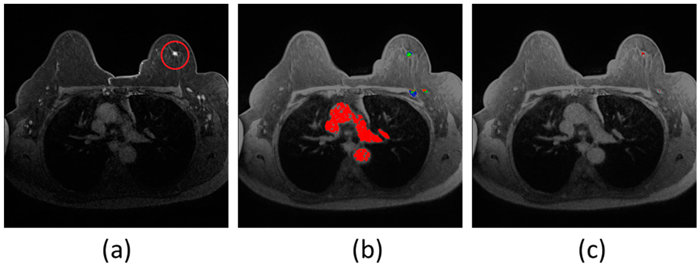

## Types of Segmentation

- **Semantic segmentation**: Labels every pixel with a class. All pixels of the same class get the same label (e.g., all "lung" pixels are one color). Does not distinguish between instances.
- **Instance segmentation**: Like semantic segmentation, but also distinguishes between individual objects (e.g., "cell #1" vs "cell #2").
- **Panoptic segmentation**: Combines both — every pixel gets a class AND an instance ID.

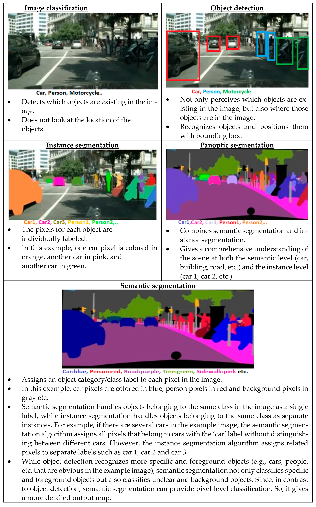

# FIXME: Add side-by-side comparison showing the same image with semantic, instance, and panoptic segmentation

## Medical Applications

Segmentation is arguably the most impactful CV task in medicine:

- **Organ segmentation** for surgical planning and volume measurement

    

- **Tumor delineation** for radiation treatment planning and growth monitoring

    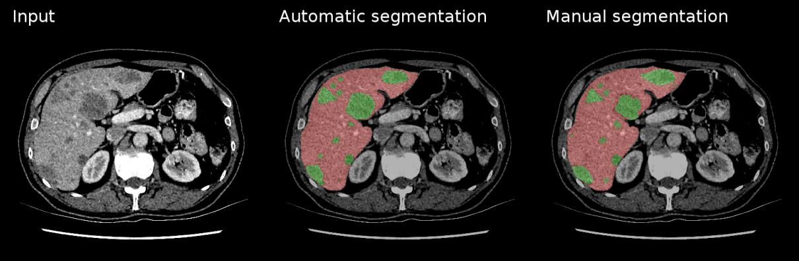

- **Cell segmentation** in microscopy for counting and morphology analysis
- **Tissue type differentiation** (gray/white matter, cerebrospinal fluid in brain MRI)
- **Vessel segmentation** for angiography analysis
- **Wound measurement** from photographs

## U-Net Architecture

**U-Net** (Ronneberger et al., 2015) was designed specifically for biomedical image segmentation and remains the dominant architecture for medical imaging. It works remarkably well even with very limited training data.

> **tl;dr** — U-Net uses a U-shaped encoder-decoder CNN. The encoder extracts features at increasing granularity using convolutions and pooling. The decoder upsamples these features back to the original image size. Skip connections link encoder features to the decoder, combining "what" (semantic context) with "where" (spatial detail) for precise segmentation.


**Key components**:

1. **Encoder (Contracting Path)**: Like a classification CNN — repeated blocks of `Conv → ReLU → Conv → ReLU → MaxPool`. Number of filters doubles after each pool (64 → 128 → 256 → 512). Captures increasingly abstract features while reducing spatial resolution.

2. **Bottleneck**: The deepest point — `Conv → ReLU → Conv → ReLU` at the lowest resolution. Contains the most abstract features.

3. **Decoder (Expanding Path)**: Mirrors the encoder — `Upsample → Concatenate skip connection → Conv → ReLU → Conv → ReLU`. Number of filters halves after each upsample. Recovers spatial resolution and detail.

4. **Skip Connections**: The critical innovation. Feature maps from the encoder are concatenated with corresponding decoder feature maps at the same spatial resolution. This lets the decoder combine high-resolution spatial detail from the encoder with high-level semantic information from the decoder.

5. **Output Layer**: 1×1 convolution mapping features to the desired number of classes. `Sigmoid` activation for binary segmentation; `Softmax` for multi-class.

## Loss Functions for Segmentation

Standard cross-entropy works but struggles with the extreme class imbalance common in medical segmentation (e.g., a small tumor in a large image). Specialized losses like **Dice Loss** optimize overlap directly, making them less sensitive to imbalance.

### Reference Card: Segmentation Loss Functions

| Loss | Signature | Best For | Key Behavior |
| :--- | :--- | :--- | :--- |
| **BCEWithLogitsLoss** | `nn.BCEWithLogitsLoss()` | Binary segmentation, balanced classes | Pixel-level cross-entropy with sigmoid built-in |
| **CrossEntropyLoss** | `nn.CrossEntropyLoss(weight=class_weights)` | Multi-class segmentation | Pass `weight` tensor for class balancing |
| **Dice Loss** | `smp.losses.DiceLoss()` | Imbalanced classes (most medical tasks) | Optimizes `1 - (2|X∩Y|) / (|X|+|Y|)` directly |
| **Jaccard Loss** | `smp.losses.JaccardLoss()` | Similar to Dice | Optimizes `1 - |X∩Y| / |X∪Y|`, slightly different gradients |
| **Focal Loss** | `smp.losses.FocalLoss()` | Severe class imbalance | Downweights easy pixels, γ parameter controls focus |
| **BCE + Dice** | Sum both losses | General-purpose | Combines pixel-level and region-level optimization |

## Segmentation Metrics

- **Dice Coefficient**: `Dice = 2|X∩Y| / (|X|+|Y|)`. Ranges from 0 to 1. The standard metric for medical image segmentation — directly measures mask overlap. Dice = 1.0 means perfect agreement.
- **IoU / Jaccard Index**: `IoU = |X∩Y| / |X∪Y|`. Same concept as in detection, applied per-pixel. Penalizes errors slightly more than Dice.
- **Pixel Accuracy**: Fraction of pixels correctly classified. Like accuracy in classification — misleading when one class dominates (e.g., 99% background).

### Reference Card: Segmentation Metrics

| Metric | Formula / Definition | When to Use |
| :--- | :--- | :--- |
| **Dice** | 2\|X∩Y\| / (\|X\|+\|Y\|) | Medical segmentation standard |
| **IoU / Jaccard** | \|X∩Y\| / \|X∪Y\| | Alternative overlap metric |
| **Pixel Accuracy** | Correct pixels / Total pixels | Quick sanity check (not for imbalanced masks) |

## Segmentation with Packages

Rather than implementing U-Net from scratch, use **`segmentation_models_pytorch`** (smp) — it provides U-Net, U-Net++, FPN, DeepLabV3+, and more, with any pretrained encoder as the backbone:

### Reference Card: `segmentation_models_pytorch`

| Component | Details |
| :--- | :--- |
| **Signature** | `smp.Unet(encoder_name, encoder_weights, in_channels, classes, activation)` |
| **Purpose** | Creates a U-Net segmentation model with a pretrained encoder backbone. |
| **Parameters** | • **encoder_name** (str): Backbone architecture (e.g., `"resnet18"`, `"efficientnet-b0"`, `"mobilenet_v2"`)<br>• **encoder_weights** (str): Pretrained weights (e.g., `"imagenet"`) or `None`<br>• **in_channels** (int): Input channels (3 for RGB, 1 for grayscale)<br>• **classes** (int): Number of output segmentation classes<br>• **activation** (str/None): Output activation (`"sigmoid"` for binary, `None` for logits — raw unnormalized scores) |
| **Returns** | `nn.Module` with `.encoder`, `.decoder`, `.segmentation_head` attributes |

`torchvision.models.segmentation` also provides pretrained models:

| Model | Function | Architecture |
| :--- | :--- | :--- |
| **DeepLabV3** | `deeplabv3_resnet50(weights="DEFAULT")` | Uses dilated convolutions (filters with spacing between elements to see a wider area without more parameters) + ResNet-50 |
| **FCN** | `fcn_resnet50(weights="DEFAULT")` | Fully Convolutional Network (replaces all dense layers with convolutions so it works on any input size) + ResNet-50 |
| **LRASPP** | `lraspp_mobilenet_v3_large(weights="DEFAULT")` | Lightweight mobile segmentation head + MobileNetV3 — fast, lower accuracy |

### Code Snippet: U-Net with smp

```python
import segmentation_models_pytorch as smp

# Create U-Net with pretrained ResNet-18 encoder
model = smp.Unet(
    encoder_name="resnet18",
    encoder_weights="imagenet",
    in_channels=1,         # grayscale chest X-ray
    classes=1,             # binary: lung vs background
    activation="sigmoid",
)

# Dice loss for training
loss_fn = smp.losses.DiceLoss(mode="binary")

# Training is the same PyTorch loop as classification
# but inputs are images and targets are masks
for images, masks in train_loader:
    optimizer.zero_grad()
    outputs = model(images)
    loss = loss_fn(outputs, masks)
    loss.backward()
    optimizer.step()
```

## MONAI for Medical Imaging

**MONAI** (Medical Open Network for AI) is a PyTorch-based framework built specifically for healthcare imaging. It provides:

- Medical image transforms (windowing, spacing normalization, intensity scaling)
- Specialized architectures (DynUNet, SwinUNETR, SegResNet)
- Built-in support for 3D volumetric data (CT, MRI)
- Loss functions designed for medical segmentation
- Data loading for NIfTI, DICOM series, and other medical formats

```python
import monai
from monai.networks.nets import UNet

model = UNet(
    spatial_dims=2,      # 2D (or 3 for volumetric)
    in_channels=1,
    out_channels=2,      # number of classes
    channels=(16, 32, 64, 128, 256),
    strides=(2, 2, 2, 2),
)
```

[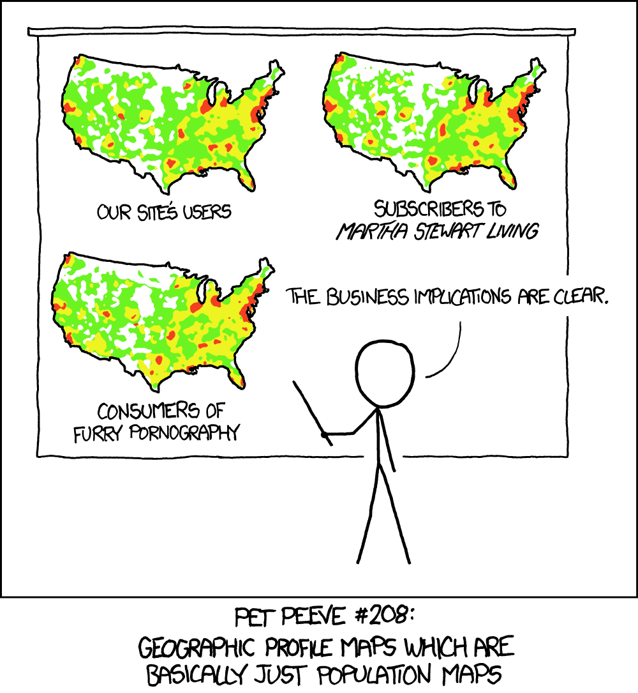](https://xkcd.com/1138/)

# Advanced Topics & The Bigger Picture

Computer vision is evolving rapidly. Here's what's on the frontier — concepts to be aware of, not necessarily to implement today.

## Vision Transformers (ViTs)

Transformers — the architecture behind GPT and BERT — have been adapted for images. Instead of processing text tokens, a **Vision Transformer** splits an image into patches (e.g., 16×16 pixels each) and processes them as a sequence of tokens with self-attention.


ViTs excel at capturing **global relationships** across the entire image — something CNNs achieve only through stacking many layers. Models like **DINOv2** (Meta) provide powerful general-purpose visual features without any labeled data.

```python
import timm
model = timm.create_model("vit_base_patch16_224", pretrained=True, num_classes=2)
```

## Foundation Models for Vision

Large pretrained models that can be adapted to many tasks with minimal fine-tuning:

- **SAM (Segment Anything)** by Meta — a foundation model for segmentation. Given any image and a prompt (point, box, or text), it produces a segmentation mask. Can segment objects it has never seen.
- **CLIP** by OpenAI — learns visual concepts from natural language descriptions. Can classify images using text prompts with zero examples ("zero-shot classification").
- **BiomedCLIP** — a CLIP variant trained on biomedical image-text pairs from PubMed. Better for medical image understanding than general CLIP.

## Explainability in Medical CV

For clinical adoption, models must be interpretable. Clinicians need to understand _why_ a model made a prediction, not just what it predicted.

- **Grad-CAM**: Uses gradients to highlight which image regions most influenced the prediction. Produces a heatmap overlay showing "where the model is looking."
- **Attention Maps**: In transformer-based models, attention weights naturally show which parts of the image are most relevant.
- **LIME / SHAP**: Model-agnostic explanation methods that can be applied to any vision model.

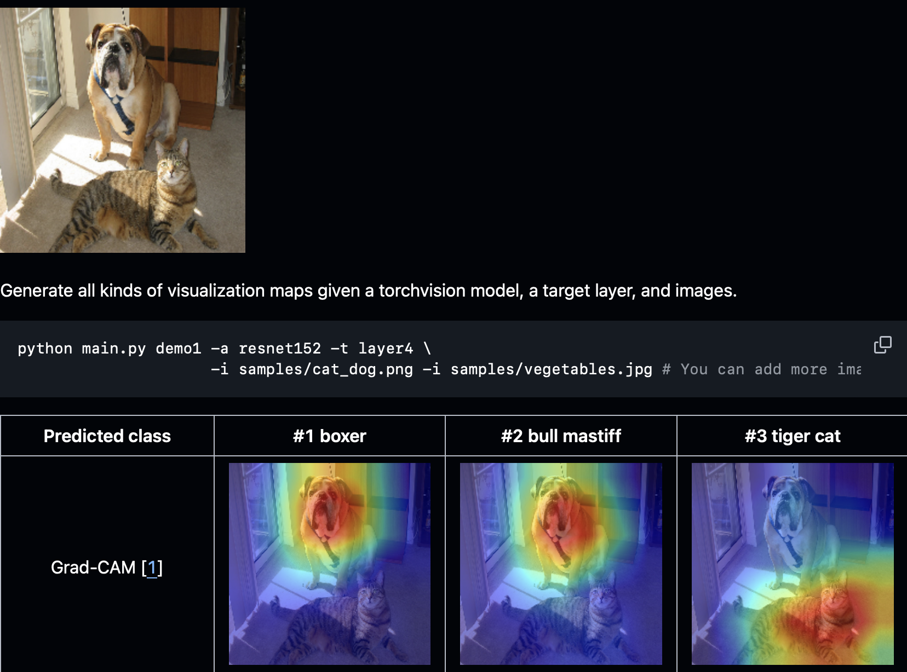

Explainability is not optional in healthcare. Regulatory bodies (FDA, CE marking) increasingly require it, and clinicians won't trust a model they can't understand.

## Self-Supervised Learning

Most medical images are unlabeled — getting expert annotations is expensive and time-consuming. Self-supervised learning methods learn useful representations from unlabeled data by solving artificial **pretext tasks** like "predict the rotation angle of this image" or "reconstruct masked patches." The model learns general visual features as a byproduct of solving these tasks, and those features can then be fine-tuned for real clinical tasks with very few labels.

Key approaches include **contrastive learning** (SimCLR, MoCo — learn that augmented versions of the same image should look similar), **masked image modeling** (MAE — reconstruct masked patches), and **DINO/DINOv2** (a model teaches itself by matching outputs between two copies of the network, with no human labels needed).

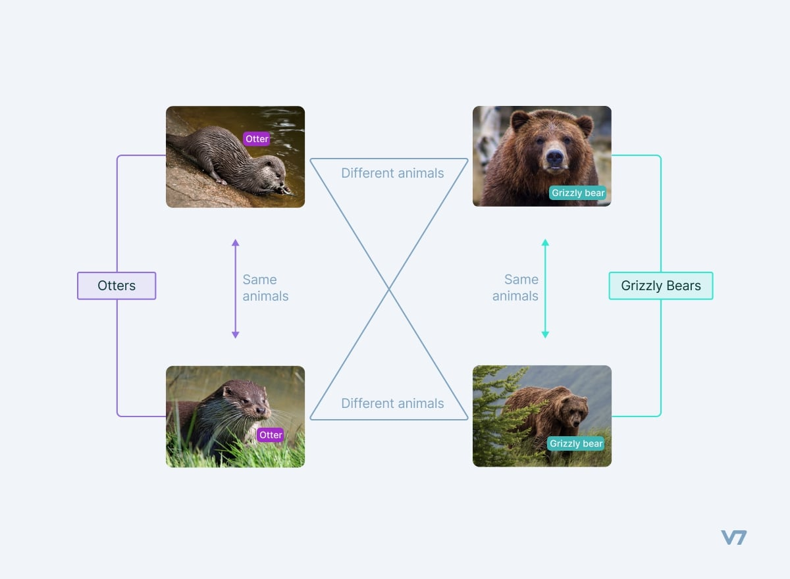

## Video Analysis & Tracking

Medical video (surgical recordings, endoscopy, ultrasound) is increasingly analyzed with CV. Object detection models like YOLO can process video frame-by-frame, while dedicated tracking algorithms (DeepSORT, ByteTrack) maintain object identity across frames. OpenCV's `VideoCapture` handles video I/O, and Ultralytics YOLO supports video inference out of the box with `model("surgery.mp4")`.


## Generative Models

Generative models like **diffusion models** can synthesize realistic medical images for data augmentation, translate between modalities (CT → MRI), and generate training data when labeled examples are scarce. **GANs** (Generative Adversarial Networks) were the earlier approach and are still used for image-to-image translation tasks like converting low-dose CT to standard-dose quality.

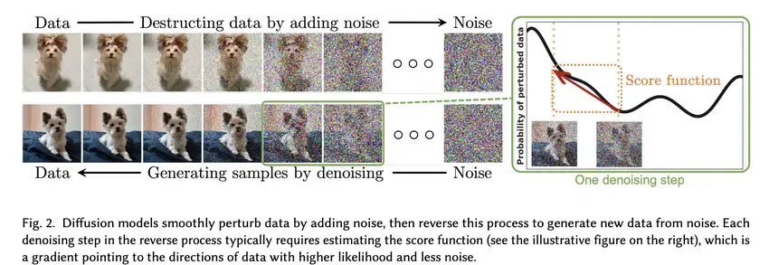

## 3D Medical Imaging

Many medical modalities produce volumetric data — CT scans are stacks of 2D slices forming a 3D volume; MRI can be 3D or 4D (including time).

- **3D convolutions**: `nn.Conv3d` extends the CNN concept to volumes
- **3D U-Net**: The standard for volumetric segmentation (e.g., organ segmentation from CT)
- **TorchIO**: Library for medical image transforms on 3D volumes (resampling, augmentation, patch-based training)
- **MONAI**: Full framework for 3D medical imaging workflows

## Specialized Libraries & Resources

| Library | Focus | Key Feature |
| :--- | :--- | :--- |
| **MONAI** | Healthcare imaging | 3D support, medical transforms, DICOM/NIfTI loading |
| **TorchIO** | Medical image transforms | 3D augmentation, patch-based training |
| **timm** | Pretrained models | 1000+ architectures with uniform API |
| **smp** | Segmentation | U-Net/FPN/DeepLab with any backbone |
| **Albumentations** | Fast augmentation | Highly optimized, rich transform library |
| **Ultralytics** | Object detection | YOLO11+, batteries-included training |

### Datasets for Medical CV

- [PhysioNet](https://physionet.org/) — Physiological and clinical data, including imaging
- [MedMNIST](https://medmnist.com/) — Standardized biomedical datasets (28×28 and 64×64)
- [TCIA](https://www.cancerimagingarchive.net/) — Cancer imaging archive
- [Grand Challenge](https://grand-challenge.org/) — Biomedical image analysis challenges
- NIH ChestX-ray14, LIDC-IDRI, BraTS, VinDr-CXR

### Annotation Tools

- [ITK-SNAP](https://www.itksnap.org/) — 3D medical image segmentation
- [3D Slicer](https://www.slicer.org/) — Medical image analysis platform
- [CVAT](https://github.com/opencv/cvat) — Open-source annotation tool (bounding boxes, masks)
- [Label Studio](https://labelstud.io/) — Multi-modal annotation platform

# LIVE DEMO!!!
