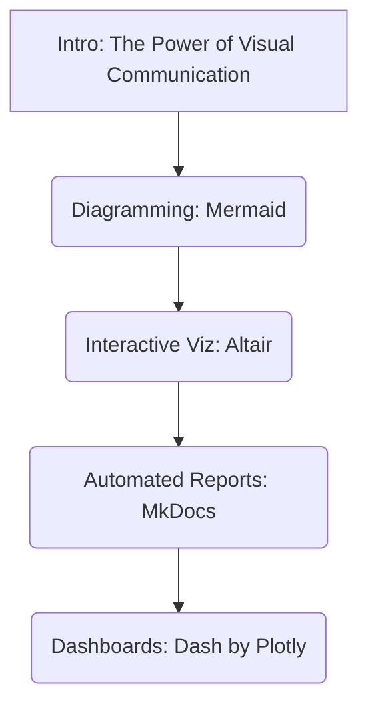
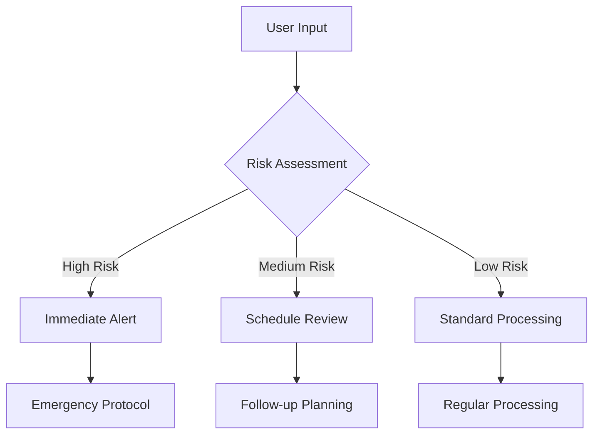
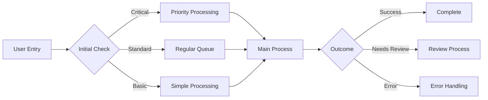

# Lecture 09: Data Visualization & Communication

**Overall Goal:** Equip students with skills to create effective visualizations and interactive dashboards, focusing on clear communication of insights to both technical and non-technical stakeholders.

**Target Audience:** Health data science master's students (beginners in programming).
**Lecture Duration:** 90 minutes.
**Format:** Long-form Markdown.

---

## 0. Introduction (5 minutes)

### The Data Communication Crisis

Picture this: You've just completed a groundbreaking analysis showing that a simple intervention could reduce costs by 23%. You present a dense Excel table with 47 rows of statistics to the board. Eyes glaze over. Your brilliant insight dies in a spreadsheet graveyard. 💀

Now imagine instead: An interactive dashboard where stakeholders can explore the data themselves, see the intervention's impact across different segments, and watch the savings accumulate in real-time. Which presentation gets funding? 🎯


<!---
This scenario illustrates the critical gap between having insights and communicating them effectively. Poor data communication can lead to missed opportunities and failed initiatives. The tools we'll learn today bridge this gap between analysis and action.
--->

**Lecture Objectives:**

* Create clear process diagrams using Mermaid for workflows and data pipelines
* Build interactive visualizations with Altair that tell compelling data stories
* Generate automated, shareable reports using MkDocs for disseminating findings
* Develop professional dashboards with Dash by Plotly for data exploration
* Apply these tools to real-world scenarios, focusing on principles of effective communication

**Agenda Overview:**



<!---
*   This lecture builds upon previous sessions on data analysis and machine learning, focusing on how to make the results of such work understandable and impactful.
*   The core theme is moving from raw data and complex analyses to clear narratives and interactive explorations that drive decisions.
*   Effective communication can significantly amplify the value of data science work.
--->

---

## 1. Diagrams as Code with Mermaid (15 minutes)

Visualizing processes, architectures, and workflows is essential for understanding and communicating complex systems. While many tools exist for creating diagrams, the "diagrams as code" approach offers unique advantages for data science projects.

### 1.1. Why Diagrams as Code?

* **Concept:** Treating diagrams as source code offers several advantages. These diagrams are defined using text, making them version-controllable with tools like Git, inherently reproducible, and easier to update systematically.
    <!---
    *   Instead of using a graphical user interface (GUI) to draw shapes and connectors, you write text-based definitions that a tool then renders into a visual diagram.
    *   This is particularly valuable where processes and workflows need to be clearly documented and updated.
    --->
* **Benefits:** This approach promotes:
    * **Consistency:** Diagrams maintain a uniform style, especially across a team or project.
    * **Version Control:** Changes to diagrams can be tracked, diffed, and reverted using Git, just like any other code. This is invaluable for collaborative projects and understanding the evolution of workflows.
        
    * **Reproducibility:** Anyone with the text definition can regenerate the exact same diagram, ensuring consistent documentation.
    * **Easy Integration:** Text-based diagrams can be easily embedded into documentation (like MkDocs sites), README files, or even code comments.
    * **Collaboration:** Team members can collaborate on diagrams using familiar code review workflows.
    * **Accessibility:** Text-based definitions can be more accessible to individuals using screen readers than complex image files, although the rendered output's accessibility also matters.
    <!---
    *   Reproducibility ensures that the diagram accurately reflects the documented workflow at any point in time.
    *   Ease of integration means diagrams live alongside the documentation or code they describe, reducing the chance of them becoming outdated or lost.
    --->
* **Contrast with GUI Tools:** GUI-based diagramming tools (e.g., Microsoft Visio, Lucidchart, draw.io) offer a visual interface for drawing. While often user-friendly for initial creation, they can be challenging for:
    * **Versioning:** Tracking precise changes can be difficult, which is crucial for workflow documentation.
    * **Reproducibility:** Ensuring identical regeneration by different users or on different systems can be tricky.
    * **Programmatic Updates:** Making systematic changes across many diagrams is often manual.
    * **Integration with Code/Docs:** Often involves exporting static images, which can become outdated.
    <!---
    *   GUI tools excel at free-form drawing and quick mockups.
    *   "Diagrams as code" tools shine when diagrams need to be maintained, versioned, and integrated with technical documentation over time.
    --->

### 1.2. Introduction to Mermaid

Mermaid is a popular JavaScript-based tool that takes Markdown-inspired text definitions and renders them as diagrams. It's designed to be simple to learn yet powerful enough for a variety of diagramming needs.

* **What is Mermaid?** Mermaid is a JavaScript-based diagramming and charting tool that uses Markdown-inspired text definitions to dynamically create and modify diagrams. You write text, Mermaid draws the picture.
    <!---
    *   The "Markdown-inspired" part means its syntax is generally human-readable and relatively simple, much like Markdown for text formatting.
    --->
* **Common Diagram Types:** It supports various diagram types, including:
    * **Flowcharts:** For visualizing processes, workflows, and decision trees. (e.g., `graph TD; A-->B;`)
        
    * **Sequence Diagrams:** For showing interactions between different components or actors over time. (e.g., `sequenceDiagram; User->>System: Submit Request;`)
        
    * **Gantt Charts:** For project scheduling and tracking timelines.
    * **Class Diagrams:** For visualizing software structures.
    * **Entity Relationship Diagrams (ERDs):** For database schema design.
    * And more (User Journey, Process Flow, System Design, etc.).
    <!---
    *   Flowcharts and sequence diagrams are particularly useful for documenting workflows, user pathways, or system interactions.
    --->
* **Tools for Mermaid:**
    * **Online Editor:** The [Mermaid Live Editor](https://mermaid.live) is an excellent resource for quickly writing, previewing, and sharing Mermaid diagrams.
    * **VS Code Extensions:** Many extensions provide live preview capabilities for Mermaid diagrams within Markdown files (e.g., "Markdown Preview Mermaid Support," "Mermaid Markdown Syntax Highlighting").
    * **MkDocs Integration:** Many MkDocs themes (like Material for MkDocs) have built-in support for Mermaid, or it can be added via plugins. We'll see this later.
    * **Other Platforms:** GitHub, GitLab, and some other platforms also render Mermaid diagrams directly in Markdown files.
    <!---
    *   The Mermaid Live Editor (mermaid.live) is a convenient online resource for quickly drafting and testing Mermaid diagrams.
    *   Native rendering support in platforms like GitHub and GitLab makes it easy to include diagrams directly in project READMEs or wikis.
    --->

### 1.3. Basic Mermaid Syntax & Examples

Let's focus on flowcharts, as they are broadly applicable to many workflows.

#### Flowcharts

Flowcharts are used to represent processes, workflows, or algorithms, showing steps as boxes of various kinds, and their order by connecting them with arrows.

* **Concept:** Visualizing processes, step-by-step logic, and decision points.
* **Reference Card: Mermaid Flowchart**
    * **Declaration:** Start with `graph TD;` (for Top-Down) or `graph LR;` (for Left-Right). Other orientations like `BT` (Bottom-Top) and `RL` (Right-Left) also exist.
        <!---
        *   `TD` or `TB` for Top to Bottom.
        *   `LR` for Left to Right.
        --->
    * **Nodes (Shapes):**
        * `id[Text]`  Default rectangle: `A[Data Collection]`
        * `id(Text)`  Rounded rectangle: `B(Data Processing)`
        * `id((Text))` Circle: `C((Analysis))`
        * `id{Text}`  Diamond (for decisions): `D{Results Significant?}`
        * `id>Text]`  Asymmetric/Stadium: `E>Report Generation]`
        * Many other shapes are available (parallelogram, trapezoid, etc.).
        <!---
        *   The `id` is a unique identifier for the node, used for linking. The `Text` is what's displayed.
        *   Choosing the right shape can help convey the meaning of a step (e.g., diamond for decisions).
        --->
    * **Links (Connections):**
        * `A --> B` (Arrow link from A to B)
        * `A --- B` (Line link from A to B)
        * `A -- Text --> B` (Arrow link with text on the arrow)
        * `A -.-> B` (Dotted arrow link)
        * `A == Text ==> B` (Thick arrow link with text)
        <!---
        *   Links define the flow and relationships between steps.
        *   Text on links can clarify conditions or actions.
        --->
* **Minimal Example (Data Analysis Pipeline):**
    This diagram outlines a typical workflow for a data analysis project.

    ```mermaid
    graph TD;
        A[Load Data] --> B(Data Cleaning & Preprocessing);
        B --> C{Select Analysis Type};
        C -- Descriptive Stats --> D[Generate Summary];
        C -- Predictive Model --> E[Train & Evaluate Model];
        D --> F[Visualize Key Metrics];
        E --> F;
        F --> G[Compile Report];
    ```
    <!---
    *   `A[Load Data]`: Represents the initial step of data ingestion.
    *   `B(Data Cleaning & Preprocessing)`: A process step with rounded edges for data preparation.
    *   `C{Select Analysis Type}`: A decision point, indicated by the diamond shape.
    *   The arrows (`-->`) show the direction of flow.
    * Text on arrows (`-- Descriptive Stats -->`) clarifies the path taken from a decision.
    --->

#### More Workflow Examples

**Decision Support System:**



**User Journey Through System:**



### Demo 1: Mermaid Flowchart

* (Refer to [`lectures/09/demo/01_mermaid_flowchart.md`](lectures/09/demo/01_mermaid_flowchart.md))
    <!---
    *   The first demo will provide hands-on practice with creating a simple flowchart.
    *   Students will apply the syntax learned to visualize a familiar process.
    --->

---

## 2. Interactive Data Visualization with Altair (25 minutes)

While static charts are useful, interactive visualizations empower users to explore data more deeply, uncover patterns, and gain personalized insights. Altair is a Python library that excels at creating a wide range of interactive statistical visualizations with a concise and intuitive syntax.

### 2.1. Beyond Static: The Power of Interaction

* **Why Interactive?** Interactive visualizations allow users to explore data dynamically through features like tooltips, zooming, panning, and selections. This enhances engagement, facilitates the understanding of complex datasets, and enables users to ask their own questions of the data.
    <!---
    *   Interactivity transforms the audience from passive viewers into active data explorers.
    *   For example, hovering over a data point to see detailed information (tooltip), or selecting a subset of data to see it highlighted in other linked charts.
    --->
    

### 2.2. Introduction to Altair

* **What is Altair?** Altair is a declarative statistical visualization library for Python, built on top of Vega-Lite. "Declarative" means you specify *what* you want to visualize (the mapping from data to visual properties), rather than detailing *how* to draw it step-by-step (imperative).
    <!---
    *   Vega-Lite is a high-level visualization grammar, and Altair provides a Python API to generate Vega-Lite JSON specifications. These JSON specs are then rendered by JavaScript libraries in environments like Jupyter notebooks, web browsers, or MkDocs sites.
    --->
* **Key Principles (Grammar of Graphics):** Altair follows the Grammar of Graphics, a formal system for describing statistical graphics. Visualizations are built by mapping data columns to visual properties (encodings) of geometric shapes (marks). The core components are:
    * **Data:** The dataset, typically a Pandas DataFrame. Altair works best with data in a "tidy" long-form format.
    * **Mark:** The geometric object representing data (e.g., `mark_point()`, `mark_bar()`, `mark_line()`, `mark_area()`, `mark_rect()`).
    * **Encoding:** The mapping of data fields (columns) to visual channels like:
        * `x`: x-axis position (e.g., time, category)
        * `y`: y-axis position (e.g., value, count)
        * `color`: mark color (e.g., category, group)
        * `size`: mark size (e.g., magnitude, importance)
        * `shape`: mark shape (e.g., type, status)
        * `opacity`: mark transparency
        * `tooltip`: information to show on hover (e.g., ID, details)
    <!---
    *   The Grammar of Graphics provides a structured way to think about and construct visualizations, promoting consistency and expressiveness.
    *   Tidy data means each variable forms a column, each observation forms a row, and each type of observational unit forms a table.
    --->
* **Benefits:** This approach leads to:
    * **Concise Code:** Complex charts can often be expressed in just a few lines of Python.
    * **Aesthetically Pleasing Defaults:** Altair charts generally look good out-of-the-box.
    * **Powerful Interactivity:** Built-in support for selections, tooltips, panning, and zooming.
* **Comparison (Briefly):**
    * `plotnine` is another Python library based on the Grammar of Graphics (an implementation of R's `ggplot2`). It shares the declarative philosophy with Altair.
    * Both Altair and `plotnine` contrast with the more imperative (step-by-step drawing commands) approach of basic `matplotlib`. While `matplotlib` is highly flexible and powerful, creating complex, publication-quality charts can require more verbose code.
    <!---
    *   The choice between Altair and plotnine can depend on familiarity with ggplot2 syntax (for plotnine users) or preference for Vega-Lite's interactivity and web-native output (for Altair users).
    --->

### 2.3. Basic Altair: Building Blocks

Let's look at the fundamental components for creating an Altair chart.

* **Reference Card: `altair.Chart`**
    * **Core Object:** `alt.Chart(data)`: This is the starting point. You pass your Pandas DataFrame to it.
        <!---
        *   `alt` is the conventional alias for `import altair as alt`.
        --->
    * **Mark Type:** `.mark_type()`: Specifies the geometric shape. Examples:
        * `mark_point()`: For scatter plots (e.g., correlations).
        * `mark_bar()`: For bar charts (e.g., counts).
        * `mark_line()`: For line charts (e.g., trends).
        * `mark_area()`: For area charts (e.g., cumulative values).
        * `mark_rect()`: For heatmaps (e.g., patterns).
    * **Encodings:** `.encode(...)`: This is where you map data columns to visual properties.
        * Syntax: `channel='column_name:type_shorthand'`
        * **Type Shorthands:**
            * `:Q` - Quantitative (continuous numerical data)
            * `:N` - Nominal (discrete, unordered categorical data)
            * `:O` - Ordinal (discrete, ordered categorical data)
            * `:T` - Temporal (date/time data)
        * Example: `alt.X('age:Q')`, `alt.Y('value:Q')`, `alt.Color('category:N')`
        <!---
        *   Specifying the correct data type is crucial for Altair to apply appropriate scales, axes, and legends.
        --->
    * **Properties:** `.properties(...)`: To set overall chart attributes.
        * `width=W` (integer, pixels)
        * `height=H` (integer, pixels)
        * `title='My Chart Title'`
    * **Interactivity:** `.interactive()`: A convenient shortcut to enable basic panning and zooming.
    * **Saving Charts:** `.save('filename.ext')`
        * `'chart.html'`: Saves as a self-contained HTML file.
        * `'chart.json'`: Saves the Vega-Lite JSON specification. This is very useful for embedding in web pages or using with tools like MkDocs and Dash.
        * `'chart.png'` or `'chart.svg'`: Saves as a static image. Requires the `vl-convert` package (`pip install vl-convert-python`).
        <!---
        *   `altair_viewer` is another package that can help display charts during development, especially outside of Jupyter environments.
        --->
* **Minimal Example (Scatter Plot):**
    Let's assume we have a Pandas DataFrame `data_df` with columns like `x`, `y`, and `category`.

    ```python
    import altair as alt
    import pandas as pd

    # Example: Create a placeholder DataFrame if data_df is not loaded
    # This is just for demonstration if you run this code block standalone.
    # In a real scenario, data_df would be loaded from a CSV or other source.
    if 'data_df' not in locals():
        data_df = pd.DataFrame({
            'x': [1, 2, 3, 4, 5, 6, 7, 8], 
            'y': [2, 4, 6, 8, 10, 12, 14, 16], 
            'id': ['A001', 'A002', 'A003', 'A004', 'A005', 'A006', 'A007', 'A008'],
            'category': ['Type A', 'Type B', 'Type A', 'Type B', 'Type A', 'Type B', 'Type A', 'Type B']
        })
    
    scatter_plot = alt.Chart(data_df).mark_point(size=100).encode(
        x='x:Q',  # X-axis, quantitative
        y='y:Q',  # Y-axis, quantitative
        color='category:N', # Color points by category (nominal)
        tooltip=['id:N', 'x:Q', 'y:Q', 'category:N'] # Info on hover
    ).properties(
        title='X vs. Y by Category'
    ).interactive() # Enable pan and zoom

    # To display in a Jupyter Notebook, this is often enough:
    # scatter_plot 
    
    # To save (uncomment the one you need):
    # scatter_plot.save('x_vs_y_scatter.html')
    # scatter_plot.save('x_vs_y_scatter.json') 
    # scatter_plot.save('x_vs_y_scatter.png') # Requires vl-convert
    ```

    

*   **Generated JSON Specification:**
    When you save this chart as JSON (`scatter_plot.save('chart.json')`), Altair generates a Vega-Lite specification like this:
    ```json
    {
      "$schema": "https://vega.github.io/schema/vega-lite/v5.20.1.json",
      "data": {
        "name": "data-cc85da6ba14ea85607962b8b20b8f7ab"
      },
      "mark": {
        "type": "point",
        "size": 100
      },
      "encoding": {
        "x": {"field": "x", "type": "quantitative"},
        "y": {"field": "y", "type": "quantitative"},
        "color": {"field": "category", "type": "nominal"},
        "tooltip": [
          {"field": "id", "type": "nominal"},
          {"field": "x", "type": "quantitative"},
          {"field": "y", "type": "quantitative"},
          {"field": "category", "type": "nominal"}
        ]
      },
      "title": "X vs. Y by Category",
      "params": [
        {
          "name": "param_1",
          "select": {"type": "interval", "encodings": ["x", "y"]},
          "bind": "scales"
        }
      ],
      "datasets": {
        "data-cc85da6ba14ea85607962b8b20b8f7ab": [
          {"x": 1, "y": 2, "id": "A001", "category": "Type A"},
          {"x": 2, "y": 4, "id": "A002", "category": "Type B"}
        ]
      }
    }
    ```
    <!---
    *   This JSON specification is what gets embedded in MkDocs sites and Dash apps.
    *   Understanding this structure helps debug issues and customize charts beyond Python.
    *   The "params" section handles the interactivity from `.interactive()`.
    *   Notice how Altair separates the data into a "datasets" section and references it by name.
    --->

    <!---
    *   This example creates a scatter plot showing the relationship between x and y, with points colored by category.
    *   Tooltips allow users to see specific data when they hover over a point.
    *   The `.interactive()` call enables basic zoom and pan functionality.
    --->

### 2.4. Building Blocks for Dynamic Charts (e.g., for Interactive Dashboard)

To create more advanced interactive charts, like the dashboard we'll aim for in the Dash demo, we need a few more Altair concepts. This section focuses on the Altair techniques for creating components that can be assembled into such visualizations.

* **Selections:** Selections are the core of Altair's interactivity. They define how users can interact with the chart.
    * `alt.selection_interval()`: Allows selecting a rectangular region (brushing).
    * `alt.selection_point()`: Allows selecting single or multiple discrete points.
    * `alt.selection_single()`: Allows selecting a single discrete item, often used with `bind` for widgets.
* **Input Binding (for `selection_single`):** Connects a selection to an HTML input element.
    * `bind=alt.binding_range(min=V, max=V, step=V)`: Creates a slider.
    * `bind=alt.binding_select(options=[...])`: Creates a dropdown menu.
* **Conditional Encodings:** Change visual properties based on a selection.
    * `alt.condition(selection, value_if_selected, value_if_not_selected)`
    * Example: `color=alt.condition(my_selection, 'steelblue', 'lightgray')`
* **Transformations:** Modify the data before encoding.
    * `transform_filter(selection_or_expression)`: Filter data based on a selection or a Vega expression.
    * `transform_aggregate(...)`: Perform aggregations (e.g., mean, sum).
    * `transform_window(...)`: For window functions (e.g., rank, cumulative sum).
* **Layering & Concatenation:** Combine multiple chart specifications.
    * `chart1 + chart2`: Layer charts on top of each other (share axes).
    * `chart1 | chart2`: Place charts side-by-side (horizontal concatenation).
    * `chart1 & chart2`: Place charts one above the other (vertical concatenation).

* **Key Altair features for an interactive dashboard:**
    * **Data:** A DataFrame with columns for metrics, categories, and timestamps.
    * **Time Slider:** Use `alt.selection_single` with `bind=alt.binding_range` to create a slider for the `timestamp` field.
    * **Filtering:** Use `transform_filter(timestamp_slider_selection)` to filter the data displayed in the chart based on the time selected by the slider.
    * **Encodings:** Map the data columns to `x`, `y`, `size`, and `color` visual channels.
    * **Tooltips:** Provide rich information on hover.
    * **Scales:** May need to customize scales (e.g., `alt.Scale(type="log")` for skewed distributions).

*   **Example Pattern for Dynamic Charts:**
    ```python
    # Basic pattern for time-based filtering
    time_slider = alt.selection_single(
        fields=['timestamp'],
        bind=alt.binding_range(min='2024-01-01', max='2024-12-31', step=86400000)  # 1 day in milliseconds
    )
    
    chart = alt.Chart(data).mark_circle().encode(
        x='timestamp:T',
        y='value:Q',
        size='magnitude:Q',
        color='category:N'
    ).add_params(time_slider).transform_filter(time_slider)
    ```

**Pro Tip for Data Scientists:** 📊
When creating interactive visualizations with Altair, consider these encoding strategies:
* **X-axis**: Time or category
* **Y-axis**: Value or count
* **Size**: Magnitude or importance
* **Color**: Category or status
* **Animation**: Time progression showing trends

<!---
This conceptual code outlines how to define an Altair chart with a time slider. The `selection_single` with `binding_range` creates the slider, and `transform_filter` dynamically updates the chart based on the slider's current time. The actual data loading and precise binding would be part of the demo implementation. This JSON specification can then be used by Dash to render the interactive chart.
--->

### Demo 2: Interactive Altair Chart

* (Refer to [`lectures/09/demo/02_altair_interactive_chart.md`](lectures/09/demo/02_altair_interactive_chart.md))
    <!---
    *   This demo will involve creating a simpler interactive chart, perhaps with a categorical filter or a brush selection, using a real dataset.
    *   It reinforces the concepts of selections and saving for embedding.
    --->

---

## 3. Automated Report Generation with MkDocs (20 minutes)

Once you have created insightful visualizations and diagrams, you need an effective way to share them along with your narrative and findings. MkDocs is a static site generator that allows you to create professional-looking project documentation and reports using Markdown.

### 3.1. Why Static Site Generators for Reports?

* **Concept & Benefits:** Static site generators (SSGs) like MkDocs take source files (e.g., Markdown text, images, chart specifications) and templates to produce a complete, self-contained HTML website. For data science reports, this offers:
    * **Shareability:** Simple HTML files are easy to host on a web server, GitHub Pages, or send as a zipped archive.
    * **Version Control:** The entire report source (Markdown, Python scripts for generating charts, configuration files) can be managed with Git.
    * **Reproducibility:** Reports can be consistently rebuilt from the source files at any time.
    * **Professional Appearance:** Themes (like Material for MkDocs) provide a polished look with minimal effort.
    * **Automation:** The process of generating charts and building the report can be scripted.
    <!---
    *   SSGs bridge the gap between writing analysis code and producing a presentable, shareable output.
    *   They are an excellent alternative to manually assembling reports in word processors or relying solely on Jupyter Notebooks for dissemination.
    --->
* **MkDocs:** MkDocs is known for its speed, simplicity, and focus on creating project documentation, which extends well to generating data analysis reports. It uses Markdown for content, making it easy to write.
    
    

### 3.2. Setting up MkDocs

* **Installation:** You'll need MkDocs itself, a theme (Material for MkDocs is highly recommended), and any plugins. For embedding Altair charts, we'll use `mkdocs-altair-plugin`.

    ```bash
    pip install mkdocs mkdocs-material mkdocs-altair-plugin pandas altair
    ```
    <!---
    *   `mkdocs`: The core static site generator.
    *   `mkdocs-material`: A popular and feature-rich theme for MkDocs.
    *   `mkdocs-altair-plugin`: Allows easy embedding of Altair charts.
    *   `pandas` and `altair`: Needed if your report generation process involves creating charts with Python.
    --->
* **Project Initialization:** To start a new MkDocs project:

    ```bash
    mkdocs new my_report
    cd my_report
    ```

    This creates a basic project structure:

    ```
    my_report/
    ├── mkdocs.yml    # The main configuration file
    └── docs/
        └── index.md  # The homepage for your report
    ```
    <!---
    *   The `mkdocs new` command sets up the essential files and directories.
    *   You'll primarily work within the `docs/` directory for content and edit `mkdocs.yml` for configuration.
    --->
* **Directory Structure (Recommended):** It's good practice to organize supporting files. For example, create a `docs/charts/` directory for Altair JSON specifications and `docs/media/` for images.

    ```
    my_report/
    ├── mkdocs.yml
    └── docs/
        ├── index.md
        ├── analysis_page.md
        ├── charts/
        │   └── my_altair_chart.json
        └── media/
            └── workflow_diagram.png 
    ```

### 3.3. Configuring `mkdocs.yml`

The `mkdocs.yml` file controls your site's settings, theme, navigation, and plugins.

* **Basic Configuration:**

    ```yaml
    site_name: My Data Report
    site_description: 'A report on data analysis findings.'
    site_author: 'Your Name'

    theme:
      name: material  # Using the Material for MkDocs theme
      # Optional: add features, palette, logo, etc.
      # features:
      #   - navigation.tabs
      # palette:
      #   primary: 'indigo'
      #   accent: 'blue'
      # logo: media/logo.png 
    ```

    
* **Plugins:** Enable plugins, especially for Altair charts.

    ```yaml
    plugins:
      - search        # Built-in search plugin
      - charts        # For mkdocs-charts-plugin (or the specific name it uses, e.g., mkdocs_charts_plugin)
      # Ensure vega_lite_version is compatible if the plugin has such an option,
      # or that Altair output matches what the plugin expects.
      # Example options for mkdocs-charts-plugin (refer to its documentation):
      # charts:
      #   vega_lite_version: "5" # Or similar if supported
      #   use_data_path: true # If you want paths relative to markdown file
    ```
    <!---
    *   The `mkdocs-material` theme offers many customization options documented on its website.
    *   Ensure the `vega_lite_version` in the `altair` plugin matches the version Altair is using to avoid rendering issues.
    --->
* **Navigation (`nav`):** Defines the structure of your site's navigation menu.

    ```yaml
    nav:
      - 'Home': 'index.md'
      - 'Analysis Details':
        - 'Part 1: EDA': 'eda.md'
        - 'Part 2: Modeling': 'modeling.md'
      - 'Interactive Charts': 'interactive_charts.md'
      - 'About': 'about.md'
    ```
    <!---
    *   The `nav` section allows you to create a hierarchical menu for your report pages.
    --->

### 3.4. Creating Report Content & Embedding Charts/Diagrams

* **Markdown:** Write your report narrative, analysis, and findings in `.md` files within the `docs/` directory. Standard Markdown syntax applies.
* **Python Script for Charts:** It's good practice to have a separate Python script (e.g., in a `scripts/` directory at the project root, or directly in `docs/` if simple) that generates your Altair charts and saves them as JSON files into a designated folder, like `docs/charts/`.

    ```python
    # Example: scripts/generate_report_charts.py
    # import altair as alt
    # import pandas as pd
    # from pathlib import Path

    # # Assume data_df is loaded or created
    # # ... (chart creation code from section 2.3) ...
    # # scatter_plot = alt.Chart(data_df).mark_point()... 

    # output_dir = Path("../docs/charts") # Relative to script location if script is in scripts/
    # output_dir.mkdir(parents=True, exist_ok=True)
    # # scatter_plot.save(output_dir / "x_vs_y_scatter.json")
    # print(f"Saved chart to {output_dir / 'x_vs_y_scatter.json'}")
    ```
    <!---
    *   This script would be run manually or as part of an automated build process *before* running `mkdocs build`.
    --->
* **Embedding Altair Charts:** In your Markdown files, use the `mkdocs-charts-plugin` with vegalite code blocks:

    ```markdown
    Here is an interactive chart showing x vs. y, referencing an external JSON schema:

    ```vegalite
    {
      "schema-url": "charts/x_vs_y_scatter.json"
    }
    ```

    The chart shows a positive correlation...

    Alternatively, you can embed the full Vega-Lite JSON specification directly:

    ```vegalite
    {
      "$schema": "https://vega.github.io/schema/vega-lite/v5.json",
      "description": "A scatter plot of x vs. y.",
      "data": {
        "name": "data"
        // Data can be embedded here, or referenced via a URL:
        // "url": "charts/data.json"
        // "values": [ {"x": 1, "y": 2, ...}, ... ]
      },
      "mark": {"type": "point", "size": 100, "tooltip": true},
      "encoding": {
        "x": {"field": "x", "type": "quantitative", "title": "X Value"},
        "y": {"field": "y", "type": "quantitative", "title": "Y Value"},
        "color": {"field": "category", "type": "nominal", "title": "Category"}
      }
      // Example of providing data directly if not using an external file for this example:
      // "datasets": {
      //   "data": [
      //      {"x": 1, "y": 2, "category": "Type A"},
      //      {"x": 2, "y": 4, "category": "Type B"}
      //    ]
      // }
    }
    ```
    ```
    <!---
    *   The `mkdocs-charts-plugin` renders `vegalite` fenced code blocks.
    *   You can embed the full JSON specification or use `schema-url` to point to an external `.json` file containing the Vega-Lite spec.
    *   If using `schema-url` or `data.url`, paths are typically relative to the `docs/` directory, unless configured otherwise in the plugin options.
    --->
* **Embedding Mermaid Diagrams:** If your MkDocs theme (like Material for MkDocs) supports it, you can embed Mermaid diagrams directly in your Markdown using standard Mermaid fenced code blocks:

    ```markdown
    This workflow was followed:

    ```mermaid
    graph TD;
        A[Data Collection] --> B(Processing);
        B --> C[Analysis];
        C --> D[Report Generation];
    ```
    <!---
    *   Material for MkDocs includes support for Mermaid out-of-the-box. For other themes, a plugin like `mkdocs-mermaid2-plugin` might be needed.
    --->

### 3.5. Building, Serving, and Deploying

* **Build:** To generate the static HTML site:

    ```bash
    mkdocs build
    ```

    This creates a `site/` directory containing all the HTML, CSS, and JS files for your report.
* **Serve Locally:** To preview your report locally with live reloading as you make changes:

    ```bash
    mkdocs serve
    ```

    This usually starts a server at `http://127.0.0.1:8000`.
* **Deploying with GitHub Pages (Conceptual Overview):**
    GitHub Pages is a free way to host your static MkDocs site directly from a GitHub repository.
    1. Ensure your MkDocs project is a GitHub repository.
    2. Install `ghp-deploy`: `pip install ghp-deploy`.
    3. Run: `mkdocs gh-deploy`. This command builds your site and pushes the `site/` contents to a special `gh-pages` branch on GitHub, which then serves the site.
    4. Alternatively, GitHub Actions can be configured to automate this deployment on every push to your main branch.
    <!---
    *   The `site/` directory is what gets deployed. It's entirely self-contained.
    *   `mkdocs gh-deploy` simplifies the deployment process to GitHub Pages significantly.
    --->

### Demo 3: Automated Report with MkDocs

*   **Location:** The full project for this demo is located in `lectures/09/demo/mkdocs_report_project/`.
*   **Instructions:** A detailed guide for setting up and running this demo, including explanations of the directory structure, `mkdocs.yml` configuration, chart generation script, GitHub Actions workflow, and report content, can be found in `lectures/09/demo/03_mkdocs_project_guide.md`. (This guide file will be created next, based on the old `03_mkdocs_automated_report.md`).
*   **Key Features:** This demo showcases a complete, self-contained MkDocs project that:
    *   Generates Altair charts via a Python script and saves them as JSON.
    *   Embeds these charts and Mermaid diagrams into Markdown pages using `mkdocs-charts-plugin`.
    *   Uses a professional theme (Material for MkDocs) with various features.
    *   Includes a GitHub Actions workflow for automated deployment to GitHub Pages.
    <!---
    *   This demo provides a comprehensive example of building and deploying an automated data science report. Students will explore the project structure and run the build process.
    --->

---

## 4. Interactive Dashboards with Dash by Plotly (20 minutes)

Dash by Plotly is a powerful framework for building analytical web applications. It's particularly well-suited for creating interactive dashboards that combine data visualization, user inputs, and real-time updates.

### 4.1. Why Dash for Dashboards?

* **Concept & Benefits:** Dash provides a framework for building web applications using Python. It's built on top of Flask and React, offering:
    * **Python-First:** Write your entire application in Python, including the UI components.
    * **Interactive Components:** Built-in support for interactive elements like dropdowns, sliders, and date pickers.
    * **Real-time Updates:** Components can update in real-time based on user interactions or data changes.
    * **Responsive Design:** Dash apps can be responsive and work well on different screen sizes.
    * **Production-Ready:** Can be deployed to production servers and handle multiple users.
    <!---
    *   Dash is particularly powerful for data science applications because it allows you to create interactive UIs without needing to know JavaScript.
    *   The framework is mature and well-documented, making it a good choice for both beginners and experienced developers.
    --->

### 4.2. Basic Dash App Structure

* **Installation:** First, install Dash and its dependencies:

    ```bash
    pip install dash pandas plotly
    ```
* **Minimal Example:** Here's a basic Dash app that creates a simple scatter plot:

    ```python
    import dash
    from dash import dcc, html
    import plotly.express as px
    import pandas as pd

    # Create sample data
    df = pd.DataFrame({
        'x': [1, 2, 3, 4, 5],
        'y': [2, 4, 6, 8, 10],
        'category': ['A', 'B', 'A', 'B', 'A']
    })

    # Initialize the Dash app
    app = dash.Dash(__name__)

    # Create the scatter plot
    fig = px.scatter(df, x='x', y='y', color='category',
                     title='Sample Scatter Plot')

    # Define the app layout
    app.layout = html.Div([
        html.H1('My First Dash App'),
        dcc.Graph(figure=fig)
    ])

    # Run the app
    if __name__ == '__main__':
        app.run_server(debug=True)
    ```
    <!---
    *   This example shows the basic structure of a Dash app: initialization, layout definition, and running the server.
    *   The layout is defined using HTML components from `dash.html` and interactive components from `dash.dcc`.
    --->

### 4.3. Interactive Components

* **Input Components:** Dash provides various input components that can trigger callbacks:

    ```python
    import dash
    from dash import dcc, html
    from dash.dependencies import Input, Output
    import plotly.express as px
    import pandas as pd

    # Create sample data
    df = pd.DataFrame({
        'x': [1, 2, 3, 4, 5],
        'y': [2, 4, 6, 8, 10],
        'category': ['A', 'B', 'A', 'B', 'A']
    })

    # Initialize the Dash app
    app = dash.Dash(__name__)

    # Define the app layout
    app.layout = html.Div([
        html.H1('Interactive Dash App'),
        
        # Dropdown for selecting category
        html.Label('Select Category:'),
        dcc.Dropdown(
            id='category-dropdown',
            options=[{'label': cat, 'value': cat} for cat in df['category'].unique()],
            value='A'
        ),
        
        # Graph component
        dcc.Graph(id='scatter-plot')
    ])

    # Define callback to update graph
    @app.callback(
        Output('scatter-plot', 'figure'),
        [Input('category-dropdown', 'value')]
    )
    def update_graph(selected_category):
        filtered_df = df[df['category'] == selected_category]
        fig = px.scatter(filtered_df, x='x', y='y',
                        title=f'Scatter Plot for Category {selected_category}')
        return fig

    # Run the app
    if __name__ == '__main__':
        app.run_server(debug=True)
    ```
    <!---
    *   This example demonstrates how to use callbacks to make the app interactive.
    *   The callback function updates the graph whenever the dropdown selection changes.
    --->

### 4.4. Advanced Features

* **Multiple Inputs/Outputs:** Callbacks can have multiple inputs and outputs:

    ```python
    @app.callback(
        [Output('graph1', 'figure'),
         Output('graph2', 'figure')],
        [Input('dropdown1', 'value'),
         Input('dropdown2', 'value')]
    )
    def update_graphs(value1, value2):
        # Update logic for both graphs
        return fig1, fig2
    ```
* **State Management:** Use `State` for values that shouldn't trigger updates:

    ```python
    from dash.dependencies import Input, Output, State

    @app.callback(
        Output('output', 'children'),
        [Input('button', 'n_clicks')],
        [State('input', 'value')]
    )
    def update_output(n_clicks, input_value):
        # Only updates when button is clicked
        return f'Button clicked {n_clicks} times. Input value: {input_value}'
    ```
* **Interval Updates:** Use `dcc.Interval` for periodic updates:

    ```python
    app.layout = html.Div([
        dcc.Interval(
            id='interval-component',
            interval=5*1000,  # in milliseconds
            n_intervals=0
        ),
        html.Div(id='output')
    ])

    @app.callback(
        Output('output', 'children'),
        [Input('interval-component', 'n_intervals')]
    )
    def update_output(n):
        return f'Updated {n} times'
    ```

### 4.5. Deployment

* **Local Development:** During development, use `debug=True` for hot reloading:

    ```python
    app.run_server(debug=True)
    ```
* **Production Deployment:** For production, use a WSGI server like Gunicorn:

    ```bash
    pip install gunicorn
    gunicorn app:server
    ```
* **Cloud Deployment:** Dash apps can be deployed to various cloud platforms:
    * **Heroku:** Create a `Procfile` with `web: gunicorn app:server`
    * **AWS Elastic Beanstalk:** Use the Python platform
    * **Google Cloud Run:** Containerize the app and deploy to Cloud Run
    <!---
    *   The deployment process depends on your specific needs and infrastructure.
    *   For beginners, Heroku offers a simple way to deploy Dash apps.
    --->

### Demo 4: Interactive Dashboard with Dash

*   **Location:** The full project for this demo is located in `lectures/09/demo/dash_dashboard_project/`.
*   **Instructions:** A detailed guide for setting up and running this demo, including explanations of the app structure, interactive components, callbacks, and deployment, can be found in `lectures/09/demo/04_dash_dashboard_guide.md`.
*   **Key Features:** This demo showcases a complete Dash application that:
    *   Uses multiple interactive components (dropdowns, sliders, date pickers)
    *   Implements callbacks for real-time updates
    *   Includes responsive layout and styling
    *   Demonstrates deployment to a cloud platform
    <!---
    *   This demo provides a comprehensive example of building and deploying an interactive dashboard. Students will explore the app structure and run it locally.
    --->

## Dash Gallery Inspiration

Explore some of the most engaging and interactive Dash apps from the official Dash Gallery. These examples showcase what's possible with Dash for data science, health, and analytics communication:

- [t-SNE Explorer](https://dash.gallery/dash-tsne/)
  
  
  
  *Visualizes high-dimensional data using t-SNE for interactive clustering and exploration.*

- [Medical Provider Charges](https://dash.gallery/dash-medical-provider-charges/)
  
  
  
  *Interactive dashboard for exploring Medicare provider charges by state, region, and procedure.*

- [DUB (Dash User Behavior)](https://dash.gallery/dash-dub/)
  
  
  
  *Analyzes user behavior and engagement in web applications using Dash.*

<!---
These links and images are meant to inspire students and show the breadth of what Dash can do. Replace #FIXME with actual image URLs or screenshots for your course materials.
--->