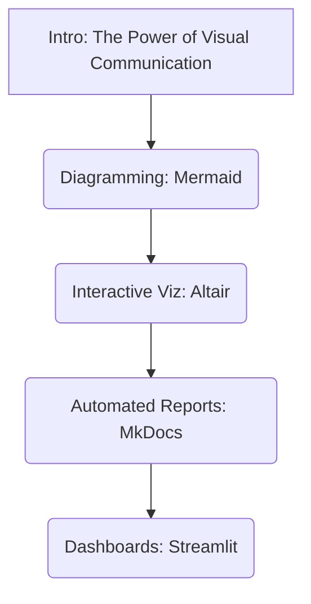
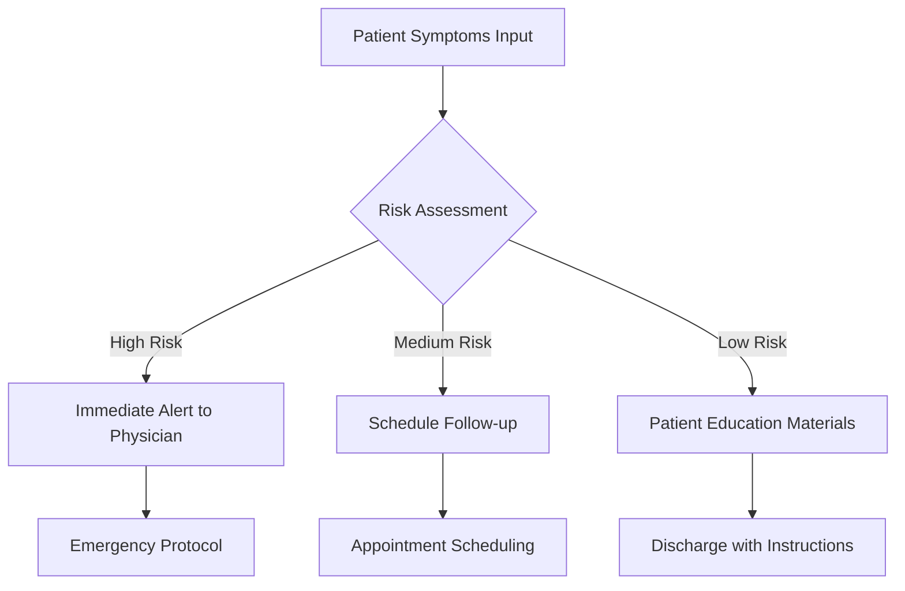
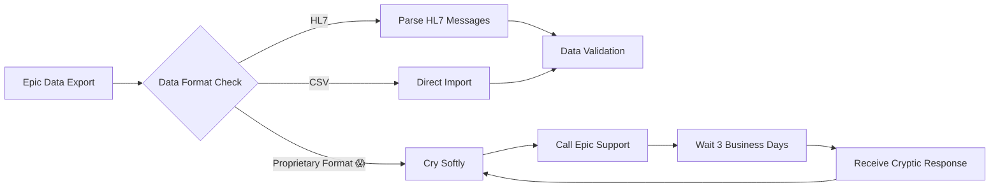
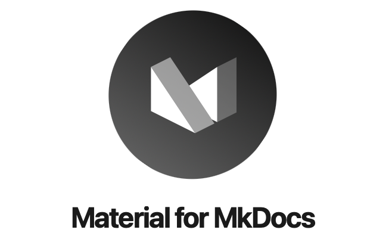
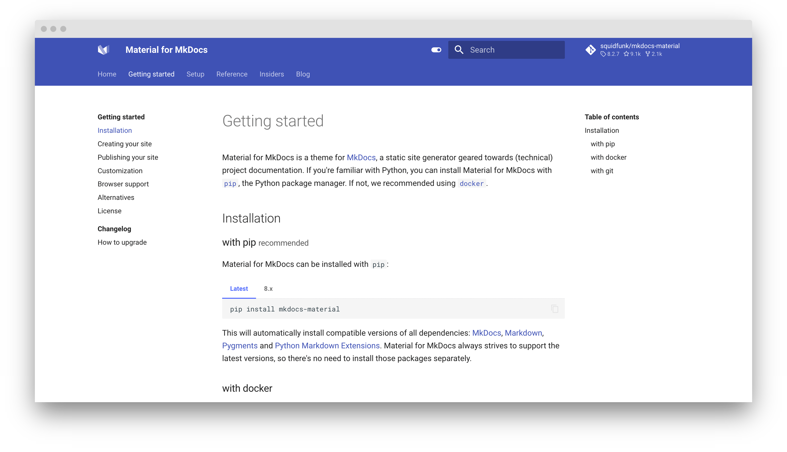
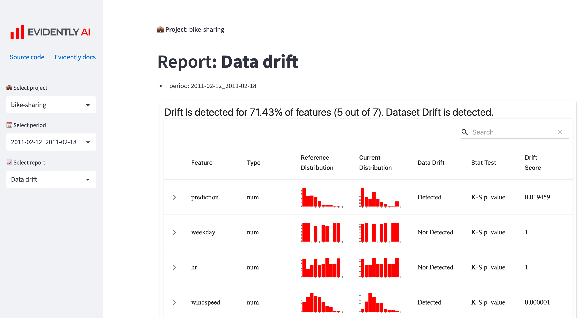

# Lecture 09: Data Visualization, Diagramming, Reporting & Dashboards

**Overall Goal:** Equip students with skills to create insightful diagrams (Mermaid), interactive data visualizations (Altair), automated shareable reports (MkDocs), and simple interactive dashboards (Streamlit), applied to health data contexts, culminating in engaging data storytelling examples.

**Target Audience:** Health data science master's students (beginners in programming).
**Lecture Duration:** 90 minutes.
**Format:** Long-form Markdown.

---

## 0. Introduction (5 minutes)

### The Data Communication Crisis in Healthcare

Picture this: You've just completed a groundbreaking analysis showing that a simple intervention could reduce hospital readmissions by 23%. You present a dense Excel table with 47 rows of statistics to the hospital board. Eyes glaze over. Your brilliant insight dies in a spreadsheet graveyard. 💀

Now imagine instead: An interactive dashboard where board members can explore the data themselves, see the intervention's impact across different patient populations, and watch the cost savings accumulate in real-time. Which presentation gets funding? 🎯


<!---
This scenario illustrates the critical gap between having insights and communicating them effectively. In healthcare, poor data communication can literally be a matter of life and death - or at least budget approval and implementation. The tools we'll learn today bridge this gap between analysis and action.
--->

**Lecture Objectives:**

* Create diagrams as code using Mermaid for clear process documentation.
* Craft interactive visualizations with Altair, including building towards a Gapminder-style dynamic chart.
* Build automated, shareable reports using MkDocs for disseminating findings.
* Develop simple, practical dashboards and then a more dynamic one with Streamlit for data exploration.
* Apply these tools to health data scenarios, focusing on principles of effective communication.

**Agenda Overview:**



<!---
*   This lecture builds upon previous sessions on data analysis and machine learning, focusing on how to make the results of such work understandable and impactful.
*   The core theme is moving from raw data and complex analyses to clear narratives and interactive explorations.
*   Effective communication can significantly amplify the value of data science work.
--->

---

## 1. Diagramming as Code with Mermaid (15 minutes)

Visualizing processes, architectures, and workflows is essential for understanding and communicating complex systems, especially in data science. While many tools exist for creating diagrams, the "diagrams as code" approach offers unique advantages for technical projects.

### 1.1. Why "Diagrams as Code"?

* **Concept:** Treating diagrams as source code offers several advantages. These diagrams are defined using text, making them version-controllable with tools like Git, inherently reproducible, and easier to update systematically.
    <!---
    *   Instead of using a graphical user interface (GUI) to draw shapes and connectors, you write text-based definitions that a tool then renders into a visual diagram.
    *   This is analogous to writing code for software rather than using a WYSIWYG website builder for all web development tasks.
    --->
* **Benefits:** This approach promotes:
    * **Consistency:** Diagrams maintain a uniform style, especially across a team or project.
    * **Version Control:** Changes to diagrams can be tracked, diffed, and reverted using Git, just like any other code. This is invaluable for collaborative projects and understanding the evolution of a design.
        
    * **Reproducibility:** Anyone with the text definition can regenerate the exact same diagram.
    * **Easy Integration:** Text-based diagrams can be easily embedded into documentation (like MkDocs sites, which we'll cover later), README files, or even code comments.
    * **Collaboration:** Team members can collaborate on diagrams using familiar code review workflows.
    * **Accessibility:** Text-based definitions can be more accessible to individuals using screen readers than complex image files, although the rendered output's accessibility also matters.
    <!---
    *   Reproducibility ensures that the diagram accurately reflects the documented system at any point in time.
    *   Ease of integration means diagrams live alongside the documentation or code they describe, reducing the chance of them becoming outdated or lost.
    --->
* **Contrast with GUI Tools:** GUI-based diagramming tools (e.g., Microsoft Visio, Lucidchart, draw.io) offer a visual interface for drawing. While often user-friendly for initial creation, they can be challenging for:
    * **Versioning:** Tracking precise changes can be difficult.
    * **Reproducibility:** Ensuring identical regeneration by different users or on different systems can be tricky.
    * **Programmatic Updates:** Making systematic changes across many diagrams is often manual.
    * **Integration with Code/Docs:** Often involves exporting static images, which can become outdated.
    <!---
    *   GUI tools excel at free-form drawing and quick mockups.
    *   "Diagrams as code" tools shine when diagrams need to be maintained, versioned, and integrated with technical documentation over time.
    --->

### 1.2. Introduction to Mermaid

Mermaid is a popular JavaScript-based tool that takes Markdown-inspired text definitions and renders them as diagrams. It's designed to be simple to learn yet powerful enough for a variety of diagramming needs.

* **What is Mermaid?** Mermaid is a JavaScript-based diagramming and charting tool that uses Markdown-inspired text definitions to dynamically create and modify diagrams. You write text, Mermaid draws the picture.
    <!---
    *   The "Markdown-inspired" part means its syntax is generally human-readable and relatively simple, much like Markdown for text formatting.
    --->
* **Common Diagram Types:** It supports various diagram types, including:
    * **Flowcharts:** For visualizing processes, workflows, and decision trees. (e.g., `graph TD; A-->B;`)
        
    * **Sequence Diagrams:** For showing interactions between different components or actors over time. (e.g., `sequenceDiagram; Alice->>John: Hello John;`)
        
    * **Gantt Charts:** For project scheduling and tracking task timelines.
    * **Class Diagrams:** For visualizing object-oriented software structures.
    * **Entity Relationship Diagrams (ERDs):** For database schema design.
    * And more (User Journey, Pie Chart, Requirement Diagram, etc.).
    <!---
    *   Flowcharts and sequence diagrams are particularly useful in data science for documenting data pipelines, model workflows, or system interactions.
    --->
* **Tools for Mermaid:**
    * **Online Editor:** The [Mermaid Live Editor](https://mermaid.live) is an excellent resource for quickly writing, previewing, and sharing Mermaid diagrams.
    * **VS Code Extensions:** Many extensions provide live preview capabilities for Mermaid diagrams within Markdown files (e.g., "Markdown Preview Mermaid Support," "Mermaid Markdown Syntax Highlighting").
    * **MkDocs Integration:** Many MkDocs themes (like Material for MkDocs) have built-in support for Mermaid, or it can be added via plugins. We'll see this later.
    * **Other Platforms:** GitHub, GitLab, and some other platforms also render Mermaid diagrams directly in Markdown files.
    <!---
    *   The Mermaid Live Editor (mermaid.live) is a convenient online resource for quickly drafting and testing Mermaid diagrams.
    *   Native rendering support in platforms like GitHub and GitLab makes it easy to include diagrams directly in project READMEs or wikis.
    --->

### 1.3. Basic Mermaid Syntax & Examples

Let's focus on flowcharts, as they are broadly applicable.

#### Flowcharts

Flowcharts are used to represent a process, workflow, or algorithm, showing steps as boxes of various kinds, and their order by connecting them with arrows.

* **Concept:** Visualizing processes, step-by-step logic, and decision points.
* **Reference Card: Mermaid Flowchart**
    * **Declaration:** Start with `graph TD;` (for Top-Down) or `graph LR;` (for Left-Right). Other orientations like `BT` (Bottom-Top) and `RL` (Right-Left) also exist.
        <!---
        *   `TD` or `TB` for Top to Bottom.
        *   `LR` for Left to Right.
        --->
    * **Nodes (Shapes):**
        * `id[Text]`  Default rectangle: `A[Hard edge]`
        * `id(Text)`  Rounded rectangle: `B(Round edge)`
        * `id((Text))` Circle: `C((Circle))`
        * `id{Text}`  Diamond (for decisions): `D{Decision?}`
        * `id>Text]`  Asymmetric/Stadium: `E>Stadium]`
        * Many other shapes are available (parallelogram, trapezoid, etc.).
        <!---
        *   The `id` is a unique identifier for the node, used for linking. The `Text` is what's displayed.
        *   Choosing the right shape can help convey the meaning of a step (e.g., diamond for decisions).
        --->
    * **Links (Connections):**
        * `A --> B` (Arrow link from A to B)
        * `A --- B` (Line link from A to B)
        * `A -- Text --> B` (Arrow link with text on the arrow)
        * `A -.-> B` (Dotted arrow link)
        * `A == Text ==> B` (Thick arrow link with text)
        <!---
        *   Links define the flow and relationships between steps.
        *   Text on links can clarify conditions or actions.
        --->
* **Minimal Example (Health Data Analysis Pipeline):**
    This diagram outlines a typical workflow for a health data analysis project.

    ```mermaid
    graph TD;
        A[Load PhysioNet Data] --> B(Data Cleaning & Preprocessing);
        B --> C{Select Analysis Type};
        C -- Descriptive Stats --> D[Generate Summary Tables];
        C -- Predictive Model --> E[Train & Evaluate Model];
        D --> F[Visualize Key Metrics];
        E --> F;
        F --> G[Compile Report/Dashboard];
    ```
    <!---
    *   `A[Load PhysioNet Data]`: Represents the initial step of data ingestion.
    *   `B(Data Cleaning & Preprocessing)`: A process step with rounded edges.
    *   `C{Select Analysis Type}`: A decision point, indicated by the diamond shape.
    *   The arrows (`-->`) show the direction of flow.
    * Text on arrows (`-- Descriptive Stats -->`) clarifies the path taken from a decision.
    --->

#### More Health Workflow Examples

**Clinical Decision Support System:**



**Epic Integration Workflow (because we've all been there):**



<!---
The Epic workflow diagram adds humor while addressing a real pain point many health data scientists face. It's both educational and cathartic, helping students realize they're not alone in dealing with complex healthcare IT systems.
--->

### Demo 1: Mermaid Flowchart

* (Refer to [`lectures/09/demo/01_mermaid_flowchart.md`](lectures/09/demo/01_mermaid_flowchart.md))
    <!---
    *   The first demo will provide hands-on practice with creating a simple flowchart.
    *   Students will apply the syntax learned to visualize a familiar process.
    --->

---

## 2. Interactive Data Visualization with Altair (25 minutes)

While static charts are useful, interactive visualizations empower users to explore data more deeply, uncover patterns, and gain personalized insights. Altair is a Python library that excels at creating a wide range of interactive statistical visualizations with a concise and intuitive syntax.

### 2.1. Beyond Static: The Power of Interaction

* **Why Interactive?** Interactive visualizations allow users to explore data dynamically through features like tooltips, zooming, panning, and selections. This enhances engagement, facilitates the understanding of complex datasets, and enables users to ask their own questions of the data.
    <!---
    *   Interactivity transforms the audience from passive viewers into active data explorers.
    *   For example, hovering over a data point to see detailed information (tooltip), or selecting a subset of data to see it highlighted in other linked charts.
    --->
    

### 2.2. Introduction to Altair

* **What is Altair?** Altair is a declarative statistical visualization library for Python, built on top of Vega-Lite. "Declarative" means you specify *what* you want to visualize (the mapping from data to visual properties), rather than detailing *how* to draw it step-by-step (imperative).
    <!---
    *   Vega-Lite is a high-level visualization grammar, and Altair provides a Python API to generate Vega-Lite JSON specifications. These JSON specs are then rendered by JavaScript libraries in environments like Jupyter notebooks, web browsers, or MkDocs sites.
    --->
* **Key Principles (Grammar of Graphics):** Altair follows the Grammar of Graphics, a formal system for describing statistical graphics. Visualizations are built by mapping data columns to visual properties (encodings) of geometric shapes (marks). The core components are:
    * **Data:** The dataset, typically a Pandas DataFrame. Altair works best with data in a "tidy" long-form format.
    * **Mark:** The geometric object representing data (e.g., `mark_point()`, `mark_bar()`, `mark_line()`, `mark_area()`, `mark_rect()`).
    * **Encoding:** The mapping of data fields (columns) to visual channels like:
        * `x`: x-axis position
        * `y`: y-axis position
        * `color`: mark color
        * `size`: mark size
        * `shape`: mark shape
        * `opacity`: mark transparency
        * `tooltip`: information to show on hover
    <!---
    *   The Grammar of Graphics provides a structured way to think about and construct visualizations, promoting consistency and expressiveness.
    *   Tidy data means each variable forms a column, each observation forms a row, and each type of observational unit forms a table.
    --->
* **Benefits:** This approach leads to:
    * **Concise Code:** Complex charts can often be expressed in just a few lines of Python.
    * **Aesthetically Pleasing Defaults:** Altair charts generally look good out-of-the-box.
    * **Powerful Interactivity:** Built-in support for selections, tooltips, panning, and zooming.
* **Comparison (Briefly):**
    * `plotnine` is another Python library based on the Grammar of Graphics (an implementation of R's `ggplot2`). It shares the declarative philosophy with Altair.
    * Both Altair and `plotnine` contrast with the more imperative (step-by-step drawing commands) approach of basic `matplotlib`. While `matplotlib` is highly flexible and powerful, creating complex, publication-quality charts can require more verbose code.
    <!---
    *   The choice between Altair and plotnine can depend on familiarity with ggplot2 syntax (for plotnine users) or preference for Vega-Lite's interactivity and web-native output (for Altair users).
    --->

### 2.3. Basic Altair: Building Blocks

Let's look at the fundamental components for creating an Altair chart.

* **Reference Card: `altair.Chart`**
    * **Core Object:** `alt.Chart(data)`: This is the starting point. You pass your Pandas DataFrame to it.
        <!---
        *   `alt` is the conventional alias for `import altair as alt`.
        --->
    * **Mark Type:** `.mark_type()`: Specifies the geometric shape. Examples:
        * `mark_point()`: For scatter plots.
        * `mark_bar()`: For bar charts.
        * `mark_line()`: For line charts.
        * `mark_area()`: For area charts.
        * `mark_rect()`: For heatmaps.
    * **Encodings:** `.encode(...)`: This is where you map data columns to visual properties.
        * Syntax: `channel='column_name:type_shorthand'`
        * **Type Shorthands:**
            * `:Q` - Quantitative (continuous numerical data)
            * `:N` - Nominal (discrete, unordered categorical data)
            * `:O` - Ordinal (discrete, ordered categorical data)
            * `:T` - Temporal (date/time data)
        * Example: `alt.X('age:Q')`, `alt.Y('systolic_bp:Q')`, `alt.Color('gender:N')`
        <!---
        *   Specifying the correct data type is crucial for Altair to apply appropriate scales, axes, and legends.
        --->
    * **Properties:** `.properties(...)`: To set overall chart attributes.
        * `width=W` (integer, pixels)
        * `height=H` (integer, pixels)
        * `title='My Chart Title'`
    * **Interactivity:** `.interactive()`: A convenient shortcut to enable basic panning and zooming.
    * **Saving Charts:** `.save('filename.ext')`
        * `'chart.html'`: Saves as a self-contained HTML file.
        * `'chart.json'`: Saves the Vega-Lite JSON specification. This is very useful for embedding in web pages or using with tools like MkDocs and Streamlit.
        * `'chart.png'` or `'chart.svg'`: Saves as a static image. Requires the `vl-convert` package (`pip install vl-convert-python`).
        <!---
        *   `altair_viewer` is another package that can help display charts during development, especially outside of Jupyter environments.
        --->
* **Minimal Example (Scatter Plot from PhysioNet data snippet):**
    Let's assume we have a Pandas DataFrame `physio_df` from a PhysioNet source with columns like `age`, `heart_rate`, and `patient_id`.

    ```python
    import altair as alt
    import pandas as pd

    # Example: Create a placeholder DataFrame if physio_df is not loaded
    # This is just for demonstration if you run this code block standalone.
    # In a real scenario, physio_df would be loaded from a CSV or other source.
    if 'physio_df' not in locals():
        physio_df = pd.DataFrame({
           'age': [65, 70, 55, 80, 62, 75, 58, 72], 
           'heart_rate': [75, 88, 60, 92, 70, 85, 65, 90], 
           'patient_id': ['P001', 'P002', 'P003', 'P004', 'P005', 'P006', 'P007', 'P008'],
           'gender': ['Male', 'Female', 'Male', 'Female', 'Female', 'Male', 'Male', 'Female']
        })
    
    scatter_plot = alt.Chart(physio_df).mark_point(size=100).encode(
        x='age:Q',  # Age on x-axis, quantitative
        y='heart_rate:Q',  # Heart rate on y-axis, quantitative
        color='gender:N', # Color points by gender (nominal)
        tooltip=['patient_id:N', 'age:Q', 'heart_rate:Q', 'gender:N'] # Info on hover
    ).properties(
        title='Age vs. Heart Rate by Gender'
    ).interactive() # Enable pan and zoom

    # To display in a Jupyter Notebook, this is often enough:
    # scatter_plot 
    
    # To save (uncomment the one you need):
    # scatter_plot.save('age_vs_hr_scatter.html')
    # scatter_plot.save('age_vs_hr_scatter.json') 
    # scatter_plot.save('age_vs_hr_scatter.png') # Requires vl-convert
    ```

    

*   **Generated JSON Specification:**
    When you save this chart as JSON (`scatter_plot.save('chart.json')`), Altair generates a Vega-Lite specification like this:
    ```json
    {
      "$schema": "https://vega.github.io/schema/vega-lite/v5.20.1.json",
      "data": {
        "name": "data-cc85da6ba14ea85607962b8b20b8f7ab"
      },
      "mark": {
        "type": "point",
        "size": 100
      },
      "encoding": {
        "x": {"field": "age", "type": "quantitative"},
        "y": {"field": "heart_rate", "type": "quantitative"},
        "color": {"field": "gender", "type": "nominal"},
        "tooltip": [
          {"field": "patient_id", "type": "nominal"},
          {"field": "age", "type": "quantitative"},
          {"field": "heart_rate", "type": "quantitative"},
          {"field": "gender", "type": "nominal"}
        ]
      },
      "title": "Age vs. Heart Rate by Gender",
      "params": [
        {
          "name": "param_1",
          "select": {"type": "interval", "encodings": ["x", "y"]},
          "bind": "scales"
        }
      ],
      "datasets": {
        "data-cc85da6ba14ea85607962b8b20b8f7ab": [
          {"age": 65, "heart_rate": 75, "patient_id": "P001", "gender": "Male"},
          {"age": 70, "heart_rate": 88, "patient_id": "P002", "gender": "Female"}
        ]
      }
    }
    ```
    <!---
    *   This JSON specification is what gets embedded in MkDocs sites and Streamlit apps.
    *   Understanding this structure helps debug issues and customize charts beyond Python.
    *   The "params" section handles the interactivity from `.interactive()`.
    *   Notice how Altair separates the data into a "datasets" section and references it by name.
    --->

    <!---
    *   This example creates a scatter plot showing the relationship between age and heart rate, with points colored by gender.
    *   Tooltips allow users to see specific data values when they hover over a point.
    *   The `.interactive()` call enables basic zoom and pan functionality.
    --->

### 2.4. Building Blocks for Dynamic Charts (e.g., for Gapminder-style visualization)

To create more advanced interactive charts, like the Gapminder-style visualization we'll aim for in the Streamlit demo, we need a few more Altair concepts. This section focuses on the Altair techniques for creating components that can be assembled into such visualizations.

* **Selections:** Selections are the core of Altair's interactivity. They define how users can interact with the chart.
    * `alt.selection_interval()`: Allows selecting a rectangular region (brushing).
    * `alt.selection_point()`: Allows selecting single or multiple discrete points.
    * `alt.selection_single()`: Allows selecting a single discrete item, often used with `bind` for widgets.
* **Input Binding (for `selection_single`):** Connects a selection to an HTML input element.
    * `bind=alt.binding_range(min=V, max=V, step=V)`: Creates a slider.
    * `bind=alt.binding_select(options=[...])`: Creates a dropdown menu.
* **Conditional Encodings:** Change visual properties based on a selection.
    * `alt.condition(selection, value_if_selected, value_if_not_selected)`
    * Example: `color=alt.condition(my_selection, 'steelblue', 'lightgray')`
* **Transformations:** Modify the data before encoding.
    * `transform_filter(selection_or_expression)`: Filter data based on a selection or a Vega expression.
    * `transform_aggregate(...)`: Perform aggregations (e.g., mean, sum).
    * `transform_window(...)`: For window functions (e.g., rank, cumulative sum).
* **Layering & Concatenation:** Combine multiple chart specifications.
    * `chart1 + chart2`: Layer charts on top of each other (share axes).
    * `chart1 | chart2`: Place charts side-by-side (horizontal concatenation).
    * `chart1 & chart2`: Place charts one above the other (vertical concatenation).

* **Key Altair features for a Gapminder-style dynamic chart:**
    * **Data:** A DataFrame with columns for an X-variable (e.g., health expenditure, often log-scaled), a Y-variable (e.g., life expectancy), a size variable (e.g., population), a color variable (e.g., region/country group), and a time variable (e.g., year).
    * **Time Slider:** Use `alt.selection_single` with `bind=alt.binding_range` to create a slider for the `year` field.
    * **Filtering:** Use `transform_filter(year_slider_selection)` to filter the data displayed in the chart based on the year selected by the slider.
    * **Encodings:** Map the data columns to `x`, `y`, `size`, and `color` visual channels.
    * **Tooltips:** Provide rich information on hover.
    * **Scales:** May need to customize scales (e.g., `alt.Scale(type="log")` for the x-axis).

*   **Example Pattern for Dynamic Charts:**
    ```python
    # Basic pattern for time-based filtering
    year_slider = alt.selection_single(
        fields=['year'],
        bind=alt.binding_range(min=2000, max=2023, step=1)
    )
    
    chart = alt.Chart(data).mark_circle().encode(
        x='health_expenditure:Q',
        y='life_expectancy:Q',
        size='population:Q',
        color='region:N'
    ).add_params(year_slider).transform_filter(year_slider)
    ```

**Pro Tip for Health Data Scientists:** 🏥
When creating Gapminder-style visualizations with health data, consider these encoding strategies:
* **X-axis**: Health expenditure per capita (log scale) or healthcare access score
* **Y-axis**: Life expectancy or health outcome measure
* **Size**: Population or disease burden
* **Color**: Geographic region or income level
* **Animation**: Time progression showing policy impacts

<!---
This conceptual code outlines how to define an Altair chart with a time slider. The `selection_single` with `binding_range` creates the slider, and `transform_filter` dynamically updates the chart based on the slider's current year. The actual data loading and precise binding would be part of the demo implementation. This JSON specification can then be used by Streamlit to render the interactive chart.
--->

### Demo 2: Interactive Altair Chart

* (Refer to [`lectures/09/demo/02_altair_interactive_chart.md`](lectures/09/demo/02_altair_interactive_chart.md))
    <!---
    *   This demo will involve creating a simpler interactive chart, perhaps with a categorical filter or a brush selection, using a real PhysioNet dataset.
    *   It reinforces the concepts of selections and saving for embedding.
    --->

---

## 3. Automated Report Generation with MkDocs (20 minutes)

Once you have created insightful visualizations and diagrams, you need an effective way to share them along with your narrative and findings. MkDocs is a static site generator that allows you to create professional-looking project documentation and reports using Markdown.

### 3.1. Why Static Site Generators for Reports?

* **Concept & Benefits:** Static site generators (SSGs) like MkDocs take source files (e.g., Markdown text, images, chart specifications) and templates to produce a complete, self-contained HTML website. For data science reports, this offers:
    * **Shareability:** Simple HTML files are easy to host on a web server, GitHub Pages, or send as a zipped archive.
    * **Version Control:** The entire report source (Markdown, Python scripts for generating charts, configuration files) can be managed with Git.
    * **Reproducibility:** Reports can be consistently rebuilt from the source files at any time.
    * **Professional Appearance:** Themes (like Material for MkDocs) provide a polished look with minimal effort.
    * **Automation:** The process of generating charts and building the report can be scripted.
    <!---
    *   SSGs bridge the gap between writing analysis code and producing a presentable, shareable output.
    *   They are an excellent alternative to manually assembling reports in word processors or relying solely on Jupyter Notebooks for dissemination.
    --->
* **MkDocs:** MkDocs is known for its speed, simplicity, and focus on creating project documentation, which extends well to generating data analysis reports. It uses Markdown for content, making it easy to write.
    
    

### 3.2. Setting up MkDocs

* **Installation:** You'll need MkDocs itself, a theme (Material for MkDocs is highly recommended), and any plugins. For embedding Altair charts, we'll use `mkdocs-altair-plugin`.

    ```bash
    pip install mkdocs mkdocs-material mkdocs-altair-plugin pandas altair
    ```
    <!---
    *   `mkdocs`: The core static site generator.
    *   `mkdocs-material`: A popular and feature-rich theme for MkDocs.
    *   `mkdocs-altair-plugin`: Allows easy embedding of Altair charts.
    *   `pandas` and `altair`: Needed if your report generation process involves creating charts with Python.
    --->
* **Project Initialization:** To start a new MkDocs project:

    ```bash
    mkdocs new my_health_report
    cd my_health_report
    ```

    This creates a basic project structure:

    ```
    my_health_report/
    ├── mkdocs.yml    # The main configuration file
    └── docs/
        └── index.md  # The homepage for your report
    ```
    <!---
    *   The `mkdocs new` command sets up the essential files and directories.
    *   You'll primarily work within the `docs/` directory for content and edit `mkdocs.yml` for configuration.
    --->
* **Directory Structure (Recommended):** It's good practice to organize supporting files. For example, create a `docs/charts/` directory for Altair JSON specifications and `docs/media/` for images.

    ```
    my_health_report/
    ├── mkdocs.yml
    └── docs/
        ├── index.md
        ├── analysis_page.md
        ├── charts/
        │   └── my_altair_chart.json
        └── media/
            └── workflow_diagram.png 
    ```

### 3.3. Configuring `mkdocs.yml`

The `mkdocs.yml` file controls your site's settings, theme, navigation, and plugins.

* **Basic Configuration:**

    ```yaml
    site_name: My Health Data Report
    site_description: 'A report on health data analysis findings.'
    site_author: 'Your Name'

    theme:
      name: material  # Using the Material for MkDocs theme
      # Optional: add features, palette, logo, etc.
      # features:
      #   - navigation.tabs
      # palette:
      #   primary: 'indigo'
      #   accent: 'blue'
      # logo: media/logo.png 
    ```

    
* **Plugins:** Enable plugins, especially for Altair charts.

    ```yaml
    plugins:
      - search        # Built-in search plugin
      - charts        # For mkdocs-charts-plugin (or the specific name it uses, e.g., mkdocs_charts_plugin)
      # Ensure vega_lite_version is compatible if the plugin has such an option,
      # or that Altair output matches what the plugin expects.
      # Example options for mkdocs-charts-plugin (refer to its documentation):
      # charts:
      #   vega_lite_version: "5" # Or similar if supported
      #   use_data_path: true # If you want paths relative to markdown file
    ```
    <!---
    *   The `mkdocs-material` theme offers many customization options documented on its website.
    *   Ensure the `vega_lite_version` in the `altair` plugin matches the version Altair is using to avoid rendering issues.
    --->
* **Navigation (`nav`):** Defines the structure of your site's navigation menu.

    ```yaml
    nav:
      - 'Home': 'index.md'
      - 'Analysis Details':
        - 'Part 1: EDA': 'eda.md'
        - 'Part 2: Modeling': 'modeling.md'
      - 'Interactive Charts': 'interactive_charts.md'
      - 'About': 'about.md'
    ```
    <!---
    *   The `nav` section allows you to create a hierarchical menu for your report pages.
    --->

### 3.4. Creating Report Content & Embedding Charts/Diagrams

* **Markdown:** Write your report narrative, analysis, and findings in `.md` files within the `docs/` directory. Standard Markdown syntax applies.
* **Python Script for Charts:** It's good practice to have a separate Python script (e.g., in a `scripts/` directory at the project root, or directly in `docs/` if simple) that generates your Altair charts and saves them as JSON files into a designated folder, like `docs/charts/`.

    ```python
    # Example: scripts/generate_report_charts.py
    # import altair as alt
    # import pandas as pd
    # from pathlib import Path

    # # Assume physio_df is loaded or created
    # # ... (chart creation code from section 2.3) ...
    # # scatter_plot = alt.Chart(physio_df).mark_point()... 

    # output_dir = Path("../docs/charts") # Relative to script location if script is in scripts/
    # output_dir.mkdir(parents=True, exist_ok=True)
    # # scatter_plot.save(output_dir / "age_vs_hr_scatter.json")
    # print(f"Saved chart to {output_dir / 'age_vs_hr_scatter.json'}")
    ```
    <!---
    *   This script would be run manually or as part of an automated build process *before* running `mkdocs build`.
    --->
* **Embedding Altair Charts:** In your Markdown files, use the `mkdocs-charts-plugin` with vegalite code blocks:

    ```markdown
    Here is an interactive chart showing age vs. heart rate, referencing an external JSON schema:

    ```vegalite
    {
      "schema-url": "charts/age_vs_hr_scatter.json"
    }
    ```

    The chart shows a positive correlation...

    Alternatively, you can embed the full Vega-Lite JSON specification directly:

    ```vegalite
    {
      "$schema": "https://vega.github.io/schema/vega-lite/v5.json",
      "description": "A scatter plot of age vs. heart rate.",
      "data": {
        "name": "patient_data"
        // Data can be embedded here, or referenced via a URL:
        // "url": "charts/heart_rate_data.json"
        // "values": [ {"age": 65, "heart_rate": 75, ...}, ... ]
      },
      "mark": {"type": "point", "size": 100, "tooltip": true},
      "encoding": {
        "x": {"field": "age", "type": "quantitative", "title": "Age (Years)"},
        "y": {"field": "heart_rate", "type": "quantitative", "title": "Heart Rate (bpm)"},
        "color": {"field": "gender", "type": "nominal", "title": "Gender"}
      }
      // Example of providing data directly if not using an external file for this example:
      // "datasets": {
      //   "patient_data": [
      //      {"age": 65, "heart_rate": 75, "gender": "Male"},
      //      {"age": 70, "heart_rate": 88, "gender": "Female"}
      //    ]
      // }
    }
    ```
    ```
    <!---
    *   The `mkdocs-charts-plugin` renders `vegalite` fenced code blocks.
    *   You can embed the full JSON specification or use `schema-url` to point to an external `.json` file containing the Vega-Lite spec.
    *   If using `schema-url` or `data.url`, paths are typically relative to the `docs/` directory, unless configured otherwise in the plugin options.
    --->
* **Embedding Mermaid Diagrams:** If your MkDocs theme (like Material for MkDocs) supports it, you can embed Mermaid diagrams directly in your Markdown using standard Mermaid fenced code blocks:

    ```markdown
    This workflow was followed:

    ```mermaid
    graph TD;
        A[Data Collection] --> B(Processing);
        B --> C[Analysis];
        C --> D[Report Generation];
    ```
    <!---
    *   Material for MkDocs includes support for Mermaid out-of-the-box. For other themes, a plugin like `mkdocs-mermaid2-plugin` might be needed.
    --->

### 3.5. Building, Serving, and Deploying

* **Build:** To generate the static HTML site:

    ```bash
    mkdocs build
    ```

    This creates a `site/` directory containing all the HTML, CSS, and JS files for your report.
* **Serve Locally:** To preview your report locally with live reloading as you make changes:

    ```bash
    mkdocs serve
    ```

    This usually starts a server at `http://127.0.0.1:8000`.
* **Deploying with GitHub Pages (Conceptual Overview):**
    GitHub Pages is a free way to host your static MkDocs site directly from a GitHub repository.
    1. Ensure your MkDocs project is a GitHub repository.
    2. Install `ghp-deploy`: `pip install ghp-deploy`.
    3. Run: `mkdocs gh-deploy`. This command builds your site and pushes the `site/` contents to a special `gh-pages` branch on GitHub, which then serves the site.
    4. Alternatively, GitHub Actions can be configured to automate this deployment on every push to your main branch.
    <!---
    *   The `site/` directory is what gets deployed. It's entirely self-contained.
    *   `mkdocs gh-deploy` simplifies the deployment process to GitHub Pages significantly.
    --->

### Demo 3: Automated Report with MkDocs

*   **Location:** The full project for this demo is located in `lectures/09/demo/mkdocs_report_project/`.
*   **Instructions:** A detailed guide for setting up and running this demo, including explanations of the directory structure, `mkdocs.yml` configuration, chart generation script, GitHub Actions workflow, and report content, can be found in `lectures/09/demo/03_mkdocs_project_guide.md`. (This guide file will be created next, based on the old `03_mkdocs_automated_report.md`).
*   **Key Features:** This demo showcases a complete, self-contained MkDocs project that:
    *   Generates Altair charts via a Python script and saves them as JSON.
    *   Embeds these charts and Mermaid diagrams into Markdown pages using `mkdocs-charts-plugin`.
    *   Uses a professional theme (Material for MkDocs) with various features.
    *   Includes a GitHub Actions workflow for automated deployment to GitHub Pages.
    <!---
    *   This demo provides a comprehensive example of building and deploying an automated data science report. Students will explore the project structure and run the build process.
    --->

---

## 4. Interactive Dashboards with Streamlit (25 minutes)

While MkDocs is excellent for creating static reports with embedded interactive charts, sometimes you need a more dynamic application where users can manipulate inputs, trigger computations, and see results update live. Streamlit is a Python library designed for rapidly building and sharing such data applications.

### 4.1. From Reports to Interactive Applications

* **What is Streamlit?** Streamlit is an open-source Python library that makes it easy to create and share beautiful, custom web apps for machine learning and data science. Think of it as "PowerPoint for data scientists" - but instead of static slides, you create interactive applications that let users explore your analysis in real-time.
    <!---
    *   Streamlit allows you to build interactive UIs directly from your Python scripts with minimal overhead. The "PowerPoint for data scientists" analogy helps students understand that it's about presentation and interaction, not just analysis.
    --->
* **Why Streamlit?**
    * **Rapid Prototyping:** Go from Python script to interactive web app in minutes.
    * **Python-centric:** Write apps using only Python; no HTML, CSS, or JavaScript knowledge is required for basic apps.
    * **Interactive Widgets:** Comes with a rich set of input widgets (sliders, dropdowns, text inputs, etc.) that are easy to implement.
    * **Easy to Share:** Streamlit Community Cloud offers free deployment for public apps.
    <!---
    *   Streamlit is particularly useful when you want to provide a tool for others (even non-programmers) to explore data or model predictions by changing parameters.
    *   It bridges the gap between a data analysis script and a user-friendly web application.
    --->
    

### 4.2. Streamlit Fundamentals

* **Installation:**

    ```bash
    pip install streamlit altair pandas
    ```
    <!---
    *   `streamlit`: The core library.
    *   `altair`, `pandas`: Often used with Streamlit to create and display data/visualizations.
    --->
* **Running an App:**
    Save your Streamlit code as a Python file (e.g., `my_app.py`) and run it from your terminal:

    ```bash
    streamlit run my_app.py
    ```

    This will typically open the app in your default web browser.
* **Core Concepts:**
    * **Script Reruns:** Streamlit apps rerun your Python script from top to bottom whenever a user interacts with a widget or the app needs to update. This is a fundamental concept to grasp.
    * **Layout Commands:**
        * `st.title("My App Title")`
        * `st.header("Section Header")`
        * `st.subheader("Sub-Section")`
        * `st.write("Some text or a Python variable.")`
        * `st.markdown("Supports **Markdown** formatting.")`
        * `st.sidebar`: Used to place elements in a sidebar (e.g., `st.sidebar.header("Filters")`).
    * **Displaying Data:**
        * `st.dataframe(my_pandas_df)`: Displays a Pandas DataFrame as an interactive table.
        * `st.table(my_pandas_df)`: Displays a static table.
        * `st.metric(label="Metric Name", value=123, delta="-5%")`: Displays a single metric with an optional change indicator.
        * `st.json(my_dict_or_list)`: Displays JSON.
    * **Displaying Charts:**
        * `st.altair_chart(my_altair_chart_object, use_container_width=True)`
        * `st.pyplot(my_matplotlib_fig_object)`
        * `st.plotly_chart(my_plotly_fig_object)`
    * **Input Widgets:** These are functions that return the current value selected by the user.
        * `st.button("Click me")`: Returns `True` when clicked.
        * `selected_value = st.slider("Select a range", 0, 100, (25, 75))`: Returns a tuple for a range slider.
        * `option = st.selectbox("Choose an option", ('A', 'B', 'C'))`: Returns the selected option.
        * `options = st.multiselect("Choose multiple", ['X', 'Y', 'Z'])`: Returns a list of selected options.
        * `text = st.text_input("Enter text", "Default value")`
        * `date = st.date_input("Pick a date")`
    * **Caching:** Use `@st.cache_data` or `@st.cache_resource` decorators to cache the results of expensive functions (like data loading or model computation) to improve performance, as the script reruns frequently.
    <!---
    *   The simplicity of Streamlit's API allows for quick iteration.
    *   Understanding the rerun behavior is key to managing state and performance in more complex apps.
    *   Widgets are the primary way users interact with and control the app.
    --->
    

### 4.3. The "Netflix Effect" in Health Dashboards

Just as Netflix revolutionized how we consume entertainment by making it interactive and personalized, modern health dashboards are transforming how we consume data. Instead of passive reports, we now have:

* **Personalized views**: Filter by patient population, time period, or condition
* **Binge-worthy exploration**: One insight leads to another through interactive drilling
* **Recommendation engines**: "Patients similar to this one also had..."
* **Real-time updates**: Like Netflix's "continue watching," dashboards remember where you left off

<!---
This analogy helps students understand why interactivity matters in healthcare. Just as Netflix keeps viewers engaged through personalization and recommendations, interactive health dashboards keep clinicians and administrators engaged with data, leading to better insights and decisions.
--->

### 4.4. Demo 4: Combined Streamlit Dashboard (Simple Explorer & Advanced Gapminder)

*   **(Refer to [`lectures/09/demo/04_streamlit_combined_dashboard.md`](lectures/09/demo/04_streamlit_combined_dashboard.md))**
*   This combined demo walks through building two Streamlit applications:
    1.  **Part 1: Simple Clinical Data Explorer:**
        *   **Goal:** Demonstrate immediate utility with a common task using a synthetically generated PhysioNet-style dataset snippet.
        *   **Key features showcased:**
            *   Loading data (using [`@st.cache_data`](https://docs.streamlit.io/library/api-reference/performance/st.cache_data) for efficiency).
            *   Using [`st.sidebar`](https://docs.streamlit.io/library/api-reference/layout/st.sidebar) for filters (e.g., [`st.selectbox`](https://docs.streamlit.io/library/api-reference/widgets/st.selectbox), [`st.slider`](https://docs.streamlit.io/library/api-reference/widgets/st.slider), [`st.multiselect`](https://docs.streamlit.io/library/api-reference/widgets/st.multiselect)).
            *   Filtering a Pandas DataFrame based on widget selections.
            *   Displaying the filtered DataFrame ([`st.dataframe`](https://docs.streamlit.io/library/api-reference/data/st.dataframe)).
            *   Displaying a simple Altair chart based on the filtered data ([`st.altair_chart`](https://docs.streamlit.io/library/api-reference/charts/st.altair_chart)).
            *   Using [`st.metric`](https://docs.streamlit.io/library/api-reference/data/st.metric) to show key summary statistics.
    2.  **Part 2: Advanced Gapminder-Style Health & Wealth Dashboard:**
        *   **Goal:** Showcase more dynamic interactivity and data storytelling, building on Altair components with a richer, time-series dataset.
        *   **Key features showcased:**
            *   Using a more complex, synthetically generated Gapminder-style dataset with health and economic indicators over several years.
            *   Implementing a [`st.select_slider`](https://docs.streamlit.io/library/api-reference/widgets/st.select_slider) for "Year" selection.
            *   Dynamically filtering the DataFrame passed to an Altair chart based on the slider.
            *   An Altair chart with multiple encodings (X, Y, Size, Color) as discussed in section 2.4.
            *   An animation feature to cycle through years.
            *   Displaying interactive Altair charts using [`st.altair_chart`](https://docs.streamlit.io/library/api-reference/charts/st.altair_chart).
            *   Displaying summary metrics and regional breakdowns.
            *   Time series analysis charts for selected countries.
    <!---
    *   This combined demo first focuses on the fundamental Streamlit workflow (input widgets -> data manipulation -> output display) with a simple dataset.
    *   It then progresses to a more sophisticated example illustrating how Streamlit can host complex, interactive Altair visualizations and build feature-rich dashboards.
    --->

### 4.6. Sharing Streamlit Apps (Briefly)

* **Streamlit Community Cloud:** Streamlit offers a free platform called Streamlit Community Cloud for deploying and sharing public Streamlit apps directly from GitHub repositories.
    <!---
    *   This is the easiest way for students to share their projects.
    *   Requires pushing the app script and a `requirements.txt` file to GitHub.
    --->
* **Other Deployment Options (Conceptual Mention):** For private apps or more complex needs, Streamlit apps can also be deployed using Docker containers on various cloud platforms (AWS, GCP, Azure) or on-premise servers.
    <!---
    *   These options offer more control but involve more setup.
    --->

---
