# Lecture 10: Experimentation, Research Design, and Distributed Computing in Health Data Science 🧬⚗️

*"The best way to find out if you can trust somebody is to trust them... with your data pipeline."* - Ernest Hemingway (probably)

---

## Course Recap & Integration 🎯

Welcome to the grand finale! Over the past nine lectures, you've built an impressive toolkit for health data science. Think of it like assembling the Avengers of data analysis - each skill powerful on its own, but absolutely unstoppable when combined.

### Your DataSci-223 Journey 🗺️

**Lecture 1: Foundation** - Dev Environment Setup & Python Fundamentals
You learned to set up your data science lab with Jupyter, VSCode, and Git. Python fundamentals gave you the programming language of modern data science.

**Lecture 2: Big Data Processing** - Larger-than-Memory Data with Polars
When datasets grew too big for regular pandas, you discovered Polars. Efficient tabular data processing, chunking, and out-of-core operations became essential skills for handling massive health datasets.

**Lecture 3: Database Skills** - SQL for Data Analysis
You mastered database querying. Joins, aggregations, and health data queries taught you to extract insights from complex electronic health records and research databases.

**Lecture 4: Predictive Modeling** - Regression & Time-Series Forecasting
Supervised learning entered your toolkit. You learned to predict patient outcomes, model disease progression over time, and handle time-based data splits with ARIMA models and feature engineering.

**Lecture 5: Classification Methods** - Introduction to ML & Classification
You dove deeper into machine learning with classification models. Evaluation metrics, hyperparameter tuning, and model selection taught you to distinguish between different disease states and make accurate predictions.

**Lecture 6: Deep Learning** - Neural Network Foundations
PyTorch became your tool of choice for deep learning. Neural networks opened up new possibilities for modeling complex patterns in health data that traditional methods couldn't capture.

**Lecture 7: Language Processing** - LLMs & Transformers
Natural language processing and clinical text analysis joined your toolkit. You learned to extract insights from doctor's notes, research papers, and patient records using transformer models.

**Lecture 8: Computer Vision** - Medical Imaging Analysis
Medical imaging, segmentation, and computer vision techniques taught you to analyze medical images like X-rays, MRIs, and CT scans for automated diagnosis assistance.

**Lecture 9: Data Communication** - Visualization & Reporting
Altair, Dash, MkDocs, and reproducible reporting taught you to create interactive dashboards, automated reports, and compelling visualizations that turn complex analyses into actionable insights.

### Real-World Integration Stories: Where It All Comes Together 🌟

Now here's where the magic happens - these aren't separate skills, they're components of integrated health data science systems:

**🏥 AI-Powered Clinical Decision Support System**

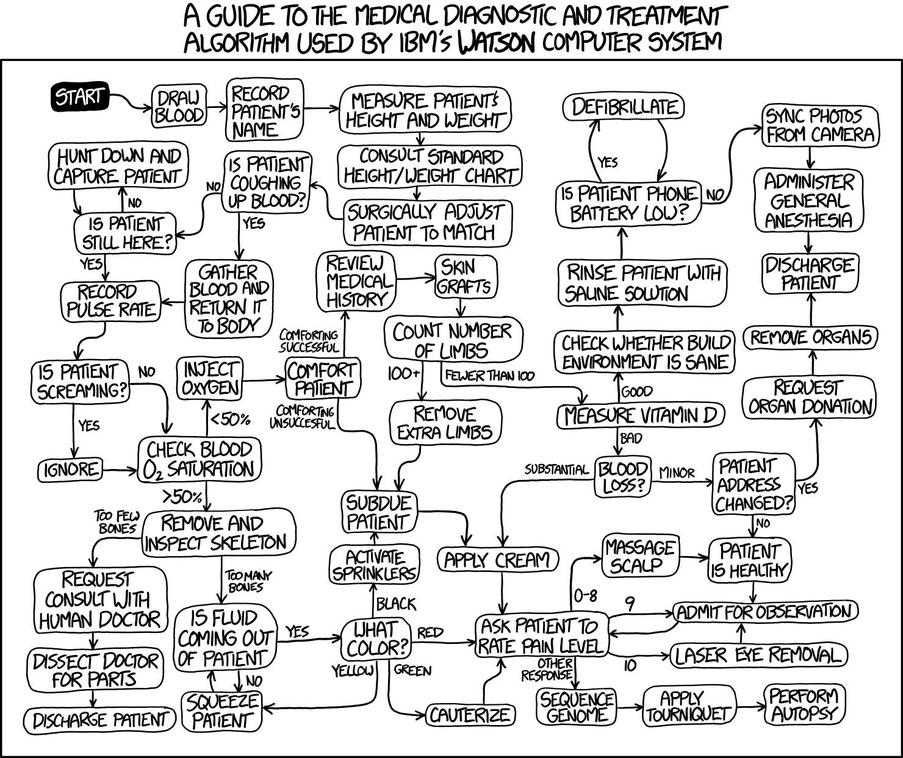

Picture this: A hospital implements a system that uses **SQL** to extract patient data from electronic health records, applies **deep learning** models to predict patient risk scores, presents results through interactive **Dash dashboards** for clinicians, and trains models using **distributed computing** on powerful clusters. Every component from our course working in harmony!

**🧬 Large-Scale Genomics Study**
Researchers analyzing genetic variants from 10,000+ patients use **distributed computing** for variant calling, apply **experimental design** principles for population stratification, create **visualization pipelines** for publication-ready figures, and generate **automated reports** that update as new data arrives. It's like having a research assistant that never sleeps!

**📊 Real-Time Pandemic Monitoring**
Public health officials track disease spread using **big data processing** of streaming health metrics, **computer vision** for symptom detection in public spaces, **live dashboards** for real-time decision making, and **version-controlled analysis pipelines** that ensure reproducible results. Think of it as the ultimate health monitoring system.

**💊 Personalized Medicine Pipeline**
A system that integrates **multi-modal data** (genomics + imaging + EHR records), uses **ensemble ML approaches** for treatment recommendations, implements **A/B testing** for treatment optimization, and includes **deployment monitoring** to ensure the system keeps working correctly. It's precision medicine at scale!

These stories show how every tool you've learned becomes part of a larger, more powerful system. Like the difference between knowing how to use a hammer versus building a house - the individual skills are important, but the integration is where the real magic happens.

## 0. Introduction & Review 🔄

### Purpose: Connecting the Dots 🔗

Today's lecture serves as both a capstone and a bridge. We're connecting all your previous skills to two critical areas that separate hobby data science from professional health research:

1. **Experimental Design** - How to design studies that actually answer the questions you're asking
2. **Distributed Computing** - How to scale your analyses beyond your laptop to handle real-world data volumes

Think of experimental design as your scientific GPS - it ensures you're asking the right questions and collecting the right data to answer them. Distributed computing, meanwhile, is like upgrading from a bicycle to a rocket ship for computational power.

### Review of Key Demos We'll Build Upon 📚

Before we dive into new territory, let's quickly review the tools that will power today's advanced workflows:

- **Mermaid Diagramming** - Remember those workflow visualizations? Today we'll use them to map out complex experimental designs and distributed computing architectures
- **Altair Interactive Visualizations** - Those interactive health data plots will help us explore experimental results and monitor distributed computing jobs
- **MkDocs Automated Reporting** - Perfect for documenting experimental protocols and computational workflows
- **Dash Interactive Dashboards** - Essential for monitoring long-running experiments and distributed computing cluster status

These aren't just "nice to have" anymore - they're essential components of professional research infrastructure.

### The Transition: From Analysis to Design

Up until now, you've been primarily analyzing existing data. Today, we move to designing the collection of new data and scaling those analyses to handle real-world data volumes.

We're shifting from "How do I analyze this dataset?" to "How do I design an experiment to generate the right dataset?" and "How do I analyze datasets too large for a single computer?"

This represents a significant step forward in your development as a health data scientist - from working with given data to designing studies that generate the data you need.

---

## 1. Distributed Computing & Scaling in Health Data Science 🚀💻

*"There are only two hard things in Computer Science: cache invalidation and naming things... and distributed systems."* - Phil Karlton (extended edition)

### 1.1. Why Distributed Computing? The Scale Problem 📊

Picture this: you're analyzing patient data on your laptop, everything's going smoothly, and suddenly your computer starts making noises like a jet engine preparing for takeoff. Your 16GB of RAM is crying uncle, and that "simple" analysis is going to take 47 hours. Welcome to the scale problem!

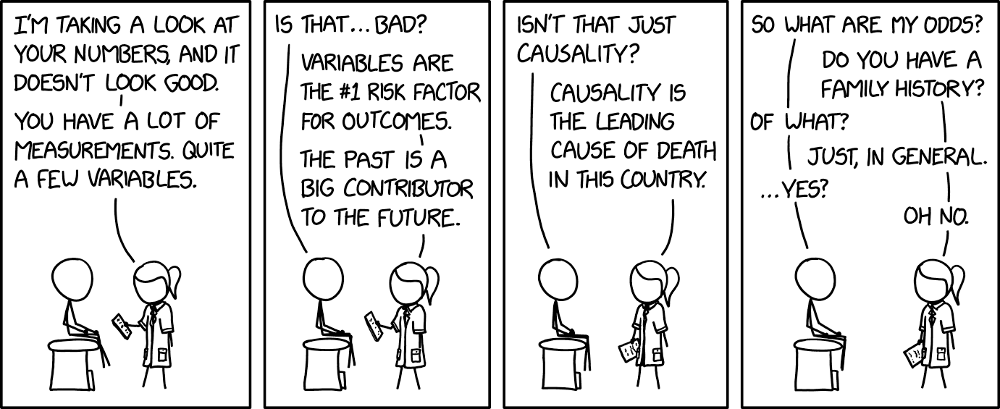

Health data is **BIG**. Not just Instagram-influencer-ego big, but legitimately massive:

#### Real-World Health Data Scales 🏥

- **🧬 Genomics:** UK Biobank has 500,000+ genomes totaling 100TB+ of data (that's like storing the entire Netflix catalog... twice)
- **📸 Medical Imaging:** RadImageNet contains 2M+ medical images (imagine scrolling through 2 million X-rays on your phone)
- **📋 Electronic Health Records:** Epic Cosmos has 180M+ patient records (more people than the entire population of Russia)
- **⌚ Wearable Data:** Apple Health Study tracks 400K+ participants with continuous streaming data (millions of heartbeats per second)

#### When Your Laptop Waves the White Flag 🏳️

Here are the telltale signs it's time to think bigger than your trusty laptop:

- **Memory Crisis:** Need > 32GB RAM (your laptop: "I can't even...")
- **Time Torture:** Analysis taking > 4 hours on single core (perfect time for a Lord of the Rings marathon)
- **Data Deluge:** Datasets > 100GB (when loading data takes longer than your coffee break)
- **Model Megalomania:** > 1B parameters (when your neural network is bigger than some countries' GDP)

**Common Beginner Mistake:** Thinking "I'll just wait for it to finish" when your analysis would take 3 days. Spoiler alert: your laptop will probably crash, and you'll lose everything. Been there, done that, learned the hard way! 😅

### 1.2. Core Concepts: The Parallel Universe 🌌

Before we dive into making computers work together like a well-oiled boy band, let's understand the fundamental concepts. Think of it like understanding the difference between a solo artist and a symphony orchestra.

#### 1.2.1. Threads vs. Processes: The Roommate Analogy 🏠

**Threads (Shared Memory):**

- Like roommates sharing an apartment and all the furniture
- **Perfect for:** I/O-bound tasks like downloading DICOM images
- **Health Example:** Downloading patient records from multiple hospital APIs simultaneously
- **Python Tools:** [`threading.Thread`](multiprocessing.py:1), [`concurrent.futures.ThreadPoolExecutor`](concurrent/futures.py:1)

**Processes (Isolated Memory):**

- Like separate apartments - each has its own everything
- **Perfect for:** CPU-intensive tasks like training neural networks
- **Health Example:** Running multiple CNNs on different medical image batches
- **Python Tools:** [`multiprocessing.Process`](multiprocessing.py:1), [`concurrent.futures.ProcessPoolExecutor`](concurrent/futures.py:1)

**Beginner Confusion Alert:** Many new programmers think threads are always faster. Not true! In Python, threads are great for waiting (I/O), but processes are better for thinking (CPU work) due to the infamous Global Interpreter Lock (GIL).

#### 1.2.2. Parallelism vs. Concurrency: The Kitchen Metaphor 👨‍🍳

**Parallelism (True Simultaneous):**

- 8 chefs working on 8 different dishes at the same time
- **Health Example:** 8 CPU cores analyzing 8 different patient records simultaneously
- **Result:** Actually faster because work happens at the same time

**Concurrency (Interleaved Tasks):**

- 1 chef switching between chopping vegetables and stirring soup
- **Health Example:** Single core downloading patient data while processing previous batch
- **Result:** More efficient use of waiting time, but not necessarily faster

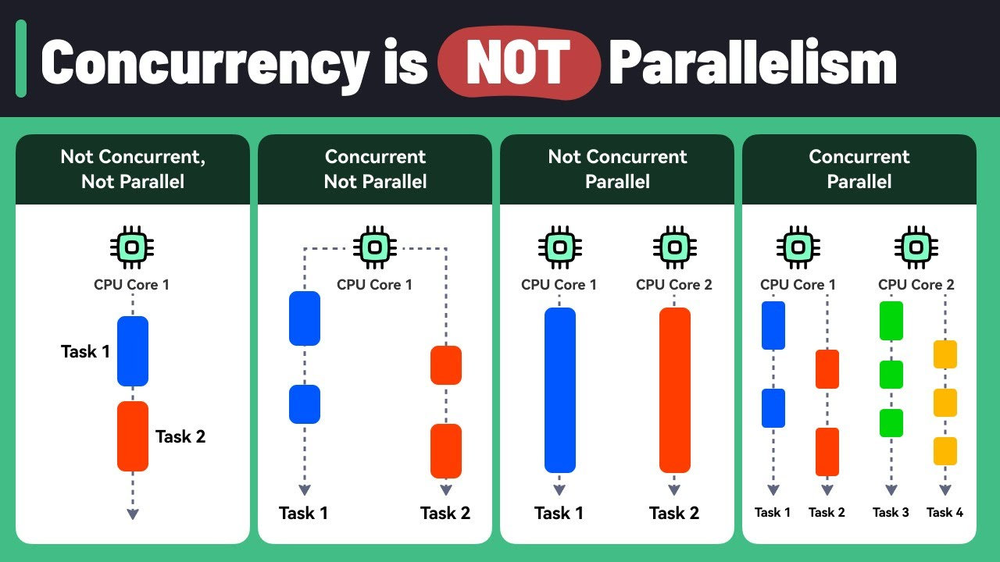

#### 1.2.3. CPU-bound vs. I/O-bound: Know Your Bottleneck 🔍

**CPU-bound Health Tasks (Need Process Power):**

- Deep learning model training
- Genomic sequence alignment
- Statistical model fitting on large datasets
- **Strategy:** More cores = better performance

**I/O-bound Health Tasks (Need Thread Efficiency):**

- Downloading medical images from hospital servers
- Querying multiple databases
- Reading large files from network storage
- **Strategy:** More concurrent connections = better throughput

### 1.3. Architectures & Scaling Patterns 🏗️

Think of this as evolving from a single-family home to a skyscraper. Each approach has its place!

#### 1.3.1. Single-Machine Scaling: Maximizing Your Desktop 💪

**Multi-threading Approach:**

- **Best for:** Concurrent downloads, database queries
- **Health Use Case:** Downloading 1000 DICOM images simultaneously
- **Limitation:** Python's GIL means threads can't truly parallelize CPU work
- **Tools:** [`threading`](threading.py:1), [`asyncio`](asyncio.py:1)

**Multi-processing Approach:**

- **Best for:** Parallel computation, model training
- **Health Use Case:** Training multiple models on different patient cohorts
- **Resource Planning:** Use 1-2 processes per CPU core for compute tasks
- **Tools:** [`multiprocessing`](multiprocessing.py:1), [`joblib`](joblib.py:1)

#### 1.3.2. Cluster Computing: When One Computer Isn't Enough 🤝

**Traditional HPC (High-Performance Computing):**

- **Health Use:** Large-scale genomics pipelines, climate health modeling
- **Characteristics:** Tight coupling, specialized hardware, very fast networking
- **Example:** Analyzing whole genome sequences across thousands of samples

**Grid Computing (SGE/SLURM):**

- **Health Use:** Embarrassingly parallel analyses (each task independent)
- **UCSF Example:** Wynton cluster with 4,000+ cores for health research
- **Perfect for:** Parameter sweeps, cross-validation, Monte Carlo simulations

**Modern Distributed (Kubernetes, Spark):**

- **Health Use:** Real-time monitoring, elastic ML pipelines
- **Benefits:** Auto-scaling (more patients = more compute), fault tolerance, cloud integration
- **Example:** COVID-19 tracking dashboard that scales with data volume

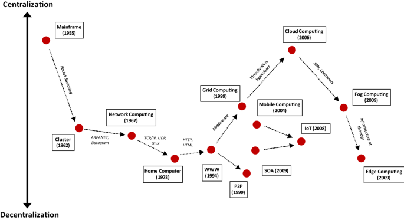

#### 1.3.3. Identifying Parallelizable Tasks: The Art of Finding Independence 🔍

Before jumping into distributed computing, you need to identify which tasks can actually benefit from parallelization. Think of it like figuring out which chores you can do simultaneously versus which must be done in sequence.

**Embarrassingly Parallel Tasks (Perfect Candidates):**

- **Definition:** Tasks where each unit of work is completely independent
- **Patient file analysis:** Each patient's record can be processed without knowing about others
- **Cross-validation folds:** Each fold trains/tests independently
- **Monte Carlo simulations:** Each simulation run is independent
- **Hyperparameter grid search:** Each parameter combination is tested independently
- **Image preprocessing:** Each medical image can be processed separately

**Algorithmic Characteristics that Enable Parallelization:**

- **No shared state:** Functions don't need to communicate during execution
- **Deterministic inputs:** Each task has well-defined, independent inputs
- **Atomic operations:** Each task is self-contained and produces complete output
- **No ordering requirements:** Results don't depend on execution order

**Tasks That DON'T Parallelize Well:**

- **Sequential algorithms:** Where step N depends on result from step N-1
- **Shared mutable state:** Multiple processes modifying the same data structure
- **Heavy communication:** Where processes need to talk to each other frequently
- **Small task overhead:** Where parallelization overhead exceeds computation time

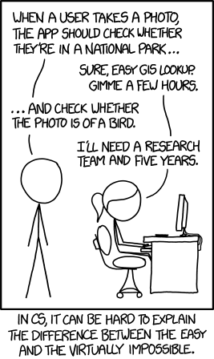

**Quick Parallelization Assessment:**

1. **Can I split my data into independent chunks?** ✅ Good candidate
2. **Does each chunk need results from other chunks?** ❌ Poor candidate
3. **Is each chunk's computation time >> setup time?** ✅ Good candidate
4. **Are there race conditions or shared variables?** ❌ Poor candidate

#### 1.3.4. Common Distributed Patterns 🎭

**Map-Reduce Pattern:**

- **Example:** Process 1M patient records, then aggregate population statistics
- **Map Step:** Extract risk factors from each patient record
- **Reduce Step:** Calculate population-level disease prevalence

**Orchestrator/Worker Pattern:**

- **Example:** Hyperparameter tuning for drug discovery models
- **Orchestrator:** Manages which parameter combinations to try next
- **Workers:** Train models with specific hyperparameters and report results

**Pipeline Pattern:**

- **Example:** Medical image analysis workflow
- **Stage 1:** DICOM preprocessing (anonymization, format conversion)
- **Stage 2:** Feature extraction (radiomics features, deep learning features)
- **Stage 3:** Classification (tumor detection, diagnosis prediction)

### 1.4. Python Tools & Libraries: Your Parallel Programming Toolkit 🧰

#### 1.4.1. Local Parallelism: Start Here 🏠

For beginners, start with local parallelism before jumping to distributed systems. It's like learning to drive before attempting Formula 1 racing!

**multiprocessing Module - The Workhorse:**

- **Best for:** CPU-intensive health data analysis
- **Key Feature:** Process pools for easy parallel execution
- **Health Example:** Parallel patient cohort analysis across multiple files

**concurrent.futures - The User-Friendly Option:**

- **ThreadPoolExecutor:** For I/O-bound tasks (downloading, database queries)
- **ProcessPoolExecutor:** For CPU-bound tasks (model training, analysis)
- **Health Example:** Concurrent medical database queries across hospitals

**joblib - The Scientist's Choice:**

- **Perfect for:** Scientific computing and sklearn integration
- **Memory Mapping:** Efficient sharing of large NumPy arrays between processes
- **Health Example:** Parallel cross-validation for medical prediction models

#### 1.4.2. Distributed Frameworks: When You Need More 🌐

**Dask - Pandas/NumPy but Bigger:**

- **Use Case:** Familiar APIs for larger-than-memory health datasets
- **Features:** Lazy evaluation, automatic task optimization
- **Health Example:** EHR analysis on 100GB+ datasets that don't fit in RAM

**Ray - The ML Powerhouse:**

- **Use Case:** Distributed machine learning and hyperparameter tuning
- **Features:** Actor model, distributed objects, auto-scaling
- **Health Example:** Distributed training of deep learning models for medical imaging

**Brief mention:** PySpark exists for big data ETL, but Dask is often more Pythonic for data science workflows.

#### 1.4.3. Reference Card: `multiprocessing.Pool`

**Function:** [`multiprocessing.Pool(processes=None)`](multiprocessing.py:1)
**Purpose:** Create a pool of worker processes for parallel execution of health data analysis tasks
**Key Parameters:**

- `processes`: (Optional, default=None) Number of worker processes. If None, uses number of CPU cores. For health data, often set to number of CPU cores or slightly less
- `initializer`: (Optional, default=None) Function to run when each worker starts. Useful for loading reference data like medical ontologies
- `initargs`: (Optional, default=()) Arguments for initializer function
- `maxtasksperchild`: (Optional, default=None) Maximum tasks per worker before restart. Helps prevent memory leaks in long-running health analyses

**Key Methods:**

- `map(func, iterable)`: Apply function to each item in parallel - perfect for processing patient files
- `starmap(func, iterable)`: Like map but unpacks arguments from tuples - useful when functions need multiple parameters
- `apply_async(func, args)`: Asynchronous function application for non-blocking execution
- `close()`: Prevent more tasks from being submitted to the pool
- `join()`: Wait for worker processes to exit before continuing

**Minimal Example:**

```python
import multiprocessing as mp
import pandas as pd

def analyze_patient_file(filename):
    """Process one patient file"""
    df = pd.read_csv(filename)
    return df['age'].mean()  # Calculate average age

# Process multiple files in parallel
patient_files = ['cohort_01.csv', 'cohort_02.csv', 'cohort_03.csv']

with mp.Pool(processes=4) as pool:
    results = pool.map(analyze_patient_file, patient_files)
    
print(f"Average ages: {results}")  # [65.2, 58.7, 71.3]
```

**Common Beginner Mistakes:**

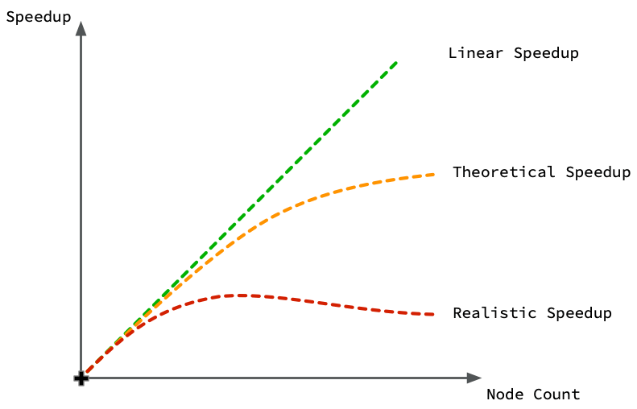

- **Forgetting `if __name__ == '__main__':`** on Windows - multiprocessing needs this guard
- **Not using context managers** (`with mp.Pool()`) - can lead to zombie processes
- **Assuming linear speedup** - overhead means 4 cores ≠ exactly 4x faster
- **Sharing large objects inefficiently** - pickle overhead can eliminate speed gains

### 1.5. UCSF Wynton & SLURM: Your Research Computing Resource 🖥️

Wynton is UCSF's high-performance computing cluster - think of it as having access to a massive computer lab with thousands of powerful computers, all connected and ready to work on your health data problems.

#### 1.5.1. Wynton Cluster Overview 🏢

**Hardware Specifications:**

- **CPU Cores:** 4,000+ cores across 200+ nodes (like having 4,000 laptops working together)
- **GPUs:** 88 high-end GPUs for deep learning (RTX, V100, H100 series)
- **Memory:** Nodes ranging from 64GB to 1.5TB RAM (some computers have more RAM than your entire hard drive!)
- **Storage:** 2PB shared storage (that's 2,000 TB - enough to store every movie ever made)

#### 1.5.2. SLURM: The Traffic Controller 🚦

SLURM (Simple Linux Utility for Resource Management) is like a smart traffic controller that decides which jobs run when and where. Instead of having chaos with everyone trying to use computers at once, SLURM coordinates everything fairly.

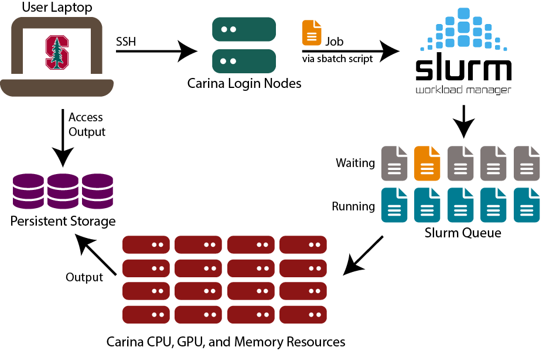

**Key SLURM Commands:**

- [`sbatch`](slurm.sh:1): Submit a job script (like "please run this analysis when you have time")
- [`squeue`](slurm.sh:1): Check job status (like "where is my job in line?")
- [`scancel`](slurm.sh:1): Cancel a job (like "never mind, I changed my mind")
- [`scontrol`](slurm.sh:1): Get detailed job information

#### 1.5.3. Reference Card: `#SBATCH` Directives

**Purpose:** SLURM job scripts use `#SBATCH` directives to specify resource requirements. These special comments tell SLURM what resources your job needs.

**Common #SBATCH Options:**

- `--job-name=name`: (Optional) Give your job a descriptive name for easy identification in queue
- `--partition=name`: (Optional, default=default) Which compute partition to use (cpu, gpu, bigmem)
- `--cpus-per-task=N`: (Optional, default=1) Number of CPU cores per task
- `--mem=SIZE`: (Optional, default=varies) Memory allocation (e.g., 16G, 64G, 1T)
- `--time=HH:MM:SS`: (Required) Maximum runtime before job is killed
- `--gres=gpu:N`: (Optional) Request N GPUs for deep learning tasks
- `--array=1-N`: (Optional) Submit N identical jobs with different array indices
- `--output=file`: (Optional) Redirect stdout to specified file

**Health Data Examples:**

```bash
# Basic CPU job for data analysis
#SBATCH --job-name=patient_analysis
#SBATCH --cpus-per-task=8
#SBATCH --mem=32G
#SBATCH --time=4:00:00

# GPU job for deep learning
#SBATCH --partition=gpu
#SBATCH --gres=gpu:1
#SBATCH --mem=64G
#SBATCH --time=24:00:00

# Array job for genomics
#SBATCH --array=1-1000
#SBATCH --cpus-per-task=4
#SBATCH --mem=16G
```

#### 1.5.4. Health Data Job Examples 📋

**Example 1: GPU Deep Learning Job**

```bash
#!/bin/bash
#SBATCH --job-name=medical_cnn
#SBATCH --partition=gpu --gres=gpu:1
#SBATCH --cpus-per-task=8 --mem=32G --time=12:00:00

python train_cnn.py --data chest_xrays/ --epochs 100
```

**Example 2: Array Job for Genomics**

```bash
#!/bin/bash
#SBATCH --job-name=variant_calling
#SBATCH --array=1-1000
#SBATCH --cpus-per-task=16 --mem=64G --time=24:00:00

SAMPLE_ID=$(sed -n ${SLURM_ARRAY_TASK_ID}p sample_list.txt)
gatk HaplotypeCaller -I ${SAMPLE_ID}.bam -O ${SAMPLE_ID}.vcf
```

#### 1.5.4. Resource Estimation Guidelines 📏

**Memory Requirements by Data Type:**

- **Tabular Health Data:** 2-4x dataset size in RAM (if your CSV is 10GB, request 20-40GB RAM)
- **Medical Images:** 16-32GB for CNN training, more for larger models
- **Genomics:** 32-128GB depending on reference genome and sample size
- **Time Series:** 4-8x dataset size for complex feature engineering

**Beginner Resource Estimation Rule:**
Start with modest requests, monitor actual usage, then adjust. It's better to request 16GB and use 12GB than request 128GB and use 16GB (you'll wait much longer in the queue!).

---

## 🛠️ Demo Break 1: Parallel Computing Practice

Practice parallel computing with patient data analysis, measure speedup, and create SLURM scripts.

**See demo details:** [`01-parallel_computing_practice.md`](demo/01-parallel_computing_practice.md)

---

## 2. Experimental Design & Analysis in Health Data Science 🧪📊

*"Correlation does not imply causation, but it does waggle its eyebrows suggestively and gesture furtively while mouthing 'look over there'."* - xkcd (probably)

### 2.1. Starting with Your Dataset: A Practical Approach 📋

The most common scenario: someone hands you a dataset and says "find something interesting." Rather than starting with abstract experimental design theory, let's start with the practical question: **Given this dataset, what questions can I actually answer?**

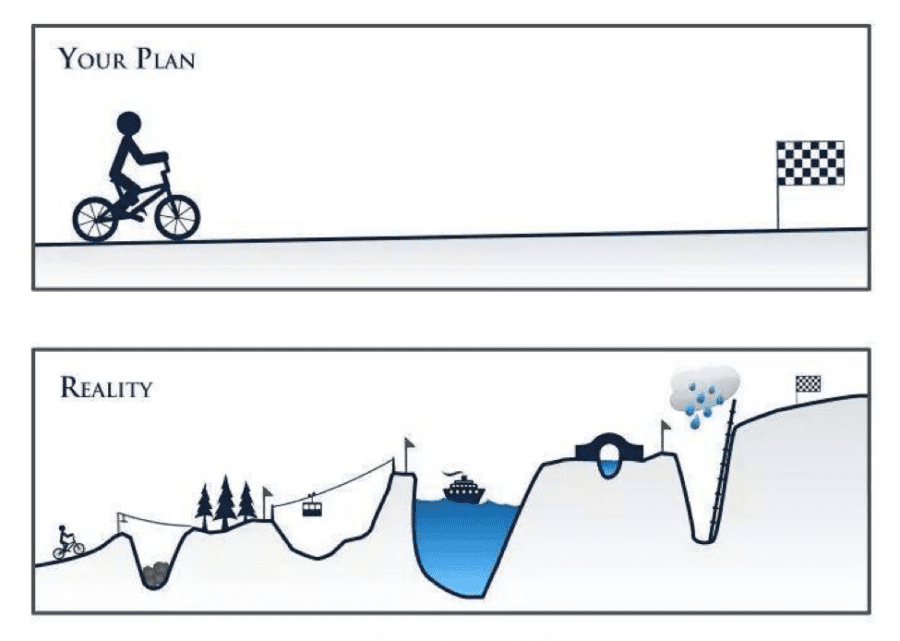

#### 2.1.1. Dataset-Driven Question Framework 🎯

**Step 1: What type of data do you have?**

- **Cross-sectional:** Snapshot at one time point → Can study associations, prevalence
- **Longitudinal:** Multiple time points → Can study changes, trends, some causation
- **Intervention data:** Before/after treatment → Can study treatment effects
- **Matched pairs:** Naturally paired observations → Can control for confounding

**Step 2: What's your outcome variable?**

- **Continuous (blood pressure, weight):** Use t-tests, regression, ANOVA
- **Binary (diseased/healthy, survived/died):** Use logistic regression, chi-square tests
- **Count (hospital visits, seizures):** Use Poisson regression
- **Time-to-event (time until diagnosis):** Use survival analysis

**Step 3: What questions CAN'T you answer?**

- **Causation from correlation-only data:** Just because A and B are related doesn't mean A causes B
- **Effects you didn't measure:** Can't study smoking effects if you didn't record smoking status
- **Generalization beyond your sample:** Results from hospital patients may not apply to general population

#### 2.1.2. Study Design Types 🏆

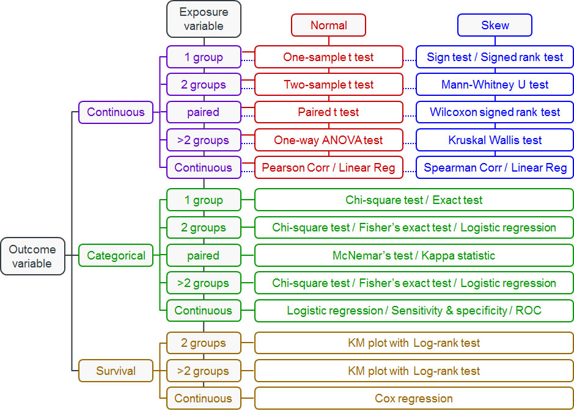

**Randomized Controlled Trials (RCTs):**

- **Best for:** Testing treatments, interventions
- **Why randomization works:** Eliminates selection bias, balances known/unknown confounders
- **Methods:** Simple (coin flip), block (balanced chunks), stratified (subgroup balance)

**Observational Studies:**

- **Cohort:** Follow people forward in time (e.g., Framingham Heart Study)
- **Case-Control:** Work backwards from disease to exposure
- **Cross-Sectional:** Snapshot at one time point
- **Use when:** RCTs impossible due to ethics, cost, or time

### 2.2. Statistical Methods & Python Tools 📈🐍

Now for the fun part - actually analyzing your carefully designed experiments! Think of statistics as your translator between "I collected some numbers" and "I can make evidence-based recommendations."

#### 2.2.1. Choosing Statistical Tests: Decision Trees for Data 🌳

The key question isn't "What's the most sophisticated test?" but rather "What test fits my data and question?" Use these flowcharts to guide your decisions:


#### 2.2.2. T-Tests: For Comparing Two Groups 💪

**When to Use T-Tests:**
Use when you have two groups and want to compare means of a normally distributed variable.

**Examples:**

- Compare blood pressure before/after medication
- Compare recovery times between treatment groups
- Test if biomarker levels differ from normal values
- Compare patient satisfaction scores

**Reference Card: `scipy.stats.ttest_ind`**

- **Function:** [`scipy.stats.ttest_ind(a, b, equal_var=True)`](scipy/stats.py:1)
- **Purpose:** Compare means between two independent groups (like treatment vs. control)
- **Key Parameters:**
    - `a, b`: (Required) Array-like sample data for the two groups being compared
    - `equal_var`: (Optional, default=True) Assumes equal variances in both groups. Set to False if variances are very different
    - `nan_policy`: (Optional, default='propagate') How to handle missing values. 'omit' removes NaN values before calculation
    - `alternative`: (Optional, default='two-sided') Test direction - 'two-sided', 'less', or 'greater'

**Minimal Example:**

```python
import scipy.stats as stats

# Blood pressure reduction study (mmHg)
treatment = [12, 15, 8, 14, 11, 16, 9, 13, 10, 17]  # New medication
control = [3, 5, 2, 6, 1, 4, 7, 2, 5, 3]            # Placebo

t_stat, p_val = stats.ttest_ind(treatment, control)
print(f"P-value: {p_val:.3f}, Significant: {p_val < 0.05}")
```

**Common Beginner Mistakes with T-Tests:**

- **Assuming normality without checking:** T-tests assume normal distributions. Use [`scipy.stats.shapiro`](scipy/stats.py:1) to test normality first
- **Ignoring unequal variances:** If one group has much more variability, set `equal_var=False`
- **Multiple comparisons:** Running many t-tests inflates Type I error rate (more on this below!)

#### 2.2.3. Chi-Square Tests: For Categorical Data 📊

**When to Use Chi-Square Tests:**
Use when you have categorical variables and want to test if they're independent.

**Examples:**

- Test if treatment response differs by gender
- Check if smoking status is related to lung cancer
- Analyze if hospital readmission varies by treatment type
- Compare infection rates across different wards

#### 2.2.4. ANOVA: For Comparing Multiple Groups 📈

**When to Use ANOVA:**
Use when you have more than two groups and want to compare means of a normally distributed variable.

**Examples:**

- Compare pain scores across three different medications
- Test if blood glucose varies by diet type (low-carb, Mediterranean, low-fat)
- Analyze if recovery time differs across multiple treatment protocols
- Compare cholesterol levels across age groups (20s, 30s, 40s, 50s+)

#### 2.2.5. Linear Regression: For Continuous Predictors and Outcomes 📉

**When to Use Linear Regression:**
Use when you want to predict a continuous outcome from one or more predictors.

**Examples:**

- Predict blood pressure from age, weight, and sodium intake
- Model relationship between exercise hours and weight loss
- Estimate hospital length of stay from admission severity scores
- Analyze how medication dose affects symptom improvement

#### 2.2.6. Non-Parametric Tests: When Normality Fails 🔄

**When to Use Non-Parametric Tests:**
Use when your data violates normality assumptions or you have ordinal data.

**Examples:**

- **Mann-Whitney U:** Compare pain scores (1-10 scale) between two treatments
- **Kruskal-Wallis:** Compare satisfaction ratings across multiple hospitals
- **Wilcoxon signed-rank:** Test before/after treatment when data is skewed
- **Spearman correlation:** Correlate ranked variables (disease severity vs. quality of life)

#### 2.2.7. Logistic Regression: For Binary Outcomes 🎯

**When to Use Logistic Regression:**
Use when your outcome is binary (yes/no, survived/died) and you have multiple predictors.

**Examples:**

- Predict diabetes risk from age, BMI, and family history
- Model probability of treatment success from patient characteristics
- Analyze factors affecting hospital readmission (yes/no)
- Estimate surgical complication risk from pre-operative variables

**Reference Card: `statsmodels.formula.api.logit`**

- **Function:** [`statsmodels.formula.api.logit(formula, data)`](statsmodels/formula/api.py:1)
- **Purpose:** Fit logistic regression for binary health outcomes (diseased/healthy, treatment success/failure)
- **Key Parameters:**
    - `formula`: (Required) R-style formula like 'disease ~ age + smoking + bmi'
    - `data`: (Required) DataFrame containing all variables in the formula
    - `family`: (Optional) Automatically set to binomial for logit, but can specify other GLM families

**Key Methods:**

- `.fit()`: Estimate model parameters using maximum likelihood
- `.summary()`: Display comprehensive results including coefficients, p-values, confidence intervals
- `.predict()`: Generate predicted probabilities for new observations

**Minimal Example:**

```python
import statsmodels.formula.api as smf
import pandas as pd

# Diabetes risk prediction data
data = pd.DataFrame({
    'diabetes': [1, 0, 1, 0, 1],
    'age': [65, 45, 70, 50, 60],
    'bmi': [32, 25, 35, 22, 30]
})

# Fit logistic regression
model = smf.logit('diabetes ~ age + bmi', data=data).fit()
print(f"Diabetes risk for 60yr, BMI=30: {model.predict(pd.DataFrame({'age': [60], 'bmi': [30]}))[0]:.3f}")
```

#### 2.2.8. Survival Analysis: For Time-to-Event Data ⏱️

**When to Use Survival Analysis:**
Use when your outcome is time until an event occurs (death, disease recurrence, recovery).

**Examples:**

- Time until cancer recurrence after treatment
- Days until hospital discharge
- Months until medication side effects appear
- Years until development of cardiovascular disease

#### 2.2.9. Correlation Tests: For Measuring Relationships 🔗

**When to Use Correlation Tests:**
Use when you want to measure how strongly two continuous variables are related.

**Examples:**

- **Pearson:** Correlation between height and weight (linear relationship)
- **Spearman:** Correlation between pain severity ranking and quality of life scores
- Relationship between medication dosage and symptom improvement
- Association between exercise frequency and blood pressure

#### 2.2.10. Paired T-Tests: For Before/After Comparisons 🔄

**When to Use Paired T-Tests:**
Use when you have the same subjects measured twice (before/after, left/right).

**Examples:**

- Blood pressure before and after medication in same patients
- Weight loss before and after diet intervention
- Cognitive scores pre- and post-surgery
- Pain levels before and after physical therapy

#### 2.2.11. Multiple Testing Correction: Taming the p-Hacking Monster 🐉

Here's a dirty secret: if you test enough hypotheses, you'll find "significant" results by pure chance. It's like buying lottery tickets - buy enough, and you'll eventually win something (but probably lose money overall).


**The Multiple Testing Problem:**

- Test 20 biomarkers at α = 0.05
- Expected false positives: 20 × 0.05 = 1 false discovery
- Your "significant" finding might be noise!

**Real-World Example:** Early COVID-19 studies tested hundreds of potential treatments. Without correction, several would appear "effective" by chance alone.

**Reference Card: `statsmodels.stats.multitest.multipletests`**

- **Function:** [`statsmodels.stats.multitest.multipletests(pvals, alpha=0.05, method='holm')`](statsmodels/stats/multitest.py:1)
- **Purpose:** Correct p-values when testing multiple hypotheses simultaneously in health research
- **Key Parameters:**
    - `pvals`: (Required) Array of p-values from multiple statistical tests
    - `alpha`: (Optional, default=0.05) Family-wise error rate or false discovery rate threshold
    - `method`: (Optional, default='holm') Correction method - 'bonferroni', 'holm', 'fdr_bh' (Benjamini-Hochberg), or others
    - `is_sorted`: (Optional, default=False) Whether p-values are already sorted (can speed up computation)

**Returns:** (rejected, pvals_corrected, alphacSidak, alphacBonf) - boolean array of rejections, corrected p-values, and adjusted alpha levels

**Minimal Example:**

```python
from statsmodels.stats.multitest import multipletests

# Testing 5 biomarkers
p_values = [0.001, 0.045, 0.023, 0.087, 0.003]

# Apply Benjamini-Hochberg correction
rejected, p_corrected, _, _ = multipletests(p_values, alpha=0.05, method='fdr_bh')

print(f"Original significant: {sum(p < 0.05 for p in p_values)}")
print(f"After correction: {sum(rejected)}")
```

**Correction Method Cheatsheet:**

- **Bonferroni:** Most conservative, controls family-wise error rate
- **Holm-Bonferroni:** Less conservative than Bonferroni, still controls FWER
- **Benjamini-Hochberg:** Controls false discovery rate (more power than FWER methods)
- **When to use:** Bonferroni for small number of tests, BH for genomics/large-scale testing

### 2.3. Health Data Applications 🏥

**Clinical Trials:** Phase I (safety, 20-100 people) → Phase II (efficacy, 100-300) → Phase III (comparative effectiveness, 300-3000) → Phase IV (post-market surveillance). Key: power analysis, interim analyses, stopping rules.

**EHR Studies:** Million-patient analyses with challenges like selection bias, missing data, confounding by indication. Solutions: propensity score matching, instrumental variables, sensitivity analysis.

**Genomics:** Massive multiple testing (1M+ variants in GWAS, 20K+ genes in RNA-seq). Requires specialized approaches: permutation testing, FDR control, pathway analysis.

---

## 🛠️ Demo Break 2: Project Planning Approach

Practice navigating a real-world scenario: your PI hands you gene expression data with no clear direction, just a deadline.

**See demo details:** [`02-project_planning_approach.md`](demo/02-project_planning_approach.md)

---

## 3. End-to-End Health Data Science Project Application 🎯🏥

*"In theory, there is no difference between theory and practice. In practice, there is."* - Yogi Berra (patron saint of data scientists everywhere)

You've learned distributed computing and experimental design as separate skills. Now it's time to see how they combine into a complete health data science project workflow. This is where the magic happens - when all your tools work together like a well-rehearsed orchestra.

### 3.1. CRISP-DM for Health Data Science: The 9-Phase Framework 🔄

CRISP-DM (Cross-Industry Standard Process for Data Mining) is like having a GPS for your data science project - it keeps you on track and helps you know where you are. For health data science, we've adapted it into 9 phases that integrate both computational scaling and rigorous experimental design.

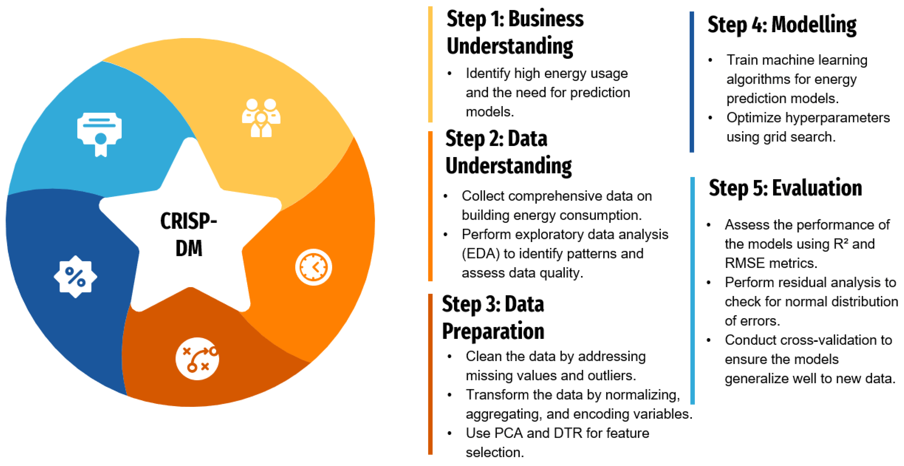

#### 3.1.1. Business Understanding 🎯

**What problem are we solving, and why does it matter to patient outcomes?**

- **Clinical Problem Definition:** Clear medical question with measurable outcomes
- **Stakeholder Alignment:** Clinicians, patients, administrators, regulators all on the same page
- **Success Metrics:** Clinical endpoints (mortality, quality of life) + operational metrics (cost, efficiency)
- **Ethical Framework:** IRB approval, patient consent, bias considerations from day one

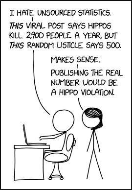

**Health Example:** "Can we predict which COVID-19 patients will need ICU admission within 24 hours using readily available lab values and vital signs?"

#### 3.1.2. Data Understanding 📊

**What data do we have, and what are its quirks?**

- **Data Sources:** EHRs, imaging systems, wearables, public health databases
- **Quality Assessment:** Missing patterns, accuracy issues, temporal inconsistencies
- **Privacy Compliance:** PHI identification, de-identification verification
- **Scale Assessment:** When do we need distributed computing? (>32GB RAM, >4 hour analyses)

**Integration Point:** This is where you decide if your dataset needs the distributed computing tools from Section 1.

#### 3.1.3. Experimental Design 🔬

**How do we set up the study to actually answer our question?**

- **Study Type:** RCT vs. observational design based on feasibility and ethics
- **Power Analysis:** Sample size calculations using expected effect sizes
- **Randomization Strategy:** Simple, block, or stratified randomization
- **Bias Prevention:** Blinding, allocation concealment, intention-to-treat principles

**Integration Point:** This is where you apply the experimental design principles from Section 2.

#### 3.1.4. Data Preparation ⚙️

**Getting data ready for analysis - the unglamorous but essential work.**

- **Missing Data Strategy:** MCAR/MAR/MNAR assessment, imputation methods
- **Feature Engineering:** Clinical risk scores, temporal features, derived biomarkers
- **Scaling Considerations:** When to use [`multiprocessing`](multiprocessing.py:1) for data preprocessing
- **Quality Control:** Outlier detection with clinical domain knowledge

#### 3.1.5. Modeling & Analysis 🤖

**Building predictive models or testing hypotheses.**

- **Algorithm Selection:** Interpretable (logistic regression) vs. complex (deep learning)
- **Distributed Training:** When to use Ray, Dask, or cluster computing
- **Statistical Testing:** t-tests, GLMs, survival analysis with multiple testing correction
- **Cross-Validation:** Temporal splits, patient-level splits, stratified CV

#### 3.1.6. Evaluation 📈

**How well does our solution actually work?**

- **Clinical Metrics:** Sensitivity/specificity at clinically relevant thresholds
- **Fairness Assessment:** Performance across demographic subgroups
- **External Validation:** Testing on different hospitals, time periods, populations
- **Error Analysis:** When and why does the model fail?

#### 3.1.7. Deployment 🚀

**Getting research results into clinical practice.**

- **Infrastructure:** Real-time APIs, batch processing, edge deployment
- **Clinical Integration:** EHR alerts, dashboard displays, workflow embedding
- **Monitoring:** Performance tracking, data drift detection, safety surveillance
- **Regulatory:** FDA approval pathway, clinical validation studies

#### 3.1.8. Communication 📢

**Translating technical results for different audiences.**

- **Clinical Reports:** Focus on patient outcomes and workflow impact
- **Research Publications:** Methodology, validation studies, reproducible results
- **Stakeholder Dashboards:** Real-time monitoring, key performance indicators
- **Documentation:** Code repositories, model cards, ethical considerations

#### 3.1.9. Maintenance & Iteration 🔄

**Keeping the system working and improving over time.**

- **Model Retraining:** Scheduled updates, trigger-based retraining
- **Performance Monitoring:** Accuracy drift, fairness degradation, clinical outcomes
- **Version Control:** Model versioning, rollback procedures, A/B testing new versions
- **Continuous Learning:** Feedback loops, user experience studies, clinical outcome tracking

### 3.2. Integrated Example: Gene Expression Transplant Study 🧬💻

Let's walk through a concrete example that shows how distributed computing and experimental design work together in a real health data science project.

#### 3.2.1. The Research Question 🎯

**Scenario:** We want to identify genetic biomarkers that predict organ transplant rejection using gene expression data from 10,000+ patients across multiple medical centers.

**Why This Needs Both Skills:**

- **Distributed Computing:** 10,000 patients × 20,000 genes = 200 million data points
- **Experimental Design:** Need proper controls, multiple testing correction, validation strategies

#### 3.2.2. Study Design & Implementation 🔬💻

**Design:** Retrospective cohort, 8,000 patients, acute rejection outcome within 1 year. Key considerations: multiple testing correction for 20,000 genes, control for age/sex/organ type/center effects.

**Distributed Processing:** 500GB data, 128GB+ RAM needs, 48+ hour runtime.

**SLURM Array Job:**

```bash
#SBATCH --array=1-20 --cpus-per-task=16 --mem=64G --time=12:00:00
python transplant_analysis.py --organ_type $ORGAN_TYPE --threads $SLURM_CPUS_PER_TASK
```

**Key Python Implementation:**

```python
import multiprocessing as mp
from sklearn.linear_model import LogisticRegression
from statsmodels.stats.multitest import multipletests

def analyze_gene_cohort(args):
    gene_name, expression_data, rejection_status, covariates = args
    X = np.column_stack([expression_data[gene_name], covariates])
    model = LogisticRegression().fit(X, rejection_status)
    return {'gene': gene_name, 'p_value': calculate_p_value(model)}

# Parallel analysis
with mp.Pool() as pool:
    results = pool.map(analyze_gene_cohort, analysis_args)
results_df = pd.DataFrame(results)

# Multiple testing correction
_, p_corrected, _, _ = multipletests(results_df['p_value'], method='fdr_bh')
```

**Success Factors:** Clear communication, realistic scope, robust statistical methods, quality checks, modular design for flexibility.

### 3.3. Additional Project Templates 📋

**Clinical Trials:** Web-based randomization with stratification, REDCap integration, interim analysis with stopping rules, distributed Cox regression.

**EHR Population Studies:** Distributed querying across health systems, parallel propensity score matching, survival analysis with competing risks.

**Medical Imaging:** Distributed DICOM preprocessing, multi-GPU training, cross-site validation, real-time clinical inference.

---

## Conclusion: Your Health Data Science Journey Continues 🌟

Congratulations! You've completed a comprehensive tour of health data science that covers everything from Python basics to distributed computing, from simple visualizations to complex experimental designs. But here's the secret: this isn't the end of your journey - it's just the beginning of the really exciting part.

### What You've Accomplished 🏆

Over these 10 lectures, you've built a toolkit that would make any health data scientist jealous:

**Technical Skills:**

- **Programming Fluency:** Python, SQL, and command-line tools
- **Data Analysis:** From pandas to Polars, from statistics to machine learning
- **Specialized Domains:** Time series, NLP, computer vision, and deep learning
- **Visualization & Communication:** Interactive dashboards, automated reports, and compelling presentations
- **Distributed Computing:** Scaling analyses beyond your laptop to handle real-world data volumes
- **Experimental Design:** Designing studies that actually answer the questions you're asking

**Professional Skills:**

- **Scientific Thinking:** Moving from correlation to causation with proper experimental design
- **Ethical Awareness:** Understanding IRB requirements, HIPAA compliance, and bias prevention
- **Project Management:** Using CRISP-DM to organize complex health data science projects
- **Stakeholder Communication:** Translating technical results for clinical and executive audiences

### The Reality Check: What Comes Next 🚀

Here's what seasoned health data scientists want you to know:

**You'll Never Stop Learning (And That's the Fun Part!)** 📚

- New tools emerge constantly (remember when transformers didn't exist?)
- Health data keeps getting bigger and more complex
- Regulations and ethical standards evolve
- The coolest projects combine skills you haven't even heard of yet

**Your First Real Project Will Be Messier Than Our Clean Examples** 🙃


- Data will be missing in creative ways you never imagined
- Stakeholders will change requirements mid-project (guaranteed)
- Your brilliant algorithm will fail in production for reasons that make no sense
- You'll spend 80% of your time on data cleaning and stakeholder management (and that's normal!)

**You're Now Dangerous in the Best Possible Way** ⚡

- You can ask better questions than people without statistical training
- You can scale analyses beyond what most researchers thought possible
- You understand both the power and limitations of AI in healthcare
- You can bridge the communication gap between clinicians and engineers

### The Path Forward: From Student to Professional 🛤️

**Immediate Next Steps (Next 6 Months):**

1. **Build a Portfolio:** Create 2-3 real health data projects using capstone or public datasets
2. **Join the Community:** Attend health data science meetups, conferences, join online forums
3. **Specialize:** Pick one domain (genomics, imaging, EHR analysis) for deeper focus
4. **Practice Communication:** Present your work to non-technical audiences

**Medium-Term Goals (1-2 Years):**

1. **Gain Domain Expertise:** Shadow clinicians, take biology courses, understand the healthcare system
2. **Professional Certification:** Consider certifications in specific tools or domains
3. **Collaboration Skills:** Work on interdisciplinary teams with clinicians, engineers, and researchers
4. **Leadership Development:** Start mentoring junior data scientists

### The Bigger Picture: Why This Matters 🌍

You're entering health data science at an incredible moment in history:

**We're on the Verge of Breakthroughs:** AI-assisted drug discovery, personalized medicine, real-time pandemic response, digital therapeutics - the next decade will be transformative.

**Healthcare Needs You:** Hospitals are drowning in data but starving for insights. Your skills can literally save lives by helping clinicians make better decisions faster.

**The Problems Are Getting Bigger:** Climate change health impacts, aging populations, antibiotic resistance, health equity - these challenges require data scientists who understand both technology and healthcare.
